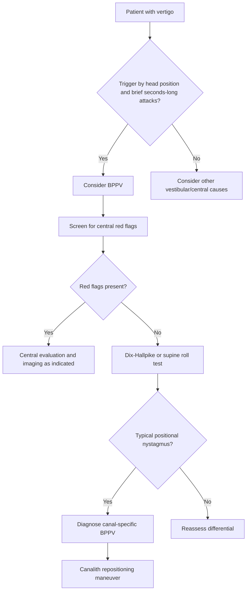
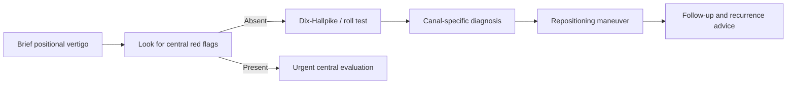

# Benign paroxysmal positional vertigo

Related: [[../Neurology MOC|Neurology MOC]] · [[../Vestibular Disorders|Vestibular Disorders]] · [[Peripheral vestibular disorders]] · [[Vestibular neuritis and labyrinthitis]] · [[Ménière disease]] · [[Central vertigo clue pattern]] · [[Nystagmus pattern basics]]

> [!important]
> BPPV is the **commonest cause of recurrent peripheral positional vertigo**. It produces **brief attacks of vertigo triggered by head position change** and is most often due to **otoconia displaced into a semicircular canal**, usually the **posterior canal**.

> [!tip]
> In exams, score highly by emphasizing the classic triad: **brief positional vertigo + characteristic positional nystagmus + response to canalith repositioning**.

## Learning Objectives
- Define BPPV and explain canalithiasis/cupulolithiasis.
- Review vestibular anatomy relevant to positional testing.
- Recognize the classic history and examination findings.
- Distinguish BPPV from vestibular neuritis, Ménière disease, vestibular migraine, and cerebellar stroke.
- Perform a bedside diagnostic and treatment approach using positional maneuvers.

## Definition
**Benign paroxysmal positional vertigo (BPPV)** is a peripheral vestibular disorder causing **brief recurrent spells of vertigo** provoked by changes in head position relative to gravity.

Key ideas:
- **Benign**: not malignant/infiltrative, though symptoms can be disabling.
- **Paroxysmal**: occurs in sudden short bursts.
- **Positional**: triggered by lying back, rolling in bed, looking up, bending down.

## Relevant Neuroanatomy
### Vestibular labyrinth anatomy
- **Semicircular canals** detect angular acceleration:
  - posterior canal
  - horizontal canal
  - anterior canal
- **Utricle** and **saccule** detect linear acceleration and gravity.
- Otoconia are calcium carbonate crystals normally attached to the utricle.
- The ampulla contains the **cupula** with hair cells whose deflection generates vestibular signals.

### Why posterior canal is most commonly affected
- Its dependent anatomical position makes it the most likely canal to collect dislodged otoconia.

## Relevant Neurophysiology
- Normal vestibular function relies on symmetric tonic firing from both labyrinths.
- Head movement changes endolymph flow → cupula deflection → altered vestibular nerve firing.
- In BPPV, displaced otoconia create **abnormal gravity-dependent endolymph movement**, giving a false sense of rotation.
- The resulting vestibulo-ocular reflex produces a **positionally triggered nystagmus**.

## Normal Values / Important Cut-offs
- Vertigo episodes in typical BPPV usually last **seconds to <1 minute**.
- Posterior canal Dix-Hallpike-induced nystagmus often has **short latency** and fatigability.
- Persistent nystagmus without fatigue, marked neurological signs, or severe inability to stand should prompt search for central causes.

## Classification
### By involved canal
1. **Posterior canal BPPV** — commonest
2. **Horizontal canal BPPV**
3. **Anterior canal BPPV** — uncommon

### By mechanism
1. **Canalithiasis** — free-floating otoconia; commonest
2. **Cupulolithiasis** — particles adherent to cupula; symptoms may be more persistent

## Etiology / Causes
- idiopathic/age-related degeneration of otolithic membrane
- head trauma
- post-viral vestibular disorder
- prolonged bed rest
- inner ear disease
- post-labyrinthitis state
- after ear surgery rarely

## Risk Factors
- older age
- female sex
- previous BPPV
- osteoporosis / reduced bone mineral density
- vitamin D deficiency in some studies
- recent minor head trauma
- recent vestibular insult

## Pathophysiology
1. Otoconia dislodge from the utricle.
2. Particles enter a semicircular canal, usually posterior.
3. Head position change causes abnormal particle movement.
4. Endolymph shifts inappropriately.
5. Hair cells send false vestibular signals.
6. Patient experiences brief rotational vertigo and positional nystagmus.

## Clinical Features
### Typical history
- sudden brief spinning sensation
- brought on by:
  - turning in bed
  - getting out of bed
  - looking up
  - bending over
- nausea may accompany attacks
- between attacks patient may feel normal or mildly off balance

### Features that support BPPV
- no persistent focal neurological deficit
- no sustained hearing loss as the main feature
- no prolonged continuous vertigo lasting days
- reproducible positional trigger

### Examination clues
- often normal when still
- positional testing provokes vertigo and nystagmus
- no long-tract signs, limb ataxia, diplopia, dysarthria, or severe central ocular motor abnormalities in uncomplicated BPPV

## Approach / Algorithm

## Investigations
### Usually a bedside diagnosis
BPPV is primarily diagnosed from:
- classic history
- positional testing
- compatible nystagmus pattern

### Positional tests
#### Dix-Hallpike maneuver
Best for posterior canal BPPV.
Typical findings:
- brief latency
- intense vertigo
- torsional/upbeating nystagmus
- fatigability
- adaptation with repetition

#### Supine roll test
Useful when horizontal canal BPPV is suspected.

### When imaging is needed
Imaging is **not routine** in classic BPPV but is needed if:
- focal neurological signs
- severe gait ataxia out of proportion
- central nystagmus pattern
- persistent new headache or other CNS symptoms
- vascular risk profile with central vertigo concern

## Interpretation Frameworks
### Bedside vertigo interpretation
| Feature | BPPV | Vestibular neuritis | Ménière disease | Central vertigo/stroke |
|---|---|---|---|---|
| Duration | Seconds | Hours to days | Minutes to hours | Variable, often persistent |
| Trigger | Positional | Often spontaneous, worsened by movement | Episodic, not purely positional | May be spontaneous |
| Hearing symptoms | Usually absent | Absent | Tinnitus/fullness/hearing loss common | Usually absent |
| Positional nystagmus | Typical | Not classic BPPV pattern | Usually not classic | May be atypical/non-fatigable |
| Neuro signs | No | No central signs | No central signs | Often present or subtle ocular motor clues |

### Nystagmus interpretation in posterior canal BPPV
- torsional + upbeating nystagmus on Dix-Hallpike strongly supports posterior canal involvement
- immediate persistent pure vertical nystagmus suggests a central cause, not typical BPPV

## Diagnosis
Diagnosis is clinical when there is:
- brief recurrent positional vertigo
- a compatible positional trigger pattern
- positive Dix-Hallpike or roll test with expected nystagmus
- no better central explanation

## Differential Diagnosis
- vestibular neuritis
- Ménière disease
- vestibular migraine
- cerebellar stroke/TIA
- orthostatic hypotension
- presyncope
- cervical dizziness (overdiagnosed; use caution)
- anxiety-associated dizziness

## Tables / Comparison Charts
| Feature | BPPV | Vestibular migraine | Ménière disease |
|---|---|---|---|
| Vertigo duration | Seconds | Minutes-hours | 20 min to hours |
| Trigger | Position change | Variable | Usually spontaneous |
| Headache association | Not necessary | Common | Not defining |
| Hearing loss | No | Usually no | Common fluctuating |
| Best treatment | Repositioning maneuver | Migraine management | Salt/lifestyle + ENT/vestibular plan |

## Management
### First-line treatment
**Canalith repositioning maneuver** is the key treatment.
- Posterior canal BPPV: **Epley maneuver** commonly used.
- Horizontal canal BPPV: barbecue/Lempert-type maneuvers depending on pattern.

### Supportive measures
- explain benign nature and recurrence possibility
- reassure that symptoms are mechanical and often rapidly treatable
- short-term antiemetic if nausea is severe
- vestibular suppressants are **not** the main treatment and should not replace repositioning

### Follow-up
- symptoms often improve after one or a few maneuvers
- persistent symptoms require reconsideration of canal involved or alternative diagnosis
- recurrent cases may benefit from vestibular rehab and review for risk factors such as osteoporosis/vitamin D deficiency

## Drug Interactions / Contraindications / Comorbidity Cautions
- Avoid overusing vestibular suppressants because they may delay vestibular compensation and do not correct the mechanical cause.
- In elderly patients, sedating drugs may worsen falls risk.
- Cervical spine disease, vertebrobasilar insufficiency concern, severe orthopnoea, or unstable cardiorespiratory state may limit positional maneuvers.

## Procedures / Indications / Contraindications
### Dix-Hallpike maneuver
- **Indication:** suspected posterior canal BPPV
- **Caution/relative contraindication:** severe cervical instability, high-grade carotid/vertebral concern, severe back problems

### Epley maneuver
- **Indication:** confirmed or strongly suspected posterior canal BPPV
- **Goal:** move otoconia from posterior canal back to utricle

## Procedure Mini-Sections
### Dix-Hallpike test
- Seat patient, turn head 45° to one side, lay back rapidly with neck extension.
- Observe eyes for nystagmus and ask about vertigo.
- A classic positive test supports posterior canal BPPV.

### Epley maneuver
- Sequential head/body position changes are used after a positive Dix-Hallpike.
- Hold each position long enough for symptoms/nystagmus to settle.
- Reassess symptoms after maneuver.

## Complications
BPPV itself is benign, but complications include:
- falls
- fear of movement
- anxiety
- reduced mobility in older adults
- missed central diagnosis if assessment is poor

## Red Flags / Emergencies
- persistent severe vertigo not just brief spells
- new diplopia, dysarthria, dysphagia, limb weakness, numbness, or ataxia
- severe occipital headache or other stroke clue
- non-fatigable vertical nystagmus
- inability to walk independently due to suspected central pathology

## Prognosis
- Often excellent with repositioning maneuvers.
- Recurrence is common but manageable.
- Persistent or atypical cases require reevaluation.

## Topic Correlation
- [[Vestibular neuritis and labyrinthitis]]
- [[Ménière disease]]
- [[Approach to dizziness and vertigo]]
- [[Timing-triggers framework]]
- [[Nystagmus pattern basics]]
- [[Central vertigo clue pattern]]

## Special Situations
- **Older adults:** falls risk may dominate; treat early.
- **Post-traumatic BPPV:** may involve multiple canals and recur.
- **Migraineurs:** vestibular migraine can mimic BPPV.
- **Limited neck mobility:** modify maneuvers or refer for assisted vestibular assessment.

## FCPS/MRCP High-Yield Points
- Commonest peripheral positional vertigo.
- Episodes are **brief**, usually **seconds**.
- Best bedside test: **Dix-Hallpike**.
- Best treatment: **Epley maneuver** for posterior canal disease.
- Hearing loss is not a prominent defining feature in simple BPPV.
- Always exclude central red flags.

## Common Viva Questions
- What is BPPV?
- Why is the posterior canal most commonly involved?
- How do you perform and interpret the Dix-Hallpike test?
- How do you distinguish BPPV from cerebellar stroke?
- What is the treatment maneuver for posterior canal BPPV?

## Common Confusions / Exam Traps
- Calling any vertigo on movement “BPPV” without asking duration and trigger.
- Missing central ocular motor signs.
- Over-ordering imaging in classic BPPV but under-ordering it in atypical cases.
- Using prolonged vestibular suppressants instead of repositioning.
- Confusing Ménière disease or vestibular migraine with BPPV.

## Mnemonics
- **BPPV** = **B**rief **P**ositional **P**aroxysmal **V**ertigo
- **Posterior canal clues:** **T-U-B**
  - **T**orsional nystagmus
  - **U**pbeating component
  - **B**rief attacks

## Mind Map
- BPPV
  - Cause
    - dislodged utricular otoconia
    - posterior canal commonest
  - Symptoms
    - brief spinning
    - rolling in bed
    - looking up
  - Diagnosis
    - Dix-Hallpike
    - positional nystagmus
  - Differential
    - vestibular neuritis
    - Ménière disease
    - vestibular migraine
    - stroke
  - Treatment
    - Epley maneuver
    - reassurance
    - recurrence counseling

## Flowchart

## Suggested Visuals / Image Notes
- Diagram of utricle and semicircular canals
- Epley maneuver stepwise sequence
- Posterior canal positional nystagmus sketch

## Suggested Video References
- Look for: “Dix Hallpike and Epley maneuver demonstration”
- Look for: “peripheral vs central vertigo bedside differentiation”
- Look for: “BPPV MRCP neurology revision”

## One-Page Revision Summary
- **BPPV** = brief recurrent vertigo triggered by head position changes.
- Cause: **otoconia in semicircular canal**, usually posterior canal.
- History: rolling in bed, lying back, looking up.
- Diagnosis: **Dix-Hallpike** with brief vertigo + torsional/upbeating nystagmus.
- Treatment: **Epley maneuver**.
- Avoid overreliance on vestibular suppressants.
- Red flags for central cause: persistent symptoms, focal deficits, vertical/non-fatigable nystagmus, severe ataxia.

## 24-Hour Recall Prompts
- Define BPPV in one sentence.
- Why is posterior canal disease most common?
- What are the classic trigger symptoms?
- What does a positive Dix-Hallpike look like?
- Name three central red flags.

## 7-Day / 15-Day / 30-Day Revision Tracker
- **Day 1:** Reproduce the Dix-Hallpike interpretation.
- **Day 7:** Compare BPPV with vestibular neuritis and stroke.
- **Day 15:** Write Epley steps from memory.
- **Day 30:** Solve 5 vertigo SBAs without notes.

## Must Know / Should Know / Nice to Know
### Must Know
- brief positional vertigo
- Dix-Hallpike
- Epley maneuver
- central red flags

### Should Know
- horizontal canal BPPV concept
- cupulolithiasis vs canalithiasis
- recurrence factors

### Nice to Know
- osteoporosis/vitamin D association
- less common anterior canal disease

## My Weak Points
- Do I confuse BPPV with vestibular migraine?
- Can I describe the nystagmus pattern confidently?
- Do I remember maneuver-based treatment rather than just tablets?

## Self-Test Scorecard
- Definition and mechanism: __/10
- Bedside diagnosis: __/10
- Differential diagnosis: __/10
- Management maneuver recall: __/10
- Viva confidence: __/10

## Exam Answer Modes
- **Long answer:** definition, anatomy, pathophysiology, diagnosis, differential, treatment.
- **Short note:** BPPV clinical features and management.
- **Viva:** “How would you test and treat a patient who gets vertigo on turning in bed?”

## Summary
BPPV is a **mechanical peripheral vestibular disorder** due to **dislodged otoconia**, usually in the posterior canal. It causes **brief positional vertigo**, is diagnosed clinically by **positional testing**, and is treated best with **canalith repositioning maneuvers**, while central red flags must always be excluded.

## MCQs (10)
1. The commonest canal involved in BPPV is:
   - A. Anterior canal
   - B. Posterior canal
   - C. Cochlear duct
   - D. Saccule only
   - E. Eustachian tube

2. A typical BPPV attack usually lasts:
   - A. Seconds
   - B. 6 hours
   - C. 24 hours
   - D. Several weeks continuously
   - E. Entire day without fluctuation

3. The best bedside test for posterior canal BPPV is:
   - A. Romberg test
   - B. Hallpike-Dix maneuver
   - C. Babinski sign
   - D. Hoover sign
   - E. Snellen chart

4. The usual pathological basis of BPPV is:
   - A. Demyelination of vestibular nerve
   - B. Dislodged otoconia in a semicircular canal
   - C. Brainstem infarction
   - D. High CSF protein
   - E. Meningeal irritation

5. Best initial treatment for posterior canal BPPV is:
   - A. Long-term betahistine only
   - B. Epley maneuver
   - C. Dopamine agonist
   - D. Lumbar puncture
   - E. High-dose steroid

6. Which feature suggests a central rather than peripheral cause of positional vertigo?
   - A. Brief attacks on rolling in bed
   - B. Torsional fatigable nystagmus
   - C. New diplopia and severe gait ataxia
   - D. Improvement after Epley
   - E. Normal hearing

7. Hearing loss is classically:
   - A. A defining feature of simple BPPV
   - B. Usually absent or not prominent
   - C. Always profound
   - D. Mandatory for diagnosis
   - E. Bilateral in all cases

8. Horizontal canal BPPV is best looked for using:
   - A. Supine roll test
   - B. Finger-nose test
   - C. JVP measurement
   - D. Kernig sign
   - E. Ankle jerk

9. Which is a risk factor for BPPV recurrence?
   - A. Osteoporosis
   - B. Hypermetropia
   - C. Appendicitis
   - D. Psoriasis only
   - E. Peptic ulcer disease

10. Which statement about BPPV is correct?
   - A. Imaging is always mandatory
   - B. It is commonly due to displaced otoconia and often responds to repositioning maneuvers
   - C. It usually presents with persistent unilateral weakness
   - D. It is a central demyelinating disease
   - E. Epley maneuver is contraindicated in all patients

## SBA Questions (10)
1. A 62-year-old woman develops brief spinning sensation whenever she turns in bed to the right. Between episodes she is nearly normal. What is the most likely diagnosis?
   - A. Vestibular neuritis
   - B. BPPV
   - C. Cerebellar infarction
   - D. Meningitis
   - E. Temporal lobe epilepsy

2. A patient has brief vertigo on looking up. Dix-Hallpike provokes torsional upbeating nystagmus. What is the best next step?
   - A. Start thrombolysis
   - B. Perform Epley maneuver
   - C. Lumbar puncture immediately
   - D. Give long-term diazepam only
   - E. Start carbamazepine

3. A man with vertigo has dysarthria, limb ataxia, and non-fatigable vertical nystagmus. What is the best interpretation?
   - A. Classic posterior canal BPPV
   - B. Central vertigo until proven otherwise
   - C. Ménière disease only
   - D. Simple anxiety
   - E. Otitis externa

4. A 70-year-old woman has recurrent BPPV. Which factor may be associated with recurrence?
   - A. Osteoporosis
   - B. Nephrotic syndrome
   - C. Hyperthyroidism only
   - D. Varicose veins
   - E. Appendicitis

5. Which symptom pattern most strongly supports BPPV over vestibular neuritis?
   - A. Continuous vertigo for 3 days
   - B. Brief attacks triggered by head movement
   - C. High fever and neck stiffness
   - D. Progressive hemiparesis
   - E. Continuous tinnitus and hearing loss with no positional trigger

6. A patient with neck instability cannot safely undergo standard Dix-Hallpike. What is the correct principle?
   - A. Force the maneuver anyway
   - B. Modify or defer maneuvers and assess safely
   - C. Diagnose stroke automatically
   - D. Treat with chemotherapy
   - E. Ignore the complaint

7. Which statement best explains BPPV pathophysiology?
   - A. Persistent CSF leakage causes vertigo
   - B. Otoconia cause abnormal endolymph movement in a semicircular canal
   - C. Cortical spreading depression is the main mechanism
   - D. Substantia nigra degeneration is the cause
   - E. Raised intracranial pressure is essential

8. A patient has classic BPPV but asks for tablets only. What is the best response?
   - A. Tablets are the definitive mechanical cure
   - B. Repositioning maneuvers are the main treatment; tablets only support symptoms if needed
   - C. Antibiotics are mandatory
   - D. Sedatives should be used long-term in all cases
   - E. No treatment helps

9. Which bedside sign most strongly supports posterior canal BPPV?
   - A. Torsional upbeating nystagmus on Dix-Hallpike
   - B. Babinski sign
   - C. Neck rigidity
   - D. Homonymous hemianopia
   - E. Areflexia

10. A patient remains continuously vertiginous with new occipital headache and inability to walk. What should be done?
   - A. Reassure as simple BPPV
   - B. Evaluate urgently for central pathology
   - C. Prescribe only vitamin tablets
   - D. Diagnose Ménière disease without examination
   - E. Avoid all further assessment

## Flashcards
- Q: What is the commonest canal involved in BPPV?
  A: Posterior semicircular canal.
- Q: Typical duration of a BPPV attack?
  A: Seconds, usually less than a minute.
- Q: Best bedside test for posterior canal BPPV?
  A: Dix-Hallpike maneuver.
- Q: Best treatment for posterior canal BPPV?
  A: Epley canalith repositioning maneuver.
- Q: Main pathophysiology of BPPV?
  A: Displaced utricular otoconia within a semicircular canal.
- Q: Does simple BPPV usually cause hearing loss?
  A: No, not as a defining feature.
- Q: Name one major central red flag in vertigo assessment.
  A: Diplopia, dysarthria, limb ataxia, or non-fatigable vertical nystagmus.
- Q: What test is used for suspected horizontal canal BPPV?
  A: Supine roll test.
- Q: Are vestibular suppressants definitive therapy for BPPV?
  A: No, repositioning maneuvers are the main treatment.
- Q: What lifestyle issue matters especially in older BPPV patients?
  A: Falls prevention.

## Answer Key with Explanations
### MCQs
1. **B** — posterior canal BPPV is the commonest form.
2. **A** — attacks are brief, usually seconds.
3. **B** — the Dix-Hallpike test is classic for posterior canal disease.
4. **B** — displaced otoconia are the usual mechanism.
5. **B** — Epley maneuver is the main treatment for posterior canal BPPV.
6. **C** — focal brainstem/cerebellar signs point toward central vertigo.
7. **B** — hearing loss is not a defining feature of simple BPPV.
8. **A** — horizontal canal disease is assessed with the roll test.
9. **A** — recurrence can be associated with osteoporosis/otolith vulnerability.
10. **B** — this is the core correct statement.

### SBAs
1. **B** — classic positional brief vertigo strongly suggests BPPV.
2. **B** — positive Dix-Hallpike with typical nystagmus should be followed by repositioning.
3. **B** — vertical non-fatigable nystagmus plus neuro signs = central until proven otherwise.
4. **A** — osteoporosis is a recognized association.
5. **B** — brief positional spells are the classic BPPV pattern.
6. **B** — safety comes first; maneuvers can be modified or deferred.
7. **B** — abnormal endolymph movement from otoconia explains the disease.
8. **B** — tablets may help nausea but do not reposition otoconia.
9. **A** — this is the classic posterior canal sign.
10. **B** — continuous severe vertigo with headache and gait failure requires urgent central evaluation.
