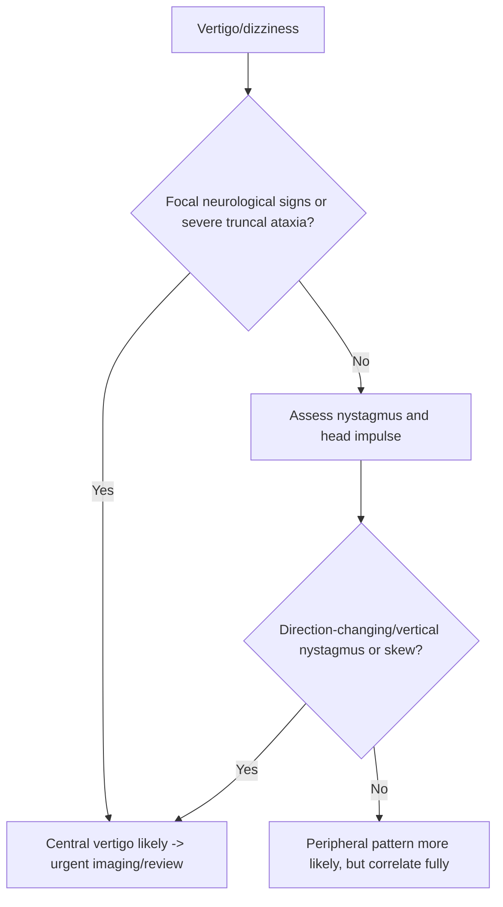

# Central vertigo clue pattern

Related: [[../Neurology MOC|Neurology MOC]] · [[../Vestibular Disorders|Vestibular Disorders]] · [[Central vestibular disorders]] · [[Brainstem and cerebellar causes of vertigo]] · [[Vestibular neuritis and labyrinthitis]] · [[Nystagmus pattern basics]]

> [!important]
> Missing **central vertigo** is dangerous. In neurology exams, the key task is to separate **peripheral vestibular syndromes** from **brainstem/cerebellar or other central causes**, because central vertigo may signal life-threatening posterior fossa disease.

> [!tip]
> A strong FCPS/MRCP answer emphasizes: **continuous vertigo with focal neurological signs, severe truncal ataxia, skew deviation, direction-changing or vertical nystagmus, dysarthria, diplopia, or central headache/brainstem clues suggests a central cause.**

## Learning Objectives
- Recognize the bedside clues favoring central over peripheral vertigo.
- Understand the neuroanatomy underlying central vestibular symptoms.
- Use nystagmus pattern, gait, cranial nerve findings, and HINTS-style logic safely.
- Know when urgent neuroimaging is needed.
- Avoid dangerous misclassification of central vertigo as benign peripheral disease.

## Definition
**Central vertigo clue pattern** refers to a constellation of findings suggesting vertigo arises from a lesion in the:
- brainstem
- cerebellum
- central vestibular pathways
rather than the peripheral labyrinth or vestibular nerve.

## Relevant Neuroanatomy
### Central vestibular structures
- vestibular nuclei in brainstem
- cerebellar flocculus/nodulus and cerebellar connections
- brainstem ocular motor pathways
- cerebellopontine and posterior fossa networks
- long tracts and cranial nerve pathways near vestibular structures

### Why central disease has more than “vertigo”
Because central vestibular structures lie close to:
- ocular motor pathways
- cerebellar coordination systems
- corticospinal and sensory tracts
- lower cranial nerve nuclei

So central vertigo often comes with additional neurological signs.

## Relevant Neurophysiology
- Peripheral vestibular lesions create asymmetry from the labyrinth or vestibular nerve.
- Central lesions distort processing of vestibular signals and eye-movement control.
- This can produce:
  - atypical nystagmus
  - severe gait/truncal instability
  - ocular misalignment/skew
  - brainstem symptoms such as diplopia or dysarthria

## Normal Values / Important Cut-offs
This topic is pattern-based, but these practical rules matter:
- **Vertical or direction-changing nystagmus** is concerning for central disease.
- **Skew deviation** suggests central pathology.
- **Inability to sit or stand unsupported** is a major red flag.
- Acute vestibular syndrome with **normal head impulse** may indicate central pathology in the right context.

## Classification
### Common central vertigo mechanism groups
1. cerebellar lesion pattern
2. brainstem lesion pattern
3. demyelinating central vestibular syndrome
4. central inflammatory/infective lesion
5. tumor/posterior fossa mass-related vertigo

## Etiology / Causes
Within Davidson Chapter 28-style neurology context, central vertigo may arise from:
- brainstem lesions
- cerebellar lesions
- demyelination
- tumor/posterior fossa mass
- encephalitic/inflammatory involvement

> [!note]
> Stroke belongs to the separate Stroke Medicine chapter, but clinically the bedside distinction between peripheral and central vertigo remains essential here because the recognition pattern is still a core neurology skill.

## Risk Factors
- known demyelinating disease
- tumor or posterior fossa symptoms
- immunocompromise or CNS infection risk
- older age or other central nervous system risk context
- prior neurological symptoms beyond simple vertigo

## Pathophysiology
Central lesions disrupt integration of vestibular signals with eye movements and balance pathways.
This leads to:
- unstable gaze holding
- abnormal central nystagmus patterns
- severe ataxia/truncal instability
- associated cranial nerve or long-tract signs

## Clinical Features
### Red-flag features favoring central vertigo
- diplopia
- dysarthria
- dysphagia
- facial numbness or weakness
- limb weakness or sensory change
- severe truncal ataxia
- new headache or occipital pain
- direction-changing gaze-evoked nystagmus
- vertical nystagmus
- skew deviation
- persistent vomiting with major imbalance disproportionate to peripheral signs

### Gait and stance clues
- patient unable to sit or stand unsupported
- ataxia far more severe than expected for simple peripheral neuritis
- limb or truncal cerebellar signs

### Cranial/brainstem clues
- diplopia
- internuclear ophthalmoplegia
- dysarthria/dysphagia
- crossed sensory-motor signs or facial involvement

## Distinguishing from Peripheral Vertigo
### Peripheral patterns are more likely when there is
- isolated vestibular syndrome
- unidirectional horizontal-torsional nystagmus
- abnormal head impulse in the correct context
- no focal neurological signs
- preserved sitting/standing with support and no major central clues

### Central patterns are more likely when there is
- direction-changing or vertical nystagmus
- skew deviation
- normal head impulse despite continuous acute vestibular syndrome
- severe ataxia or inability to walk
- other focal neurological deficits

## Approach / Algorithm

## Investigations
### Urgent evaluation when central concern exists
- full neurological examination
- MRI brain/posterior fossa preferred when feasible
- CT initially if urgent triage is needed or MRI unavailable
- additional investigations depending on suspected brainstem/cerebellar/inflammatory/infective pathology

### Bedside examination points
- eye movements
- test of skew
- nystagmus direction
- gait/stance
- cranial nerves
- cerebellar signs
- limb motor/sensory examination

## Interpretation Frameworks

## Central vs Peripheral Vertigo Table
| Feature | Peripheral | Central |
|---|---|---|
| Nystagmus | unidirectional horizontal-torsional | vertical, direction-changing, gaze-evoked possible |
| Head impulse | often abnormal in acute peripheral loss | may be normal |
| Skew deviation | absent | may be present |
| Truncal ataxia | mild-moderate | may be severe/inability to sit/stand |
| Focal neuro signs | absent | often present |
| Hearing clues | may support labyrinthine disease | usually not the key issue |

## Central Red Flag Table
| Red flag | Why important |
|---|---|
| Diplopia/dysarthria/dysphagia | brainstem involvement |
| Severe truncal ataxia | cerebellar/central pattern |
| Vertical nystagmus | central ocular-motor clue |
| Skew deviation | central clue |
| Sensory/motor long-tract signs | non-peripheral localization |
| Severe headache/occipital pain | posterior fossa/CNS concern |

## HINTS-Style Reminder Table
| Bedside sign | Central concern |
|---|---|
| Head impulse | normal in acute vestibular syndrome can be central |
| Nystagmus | direction-changing / vertical |
| Test of skew | positive |

> [!warning]
> HINTS is powerful only in the right clinical syndrome and with proper examination skill. It should not replace full neurological reasoning.

## Diagnosis
Diagnosis is clinical-pattern based first:
- “This vertigo pattern is central because there is diplopia, severe truncal ataxia, and direction-changing nystagmus.”
- “Peripheral vertigo is unlikely because of clear focal neurological signs.”

## Differential Diagnosis
Within this neurology framework, think of:
- brainstem lesion
- cerebellar lesion
- demyelinating disease
- posterior fossa tumor/mass effect
- encephalitic/inflammatory central lesion

Also contrast with peripheral causes:
- [[Benign paroxysmal positional vertigo]]
- [[Vestibular neuritis and labyrinthitis]]
- [[Ménière disease]]

## Tables / Comparison Charts

## Nystagmus Comparison Table
| Nystagmus pattern | Interpretation |
|---|---|
| Unidirectional horizontal-torsional | peripheral more likely |
| Direction-changing with gaze | central concern |
| Pure vertical | central concern |
| Complex ocular motor abnormalities | central concern |

## Practical Scenario Table
| Scenario | Most likely interpretation |
|---|---|
| Acute vertigo + diplopia + ataxia | central |
| Continuous vertigo + no hearing loss + abnormal head impulse + no focal signs | peripheral neuritis more likely |
| Brief positional vertigo only | BPPV more likely |
| Recurrent vertigo + auditory symptoms | Ménière/labyrinthine pattern more likely |

## Management
### If central vertigo is suspected
- treat as urgent neurological syndrome
- arrange urgent imaging and specialist review
- monitor airway/swallowing and neurological status if brainstem concern exists
- investigate for mass/inflammatory/infective/demyelinating cause

### Safety principle
Do **not** reassure as benign peripheral vertigo if there are central red flags.

## Drug Interactions / Contraindications / Comorbidity Cautions
- Vestibular suppressants may relieve symptoms but must not delay recognition of central pathology.
- Sedating antiemetics can cloud the examination.
- Immunocompromised or known-neoplasm patients need a lower threshold for imaging and escalation.

## Procedures / Indications / Contraindications
### MRI brain/posterior fossa
- **Indication:** central vertigo clues, focal signs, severe ataxia, unexplained persistent acute vestibular syndrome
- **Reason:** better evaluation of brainstem/cerebellar and posterior fossa pathology

### Swallow assessment
- **Indication:** dysarthria/dysphagia/brainstem concern
- **Reason:** aspiration prevention

## Procedure Mini-Sections
### Test of skew
- **Use:** look for vertical ocular misalignment
- **Meaning:** positive test supports central pathology
- **Pearl:** helpful only as part of a full acute vestibular syndrome exam

### Gait/stance challenge
- **Use:** assess severity of truncal instability
- **Meaning:** inability to sit or stand unsupported strongly suggests central disease
- **Pearl:** severe truncal ataxia is not a reassuring feature

## Complications
- missed posterior fossa disease
- aspiration if bulbar involvement is overlooked
- falls and injury
- delayed treatment of central inflammatory, infective, or mass lesions
- deterioration from unrecognized raised ICP/posterior fossa compression

## Red Flags / Emergencies
- diplopia, dysarthria, dysphagia
- vertical or direction-changing nystagmus
- positive skew deviation
- severe truncal ataxia or inability to sit/stand
- limb weakness or hemisensory deficit
- severe headache/occipital pain with vertigo
- altered consciousness or brainstem signs

## Prognosis
Prognosis depends on the underlying central cause. Early recognition improves outcomes by accelerating correct imaging, ICU/neurosurgical input when needed, and disease-specific treatment.

## Topic Correlation
- [[Vestibular neuritis and labyrinthitis]]
- [[Benign paroxysmal positional vertigo]]
- [[Ménière disease]]
- [[Nystagmus pattern basics]]
- [[When imaging is needed in vertigo]]
- [[Brainstem and cerebellar causes of vertigo]]

## Special Situations
### Older patient with acute vestibular syndrome
Do not assume peripheral disease without deliberate central screening.

### Demyelinating disease
Central vertigo may arise from brainstem/cerebellar plaques.

### Posterior fossa mass or infection
Headache, vomiting, ataxia, or cranial nerve findings demand urgent escalation.

## FCPS/MRCP High-Yield Points
- Central vertigo often has **other neurological signs**.
- Vertical/direction-changing nystagmus is central until proven otherwise.
- Severe truncal ataxia is a major red flag.
- Brainstem ocular/bulbar signs point away from benign peripheral causes.

## Common Viva Questions
- How do you distinguish central from peripheral vertigo?
- What nystagmus patterns are concerning for central disease?
- What is skew deviation?
- When is urgent MRI needed in vertigo?
- Why is severe inability to stand important?

## Common Confusions / Exam Traps
- calling all acute vertigo “labyrinthitis”
- ignoring diplopia/dysarthria because vertigo dominates the story
- overusing symptom suppressants before adequate examination
- misapplying HINTS outside the right syndrome
- treating severe truncal ataxia as benign anxiety-related dizziness

## Mnemonics
### Central vertigo warnings
**“DVS-ATAXIA”**
- **D**iplopia/dysarthria
- **V**ertical or variable nystagmus
- **S**kew deviation
- **A**taxia severe
- **T**racts/limb signs
- **A**ltered neuro exam
- **X**tra cranial nerve signs
- **I**maging urgently
- **A**void false reassurance

## Mind Map
- Central vertigo clues
  - eye signs
    - vertical nystagmus
    - gaze-evoked change
    - skew
  - brainstem signs
    - diplopia
    - dysarthria
    - dysphagia
  - cerebellar signs
    - severe ataxia
    - cannot sit/stand
  - localization
    - brainstem
    - cerebellum
    - central vestibular pathways

## Suggested Visuals / Image Notes
- Table of central vs peripheral vertigo clues
- Diagram of brainstem and cerebellar vestibular pathways
- Nystagmus pattern comparison graphic

## Suggested Video References
- HINTS and acute vestibular syndrome teaching videos
- Brainstem/cerebellar examination tutorials
- Neuro-otology central vertigo case discussions

## One-Page Revision Summary
### Central vertigo clues
- focal neuro signs
- severe truncal ataxia
- vertical/direction-changing nystagmus
- skew deviation
- normal head impulse in acute vestibular syndrome may be concerning
- headache/brainstem/bulbar signs

### Peripheral vertigo clues
- isolated vestibular symptoms
- unidirectional horizontal-torsional nystagmus
- no focal signs
- abnormal head impulse in peripheral loss pattern

### Safety rule
**Do not label vertigo benign if the neurological examination is not benign.**

## Recall Prompts
### 24-hour recall prompts
- List 5 features favoring central vertigo.
- What nystagmus patterns are most worrying?
- What does skew deviation imply?
- Why is inability to stand important?
- How does central vertigo differ from vestibular neuritis?

### 7-day / 15-day / 30-day revision tracker
- **7 days:** compare central vs peripheral vertigo from memory.
- **15 days:** explain HINTS logic and limitations.
- **30 days:** answer a full viva on central vertigo red flags.

## Must Know / Should Know / Nice to Know
### Must Know
- focal neurological signs
- vertical/direction-changing nystagmus
- skew deviation
- severe truncal ataxia

### Should Know
- HINTS-style triad
- bulbar/brainstem caution signs
- posterior fossa imaging importance

### Nice to Know
- finer neuro-otologic ocular motor localizing nuances

## My Weak Points
- Do I always examine cranial nerves in vertigo?
- Do I remember skew and severe ataxia?
- Do I over-reassure when imaging is actually needed?

## Self-Test Scorecard
- Red-flag recognition /10
- Nystagmus interpretation /10
- Localization skill /10
- Imaging urgency judgment /10
- Viva confidence /10

Interpretation:
- **<35/50** = weak
- **35-44/50** = acceptable
- **45+/50** = strong

## Exam Answer Modes
### Short note
List the bedside clues that distinguish central from peripheral vertigo.

### Viva mode
Start with focal signs, nystagmus pattern, skew, and truncal ataxia.

### Ward-case mode
State explicitly whether the syndrome is safe to regard as peripheral or requires urgent central imaging.

## Summary
Central vertigo is recognized not just by dizziness but by the **company it keeps**: focal neurological signs, severe ataxia, abnormal central nystagmus patterns, skew deviation, and other brainstem/cerebellar features. These clues should trigger urgent neurological imaging and escalation.

## MCQs (10)
1. Which feature most strongly favors central vertigo?
   - A. Brief vertigo when rolling in bed only
   - B. Vertical nystagmus
   - C. Recurrent tinnitus with ear fullness only
   - D. Positional vertigo lasting seconds
   - E. Normal neurological examination

2. Severe inability to sit or stand unsupported in a dizzy patient should raise concern for:
   - A. Simple BPPV only
   - B. Central cerebellar/brainstem pathology
   - C. Pure ear wax problem
   - D. Tension headache only
   - E. Restless legs syndrome

3. Which bedside sign suggests central pathology in acute vestibular syndrome?
   - A. Positive Dix-Hallpike only
   - B. Skew deviation
   - C. Ear fullness alone
   - D. Isolated nausea alone
   - E. Positional trigger alone

4. Which nystagmus pattern is most concerning for central disease?
   - A. Unidirectional horizontal-torsional
   - B. Direction-changing gaze-evoked
   - C. Fatigable positional nystagmus in classic BPPV only
   - D. Very brief positional nystagmus only
   - E. None at all

5. Which associated symptom most supports a central cause?
   - A. Diplopia
   - B. Tinnitus alone
   - C. Ear fullness alone
   - D. Brief provocation by turning in bed
   - E. Isolated motion sickness history

6. Which statement is correct?
   - A. Severe ataxia is reassuring for peripheral vertigo
   - B. Central vertigo often has focal neurological signs
   - C. Skew deviation suggests labyrinthitis
   - D. Vertical nystagmus is typical of BPPV
   - E. Imaging is never needed

7. Which is a common exam trap?
   - A. Checking gait and stance
   - B. Looking for cranial nerve signs
   - C. Labeling all acute vertigo as peripheral without full neurological exam
   - D. Using localization logic
   - E. Asking about diplopia

8. A patient with vertigo and dysarthria most likely has:
   - A. Central cause until proven otherwise
   - B. Simple Ménière disease only
   - C. BPPV only
   - D. Ear wax impaction
   - E. Tension headache only

9. Which bedside framework helps in acute vestibular syndrome when used correctly?
   - A. HINTS-style examination
   - B. Knee jerk only
   - C. Urine dipstick only
   - D. Spirometry only
   - E. Abdominal palpation only

10. Which principle is safest?
   - A. Suppress symptoms first and skip examination
   - B. If neurological signs are present, think central and image urgently
   - C. Hearing loss always proves central disease
   - D. Peripheral causes always cause severe inability to sit
   - E. Central vertigo never causes vomiting

## SBA Questions (10)
1. A 62-year-old patient presents with continuous vertigo, vomiting, diplopia, and severe truncal ataxia. Best interpretation:
   - A. Benign peripheral vertigo
   - B. Central vertigo pattern requiring urgent imaging
   - C. Ménière disease only
   - D. BPPV only
   - E. Functional tremor

2. A patient with acute vestibular syndrome has a normal head impulse, direction-changing nystagmus, and skew deviation. Best conclusion:
   - A. Peripheral vestibular neuritis is confirmed
   - B. Central pathology is strongly suggested
   - C. BPPV is certain
   - D. No imaging is required
   - E. Symptoms are functional by default

3. A dizzy patient cannot sit unsupported and has slurred speech. What is the safest next principle?
   - A. Treat as simple labyrinthitis and discharge
   - B. Urgently assess as central vertigo with neuroimaging pathway
   - C. Give long-term vestibular suppressants only
   - D. Ignore the speech change
   - E. Diagnose Ménière disease immediately

4. Which finding is least consistent with a benign peripheral syndrome?
   - A. Vertical nystagmus
   - B. Vertigo worsened by movement
   - C. Nausea
   - D. Vomiting
   - E. Sense of spinning

5. A patient has vertigo with facial numbness and limb ataxia. The best localization family is:
   - A. Central vestibular / brainstem-cerebellar
   - B. Pure cochlear disease
   - C. Simple BPPV
   - D. Ménière disease only
   - E. Ear canal disorder

6. Why is severe truncal ataxia a major warning sign?
   - A. It suggests central cerebellar involvement rather than simple peripheral vertigo
   - B. It always occurs in BPPV
   - C. It proves ear infection
   - D. It means no examination is needed
   - E. It excludes imaging

7. Which history/exam combination best favors peripheral neuritis over central vertigo?
   - A. Continuous vertigo, abnormal head impulse, no focal neurological signs
   - B. Diplopia and skew deviation
   - C. Direction-changing nystagmus and dysarthria
   - D. Vertical nystagmus and severe ataxia
   - E. Limb weakness and facial numbness

8. What is skew deviation?
   - A. Vertical ocular misalignment suggesting central pathology
   - B. A type of hearing loss
   - C. A lumbar root sign
   - D. A vestibular suppressant side effect
   - E. A cardiac murmur

9. A patient has vertigo, occipital headache, vomiting, and inability to walk. Best concern:
   - A. Central posterior fossa syndrome
   - B. Simple BPPV
   - C. Ménière disease only
   - D. Ear wax
   - E. Functional sensory symptoms only

10. Which statement best summarizes central vertigo clues?
   - A. They depend only on nausea severity
   - B. They include focal neurological signs, severe ataxia, abnormal central nystagmus, and skew
   - C. They are identical to BPPV
   - D. They never need MRI
   - E. They always include hearing loss

## Flashcards
- Q: Which nystagmus patterns strongly suggest central vertigo?
  A: Vertical or direction-changing gaze-evoked nystagmus.

- Q: What does skew deviation imply?
  A: Central pathology affecting ocular alignment pathways.

- Q: What gait clue is especially worrying in vertigo?
  A: Inability to sit or stand unsupported due to severe truncal ataxia.

- Q: What associated symptoms strongly support a central cause?
  A: Diplopia, dysarthria, dysphagia, facial numbness, limb weakness, or sensory changes.

- Q: Does severe vomiting alone distinguish central from peripheral vertigo?
  A: No, associated focal signs and exam pattern matter more.

- Q: What bedside framework may help in acute vestibular syndrome?
  A: A correctly performed HINTS-style examination.

- Q: Which nearby note covers prolonged peripheral vertigo without hearing loss?
  A: [[Vestibular neuritis and labyrinthitis]].

- Q: Which nearby note covers recurrent auditory-associated peripheral vertigo?
  A: [[Ménière disease]].

- Q: What is the safest rule in suspected central vertigo?
  A: If the neurological exam is abnormal, think central and image urgently.

- Q: Why is central vertigo dangerous to miss?
  A: It may reflect serious brainstem, cerebellar, inflammatory, infective, or mass lesions.

## Answer Key with Explanations
### MCQs
1. **B. Vertical nystagmus** — strong central clue.
2. **B. Central cerebellar/brainstem pathology** — severe truncal ataxia is not reassuring.
3. **B. Skew deviation** — central ocular-motor clue.
4. **B. Direction-changing gaze-evoked** — concerning central nystagmus pattern.
5. **A. Diplopia** — focal brainstem-type sign.
6. **B. Central vertigo often has focal neurological signs** — correct principle.
7. **C. Labeling all acute vertigo as peripheral without full neurological exam** — dangerous trap.
8. **A. Central cause until proven otherwise** — dysarthria is a major warning sign.
9. **A. HINTS-style examination** — helpful when correctly applied.
10. **B. If neurological signs are present, think central and image urgently** — safest approach.

### SBAs
1. **B. Central vertigo pattern requiring urgent imaging** — classic red flags.
2. **B. Central pathology is strongly suggested** — the HINTS-style combination is high risk.
3. **B. Urgently assess as central vertigo with neuroimaging pathway** — safest management principle.
4. **A. Vertical nystagmus** — most inconsistent with benign peripheral disease.
5. **A. Central vestibular / brainstem-cerebellar** — facial numbness and limb ataxia support central localization.
6. **A. It suggests central cerebellar involvement rather than simple peripheral vertigo** — correct reasoning.
7. **A. Continuous vertigo, abnormal head impulse, no focal neurological signs** — more compatible with peripheral neuritis.
8. **A. Vertical ocular misalignment suggesting central pathology** — definition.
9. **A. Central posterior fossa syndrome** — major concern.
10. **B. They include focal neurological signs, severe ataxia, abnormal central nystagmus, and skew** — best summary.
