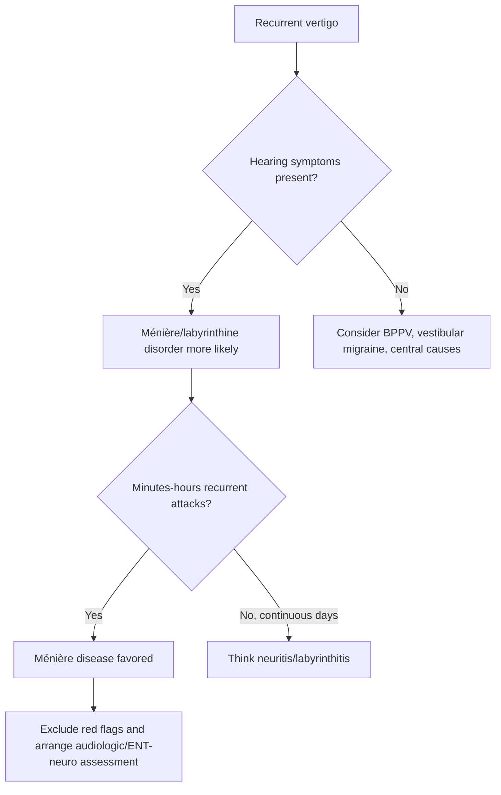

# Ménière disease

Related: [[../Neurology MOC|Neurology MOC]] · [[../Vestibular Disorders|Vestibular Disorders]] · [[Peripheral vestibular disorders]] · [[Benign paroxysmal positional vertigo]] · [[Vestibular neuritis and labyrinthitis]] · [[Central vertigo clue pattern]]

> [!important]
> Ménière disease is characterized by **recurrent episodic vertigo**, **fluctuating sensorineural hearing loss**, **tinnitus**, and often **aural fullness**. It is a classic FCPS/MRCP differential for recurrent spontaneous vertigo with auditory symptoms.

> [!tip]
> The exam distinction is simple: **BPPV is brief and positional**, **vestibular neuritis is prolonged continuous**, while **Ménière disease causes recurrent attacks lasting minutes to hours with hearing symptoms**.

## Learning Objectives
- Define Ménière disease and explain endolymphatic hydrops.
- Recognize the classic symptom tetrad.
- Differentiate Ménière disease from BPPV, vestibular neuritis/labyrinthitis, vestibular migraine, and central causes.
- Know key management principles and red flags.
- Understand the long-term hearing implications.

## Definition
**Ménière disease** is a peripheral inner-ear disorder causing recurrent attacks of spontaneous vertigo associated with fluctuating cochlear symptoms, especially:
- sensorineural hearing loss
- tinnitus
- aural fullness

The underlying mechanism is classically linked to **endolymphatic hydrops**.

## Relevant Neuroanatomy
### Inner ear structures involved
- cochlea: hearing
- vestibule and semicircular canals: balance
- endolymphatic system: fluid homeostasis within membranous labyrinth

### Why both hearing and balance symptoms occur
Because the inner ear contains both cochlear and vestibular apparatus, pathology in the labyrinth can produce **combined vertigo and auditory symptoms**.

## Relevant Neurophysiology
- Normal vestibular and auditory function requires stable endolymph composition and pressure.
- In Ménière disease, disordered endolymph handling/hydrops disturbs labyrinthine function episodically.
- This causes transient mismatch in vestibular signaling and fluctuating cochlear dysfunction.
- Over time, recurrent attacks may leave more persistent hearing impairment.

## Normal Values / Important Cut-offs
- Vertigo attacks typically last **minutes to hours**, not just seconds.
- Hearing loss is often **fluctuating early** and may become more permanent later.
- Brief purely positional vertigo argues more for **BPPV**.
- Continuous severe vertigo for days argues more for **vestibular neuritis/labyrinthitis** than classic Ménière disease.

## Classification
### Clinical staging concept
1. early disease with intermittent attacks and fluctuating hearing loss
2. established disease with recurrent spells and more obvious cochlear symptoms
3. late disease with more persistent hearing deficit and residual imbalance

### Differential spectrum to distinguish
1. Ménière disease
2. vestibular migraine
3. recurrent labyrinthine disorders
4. central episodic vertigo syndromes

## Etiology / Causes
The exact cause is often uncertain, but classical pathophysiology centers on **endolymphatic hydrops**.

Associations/theories include:
- abnormal endolymph regulation
- autoimmune or inflammatory influences in some cases
- migraine overlap in some patients
- familial tendency in a minority

## Risk Factors
- middle adulthood commonly affected
- migraine association in some patients
- family history in some cases
- pre-existing inner-ear vulnerability in selected cases

## Pathophysiology
1. endolymph pressure/volume dysregulation develops
2. labyrinthine function becomes unstable episodically
3. vertigo attacks occur from vestibular dysfunction
4. cochlear involvement causes tinnitus, fullness, and fluctuating hearing loss
5. repeated episodes may lead to chronic hearing impairment

## Clinical Features
### Classic symptom complex
- recurrent spontaneous vertigo
- fluctuating hearing loss
- tinnitus
- aural fullness

### Vertigo pattern
- attacks recur episodically
- often lasts **20 minutes to several hours**
- nausea and vomiting may occur
- patient may be asymptomatic or mildly imbalanced between attacks

### Hearing pattern
- often unilateral initially
- may fluctuate early
- may worsen progressively over time
- low-frequency sensorineural loss is classically emphasized in teaching

### Tinnitus/fullness
- roaring or buzzing tinnitus may occur
- ear pressure/fullness is common in many classic descriptions

## Distinguishing from Other Diagnoses
### Versus BPPV
- Ménière: spontaneous recurrent attacks with hearing symptoms
- BPPV: brief positional spells, no primary hearing loss

### Versus vestibular neuritis
- Ménière: recurrent discrete episodes
- neuritis: one major prolonged episode over hours-days, usually no hearing loss

### Versus labyrinthitis
- labyrinthitis: acute prolonged vertigo with hearing loss, usually inflammatory acute syndrome
- Ménière: recurrent episodic inner-ear syndrome

### Versus vestibular migraine
- migraine history, photophobia, phonophobia, visual aura, and less consistent hearing loss may suggest vestibular migraine

### Versus central vertigo
- focal neurological signs, central nystagmus, severe persistent truncal ataxia, or atypical progression suggest central causes

## Approach / Algorithm

## Investigations
### Clinical assessment
- detailed vertigo history: duration, recurrence, triggers
- hearing symptom review
- otological symptoms and migraine history
- neurological examination to exclude central signs

### Useful investigations
- audiometry to document sensorineural hearing loss
- MRI if atypical features or central pathology must be excluded
- ENT/audiovestibular assessment when diagnosis remains uncertain

## Interpretation Frameworks

## Ménière Disease Feature Table
| Feature | Typical pattern |
|---|---|
| Vertigo | recurrent spontaneous episodes |
| Duration | minutes to hours |
| Hearing loss | fluctuating sensorineural, often unilateral early |
| Tinnitus | common |
| Aural fullness | common |

## Differential Vertigo Table
| Disorder | Duration | Trigger | Hearing symptoms |
|---|---|---|---|
| BPPV | seconds | positional | absent |
| Vestibular neuritis | hours-days continuous | spontaneous, worsened by movement | absent |
| Labyrinthitis | hours-days continuous | spontaneous | present |
| Ménière disease | recurrent minutes-hours | spontaneous | present |
| Central vertigo | variable | variable | usually absent, but central red flags present |

## Hearing-Clue Table
| Hearing feature | Interpretation |
|---|---|
| Fluctuating hearing loss with recurrent vertigo | Ménière favored |
| No hearing loss | think neuritis/BPPV/central migraine patterns instead |
| Persistent major hearing loss after acute prolonged syndrome | labyrinthitis or another otologic process may be stronger differential |

## Diagnosis
Ménière disease is usually a **clinical syndrome diagnosis**, supported by:
- recurrent episodic vertigo
- fluctuating cochlear symptoms
- no better alternative explanation
- supportive audiometry when available

## Differential Diagnosis
- [[Benign paroxysmal positional vertigo]]
- [[Vestibular neuritis and labyrinthitis]]
- vestibular migraine
- acoustic/otologic disease
- central vestibular disorders
- transient ischemic posterior circulation events in selected patients

## Tables / Comparison Charts

## Ménière vs Vestibular Migraine
| Feature | Ménière disease | Vestibular migraine |
|---|---|---|
| Hearing loss | common/fluctuating | less typical as a defining feature |
| Tinnitus/fullness | common | may occur but less central |
| Migraine history | variable | often prominent |
| Vertigo | recurrent attacks | recurrent attacks |

## Attack Pattern Comparison
| Pattern | Most likely diagnosis |
|---|---|
| Seconds on rolling in bed | BPPV |
| Continuous severe vertigo for 2 days after viral illness | Vestibular neuritis |
| Recurrent vertigo with tinnitus and fluctuating hearing | Ménière disease |
| Vertigo with diplopia/dysarthria | Central cause |

## Management
### Acute attack management
- rest and safety
- short-term antiemetic/vestibular suppressant if needed during severe attacks
- hydration if vomiting significant

### Long-term management principles
- ENT/audiovestibular follow-up
- trigger/lifestyle review as locally practiced
- management plans may include dietary and preventive strategies depending on local protocols
- hearing monitoring with audiometry

> [!note]
> Specific drug and dietary regimens vary by local practice. In FCPS/MRCP, emphasize principles: symptom control during attacks, specialist follow-up, hearing surveillance, and escalation if atypical or progressive.

## Drug Interactions / Contraindications / Comorbidity Cautions
- Prolonged vestibular suppressant use may delay vestibular compensation and worsen sedation/falls.
- Hearing symptoms should not be ignored in older patients or those with atypical attacks, as alternative otologic or central causes may exist.
- Migraine comorbidity may complicate the picture.

## Procedures / Indications / Contraindications
### Audiometry
- **Indication:** recurrent vertigo with hearing symptoms
- **Use:** helps document sensorineural hearing change and follow progression

### MRI brain/internal auditory pathways
- **Indication:** atypical symptoms, focal neurological signs, unilateral auditory symptoms with concerning features, diagnostic uncertainty

## Procedure Mini-Sections
### Hearing assessment follow-up
- **Indication:** ongoing or progressive auditory symptoms
- **Benefit:** documents fluctuation/progression and guides specialist care
- **Pearl:** hearing decline may outlast vertigo improvement

### Attack diary
- **Indication:** recurrent vertigo disorder
- **Benefit:** helps define duration, frequency, triggers, and hearing association
- **Pearl:** especially useful for differentiating Ménière from vestibular migraine or poorly described dizzy spells

## Complications
- progressive hearing loss
- recurrent disabling vertigo attacks
- falls/injury during attacks
- chronic imbalance in some patients
- anxiety and activity restriction

## Red Flags / Emergencies
- new focal neurological deficits
- persistent inability to stand between attacks
- continuous vertigo for days rather than episodic attacks
- atypical severe headache, diplopia, dysarthria, or limb signs
- severe unilateral hearing loss with concerning infection/otologic features

## Prognosis
- Many patients have recurrent attacks over years.
- Hearing may gradually worsen.
- Vertigo burden may fluctuate over time.
- Long-term outcome varies, so symptom tracking and hearing monitoring are important.

## Topic Correlation
- [[Benign paroxysmal positional vertigo]]
- [[Vestibular neuritis and labyrinthitis]]
- [[Central vertigo clue pattern]]
- [[Timing-triggers framework]]
- [[When imaging is needed in vertigo]]

## Special Situations
### Elderly patient
Do not blame all recurrent dizziness on Ménière disease without considering central and cardiovascular mimics.

### Migraine overlap
A patient may have migraine-associated vertigo features that complicate classical labeling.

### Progressive unilateral auditory symptoms
May need more focused otologic/neuro-otologic review rather than assuming straightforward Ménière disease.

## FCPS/MRCP High-Yield Points
- Ménière disease = recurrent vertigo + fluctuating hearing loss + tinnitus ± aural fullness.
- Distinguish by **duration** and **auditory symptoms**.
- BPPV is positional and brief; neuritis is prolonged and continuous.
- Central red flags must always be screened for.

## Common Viva Questions
- What is the classical triad/tetrad of Ménière disease?
- How do you differentiate Ménière disease from BPPV?
- How do you differentiate Ménière disease from vestibular neuritis?
- What is endolymphatic hydrops?
- Why is audiometry useful?

## Common Confusions / Exam Traps
- confusing Ménière disease with labyrinthitis
- forgetting hearing symptoms as the key differentiator
- calling every recurrent dizzy episode BPPV
- ignoring central neurological red flags

## Mnemonics
### Ménière disease core clue
**“Ménière Means the Ear Matters.”**
- recurrent **M**otion/spinning attacks
- **E**ar fullness/tinnitus
- fluctuating **H**earing loss

## Mind Map
- Ménière disease
  - recurrent spontaneous vertigo
  - hearing loss
  - tinnitus
  - aural fullness
  - differential
    - BPPV
    - neuritis/labyrinthitis
    - vestibular migraine
    - central vertigo

## Suggested Visuals / Image Notes
- Comparison table of peripheral vertigo syndromes
- Inner ear anatomy diagram showing cochlea + vestibular labyrinth
- Attack-pattern timeline chart for BPPV vs Ménière vs neuritis

## Suggested Video References
- Neuro-otology/ENT teaching on recurrent vertigo syndromes
- Audiogram interpretation basics
- Vestibular differential diagnosis tutorials

## One-Page Revision Summary
### Core syndrome
- recurrent spontaneous vertigo
- fluctuating hearing loss
- tinnitus
- aural fullness

### Key differentials
- **BPPV:** seconds, positional, no hearing loss
- **Neuritis:** one prolonged attack, no hearing loss
- **Labyrinthitis:** acute prolonged attack + hearing loss
- **Central:** focal deficits/central nystagmus/major gait red flags

### Key exam line
“Ménière disease is suggested by recurrent episodic vertigo with fluctuating auditory symptoms due to presumed endolymphatic hydrops.”

## Recall Prompts
### 24-hour recall prompts
- State the classic symptom complex of Ménière disease.
- How long do attacks usually last compared with BPPV?
- What feature separates Ménière disease from vestibular neuritis?
- Which test documents the hearing deficit?
- What central red flags should make you reconsider the diagnosis?

### 7-day / 15-day / 30-day revision tracker
- **7 days:** compare BPPV, Ménière, and neuritis from memory.
- **15 days:** write the syndrome definition and differentials without notes.
- **30 days:** answer a viva on recurrent vertigo with hearing symptoms.

## Must Know / Should Know / Nice to Know
### Must Know
- recurrent vertigo + fluctuating hearing loss + tinnitus
- duration distinction from BPPV and neuritis
- need for audiometry and red-flag screening

### Should Know
- endolymphatic hydrops concept
- long-term hearing decline risk

### Nice to Know
- more detailed specialist preventive interventions and invasive therapies

## My Weak Points
- Do I remember to ask about hearing loss and tinnitus?
- Can I separate recurrent from continuous vertigo syndromes clearly?
- Do I overlook vestibular migraine or central mimics?

## Self-Test Scorecard
- Syndrome recognition /10
- Differential diagnosis /10
- Auditory clue recall /10
- Management principles /10
- Viva confidence /10

Interpretation:
- **<35/50** = weak
- **35-44/50** = acceptable
- **45+/50** = strong

## Exam Answer Modes
### Short note
Define Ménière disease, give the symptom tetrad, and compare with BPPV and vestibular neuritis.

### Viva mode
Start with recurrent vertigo plus fluctuating cochlear symptoms, then list major differentials.

### Ward-case mode
Frame the case as a recurrent peripheral vestibular syndrome with auditory involvement.

## Summary
Ménière disease is a high-yield peripheral vestibular disorder defined by recurrent vertigo with fluctuating hearing symptoms. The practical exam value lies in distinguishing it from **BPPV**, **vestibular neuritis/labyrinthitis**, and **central vertigo** by the combination of **attack duration** and **auditory involvement**.

## MCQs (10)
1. Ménière disease classically includes:
   - A. Recurrent vertigo with fluctuating hearing loss and tinnitus
   - B. Brief positional vertigo without hearing symptoms
   - C. Continuous vertigo for 5 days with no hearing loss
   - D. Pure limb weakness
   - E. Aphasia and hemiparesis

2. Which mechanism is classically linked to Ménière disease?
   - A. Endolymphatic hydrops
   - B. Epidural hemorrhage
   - C. Demyelination only
   - D. Cauda equina compression
   - E. Myasthenic block

3. Which feature best differentiates Ménière disease from BPPV?
   - A. Hearing symptoms and longer recurrent attacks
   - B. Presence of nausea
   - C. Any nystagmus
   - D. Dizziness in general
   - E. Imbalance only

4. Ménière attacks typically last:
   - A. Seconds only
   - B. Minutes to hours
   - C. Several weeks continuously
   - D. Only while standing
   - E. Less than 1 second

5. Which investigation is especially useful to document Ménière-related hearing change?
   - A. Audiometry
   - B. Spirometry
   - C. Colonoscopy
   - D. Bone marrow biopsy
   - E. Visual acuity only

6. Which symptom combination most strongly suggests Ménière disease?
   - A. Positional vertigo + no hearing loss
   - B. Recurrent vertigo + tinnitus + fluctuating hearing loss
   - C. Diplopia + dysarthria + ataxia
   - D. Distal numbness + areflexia
   - E. Fever + neck stiffness

7. Continuous severe vertigo lasting several days is more suggestive of:
   - A. Typical Ménière disease
   - B. Vestibular neuritis/labyrinthitis
   - C. BPPV
   - D. Tension headache
   - E. Carpal tunnel syndrome

8. Aural fullness in a patient with recurrent vertigo most supports:
   - A. Ménière disease
   - B. Thoracic myelopathy
   - C. Bell palsy
   - D. ALS
   - E. Polyneuropathy

9. Which is a common exam trap?
   - A. Asking about tinnitus
   - B. Comparing duration of attacks
   - C. Calling every dizzy patient BPPV
   - D. Screening for central red flags
   - E. Ordering audiometry when needed

10. Which feature should make you think of a central rather than simple Ménière diagnosis?
   - A. Diplopia and dysarthria during the episode
   - B. Tinnitus
   - C. Aural fullness
   - D. Fluctuating hearing loss
   - E. Recurrent vertigo

## SBA Questions (10)
1. A 42-year-old man has recurrent attacks of spinning lasting 2 hours with roaring tinnitus and fluctuating left-sided hearing loss. Most likely diagnosis:
   - A. Ménière disease
   - B. BPPV
   - C. Vestibular neuritis
   - D. Myasthenia gravis
   - E. Cauda equina syndrome

2. A 56-year-old woman has brief vertigo for 15 seconds when rolling in bed, with no hearing symptoms. Most likely diagnosis:
   - A. Ménière disease
   - B. BPPV
   - C. Labyrinthitis
   - D. Vestibular neuritis
   - E. Central pontine lesion necessarily

3. A patient presents with continuous severe vertigo and vomiting for 3 days after a viral illness, but no hearing loss. Most likely diagnosis:
   - A. Ménière disease
   - B. Vestibular neuritis
   - C. BPPV
   - D. Functional weakness
   - E. Temporal arteritis

4. Which test best helps support cochlear involvement in recurrent vertigo syndrome?
   - A. Audiometry
   - B. ECG only
   - C. CK level only
   - D. ESR only
   - E. Nerve conduction study

5. A patient with recurrent vertigo also has diplopia and limb ataxia. Best interpretation:
   - A. Typical Ménière disease
   - B. Central pathology must be considered urgently
   - C. BPPV only
   - D. Vestibular neuritis only
   - E. Ménière disease excludes central disease

6. Which symptom is most characteristic of Ménière disease rather than vestibular neuritis?
   - A. Fluctuating hearing loss
   - B. Nausea
   - C. Imbalance
   - D. Vertigo worsened by head movement
   - E. Unsteadiness

7. A patient reports recurrent spontaneous vertigo with ear fullness but no clear hearing history. What should be specifically asked next?
   - A. Presence of tinnitus and fluctuating hearing loss
   - B. Toenail growth rate
   - C. Bowel habit only
   - D. Shoulder pain only
   - E. Skin rash only

8. Which explanation of pathophysiology is classically associated with Ménière disease?
   - A. Endolymphatic hydrops
   - B. Peripheral nerve demyelination
   - C. Cortical seizure focus
   - D. Spinal cord compression
   - E. Extradural bleed

9. Why is a symptom diary useful in Ménière disease?
   - A. It helps define recurrence, duration, and hearing association of attacks
   - B. It treats the disease directly
   - C. It replaces all examination
   - D. It excludes central pathology automatically
   - E. It prevents all future attacks

10. Which statement best summarizes Ménière disease?
   - A. Brief positional vertigo without auditory symptoms
   - B. Continuous days-long vertigo without hearing symptoms
   - C. Recurrent spontaneous vertigo with fluctuating auditory symptoms due to presumed inner-ear fluid dysregulation
   - D. Purely functional dizziness
   - E. A spinal cord syndrome

## Flashcards
- Q: What is the classic symptom complex of Ménière disease?
  A: Recurrent vertigo, fluctuating hearing loss, tinnitus, and often aural fullness.

- Q: What pathophysiologic concept is classically linked to Ménière disease?
  A: Endolymphatic hydrops.

- Q: How does Ménière differ from BPPV in duration?
  A: Ménière attacks last minutes to hours; BPPV attacks last seconds.

- Q: How does Ménière differ from vestibular neuritis?
  A: Ménière is recurrent with hearing symptoms; neuritis is usually one prolonged episode without hearing loss.

- Q: Which test helps document hearing loss in Ménière disease?
  A: Audiometry.

- Q: What auditory symptom often accompanies Ménière disease?
  A: Tinnitus.

- Q: What symptom should make you reconsider a central diagnosis?
  A: Diplopia, dysarthria, or limb ataxia.

- Q: What bedside history point is high yield in recurrent vertigo?
  A: Duration of each attack.

- Q: Is hearing usually normal in classic Ménière disease?
  A: No, fluctuating hearing loss is a core clue.

- Q: Which nearby note contrasts with Ménière by causing brief positional vertigo?
  A: [[Benign paroxysmal positional vertigo]].

## Answer Key with Explanations
### MCQs
1. **A. Recurrent vertigo with fluctuating hearing loss and tinnitus** — the classic syndrome.
2. **A. Endolymphatic hydrops** — the standard teaching mechanism.
3. **A. Hearing symptoms and longer recurrent attacks** — major differentiator from BPPV.
4. **B. Minutes to hours** — typical pattern.
5. **A. Audiometry** — documents hearing involvement.
6. **B. Recurrent vertigo + tinnitus + fluctuating hearing loss** — classic clinical picture.
7. **B. Vestibular neuritis/labyrinthitis** — continuous days-long syndrome is less typical of Ménière.
8. **A. Ménière disease** — aural fullness is a classic supporting clue.
9. **C. Calling every dizzy patient BPPV** — common mistake.
10. **A. Diplopia and dysarthria during the episode** — central red flags.

### SBAs
1. **A. Ménière disease** — classic recurrent auditory-vestibular syndrome.
2. **B. BPPV** — brief positional spells with no hearing symptoms.
3. **B. Vestibular neuritis** — prolonged continuous vertigo after viral illness, hearing spared.
4. **A. Audiometry** — best test to support hearing involvement.
5. **B. Central pathology must be considered urgently** — focal neurological signs are not typical of simple Ménière disease.
6. **A. Fluctuating hearing loss** — key distinction.
7. **A. Presence of tinnitus and fluctuating hearing loss** — crucial next history detail.
8. **A. Endolymphatic hydrops** — classical explanation.
9. **A. It helps define recurrence, duration, and hearing association of attacks** — clinically useful.
10. **C. Recurrent spontaneous vertigo with fluctuating auditory symptoms due to presumed inner-ear fluid dysregulation** — best summary.

## PasTest Scenario SBAs (Clinical Vignettes)

> **Auto-generated PasTest/Mediscope-style scenario SBAs** grounded in the authored source. Each scenario tests a real clinical fact (triad, specific sign, contraindication, trial, first-line Rx) extracted from the topic. *Source: Ch 27: Neurology & Stroke — Ménière disease*

**Q1.** Which of the following features is most specific or characteristic of Ménière disease?

  - **A.** B. Minutes to hours
  - **B.** A feature common to many acute inflammatory conditions
  - **C.** A non-specific sign that does not localise the diagnosis
  - **D.** An investigation finding rather than a clinical feature

  > **Answer: A** — B. Minutes to hours
  >
  > *Source:* **B. Minutes to hours** — typical pattern

**Q2.** In the management of Ménière disease, which of the following should be avoided or is contraindicated?

  - **A.** be ignored in older patients or those (avoid in atypical attacks)
  - **B.** Standard guideline-directed first-line therapy
  - **C.** Routine supportive care (fluids, oxygen, monitoring)
  - **D.** Symptom-directed treatment as needed

  > **Answer: A** — be ignored in older patients or those (avoid in atypical attacks)
  >
  > *Source:* - Hearing symptoms should not be ignored in older patients or those with atypical attacks, as alternative otologic or central causes may exist

