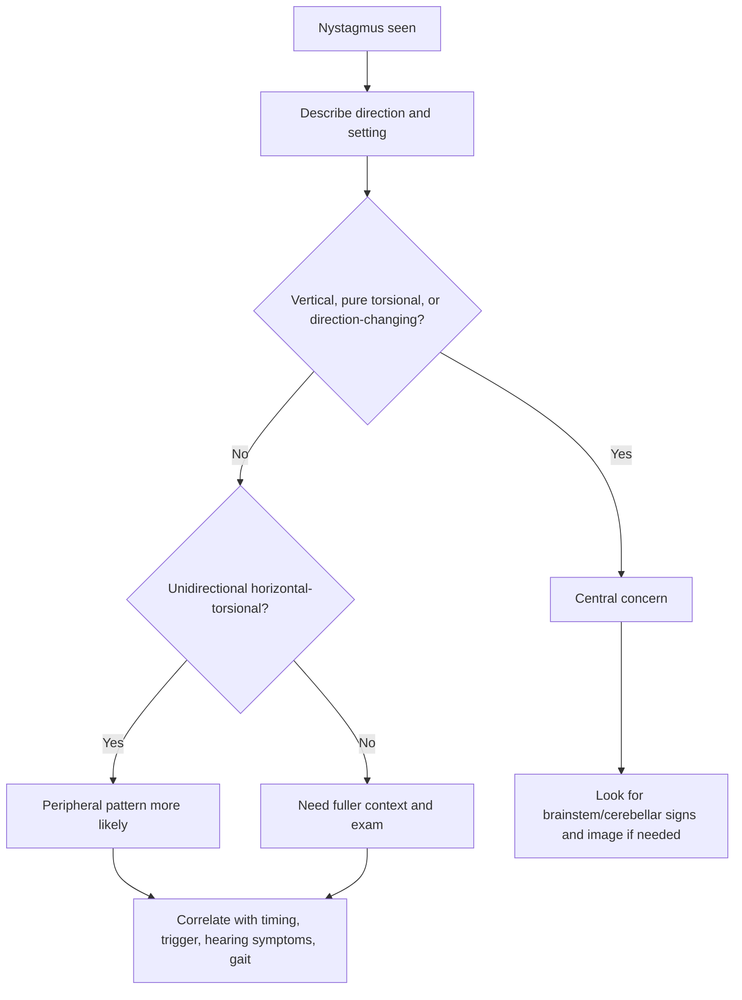

# Nystagmus pattern basics

Related: [[../Neurology MOC|Neurology MOC]] · [[../Vestibular Disorders|Vestibular Disorders]] · [[Approach to dizziness and vertigo]] · [[Timing-triggers framework]] · [[Benign paroxysmal positional vertigo]] · [[Vestibular neuritis and labyrinthitis]] · [[Central vertigo clue pattern]] · [[When imaging is needed in vertigo]]

> [!important]
> **Nystagmus** is one of the highest-yield bedside clues in vertigo. In exams, you score marks by describing **direction, trigger, gaze effect, fatigability, fixation suppression, and associated neurological signs**.

> [!tip]
> A simple exam rule: **unidirectional horizontal-torsional nystagmus** usually suggests a **peripheral vestibular lesion**, while **vertical, pure torsional, or direction-changing gaze-evoked nystagmus** suggests a **central cause** until proved otherwise.

## Learning Objectives
- Define nystagmus and describe its major bedside patterns.
- Understand the vestibulo-ocular reflex and why vestibular asymmetry produces nystagmus.
- Differentiate peripheral from central nystagmus patterns.
- Recognize positional nystagmus patterns seen in BPPV.
- Use nystagmus findings safely with the rest of the neurological examination.

## Definition
**Nystagmus** is an involuntary rhythmic oscillation of the eyes, usually with:
- a **slow phase** generated by pathological drift, and
- a **fast corrective phase** in the opposite direction.

Clinically, nystagmus is usually named by the direction of the **fast phase**.

## Relevant Neuroanatomy
### Peripheral structures
- semicircular canals
- utricle and saccule
- vestibular nerve

### Central structures
- vestibular nuclei in brainstem
- medial longitudinal fasciculus
- cerebellar flocculus and nodulus
- ocular motor nuclei and gaze-holding networks

### Why lesions produce nystagmus
A lesion anywhere in the vestibular-ocular network can disturb balanced eye-position control, causing repetitive eye drift and correction.

## Relevant Neurophysiology
- The **vestibulo-ocular reflex (VOR)** stabilizes gaze during head movement.
- Symmetric vestibular firing keeps gaze balanced.
- A unilateral vestibular lesion causes tonic imbalance, producing spontaneous nystagmus and vertigo.
- Central gaze-holding failure can produce gaze-evoked or direction-changing nystagmus.
- Visual fixation often suppresses peripheral vestibular nystagmus better than central nystagmus.

## Normal Values / Important Cut-offs
There are no universal numeric cut-offs for bedside nystagmus interpretation, but these pattern rules are high-yield:
- **Unidirectional horizontal-torsional nystagmus** → often peripheral
- **Vertical nystagmus** → central until proved otherwise
- **Direction-changing gaze-evoked nystagmus** → central until proved otherwise
- **Pure torsional nystagmus** → concerning for central pathology
- **Fixation suppression present** → supports peripheral origin
- **Severe truncal ataxia with atypical nystagmus** → major central warning pattern

## Classification
### By timing
1. spontaneous nystagmus
2. gaze-evoked nystagmus
3. positional nystagmus
4. head-shaking induced nystagmus

### By direction
1. horizontal
2. vertical (upbeat/downbeat)
3. torsional
4. mixed horizontal-torsional

### By localization pattern
1. peripheral vestibular nystagmus
2. central vestibular/cerebellar nystagmus
3. positional canal-specific nystagmus

## Etiology / Causes
### Peripheral vestibular causes
- vestibular neuritis
- labyrinthitis
- BPPV
- Ménière disease
- other unilateral vestibular lesions

### Central causes
- cerebellar lesions
- brainstem lesions
- demyelinating disease
- drug/toxic or degenerative ocular-motor disorders
- posterior fossa mass/inflammatory lesions

## Risk Factors
- recent viral vestibular illness
- recurrent positional vertigo history
- known neurological disease
- posterior fossa symptoms
- medication or alcohol effects in some settings
- older age when central causes are possible

## Pathophysiology
1. Vestibular or gaze-holding imbalance develops.
2. The eyes drift slowly toward the pathologic side or along the pathologic vector.
3. The brain generates rapid corrective saccades.
4. Repetition produces rhythmic oscillation recognized as nystagmus.

## Clinical Features
### What to describe in any exam
When you see nystagmus, describe:
- spontaneous or only provoked
- direction
- whether unidirectional or direction-changing
- whether horizontal, vertical, torsional, or mixed
- whether gaze to one side increases it
- whether fixation suppresses it
- whether it fatigues
- whether it is positional
- whether other focal neurological signs are present

### Peripheral pattern features
- usually horizontal-torsional
- usually unidirectional
- increases when gazing in fast-phase direction (Alexander law)
- often suppressed by visual fixation
- associated vertigo/nausea common
- no major focal neurological deficit in isolated peripheral disease

### Central pattern features
- vertical nystagmus
- direction-changing gaze-evoked nystagmus
- pure torsional nystagmus
- poor fixation suppression
- associated diplopia, dysarthria, ataxia, sensory-motor signs, or other brainstem/cerebellar clues

### Positional patterns
- BPPV classically causes positional nystagmus provoked by Dix-Hallpike or roll testing
- posterior canal BPPV often causes **torsional upbeating** nystagmus
- horizontal canal BPPV often causes **horizontal positional** nystagmus

## Approach / Algorithm

## Investigations
### Bedside first
- observe in primary position
- observe on right and left gaze
- assess fixation suppression if possible
- assess positional provocation when appropriate
- correlate with gait, stance, cranial nerves, and cerebellar signs

### When additional work-up is needed
- MRI brain/posterior fossa if central concern exists
- CT if urgent triage is needed and MRI is not available
- targeted vestibular/ENT testing where indicated

## Interpretation Frameworks
### Peripheral vs central nystagmus table
| Feature | Peripheral pattern | Central pattern |
|---|---|---|
| Direction | usually unidirectional | may be direction-changing |
| Plane | horizontal-torsional common | vertical/pure torsional more concerning |
| Fixation suppression | often present | often poor |
| Gaze effect | may obey Alexander law | gaze-evoked/direction-changing possible |
| Other neuro signs | absent | often present |
| Truncal ataxia | mild-moderate | may be severe |

### BPPV positional pattern table
| Canal pattern | Typical nystagmus clue | Bedside context |
|---|---|---|
| Posterior canal BPPV | torsional upbeating | positive Dix-Hallpike |
| Horizontal canal BPPV | horizontal positional | roll test pattern |
| Central positional pattern | atypical/persistent/non-fatigable | central concern |

### Dangerous patterns to memorize
- **downbeat nystagmus** → central until proved otherwise
- **upbeat spontaneous nystagmus** → central concern
- **direction-changing gaze-evoked nystagmus** → central concern
- **skew + atypical nystagmus** → central concern

## Diagnosis
Nystagmus pattern alone does not equal a full diagnosis, but it can strongly support localization:
- “This is a **peripheral vestibular-type nystagmus**.”
- “This is a **central nystagmus pattern**.”
- “This is a **positional canal-specific pattern** consistent with BPPV.”

## Differential Diagnosis
- vestibular neuritis
- BPPV
- labyrinthitis
- Ménière disease
- central vertigo / posterior fossa disease
- cerebellar pathology
- drug/alcohol-related eye movement disturbance
- demyelinating disease affecting brainstem pathways

## Tables / Comparison Charts
### High-yield comparison
| Feature | Vestibular neuritis | BPPV | Central vertigo |
|---|---|---|---|
| Nystagmus | spontaneous unidirectional horizontal-torsional | positional canal-specific | vertical, torsional, or direction-changing possible |
| Trigger | not purely positional | clearly positional | variable |
| Duration | hours-days | seconds | variable/often persistent |
| Neuro signs | absent | absent | often present |
| Imaging need | if atypical/central concern | not routine in classic cases | often required |

## Management
### Main principle
Treat the **underlying syndrome**, not the nystagmus as an isolated phenomenon.

### Peripheral pattern approach
- correlate with history and bedside vestibular syndrome
- manage BPPV with repositioning if appropriate
- manage vestibular neuritis/labyrinthitis according to clinical context

### Central pattern approach
- escalate urgently
- perform full neurological assessment
- obtain imaging when indicated
- do not falsely reassure based on “vertigo” alone

## Drug Interactions / Contraindications / Comorbidity Cautions
- Sedating vestibular suppressants can cloud reassessment and worsen falls risk.
- Alcohol, sedatives, and some anticonvulsants may produce or exaggerate abnormal eye movements.
- Do not attribute atypical nystagmus to benign vestibular disease in patients with strong central red flags.

## Procedures / Indications / Contraindications
### Eye movement examination
- **Indication:** all patients with vertigo or acute vestibular symptoms
- **Purpose:** localization and triage

### Positional maneuvers
- **Indication:** suspected BPPV
- **Caution:** avoid reflex maneuvering in clearly central or unsafe cervical situations

## Procedure Mini-Sections
### How to examine nystagmus
- Look in primary gaze.
- Ask patient to look right and left without moving the head.
- Note direction, change with gaze, and persistence.
- Assess gait/stance and other neurological signs immediately after.

### How to report in exams
“Patient has spontaneous right-beating horizontal-torsional nystagmus, greater on right gaze, suppressed somewhat by fixation, with no focal neurological signs — favoring a peripheral vestibular lesion.”

## Complications
The key complication is **mislocalization**:
- missing central disease
- overcalling benign peripheral disease
- performing inappropriate repositioning in the wrong syndrome
- underestimating posterior fossa pathology

## Red Flags / Emergencies
- vertical nystagmus
- direction-changing gaze-evoked nystagmus
- pure torsional nystagmus
- severe truncal ataxia
- skew deviation
- diplopia, dysarthria, dysphagia
- focal weakness or sensory deficit
- new severe headache/occipital symptoms

## Prognosis
- peripheral vestibular nystagmus often improves as the underlying vestibular imbalance resolves or is treated
- positional nystagmus in BPPV often resolves with canalith repositioning
- central nystagmus prognosis depends on the underlying pathology

## Topic Correlations
- [[Timing-triggers framework]]
- [[Benign paroxysmal positional vertigo]]
- [[Vestibular neuritis and labyrinthitis]]
- [[Central vertigo clue pattern]]
- [[When imaging is needed in vertigo]]

## Special Situations
### Older adults
- may have mixed vestibular and multisensory imbalance
- falls risk is high
- subtle central signs may be easily missed

### Acute vestibular syndrome
- nystagmus interpretation is especially valuable but must be integrated with gait, skew, and neurological examination

## FCPS/MRCP High-Yield Points
- Name nystagmus by the **fast phase**.
- Peripheral vestibular nystagmus is usually **unidirectional horizontal-torsional**.
- **Vertical or direction-changing** nystagmus is central until proved otherwise.
- BPPV gives **positional canal-specific** nystagmus.
- Do not interpret nystagmus without the rest of the neuro exam.

## Common Viva Questions
- What is nystagmus?
- How do you distinguish peripheral from central nystagmus?
- What nystagmus pattern is typical of posterior canal BPPV?
- What is gaze-evoked nystagmus?
- Why is vertical nystagmus worrying?

## Common Confusions / Exam Traps
- confusing worsened-by-gaze with direction-changing nystagmus
- forgetting to mention fixation suppression
- describing nystagmus without stating its direction
- assuming all positional nystagmus is benign BPPV
- ignoring severe truncal ataxia or cranial nerve signs

## Mnemonics
### VDG = central warning
- **V**ertical
- **D**irection-changing
- **G**aze-evoked

## Mind Map
- Nystagmus
  - Direction
    - horizontal
    - vertical
    - torsional
    - mixed
  - Context
    - spontaneous
    - positional
    - gaze-evoked
  - Localization
    - peripheral
    - central
  - Red flags
    - skew
    - severe ataxia
    - focal neuro signs

## Flowchart

## Suggested Visuals / Image Notes
- figure showing VOR pathway and slow/fast phases
- comparison chart of peripheral vs central nystagmus
- canal-specific BPPV positional nystagmus sketch

## Suggested Video References
- bedside eye movement examination in vertigo
- Dix-Hallpike and positional nystagmus interpretation
- HINTS examination teaching videos in acute vestibular syndrome

## One-Page Revision Summary
### Nystagmus pattern basics in one page
- Nystagmus = slow drift + fast corrective phase
- Name by the **fast phase**
- Peripheral vestibular pattern:
  - horizontal-torsional
  - unidirectional
  - fixation suppresses
  - no focal neuro signs
- Central pattern:
  - vertical / pure torsional / direction-changing
  - poor fixation suppression
  - severe ataxia or other neuro signs
- BPPV:
  - positional
  - canal-specific
  - classic posterior canal = torsional upbeating

## 24-Hour Recall Prompts
- Define nystagmus.
- How is nystagmus named?
- Give 4 features suggesting central nystagmus.
- What nystagmus is typical in posterior canal BPPV?
- How does fixation suppression help localization?

## 7-Day / 15-Day / 30-Day Revision Tracker
- **Day 1:** Can I classify nystagmus by direction and setting?
- **Day 7:** Can I separate peripheral vs central patterns without notes?
- **Day 15:** Can I describe BPPV positional nystagmus patterns?
- **Day 30:** Can I apply the pattern to SBA stems quickly?

## Must Know / Should Know / Nice to Know
### Must Know
- fast-phase naming
- peripheral vs central pattern differences
- posterior canal BPPV pattern
- central danger patterns

### Should Know
- fixation suppression
- Alexander law concept
- positional testing context

### Nice to Know
- broader ocular-motor syndromes beyond vestibular practice

## My Weak Points
- Do I forget to describe direction?
- Do I miss vertical/direction-changing patterns?
- Do I interpret nystagmus without checking gait and focal neurology?

## Self-Test Scorecard
- Understanding /10
- Recall /10
- Bedside interpretation /10
- MCQ performance /10
- SBA performance /10

**Interpretation:**
- **<35/50** = weak topic
- **35–44/50** = acceptable but not secure
- **45+/50** = strong exam-ready topic

## Exam Answer Modes
### Short note style
Nystagmus pattern helps localize vertigo. Peripheral vestibular nystagmus is usually unidirectional horizontal-torsional and fixation-suppressed, while vertical, pure torsional, or direction-changing nystagmus suggests central pathology.

### Viva style
“I would describe whether the nystagmus is spontaneous or positional, its direction, whether it changes with gaze, whether fixation suppresses it, and whether there are associated neurological signs.”

## Summary
Nystagmus is a key bedside sign in vestibular neurology. Correct interpretation of its direction, gaze behavior, positional triggers, and associated neurological findings helps distinguish benign peripheral syndromes from dangerous central disease.

## MCQs (10)
1. Nystagmus is usually named according to the direction of the:
   - A. Slow phase
   - B. Fast phase
   - C. Head turn
   - D. Lesion side always

2. A unidirectional horizontal-torsional nystagmus most strongly suggests:
   - A. Central pathology only
   - B. Peripheral vestibular lesion
   - C. Frontal lobe lesion
   - D. Pure visual disorder

3. Which pattern is most concerning for a central cause?
   - A. Horizontal-torsional unidirectional nystagmus
   - B. Positional fatigable nystagmus
   - C. Direction-changing gaze-evoked nystagmus
   - D. Mild fixation suppression

4. Posterior canal BPPV classically produces:
   - A. Pure downbeat nystagmus
   - B. Torsional upbeating positional nystagmus
   - C. Persistent direction-changing nystagmus
   - D. No eye movement abnormality

5. Visual fixation usually:
   - A. enhances peripheral vestibular nystagmus markedly
   - B. suppresses peripheral vestibular nystagmus more than central nystagmus
   - C. abolishes all central nystagmus
   - D. has no clinical value

6. Which finding is a major red flag?
   - A. Mild nausea
   - B. Vertical nystagmus
   - C. Brief position-triggered vertigo alone
   - D. Ear fullness only

7. In a dizzy patient, nystagmus should be interpreted together with:
   - A. hair color
   - B. gait and other neurological signs
   - C. pulse only
   - D. age only

8. Which pattern best fits vestibular neuritis?
   - A. Spontaneous unidirectional horizontal-torsional nystagmus
   - B. Pure torsional nystagmus only
   - C. Direction-changing gaze-evoked nystagmus
   - D. Downbeat nystagmus

9. The main exam trap is:
   - A. describing nystagmus direction carefully
   - B. linking nystagmus to localization
   - C. assuming all positional nystagmus is benign BPPV
   - D. checking fixation suppression

10. Severe truncal ataxia with atypical nystagmus suggests:
   - A. central disease
   - B. uncomplicated BPPV only
   - C. migraine aura only
   - D. isolated earwax problem

## SBA Questions (10)
1. A 45-year-old man with acute vertigo has spontaneous left-beating horizontal-torsional nystagmus that is reduced by fixation. There are no focal neurological signs. What is the best interpretation?
   - A. Central nystagmus pattern
   - B. Peripheral vestibular pattern
   - C. Frontal seizure
   - D. Functional visual loss

2. A patient with dizziness has direction-changing nystagmus when looking left then right, plus severe gait ataxia. What is the most appropriate conclusion?
   - A. Classic BPPV
   - B. Ménière disease
   - C. Central vertigo concern
   - D. Benign labyrinthine fatigue

3. During Dix-Hallpike testing, torsional upbeating nystagmus is seen with symptoms lasting under a minute. Which diagnosis is most likely?
   - A. Posterior canal BPPV
   - B. Myasthenia gravis
   - C. Peripheral neuropathy
   - D. Presyncope

4. A doctor documents “nystagmus present” but gives no further detail. What is the main problem?
   - A. The note is too long
   - B. Direction and pattern were not characterized
   - C. Imaging is now unnecessary
   - D. The patient must have central disease

5. Which bedside feature best supports a peripheral cause?
   - A. Downbeat nystagmus
   - B. Pure torsional spontaneous nystagmus
   - C. Fixation-suppressed unidirectional horizontal-torsional nystagmus
   - D. Skew deviation with diplopia

6. A 67-year-old patient cannot sit unsupported and has vertical nystagmus. Best next step?
   - A. Reassure and discharge
   - B. Treat as central pathology and escalate urgently
   - C. Perform Epley only
   - D. Diagnose Ménière disease

7. In vestibular bedside practice, nystagmus is named by the fast phase because:
   - A. It is the convention used clinically
   - B. The slow phase is never important physiologically
   - C. It identifies hearing loss
   - D. It makes imaging unnecessary

8. A patient with recurrent brief position-triggered vertigo has atypical persistent pure downbeat nystagmus on testing. What is the best interpretation?
   - A. Typical posterior canal BPPV
   - B. Central positional nystagmus concern
   - C. Ménière disease confirmed
   - D. Orthostatic hypotension only

9. Why should gait be assessed alongside nystagmus?
   - A. It helps distinguish severe central ataxia from milder peripheral imbalance
   - B. It confirms hearing loss
   - C. It replaces eye examination
   - D. It is unrelated but traditional

10. Which sentence is most accurate?
   - A. All nystagmus in vertigo is peripheral
   - B. Vertical or direction-changing nystagmus should raise concern for central disease
   - C. Fixation suppression proves central disease
   - D. Positional nystagmus never needs context

## Flashcards
- Q: Nystagmus is named by which phase?
  A: The fast phase.

- Q: What peripheral vestibular nystagmus pattern is most typical?
  A: Unidirectional horizontal-torsional nystagmus.

- Q: Name 3 central warning nystagmus patterns.
  A: Vertical, pure torsional, and direction-changing gaze-evoked nystagmus.

- Q: What positional nystagmus pattern is classic for posterior canal BPPV?
  A: Torsional upbeating nystagmus on Dix-Hallpike.

- Q: What effect does fixation often have on peripheral vestibular nystagmus?
  A: It suppresses it.

- Q: What associated sign makes atypical nystagmus more dangerous?
  A: Severe truncal ataxia or focal neurological signs.

- Q: Why is nystagmus useful in vertigo?
  A: It helps localize peripheral versus central disease.

- Q: What is an exam trap with positional nystagmus?
  A: Assuming all positional nystagmus is benign BPPV.

- Q: What is Alexander law in simple terms?
  A: Peripheral nystagmus often becomes more obvious when gazing in the fast-phase direction.

- Q: What should always accompany nystagmus interpretation?
  A: Full neurological and gait assessment.

## Answer Key with Explanations
### MCQs
1. **B** — conventionally named by the fast phase.
2. **B** — this is the classic peripheral vestibular pattern.
3. **C** — direction-changing gaze-evoked nystagmus strongly suggests central pathology.
4. **B** — posterior canal BPPV classically gives torsional upbeating positional nystagmus.
5. **B** — fixation suppression supports a peripheral origin more than a central one.
6. **B** — vertical nystagmus is a major central red flag.
7. **B** — interpretation must be integrated with gait and other neuro signs.
8. **A** — vestibular neuritis often gives spontaneous unidirectional horizontal-torsional nystagmus.
9. **C** — this is a common trap; atypical positional nystagmus may be central.
10. **A** — severe ataxia plus atypical nystagmus implies central disease.

### SBAs
1. **B** — reduced-by-fixation unidirectional horizontal-torsional nystagmus suggests peripheral vestibular disease.
2. **C** — direction-changing nystagmus with severe ataxia is central until proved otherwise.
3. **A** — classic positional BPPV pattern.
4. **B** — direction and pattern are essential for interpretation.
5. **C** — this is the most supportive peripheral pattern.
6. **B** — treat as central pathology urgently.
7. **A** — this is the clinical naming convention.
8. **B** — persistent pure downbeat nystagmus is a central warning pattern.
9. **A** — gait helps separate central severe ataxia from peripheral imbalance.
10. **B** — this is the key high-yield rule.