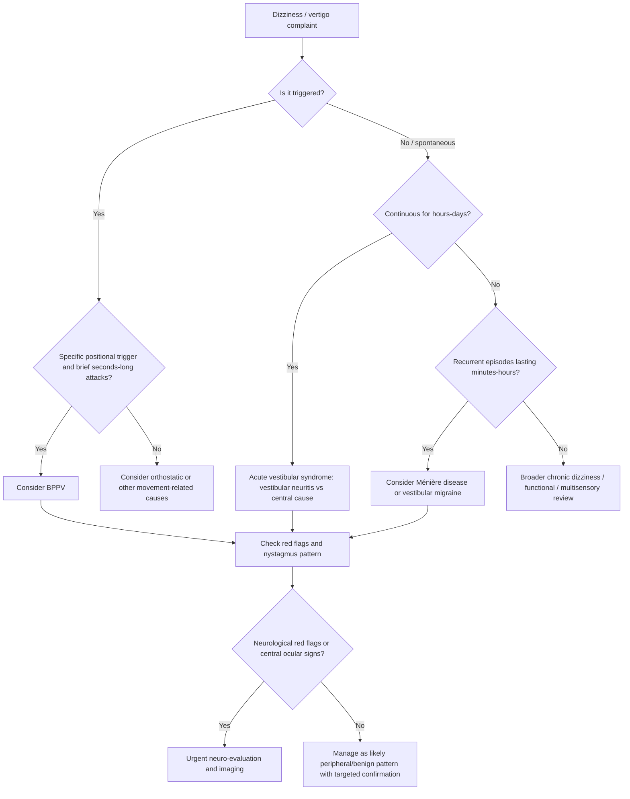
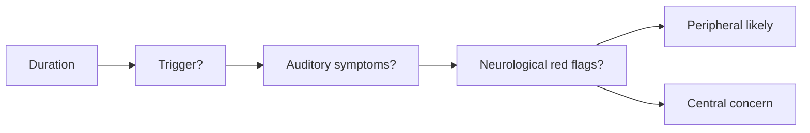

# Timing-triggers framework

Related: [[../Neurology MOC|Neurology MOC]] · [[../Vestibular Disorders|Vestibular Disorders]] · [[Approach to dizziness and vertigo]] · [[Benign paroxysmal positional vertigo]] · [[Vestibular neuritis and labyrinthitis]] · [[Ménière disease]] · [[Central vertigo clue pattern]] · [[Nystagmus pattern basics]] · [[When imaging is needed in vertigo]]

> [!important]
> The **timing-triggers framework** is one of the most useful bedside ways to approach **dizziness and vertigo**. Instead of asking only “what does the dizziness feel like?”, ask **when it happens, how long it lasts, whether it is triggered, and what neurological/auditory red flags accompany it**.

> [!tip]
> In FCPS/MRCP, strong answers separate:
> - **brief triggered episodic vertigo** → think **BPPV**
> - **spontaneous prolonged acute vestibular syndrome** → think **vestibular neuritis** or **central cause**
> - **recurrent spontaneous attacks with auditory symptoms** → think **Ménière disease**
> - **pattern with focal neurological signs** → think **central vertigo** until proved otherwise

## Learning Objectives
- Define the timing-triggers framework in the evaluation of dizziness/vertigo.
- Understand the vestibular anatomy and physiology that make time-course and triggers clinically useful.
- Distinguish triggered episodic vertigo from spontaneous episodic vertigo and acute vestibular syndrome.
- Use the framework to narrow differential diagnosis before over-investigating.
- Recognize when the pattern suggests central disease and urgent escalation.

## Definition
The **timing-triggers framework** is a bedside clinical approach that classifies dizziness/vertigo according to:

1. **Timing**
   - onset
   - duration
   - recurrence pattern
   - continuous vs intermittent course

2. **Triggers**
   - positional change
   - head movement
   - standing up
   - spontaneous/no trigger

3. **Targeted associated features**
   - hearing loss, tinnitus, ear fullness
   - headache/migraine features
   - focal neurological symptoms
   - gait inability, diplopia, dysarthria, limb weakness

It is designed to improve localization and reduce diagnostic confusion.

## Relevant Neuroanatomy
### Peripheral vestibular apparatus
- **Semicircular canals** detect angular acceleration.
- **Utricle and saccule** detect linear acceleration and head position relative to gravity.
- **Vestibular nerve** carries signals from labyrinth to brainstem vestibular nuclei.

### Central vestibular structures
- vestibular nuclei in the pons/medulla
- cerebellar flocculus, nodulus, and vermis
- ocular motor pathways controlling vestibulo-ocular reflex
- central balance pathways integrating visual, proprioceptive, and vestibular inputs

### Why timing and triggers help localization
- **Position-triggered very brief attacks** suggest a mechanical peripheral disorder such as canalithiasis.
- **Continuous acute vertigo lasting hours to days** suggests vestibular neuritis or central vestibular injury.
- **Recurrent spontaneous attacks with auditory symptoms** point toward labyrinthine/endolymphatic disorders.
- **Central lesions** often produce persistent symptoms plus neurological signs rather than a pure mechanical trigger pattern.

## Relevant Neurophysiology
- Normal balance relies on integration of **vestibular**, **visual**, and **proprioceptive** signals.
- Asymmetry in vestibular firing causes a false sense of motion.
- In **BPPV**, head position produces abnormal endolymph movement → brief triggered vertigo.
- In **vestibular neuritis**, unilateral vestibular input loss causes a sustained acute vestibular syndrome.
- In **central disease**, abnormal processing in the brainstem/cerebellum distorts eye movement and balance control, often causing persistent or red-flag patterns.

## Normal Values / Important Cut-offs
This is a pattern-recognition topic, but the following bedside time anchors are useful:

- **Seconds to <1 minute**, clearly **position triggered** → typical of **BPPV**
- **Hours to days**, continuous acute vestibular syndrome → consider **vestibular neuritis** or **central cause**
- **20 minutes to hours**, recurrent episodes with auditory symptoms → think **Ménière disease**
- **Persistent vertigo with focal neurological signs** → central until proved otherwise
- **Inability to sit/stand unsupported** or **direction-changing/vertical nystagmus** → major central red flags

## Classification
### Practical timing-triggers categories
1. **Triggered episodic vestibular syndrome**
   - brief attacks provoked by specific movement/position
2. **Spontaneous episodic vestibular syndrome**
   - recurrent attacks without a consistent external trigger
3. **Acute vestibular syndrome**
   - continuous vertigo/dizziness lasting hours to days
4. **Chronic persistent dizziness/imbalance**
   - prolonged or recurrent non-acute symptoms requiring broader differential thinking

## Etiology / Causes
### Triggered episodic pattern
- benign paroxysmal positional vertigo
- orthostatic hypotension/presyncope (especially if standing triggers symptoms)
- less often movement-provoked symptoms from other vestibular disorders

### Spontaneous episodic pattern
- Ménière disease
- vestibular migraine
- recurrent vestibular dysfunction
- panic/anxiety-related episodes in selected cases

### Acute vestibular syndrome pattern
- vestibular neuritis
- labyrinthitis
- central vertigo due to posterior fossa/brainstem/cerebellar pathology
- inflammatory or infective CNS disease affecting vestibular pathways

### Chronic/persistent dizziness pattern
- persistent vestibular imbalance after acute events
- functional dizziness patterns
- multisensory imbalance
- medication-related dizziness

## Risk Factors
- increasing age
- prior vestibular disease
- migraine history
- vascular/neuro risk context for central causes
- recent viral illness for vestibular neuritis
- positional provocation history suggesting BPPV
- otologic symptoms suggesting labyrinthine disease

## Pathophysiology
1. A disorder affects either the **peripheral vestibular apparatus** or **central vestibular pathways**.
2. The symptom pattern is shaped by:
   - whether dysfunction is brief and mechanically triggered
   - whether asymmetry is sustained
   - whether recurrent spontaneous attacks occur
3. Associated auditory or neurological features further refine localization.
4. The timing-triggers framework translates this physiology into a practical diagnostic bedside classification.

## Clinical Features
### Core history questions
Ask:
- Is the dizziness **true spinning vertigo**, imbalance, or presyncope?
- Did it start **suddenly or gradually**?
- Does it last **seconds, minutes, hours, or days**?
- Is it **triggered** by rolling in bed, looking up, standing, or head motion?
- Does it happen **spontaneously**?
- Are there **hearing symptoms**?
- Are there **neurological symptoms** such as diplopia, dysarthria, weakness, numbness, severe ataxia?

### Important bedside distinction
The old symptom-quality-only approach (“is it spinning?”) is less reliable than:
- **timing**
- **triggers**
- **targeted associated symptoms**

### Key patterns to recognize
#### 1. Brief triggered positional vertigo
- seconds long
- occurs with turning in bed, lying down, looking up
- no focal neuro signs
- suggests **BPPV**

#### 2. Continuous acute vertigo for hours to days
- severe nausea/vomiting
- worsened by movement but not caused only by a specific trigger
- gait imbalance
- consider **vestibular neuritis** or **central cause**

#### 3. Recurrent spontaneous attacks with hearing symptoms
- vertigo episodes lasting minutes to hours
- tinnitus, fullness, fluctuating hearing loss
- suggests **Ménière disease**

#### 4. Vertigo with neurological red flags
- diplopia
- dysarthria
- dysphagia
- severe truncal ataxia
- focal weakness or sensory loss
- skew deviation / vertical or direction-changing nystagmus
- suggests **central vertigo**

## Approach / Algorithm

## Investigations
### First principle
The framework helps decide **who needs bedside maneuvers**, **who needs neuro-examination**, and **who needs imaging**, rather than sending all dizzy patients to broad nonspecific testing.

### Bedside assessment
- full neurological examination
- gait and stance assessment
- eye movement examination
- nystagmus characterization
- hearing symptom history
- positional testing if appropriate
- orthostatic blood pressure when presyncope/standing trigger is relevant

### Targeted investigations by pattern
#### Triggered positional pattern
- bedside positional maneuvers such as Dix-Hallpike
- usually no routine imaging in classic BPPV

#### Acute vestibular syndrome
- HINTS-style logic only in the correct clinical syndrome and with competent examination
- MRI brain/posterior fossa when central concern exists
- CT if urgent triage is needed and MRI unavailable, while recognizing posterior fossa CT limitations

#### Auditory-associated recurrent episodes
- audiology/ENT-oriented assessment where needed
- imaging if atypical or central concern present

## Interpretation Frameworks
### Timing-triggers summary table
| Pattern | Typical timing | Trigger profile | Common example | Key caution |
|---|---|---|---|---|
| Triggered episodic vertigo | Seconds | Specific position/head movement | BPPV | Do not miss central red flags |
| Spontaneous episodic vertigo | Minutes to hours | No fixed trigger | Ménière disease / vestibular migraine | Ask about hearing and migraine clues |
| Acute vestibular syndrome | Hours to days | Symptoms worsened by movement but not purely positional | Vestibular neuritis / central cause | Differentiate peripheral from central urgently |
| Chronic persistent dizziness | Ongoing/recurrent | Variable | functional or chronic imbalance states | Broaden differential |

### Bedside localization table
| Feature | Peripheral pattern more likely | Central pattern more likely |
|---|---|---|
| Duration | brief triggered or continuous isolated vestibular syndrome | persistent with neuro signs or atypical course |
| Trigger | positional/mechanical | may be spontaneous or not classically triggered |
| Hearing symptoms | may accompany labyrinthine disease | not usually dominant |
| Nystagmus | unidirectional horizontal-torsional or positional pattern | vertical, direction-changing, skew-associated |
| Gait | impaired but often able to stand with support | severe truncal ataxia or inability to sit/stand |
| Neuro signs | absent | present or subtle but important |

### Common history mistake table
| Wrong question style | Better question style |
|---|---|
| “Is it spinning or not?” | “How long does it last?” |
| “Is it dizziness or vertigo?” | “Is it triggered by position, standing, or spontaneous?” |
| “Do you feel giddy?” | “Any hearing symptoms or neurological red flags?” |

## Diagnosis
The framework itself is **not a disease diagnosis**; it is a **diagnostic sorting tool**.

A good exam formulation is:
- “This is a **triggered episodic vestibular pattern** most consistent with BPPV.”
- “This is an **acute vestibular syndrome** requiring distinction between vestibular neuritis and central vertigo.”
- “This is a **spontaneous episodic vertigo pattern with auditory features**, favoring Ménière disease.”

## Differential Diagnosis
- benign paroxysmal positional vertigo
- vestibular neuritis
- labyrinthitis
- Ménière disease
- vestibular migraine
- central vertigo due to brainstem/cerebellar disease
- orthostatic hypotension / presyncope
- functional dizziness presentations
- medication-related dizziness
- multisensory imbalance in older adults

## Tables / Comparison Charts
### High-yield comparison
| Feature | BPPV | Vestibular neuritis | Ménière disease | Central vertigo |
|---|---|---|---|---|
| Timing | seconds | hours-days | minutes-hours | variable, often persistent |
| Trigger | positional | spontaneous, worsened by movement | spontaneous | variable |
| Hearing symptoms | absent | usually absent | common | not dominant |
| Neuro signs | absent | absent central signs | absent central signs | often present |
| Next key step | positional test/repositioning | neuro exam ± HINTS logic | hearing-focused review | urgent imaging/review |

## Management
### Main role of the framework
The timing-triggers framework guides **initial clinical direction**:
- who needs positional maneuvers
- who needs acute neuro-evaluation
- who needs auditory-focused assessment
- who needs urgent imaging

### Pattern-based action
#### Triggered episodic pattern
- assess for BPPV
- perform appropriate positional testing and treatment maneuvers if typical
- avoid unnecessary imaging in straightforward cases

#### Acute vestibular syndrome
- distinguish peripheral from central carefully
- urgent escalation if central red flags exist
- symptomatic treatment only after dangerous causes are considered

#### Spontaneous episodic pattern with auditory symptoms
- consider Ménière disease
- counsel regarding ENT/vestibular follow-up and targeted treatment

#### Chronic/persistent dizziness
- broaden review to functional, multisensory, medication-related, or chronic vestibular causes

## Drug Interactions / Contraindications / Comorbidity Cautions
- Avoid reflex overuse of vestibular suppressants in all dizzy patients; they may mask evolution and delay vestibular compensation.
- Sedating antiemetics/vestibular suppressants may worsen falls risk, especially in older adults.
- In patients with central warning features, do not let temporary symptom relief falsely reassure you.
- Orthostatic or cardiovascular causes should not be mislabelled as vestibular disease without checking relevant history and examination.

## Procedures / Indications / Contraindications
### Positional testing
- **Indication:** suspected triggered positional vertigo
- **Usefulness:** helps confirm BPPV pattern
- **Caution:** avoid forcing maneuvers when the history strongly suggests central disease or when major cervical limitations exist

### Neuroimaging
- **Indication:** central signs, atypical nystagmus, severe ataxia, new focal deficits, concerning headache, or high-risk acute vestibular syndrome
- **Preferred modality:** MRI where feasible for posterior fossa pathology

## Procedure Mini-Sections
### Focused dizziness history
- Ask duration first.
- Ask trigger second.
- Ask hearing symptoms third.
- Ask neuro red flags fourth.
- Then interpret the syndrome pattern.

### Bedside vestibular triage
- Characterize whether the syndrome is triggered episodic, spontaneous episodic, or acute continuous.
- Examine gait, eye movements, and focal neurology before labeling as benign.

## Complications
The main complication of poor use of the framework is **misclassification**, especially:
- missing central vertigo
- over-investigating obvious BPPV
- mislabelling presyncope or functional dizziness as vestibular disease
- delaying correct treatment because the history was not structured

## Red Flags / Emergencies
- vertical or direction-changing nystagmus
- skew deviation
- severe truncal ataxia
- inability to sit or stand unsupported
- dysarthria, diplopia, dysphagia
- limb weakness or sensory change
- new severe occipital/headache symptoms
- altered consciousness or other central neurological signs

> [!warning]
> In exams and in practice, **timing and triggers do not replace neurological examination**. They organize it.

## Prognosis
The prognosis depends on the underlying cause:
- BPPV usually responds well to repositioning maneuvers
- vestibular neuritis often improves gradually with compensation
- Ménière disease may recur chronically
- central causes depend on the specific pathology and urgency of diagnosis

## Topic Correlations
- [[Benign paroxysmal positional vertigo]]
- [[Vestibular neuritis and labyrinthitis]]
- [[Ménière disease]]
- [[Central vertigo clue pattern]]
- [[Nystagmus pattern basics]]
- [[When imaging is needed in vertigo]]

## Special Situations
### Older adults
- mixed causes are common: vestibular, visual, proprioceptive, drug-related, and orthostatic
- falls risk is high
- symptom description may be vague, so timing/trigger questions become even more valuable

### Patients with hearing symptoms
- auditory clues strongly shape differential diagnosis toward labyrinthine disorders
- do not ignore focal neuro signs just because tinnitus is present

### Patients with migraine history
- recurrent spontaneous attacks may mimic other vestibular syndromes
- the framework still helps by identifying the temporal pattern before adding migraine context

## FCPS/MRCP High-Yield Points
- Ask **duration** before naming a disease.
- Ask **trigger** before ordering imaging.
- Brief positional attacks strongly suggest BPPV.
- Continuous acute vestibular syndrome needs careful peripheral vs central separation.
- Hearing symptoms push you toward labyrinthine disorders.
- Focal neurological signs push you toward central disease.

## Common Viva Questions
- What is the timing-triggers framework in dizziness?
- Why is symptom quality alone less reliable than timing and triggers?
- How would you distinguish BPPV from vestibular neuritis by history?
- Which pattern suggests Ménière disease?
- What central red flags must be asked in a patient with vertigo?

## Common Confusions / Exam Traps
- confusing **triggered** with **worsened by movement**
  - vestibular neuritis is worsened by head movement but is not a brief triggered episodic syndrome like BPPV
- relying only on “spinning” sensation
- assuming all vertigo needs imaging
- assuming all severe dizziness is peripheral
- forgetting orthostatic/presyncopal triggers

## Mnemonics
### TTTA for bedside dizzy history
- **T**iming
- **T**riggers
- **T**argeted associated symptoms
- **A**larm/red flags

## Mind Map
- Dizziness / Vertigo
  - Timing
    - seconds
    - minutes-hours
    - hours-days
    - persistent/chronic
  - Triggers
    - positional
    - standing
    - spontaneous
    - movement-worsened only
  - Associated features
    - hearing symptoms
    - migraine clues
    - focal neuro signs
    - gait inability
  - Likely localization
    - peripheral
    - central
    - non-vestibular

## Flowchart

## Suggested Visuals / Image Notes
- diagram showing peripheral vs central vestibular pathways
- table poster of timing categories and common diagnoses
- bedside clerking card for acute vestibular syndrome

## Suggested Video References
- bedside approach to vertigo history taking
- BPPV vs vestibular neuritis clinical differentiation
- HINTS examination teaching videos for appropriate acute vestibular syndrome contexts

## One-Page Revision Summary
### Timing-triggers framework in one page
- Do not begin with symptom-quality alone.
- Start with **time course**:
  - seconds → BPPV likely if positional
  - minutes-hours → Ménière disease / vestibular migraine pattern
  - hours-days continuous → vestibular neuritis vs central cause
- Then ask **trigger**:
  - rolling in bed / looking up → BPPV pattern
  - spontaneous attacks → Ménière/migraine/other episodic causes
  - movement worsens but does not uniquely trigger → acute vestibular syndrome
- Then ask **associated clues**:
  - hearing symptoms → labyrinthine disease
  - focal neuro signs / severe ataxia → central disease
- Then choose the next step:
  - positional testing
  - neurological examination
  - imaging if red flags

## 24-Hour Recall Prompts
- Define the timing-triggers framework from memory.
- State the 3 major dizziness time-course patterns.
- Differentiate triggered episodic vertigo from acute vestibular syndrome.
- List 5 central red flags in a vertigo patient.
- Explain why “movement worsened” is not the same as “position triggered.”

## 7-Day / 15-Day / 30-Day Revision Tracker
- **Day 1:** Can I classify vertigo by timing and trigger without notes?
- **Day 7:** Can I differentiate BPPV, Ménière disease, vestibular neuritis, and central vertigo from history?
- **Day 15:** Can I explain the framework in viva style in under 2 minutes?
- **Day 30:** Can I apply it to fresh SBA stems accurately?

## Must Know / Should Know / Nice to Know
### Must Know
- timing categories
- trigger interpretation
- BPPV vs vestibular neuritis vs Ménière vs central pattern
- neurological red flags

### Should Know
- bedside role of positional testing
- hearing symptom interpretation
- limitations of symptom-quality-only history

### Nice to Know
- broader chronic dizziness frameworks
- overlap with functional dizziness and multisensory imbalance

## My Weak Points
- Do I confuse triggered attacks with movement-worsened continuous vertigo?
- Do I forget to ask about auditory symptoms?
- Do I prematurely label a pattern as benign before checking central red flags?

## Self-Test Scorecard
- Understanding /10
- Recall /10
- Pattern differentiation /10
- MCQ performance /10
- SBA performance /10

**Interpretation:**
- **<35/50** = weak, needs re-study
- **35–44/50** = acceptable but not secure
- **45+/50** = strong exam-ready topic

## Exam Answer Modes
### Short note style
The timing-triggers framework classifies dizziness by duration, recurrence, triggering factors, and associated auditory/neurological features. It improves bedside differentiation of BPPV, vestibular neuritis, Ménière disease, and central vertigo.

### Viva style
“In dizziness, I first ask how long the episode lasts, whether it is triggered or spontaneous, whether hearing symptoms are present, and whether there are focal neurological red flags. This usually narrows the diagnosis more effectively than symptom quality alone.”

## Summary
The timing-triggers framework is a **high-yield bedside sorting tool** for vertigo. It helps the clinician move from vague symptom description to a structured syndrome pattern, improving localization, reducing over-investigation, and helping detect dangerous central causes early.

## MCQs (10)
1. A patient has vertigo lasting 20 seconds when rolling in bed. The most likely timing-triggers category is:
   - A. Acute vestibular syndrome
   - B. Triggered episodic vestibular syndrome
   - C. Spontaneous episodic vestibular syndrome
   - D. Chronic persistent dizziness

2. The most useful first step in history taking for vertigo is to ask:
   - A. Whether the room spins clockwise or anticlockwise
   - B. Whether the patient feels anxious
   - C. How long the episode lasts and whether it is triggered
   - D. Whether antiemetics were tried

3. Recurrent vertigo lasting minutes to hours with tinnitus and ear fullness most strongly suggests:
   - A. BPPV
   - B. Ménière disease
   - C. Orthostatic hypotension
   - D. Peripheral neuropathy

4. Continuous vertigo for 2 days, worsened by movement but not provoked only by position, best fits:
   - A. Triggered episodic syndrome
   - B. Acute vestibular syndrome
   - C. Chronic persistent dizziness
   - D. Presyncope only

5. Which finding most strongly suggests central vertigo?
   - A. Brief vertigo when looking up
   - B. Tinnitus alone
   - C. Direction-changing nystagmus with severe truncal ataxia
   - D. Isolated nausea

6. In vestibular neuritis, symptoms are typically:
   - A. Seconds long and purely positional
   - B. Continuous for hours to days
   - C. Only on standing from lying
   - D. Always associated with hearing loss

7. The statement “movement worsens my dizziness” by itself means:
   - A. definite BPPV
   - B. definite central vertigo
   - C. further clarification is needed because worsening is not the same as a specific trigger
   - D. no vestibular cause is possible

8. Which associated feature most strongly points toward a labyrinthine/auditory disorder?
   - A. Dysarthria
   - B. Diplopia
   - C. Tinnitus and fluctuating hearing loss
   - D. Hemiparesis

9. The main value of the timing-triggers framework is that it:
   - A. replaces neurological examination
   - B. identifies all causes without differential diagnosis
   - C. organizes dizziness into clinically meaningful patterns
   - D. makes imaging unnecessary in all cases

10. A major pitfall is:
   - A. asking about hearing symptoms
   - B. checking gait and stance
   - C. relying only on symptom quality such as “spinning”
   - D. considering central red flags

## SBA Questions (10)
1. A 56-year-old woman reports brief vertigo when turning in bed and when looking up. Each episode lasts less than 30 seconds. She has no hearing symptoms and no focal neurological signs. Which is the best next interpretation?
   - A. Acute vestibular syndrome
   - B. Triggered episodic vestibular pattern consistent with BPPV
   - C. Central vertigo until proven otherwise despite classic history
   - D. Chronic persistent dizziness

2. A 40-year-old man develops sudden severe vertigo with nausea and vomiting that has persisted for 24 hours. Head movement worsens the symptoms, but there is no specific positional trigger. Which timing category fits best?
   - A. Triggered episodic vestibular syndrome
   - B. Spontaneous episodic vestibular syndrome
   - C. Acute vestibular syndrome
   - D. Orthostatic syndrome only

3. A 48-year-old woman has repeated episodes of vertigo lasting 1–2 hours associated with tinnitus and ear fullness. Which diagnosis is best supported by the timing-triggers framework?
   - A. BPPV
   - B. Ménière disease
   - C. Myasthenia gravis
   - D. Peripheral neuropathy

4. A 63-year-old man presents with dizziness, diplopia, and inability to stand unsupported. What should the framework make you do first?
   - A. Reassure and give vestibular suppressant only
   - B. Perform Epley maneuver immediately
   - C. Treat as central concern and escalate urgently
   - D. Diagnose Ménière disease

5. A patient says, “I feel dizzy whenever I move my head.” Which is the best clarification?
   - A. No further question is needed
   - B. Ask whether the dizziness is triggered only by a specific position and how long it lasts
   - C. Diagnose vestibular neuritis immediately
   - D. Assume a psychogenic cause

6. A patient has recurrent spontaneous dizziness without hearing symptoms but with migraine history. The framework is most useful because it:
   - A. proves stroke
   - B. ignores recurrence pattern
   - C. separates spontaneous episodic patterns from triggered positional ones
   - D. replaces all other history

7. Which scenario is least compatible with BPPV?
   - A. Vertigo when rolling in bed
   - B. Seconds-long attacks
   - C. Severe truncal ataxia and vertical nystagmus
   - D. Looking up provokes symptoms

8. In the timing-triggers framework, which factor most strongly redirects you toward imaging?
   - A. Ear fullness only
   - B. Reproducible Dix-Hallpike-type history with no red flags
   - C. Dysarthria and direction-changing nystagmus
   - D. Brief attacks provoked by lying back

9. An elderly patient describes vague dizziness. Why is the framework still helpful?
   - A. It removes the need to ask about falls
   - B. It structures history by duration, triggers, and associated features
   - C. It guarantees a vestibular diagnosis
   - D. It is only for young patients

10. Which one-sentence summary best reflects the framework?
   - A. All vertigo is diagnosed by symptom quality alone
   - B. Timing, triggers, and targeted associated symptoms organize dizziness into high-yield clinical patterns
   - C. Imaging is unnecessary if there is nausea
   - D. Brief attacks always indicate central disease

## Flashcards
- Q: What are the 3 core elements of the timing-triggers framework?
  A: Timing, triggers, and targeted associated features/red flags.

- Q: Which pattern most strongly suggests BPPV?
  A: Brief seconds-long positional attacks triggered by head movement.

- Q: Which pattern fits vestibular neuritis?
  A: Continuous acute vestibular syndrome lasting hours to days.

- Q: Which auditory symptom cluster suggests Ménière disease?
  A: Vertigo with tinnitus, ear fullness, and fluctuating hearing loss.

- Q: Name 3 central red flags in vertigo.
  A: Diplopia, dysarthria, severe truncal ataxia; also vertical/direction-changing nystagmus and focal weakness.

- Q: Why is “movement worsened” not equal to “position triggered”?
  A: Many acute vestibular disorders worsen with movement, but only some are specifically triggered by position change.

- Q: What is the main role of the framework?
  A: To sort dizziness into clinically meaningful patterns before targeted examination/investigation.

- Q: In classic BPPV, is routine imaging usually needed?
  A: No, not in straightforward cases without red flags.

- Q: What bedside factor should push urgent escalation?
  A: Focal neurological signs or severe inability to stand/sit unsupported.

- Q: What history question is often more useful than asking only “is it spinning?”
  A: “How long does it last, and what triggers it?”

## Answer Key with Explanations
### MCQs
1. **B** — brief positional attacks fit triggered episodic vestibular syndrome.
2. **C** — duration plus trigger profile is the most useful first sorting step.
3. **B** — recurrent attacks with auditory symptoms are classic for Ménière disease.
4. **B** — hours-to-days continuous symptoms fit acute vestibular syndrome.
5. **C** — direction-changing nystagmus plus truncal ataxia are major central clues.
6. **B** — vestibular neuritis typically causes prolonged continuous symptoms.
7. **C** — worsening with movement is nonspecific; clarify whether symptoms are specifically triggered.
8. **C** — tinnitus with fluctuating hearing loss points to auditory/labyrinthine pathology.
9. **C** — it organizes dizziness into practical syndrome patterns.
10. **C** — symptom quality alone is a common trap.

### SBAs
1. **B** — classic triggered positional pattern most consistent with BPPV.
2. **C** — this is acute vestibular syndrome, not brief triggered vertigo.
3. **B** — recurrent spontaneous episodes with auditory symptoms strongly support Ménière disease.
4. **C** — central red flags mandate urgent escalation, not reassurance.
5. **B** — the key clarification is exact trigger and duration.
6. **C** — the framework separates spontaneous episodic from triggered patterns.
7. **C** — severe ataxia and vertical nystagmus are central red flags, not typical BPPV.
8. **C** — dysarthria plus direction-changing nystagmus strongly supports central concern and imaging.
9. **B** — structured history is especially valuable when symptom descriptions are vague.
10. **B** — this is the best summary of the method.
