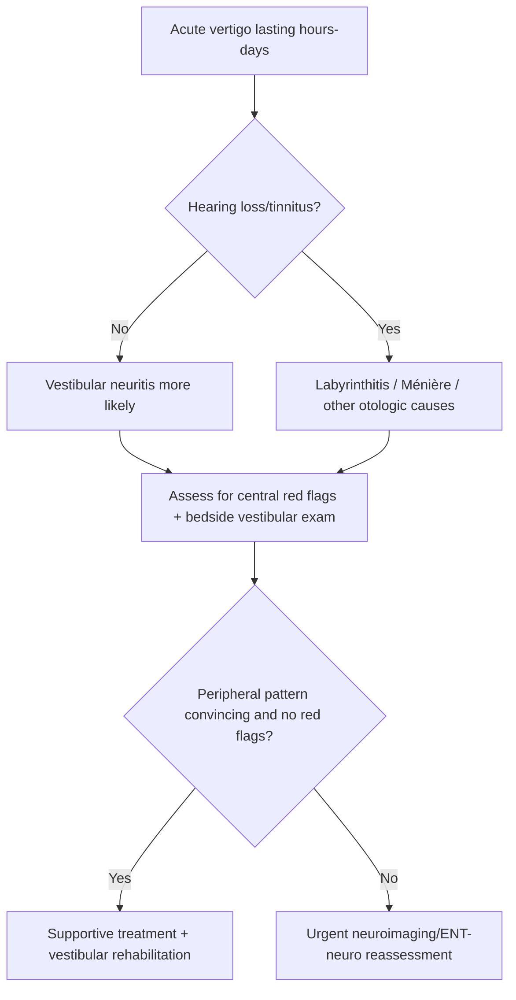

# Vestibular neuritis and labyrinthitis

Related: [[../Neurology MOC|Neurology MOC]] · [[../Vestibular Disorders|Vestibular Disorders]] · [[Peripheral vestibular disorders]] · [[Benign paroxysmal positional vertigo]] · [[Ménière disease]] · [[Central vertigo clue pattern]] · [[Nystagmus pattern basics]]

> [!important]
> **Vestibular neuritis** causes acute prolonged peripheral vertigo without hearing loss, whereas **labyrinthitis** causes acute prolonged vertigo **with hearing loss and/or tinnitus** because the cochlea is also involved.

> [!tip]
> In exams, do not confuse these with BPPV. Vestibular neuritis/labyrinthitis cause **continuous vertigo lasting hours to days**, not brief positional attacks.

## Learning Objectives
- Define vestibular neuritis and labyrinthitis.
- Differentiate them from BPPV, Ménière disease, and central causes of acute vestibular syndrome.
- Understand vestibular anatomy and HINTS-related bedside clues.
- Know initial management, red flags, and imaging indications.
- Recognize when hearing symptoms shift the differential toward labyrinthitis or other otologic pathology.

## Definition
### Vestibular neuritis
An acute peripheral vestibular syndrome caused by dysfunction of the vestibular nerve, producing:
- sudden severe vertigo
- nausea/vomiting
- gait imbalance
- spontaneous peripheral-pattern nystagmus
- **no primary hearing loss**

### Labyrinthitis
Inflammation/dysfunction involving the labyrinth, producing acute vertigo **plus cochlear symptoms**, such as:
- hearing loss
- tinnitus
- aural fullness sometimes

## Relevant Neuroanatomy
### Peripheral vestibular apparatus
- semicircular canals detect angular acceleration
- utricle and saccule detect linear acceleration/head position
- vestibular nerve carries signals to vestibular nuclei
- cochlea mediates hearing

### Why the distinction matters
- if pathology is mainly in the **vestibular nerve**, hearing is usually spared → vestibular neuritis
- if the **labyrinth/cochlea** are involved, auditory symptoms may occur → labyrinthitis

## Relevant Neurophysiology
- Normal vestibular function depends on balanced tonic input from both labyrinths.
- Unilateral peripheral vestibular failure creates asymmetry, making the brain perceive rotation.
- This causes:
  - spinning vertigo
  - nausea/vomiting
  - spontaneous horizontal-torsional nystagmus
  - postural deviation/falling tendency toward affected side
- Central compensation gradually reduces symptoms over days to weeks.

## Normal Values / Important Cut-offs
- Vertigo in vestibular neuritis/labyrinthitis usually lasts **hours to days**, not seconds.
- Hearing loss is **not** a feature of simple vestibular neuritis.
- Acute vestibular syndrome with **normal head impulse**, direction-changing nystagmus, or skew deviation suggests **central** pathology rather than peripheral neuritis.

## Classification
### By syndrome
1. vestibular neuritis
2. labyrinthitis

### Labyrinthitis broad clinical forms
1. presumed viral/inflammatory labyrinthitis
2. bacterial or complicated otogenic labyrinthitis in ENT settings

## Etiology / Causes
### Vestibular neuritis
- often post-viral or presumed inflammatory
- may follow upper respiratory infection
- exact cause often not proven clinically

### Labyrinthitis
- viral inner ear inflammation
- bacterial spread from otitis media/mastoid disease in serious cases
- occasionally associated with meningitic/otologic complications

## Risk Factors
- recent viral illness
- middle ear disease for labyrinthitis
- immunocompromised state if severe infection possible
- vascular risk factors do **not** cause neuritis, but they increase concern for central mimics such as posterior circulation stroke

## Pathophysiology
### Vestibular neuritis
1. acute unilateral vestibular nerve dysfunction
2. asymmetry of vestibular firing
3. false sensation of movement
4. compensatory nystagmus and gait lateropulsion
5. gradual central compensation

### Labyrinthitis
1. inner ear inflammatory/infective process involves both vestibular and cochlear apparatus
2. vertigo plus hearing symptoms result
3. severe infection may threaten hearing or spread further

## Clinical Features
### Typical vestibular neuritis
- abrupt onset severe spinning vertigo
- worsened by head movement but present even at rest
- nausea/vomiting
- difficulty standing or walking
- spontaneous unidirectional horizontal-torsional nystagmus
- no hearing loss or tinnitus as the key primary syndrome

### Typical labyrinthitis
- acute vertigo similar to neuritis
- hearing loss and/or tinnitus added
- nausea/vomiting and imbalance common

### What patients often say
- “The room is spinning constantly.”
- “I cannot walk straight.”
- “Any head movement makes it worse.”
- in labyrinthitis: “My hearing is blocked / ringing has started.”

## Distinguishing from Other Common Diagnoses
### Versus BPPV
- neuritis/labyrinthitis: **continuous** vertigo over hours to days
- BPPV: **brief positional** attacks lasting seconds

### Versus Ménière disease
- Ménière: recurrent episodes + fluctuating hearing loss/tinnitus/aural fullness
- labyrinthitis: acute prolonged episode often inflammatory, not classic recurrent hydrops pattern

### Versus cerebellar/brainstem stroke
- stroke may have ataxia out of proportion, focal neurological signs, direction-changing nystagmus, skew deviation, severe headache, or normal head impulse in acute vestibular syndrome

## Approach / Algorithm

## Investigations
### Usually clinical diagnosis when classic
- bedside neuro-otological examination
- hearing history
- gait assessment
- HINTS-style bedside differentiation in expert settings for acute vestibular syndrome

### When to investigate further
- atypical features
- new focal neurological deficit
- inability to walk without support out of proportion to peripheral signs
- new headache/neck pain
- vascular risk with suspicious central signs
- severe hearing loss or otologic infection concern

### Possible tests
- audiometry if hearing symptoms present
- MRI brain/posterior fossa if central cause suspected
- ENT assessment for bacterial/complicated labyrinthitis

## Interpretation Frameworks

## Interpretation Framework 1: Peripheral acute vestibular syndrome clues
| Feature | Peripheral pattern |
|---|---|
| Vertigo duration | continuous for hours-days |
| Nystagmus | unidirectional horizontal-torsional |
| Head movement | worsens symptoms but does not cause isolated brief spells |
| Hearing | preserved in neuritis, impaired in labyrinthitis |
| Focal neuro signs | absent |

## Interpretation Framework 2: Central red flags in acute vertigo
| Feature | Why concerning |
|---|---|
| Diplopia, dysarthria, limb weakness, facial numbness | brainstem/cerebellar central lesion |
| Severe truncal ataxia unable to sit/stand | central concern |
| Direction-changing gaze-evoked nystagmus | central |
| Skew deviation | central |
| New severe occipital headache/neck pain | posterior circulation issue possible |

## Interpretation Framework 3: Hearing clues
| Hearing symptom pattern | Implication |
|---|---|
| No hearing loss | vestibular neuritis more likely |
| Acute hearing loss with vertigo | labyrinthitis or other inner ear disease |
| Recurrent fluctuating hearing loss with episodic vertigo | Ménière disease more likely |

## Diagnosis
- **Vestibular neuritis** is diagnosed clinically when acute prolonged peripheral vertigo occurs without hearing loss and without central red flags.
- **Labyrinthitis** is favored when acute peripheral vertigo is accompanied by hearing loss/tinnitus and no dominant central pattern explains it.

## Differential Diagnosis
- [[Benign paroxysmal positional vertigo]]
- [[Ménière disease]]
- vestibular migraine
- cerebellar infarction or brainstem stroke
- multiple sclerosis presenting with brainstem symptoms
- acoustic/inner ear pathology depending chronicity

## Tables / Comparison Charts

## Neuritis vs Labyrinthitis vs BPPV vs Central Vertigo
| Feature | Vestibular neuritis | Labyrinthitis | BPPV | Central vertigo/stroke |
|---|---|---|---|---|
| Duration | hours-days | hours-days | seconds | variable, often continuous |
| Trigger | spontaneous onset | spontaneous onset | positional | may be spontaneous |
| Hearing loss | absent | present | absent | usually absent unless AICA-type syndromes/other complex lesions |
| Nystagmus | peripheral pattern | peripheral pattern | positional pattern | may be direction-changing/vertical |
| Neuro deficits | absent | absent | absent | may be present |

## HINTS-Style Practical Table
| Bedside sign | Peripheral neuritis tends to show | Central concern tends to show |
|---|---|---|
| Head impulse | abnormal | normal sometimes |
| Nystagmus | unidirectional | direction-changing/vertical |
| Test of skew | absent | present |

> [!warning]
> HINTS is powerful only when used correctly in **continuous acute vestibular syndrome** by trained examiners. It is not a substitute for clinical judgment.

## Management
### Supportive management
- reassurance and safety
- hydration
- short-term antiemetic/vestibular suppressant use in the acute phase only when needed
- early mobilization as tolerated
- vestibular rehabilitation exercises after severe vomiting settles

### Specific principles
#### Vestibular neuritis
- symptom control in acute phase
- avoid prolonged vestibular suppressant use because it may delay central compensation
- consider local practice regarding short-course steroids in selected early cases, but exam answers should stress that evidence/practice varies and stroke exclusion is more urgent than steroid discussion

#### Labyrinthitis
- manage as acute vestibular syndrome with hearing involvement
- involve ENT if severe hearing loss, otitis, mastoid disease, or bacterial process suspected
- address infective source urgently when indicated

## Drug Interactions / Contraindications / Comorbidity Cautions
- Prolonged use of sedating vestibular suppressants may hinder vestibular compensation and worsen falls in older patients.
- Avoid assuming peripheral disease in high vascular-risk patients with central warning signs.
- Ototoxic medications and coexisting ear disease may complicate hearing outcomes.

## Procedures / Indications / Contraindications
### Imaging
**Indication:** atypical presentation, central red flags, severe gait/truncal instability, new focal signs.

### Audiometry
**Indication:** hearing loss/tinnitus or ongoing auditory symptoms.

## Procedure Mini-Sections
### Bedside head impulse testing
- **Use:** helps distinguish peripheral vestibular hypofunction from central causes in the right syndrome
- **Pitfall:** should be interpreted within full bedside exam, not alone

### Vestibular rehabilitation
- **Indication:** persistent imbalance after acute phase
- **Benefit:** promotes central compensation
- **Pearl:** start after severe nausea settles; excessive bed rest delays recovery

## Complications
- dehydration from vomiting
- falls
- prolonged imbalance
- persistent hearing deficit in labyrinthitis
- missed posterior circulation stroke if central signs are overlooked

## Red Flags / Emergencies
- diplopia, dysarthria, limb weakness, numbness, or other focal deficits
- inability to sit or stand unsupported out of proportion to peripheral findings
- new severe headache or neck pain
- central nystagmus pattern
- immunocompromised patient with severe ear/infective symptoms
- otitis/mastoiditis with vertigo and hearing loss suggesting complicated labyrinthitis

## Prognosis
- vestibular neuritis often improves over days to weeks, with imbalance improving more slowly
- labyrinthitis prognosis depends on severity and cause; hearing recovery may be incomplete
- vestibular rehabilitation improves recovery in persistent imbalance

## Topic Correlation
- [[Benign paroxysmal positional vertigo]]
- [[Ménière disease]]
- [[Central vertigo clue pattern]]
- [[Nystagmus pattern basics]]
- [[When imaging is needed in vertigo]]

## Special Situations
### Elderly patient
Stroke mimic risk is higher; do not overdiagnose peripheral vertigo without central screen.

### Immunocompromised patient
Consider serious infection and lower threshold for imaging/ENT input.

### Patient with hearing loss
Think beyond neuritis; labyrinthitis, Ménière disease, AICA-territory central pathology, or ear disease must be considered.

## FCPS/MRCP High-Yield Points
- Vestibular neuritis = acute prolonged vertigo without hearing loss.
- Labyrinthitis = acute prolonged vertigo with hearing symptoms.
- BPPV is brief and positional; neuritis is prolonged and continuous.
- Central red flags must be actively excluded in acute vestibular syndrome.
- Vestibular suppressants should generally be short-term only.

## Common Viva Questions
- How do you differentiate vestibular neuritis from BPPV?
- How do you differentiate neuritis from labyrinthitis?
- What bedside clues suggest a central cause of acute vertigo?
- When would you request MRI in a patient with vertigo?
- Why should vestibular suppressants not be used for too long?

## Common Confusions / Exam Traps
- calling prolonged spontaneous vertigo “BPPV”
- forgetting that hearing loss argues against simple vestibular neuritis
- relying on one bedside sign without looking for central red flags
- overusing vestibular suppressants and delaying rehabilitation

## Mnemonics
### Neuritis vs Labyrinthitis
**“Labyrinth has the ear.”**
- **Labyrinthitis** → vertigo **plus hearing** involvement
- **Neuritis** → vestibular symptoms without primary hearing loss

## Mind Map
- Acute peripheral vestibular syndrome
  - Vestibular neuritis
    - prolonged vertigo
    - nausea
    - gait imbalance
    - no hearing loss
  - Labyrinthitis
    - prolonged vertigo
    - hearing loss/tinnitus
  - Key differentiators
    - central red flags
    - BPPV brief positional spells
    - Ménière recurrent hearing/vertigo episodes

## Suggested Visuals / Image Notes
- Diagram of semicircular canals, vestibular nerve, and cochlea
- Comparison chart of neuritis/labyrinthitis/BPPV/Ménière/stroke
- HINTS summary graphic with central vs peripheral patterns

## Suggested Video References
- Acute vestibular syndrome bedside examination videos
- HINTS examination tutorials by neuro-otology/neuro-emergency educators
- Vestibular rehabilitation exercise demonstrations

## One-Page Revision Summary
### Core distinctions
- **Vestibular neuritis:** prolonged acute vertigo, no hearing loss
- **Labyrinthitis:** prolonged acute vertigo + hearing loss/tinnitus
- **BPPV:** brief positional attacks
- **Central vertigo:** focal deficits, central nystagmus, severe truncal ataxia, skew, headache/neck pain

### Management pearls
- short-term symptom relief only
- early mobilization
- vestibular rehab
- low threshold for imaging if central concern

## Recall Prompts
### 24-hour recall prompts
- How do vestibular neuritis and BPPV differ in duration?
- What symptom makes labyrinthitis more likely than neuritis?
- List 4 central red flags in acute vestibular syndrome.
- Why should vestibular suppressants be limited?
- When is MRI needed in acute vertigo?

### 7-day / 15-day / 30-day revision tracker
- **7 days:** compare neuritis, labyrinthitis, BPPV, and central vertigo from memory.
- **15 days:** explain hearing clues and HINTS logic.
- **30 days:** answer a full viva on acute vestibular syndrome.

## Must Know / Should Know / Nice to Know
### Must Know
- prolonged vertigo pattern
- hearing loss distinction
- stroke red flags
- supportive treatment and rehab

### Should Know
- HINTS principles and limitations
- short-term only use of vestibular suppressants
- ENT involvement in complicated labyrinthitis

### Nice to Know
- detailed viral/bacterial inner-ear pathology nuances

## My Weak Points
- Do I confuse BPPV with acute vestibular syndrome?
- Do I always ask about hearing loss?
- Can I list central red flags quickly?

## Self-Test Scorecard
- Differential diagnosis /10
- Bedside exam interpretation /10
- Red-flag recognition /10
- Management strategy /10
- Viva confidence /10

Interpretation:
- **<35/50** = weak
- **35-44/50** = acceptable
- **45+/50** = strong

## Exam Answer Modes
### Short note
Define vestibular neuritis and labyrinthitis, compare them with BPPV and central vertigo.

### Viva mode
Start with duration, hearing symptoms, and central red flags.

### Ward-case mode
State whether this is acute peripheral vestibular syndrome or a possible central stroke mimic.

## Summary
Vestibular neuritis and labyrinthitis are important causes of **acute prolonged peripheral vertigo**. The key distinction is hearing involvement: absent in neuritis, present in labyrinthitis. The major clinical duty is to avoid confusing them with **BPPV** or, more dangerously, with **central posterior circulation disease**.

## MCQs (10)
1. Vestibular neuritis typically presents with:
   - A. Brief vertigo lasting seconds only on turning in bed
   - B. Acute prolonged vertigo without hearing loss
   - C. Recurrent episodic vertigo with fluctuating hearing loss only
   - D. Pure proximal limb weakness
   - E. Isolated aphasia

2. Which feature favors labyrinthitis over vestibular neuritis?
   - A. Hearing loss or tinnitus
   - B. Nausea
   - C. Imbalance
   - D. Vertigo worsened by movement
   - E. Horizontal nystagmus

3. Which diagnosis typically causes brief positional vertigo lasting seconds?
   - A. Vestibular neuritis
   - B. Labyrinthitis
   - C. BPPV
   - D. Cerebellar abscess always
   - E. Myasthenia gravis

4. In acute vestibular syndrome, which finding is more concerning for central pathology?
   - A. Unidirectional horizontal-torsional nystagmus
   - B. Direction-changing nystagmus
   - C. Vertigo worsened by head movement
   - D. Nausea
   - E. Vomiting

5. Which management principle is correct?
   - A. Long-term vestibular suppressants should be given routinely for months
   - B. Early mobilization and vestibular rehabilitation help recovery
   - C. Hearing loss excludes all vestibular causes
   - D. MRI is unnecessary in all cases
   - E. Stroke cannot mimic peripheral vertigo

6. Hearing is usually preserved in:
   - A. Labyrinthitis
   - B. Vestibular neuritis
   - C. Ménière disease always
   - D. Acoustic neuroma always acutely
   - E. Otitis media with perforation only

7. Which feature most helps separate vestibular neuritis from BPPV?
   - A. Both are identical in duration
   - B. Neuritis causes prolonged continuous vertigo
   - C. BPPV always causes hearing loss
   - D. Neuritis causes aphasia
   - E. BPPV causes urinary retention

8. A patient with vertigo plus diplopia should be considered to have:
   - A. Simple BPPV until proven otherwise
   - B. Possible central lesion
   - C. Vestibular neuritis only
   - D. Ménière disease only
   - E. Pure ear wax problem

9. Which is a typical symptom of acute vestibular neuritis?
   - A. Sudden severe spinning with nausea and gait imbalance
   - B. Distal glove-and-stocking numbness
   - C. Hemiplegia with aphasia
   - D. Pure thunderclap headache
   - E. Carpal spasm only

10. Which bedside hearing clue matters most in differentiating neuritis from labyrinthitis?
   - A. Hearing loss suggests labyrinthitis rather than neuritis
   - B. Hearing loss proves BPPV
   - C. Hearing loss excludes central pathology always
   - D. Hearing is irrelevant in vertigo
   - E. Tinnitus occurs only in stroke

## SBA Questions (10)
1. A 33-year-old man develops abrupt severe spinning vertigo with vomiting and unsteady gait after a viral upper respiratory illness. Hearing is normal. Most likely diagnosis:
   - A. Vestibular neuritis
   - B. BPPV
   - C. Ménière disease
   - D. Myopathy
   - E. Tension headache

2. A 40-year-old woman presents with acute continuous vertigo, nausea, and reduced hearing in the affected ear. Most likely diagnosis:
   - A. Vestibular neuritis
   - B. Labyrinthitis
   - C. BPPV
   - D. Polyneuropathy
   - E. Functional weakness

3. A patient says the room spins for 20 seconds when turning in bed, then settles. Most likely diagnosis:
   - A. Vestibular neuritis
   - B. Labyrinthitis
   - C. BPPV
   - D. Cerebellar stroke necessarily
   - E. Meningitis

4. In a patient with acute vestibular syndrome, which finding should most strongly prompt MRI or urgent central evaluation?
   - A. Vertigo worsened by head movement
   - B. Direction-changing nystagmus and diplopia
   - C. Nausea
   - D. Vomiting
   - E. Fear of falling

5. A patient with acute prolonged vertigo is prescribed vestibular suppressants. Which advice is best?
   - A. Use them indefinitely
   - B. Use short term only if needed and begin mobilization/rehab early
   - C. Never move again for 2 weeks
   - D. Stop all oral intake
   - E. Avoid all follow-up

6. Which feature best distinguishes labyrinthitis from BPPV?
   - A. Labyrinthitis causes prolonged vertigo with possible hearing loss
   - B. BPPV causes continuous vertigo for days
   - C. Labyrinthitis never causes vomiting
   - D. BPPV causes hearing loss usually
   - E. Both always cause focal deficits

7. A 72-year-old hypertensive patient with vertigo also has truncal ataxia and dysarthria. Best interpretation:
   - A. Peripheral neuritis is certain
   - B. Central posterior circulation pathology must be considered urgently
   - C. Ménière disease only
   - D. Benign syncope
   - E. Carpal tunnel syndrome

8. Which symptom combination best fits vestibular neuritis?
   - A. Seconds-long positional vertigo and no nausea
   - B. Continuous vertigo, nausea, unidirectional nystagmus, no hearing loss
   - C. Vertigo with aphasia and hemiparesis
   - D. Recurrent episodic vertigo with fluctuating hearing loss only
   - E. Pure gait apraxia

9. Which patient should prompt ENT concern for complicated labyrinthitis?
   - A. Vertigo with severe hearing symptoms and evidence of ear infection
   - B. Simple BPPV
   - C. Migraine without vertigo
   - D. Pure sensory neuropathy
   - E. Functional tremor

10. What is the key exam duty in suspected vestibular neuritis/labyrinthitis?
   - A. Ignore hearing history
   - B. Actively exclude central red flags
   - C. Assume all dizziness is peripheral
   - D. Diagnose stroke only from nausea
   - E. Avoid gait examination

## Flashcards
- Q: How does vestibular neuritis usually affect hearing?
  A: Hearing is usually preserved.

- Q: What additional symptom suggests labyrinthitis?
  A: Hearing loss and/or tinnitus.

- Q: How long does vertigo usually last in vestibular neuritis?
  A: Continuous for hours to days.

- Q: How does BPPV differ in duration?
  A: It causes brief positional spells lasting seconds.

- Q: Name two central red flags in acute vestibular syndrome.
  A: Diplopia and direction-changing nystagmus.

- Q: Why should vestibular suppressants not be continued too long?
  A: They may delay central vestibular compensation.

- Q: What bedside syndrome is being assessed in neuritis vs stroke?
  A: Acute vestibular syndrome.

- Q: What does severe truncal ataxia out of proportion suggest?
  A: Possible central lesion.

- Q: Which note should you link to for brief positional vertigo?
  A: [[Benign paroxysmal positional vertigo]].

- Q: Which note helps with central mimic differentiation?
  A: [[Central vertigo clue pattern]].

## Answer Key with Explanations
### MCQs
1. **B. Acute prolonged vertigo without hearing loss** — classic neuritis pattern.
2. **A. Hearing loss or tinnitus** — points toward labyrinthitis.
3. **C. BPPV** — brief positional vertigo.
4. **B. Direction-changing nystagmus** — central warning sign.
5. **B. Early mobilization and vestibular rehabilitation help recovery** — good management principle.
6. **B. Vestibular neuritis** — hearing usually spared.
7. **B. Neuritis causes prolonged continuous vertigo** — major distinction from BPPV.
8. **B. Possible central lesion** — diplopia is a red flag.
9. **A. Sudden severe spinning with nausea and gait imbalance** — classic acute vestibular syndrome.
10. **A. Hearing loss suggests labyrinthitis rather than neuritis** — key distinction.

### SBAs
1. **A. Vestibular neuritis** — post-viral acute prolonged vertigo without hearing loss.
2. **B. Labyrinthitis** — hearing symptoms plus acute vertigo.
3. **C. BPPV** — brief positional spells.
4. **B. Direction-changing nystagmus and diplopia** — central concern.
5. **B. Use short term only if needed and begin mobilization/rehab early** — best practice.
6. **A. Labyrinthitis causes prolonged vertigo with possible hearing loss** — differentiating point.
7. **B. Central posterior circulation pathology must be considered urgently** — dysarthria and truncal ataxia are not simple neuritis.
8. **B. Continuous vertigo, nausea, unidirectional nystagmus, no hearing loss** — typical neuritis.
9. **A. Vertigo with severe hearing symptoms and evidence of ear infection** — complicated labyrinthitis concern.
10. **B. Actively exclude central red flags** — core safety step.

## PasTest Scenario SBAs (Clinical Vignettes)

> **Auto-generated PasTest/Mediscope-style scenario SBAs** grounded in the authored source. Each scenario tests a real clinical fact (triad, specific sign, contraindication, trial, first-line Rx) extracted from the topic. *Source: Ch 27: Neurology & Stroke — Vestibular neuritis and labyrinthitis*

**Q1.** Which of the following features is most specific or characteristic of Vestibular neuritis and labyrinthitis?

  - **A.** A. Hearing loss suggests labyrinthitis rather than neuritis
  - **B.** A feature common to many acute inflammatory conditions
  - **C.** A non-specific sign that does not localise the diagnosis
  - **D.** An investigation finding rather than a clinical feature

  > **Answer: A** — A. Hearing loss suggests labyrinthitis rather than neuritis
  >
  > *Source:* **A. Hearing loss suggests labyrinthitis rather than neuritis** — key distinction

**Q2.** What is the most appropriate first-line therapy for Vestibular neuritis and labyrinthitis?

  - **A.** short-term antiemetic/vestibular suppressant use in the acute phase only when needed
  - **B.** An advanced/surgical therapy reserved for refractory disease
  - **C.** Symptomatic treatment only, no disease-modifying therapy
  - **D.** Empiric broad-spectrum therapy without specific indication

  > **Answer: A** — short-term antiemetic/vestibular suppressant use in the acute phase only when needed
  >
  > *Source:* short-term antiemetic/vestibular suppressant use in the acute phase only when needed

