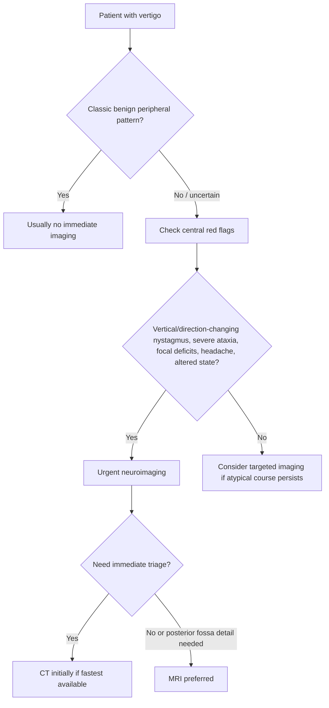
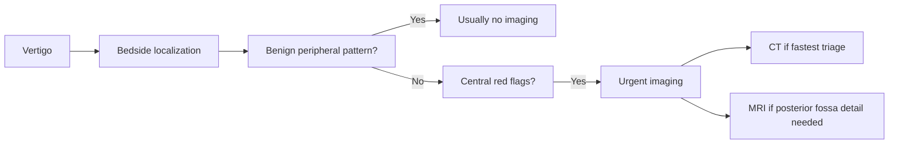

# When imaging is needed in vertigo

Related: [[../Neurology MOC|Neurology MOC]] · [[../Vestibular Disorders|Vestibular Disorders]] · [[Approach to dizziness and vertigo]] · [[Timing-triggers framework]] · [[Nystagmus pattern basics]] · [[Central vertigo clue pattern]] · [[../Neuroimaging/When CT is first-line in emergency neurology|When CT is first-line in emergency neurology]] · [[../Neuroimaging/MRI brain sequences basics|MRI brain sequences basics]]

> [!important]
> **Most routine peripheral vertigo does not need imaging.** Imaging is needed when the bedside pattern is **atypical**, when **central features** are present, or when there is concern for a structural posterior fossa/brainstem process.

> [!warning]
> A common exam and clinical error is over-imaging classic BPPV while under-imaging dangerous **central vertigo**. The real skill is knowing **who needs urgent neuroimaging and who does not**.

## Learning Objectives
- Know when imaging is unnecessary in classic benign peripheral vertigo.
- Identify red flags that require neuroimaging.
- Distinguish when CT is acceptable for urgent triage and when MRI is preferable.
- Integrate imaging decisions with bedside localization and nystagmus patterns.
- Avoid both overuse and underuse of neuroimaging in dizzy patients.

## Definition
This topic addresses the clinical decision of **when neuroimaging is indicated in a patient presenting with vertigo or dizziness**, especially to detect:
- central vestibular pathology
- posterior fossa lesions
- brainstem/cerebellar disease
- mass effect, hydrocephalus, or inflammatory structural disease

## Relevant Neuroanatomy
### Structures of concern in dangerous vertigo
- cerebellum
- brainstem vestibular nuclei
- posterior fossa pathways
- fourth ventricle / CSF pathways if raised ICP or hydrocephalus is possible
- cerebellopontine structures and central ocular-motor pathways

### Why imaging matters here
These regions can produce:
- vertigo
- ataxia
- diplopia
- dysarthria
- atypical nystagmus
- raised ICP/obstructive features

Some may be poorly assessed clinically if symptoms are subtle.

## Relevant Neurophysiology
- Peripheral vestibular disorders disturb labyrinth or vestibular nerve input.
- Central vestibular disorders affect processing, eye movement control, and balance pathways.
- Structural central disease may produce vertigo plus long-tract, cerebellar, or ocular motor abnormalities.
- Imaging is not needed to diagnose every vestibular asymmetry; it is needed when bedside localization suggests dangerous central pathology or atypical disease.

## Normal Values / Important Cut-offs
This is a pattern-based decision topic, but the following high-yield rules matter:
- **Classic brief positional vertigo with typical BPPV pattern** → usually **no imaging**
- **Vertical or direction-changing nystagmus** → image for central cause unless a better explanation exists
- **Severe truncal ataxia or inability to sit/stand unsupported** → urgent central evaluation and imaging
- **Focal neurological deficits** → neuroimaging indicated
- **New severe headache, altered consciousness, or raised ICP features** → urgent imaging indicated

## Classification
### Imaging-decision categories
1. **Imaging usually not needed**
   - classic peripheral/benign syndrome
2. **Imaging considered**
   - atypical or uncertain pattern
3. **Imaging clearly indicated urgently**
   - central red flags or structural concern

### By modality choice
1. **CT first-line triage**
2. **MRI preferred**
3. **No immediate imaging**

## Etiology / Causes prompting imaging concern
- central vestibular lesion
- posterior fossa mass/inflammatory disease
- cerebellar/brainstem pathology
- hydrocephalus or mass effect
- demyelinating central lesion
- infective or inflammatory CNS disease with vestibular manifestations

## Risk Factors
- older age in worrying neuro context
- known cancer or systemic inflammatory disease
- immunocompromise
- prior neurological episodes
- persistent occipital headache or central symptoms
- severe gait dysfunction
- atypical positional vertigo pattern

## Pathophysiology
1. A patient presents with vertigo.
2. History and examination suggest either a benign peripheral syndrome or an atypical/central process.
3. If the pattern is classic peripheral, imaging usually adds little.
4. If the pattern suggests central structural disease, imaging becomes necessary to identify the lesion and guide urgent management.

## Clinical Features
### Features suggesting imaging is NOT routinely needed
- classic BPPV history: brief positional attacks lasting seconds
- typical positional nystagmus
- no focal neurological signs
- no severe gait failure
- no new headache or central ocular-motor signs

### Features suggesting imaging IS needed
- direction-changing or vertical nystagmus
- severe truncal or gait ataxia
- diplopia, dysarthria, dysphagia
- focal weakness or sensory change
- persistent severe occipital/new headache
- altered level of consciousness
- atypical persistent positional symptoms
- central HINTS-style concern in acute vestibular syndrome
- progressive or unexplained neurological syndrome

## Approach / Algorithm

## Investigations
### Bedside before imaging
- full neurological examination
- gait and stance assessment
- cranial nerve examination
- nystagmus characterization
- hearing symptom assessment
- positional testing when appropriate

### Imaging modalities
#### CT head
Useful when:
- urgent triage is required
- altered sensorium or severe acute neurological concern exists
- hemorrhage, hydrocephalus, or mass effect needs rapid exclusion

Limitations:
- less sensitive than MRI for many posterior fossa and brainstem lesions

#### MRI brain/posterior fossa
Preferred when:
- central vertigo is suspected
- posterior fossa/brainstem lesion needs better definition
- demyelination, tumor, or inflammatory disease is a concern
- CT is unrevealing but suspicion remains high

## Interpretation Frameworks
### When not to image immediately table
| Scenario | Imaging decision |
|---|---|
| Brief positional vertigo, classic BPPV pattern, no neuro signs | Usually no immediate imaging |
| Typical peripheral vestibular syndrome with reassuring exam | Usually no immediate imaging |

### When to image table
| Feature | Why it matters |
|---|---|
| Vertical nystagmus | central ocular-motor clue |
| Direction-changing gaze-evoked nystagmus | central localization |
| Severe truncal ataxia | posterior fossa concern |
| Diplopia/dysarthria/dysphagia | brainstem involvement |
| Focal motor/sensory deficits | non-peripheral localization |
| New severe headache / altered consciousness | structural/CNS emergency concern |
| Atypical persistent positional symptoms | not classic BPPV |

### CT vs MRI table
| Question | CT | MRI |
|---|---|---|
| Rapid triage in acute instability | useful | may be slower/less available |
| Posterior fossa detail | limited | better |
| Hydrocephalus/mass effect/large bleed | useful | also useful |
| Demyelination or subtle brainstem lesion | poor-moderate | preferred |

## Diagnosis
Imaging does not diagnose all vertigo; it is used to support or exclude **structural central causes** when the bedside syndrome warrants it.

A strong exam line is:
- “This patient has a classic peripheral positional syndrome and does not need routine immediate imaging.”
- “This patient has central red flags, so neuroimaging is indicated urgently, with MRI preferred where feasible.”

## Differential Diagnosis
### Imaging-positive concern differential
- central vertigo due to cerebellar/brainstem pathology
- demyelinating disease
- posterior fossa tumor or mass lesion
- hydrocephalus / raised ICP-related pathology
- infective/inflammatory CNS disease

### Imaging-often-unnecessary benign differential
- BPPV
- straightforward vestibular neuritis with no central red flags
- classic Ménière pattern without focal neurology

## Tables / Comparison Charts
### Practical scenarios
| Clinical pattern | Imaging need |
|---|---|
| Brief positional vertigo + classic Dix-Hallpike pattern | usually no |
| Continuous acute vestibular syndrome + normal neuro exam but diagnostic uncertainty | consider based on bedside central concern |
| Vertigo + diplopia + severe ataxia | yes, urgent |
| Persistent atypical positional symptoms with non-fatigable vertical nystagmus | yes |

## Management
### Core principle
Imaging should be **targeted**, not automatic.

### If classic peripheral pattern
- treat bedside syndrome appropriately
- avoid unnecessary CT/MRI
- counsel and safety-net if pattern changes

### If central concern
- urgent neurological review
- image promptly
- prioritize MRI for posterior fossa detail when feasible
- use CT for immediate triage if unstable or MRI unavailable

### If uncertain but not crashing
- re-examine carefully
- review gait, ocular motor signs, and progression
- low threshold for MRI when the story is atypical

## Drug Interactions / Contraindications / Comorbidity Cautions
- Sedatives/antiemetics may blunt bedside reassessment; do not let temporary symptomatic improvement delay imaging when red flags exist.
- Claustrophobia, implanted devices, or instability may affect MRI feasibility.
- Contrast decisions depend on indication and renal/comorbidity context; not every vertigo work-up requires contrast.

## Procedures / Indications / Contraindications
### CT head
- **Indication:** urgent triage for acute neurological instability, suspected mass effect, hydrocephalus, or major intracranial event
- **Limitation:** may miss subtle posterior fossa disease

### MRI brain
- **Indication:** suspected posterior fossa, cerebellar, brainstem, demyelinating, inflammatory, or tumor-related cause
- **Advantage:** better structural detail for central vertigo work-up

## Procedure Mini-Sections
### Imaging request wording
A useful request includes:
- acute vertigo/dizziness syndrome
- relevant red flags
- abnormal nystagmus pattern
- gait/cranial nerve findings
- concern for posterior fossa or central lesion

### Before requesting imaging
- localize clinically first
- document why the bedside pattern is not simply benign peripheral vertigo

## Complications
### From under-imaging
- missed central pathology
- delayed diagnosis of posterior fossa disease
- delayed escalation in neurological emergency

### From over-imaging
- unnecessary cost and anxiety
- false reassurance if wrong modality is used or timing is inappropriate
- distracts from bedside diagnostic skill

## Red Flags / Emergencies
- vertical nystagmus
- direction-changing gaze-evoked nystagmus
- severe truncal ataxia
- inability to sit/stand unsupported
- diplopia, dysarthria, dysphagia
- focal weakness or sensory symptoms
- new severe occipital/headache symptoms
- reduced consciousness or raised ICP features

## Prognosis
- benign peripheral vertigo has a good prognosis and often needs no imaging
- central structural causes depend on rapid recognition and correct investigation
- prognosis worsens when central red flags are missed or imaging is delayed in the wrong patient

## Topic Correlations
- [[Timing-triggers framework]]
- [[Nystagmus pattern basics]]
- [[Central vertigo clue pattern]]
- [[Benign paroxysmal positional vertigo]]
- [[Vestibular neuritis and labyrinthitis]]
- [[../Neuroimaging/When CT is first-line in emergency neurology|When CT is first-line in emergency neurology]]
- [[../Neuroimaging/MRI brain sequences basics|MRI brain sequences basics]]

## Special Situations
### Older adults
- central disease may be subtle
- gait impairment may be multifactorial, so imaging threshold may be lower if atypical features exist

### Immunocompromised / cancer context
- lower threshold for imaging when inflammatory, infective, or mass pathology is plausible

### Persistent unexplained symptoms
- if bedside diagnosis remains unclear or course is not behaving like classic peripheral disease, re-evaluate and consider imaging

## FCPS/MRCP High-Yield Points
- Imaging is **not routine** for classic BPPV.
- MRI is generally better for **posterior fossa / brainstem** causes.
- CT is useful for **urgent triage**, hydrocephalus, mass effect, or major acute intracranial concern.
- Red flags + atypical nystagmus + severe ataxia = image urgently.
- Bedside localization comes first; imaging supports it.

## Common Viva Questions
- When is imaging not required in vertigo?
- Which vertigo patient requires urgent MRI?
- What are the limitations of CT in posterior fossa disease?
- What red flags in a dizzy patient should prompt imaging?
- Why should classic BPPV not be routinely over-imaged?

## Common Confusions / Exam Traps
- imaging every dizzy patient “just to be safe”
- assuming a normal CT excludes posterior fossa disease completely
- ignoring atypical nystagmus because the patient says “vertigo”
- failing to combine imaging decisions with gait and focal neurological signs
- forgetting that classic BPPV is usually a bedside diagnosis

## Mnemonics
### IMAGE red flags
- **I**mbalance severe
- **M**otor/sensory deficit
- **A**typical nystagmus
- **G**aze/brainstem symptoms
- **E**xplosive headache or encephalopathy

## Mind Map
- Vertigo imaging decision
  - No imaging usually
    - classic BPPV
    - reassuring peripheral pattern
  - Image urgently
    - focal neuro signs
    - vertical/direction-changing nystagmus
    - severe ataxia
    - headache/altered state
  - Modality
    - CT for rapid triage
    - MRI for posterior fossa detail

## Flowchart

## Suggested Visuals / Image Notes
- one-page “image vs don’t image” vertigo triage chart
- posterior fossa anatomy schematic
- CT vs MRI strengths table for vertigo work-up

## Suggested Video References
- acute vestibular syndrome bedside approach
- posterior fossa red flags in dizziness
- MRI vs CT teaching in neuro-emergency triage

## One-Page Revision Summary
### When imaging is needed in vertigo — one page
- **Do not image everyone**.
- No routine imaging for:
  - classic BPPV
  - clear benign peripheral pattern without neuro signs
- Image when there are:
  - vertical/direction-changing nystagmus
  - severe ataxia
  - focal neuro signs
  - diplopia/dysarthria/dysphagia
  - new severe headache or altered consciousness
- **CT**: fast triage, bleed/mass effect/hydrocephalus
- **MRI**: better for posterior fossa, brainstem, demyelination, subtle central lesions

## 24-Hour Recall Prompts
- List 5 red flags that make imaging necessary in vertigo.
- State when classic BPPV does not need routine imaging.
- Explain why MRI is preferred over CT for many central vertigo causes.
- What is CT still useful for in acute neuro triage?
- How would you justify an urgent MRI request in viva style?

## 7-Day / 15-Day / 30-Day Revision Tracker
- **Day 1:** Can I state who does not need imaging?
- **Day 7:** Can I list the central red flags from memory?
- **Day 15:** Can I choose CT vs MRI appropriately in common scenarios?
- **Day 30:** Can I answer imaging-in-vertigo SBA stems rapidly and safely?

## Must Know / Should Know / Nice to Know
### Must Know
- no routine imaging for classic BPPV
- central red flags needing urgent imaging
- MRI better for posterior fossa detail
- CT useful for urgent triage and structural emergency screening

### Should Know
- limitations of CT in posterior fossa disease
- role of nystagmus and gait in imaging decisions

### Nice to Know
- contrast nuances depending on suspected tumor/inflammation work-up

## My Weak Points
- Do I over-image classic peripheral vertigo?
- Do I underestimate vertical/direction-changing nystagmus?
- Do I forget CT limitations in posterior fossa disease?

## Self-Test Scorecard
- Understanding /10
- Recall /10
- Imaging choice /10
- MCQ performance /10
- SBA performance /10

**Interpretation:**
- **<35/50** = weak topic
- **35–44/50** = acceptable but not secure
- **45+/50** = strong exam-ready topic

## Exam Answer Modes
### Short note style
Imaging is not routinely needed in classic benign peripheral vertigo such as BPPV. It is indicated when central red flags, atypical nystagmus, severe ataxia, focal neurological signs, or structural posterior fossa concern are present. CT is useful for urgent triage; MRI is preferable for many central causes.

### Viva style
“I would not routinely image classic BPPV. I would image if the patient has vertical or direction-changing nystagmus, severe truncal ataxia, focal neurology, brainstem symptoms, altered consciousness, or a strongly atypical course. MRI is preferred for posterior fossa lesions, although CT may be used first for urgent triage.”

## Summary
In vertigo, imaging should be used selectively and intelligently. The main task is to separate classic benign peripheral syndromes from atypical or central patterns that require urgent structural evaluation.

## MCQs (10)
1. Which vertigo scenario usually does NOT need routine imaging?
   - A. Vertical nystagmus with severe ataxia
   - B. Classic brief positional vertigo with typical BPPV pattern
   - C. Diplopia with dizziness
   - D. Persistent occipital headache with imbalance

2. Which imaging modality is generally better for posterior fossa and brainstem lesions?
   - A. Plain skull X-ray
   - B. MRI
   - C. Abdominal ultrasound
   - D. No imaging ever

3. Which nystagmus pattern should most strongly prompt imaging?
   - A. Typical fatigable positional BPPV pattern
   - B. Vertical or direction-changing nystagmus
   - C. Mild endpoint nystagmus only
   - D. No nystagmus

4. CT is especially useful when:
   - A. Immediate acute neuro triage is needed
   - B. Looking for subtle demyelination only
   - C. Diagnosing all peripheral vertigo
   - D. Replacing bedside examination

5. Which feature most strongly suggests a central imaging-worthy process?
   - A. Ear fullness only
   - B. Seconds-long positional symptoms only
   - C. Severe truncal ataxia and dysarthria
   - D. Response to Epley maneuver

6. A common mistake is:
   - A. correlating imaging with bedside findings
   - B. not imaging every single dizzy patient automatically
   - C. over-imaging classic BPPV and under-imaging central vertigo
   - D. checking gait and eye signs

7. In classic BPPV, imaging is usually:
   - A. mandatory urgently
   - B. unnecessary unless atypical features exist
   - C. replaced by EEG
   - D. replaced by lumbar puncture

8. Which symptom cluster most supports urgent neuroimaging?
   - A. Brief dizziness on rolling in bed
   - B. Tinnitus with a typical Ménière pattern only
   - C. Diplopia, vertical nystagmus, and inability to stand
   - D. Isolated nausea

9. MRI is preferred over CT when concern exists for:
   - A. posterior fossa structural lesion
   - B. no symptoms at all
   - C. routine ear wax
   - D. classic BPPV response testing

10. The best principle is:
   - A. image nobody with vertigo
   - B. image everybody with vertigo
   - C. use bedside localization to decide who needs targeted imaging
   - D. use imaging before history taking

## SBA Questions (10)
1. A 52-year-old woman has brief vertigo lasting 15 seconds when rolling in bed. Dix-Hallpike produces classic positional nystagmus. Neurological examination is normal. Best next decision?
   - A. Urgent MRI brain
   - B. CT head before any treatment
   - C. No routine imaging; manage as classic BPPV
   - D. Lumbar puncture

2. A 67-year-old man with vertigo has vertical nystagmus and cannot stand unaided. What is the best interpretation?
   - A. Benign peripheral syndrome
   - B. Urgent central concern requiring imaging
   - C. Ear pathology only
   - D. Anxiety-related dizziness only

3. A patient has acute vestibular symptoms, diplopia, and dysarthria. Which investigation strategy is best?
   - A. Discharge with antiemetics only
   - B. Treat as central concern and arrange urgent neuroimaging
   - C. Avoid imaging because vertigo is usually peripheral
   - D. Only perform hearing tests

4. What is the main limitation of CT in vertigo work-up?
   - A. It cannot ever show mass effect
   - B. It is less sensitive for many posterior fossa lesions than MRI
   - C. It always requires contrast
   - D. It is not available in emergencies

5. A woman with continuous vertigo for 2 days has severe nausea, but no focal deficits and a peripheral-appearing nystagmus pattern. What is the correct principle?
   - A. Every such patient automatically needs MRI regardless of bedside findings
   - B. Bedside localization still guides whether imaging is needed
   - C. CT is unnecessary in all medicine
   - D. Imaging replaces examination

6. Which finding most strongly lowers the need for immediate imaging?
   - A. Typical BPPV history with classic positional pattern and no red flags
   - B. Vertical nystagmus
   - C. New occipital headache
   - D. Severe gait ataxia

7. An examiner asks why classic BPPV should not be routinely imaged. Best answer?
   - A. Because imaging is forbidden in vestibular disease
   - B. Because the diagnosis is usually bedside-clinical and imaging adds little in classic cases
   - C. Because MRI cannot see the brainstem
   - D. Because all vertigo is peripheral

8. A patient has persistent atypical positional symptoms and non-fatigable nystagmus. Best next step?
   - A. Assume benign BPPV and stop thinking
   - B. Consider central pathology and image appropriately
   - C. Diagnose Ménière disease immediately
   - D. Ignore the nystagmus

9. In a resource-limited urgent setting, which statement is best?
   - A. CT may be used first for triage even though MRI is better for some posterior fossa lesions
   - B. Imaging is useless in all emergencies
   - C. MRI must always be done first before examination
   - D. Positional testing replaces all imaging decisions

10. What is the key message of this topic?
   - A. Imaging should be selective and guided by red flags and localization
   - B. Imaging is never useful in vertigo
   - C. Every dizzy patient needs MRI
   - D. Only hearing symptoms determine imaging

## Flashcards
- Q: Does classic BPPV usually need routine imaging?
  A: No, not unless atypical or central features are present.

- Q: Name 4 red flags that should prompt imaging in vertigo.
  A: Vertical/direction-changing nystagmus, severe truncal ataxia, focal neurological signs, new severe headache/altered consciousness.

- Q: Which modality is often better for posterior fossa lesions?
  A: MRI.

- Q: When is CT still very useful?
  A: Acute urgent triage, mass effect, hydrocephalus, or major intracranial emergency screening.

- Q: What is the main exam trap?
  A: Over-imaging benign peripheral vertigo and under-imaging dangerous central vertigo.

- Q: What bedside findings should guide imaging decisions?
  A: Nystagmus pattern, gait/stance, cranial nerve findings, focal neurology, and headache/central symptoms.

- Q: Why is a normal CT not always enough in suspected central vertigo?
  A: CT may miss subtle posterior fossa or brainstem lesions that MRI detects better.

- Q: What symptom cluster strongly suggests central imaging need?
  A: Diplopia, dysarthria, severe ataxia, or focal weakness with vertigo.

- Q: If vertigo is atypical and persistent, what should you do?
  A: Reassess carefully and consider targeted imaging.

- Q: What is the guiding principle?
  A: Bedside localization first, targeted imaging second.

## Answer Key with Explanations
### MCQs
1. **B** — classic BPPV usually does not need routine imaging.
2. **B** — MRI is generally better for posterior fossa/brainstem detail.
3. **B** — this is a classic central red-flag pattern.
4. **A** — CT is helpful for immediate triage and structural emergency screening.
5. **C** — severe ataxia with dysarthria strongly suggests central disease.
6. **C** — this is the dangerous error to avoid.
7. **B** — imaging is usually unnecessary in straightforward BPPV unless atypical features appear.
8. **C** — this cluster strongly suggests central pathology and urgent imaging.
9. **A** — MRI is preferred for many central posterior fossa lesions.
10. **C** — targeted imaging should follow good bedside localization.

### SBAs
1. **C** — a classic bedside BPPV syndrome does not need routine imaging.
2. **B** — vertical nystagmus and inability to stand are urgent central red flags.
3. **B** — brainstem symptoms with vertigo require urgent imaging.
4. **B** — CT is less sensitive for many posterior fossa lesions than MRI.
5. **B** — bedside localization remains essential even in acute vestibular syndromes.
6. **A** — a classic reassuring BPPV pattern lowers immediate imaging need.
7. **B** — classic BPPV is typically diagnosed clinically and imaging adds little.
8. **B** — atypical persistent positional symptoms should prompt central reconsideration.
9. **A** — this is the balanced and practical answer.
10. **A** — selective imaging guided by red flags and localization is the key principle.