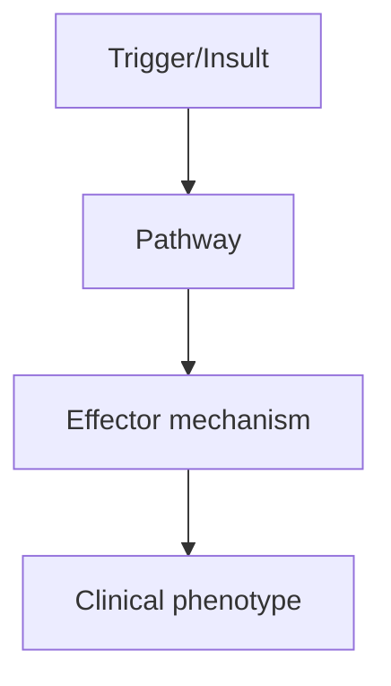
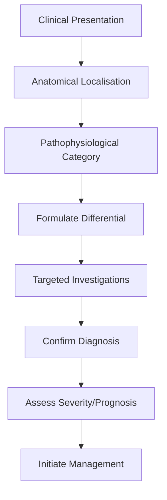
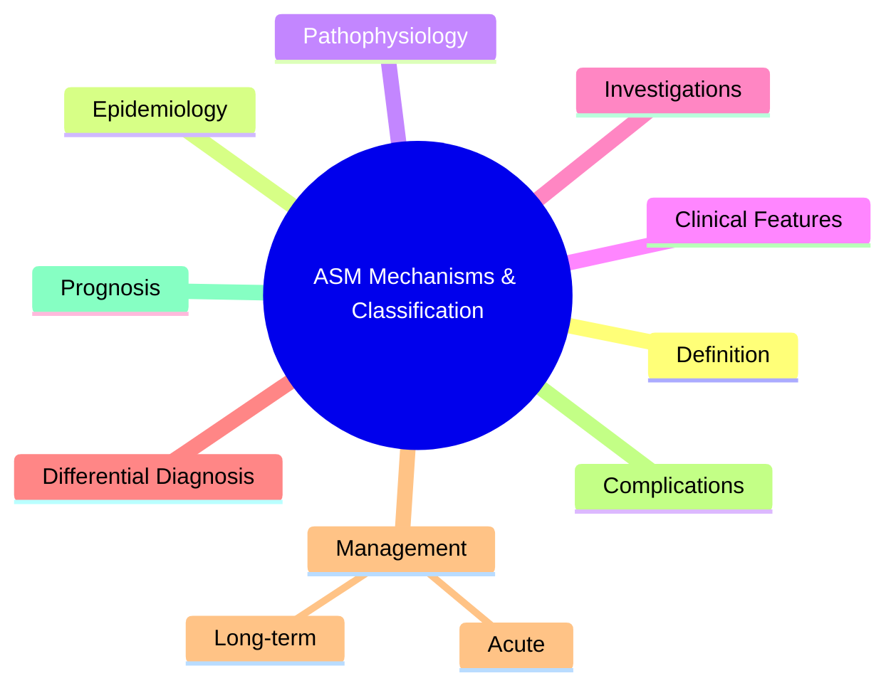

# ASM Mechanisms & Classification

> [!tip] **High-Yield Definition**
> Antiseizure medications (ASMs) act via multiple mechanisms to suppress seizure activity. Understanding mechanism guides rational polytherapy and avoidance of agents that worsen specific seizure types.

---

## 1. Definition / Epidemiology / Classification

### Definition
Antiseizure medications (ASMs) act via multiple mechanisms to suppress seizure activity. Understanding mechanism guides rational polytherapy and avoidance of agents that worsen specific seizure types.

### Epidemiology
20+ ASMs available. Mechanism-based classification helps avoid combining drugs with same mechanism (no benefit, more side effects).

### Classification
| Variant | Key Features | Prognosis |
|---------|-------------|-----------|
| | | |

---

## 2. Aetiology / Pathophysiology

### Aetiology
Mechanisms: Na+ channel blockers (use-dependent, slow inactivation), Ca2+ channel blockers (T-type: ethosuximide; N-type: gabapentin, pregabalin), GABA enhancers (benzodiazepines, barbiturates, valproate, vigabatrin), SV2A modulators (levetiracetam, brivaracetam), AMPA antagonists (perampanel), dual/multi-mechanism (valproate, topiramate, felbamate, cenobamate, zonisamide), K+ channel openers (retigabine/ezogabine, withdrawn).

### Pathophysiology

---

## 3. Clinical Features

### History
- **Onset/Duration:**
- **Progression:**
- **Key symptoms:**
- **Triggers:**
- **Systemic symptoms:**
- **Drug/Family/Social history:**

### Examination
| Domain | Key Findings | Localisation Value |
|--------|-------------|-------------------|
| | | |

### Specific Clinical Features
Na+ channel blockers: carbamazepine, oxcarbazepine, eslicarbazepine, phenytoin, fosphenytoin, lamotrigine, lacosamide. Ca2+ channel blockers: ethosuximide (T-type), gabapentin, pregabalin (α2δ). GABA enhancers: benzodiazepines, barbiturates (phenobarbital), valproate, vigabatrin (irreversible GABA-T inhibitor), tiagabine (GABA reuptake). SV2A: levetiracetam, brivaracetam. AMPA: perampanel. Multi-mechanism: valproate, topiramate, felbamate, cenobamate, zonisamide.

---

## 4. Diagnostic Approach / Algorithm

---

## 5. Investigations

ASM levels (phenytoin, valproate, carbamazepine, ethosuximide, phenobarbital) - useful for toxicity and adherence, less for efficacy. Therapeutic drug monitoring: trough levels. Side effect monitoring: FBC (agranulocytosis with CBZ, LTG), LFTs (VPA, CBZ, PHT), U&Es (LEV, GBP, PGB), vitamin D, bone density, ECG (CBZ, PHT, LCM).

---

## 6. Differential Diagnosis

| Differential | Distinguishing Features | Key Test |
|--------------|------------------------|----------|
| | | |

---

## 7. Management

Rational polytherapy: combine ASMs with DIFFERENT mechanisms. Na+ blocker + Ca2+ blocker (e.g., CBZ + GBP) is synergistic. Avoid combining multiple Na+ blockers or multiple GABA enhancers. Consider mechanism when adding 2nd/3rd ASM. ASMs that may WORSEN specific seizures: CBZ, PHT, LTG, vigabatrin, tiagabine, gabapentin - worsen absence, myoclonic (relative contraindications in JME, CAE, Dravet).

---

## 8. Drug Interactions / Contraindications / Comorbidity Cautions

| Drug | Interaction / Caution | Management |
|------|----------------------|------------|
| | | |

---

## 9. Procedures (if applicable)

### Procedure:
- **Indications:**
- **Contraindications:**
- **Preparation / Principle:**
- **Complications:**
- **Viva Pearls:**

---

## 10. Complications

| Complication | Frequency | Prevention / Monitoring | Management |
|--------------|-----------|------------------------|------------|
| | | | |

---

## 11. Red Flags / Emergencies

Agranulocytosis (CBZ, LTG - FBC), hepatotoxicity (VPA, felbamate - LFTs), Stevens-Johnson syndrome (LTG, CBZ, PHT - slow titration, HLA-B*15:02 in Asians), hyponatraemia (CBZ, OXC, ESL), weight gain (VPA, GBP, PGB), weight loss (TPM, FBM).

---

## 12. Prognosis

Mechanism-based polytherapy optimises seizure control with fewer side effects. 60-70% controlled with 1st or 2nd ASM trial.

---

## 13. Topic Correlation

| Related Topic | Link | Key Overlap |
|---------------|------|-------------|
| | | |

---

## 14. Special Situations

| Situation | Consideration |
|-----------|---------------|
| **Pregnancy** | |
| **Lactation** | |
| **Paediatric** | |
| **Elderly / Frail** | |
| **Renal impairment** | |
| **Hepatic impairment** | |
| **Immunocompromised** | |
| **Perioperative** | |
| **Driving / DVLA** | |
| **Occupational** | |

---

## FCPS/MRCP High-Yield Summary

| Category | Key Points |
|----------|------------|
| **Definition** | Antiseizure medications (ASMs) act via multiple mechanisms to suppress seizure activity. Understanding mechanism guides rational polytherapy and avoidance of agents that worsen specific seizure types. |
| **Epidemiology** | 20+ ASMs available. Mechanism-based classification helps avoid combining drugs with same mechanism (no benefit, more side effects). |
| **Pathophysiology** | |
| **Clinical** | Na+ channel blockers: carbamazepine, oxcarbazepine, eslicarbazepine, phenytoin, fosphenytoin, lamotrigine, lacosamide. Ca2+ channel blockers: ethosuximide (T-type), gabapentin, pregabalin (α2δ). GABA  |
| **Diagnosis** | |
| **Investigations** | ASM levels (phenytoin, valproate, carbamazepine, ethosuximide, phenobarbital) - useful for toxicity and adherence, less for efficacy. Therapeutic drug monitoring: trough levels. Side effect monitoring |
| **Management** | Rational polytherapy: combine ASMs with DIFFERENT mechanisms. Na+ blocker + Ca2+ blocker (e.g., CBZ + GBP) is synergistic. Avoid combining multiple Na+ blockers or multiple GABA enhancers. Consider me |
| **Complications** | |
| **Prognosis** | Mechanism-based polytherapy optimises seizure control with fewer side effects. 60-70% controlled with 1st or 2nd ASM trial. |
| **Viva Pearls** | |
| **Drug Doses** | |
| **Scoring Systems** | |
| **Genetics** | |
| **Imaging Signs** | |

---

## Viva Questions (PACES/FCPS Style)

1. **Q:** Define ASM Mechanisms & Classification and classify its variants.
   **A:** Based on the definition above.

2. **Q:** What are the key clinical features?
   **A:** Na+ channel blockers: carbamazepine, oxcarbazepine, eslicarbazepine, phenytoin, fosphenytoin, lamotrigine, lacosamide. Ca2+ channel blockers: ethosuximide (T-type), gabapentin, pregabalin (α2δ). GABA enhancers: benzodiazepines, barbiturates (phenobarbital), valproate, vigabatrin (irreversible GABA-T

3. **Q:** What is the first-line treatment?
   **A:** Based on the management section.

4. **Q:** What are the red flags requiring urgent referral?
   **A:** Agranulocytosis (CBZ, LTG - FBC), hepatotoxicity (VPA, felbamate - LFTs), Stevens-Johnson syndrome (LTG, CBZ, PHT - slow titration, HLA-B*15:02 in Asians), hyponatraemia (CBZ, OXC, ESL), weight gain (VPA, GBP, PGB), weight loss (TPM, FBM).

5. **Q:** What is the prognosis?
   **A:** Mechanism-based polytherapy optimises seizure control with fewer side effects. 60-70% controlled with 1st or 2nd ASM trial.

6. **Q:** How do you differentiate ASM Mechanisms & Classification from key differentials?
   **A:** Clinical features, investigations, and response to treatment.

7. **Q:** What investigations are most useful?
   **A:** Based on the investigations section.

8. **Q:** Describe the stepwise management approach.
   **A:** Based on the management algorithm.

9. **Q:** What are the emergency presentations?
   **A:** Based on the red flags section.

10. **Q:** How does management change in pregnancy/paediatrics/elderly?
    **A:** Special considerations per population.

---

## Common Confusions / Exam Traps

| Confusion | Clarification |
|-----------|---------------|
| | |

---

## Mnemonics
1. **Na+ blockers** — Phenytoin, Carbamazepine, Lamotrigine, Lacosamide (use-dependent Na+ channel inhibition, block high-frequency firing)
1. **Ca2+ blockers** — Gabapentin, Pregabalin, Ethosuximide (T-type Ca2+ channels in thalamic neurons, absence seizures)
1. **GABA enhancers** — Benzodiazepines, Valproate, Phenobarbital, Vigabatrin, Tiagabine (increase GABA inhibition)

---

## Mind Map

---

## Spaced Repetition Trackers

| Review Interval | Date | Score (0-5) | Notes |
|-----------------|------|-------------|-------|
| Day 1 | | | |
| Day 3 | | | |
| Day 7 | | | |
| Day 14 | | | |
| Day 30 | | | |
| Day 90 | | | |

---

## Self-Test Scorecard

| Section | Score /5 | Last Attempt |
|---------|----------|--------------|
| Definition & Epidemiology | | |
| Pathophysiology | | |
| Clinical Features | | |
| Investigations | | |
| Differential Diagnosis | | |
| Management | | |
| Complications & Prognosis | | |
| Viva Questions | | |
| MCQs | | |
| SBAs | | |

---

## MCQs (10)

1. **Question:** Mechanism of Phenytoin:
   **Options:** A. Na+ channel blocker (use-dependent) B. Ca2+ channel blocker C. GABA agonist D. Glutamate antagonist
   **Answer:** A
   **Explanation:** Phenytoin blocks voltage-gated Na+ channels in inactive state (use-dependent).

2. **Question:** Mechanism of Ethosuximide:
   **Options:** A. T-type Ca2+ channel blocker (thalamic) B. Na+ channel blocker C. GABA agonist D. Glutamate antagonist
   **Answer:** A
   **Explanation:** Ethosuximide blocks T-type Ca2+ channels in thalamic neurons (effective in absence).

3. **Question:** Mechanism of Levetiracetam:
   **Options:** A. SV2A protein modulation (synaptic vesicle) B. Na+ channel blocker C. Ca2+ channel blocker D. GABA reuptake inhibitor
   **Answer:** A
   **Explanation:** Levetiracetam binds SV2A (synaptic vesicle protein 2A), modulating neurotransmitter release.

4. **Question:** Mechanism of Lamotrigine:
   **Options:** A. Na+ channel blocker + inhibits glutamate release B. Ca2+ channel blocker C. GABA agonist D. AMPA antagonist
   **Answer:** A
   **Explanation:** Lamotrigine blocks Na+ channels and reduces glutamate release.

5. **Question:** Mechanism of Perampanel:
   **Options:** A. AMPA receptor antagonist B. NMDA antagonist C. GABA agonist D. SV2A modulator
   **Answer:** A
   **Explanation:** Perampanel = selective AMPA receptor antagonist (non-competitive).

6. **Question:** Mechanism of Vigabatrin:
   **Options:** A. GABA transaminase inhibitor (irreversible) B. GABA reuptake inhibitor C. GABA agonist D. SV2A modulator
   **Answer:** A
   **Explanation:** Vigabatrin irreversibly inhibits GABA-T, increasing GABA levels.

7. **Question:** Mechanism of Tiagabine:
   **Options:** A. GABA reuptake inhibitor (GAT-1) B. GABA transaminase inhibitor C. GABA agonist D. Ca2+ blocker
   **Answer:** A
   **Explanation:** Tiagabine blocks GAT-1, increasing synaptic GABA.

8. **Question:** Mechanism of Topiramate:
   **Options:** A. Multiple: Na+ block, GABA, AMPA, carbonic anhydrase B. SV2A only C. T-type Ca2+ only D. GABA only
   **Answer:** A
   **Explanation:** Topiramate has multiple mechanisms: Na+ block, GABA-A enhancement, AMPA antagonism, carbonic anhydrase inhibition.

9. **Question:** Mechanism of Valproate:
   **Options:** A. Multiple: Na+ block, GABA, T-type Ca2+, glutamate B. Na+ block only C. GABA only D. T-type Ca2+ only
   **Answer:** A
   **Explanation:** Valproate: broad-spectrum, multiple mechanisms (Na+ block, ↑GABA, T-Ca2+ block, ↓glutamate).

10. **Question:** Mechanism of Cannabidiol (CBD) in epilepsy:
   **Options:** A. Multiple (GABA, serotonin, anti-inflammatory); precise mechanism unclear B. Na+ block only C. Ca2+ block only D. NMDA only
   **Answer:** A
   **Explanation:** CBD has multiple mechanisms; precise anticonvulsant mechanism unknown.

---

## SBA Questions (10)

1. **Scenario:** Patient on phenytoin develops gum hyperplasia, hirsutism, folate deficiency. Monitoring?
   **Options:** A. Phenytoin levels, FBC, LFTs, gum care B. Just LFTs C. Just FBC D. No monitoring needed E. Lithium levels
   **Answer:** A
   **Explanation:** Phenytoin side effects: gum hyperplasia, hirsutism, folate deficiency, osteomalacia, P450 induction.

2. **Scenario:** Patient on carbamazepine develops hyponatraemia, drowsiness. Action?
   **Options:** A. Carbamazepine-induced SIADH; consider dose reduction or switch B. Increase dose C. Add thiazide D. Ignore E. Add demeclocycline
   **Answer:** A
   **Explanation:** Carbamazepine causes SIADH. Sodium monitoring. Reduce dose or switch (oxcarbazepine less SIADH).

3. **Scenario:** Valproate contraindicated in women of childbearing age because:
   **Options:** A. Teratogenicity (neural tube defects) + PCOS B. Renal failure C. Hepatotoxicity only D. Pancreatitis only E. Hyponatraemia
   **Answer:** A
   **Explanation:** Valproate: teratogenic (NTD 1-2%, lowest cognitive outcomes), PCOS, weight gain. Avoid <55y unless no alternative.

---

## Tags

**Tags:** #neurology #epilepsy #ASM #mechanism #sodium-channel #GABA #FCPS #MRCP

---

## Local Navigation
**Heading Hub:** [[../Antiseizure Medications & Status Epilepticus Hub]]
**Chapter Hierarchy:** [[../../Davidson Chapter 25 - Neurology Hierarchy]]
**Chapter MOC:** [[../../Neurology MOC]]
**Drug Reference:** [[../../00_Index/Neurology Drug Reference]]