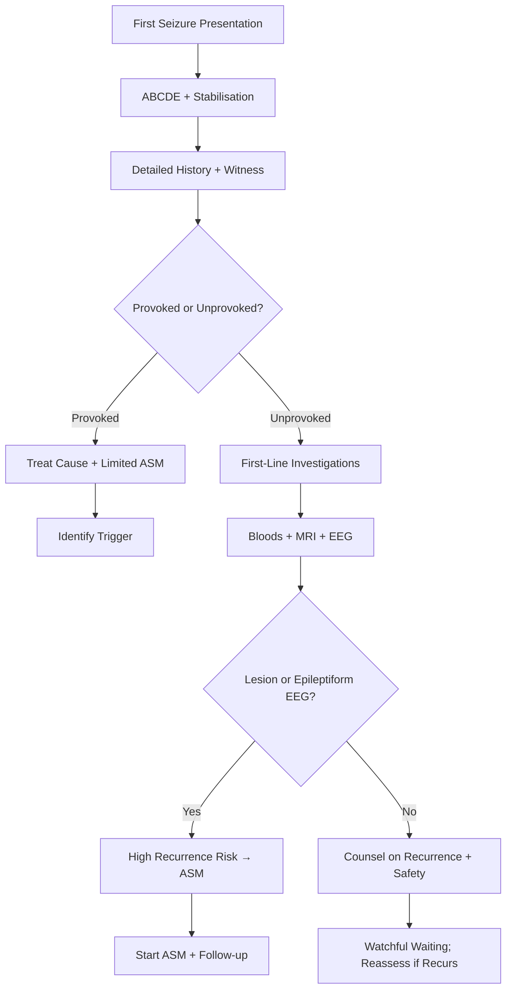

# First Seizure Management

Related: [[Epilepsy & Seizure Disorders Hub]], [[Seizure Classification & Diagnosis Hub]], [[ILAE 2017 Seizure Classification]], [[Status Epilepticus Management]], [[ASM Mechanisms & Classification]]

> [!tip] **ILAE 2014 Practical Definition of Epilepsy**
> Epilepsy is diagnosed after:
> 1. **≥2 unprovoked (or reflex) seizures >24h apart**, OR
> 2. **1 unprovoked seizure + high recurrence risk (≥60% over 10y)** (e.g., structural lesion, abnormal EEG, prior brain insult), OR
> 3. **Diagnosis of an epilepsy syndrome**

> [!tip] After a FIRST unprovoked seizure, recurrence risk is ~40-50% over 2 years if untreated. ASM reduces this by ~35% (FIRST and MESS trials), but does not alter long-term prognosis.

---

## Learning Objectives
- [x] Apply ILAE 2014 definition of epilepsy
- [x] Differentiate provoked vs unprovoked vs acute symptomatic
- [x] Recognise differential diagnosis (PNES, syncope, TIA, TGA)
- [x] Order first-line investigations (MRI, EEG, bloods)
- [x] Decide on ASM initiation
- [x] Counsel on driving (DVLA), safety, lifestyle
- [x] Identify high-recurrence-risk features

---

## 1. Definition

### First Seizure
- A first-ever witnessed or self-reported seizure event
- May be provoked (acute symptomatic) or unprovoked

### Acute Symptomatic (Provoked) Seizure
- Seizure within 7 days of:
  - Stroke, TBI, neurosurgery
  - CNS infection (meningitis, encephalitis, abscess)
  - Acute metabolic derangement (hyponatraemia, hypoglycaemia, hypocalcaemia, uraemia)
  - Drug/toxin (alcohol withdrawal, cocaine, amphetamines, tramadol, theophylline toxicity)
  - Eclampsia
  - Hypoxia
- Recurrence risk lower (≈3-10%) than unprovoked
- **Treat the cause; ASM often not needed long-term**

### Unprovoked Seizure
- No acute precipitant identified
- Recurrence risk: ~40-50% over 2 years
- Higher if: abnormal MRI, abnormal EEG, prior brain insult, nocturnal seizure, focal onset

---

## 2. Epidemiology

| Metric | Value |
|--------|-------|
| Incidence of first seizure | 50-100/100,000/year |
| Lifetime prevalence | 5-10% (single seizure) |
| Recurrence after 1st unprovoked | 40-50% over 2 years |
| Conversion to epilepsy | ~30% (higher if risk factors) |
| Peak age | Bimodal: <1y and >60y |

---

## 3. Differential Diagnosis

| Condition | Distinguishing | Test |
|-----------|----------------|------|
| **PNES** | Asynchronous, eye closure, pelvic thrust, long duration, no post-ictal | Video-EEG |
| **Syncope** | Prodrome, brief, no post-ictal | ECG, tilt table |
| **TIA** | Negative symptoms, no motor/convulsion | DWI MRI |
| **TGA** | Anterograde amnesia, no motor | DWI MRI (CA1) |
| **Migraine with aura** | Gradual spread, headache follows | History |
| **Movement disorder** | No LOC, suppressible | Clinical |
| **Parasomnia** | From sleep | Video-EEG, PSG |
| **Drop attack** | No LOC, no post-ictal | History |
| **Cervical myelopathy** | Lhermitte's, long-tract signs | MRI cervical spine |

---

## 4. Clinical Features

### History
- **Detailed witness account** is the single most useful diagnostic tool
- **Pre-ictal:** prodrome (aura, déjà vu, epigastric rising), triggers (sleep deprivation, alcohol, flashing lights)
- **Ictal:** onset (focal/generalized), evolution, eye/head deviation, automatisms, vocalisation, tonic/clonic, duration
- **Post-ictal:** confusion, dysarthria, focal weakness (Todd's paresis), tongue biting, incontinence, headache, myalgia
- **Past medical:** febrile seizures, head trauma, CNS infection, stroke, family history

### Examination
- ABCDE, **GCS**, post-ictal confusion
- Look for: tongue laceration (lateral), incontinence, posterior shoulder dislocation
- **Full neurological exam** including fundoscopy, cognitive screen
- **Cardiovascular** (carotid bruits, BP, postural)
- **Skin:** neurocutaneous stigmata (café-au-lait, ash-leaf, port-wine, shagreen)

---

## 5. Diagnostic Approach

---

## 6. Investigations

### First-Line
| Test | Indication | Expected Finding |
|------|------------|------------------|
| **Bloods** | All: FBC, U&E, Ca2+, Mg2+, glucose, LFT, toxicology, alcohol, AED level (if on treatment) | Underlying metabolic, infection |
| **MRI brain (epilepsy protocol)** | **All** non-provoked first seizures | Hippocampal sclerosis, FCD, tumour, cavernoma, gliosis |
| **EEG** (routine + sleep-deprived) | All unprovoked | Interictal epileptiform discharges (spike/sharp wave) |
| **ECG** | All syncope/seizure differential | QTc, arrhythmia, Brugada, WPW |
| **CT head** | Acute, trauma, focal deficit, immunocompromised | Haemorrhage, mass effect (MRI better for subtle lesions) |

### Second-Line / Targeted
| Test | Indication |
|------|------------|
| **Video-EEG telemetry** | Diagnostic uncertainty, suspected PNES, classification |
| **MEG, fMRI, PET, SISCOM, ictal SPECT** | Presurgical evaluation |
| **LP** | Fever, immunocompromised, suspected encephalitis |
| **Vasculitis/autoimmune screen** | Suspected autoimmune encephalitis (NMDAR, LGI1) |
| **Genetic panel** | Family history, young onset, syndromic features |

### MRI Epilepsy Protocol
- **Sequences:** T1 3D, T2, FLAIR, DWI, SWI, T2* (HFE)
- **Thin slices** through hippocampi (coronal oblique)
- **Review** for: hippocampal sclerosis, FCD (transmantle sign), DNET, ganglioglioma, cavernoma, polymicrogyria, heterotopia

---

## 7. When to Start ASM (Decision-Making)

### Start ASM If:
- ≥2 unprovoked seizures >24h apart (epilepsy diagnosis)
- 1 seizure + high recurrence risk (≥60%):
  - Abnormal MRI (structural lesion)
  - Abnormal EEG (epileptiform)
  - Prior brain insult (stroke, TBI)
  - Nocturnal seizure
  - Focal onset with post-ictal Todd's paresis
- Patient preference after counselling
- Special circumstances (high-risk occupation, prior SE)

### Defer ASM If:
- First unprovoked seizure with normal MRI + EEG
- Provoked (acute symptomatic) seizure — treat cause
- Patient preference (after counselling on 40-50% recurrence vs 35% relative risk reduction with ASM)
- Diagnostic uncertainty (e.g., possible syncope/PNES)

### ASM Choice by Seizure Type
| Seizure Type | First-line |
|--------------|------------|
| Focal (with/without BTC) | Lamotrigine, levetiracetam, carbamazepine |
| Generalized tonic-clonic | Valproate, lamotrigine, levetiracetam |
| Absence (typical) | Ethosuximide, valproate, lamotrigine |
| Myoclonic | Valproate, levetiracetam |
| Mixed/unknown | Levetiracetam, valproate, lamotrigine (broad-spectrum) |

---

## 8. ASM Initiation Principles

- **Start low, titrate slow** (esp. lamotrigine, carbamazepine)
- **Monotherapy preferred**; switch if adverse effects/failure
- **Choose by:** seizure type, age, sex, comorbidities, drug interactions, side effect profile, cost
- **Avoid in women of childbearing age:** Valproate (teratogenic, IQ ↓) → consider levetiracetam/lamotrigine
- **Titration schedule:** Lamotrigine 25mg ×2 weeks → 50mg → 100mg (slow); Levetiracetam 250-500mg BD → titrate to 1000-1500mg BD

### Counselling Points
- Adherence (missed doses = breakthrough + SE risk)
- Side effects: drowsiness, dizziness, mood (levetiracetam), rash (lamotrigine, carbamazepine), hair (valproate)
- **Rash → STOP and seek medical help** (Stevens-Johnson risk)
- Avoid abrupt discontinuation (SE risk)

---

## 9. Special Situations

| Situation | Consideration |
|-----------|---------------|
| **Pregnancy** | Avoid valproate; levetiracetam/lamotrigine preferred; preconception counselling; high-dose folic acid 5mg |
| **Lactation** | Levetiracetam, lamotrigine compatible; monitor infant |
| **Elderly** | Lamotrigine, levetiracetam preferred; lower doses; renal adjust |
| **Renal impairment** | Levetiracetam dose reduction; gabapentin avoid |
| **Hepatic impairment** | Avoid valproate; dose adjust carbamazepine, phenytoin |
| **Driving (UK DVLA)** | **Group 1 (car): 6 months seizure-free**; **Group 2 (HGV): 2 years off + specialist**; provoked seizure 6 months after recovery |
| **Occupational** | Avoid driving, heights, water (alone), heavy machinery |
| **Sports** | Caution with swimming, climbing; avoid contact sports in poorly controlled |
| **Photosensitive** | Avoid flashing lights; use sunglasses, polarised lenses |

---

## 10. Red Flags / When to Refer

| Red Flag | Action |
|----------|--------|
| Status epilepticus (≥5 min) | Treat as emergency (see Status Epilepticus) |
| Focal neurological deficit | Urgent neuroimaging |
| Persistent altered consciousness | Urgent imaging + cEEG |
| Fever + seizure | Urgent workup (meningitis/encephalitis) |
| New rash on ASM | STOP drug; dermatology review (SJS/TEN) |
| Recurrent seizure despite ASM | Review diagnosis, ASM choice, adherence |
| Pregnancy | Preconception + obstetric neurology referral |

---

## 11. Prognosis

| Factor | Recurrence Risk |
|--------|-----------------|
| **Normal MRI + EEG** | ~25% over 2 years |
| **Abnormal EEG only** | ~40% |
| **Abnormal MRI (structural)** | ~60-70% |
| **Both abnormal** | ~80% |
| **Prior brain insult + EEG abn** | >70% |

- Long-term remission: ~70% achieve seizure freedom on first ASM
- ~30% remain refractory (consider [[Drug-Resistant Epilepsy & Surgical Evaluation]])

---

## 12. Topic Correlation

| Related Topic | Link | Overlap |
|---------------|------|---------|
| ILAE 2017 | [[ILAE 2017 Seizure Classification]] | Seizure type classification |
| Status Epilepticus | [[Status Epilepticus Management]] | SE threshold = 5 min |
| Epilepsy in Pregnancy | [[Epilepsy in Pregnancy]] | ASM in pregnancy |
| First-Line ASMs | [[First-Line ASMs by Seizure Type]] | Drug selection |
| Drug-Resistant | [[Drug-Resistant Epilepsy & Surgical Evaluation]] | If 2 ASMs fail |

---

## 13. Follow-up Protocol
- **4-6 weeks:** Review ASM tolerability, adherence, side effects; titrate dose
- **3 months:** Reassess seizure control; EEG if classification uncertain
- **6 months:** Consider ASM withdrawal if seizure-free, normal MRI/EEG, patient preference
- **Annually:** Long-term review; driving, contraception, pregnancy, mental health

---

## FCPS/MRCP High-Yield Summary

| Category | Key Points |
|----------|------------|
| **ILAE 2014 Definition** | ≥2 unprovoked seizures >24h apart, OR 1 + high recurrence risk, OR epilepsy syndrome |
| **Provoked vs Unprovoked** | Provoked: 7d post-stroke, metabolic, infection, drugs, alcohol withdrawal |
| **Recurrence risk** | 40-50% over 2y untreated; reduced by ~35% with ASM |
| **First-line Ix** | MRI brain (epilepsy protocol) + EEG + bloods + ECG |
| **ASM start** | Indicated if epilepsy dx or high recurrence risk; defer if low risk + patient choice |
| **First-line focal** | Lamotrigine, levetiracetam, carbamazepine |
| **First-line generalized** | Valproate, lamotrigine, levetiracetam (avoid valproate in women) |
| **DVLA (UK)** | Group 1: 6 months seizure-free |
| **Pregnancy** | Avoid valproate; levetiracetam safest; folic acid 5mg |

---

## Viva Questions

1. **Q:** What is the ILAE 2014 practical definition of epilepsy?
   **A:** (1) ≥2 unprovoked seizures >24h apart, OR (2) 1 unprovoked seizure + recurrence risk ≥60%, OR (3) epilepsy syndrome.

2. **Q:** When would you start an ASM after a first seizure?
   **A:** If epilepsy diagnosis (≥2 unprovoked) or 1 seizure + high recurrence risk (abnormal MRI/EEG, prior brain insult, focal onset with Todd's paresis).

3. **Q:** What is the DVLA driving rule after a first unprovoked seizure in the UK?
   **A:** Group 1: 6 months off driving; Group 2: 2 years off + specialist review.

4. **Q:** What is the recurrence risk after a first unprovoked seizure?
   **A:** ~40-50% over 2 years; reduced by ~35% relative risk with ASM.

5. **Q:** Name high-recurrence-risk features.
   **A:** Abnormal MRI, abnormal EEG, prior brain insult, nocturnal seizure, focal onset with Todd's paresis, status epilepticus.

---

## Common Confusions / Exam Traps

| Confusion | Clarification |
|-----------|---------------|
| First seizure = epilepsy | NO — only if meets ILAE 2014 criteria |
| ASM prevents epilepsy | NO — reduces recurrence but not long-term outcome |
| Provoked seizure = no driving restriction | FALSE — DVLA 6 months even for provoked |
| All first seizures need LP | NO — only if fever, immunocompromised, suspected meningitis |
| Lamotrigine is always first-line | Often yes; but slow titration; SJS risk; avoid if rapid control needed |
| Valproate in pregnancy is safe | NO — avoid; teratogenic, IQ ↓ |

---

## Mnemonics

1. **`MRI + EEG`** for first seizure: **M**RI brain (epilepsy protocol) + **E**EG (sleep-deprived) within 4 weeks
2. **`FIRST`** for provoked seizure workup: **F**ever, **I**nfection, **R**enal, **S**troke/Substance, **T**rauma/Toxin

---

## One-Page Revision Card

| Topic | First Seizure Management |
|-------|---------------------------|
| **Definition** | First-ever seizure, provoked or unprovoked |
| **ILAE 2014 Epilepsy** | ≥2 unprovoked >24h apart, OR 1 + ≥60% recurrence risk, OR syndrome |
| **Recurrence** | 40-50% over 2y untreated |
| **Investigations** | MRI (epilepsy protocol), EEG, bloods, ECG |
| **ASM** | Start if epilepsy/high risk; defer if low risk + patient choice |
| **First-line** | Focal: lamotrigine/levetiracetam/carbamazepine; Generalized: valproate/lamotrigine/levetiracetam |
| **DVLA** | Group 1: 6 months; Group 2: 2 years |
| **Pregnancy** | Avoid valproate; folic acid 5mg |

---

## MCQs (10)

1. **Question:** ILAE 2014 definition of epilepsy includes all EXCEPT:
   **Options:** A. ≥2 unprovoked seizures >24h apart B. 1 seizure + ≥60% recurrence risk C. Diagnosis of epilepsy syndrome D. A single febrile seizure
   **Answer: D** — Single febrile seizure is provoked, not epilepsy.

2. **Question:** First-line MRI for new-onset seizure in adult:
   **Options:** A. CT head B. MRI with epilepsy protocol C. MRA D. PET
   **Answer: B** — MRI with epilepsy protocol is gold standard.

3. **Question:** DVLA driving restriction (UK) after a first unprovoked seizure, Group 1:
   **Options:** A. 1 month B. 3 months C. 6 months D. 12 months
   **Answer: C** — 6 months seizure-free for Group 1.

4. **Question:** ASM that should be avoided in women of childbearing age:
   **Options:** A. Levetiracetam B. Lamotrigine C. Valproate D. Carbamazepine
   **Answer: C** — Valproate is teratogenic and affects IQ.

5. **Question:** Recurrence risk after first unprovoked seizure, no treatment:
   **Options:** A. 10% B. 25% C. 40-50% D. 90%
   **Answer: C** — 40-50% over 2 years.

6. **Question:** Which is an acute symptomatic (provoked) seizure trigger?
   **Options:** A. Prior stroke at 5 years B. Alcohol withdrawal C. Hippocampal sclerosis D. Focal cortical dysplasia
   **Answer: B** — Alcohol withdrawal is provoked; others are unprovoked.

7. **Question:** After first seizure, what is the most useful diagnostic test?
   **Options:** A. ECG B. CT C. Detailed witness history D. CSF
   **Answer: C** — Witness account guides classification and aetiology.

8. **Question:** A first seizure with normal MRI and EEG, recurrence risk over 2y is approximately:
   **Options:** A. 10% B. 25% C. 50% D. 80%
   **Answer: B** — Low risk if both normal (~25%).

9. **Question:** Which is NOT first-line for focal epilepsy?
   **Options:** A. Lamotrigine B. Levetiracetam C. Carbamazepine D. Ethosuximide
   **Answer: D** — Ethosuximide is for absence seizures.

10. **Question:** Stevens-Johnson syndrome is most associated with which ASM?
    **Options:** A. Levetiracetam B. Lamotrigine C. Valproate D. Topiramate
    **Answer: B** — Lamotrigine (and carbamazepine) carry SJS/TEN risk; titrate slowly.

---

## SBA Questions (10)

1. **Scenario:** 28-year-old with first GTCS in sleep. MRI normal, EEG normal.
   **Question:** Best management?
   **Options:** A. Start levetiracetam B. Defer ASM, counsel, re-evaluate C. Urgent cEEG D. Lumbar puncture
   **Answer: B** — Low recurrence risk; counsel + safety advice + driving restriction.

2. **Scenario:** 22-year-old with first focal to bilateral tonic-clonic seizure. MRI shows right mesial temporal sclerosis. EEG shows right temporal spikes.
   **Question:** Most appropriate management?
   **Options:** A. Defer ASM B. Start lamotrigine or levetiracetam C. Wait for second seizure D. Lifestyle advice only
   **Answer: B** — High recurrence risk (structural + abnormal EEG); start ASM.

3. **Scenario:** 65-year-old with first seizure 3 days after a left MCA stroke.
   **Question:** Most appropriate diagnosis?
   **Options:** A. Unprovoked seizure B. Acute symptomatic (provoked) C. Status epilepticus D. PNES
   **Answer: B** — Within 7 days of stroke = acute symptomatic.

4. **Scenario:** 8-year-old with first generalised tonic-clonic seizure during fever (38.5°C) with viral illness.
   **Question:** Best management?
   **Options:** A. Start valproate B. Start carbamazepine C. Reassure + antipyretics + follow-up D. Immediate EEG and MRI
   **Answer: C** — Likely febrile seizure (provoked by fever); symptomatic management.

5. **Scenario:** 30-year-old with first GTCS. CT head shows a 2 cm right frontal lesion (likely tumour).
   **Question:** Next best step?
   **Options:** A. Start ASM + refer to neurosurgery B. Defer ASM C. Reassure D. Repeat CT in 6 months
   **Answer: A** — High recurrence risk; start ASM and refer for lesion workup.

6. **Scenario:** 25-year-old wants to drive 2 months after first seizure. Currently on levetiracetam, seizure-free.
   **Question:** Correct advice?
   **Options:** A. Can drive now B. Must wait 6 months seizure-free (UK) C. Can drive if on ASM D. Wait 12 months
   **Answer: B** — UK Group 1: 6 months seizure-free.

7. **Scenario:** 32-year-old with first unprovoked seizure, MRI normal, EEG normal. After counselling, opts not to start ASM.
   **Question:** Most appropriate follow-up?
   **Options:** A. Discharge B. Re-evaluate at 6 months; recurrence risk ~25% C. MRI every 6 months D. EEG weekly
   **Answer: B** — Low risk; counsel + follow-up at 3-6 months.

8. **Scenario:** 18-year-old with first seizure, tongue biting, urinary incontinence, post-ictal confusion. All investigations normal.
   **Question:** Most useful next step?
   **Options:** A. CT B. Detailed witness account for classification C. PET D. Genetic testing
   **Answer: B** — Already had MRI; focus on accurate classification.

9. **Scenario:** 40-year-old with first seizure, 3 days after starting ciprofloxacin.
   **Question:** Most appropriate action?
   **Options:** A. Lifetime valproate B. Withdraw ciprofloxacin; re-evaluate C. Continue and start carbamazepine D. MRI brain
   **Answer: B** — Fluoroquinolones lower seizure threshold; withdraw + re-evaluate.

10. **Scenario:** 26-year-old with first seizure, wants to start family. MRI + EEG normal.
    **Question:** Best ASM if started?
    **Options:** A. Valproate B. Carbamazepine C. Levetiracetam D. Phenytoin
    **Answer: C** — Levetiracetam is safest in pregnancy.

---

## Flashcards

- **Q:** ILAE 2014 definition of epilepsy?
  **A:** ≥2 unprovoked >24h apart, OR 1 + ≥60% recurrence risk, OR epilepsy syndrome.

- **Q:** Recurrence risk after first unprovoked seizure?
  **A:** 40-50% over 2 years.

- **Q:** First-line ASM for focal epilepsy?
  **A:** Lamotrigine, levetiracetam, carbamazepine.

- **Q:** DVLA Group 1 driving rule after first seizure?
  **A:** 6 months seizure-free.

- **Q:** Provoked seizure timeframe for stroke/TBI?
  **A:** Within 7 days.

- **Q:** High-recurrence-risk features?
  **A:** Abnormal MRI, abnormal EEG, prior brain insult, focal onset with Todd's paresis, nocturnal seizure.

- **Q:** ASM to avoid in women of childbearing potential?
  **A:** Valproate.

---

## Answer Key with Explanations

### MCQs
1. **D** — Febrile seizures are provoked.
2. **B** — MRI epilepsy protocol is gold standard.
3. **C** — 6 months seizure-free (Group 1).
4. **C** — Valproate is teratogenic and affects IQ.
5. **C** — 40-50% recurrence over 2 years.
6. **B** — Alcohol withdrawal is acute symptomatic.
7. **C** — Witness history is most useful for classification.
8. **B** — Normal MRI + EEG = ~25% recurrence.
9. **D** — Ethosuximide is for absence only.
10. **B** — Lamotrigine SJS risk; slow titration.

### SBAs
1. **B** — Low risk; defer ASM with counselling.
2. **B** — High risk (MTS + abnormal EEG); start ASM.
3. **B** — Within 7 days of stroke = provoked.
4. **C** — Febrile seizure; reassure + antipyretics.
5. **A** — Tumour = high recurrence; start ASM + refer neurosurgery.
6. **B** — UK Group 1: 6 months seizure-free.
7. **B** — Low risk; follow-up at 3-6 months.
8. **B** — Detailed history for classification.
9. **B** — Fluoroquinolones lower seizure threshold; withdraw.
10. **C** — Levetiracetam is safest in pregnancy planning.

---

## Local Navigation
**Heading Hub:** [[../03_Epilepsy_Seizure_Disorders/Epilepsy & Seizure Disorders Hub]]
**Topic-Group Hub:** [[../03_Epilepsy_Seizure_Disorders/Seizure Classification & Diagnosis Hub]]
**Chapter Hierarchy:** [[Davidson Chapter 25 - Neurology Hierarchy]]
**Chapter MOC:** [[Neurology MOC]]
**Drug Reference:** [[../00_Index/Neurology Drug Reference]]
**Related Topics:** [[ILAE 2017 Seizure Classification]], [[Status Epilepticus Management]]

## PasTest Scenario SBAs (Clinical Vignettes)

> **Auto-generated PasTest/Mediscope-style scenario SBAs** grounded in the authored source. Each scenario tests a real clinical fact (triad, specific sign, contraindication, trial, first-line Rx) extracted from the topic. *Source: Ch 27: Neurology & Stroke — First Seizure Management*

**Q1.** Which of the following features is most specific or characteristic of First Seizure Management?

  - **A.** Detailed witness account
  - **B.** A feature common to many acute inflammatory conditions
  - **C.** A non-specific sign that does not localise the diagnosis
  - **D.** An investigation finding rather than a clinical feature

  > **Answer: A** — Detailed witness account
  >
  > *Source:* | **Cervical myelopathy** | Lhermitte's, long-tract signs | MRI cervical spine |

---
### History
- **Detailed witness account** is the single most useful diagnostic tool
- **Pre-ictal:** prodrome (au

