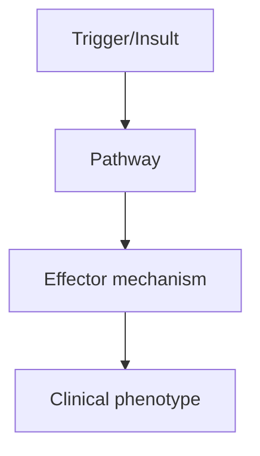
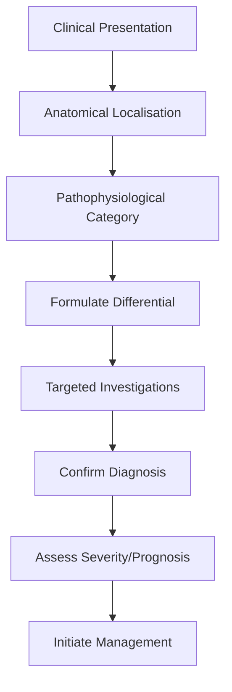
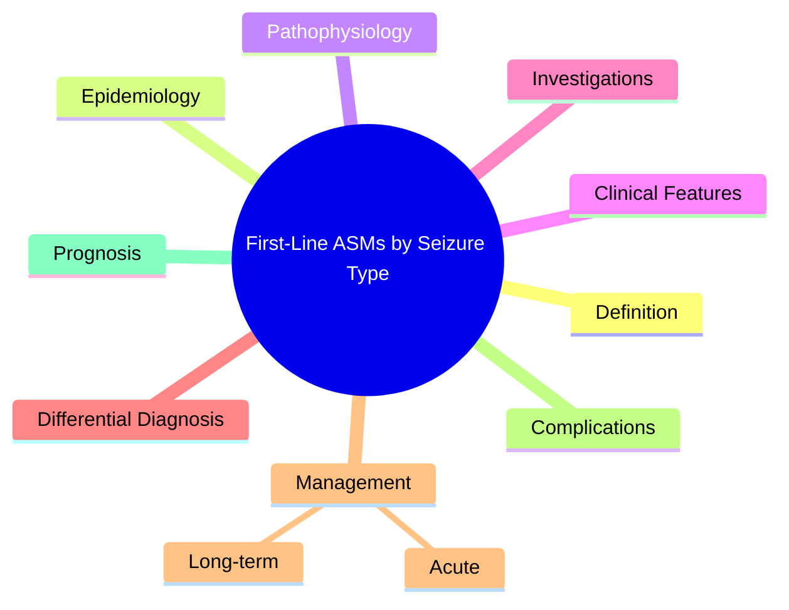

# First-Line ASMs by Seizure Type

> [!tip] **High-Yield Definition**
> Choice of first-line ASM depends on seizure type (or syndrome). Rational ASM selection improves efficacy and avoids worsening of specific seizure types.

---

## 1. Definition / Epidemiology / Classification

### Definition
Choice of first-line ASM depends on seizure type (or syndrome). Rational ASM selection improves efficacy and avoids worsening of specific seizure types.

### Epidemiology
Carbamazepine/oxcarbazepine first-line for focal seizures. Valproate traditional first-line for generalised but avoided in women of childbearing potential. Newer ASMs (levetiracetam, lamotrigine) increasingly used as first-line due to better tolerability.

### Classification
| Variant | Key Features | Prognosis |
|---------|-------------|-----------|
| | | |

---

## 2. Aetiology / Pathophysiology

### Aetiology
N/A. Principles of ASM selection.

### Pathophysiology

---

## 3. Clinical Features

### History
- **Onset/Duration:**
- **Progression:**
- **Key symptoms:**
- **Triggers:**
- **Systemic symptoms:**
- **Drug/Family/Social history:**

### Examination
| Domain | Key Findings | Localisation Value |
|--------|-------------|-------------------|
| | | |

### Specific Clinical Features
Focal seizures (aware, impaired awareness, focal to bilateral TC): First-line = carbamazepine, oxcarbazepine, lamotrigine, levetiracetam. Alternative = eslicarbazepine, lacosamide, zonisamide, topiramate. GTC: valproate, lamotrigine, levetiracetam. Absence (CAE): ethosuximide, valproate. AVOID carbamazepine, phenytoin, gabapentin, vigabatrin (worsen absence). Myoclonic (JME): valproate, levetiracetam, topiramate. AVOID carbamazepine, phenytoin, vigabatrin, tiagabine (worsen myoclonus). Tonic/atonic (LGS): valproate, lamotrigine, rufinamide, felbamate.

---

## 4. Diagnostic Approach / Algorithm

---

## 5. Investigations

EEG (confirms seizure type, syndrome). MRI brain (aetiology). Drug levels (phenytoin, valproate, carbamazepine, ethosuximide) for toxicity/adherence. Side effect monitoring: FBC, LFTs, U&Es, vitamin D, bone density. ECG (CBZ, PHT, LCM, ESL).

---

## 6. Differential Diagnosis

| Differential | Distinguishing Features | Key Test |
|--------------|------------------------|----------|
| | | |

---

## 7. Management

Match ASM to seizure type. Start low, titrate slow (especially LTG). Monotherapy preferred. If 1st ASM fails, try alternative monotherapy. If 2nd monotherapy fails, consider rational polytherapy (different mechanism). Special populations: women (avoid VPA, consider LTG/LEV), elderly (LTG/LEV, avoid enzyme inducers), pregnancy (LEV preferred, folate 5mg, avoid VPA/TPM/PHT).

---

## 8. Drug Interactions / Contraindications / Comorbidity Cautions

| Drug | Interaction / Caution | Management |
|------|----------------------|------------|
| | | |

---

## 9. Procedures (if applicable)

### Procedure:
- **Indications:**
- **Contraindications:**
- **Preparation / Principle:**
- **Complications:**
- **Viva Pearls:**

---

## 10. Complications

| Complication | Frequency | Prevention / Monitoring | Management |
|--------------|-----------|------------------------|------------|
| | | | |

---

## 11. Red Flags / Emergencies

Skin rash (LTG, CBZ, PHT, ESL) - stop immediately, SJS/TEN risk. Hepatic (VPA, CBZ, FBM). Hyponatraemia (CBZ, OXC). Aplastic anaemia (FBM - reserve).

---

## 12. Prognosis

60-70% seizure-free with 1st or 2nd ASM. 30-40% drug-resistant. ASM choice impacts efficacy and side effect profile significantly.

---

## 13. Topic Correlation

| Related Topic | Link | Key Overlap |
|---------------|------|-------------|
| | | |

---

## 14. Special Situations

| Situation | Consideration |
|-----------|---------------|
| **Pregnancy** | |
| **Lactation** | |
| **Paediatric** | |
| **Elderly / Frail** | |
| **Renal impairment** | |
| **Hepatic impairment** | |
| **Immunocompromised** | |
| **Perioperative** | |
| **Driving / DVLA** | |
| **Occupational** | |

---

## FCPS/MRCP High-Yield Summary

| Category | Key Points |
|----------|------------|
| **Definition** | Choice of first-line ASM depends on seizure type (or syndrome). Rational ASM selection improves efficacy and avoids worsening of specific seizure types. |
| **Epidemiology** | Carbamazepine/oxcarbazepine first-line for focal seizures. Valproate traditional first-line for generalised but avoided in women of childbearing poten |
| **Pathophysiology** | |
| **Clinical** | Focal seizures (aware, impaired awareness, focal to bilateral TC): First-line = carbamazepine, oxcarbazepine, lamotrigine, levetiracetam. Alternative = eslicarbazepine, lacosamide, zonisamide, topiram |
| **Diagnosis** | |
| **Investigations** | EEG (confirms seizure type, syndrome). MRI brain (aetiology). Drug levels (phenytoin, valproate, carbamazepine, ethosuximide) for toxicity/adherence. Side effect monitoring: FBC, LFTs, U&Es, vitamin D |
| **Management** | Match ASM to seizure type. Start low, titrate slow (especially LTG). Monotherapy preferred. If 1st ASM fails, try alternative monotherapy. If 2nd monotherapy fails, consider rational polytherapy (diff |
| **Complications** | |
| **Prognosis** | 60-70% seizure-free with 1st or 2nd ASM. 30-40% drug-resistant. ASM choice impacts efficacy and side effect profile significantly. |
| **Viva Pearls** | |
| **Drug Doses** | |
| **Scoring Systems** | |
| **Genetics** | |
| **Imaging Signs** | |

---

## Viva Questions (PACES/FCPS Style)

1. **Q:** Define First-Line ASMs by Seizure Type and classify its variants.
   **A:** Based on the definition above.

2. **Q:** What are the key clinical features?
   **A:** Focal seizures (aware, impaired awareness, focal to bilateral TC): First-line = carbamazepine, oxcarbazepine, lamotrigine, levetiracetam. Alternative = eslicarbazepine, lacosamide, zonisamide, topiramate. GTC: valproate, lamotrigine, levetiracetam. Absence (CAE): ethosuximide, valproate. AVOID carba

3. **Q:** What is the first-line treatment?
   **A:** Based on the management section.

4. **Q:** What are the red flags requiring urgent referral?
   **A:** Skin rash (LTG, CBZ, PHT, ESL) - stop immediately, SJS/TEN risk. Hepatic (VPA, CBZ, FBM). Hyponatraemia (CBZ, OXC). Aplastic anaemia (FBM - reserve).

5. **Q:** What is the prognosis?
   **A:** 60-70% seizure-free with 1st or 2nd ASM. 30-40% drug-resistant. ASM choice impacts efficacy and side effect profile significantly.

6. **Q:** How do you differentiate First-Line ASMs by Seizure Type from key differentials?
   **A:** Clinical features, investigations, and response to treatment.

7. **Q:** What investigations are most useful?
   **A:** Based on the investigations section.

8. **Q:** Describe the stepwise management approach.
   **A:** Based on the management algorithm.

9. **Q:** What are the emergency presentations?
   **A:** Based on the red flags section.

10. **Q:** How does management change in pregnancy/paediatrics/elderly?
    **A:** Special considerations per population.

---

## Common Confusions / Exam Traps

| Confusion | Clarification |
|-----------|---------------|
| | |

---

## Mnemonics
1. **Focal: Lamotrigine or Levetiracetam** — First-line for focal seizures (and most generalised)
1. **GTC: Valproate (M) or Lamotrigine (F)** — Broad-spectrum, valproate most effective but teratogenic
1. **Absence: Ethosuximide (only absence) or Valproate** — Avoid Na+ blockers

---

## Mind Map

---

## Spaced Repetition Trackers

| Review Interval | Date | Score (0-5) | Notes |
|-----------------|------|-------------|-------|
| Day 1 | | | |
| Day 3 | | | |
| Day 7 | | | |
| Day 14 | | | |
| Day 30 | | | |
| Day 90 | | | |

---

## Self-Test Scorecard

| Section | Score /5 | Last Attempt |
|---------|----------|--------------|
| Definition & Epidemiology | | |
| Pathophysiology | | |
| Clinical Features | | |
| Investigations | | |
| Differential Diagnosis | | |
| Management | | |
| Complications & Prognosis | | |
| Viva Questions | | |
| MCQs | | |
| SBAs | | |

---

## MCQs (10)

1. **Question:** First-line for focal seizures:
   **Options:** A. Lamotrigine or levetiracetam B. Ethosuximide C. Carbamazepine only D. Phenytoin
   **Answer:** A
   **Explanation:** Focal seizures: lamotrigine, levetiracetam first-line. Carbamazepine effective but side effects.

2. **Question:** First-line for generalised tonic-clonic seizures (men):
   **Options:** A. Valproate (most effective) or levetiracetam/lamotrigine B. Ethosuximide (only absence) C. Carbamazepine (worsens primary generalised) D. Phenytoin
   **Answer:** A
   **Explanation:** GTC (men): valproate most effective. Levetiracetam, lamotrigine alternatives. Avoid carbamazepine (worsens primary generalised).

3. **Question:** First-line for absence seizures (CAE):
   **Options:** A. Ethosuximide (only absence) or valproate B. Carbamazepine (worsens) C. Phenytoin (worsens) D. Lamotrigine
   **Answer:** A
   **Explanation:** CAE: ethosuximide first-line (no GTC coverage, fewer cognitive effects). Valproate if GTC. Avoid Na+ blockers (worsen absence).

4. **Question:** First-line for juvenile myoclonic epilepsy (JME):
   **Options:** A. Valproate (broad-spectrum) B. Ethosuximide (no myoclonus coverage) C. Carbamazepine (worsens) D. Phenytoin
   **Answer:** A
   **Explanation:** JME: valproate first-line (broad-spectrum, covers absence + GTC + myoclonus). Levetiracetam, topiramate, lamotrigine alternatives.

5. **Question:** First-line for focal seizures in elderly:
   **Options:** A. Levetiracetam (good tolerability, no drug interactions) B. Phenytoin (P450 inducer) C. Carbamazepine (P450 inducer) D. Valproate (cognitive)
   **Answer:** A
   **Explanation:** Elderly: levetiracetam first-line (good tolerability, no P450 interactions, fewer falls).

6. **Question:** First-line for focal seizures in women of childbearing age:
   **Options:** A. Lamotrigine or levetiracetam (avoid valproate) B. Valproate (teratogenic) C. Phenytoin (teratogenic) D. Phenobarbital (teratogenic)
   **Answer:** A
   **Explanation:** Women: avoid valproate (teratogenic). Lamotrigine, levetiracetam safer.

7. **Question:** First-line for focal seizures in pregnancy:
   **Options:** A. Lamotrigine or levetiracetam (safest) B. Valproate (teratogenic) C. Phenytoin (teratogenic) D. Carbamazepine (NTD risk)
   **Answer:** A
   **Explanation:** Pregnancy: lamotrigine, levetiracetam (most data, lowest risk).

8. **Question:** Sodium channel blockers (CBZ, PHT, OXC) are contraindicated in:
   **Options:** A. Primary generalised epilepsies (absence, myoclonus) - worsen B. Focal epilepsy only C. Focal + secondary GTC D. Any epilepsy
   **Answer:** A
   **Explanation:** Na+ blockers (CBZ, PHT, OXC) WORSEN primary generalised epilepsies (absence, myoclonus, JME). Use in focal only.

9. **Question:** ASM with no significant drug interactions:
   **Options:** A. Levetiracetam (no metabolism, renally cleared) B. Phenytoin (P450 inducer) C. Carbamazepine (P450 inducer) D. Valproate (P450 inhibitor)
   **Answer:** A
   **Explanation:** Levetiracetam: no hepatic metabolism, no P450 interactions. Renally cleared. Best for polypharmacy.

---

## SBA Questions (10)

1. **Scenario:** Young woman with JME. Best first-line ASM?
   **Options:** A. Levetiracetam (broad-spectrum, no teratogenicity, alternative to valproate) B. Valproate (teratogenic) C. Carbamazepine (worsens) D. Phenytoin (worsens) E. Ethosuximide (no myoclonus coverage)
   **Answer:** A
   **Explanation:** JME in women of childbearing age: levetiracetam first-line (broad-spectrum, no teratogenicity). Avoid valproate (NTD, cognitive).

2. **Scenario:** Child with absence seizures only. Best first-line?
   **Options:** A. Ethosuximide (specific for absence, less cognitive) B. Valproate (more cognitive effects) C. Carbamazepine (worsens) D. Phenytoin (worsens) E. Lamotrigine
   **Answer:** A
   **Explanation:** CAE (absence only): ethosuximide first-line (specific, less cognitive effects). Valproate if GTC also.

3. **Scenario:** Focal epilepsy in elderly on warfarin. Best ASM?
   **Options:** A. Levetiracetam (no P450 interaction with warfarin) B. Carbamazepine (P450 inducer, reduces warfarin effect) C. Phenytoin (P450 inducer) D. Valproate (P450 inhibitor, increases warfarin) E. Phenobarbital (P450 inducer)
   **Answer:** A
   **Explanation:** Levetiracetam: no P450 interaction. Safer with warfarin, statins, OCP, etc.

---

## Tags

**Tags:** #neurology #epilepsy #ASM #first-line #focal #generalised #absence #JME #FCPS #MRCP

---

## Local Navigation
**Heading Hub:** [[../Antiseizure Medications & Status Epilepticus Hub]]
**Chapter Hierarchy:** [[../../Davidson Chapter 25 - Neurology Hierarchy]]
**Chapter MOC:** [[../../Neurology MOC]]
**Drug Reference:** [[../../00_Index/Neurology Drug Reference]]