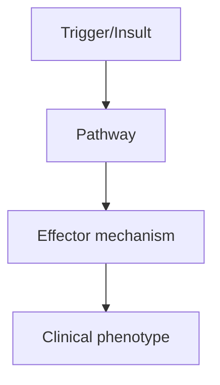
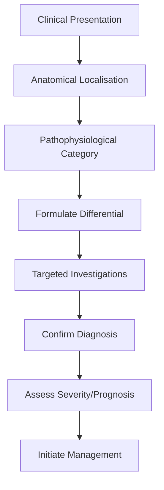
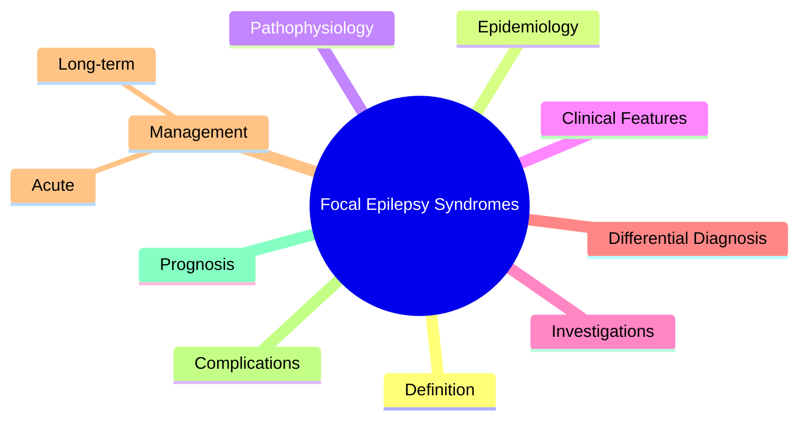

# Focal Epilepsy Syndromes

> [!tip] **High-Yield Definition**
> Epilepsy syndromes with focal seizure onset, including temporal lobe epilepsy (TLE), frontal lobe epilepsy (FLE), parietal lobe epilepsy (PLE), occipital lobe epilepsy (OLE), and specific syndromes like ADLTE (autosomal dominant lateral temporal epilepsy).

---

## 1. Definition / Epidemiology / Classification

### Definition
Epilepsy syndromes with focal seizure onset, including temporal lobe epilepsy (TLE), frontal lobe epilepsy (FLE), parietal lobe epilepsy (PLE), occipital lobe epilepsy (OLE), and specific syndromes like ADLTE (autosomal dominant lateral temporal epilepsy).

### Epidemiology
TLE most common adult focal epilepsy (60% of focal cases). FLE second most common. Familial forms: ADLTE (LGI1), ADNFLE (CHRNA4, CHRNB2, CHRNA2).

### Classification
| Variant | Key Features | Prognosis |
|---------|-------------|-----------|
| | | |

---

## 2. Aetiology / Pathophysiology

### Aetiology
Mesial TLE: mesial temporal sclerosis (most common surgical cause), hippocampal sclerosis, febrile seizures history, HSV encephalitis, trauma, tumour (low-grade), vascular (cavernoma). FLE: FCD (type II), Taylor-type FCD, tumours (DNET, ganglioglioma), polymicrogyria, trauma, post-surgical. PLE: rare, usually lesional. OLE: rare, mitochondrial (MELAS), Lafora, post-ictal amaurosis, migralepsy. ADLTE: LGI1 mutation (autosomal dominant).

### Pathophysiology

---

## 3. Clinical Features

### History
- **Onset/Duration:**
- **Progression:**
- **Key symptoms:**
- **Triggers:**
- **Systemic symptoms:**
- **Drug/Family/Social history:**

### Examination
| Domain | Key Findings | Localisation Value |
|--------|-------------|-------------------|
| | | |

### Specific Clinical Features
TLE (mesial): epigastric aura, déjà vu, fear, olfactory, automatisms (oroalimentary, manual), staring, post-ictal confusion, amnesia. TLE (lateral): auditory hallucinations, vestibular, autonomic. FLE: brief (<30 sec), clusters, bizarre (bicycling, thrashing, vocalisation), nocturnal predominance, minimal post-ictal confusion. PLE: somatosensory auras, vertiginous, receptive aphasia (dominant). OLE: visual auras (simple/complex), eye deviation, blinking, post-ictal migraine.

---

## 4. Diagnostic Approach / Algorithm

---

## 5. Investigations

Prolonged video-EEG (capture 3+ events, characterise onset). High-resolution MRI (epilepsy protocol, 3T, thin-cut hippocampal for mesial sclerosis, FCD). FDG-PET (interictal hypometabolism). Ictal SPECT (subtraction, SISCOM). MEG (source localisation). fMRI for memory/language. Wada (older). Genetic testing (LGI1 for ADLTE).

---

## 6. Differential Diagnosis

| Differential | Distinguishing Features | Key Test |
|--------------|------------------------|----------|
| | | |

---

## 7. Management

First-line ASMs: carbamazepine, oxcarbazepine, lamotrigine, levetiracetam, lacosamide. Surgical evaluation for drug-resistant (2+ ASMs failed): TLE - anterior temporal lobectomy (60-80% seizure-free), FLE - lesionectomy/frontal resection, OLE - occipital resection (risk of visual field defect). VNS, DBS-ANT for non-surgical candidates. Specific: ADLTE - carbamazepine, oxcarbazepine responsive. Lifestyle: trigger avoidance, sleep, stress.

---

## 8. Drug Interactions / Contraindications / Comorbidity Cautions

| Drug | Interaction / Caution | Management |
|------|----------------------|------------|
| | | |

---

## 9. Procedures (if applicable)

### Procedure:
- **Indications:**
- **Contraindications:**
- **Preparation / Principle:**
- **Complications:**
- **Viva Pearls:**

---

## 10. Complications

| Complication | Frequency | Prevention / Monitoring | Management |
|--------------|-----------|------------------------|------------|
| | | | |

---

## 11. Red Flags / Emergencies

Sudden unexpected death in epilepsy (SUDEP), status epilepticus, falls, injuries, cognitive effects, psychiatric comorbidity (depression, anxiety, psychosis), social impact.

---

## 12. Prognosis

60% controlled with ASM. 30-40% drug-resistant. TLE: best surgical outcomes (60-80% seizure-free). FLE: variable, depends on lesion. SUDEP 1/1000/year. Quality of life correlates with seizure control.

---

## 13. Topic Correlation

| Related Topic | Link | Key Overlap |
|---------------|------|-------------|
| | | |

---

## 14. Special Situations

| Situation | Consideration |
|-----------|---------------|
| **Pregnancy** | |
| **Lactation** | |
| **Paediatric** | |
| **Elderly / Frail** | |
| **Renal impairment** | |
| **Hepatic impairment** | |
| **Immunocompromised** | |
| **Perioperative** | |
| **Driving / DVLA** | |
| **Occupational** | |

---

## FCPS/MRCP High-Yield Summary

| Category | Key Points |
|----------|------------|
| **Definition** | Epilepsy syndromes with focal seizure onset, including temporal lobe epilepsy (TLE), frontal lobe epilepsy (FLE), parietal lobe epilepsy (PLE), occipital lobe epilepsy (OLE), and specific syndromes li |
| **Epidemiology** | TLE most common adult focal epilepsy (60% of focal cases). FLE second most common. Familial forms: ADLTE (LGI1), ADNFLE (CHRNA4, CHRNB2, CHRNA2). |
| **Pathophysiology** | |
| **Clinical** | TLE (mesial): epigastric aura, déjà vu, fear, olfactory, automatisms (oroalimentary, manual), staring, post-ictal confusion, amnesia. TLE (lateral): auditory hallucinations, vestibular, autonomic. FLE |
| **Diagnosis** | |
| **Investigations** | Prolonged video-EEG (capture 3+ events, characterise onset). High-resolution MRI (epilepsy protocol, 3T, thin-cut hippocampal for mesial sclerosis, FCD). FDG-PET (interictal hypometabolism). Ictal SPE |
| **Management** | First-line ASMs: carbamazepine, oxcarbazepine, lamotrigine, levetiracetam, lacosamide. Surgical evaluation for drug-resistant (2+ ASMs failed): TLE - anterior temporal lobectomy (60-80% seizure-free), |
| **Complications** | |
| **Prognosis** | 60% controlled with ASM. 30-40% drug-resistant. TLE: best surgical outcomes (60-80% seizure-free). FLE: variable, depends on lesion. SUDEP 1/1000/year. Quality of life correlates with seizure control. |
| **Viva Pearls** | |
| **Drug Doses** | |
| **Scoring Systems** | |
| **Genetics** | |
| **Imaging Signs** | |

---

## Viva Questions (PACES/FCPS Style)

1. **Q:** Define Focal Epilepsy Syndromes and classify its variants.
   **A:** Based on the definition above.

2. **Q:** What are the key clinical features?
   **A:** TLE (mesial): epigastric aura, déjà vu, fear, olfactory, automatisms (oroalimentary, manual), staring, post-ictal confusion, amnesia. TLE (lateral): auditory hallucinations, vestibular, autonomic. FLE: brief (<30 sec), clusters, bizarre (bicycling, thrashing, vocalisation), nocturnal predominance, m

3. **Q:** What is the first-line treatment?
   **A:** Based on the management section.

4. **Q:** What are the red flags requiring urgent referral?
   **A:** Sudden unexpected death in epilepsy (SUDEP), status epilepticus, falls, injuries, cognitive effects, psychiatric comorbidity (depression, anxiety, psychosis), social impact.

5. **Q:** What is the prognosis?
   **A:** 60% controlled with ASM. 30-40% drug-resistant. TLE: best surgical outcomes (60-80% seizure-free). FLE: variable, depends on lesion. SUDEP 1/1000/year. Quality of life correlates with seizure control.

6. **Q:** How do you differentiate Focal Epilepsy Syndromes from key differentials?
   **A:** Clinical features, investigations, and response to treatment.

7. **Q:** What investigations are most useful?
   **A:** Based on the investigations section.

8. **Q:** Describe the stepwise management approach.
   **A:** Based on the management algorithm.

9. **Q:** What are the emergency presentations?
   **A:** Based on the red flags section.

10. **Q:** How does management change in pregnancy/paediatrics/elderly?
    **A:** Special considerations per population.

---

## Common Confusions / Exam Traps

| Confusion | Clarification |
|-----------|---------------|
| | |

---

## Mnemonics
1. **TLE = mesial temporal** — Automatisms (lip-smacking, picking), déjà vu, fear, epigastric rising; MRI: mesial temporal sclerosis
1. **FLE = frontal** — Brief, bizarre, often sleep, hyperkinetic, vocalisation; MRI: FCD
1. **PLE = parietal** — Sensory, somatosensory auras; **OLE = occipital** — visual auras, photopsia

---

## Mind Map

---

## Spaced Repetition Trackers

| Review Interval | Date | Score (0-5) | Notes |
|-----------------|------|-------------|-------|
| Day 1 | | | |
| Day 3 | | | |
| Day 7 | | | |
| Day 14 | | | |
| Day 30 | | | |
| Day 90 | | | |

---

## Self-Test Scorecard

| Section | Score /5 | Last Attempt |
|---------|----------|--------------|
| Definition & Epidemiology | | |
| Pathophysiology | | |
| Clinical Features | | |
| Investigations | | |
| Differential Diagnosis | | |
| Management | | |
| Complications & Prognosis | | |
| Viva Questions | | |
| MCQs | | |
| SBAs | | |

---

## MCQs (10)

1. **Question:** Mesial temporal lobe epilepsy (TLE) features:
   **Options:** A. Automatisms, déjà vu, epigastric aura, lip-smacking, MRI: MTS B. Visual aura C. Brief hyperkinetic sleep seizures D. Progressive
   **Answer:** A
   **Explanation:** TLE: epigastric aura, fear, déjà vu, automatisms. Most common focal epilepsy. Often MTS on MRI.

2. **Question:** Frontal lobe epilepsy features:
   **Options:** A. Brief, bizarre, hyperkinetic, often sleep, vocalisation, FCD on MRI B. Visual aura C. Déjà vu D. Sensory aura
   **Answer:** A
   **Explanation:** FLE: brief (seconds), bizarre, hyperkinetic (cycling, thrashing), often sleep. MRI: FCD (focal cortical dysplasia).

3. **Question:** Parietal lobe epilepsy features:
   **Options:** A. Sensory aura (tingling, numbness), often somatosensory B. Visual aura C. Auditory aura D. Automatisms
   **Answer:** A
   **Explanation:** PLE: somatosensory auras (tingling, numbness, pain). Less common.

4. **Question:** Occipital lobe epilepsy features:
   **Options:** A. Visual aura (colours, shapes, photopsia) B. Auditory aura C. Olfactory aura D. Gustatory aura
   **Answer:** A
   **Explanation:** OLE: visual phenomena (colours, shapes, photopsia, fortification spectra). Sometimes with eye deviation.

5. **Question:** Most common cause of focal epilepsy in adults:
   **Options:** A. Mesial temporal sclerosis (MTS) B. FCD C. Tumour D. Stroke
   **Answer:** A
   **Explanation:** MTS: most common cause of focal epilepsy in adults. Hippocampal sclerosis, often following febrile seizures.

6. **Question:** Focal cortical dysplasia (FCD) MRI features:
   **Options:** A. Blurring of grey-white junction, cortical thickening, T2/FLAIR hyperintensity B. Cyst C. Tumour D. Normal
   **Answer:** A
   **Explanation:** FCD: blurring of grey-white junction, cortical thickening, T2/FLAIR hyperintensity, transmantle sign (Taylor type).

7. **Question:** First-line ASM for focal epilepsy:
   **Options:** A. Lamotrigine or levetiracetam B. Valproate (better for generalised) C. Ethosuximide (only absence) D. Vigabatrin (only spasms)
   **Answer:** A
   **Explanation:** Focal: lamotrigine, levetiracetam, carbamazepine (older but effective).

---

## SBA Questions (10)

1. **Scenario:** Patient with déjà vu, epigastric rising sensation, lip-smacking automatisms. Site?
   **Options:** A. Mesial temporal lobe (TLE) B. Frontal lobe C. Parietal lobe D. Occipital lobe E. Brainstem
   **Answer:** A
   **Explanation:** TLE: epigastric aura, déjà vu, automatisms. Most common focal epilepsy.

2. **Scenario:** Brief bizarre sleep seizures with thrashing, vocalisation. EEG normal interictal. Site?
   **Options:** A. Frontal lobe (FLE) B. Temporal lobe C. Parietal lobe D. Occipital lobe E. Brainstem
   **Answer:** A
   **Explanation:** FLE: brief (seconds), bizarre, hyperkinetic, often sleep. Often normal interictal EEG.

3. **Scenario:** Visual aura (flashing lights, colours), then focal seizure. Site?
   **Options:** A. Occipital lobe (OLE) B. Temporal lobe C. Frontal lobe D. Parietal lobe E. Brainstem
   **Answer:** A
   **Explanation:** OLE: visual phenomena (colours, shapes, photopsia).

---

## Tags

**Tags:** #neurology #epilepsy #focal #TLE #FLE #PLE #OLE #MTS #FCD #FCPS #MRCP

---

## Local Navigation
**Heading Hub:** [[../Epilepsy Syndromes & Special Situations Hub]]
**Chapter Hierarchy:** [[../../Davidson Chapter 25 - Neurology Hierarchy]]
**Chapter MOC:** [[../../Neurology MOC]]
**Drug Reference:** [[../../00_Index/Neurology Drug Reference]]