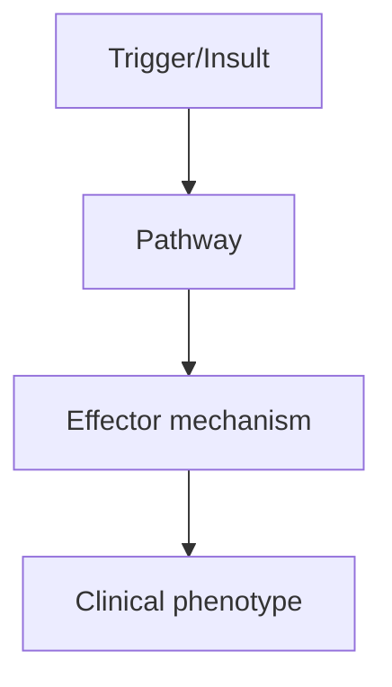
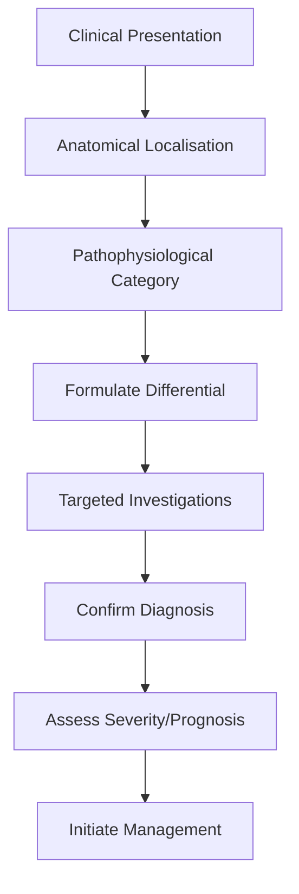
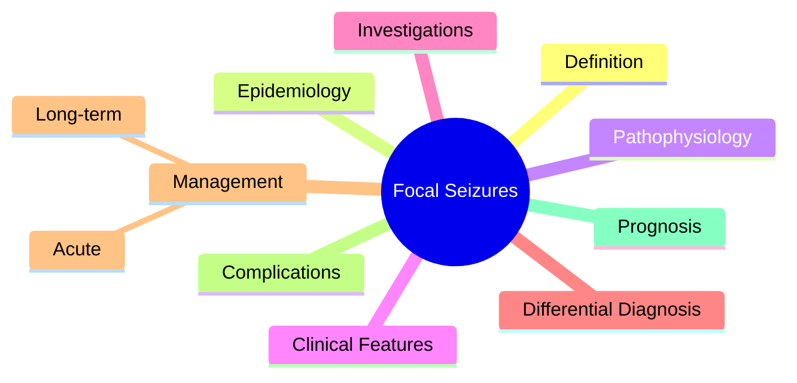

# Focal Seizures

> [!tip] **High-Yield Definition**
> Seizures originating within networks limited to one hemisphere. May be aware (focal aware, previously 'simple partial') or with impaired awareness (focal impaired awareness, previously 'complex partial'). May evolve to bilateral tonic-clonic (focal to bilateral tonic-clonic). ILAE 2017 classification.

---

## 1. Definition / Epidemiology / Classification

### Definition
Seizures originating within networks limited to one hemisphere. May be aware (focal aware, previously 'simple partial') or with impaired awareness (focal impaired awareness, previously 'complex partial'). May evolve to bilateral tonic-clonic (focal to bilateral tonic-clonic). ILAE 2017 classification.

### Epidemiology
Focal seizures account for 60% of all epilepsies in adults. Any age, commoner with age (cumulative vascular, traumatic, tumour causes).

### Classification
| Variant | Key Features | Prognosis |
|---------|-------------|-----------|
| | | |

---

## 2. Aetiology / Pathophysiology

### Aetiology
Mesial temporal sclerosis, cortical dysplasia (FCD), low-grade tumours (DNET, ganglioglioma), cavernomas, post-stroke, post-traumatic, vascular malformations, autoimmune encephalitis (LGI1, GAD), infections, neurodegenerative.

### Pathophysiology

---

## 3. Clinical Features

### History
- **Onset/Duration:**
- **Progression:**
- **Key symptoms:**
- **Triggers:**
- **Systemic symptoms:**
- **Drug/Family/Social history:**

### Examination
| Domain | Key Findings | Localisation Value |
|--------|-------------|-------------------|
| | | |

### Specific Clinical Features
Focal aware: subjective phenomena only (aura). Motor: Jacksonian, versive, tonic, clonic, hyperkinetic. Autonomic: epigastric rising, flushing, piloerection. Sensory: somatosensory, visual, auditory, olfactory, gustatory. Cognitive: dysphasia, déjà vu, jamais vu, dreamy state, structured hallucinations. Focal impaired awareness: impaired consciousness, automatisms (oroalimentary, manual, pedal), staring, post-ictal confusion. Focal to bilateral tonic-clonic: tonic-clonic evolution.

---

## 4. Diagnostic Approach / Algorithm

---

## 5. Investigations

EEG: interictal epileptiform discharges (focal spikes, sharps), ictal patterns. MRI brain (epilepsy protocol, thin-cut hippocampal for mesial TLE). Prolonged video-EEG (capture 3+ events, characterise focus). FDG-PET, ictal SPECT, MEG, fMRI for surgical planning.

---

## 6. Differential Diagnosis

| Differential | Distinguishing Features | Key Test |
|--------------|------------------------|----------|
| | | |

---

## 7. Management

First-line ASMs: carbamazepine, oxcarbazepine, lamotrigine, levetiracetam. Avoid: tiagabine, vigabatrin (may worsen myoclonus). Acute management of focal seizures: benzodiazepine, then ASM. Status epilepticus protocol. Surgical evaluation if drug-resistant (2+ ASMs failed). VNS/DBS for refractory.

---

## 8. Drug Interactions / Contraindications / Comorbidity Cautions

| Drug | Interaction / Caution | Management |
|------|----------------------|------------|
| | | |

---

## 9. Procedures (if applicable)

### Procedure:
- **Indications:**
- **Contraindications:**
- **Preparation / Principle:**
- **Complications:**
- **Viva Pearls:**

---

## 10. Complications

| Complication | Frequency | Prevention / Monitoring | Management |
|--------------|-----------|------------------------|------------|
| | | | |

---

## 11. Red Flags / Emergencies

New onset focal seizures >25y always warrant imaging. Status epilepticus, focal to bilateral tonic-clonic, post-ictal Todd's paresis warrant investigation.

---

## 12. Prognosis

60% controlled with 1 ASM. 30-40% drug-resistant. Surgical resection in selected candidates: 60-80% seizure-free. SUDEP risk 1/1000/year for active epilepsy.

---

## 13. Topic Correlation

| Related Topic | Link | Key Overlap |
|---------------|------|-------------|
| | | |

---

## 14. Special Situations

| Situation | Consideration |
|-----------|---------------|
| **Pregnancy** | |
| **Lactation** | |
| **Paediatric** | |
| **Elderly / Frail** | |
| **Renal impairment** | |
| **Hepatic impairment** | |
| **Immunocompromised** | |
| **Perioperative** | |
| **Driving / DVLA** | |
| **Occupational** | |

---

## FCPS/MRCP High-Yield Summary

| Category | Key Points |
|----------|------------|
| **Definition** | Seizures originating within networks limited to one hemisphere. May be aware (focal aware, previously 'simple partial') or with impaired awareness (focal impaired awareness, previously 'complex partia |
| **Epidemiology** | Focal seizures account for 60% of all epilepsies in adults. Any age, commoner with age (cumulative vascular, traumatic, tumour causes). |
| **Pathophysiology** | |
| **Clinical** | Focal aware: subjective phenomena only (aura). Motor: Jacksonian, versive, tonic, clonic, hyperkinetic. Autonomic: epigastric rising, flushing, piloerection. Sensory: somatosensory, visual, auditory,  |
| **Diagnosis** | |
| **Investigations** | EEG: interictal epileptiform discharges (focal spikes, sharps), ictal patterns. MRI brain (epilepsy protocol, thin-cut hippocampal for mesial TLE). Prolonged video-EEG (capture 3+ events, characterise |
| **Management** | First-line ASMs: carbamazepine, oxcarbazepine, lamotrigine, levetiracetam. Avoid: tiagabine, vigabatrin (may worsen myoclonus). Acute management of focal seizures: benzodiazepine, then ASM. Status epi |
| **Complications** | |
| **Prognosis** | 60% controlled with 1 ASM. 30-40% drug-resistant. Surgical resection in selected candidates: 60-80% seizure-free. SUDEP risk 1/1000/year for active epilepsy. |
| **Viva Pearls** | |
| **Drug Doses** | |
| **Scoring Systems** | |
| **Genetics** | |
| **Imaging Signs** | |

---

## Viva Questions (PACES/FCPS Style)

1. **Q:** Define Focal Seizures and classify its variants.
   **A:** Based on the definition above.

2. **Q:** What are the key clinical features?
   **A:** Focal aware: subjective phenomena only (aura). Motor: Jacksonian, versive, tonic, clonic, hyperkinetic. Autonomic: epigastric rising, flushing, piloerection. Sensory: somatosensory, visual, auditory, olfactory, gustatory. Cognitive: dysphasia, déjà vu, jamais vu, dreamy state, structured hallucinati

3. **Q:** What is the first-line treatment?
   **A:** Based on the management section.

4. **Q:** What are the red flags requiring urgent referral?
   **A:** New onset focal seizures >25y always warrant imaging. Status epilepticus, focal to bilateral tonic-clonic, post-ictal Todd's paresis warrant investigation.

5. **Q:** What is the prognosis?
   **A:** 60% controlled with 1 ASM. 30-40% drug-resistant. Surgical resection in selected candidates: 60-80% seizure-free. SUDEP risk 1/1000/year for active epilepsy.

6. **Q:** How do you differentiate Focal Seizures from key differentials?
   **A:** Clinical features, investigations, and response to treatment.

7. **Q:** What investigations are most useful?
   **A:** Based on the investigations section.

8. **Q:** Describe the stepwise management approach.
   **A:** Based on the management algorithm.

9. **Q:** What are the emergency presentations?
   **A:** Based on the red flags section.

10. **Q:** How does management change in pregnancy/paediatrics/elderly?
    **A:** Special considerations per population.

---

## Common Confusions / Exam Traps

| Confusion | Clarification |
|-----------|---------------|
| | |

---

## Mnemonics
1. **FOCAL = ONE hemisphere** — Originating within networks of one hemisphere
1. **Aware vs Impaired Awareness** — Focal aware (was 'simple partial') vs focal impaired awareness (was 'complex partial')
1. **Focal to Bilateral Tonic-Clonic** — Spreads to both hemispheres (was 'secondarily generalised')

---

## Mind Map

---

## Spaced Repetition Trackers

| Review Interval | Date | Score (0-5) | Notes |
|-----------------|------|-------------|-------|
| Day 1 | | | |
| Day 3 | | | |
| Day 7 | | | |
| Day 14 | | | |
| Day 30 | | | |
| Day 90 | | | |

---

## Self-Test Scorecard

| Section | Score /5 | Last Attempt |
|---------|----------|--------------|
| Definition & Epidemiology | | |
| Pathophysiology | | |
| Clinical Features | | |
| Investigations | | |
| Differential Diagnosis | | |
| Management | | |
| Complications & Prognosis | | |
| Viva Questions | | |
| MCQs | | |
| SBAs | | |

---

## MCQs (10)

1. **Question:** Focal aware seizure was previously called:
   **Options:** A. Simple partial (consciousness preserved) B. Complex partial C. Petit mal D. Grand mal
   **Answer:** A
   **Explanation:** ILAE 2017: 'focal aware' replaces 'simple partial'. 'Focal impaired awareness' replaces 'complex partial'.

2. **Question:** Focal impaired awareness seizure was previously called:
   **Options:** A. Complex partial B. Simple partial C. Petit mal D. Grand mal
   **Answer:** A
   **Explanation:** Focal impaired awareness = old 'complex partial'. Consciousness impaired at some point.

3. **Question:** Focal seizure evolving to bilateral tonic-clonic:
   **Options:** A. Focal to bilateral tonic-clonic (was 'secondarily generalised') B. Primary GTC C. Absence D. Myoclonic
   **Answer:** A
   **Explanation:** Focal to bilateral tonic-clonic: starts focal, spreads to both hemispheres. Was 'secondarily generalised'.

4. **Question:** Jacksonian march is:
   **Options:** A. Sequential spread of focal motor seizure along homunculus B. Generalised seizure C. Myoclonic D. Atonic
   **Answer:** A
   **Explanation:** Jacksonian: focal motor seizure spreading sequentially along motor cortex (face → arm → leg).

5. **Question:** Todd's paresis is:
   **Options:** A. Post-ictal focal weakness lasting minutes-hours after focal seizure B. Persistent deficit C. Pre-ictal aura D. Status epilepticus
   **Answer:** A
   **Explanation:** Todd's paresis: post-ictal focal weakness (minutes to 36h). Indicates focal onset, often structural.

6. **Question:** Focal seizure with aphasia suggests onset in:
   **Options:** A. Dominant temporal/parietal lobe (Wernicke's area) B. Frontal lobe C. Occipital lobe D. Cerebellum
   **Answer:** A
   **Explanation:** Focal aphasia (ictal) suggests dominant hemisphere. Post-ictal aphasia (Todd's) similar.

7. **Question:** Automatisms in focal seizures are most common in:
   **Options:** A. Temporal lobe epilepsy B. Frontal lobe C. Parietal lobe D. Occipital lobe
   **Answer:** A
   **Explanation:** Automatisms (lip-smacking, picking, chewing) most common in TLE. Frontal: more bimanual, bicycling, vocalisation.

8. **Question:** First-line investigation for focal seizure:
   **Options:** A. MRI brain (epilepsy protocol) + EEG B. CT head only C. PET only D. SPECT only
   **Answer:** A
   **Explanation:** First-line: MRI (epilepsy protocol) + EEG. CT if acute to rule out bleed.

9. **Question:** New-onset focal seizure in adult >25y:
   **Options:** A. Always warrants MRI (looking for structural cause) B. No imaging if EEG normal C. Genetic only D. Idiopathic
   **Answer:** A
   **Explanation:** New-onset focal seizure in adult >25y: always image. Look for MTS, FCD, tumour, vascular malformation.

---

## SBA Questions (10)

1. **Scenario:** 60y man, first GTC, MRI shows right temporal lobe cavernoma. Diagnosis?
   **Options:** A. Focal seizure with bilateral tonic-clonic (right temporal) B. Primary GTC C. Absence D. Myoclonic E. Juvenile myoclonic
   **Answer:** A
   **Explanation:** Cavernoma = structural cause of focal seizure. With GTC spread: focal to bilateral tonic-clonic.

2. **Scenario:** Patient with focal seizure, post-ictal right arm weakness for 2 hours. Normal MRI. Next step?
   **Options:** A. Repeat MRI with better protocol, long-term EEG, consider repeat B. Discharge C. No follow-up D. Reassure E. Ignore
   **Answer:** A
   **Explanation:** Todd's paresis confirms focal onset. Normal MRI may miss small lesion. Repeat MRI epilepsy protocol, prolonged EEG.

3. **Scenario:** Patient with new-onset focal seizures, MRI shows left temporal lobe lesion. Next investigation?
   **Options:** A. EEG + consider surgical evaluation if drug-resistant B. No further tests C. Biopsy D. Chemotherapy E. Radiotherapy
   **Answer:** A
   **Explanation:** Structural lesion in TLE. EEG to confirm. If drug-resistant, refer for surgical evaluation (ATL).

---

## Tags

**Tags:** #neurology #epilepsy #focal-seizure #ILAE-2017 #Todd-paresis #automatisms #FCPS #MRCP

---

## Local Navigation
**Heading Hub:** [[../Seizure Classification & Diagnosis Hub]]
**Chapter Hierarchy:** [[../../Davidson Chapter 25 - Neurology Hierarchy]]
**Chapter MOC:** [[../../Neurology MOC]]
**Drug Reference:** [[../../00_Index/Neurology Drug Reference]]