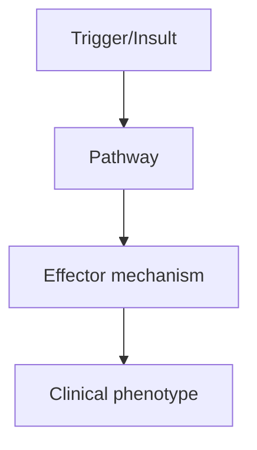
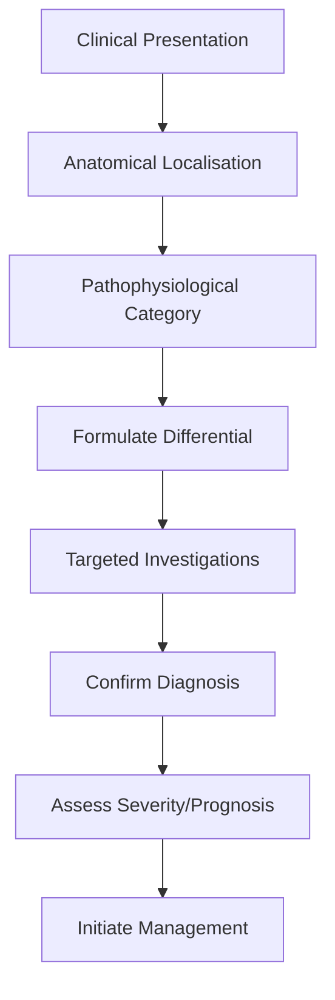
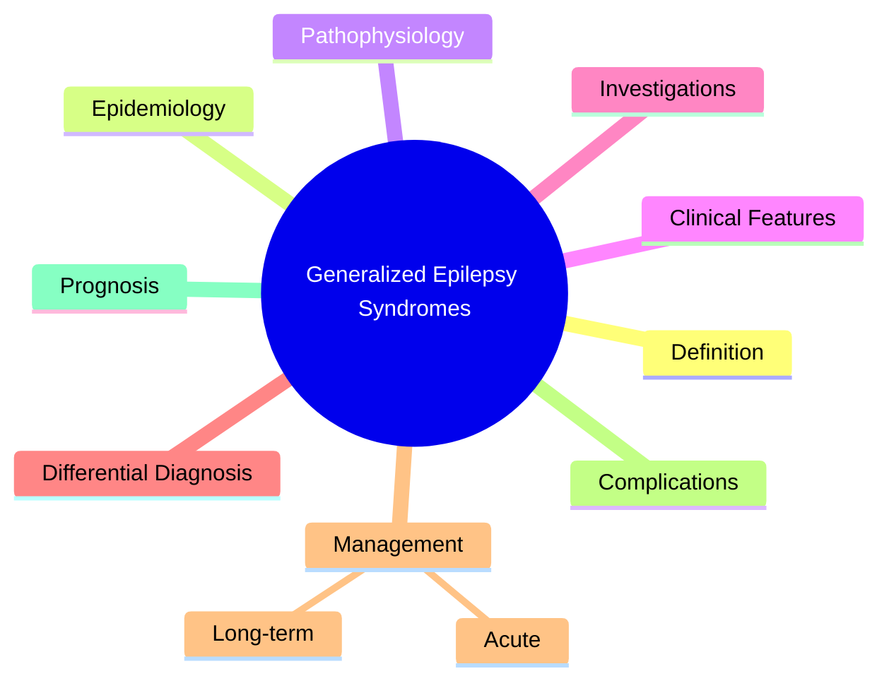

# Generalized Epilepsy Syndromes

> [!tip] **High-Yield Definition**
> Epilepsy syndromes with generalised seizure onset from the start, involving bilateral networks. IGE (idiopathic generalised epilepsies) include CAE, JAE, JME. Other generalised syndromes: EGMA, LGS, Dravet, Myoclonic Atonic Epilepsy (Doose).

---

## 1. Definition / Epidemiology / Classification

### Definition
Epilepsy syndromes with generalised seizure onset from the start, involving bilateral networks. IGE (idiopathic generalised epilepsies) include CAE, JAE, JME. Other generalised syndromes: EGMA, LGS, Dravet, Myoclonic Atonic Epilepsy (Doose).

### Epidemiology
IGE accounts for 15-30% of all epilepsies. CAE 4-10y, F>M. JAE 10-20y, M=F. JME 12-18y, M=F. LGS 1-7y. Dravet <1y onset.

### Classification
| Variant | Key Features | Prognosis |
|---------|-------------|-----------|
| | | |

---

## 2. Aetiology / Pathophysiology

### Aetiology
Genetic predisposition (polygenic, channelopathies). CAE: thalamocortical hyperexcitability. JME: cortical-subcortical network. LGS: multiple causes (structural, genetic, hypoxic). Dravet: SCN1A mutation (80%, sodium channel).

### Pathophysiology

---

## 3. Clinical Features

### History
- **Onset/Duration:**
- **Progression:**
- **Key symptoms:**
- **Triggers:**
- **Systemic symptoms:**
- **Drug/Family/Social history:**

### Examination
| Domain | Key Findings | Localisation Value |
|--------|-------------|-------------------|
| | | |

### Specific Clinical Features
CAE: absence seizures (3Hz SW on EEG), brief (<20 sec), 10-100/day. JAE: absence + GTC. JME: myoclonic jerks (esp. on awakening), absence, GTC, 4-6Hz polyspike-wave. LGS: multiple seizure types (tonic, atonic, atypical absence, GTC), slow spike-wave, cognitive decline. Dravet: prolonged febrile seizures, refractory, myoclonic, absence, GTC, developmental regression.

---

## 4. Diagnostic Approach / Algorithm

---

## 5. Investigations

EEG (3Hz SW in CAE, 4-6Hz PSW in JME, slow spike-wave in LGS, photosensitivity in JME). MRI brain to exclude structural. Genetic testing (SCN1A in Dravet, SLC2A1 in GLUT1, others).

---

## 6. Differential Diagnosis

| Differential | Distinguishing Features | Key Test |
|--------------|------------------------|----------|
| | | |

---

## 7. Management

CAE: ethosuximide (first-line), valproate (alternative). JAE/JME: valproate first-line, lamotrigine alternative (avoid CBZ, PHT, vigabatrin, tiagabine, gabapentin which worsen). LGS: valproate, lamotrigine, rufinamide, felbamate, ACTH, ketogenic diet, VNS. Dravet: valproate, clobazam, stiripentol, fenfluramine, ketogenic diet. Avoid sodium channel blockers (carbamazepine, phenytoin, lamotrigine) in Dravet (worsen).

---

## 8. Drug Interactions / Contraindications / Comorbidity Cautions

| Drug | Interaction / Caution | Management |
|------|----------------------|------------|
| | | |

---

## 9. Procedures (if applicable)

### Procedure:
- **Indications:**
- **Contraindications:**
- **Preparation / Principle:**
- **Complications:**
- **Viva Pearls:**

---

## 10. Complications

| Complication | Frequency | Prevention / Monitoring | Management |
|--------------|-----------|------------------------|------------|
| | | | |

---

## 11. Red Flags / Emergencies

Dravet: prolonged seizures with fever, developmental regression. LGS: cognitive decline. New focal features warrant MRI to exclude structural cause.

---

## 12. Prognosis

CAE: 60% remission by adolescence. JME: lifelong medication usually needed. LGS: refractory, poor cognitive outcome. Dravet: refractory, SUDEP risk, developmental disability.

---

## 13. Topic Correlation

| Related Topic | Link | Key Overlap |
|---------------|------|-------------|
| | | |

---

## 14. Special Situations

| Situation | Consideration |
|-----------|---------------|
| **Pregnancy** | |
| **Lactation** | |
| **Paediatric** | |
| **Elderly / Frail** | |
| **Renal impairment** | |
| **Hepatic impairment** | |
| **Immunocompromised** | |
| **Perioperative** | |
| **Driving / DVLA** | |
| **Occupational** | |

---

## FCPS/MRCP High-Yield Summary

| Category | Key Points |
|----------|------------|
| **Definition** | Epilepsy syndromes with generalised seizure onset from the start, involving bilateral networks. IGE (idiopathic generalised epilepsies) include CAE, JAE, JME. Other generalised syndromes: EGMA, LGS, D |
| **Epidemiology** | IGE accounts for 15-30% of all epilepsies. CAE 4-10y, F>M. JAE 10-20y, M=F. JME 12-18y, M=F. LGS 1-7y. Dravet <1y onset. |
| **Pathophysiology** | |
| **Clinical** | CAE: absence seizures (3Hz SW on EEG), brief (<20 sec), 10-100/day. JAE: absence + GTC. JME: myoclonic jerks (esp. on awakening), absence, GTC, 4-6Hz polyspike-wave. LGS: multiple seizure types (tonic |
| **Diagnosis** | |
| **Investigations** | EEG (3Hz SW in CAE, 4-6Hz PSW in JME, slow spike-wave in LGS, photosensitivity in JME). MRI brain to exclude structural. Genetic testing (SCN1A in Dravet, SLC2A1 in GLUT1, others). |
| **Management** | CAE: ethosuximide (first-line), valproate (alternative). JAE/JME: valproate first-line, lamotrigine alternative (avoid CBZ, PHT, vigabatrin, tiagabine, gabapentin which worsen). LGS: valproate, lamotr |
| **Complications** | |
| **Prognosis** | CAE: 60% remission by adolescence. JME: lifelong medication usually needed. LGS: refractory, poor cognitive outcome. Dravet: refractory, SUDEP risk, developmental disability. |
| **Viva Pearls** | |
| **Drug Doses** | |
| **Scoring Systems** | |
| **Genetics** | |
| **Imaging Signs** | |

---

## Viva Questions (PACES/FCPS Style)

1. **Q:** Define Generalized Epilepsy Syndromes and classify its variants.
   **A:** Based on the definition above.

2. **Q:** What are the key clinical features?
   **A:** CAE: absence seizures (3Hz SW on EEG), brief (<20 sec), 10-100/day. JAE: absence + GTC. JME: myoclonic jerks (esp. on awakening), absence, GTC, 4-6Hz polyspike-wave. LGS: multiple seizure types (tonic, atonic, atypical absence, GTC), slow spike-wave, cognitive decline. Dravet: prolonged febrile seiz

3. **Q:** What is the first-line treatment?
   **A:** Based on the management section.

4. **Q:** What are the red flags requiring urgent referral?
   **A:** Dravet: prolonged seizures with fever, developmental regression. LGS: cognitive decline. New focal features warrant MRI to exclude structural cause.

5. **Q:** What is the prognosis?
   **A:** CAE: 60% remission by adolescence. JME: lifelong medication usually needed. LGS: refractory, poor cognitive outcome. Dravet: refractory, SUDEP risk, developmental disability.

6. **Q:** How do you differentiate Generalized Epilepsy Syndromes from key differentials?
   **A:** Clinical features, investigations, and response to treatment.

7. **Q:** What investigations are most useful?
   **A:** Based on the investigations section.

8. **Q:** Describe the stepwise management approach.
   **A:** Based on the management algorithm.

9. **Q:** What are the emergency presentations?
   **A:** Based on the red flags section.

10. **Q:** How does management change in pregnancy/paediatrics/elderly?
    **A:** Special considerations per population.

---

## Common Confusions / Exam Traps

| Confusion | Clarification |
|-----------|---------------|
| | |

---

## Mnemonics
1. **CAE, JAE = absence** — Childhood vs Juvenile Absence
1. **JME = myoclonic + GTC** — Morning myoclonus, lifelong, 4-6Hz polyspike
1. **GTC only (GGE)** — Generalised tonic-clonic on awakening; similar to JME but without myoclonus

---

## Mind Map

---

## Spaced Repetition Trackers

| Review Interval | Date | Score (0-5) | Notes |
|-----------------|------|-------------|-------|
| Day 1 | | | |
| Day 3 | | | |
| Day 7 | | | |
| Day 14 | | | |
| Day 30 | | | |
| Day 90 | | | |

---

## Self-Test Scorecard

| Section | Score /5 | Last Attempt |
|---------|----------|--------------|
| Definition & Epidemiology | | |
| Pathophysiology | | |
| Clinical Features | | |
| Investigations | | |
| Differential Diagnosis | | |
| Management | | |
| Complications & Prognosis | | |
| Viva Questions | | |
| MCQs | | |
| SBAs | | |

---

## MCQs (10)

1. **Question:** Childhood absence epilepsy (CAE) features:
   **Options:** A. 4-10y, brief absence (<20s), 3Hz spike-wave, often remits B. Adult onset C. Myoclonus only D. Refractory
   **Answer:** A
   **Explanation:** CAE: 4-10y, brief absence 10-20s, 3Hz generalised spike-wave. 60-70% remission by adolescence.

2. **Question:** Juvenile absence epilepsy (JAE) features:
   **Options:** A. >10y, less frequent absences, often with GTC, less likely to remit B. <4y C. Refractory D. Myoclonus
   **Answer:** A
   **Explanation:** JAE: >10y, absences less frequent than CAE, often GTC, less likely to remit than CAE.

3. **Question:** JME first-line:
   **Options:** A. Valproate (broad-spectrum, covers all 3 seizure types in JME) B. Ethosuximide (no GTC/myoclonus coverage) C. Carbamazepine (worsens) D. Phenytoin (worsens)
   **Answer:** A
   **Explanation:** JME: valproate first-line (covers absence + GTC + myoclonus). Levetiracetam, topiramate, lamotrigine alternatives.

4. **Question:** JME triggers:
   **Options:** A. Sleep deprivation, alcohol, stress, photic stimulation, menses B. Reading C. Hot water D. Sound
   **Answer:** A
   **Explanation:** JME: sleep deprivation, alcohol, stress, photic (TV, games), menses (catamenial).

5. **Question:** Juvenile myoclonic epilepsy (JME) treatment duration:
   **Options:** A. Lifelong (90% relapse on withdrawal) B. 1 year C. 2 years D. 5 years
   **Answer:** A
   **Explanation:** JME: lifelong ASM. Withdrawal: 90% relapse, especially with sleep deprivation.

6. **Question:** GTC only (GGE) syndrome features:
   **Options:** A. Generalised tonic-clonic on awakening, no absence/myoclonus, 3Hz spike-wave B. Febrile C. Progressive D. Refractory
   **Answer:** A
   **Explanation:** GTC only (GGE): GTC on awakening, may have absence/myoclonus, 3Hz generalised spike-wave. Often photosensitivity.

7. **Question:** Photosensitivity is most common in:
   **Options:** A. JME, GGE, PME B. CAE only C. Focal epilepsy D. West
   **Answer:** A
   **Explanation:** Photosensitivity: JME, GGE, PME. Photic stimulation on EEG provokes generalised discharges.

8. **Question:** Epilepsy with generalised tonic-clonic seizures alone (GGE):
   **Options:** A. Often misdiagnosed as focal (no obvious generalised features) B. Always with absence C. Always with myoclonus D. Refractory
   **Answer:** A
   **Explanation:** GGE (GTC only): often misdiagnosed as focal (especially if asymmetric, post-ictal Todd's can be confusing).

---

## SBA Questions (10)

1. **Scenario:** 14-year-old, morning myoclonus + GTC. EEG: 4-6Hz polyspike. Diagnosis?
   **Options:** A. Juvenile myoclonic epilepsy B. CAE C. BECTS D. LGS E. Focal epilepsy
   **Answer:** A
   **Explanation:** JME: morning myoclonus + GTC, 4-6Hz generalised polyspike. First-line valproate. Lifelong.

2. **Scenario:** 20-year-old, sleep-deprived, alcohol, has GTC on awakening. EEG: 3Hz spike-wave. Diagnosis?
   **Options:** A. Genetic generalised epilepsy (GGE) B. Focal epilepsy C. JME D. CAE E. LGS
   **Answer:** A
   **Explanation:** GGE: GTC on awakening, 3Hz spike-wave. Often sleep deprivation/stress trigger. AVOID carbamazepine (worsens).

3. **Scenario:** JME on valproate, planning pregnancy. Action?
   **Options:** A. Switch to levetiracetam before conception; folic acid 5mg B. Continue valproate C. Stop ASM D. Increase dose E. Surgery
   **Answer:** A
   **Explanation:** Valproate: teratogenic (NTD 1-2%, cognitive). Switch to levetiracetam/lamotrigine before conception. Folic acid 5mg.

---

## Tags

**Tags:** #neurology #epilepsy #generalised #CAE #JAE #JME #GGE #photosensitivity #FCPS #MRCP

---

## Local Navigation
**Heading Hub:** [[../Epilepsy Syndromes & Special Situations Hub]]
**Chapter Hierarchy:** [[../../Davidson Chapter 25 - Neurology Hierarchy]]
**Chapter MOC:** [[../../Neurology MOC]]
**Drug Reference:** [[../../00_Index/Neurology Drug Reference]]