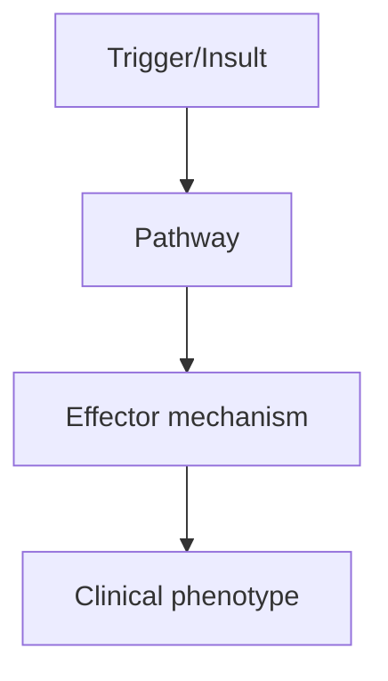
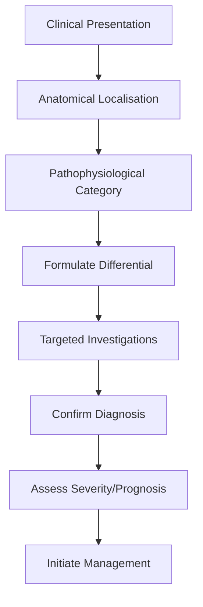
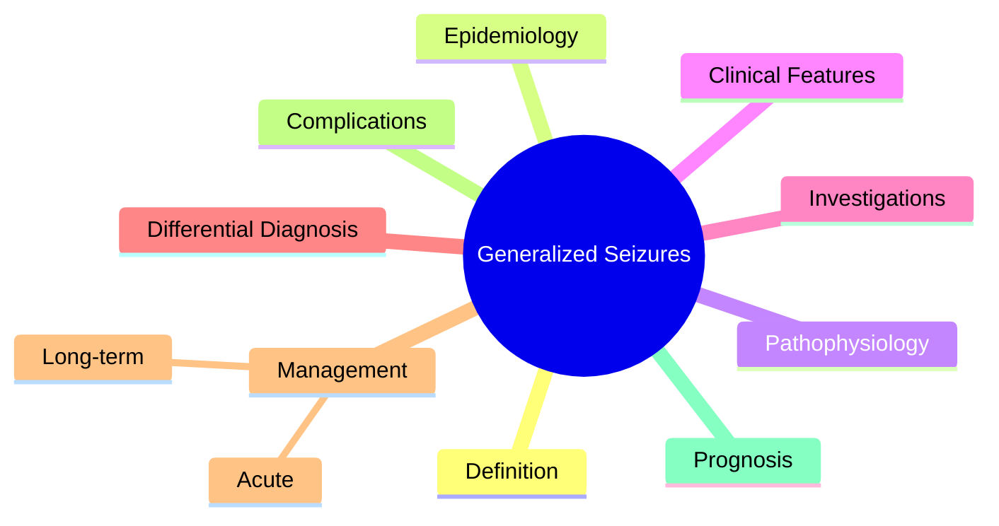

# Generalized Seizures

> [!tip] **High-Yield Definition**
> Seizures with generalised onset from the start, involving bilateral networks. ILAE 2017: generalised tonic-clonic, absence (typical, atypical), myoclonic, tonic, clonic, atonic. Previously 'grand mal' (GTC) and 'petit mal' (absence).

---

## 1. Definition / Epidemiology / Classification

### Definition
Seizures with generalised onset from the start, involving bilateral networks. ILAE 2017: generalised tonic-clonic, absence (typical, atypical), myoclonic, tonic, clonic, atonic. Previously 'grand mal' (GTC) and 'petit mal' (absence).

### Epidemiology
GTC: 5-10% of all epilepsy. Absence: 5-15% of childhood epilepsy. Myoclonic: in IGE (JME), progressive myoclonus epilepsies. Tonic/atonic: in LGS, severe childhood epilepsies.

### Classification
| Variant | Key Features | Prognosis |
|---------|-------------|-----------|
| | | |

---

## 2. Aetiology / Pathophysiology

### Aetiology
Genetic (channelopathies), structural (rare), metabolic, unknown. IGE: polygenic. Progressive myoclonus epilepsies: Lafora, Unverricht-Lundborg, MERRF, sialidosis. Symptomatic: brain malformations, neurodegeneration.

### Pathophysiology

---

## 3. Clinical Features

### History
- **Onset/Duration:**
- **Progression:**
- **Key symptoms:**
- **Triggers:**
- **Systemic symptoms:**
- **Drug/Family/Social history:**

### Examination
| Domain | Key Findings | Localisation Value |
|--------|-------------|-------------------|
| | | |

### Specific Clinical Features
GTC: tonic phase (10-30 sec, rigid, cyanosis, cry), clonic phase (rhythmic jerking, 30-60 sec), post-ictal (coma, flaccid, Todd's paralysis, confusion, myalgia). Absence (typical): brief (5-10 sec), staring, eye flutter, automatisms, no post-ictal confusion. Atypical absence (LGS): slower onset, longer, more tone change. Myoclonic: brief (50-100 ms), single or repetitive, may cluster, conscious. Tonic: sustained contraction (10 sec), often nocturnal. Atonic: sudden loss of tone, drop attacks, falls. Clonic: rhythmic jerking, no tonic phase.

---

## 4. Diagnostic Approach / Algorithm

---

## 5. Investigations

EEG: 3Hz SW (absence), 4-6Hz PSW (myoclonic), generalised polyspike (JME), slow SW (LGS), generalised fast activity (tonic). Video-EEG to characterise. MRI brain to exclude structural. Genetic testing if indicated. Bloods: glucose, electrolytes, toxicology (if symptomatic).

---

## 6. Differential Diagnosis

| Differential | Distinguishing Features | Key Test |
|--------------|------------------------|----------|
| | | |

---

## 7. Management

ASM by seizure type: GTC - valproate, LTG, LEV; absence (typical) - ethosuximide (first-line), valproate; myoclonic - valproate, LEV, TPM; tonic/atonic (LGS) - valproate, LTG, rufinamide, FBM. Acute: status epilepticus protocol. AVOID in IGE: CBZ, PHT, vigabatrin, tiagabine, gabapentin (worsen). Rescue: rectal diazepam, buccal midazolam.

---

## 8. Drug Interactions / Contraindications / Comorbidity Cautions

| Drug | Interaction / Caution | Management |
|------|----------------------|------------|
| | | |

---

## 9. Procedures (if applicable)

### Procedure:
- **Indications:**
- **Contraindications:**
- **Preparation / Principle:**
- **Complications:**
- **Viva Pearls:**

---

## 10. Complications

| Complication | Frequency | Prevention / Monitoring | Management |
|--------------|-----------|------------------------|------------|
| | | | |

---

## 11. Red Flags / Emergencies

GTC: SUDEP, status epilepticus, injuries. Myoclonic: falls, photosensitivity (JME). Progressive myoclonus: neurodegeneration. Status epilepticus: emergency.

---

## 12. Prognosis

IGE: good with appropriate ASM, 60% remission (CAE). JME: lifelong. LGS: refractory. GTC: depends on cause and control. SUDEP risk 1/1000/year.

---

## 13. Topic Correlation

| Related Topic | Link | Key Overlap |
|---------------|------|-------------|
| | | |

---

## 14. Special Situations

| Situation | Consideration |
|-----------|---------------|
| **Pregnancy** | |
| **Lactation** | |
| **Paediatric** | |
| **Elderly / Frail** | |
| **Renal impairment** | |
| **Hepatic impairment** | |
| **Immunocompromised** | |
| **Perioperative** | |
| **Driving / DVLA** | |
| **Occupational** | |

---

## FCPS/MRCP High-Yield Summary

| Category | Key Points |
|----------|------------|
| **Definition** | Seizures with generalised onset from the start, involving bilateral networks. ILAE 2017: generalised tonic-clonic, absence (typical, atypical), myoclonic, tonic, clonic, atonic. Previously 'grand mal' |
| **Epidemiology** | GTC: 5-10% of all epilepsy. Absence: 5-15% of childhood epilepsy. Myoclonic: in IGE (JME), progressive myoclonus epilepsies. Tonic/atonic: in LGS, sev |
| **Pathophysiology** | |
| **Clinical** | GTC: tonic phase (10-30 sec, rigid, cyanosis, cry), clonic phase (rhythmic jerking, 30-60 sec), post-ictal (coma, flaccid, Todd's paralysis, confusion, myalgia). Absence (typical): brief (5-10 sec), s |
| **Diagnosis** | |
| **Investigations** | EEG: 3Hz SW (absence), 4-6Hz PSW (myoclonic), generalised polyspike (JME), slow SW (LGS), generalised fast activity (tonic). Video-EEG to characterise. MRI brain to exclude structural. Genetic testing |
| **Management** | ASM by seizure type: GTC - valproate, LTG, LEV; absence (typical) - ethosuximide (first-line), valproate; myoclonic - valproate, LEV, TPM; tonic/atonic (LGS) - valproate, LTG, rufinamide, FBM. Acute:  |
| **Complications** | |
| **Prognosis** | IGE: good with appropriate ASM, 60% remission (CAE). JME: lifelong. LGS: refractory. GTC: depends on cause and control. SUDEP risk 1/1000/year. |
| **Viva Pearls** | |
| **Drug Doses** | |
| **Scoring Systems** | |
| **Genetics** | |
| **Imaging Signs** | |

---

## Viva Questions (PACES/FCPS Style)

1. **Q:** Define Generalized Seizures and classify its variants.
   **A:** Based on the definition above.

2. **Q:** What are the key clinical features?
   **A:** GTC: tonic phase (10-30 sec, rigid, cyanosis, cry), clonic phase (rhythmic jerking, 30-60 sec), post-ictal (coma, flaccid, Todd's paralysis, confusion, myalgia). Absence (typical): brief (5-10 sec), staring, eye flutter, automatisms, no post-ictal confusion. Atypical absence (LGS): slower onset, lon

3. **Q:** What is the first-line treatment?
   **A:** Based on the management section.

4. **Q:** What are the red flags requiring urgent referral?
   **A:** GTC: SUDEP, status epilepticus, injuries. Myoclonic: falls, photosensitivity (JME). Progressive myoclonus: neurodegeneration. Status epilepticus: emergency.

5. **Q:** What is the prognosis?
   **A:** IGE: good with appropriate ASM, 60% remission (CAE). JME: lifelong. LGS: refractory. GTC: depends on cause and control. SUDEP risk 1/1000/year.

6. **Q:** How do you differentiate Generalized Seizures from key differentials?
   **A:** Clinical features, investigations, and response to treatment.

7. **Q:** What investigations are most useful?
   **A:** Based on the investigations section.

8. **Q:** Describe the stepwise management approach.
   **A:** Based on the management algorithm.

9. **Q:** What are the emergency presentations?
   **A:** Based on the red flags section.

10. **Q:** How does management change in pregnancy/paediatrics/elderly?
    **A:** Special considerations per population.

---

## Common Confusions / Exam Traps

| Confusion | Clarification |
|-----------|---------------|
| | |

---

## Mnemonics
1. **Generalized = BOTH hemispheres** — Bilateral, symmetric onset
1. **Tonic-clonic = grand mal** — Tonic (10-20s) → clonic (jerking) → post-ictal (minutes-hours)
1. **Absence = petit mal** — Brief (<20s) staring, no post-ictal confusion

---

## Mind Map

---

## Spaced Repetition Trackers

| Review Interval | Date | Score (0-5) | Notes |
|-----------------|------|-------------|-------|
| Day 1 | | | |
| Day 3 | | | |
| Day 7 | | | |
| Day 14 | | | |
| Day 30 | | | |
| Day 90 | | | |

---

## Self-Test Scorecard

| Section | Score /5 | Last Attempt |
|---------|----------|--------------|
| Definition & Epidemiology | | |
| Pathophysiology | | |
| Clinical Features | | |
| Investigations | | |
| Differential Diagnosis | | |
| Management | | |
| Complications & Prognosis | | |
| Viva Questions | | |
| MCQs | | |
| SBAs | | |

---

## MCQs (10)

1. **Question:** Generalised seizure onset is:
   **Options:** A. Bilateral from onset (symmetric) B. Starts focal then spreads C. Always with aura D. Asymmetric
   **Answer:** A
   **Explanation:** Generalised: bilateral, symmetric onset. No focal onset. May have prodrome (hours before).

2. **Question:** Typical absence seizure features:
   **Options:** A. Brief (<20s) staring, no post-ictal confusion, 3Hz spike-wave B. Lasts 1-2 minutes C. Focal onset D. Post-ictal confusion
   **Answer:** A
   **Explanation:** Typical absence: brief (5-20s) staring, immediate recovery, 3Hz generalised spike-wave. CAE.

3. **Question:** Atypical absence features:
   **Options:** A. Longer (>20s), slower onset/offset, post-ictal confusion, slow spike-wave (<2.5Hz) B. Brief, no post-ictal C. 3Hz spike-wave D. Symmetric
   **Answer:** A
   **Explanation:** Atypical absence: longer, slower onset/offset, post-ictal confusion, slow spike-wave <2.5Hz. LGS, intellectual disability.

4. **Question:** Myoclonic seizure features:
   **Options:** A. Brief (<1s) shock-like jerks, often morning (JME), polyspike B. Lasts minutes C. Loss of consciousness D. Tonic posturing
   **Answer:** A
   **Explanation:** Myoclonic: brief (<1s), shock-like, often morning. JME. Polyspike-wave on EEG.

5. **Question:** Atonic seizure features:
   **Options:** A. Sudden loss of tone, drop attacks, often children (LGS) B. Tonic C. Clonic D. Myoclonic
   **Answer:** A
   **Explanation:** Atonic: sudden loss of tone, drop attacks. Often in LGS. Brief (<1s).

6. **Question:** Tonic seizure features:
   **Options:** A. Sustained muscle contraction (axial), often sleep, autonomic features B. Jerking C. Staring D. Absence
   **Answer:** A
   **Explanation:** Tonic: sustained muscle contraction. Often in sleep. Axial muscles. Autonomic features. LGS, frontal lobe.

7. **Question:** Clonic seizure features:
   **Options:** A. Rhythmic jerking without tonic phase B. Tonic only C. Staring D. Myoclonic
   **Answer:** A
   **Explanation:** Clonic: rhythmic jerking. Without tonic phase. Less common than tonic-clonic.

8. **Question:** Generalised tonic-clonic seizure phases:
   **Options:** A. Tonic (10-20s) → clonic (jerking) → post-ictal (minutes-hours) B. Single phase C. No post-ictal D. Brief (1-2 min)
   **Answer:** A
   **Explanation:** GTC: tonic (10-20s sustained contraction) → clonic (rhythmic jerking) → post-ictal confusion/sleep.

---

## SBA Questions (10)

1. **Scenario:** Child with brief staring episodes (<20s), 3Hz spike-wave. Diagnosis?
   **Options:** A. Typical absence seizure (CAE) B. Focal seizure C. Myoclonic D. Atonic E. Atypical absence
   **Answer:** A
   **Explanation:** Typical absence: brief (<20s), 3Hz spike-wave, no post-ictal. CAE.

2. **Scenario:** Patient with sudden loss of tone, falls, brief. EEG: slow spike-wave. Diagnosis?
   **Options:** A. Atonic seizure (LGS) B. Myoclonic C. Tonic D. Absence E. Focal
   **Answer:** A
   **Explanation:** Atonic: sudden tone loss, drop attacks. Often LGS. Slow spike-wave <2.5Hz.

3. **Scenario:** Patient with brief morning myoclonus + occasional GTC. Diagnosis?
   **Options:** A. Juvenile myoclonic epilepsy (JME) B. CAE C. BECTS D. Focal epilepsy E. GGE only
   **Answer:** A
   **Explanation:** JME: morning myoclonus + GTC + absence. Polyspike-wave.

---

## Tags

**Tags:** #neurology #epilepsy #generalised #GTC #absence #myoclonic #atonic #tonic #clonic #FCPS #MRCP

---

## Local Navigation
**Heading Hub:** [[../Seizure Classification & Diagnosis Hub]]
**Chapter Hierarchy:** [[../../Davidson Chapter 25 - Neurology Hierarchy]]
**Chapter MOC:** [[../../Neurology MOC]]
**Drug Reference:** [[../../00_Index/Neurology Drug Reference]]