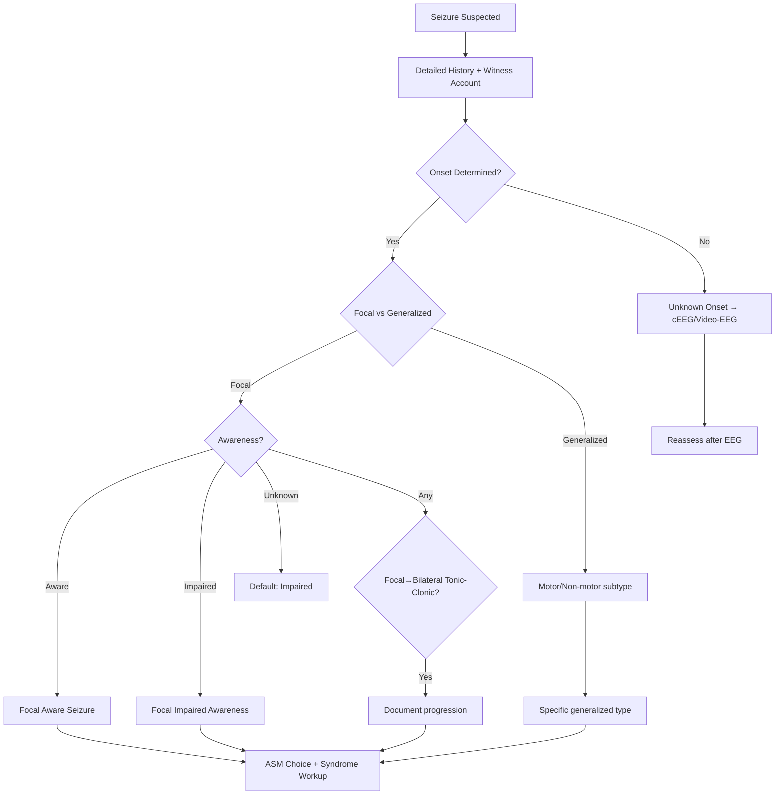

# ILAE 2017 Seizure Classification

Related: [[Epilepsy & Seizure Disorders Hub]], [[Seizure Classification & Diagnosis Hub]], [[Focal Seizures]], [[Generalized Seizures]], [[Generalized Epilepsy Syndromes]], [[Status Epilepticus Management]]

> [!tip] **Three-Step ILAE 2017 Classification**
> 1. **Onset:** Focal / Generalized / Unknown
> 2. **Awareness** (focal only): Aware / Impaired awareness
> 3. **Motor vs Non-motor** (and specific features)

> [!tip] The 2017 update replaced 1981 classification: introduced **"focal" replacing "partial"**, added **impaired awareness** as a classifier, and added new categories (e.g., unknown onset, spasms, automatisms, cognitive/behavioural arrest).

---

## Learning Objectives
- [x] Apply 3-step ILAE 2017 framework
- [x] Differentiate focal vs generalized onset
- [x] Classify focal aware/impaired awareness seizures
- [x] Recognise motor vs non-motor onset
- [x] Describe generalized seizure subtypes
- [x] Identify unknown onset category
- [x] Recognise special seizure types (spasms, myoclonic-atonic)
- [x] Understand key changes from 1981 classification

---

## 1. Definition / Background

### Why 2017?
The 1981 ILAE classification was based on clinical + EEG features. The 2017 update:
- Replaces "partial" with **"focal"**
- Adds **awareness** as a classifier (focal only)
- Adds **motor/non-motor** onset
- Introduces **"unknown onset"** as a category
- Allows classification when only one feature is known
- Includes new seizure types (e.g., behavioural arrest, myoclonic-atonic, spasms)

### Seizure vs Epilepsy
- **Seizure:** Transient hypersynchronous neuronal activity with clinical correlate
- **Epilepsy:** ≥2 unprovoked seizures >24h apart OR 1 seizure + high recurrence risk (≥60% over 10y) OR epilepsy syndrome

---

## 2. The 3-Step ILAE 2017 Framework

### Step 1: Onset
| Type | Definition |
|------|------------|
| **Focal onset** | Seizure activity begins in networks limited to one hemisphere |
| **Generalized onset** | Seizure activity rapidly engages bilaterally distributed networks |
| **Unknown onset** | Onset cannot be determined (witnessed or un-witnessed) |

### Step 2: Awareness (Focal only)
- **Aware** (formerly "simple partial"): Patient retains awareness throughout
- **Impaired awareness** (formerly "complex partial"): Awareness impaired at any point
- **Unknown awareness** (default if unknown)

### Step 3: Motor vs Non-Motor Onset
| Motor Onset | Non-Motor Onset |
|-------------|-----------------|
| Atonic, clonic, epileptic spasms, hyperkinetic, myoclonic, tonic, tonic-clonic, automatisms | Behavioural arrest, cognitive, emotional, sensory, autonomic, absence (typical/atypical) |

---

## 3. Focal Onset Seizures

### Focal Aware Seizures (FAS, formerly "auras")
| Type | Features |
|------|----------|
| **Sensory** | Somatosensory, visual, auditory, olfactory, gustatory, vestibular, thermal |
| **Cognitive** | Aphasia, déjà vu/jamais vu, dreamy state, autoscopy |
| **Emotional** | Fear, anxiety, anger, joy, ecstasy (rare) |
| **Autonomic** | GI rising, flushing, piloerection, palpitations |
| **Motor** | Jacksonian march, focal clonic, versive, dystonic posturing |

### Focal Impaired Awareness Seizures (FIAS)
- Formerly "complex partial" / "temporal lobe seizures"
- Impaired consciousness + automatisms (lip-smacking, fumbling, picking)
- Often temporal lobe origin (mesial); duration 1-2 min; post-ictal confusion

### Focal to Bilateral Tonic-Clonic
- Focal seizure evolves to GTCS — formerly "secondarily generalized"
- Patient may or may not recall focal onset phase

---

## 4. Generalized Onset Seizures

### Motor
| Type | Features |
|------|----------|
| **Tonic-clonic (GTCS)** | Loss of consciousness → tonic (10-20s) → clonic (1-2 min) → post-ictal |
| **Clonic** | Repetitive rhythmic jerking without tonic phase |
| **Tonic** | Sudden tonic muscle stiffening (axial > limb), brief, may fall |
| **Myoclonic** | Brief (<100ms) shock-like jerks, single/multiple, ± loss of tone |
| **Myoclonic-tonic-clonic** | Myoclonic jerks → tonic-clonic (e.g., JME) |
| **Myoclonic-atonic** | Myoclonic jerk followed by atonic drop (Doose syndrome) |
| **Atonic** | Sudden loss of tone, drop attacks ("drop seizures") |
| **Epileptic spasms** | Flexor/extensor/mixed spasms in clusters (West syndrome) |

### Non-Motor (Absence)
| Type | Features | Duration | EEG |
|------|----------|----------|-----|
| **Typical absence** | Sudden behavioural arrest, eyelid flutter, no post-ictal | 5-10 sec | 3 Hz generalized spike-wave |
| **Atypical absence** | Slower onset, tone changes, less abrupt | 10-30 sec | <2.5 Hz slow spike-wave |
| **Absence with special features** | Myoclonic absence, eyelid myoclonia | Variable | Polyspike-wave |

---

## 5. Unknown Onset Seizures
- Includes unwitnessed nocturnal seizures, unclear history
- Classified as **tonic-clonic, epileptic spasms, or behavioural arrest**
- Treated as unclassified until further information
- Workup as for any new-onset seizure

---

## 6. Special Categories

| Category | Description |
|----------|-------------|
| **Epileptic spasms** | Clusters of brief axial/limb flexion/extension (West syndrome infantile; Lennox-Gastaut in older) |
| **Hyperkinetic seizures** | Thrashing, pedalling, pelvic movements (frontal lobe) |
| **Behavioural arrest seizures** | Pause in activity, staring, subtle automatisms (frontal/temporal) |
| **Ictal paresis (Todd's paresis)** | Post-ictal focal weakness; can mimic stroke (lasts hours-days) |

---

## 7. Diagnostic Approach

---

## 8. Clinical Phenotyping Tips

| Feature | Localisation |
|---------|--------------|
| Mesial temporal automatisms | Temporal lobe (mesial) |
| Jacksonian march | Contralateral primary motor cortex |
| Visual aura | Occipital |
| Auditory aura | Temporal (Heschl's) |
| Olfactory aura | Temporal (uncus) — olfactory hallucinations |
| Versive head turn (ictal) | Contralateral frontal eye fields |
| Ictal speech arrest | Dominant hemisphere |
| Post-ictal nasal rubbing | Temporal lobe (often mesial) |
| Pedalling/cycling | Frontal (SMA) |
| Gelastic/dacrystic | Hypothalamic hamartoma |

---

## 9. Differential Diagnosis

| Mimic | Distinguishing | Test |
|-------|----------------|------|
| PNES | Asynchronous, eye closure, side-to-side head | Video-EEG |
| Syncope | Brief, prodrome, no post-ictal confusion | ECG, tilt table |
| TIA | Negative symptoms, no post-ictal | DWI MRI, EEG |
| Migraine with aura | Gradual spread, headache follows | History |
| Movement disorder | No LOC, suppressible | Clinical, EEG |
| Parasomnia | From sleep, complex behaviour | Video-EEG, PSG |
| TGA | Anterograde amnesia, no motor | History, DWI |

---

## 10. Key Changes from 1981 ILAE

| 1981 | 2017 |
|------|------|
| Partial (simple/complex) | Focal (aware/impaired awareness) |
| Secondarily generalized | Focal to bilateral tonic-clonic |
| Absence seizures (only) | Generalized non-motor (with typical/atypical) |
| No unknown category | Unknown onset (tonic-clonic, spasms, behavioural arrest) |
| Myoclonic-astatic | Myoclonic-atonic |
| No "behavioural arrest" | Behavioural arrest seizures added |
| No "automatisms" as onset | Automatisms recognised as motor onset |
| No "cognitive/emotional" non-motor subtypes | Added |

---

## 11. Application to Management

| Seizure Type | First-line ASM |
|--------------|----------------|
| **Focal** | Lamotrigine, levetiracetam, carbamazepine (sodium channel blockers) |
| **Generalized tonic-clonic** | Valproate, lamotrigine, levetiracetam (avoid carbamazepine in JME) |
| **Absence** | Ethosuximide (typical), valproate, lamotrigine |
| **Myoclonic** | Valproate, levetiracetam (avoid carbamazepine, phenytoin) |
| **Tonic/Atonic** | Valproate, lamotrigine, rufinamide (broad-spectrum) |
| **Spasms** | ACTH, prednisolone, vigabatrin (West); ketogenic diet |

**WORSENING seizures:** Carbamazepine, phenytoin, gabapentin, pregabalin can worsen myoclonic and absence seizures.

---

## 12. Investigations

| Investigation | Indication | Expected Finding |
|---------------|------------|------------------|
| **Routine EEG** | All new-onset seizures | Interictal epileptiform discharges |
| **Sleep-deprived EEG** | Suspected generalized | Activates generalised discharges |
| **Video-EEG** | Classification, PNES, presurgical | Ictal semiology + EEG correlate |
| **MRI brain (epilepsy protocol)** | All new-onset focal | Hippocampal sclerosis, FCD, tumour |
| **CT head** | Emergency | Haemorrhage, mass effect |
| **AED levels** | Suspected toxicity/non-adherence | Therapeutic monitoring |
| **Genetic panel** | Suspected monogenic (GEFS+, Dravet) | Specific mutations |

---

## 13. Special Situations

| Situation | Consideration |
|-----------|---------------|
| **Newborn** | Subtle, autonomic; consider genetic/metabolic |
| **Infant** | Spasms (West); consider SCN1A (Dravet) |
| **Child** | Absence, myoclonic, BECTS (Rolandic) |
| **Adolescent** | JME (myoclonic-tonic-clonic on awakening) |
| **Pregnancy** | Avoid valproate; levetiracetam safest |
| **Elderly** | Focal seizures common; vascular aetiology; lamotrigine preferred |
| **Photosensitive** | Avoid triggers; use wide-brim hat, polarised lenses |
| **Driving** | DVLA: 6 months seizure-free (UK Group 1) |
| **Sports** | Avoid swimming alone, climbing |

---

## 14. Topic Correlation

| Related Topic | Link | Overlap |
|---------------|------|---------|
| Status Epilepticus | [[Status Epilepticus Management]] | Classification of SE by ILAE |
| Generalized Syndromes | [[Generalized Epilepsy Syndromes]] | IGE, JME, CAE |
| First Seizure | [[First Seizure Management]] | New-onset classification |
| Focal Seizures | [[Focal Seizures]] | Detailed focal semiology |
| Drug-Resistant Epilepsy | [[Drug-Resistant Epilepsy & Surgical Evaluation]] | Surgical evaluation by type |

---

## FCPS/MRCP High-Yield Summary

| Category | Key Points |
|----------|------------|
| **Three-step** | Onset (Focal/Generalized/Unknown) → Awareness (focal only) → Motor/Non-motor |
| **Focal** | Aware (FAS, "aura"), Impaired (FIAS), or to bilateral tonic-clonic |
| **Generalized motor** | Tonic-clonic, clonic, tonic, myoclonic, atonic, spasms, myoclonic-atonic |
| **Generalized non-motor** | Typical absence (3 Hz), atypical absence (<2.5 Hz) |
| **Unknown** | Used when onset cannot be determined |
| **Worsening agents** | Carbamazepine, phenytoin worsen myoclonic and absence |
| **EEG correlate** | 3 Hz spike-wave = typical absence; 4-6 Hz polyspike = myoclonic |
| **Key change 2017** | "Partial" → "Focal"; "secondarily generalized" → "Focal to bilateral tonic-clonic" |

---

## Viva Questions

1. **Q:** Outline the ILAE 2017 3-step classification.
   **A:** (1) Onset: Focal / Generalized / Unknown; (2) Awareness (focal only): Aware / Impaired; (3) Motor vs Non-motor onset, then specify subtype.

2. **Q:** What is the key change from 1981 to 2017 in ILAE classification?
   **A:** "Partial" replaced by "focal"; "complex partial" → "focal impaired awareness"; "simple partial" → "focal aware"; "secondarily generalized" → "focal to bilateral tonic-clonic"; introduction of "unknown onset".

3. **Q:** Define focal impaired awareness seizure.
   **A:** Focal onset seizure with impaired awareness at any point during the event, often with automatisms; commonly of temporal lobe origin.

4. **Q:** What seizure types are worsened by carbamazepine?
   **A:** Myoclonic and absence seizures; carbamazepine is contraindicated/avoided in JME and other generalised epilepsies.

5. **Q:** What is the typical EEG finding in typical absence seizures?
   **A:** 3 Hz generalized spike-and-wave discharges.

---

## Common Confusions / Exam Traps

| Confusion | Clarification |
|-----------|---------------|
| "Partial" is correct | NO — 2017 ILAE uses "focal" only |
| Focal = simple partial only | NO — focal can be aware OR impaired |
| Absence = always non-motor | YES (non-motor) but typical absence may have eyelid myoclonia |
| Carbamazepine works for all | NO — worsens myoclonic and absence; AVOID in JME |
| Generalized = always whole brain at onset | NO — rapidly engages bilaterally distributed networks |
| Behavioural arrest = absence | NOT always; frontal/temporal focal seizures can present with arrest |
| Todd's paresis = stroke | Mimics; lasts hours-days; EEG may show post-ictal slowing |

---

## Mnemonics

1. **`F-G-U` for Onset:** **F**ocal / **G**eneralized / **U**nknown
2. **`FAS-FIAS-FBTC` for Focal:** **FAS** (aware) / **FIAS** (impaired) / **Focal to Bilateral Tonic-Clonic**
3. **`ABCD` of Worsening ASMs:** **A**bsence, **B**ehavioural/myoclonic worsened by **C**arbamazepine, **D**iphenylhydantoin (phenytoin) — avoid in generalised

---

## One-Page Revision Card

| Topic | ILAE 2017 Classification |
|-------|--------------------------|
| **Step 1** | Focal / Generalized / Unknown onset |
| **Step 2** | Awareness: Aware / Impaired (focal only) |
| **Step 3** | Motor vs Non-motor onset |
| **Focal** | FAS, FIAS, focal to bilateral tonic-clonic |
| **Generalized motor** | Tonic-clonic, myoclonic, tonic, clonic, atonic, spasms |
| **Generalized non-motor** | Typical absence (3 Hz), atypical absence |
| **Key change** | Partial → Focal; 2ndarily generalized → Focal to BTC |
| **Avoid in generalized** | Carbamazepine, phenytoin, gabapentin |

---

## MCQs (10)

1. **Question:** ILAE 2017 classification uses which term for what was previously called "partial seizure"?
   **Options:** A. Focal B. Localised C. Unilateral D. Partial
   **Answer: A** — "Focal" replaced "partial" in 2017.

2. **Question:** ILAE 2017 introduced which new onset category?
   **Options:** A. Bilateral B. Multifocal C. Unknown D. Mixed
   **Answer: C** — "Unknown onset" is a new 2017 category.

3. **Question:** What is the EEG correlate of typical absence seizures?
   **Options:** A. 1 Hz delta B. 3 Hz generalized spike-wave C. 6 Hz polyspike D. Slow background
   **Answer: B** — 3 Hz generalized spike-and-wave discharges.

4. **Question:** Which ASM should be avoided in juvenile myoclonic epilepsy?
   **Options:** A. Valproate B. Lamotrigine C. Carbamazepine D. Levetiracetam
   **Answer: C** — Carbamazepine worsens myoclonic and absence seizures.

5. **Question:** Focal aware seizures were previously called:
   **Options:** A. Complex partial B. Simple partial C. Secondarily generalized D. Absence
   **Answer: B** — "Simple partial" → "Focal aware" in 2017.

6. **Question:** Which seizure type is most characteristic of frontal lobe origin?
   **Options:** A. Automatisms B. Pedalling/cycling C. Post-ictal confusion D. Olfactory aura
   **Answer: B** — Hyperkinetic seizures (pedalling, cycling) suggest frontal lobe (SMA).

7. **Question:** Myoclonic-atonic seizures are characteristic of which syndrome?
   **Options:** A. JME B. BECTS C. Doose syndrome D. Panayiotopoulos
   **Answer: C** — Doose syndrome (epilepsy with myoclonic-atonic seizures).

8. **Question:** Behavioural arrest seizures were:
   **Options:** A. Removed in 2017 B. Newly added in 2017 C. Always classified as absence D. Only generalized
   **Answer: B** — Behavioural arrest added as a non-motor onset in 2017.

9. **Question:** Focal seizure with preserved awareness throughout is classified as:
   **Options:** A. FAS B. FIAS C. Focal to BTC D. Unknown
   **Answer: A** — Focal Aware Seizure.

10. **Question:** Gelastic (laughing) seizures suggest a lesion in which region?
    **Options:** A. Temporal lobe B. Frontal lobe C. Hypothalamus D. Cerebellum
    **Answer: C** — Hypothalamic hamartoma classically causes gelastic seizures.

---

## SBA Questions (10)

1. **Scenario:** 22-year-old with episodes of déjà vu, rising epigastric sensation, then lip-smacking, fumbling, and post-ictal confusion.
   **Question:** Best classification?
   **Options:** A. Focal aware seizure (FAS) B. Focal impaired awareness seizure (FIAS) C. Absence seizure D. TIA
   **Answer: B** — Déjà vu = aura (FAS), then impaired awareness with automatisms = FIAS.

2. **Scenario:** 8-year-old with multiple brief staring episodes daily, 5-10 sec, no post-ictal confusion, hyperventilation triggers.
   **Question:** Most likely seizure type and EEG?
   **Options:** A. Focal aware seizure B. Typical absence + 3 Hz SW C. Atypical absence + 1 Hz D. TIA
   **Answer: B** — Typical absence in CAE; 3 Hz generalized spike-wave.

3. **Scenario:** 25-year-old with morning myoclonic jerks (especially on awakening) and GTCS.
   **Question:** Best first-line ASM?
   **Options:** A. Carbamazepine B. Valproate C. Phenytoin D. Gabapentin
   **Answer: B** — JME; valproate most effective (avoid in women of childbearing age).

4. **Scenario:** 60-year-old with focal aware seizures with olfactory hallucinations.
   **Question:** Most likely localisation?
   **Options:** A. Occipital B. Temporal (uncus) C. Frontal D. Parietal
   **Answer: B** — Olfactory hallucinations = uncus of temporal lobe.

5. **Scenario:** 12-year-old with clusters of brief flexion spasms, hypsarrhythmia on EEG.
   **Question:** Diagnosis and treatment?
   **Options:** A. JME - valproate B. West syndrome - ACTH/vigabatrin C. BECTS - carbamazepine D. Doose - ethosuximide
   **Answer: B** — West syndrome (infantile spasms + hypsarrhythmia); ACTH or vigabatrin.

6. **Scenario:** 35-year-old with focal aware sensory seizures of left hand spreading up arm (Jacksonian).
   **Question:** Localisation?
   **Options:** A. Right primary motor cortex B. Left primary motor cortex C. Right temporal D. Cerebellum
   **Answer: A** — Contralateral primary motor/sensory cortex.

7. **Scenario:** 40-year-old with unwitnessed nocturnal generalised convulsion, MRI shows mesial temporal sclerosis.
   **Question:** Most likely seizure type?
   **Options:** A. Generalized onset tonic-clonic B. Focal to bilateral tonic-clonic C. Absence D. Unknown
   **Answer: B** — MTS usually produces focal (temporal) onset, often progressing to bilateral TC.

8. **Scenario:** Patient with focal seizure with aphasia, mouth automatisms, then impaired awareness.
   **Question:** Localisation?
   **Options:** A. Dominant temporal lobe B. Non-dominant frontal C. Occipital D. Cerebellum
   **Answer: A** — Aphasia = dominant (usually left) hemisphere involvement; automatisms common in temporal.

9. **Scenario:** 6-year-old with nocturnal focal seizures (oroalimentary, autonomic), interictal EEG shows multifocal spikes.
   **Question:** Most likely diagnosis?
   **Options:** A. BECTS (Rolandic) B. Panayiotopoulos syndrome C. JME D. Lennox-Gastaut
   **Answer: B** — Panayiotopoulos: autonomic seizures in young children, often with vomiting.

10. **Scenario:** 18-year-old with drop attacks (sudden loss of tone), cognitive impairment, multiple seizure types.
    **Question:** Most likely syndrome?
    **Options:** A. JME B. Lennox-Gastaut C. CAE D. BECTS
    **Answer: B** — LGS: multiple seizure types (tonic, atonic, atypical absence), cognitive impairment, slow SW EEG.

---

## Flashcards

- **Q:** ILAE 2017 three-step classification?
  **A:** (1) Onset: Focal/Generalized/Unknown; (2) Awareness (focal): Aware/Impaired; (3) Motor vs Non-motor onset.

- **Q:** What replaced "partial" in 2017?
  **A:** "Focal".

- **Q:** What replaced "secondarily generalized"?
  **A:** "Focal to bilateral tonic-clonic".

- **Q:** EEG correlate of typical absence?
  **A:** 3 Hz generalized spike-and-wave.

- **Q:** Which ASMs worsen myoclonic and absence seizures?
  **A:** Carbamazepine, phenytoin, gabapentin, pregabalin, vigabatrin.

- **Q:** Olfactory hallucinations suggest which localization?
  **A:** Temporal lobe (uncus).

- **Q:** Hyperkinetic seizures (pedalling) suggest which lobe?
  **A:** Frontal (supplementary motor area).

---

## Answer Key with Explanations

### MCQs
1. **A** — 2017 ILAE uses "focal", not "partial".
2. **C** — "Unknown onset" is a new 2017 category.
3. **B** — 3 Hz SW is typical absence.
4. **C** — Carbamazepine worsens JME (myoclonic, absence).
5. **B** — "Simple partial" → "Focal aware" in 2017.
6. **B** — Frontal lobe (SMA) produces hyperkinetic seizures.
7. **C** — Doose syndrome = myoclonic-atonic seizures.
8. **B** — Behavioural arrest seizures added in 2017.
9. **A** — FAS = preserved awareness throughout.
10. **C** — Gelastic seizures = hypothalamic hamartoma.

### SBAs
1. **B** — Aura + impaired awareness + automatisms = FIAS (temporal lobe).
2. **B** — Childhood absence epilepsy: 3 Hz SW, hyperventilation provoked.
3. **B** — Valproate most effective in JME; avoid in women of childbearing potential.
4. **B** — Uncus (mesial temporal) gives olfactory hallucinations.
5. **B** — West syndrome: spasms + hypsarrhythmia; ACTH or vigabatrin.
6. **A** — Jacksonian march = contralateral primary motor cortex.
7. **B** — MTS causes focal to bilateral tonic-clonic seizures.
8. **A** — Aphasia = dominant (usually left) temporal.
9. **B** — Panayiotopoulos: autonomic seizures, vomiting, often nocturnal.
10. **B** — LGS: multiple seizure types, drop attacks, cognitive impairment.

---

## Local Navigation
**Heading Hub:** [[../03_Epilepsy_Seizure_Disorders/Epilepsy & Seizure Disorders Hub]]
**Topic-Group Hub:** [[../03_Epilepsy_Seizure_Disorders/Seizure Classification & Diagnosis Hub]]
**Chapter Hierarchy:** [[Davidson Chapter 25 - Neurology Hierarchy]]
**Chapter MOC:** [[Neurology MOC]]
**Drug Reference:** [[../00_Index/Neurology Drug Reference]]
**Related Topics:** [[Focal Seizures]], [[Generalized Seizures]], [[Status Epilepticus Management]]

## PasTest Scenario SBAs (Clinical Vignettes)

> **Auto-generated PasTest/Mediscope-style scenario SBAs** grounded in the authored source. Each scenario tests a real clinical fact (triad, specific sign, contraindication, trial, first-line Rx) extracted from the topic. *Source: Ch 27: Neurology & Stroke — ILAE 2017 Seizure Classification*

**Q1.** Which of the following features is most specific or characteristic of ILAE 2017 Seizure Classification?

  - **A.** Genetic panel
  - **B.** A feature common to many acute inflammatory conditions
  - **C.** A non-specific sign that does not localise the diagnosis
  - **D.** An investigation finding rather than a clinical feature

  > **Answer: A** — Genetic panel
  >
  > *Source:* age, mass effect |
| **AED levels** | Suspected toxicity/non-adherence | Therapeutic monitoring |
| **Genetic panel** | Suspected monogenic (GEFS+, Dravet) | Specific mutations |

---
| Confusion | Cl

**Q2.** What is the most appropriate first-line therapy for ILAE 2017 Seizure Classification?

  - **A.** Generalized tonic-clonic
  - **B.** An advanced/surgical therapy reserved for refractory disease
  - **C.** Symptomatic treatment only, no disease-modifying therapy
  - **D.** Empiric broad-spectrum therapy without specific indication

  > **Answer: A** — Generalized tonic-clonic
  >
  > *Source:* **Generalized tonic-clonic**   Valproate, lamotrigine, levetiracetam (avoid carbamazepine in JME)

