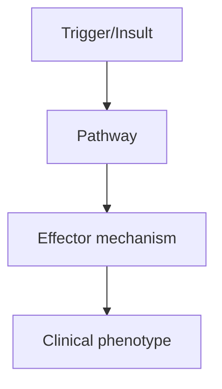
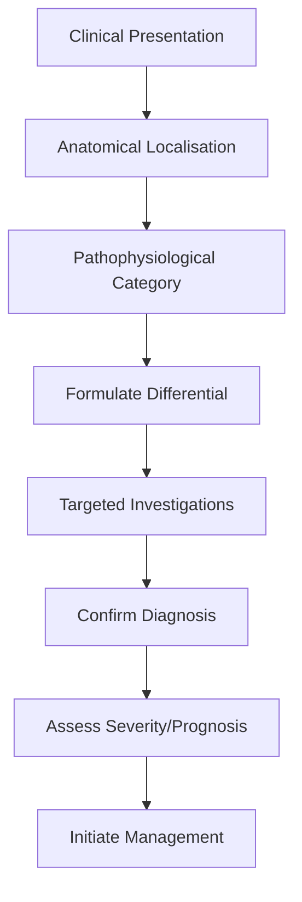
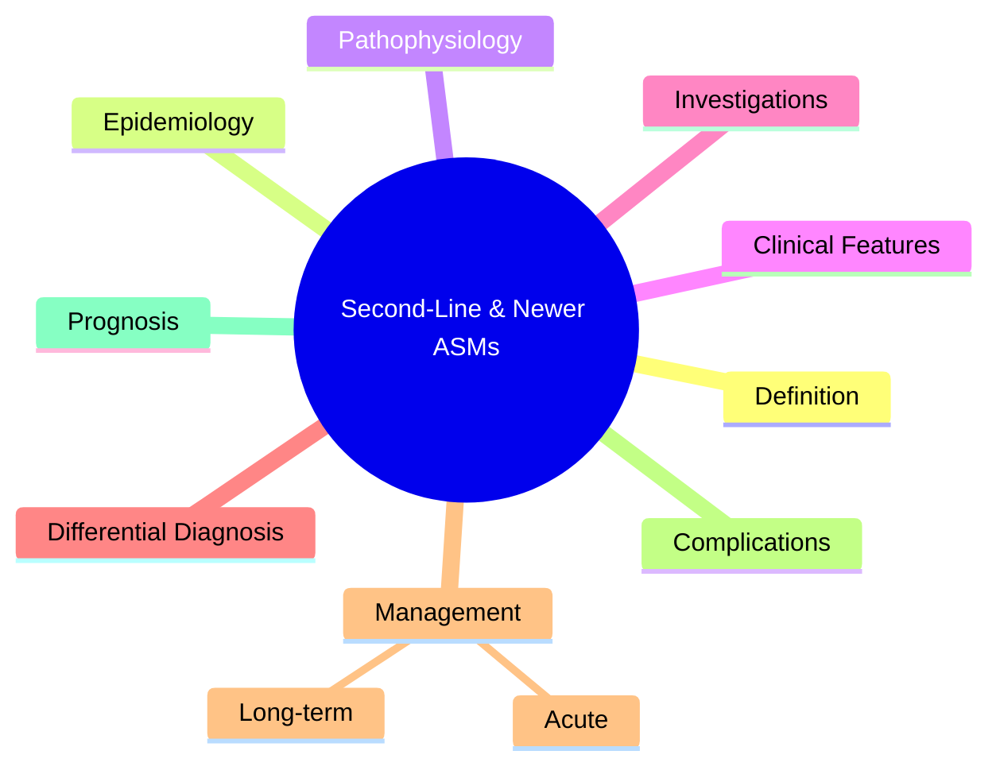

# Second-Line & Newer ASMs

> [!tip] **High-Yield Definition**
> ASMs used when 1st-line agents fail or are not tolerated. Include lacosamide, perampanel, brivaracetam, cenobamate, eslicarbazepine, zonisamide, felbamate, rufinamide, stiripentol, fenfluramine, vigabatrin, tiagabine.

---

## 1. Definition / Epidemiology / Classification

### Definition
ASMs used when 1st-line agents fail or are not tolerated. Include lacosamide, perampanel, brivaracetam, cenobamate, eslicarbazepine, zonisamide, felbamate, rufinamide, stiripentol, fenfluramine, vigabatrin, tiagabine.

### Epidemiology
Lacosamide and perampanel widely used as 2nd-line for focal seizures. Brivaracetam emerging. Cenobamate: highly effective for drug-resistant focal epilepsy. Stiripentol, fenfluramine: Dravet-specific. Felbamate: severe adverse effects (aplastic anaemia, hepatotoxicity) - reserve.

### Classification
| Variant | Key Features | Prognosis |
|---------|-------------|-----------|
| | | |

---

## 2. Aetiology / Pathophysiology

### Aetiology
N/A. Pharmacology.

### Pathophysiology

---

## 3. Clinical Features

### History
- **Onset/Duration:**
- **Progression:**
- **Key symptoms:**
- **Triggers:**
- **Systemic symptoms:**
- **Drug/Family/Social history:**

### Examination
| Domain | Key Findings | Localisation Value |
|--------|-------------|-------------------|
| | | |

### Specific Clinical Features
Lacosamide: slow Na+ inactivation, 200-400mg/day, ECG (PR prolongation), well-tolerated. Perampanel: AMPA antagonist, 4-12mg/day, psychiatric effects (aggression, suicidal ideation - black box warning), falls. Brivaracetam: SV2A high affinity, 50-200mg/day, less psychiatric than levetiracetam. Cenobamate: dual mechanism (Na+ inactivation + GABA-A positive allosteric modulator), 100-200mg/day, highly effective (50% seizure-free rate in trials, including drug-resistant), slow titration (SJS/TEN), avoid in patients with severe hypersensitivity history. Eslicarbazepine: Na+ channel, 800-1200mg/day, similar to carbamazepine. Zonisamide: multi-mechanism, 200-500mg/day. Felbamate: NMDA antagonist, severe toxicity (aplastic anaemia, hepatic failure), reserve. Rufinamide: Na+ channel (LGS), 200-3200mg/day. Stiripentol, fenfluramine, cannabidiol: Dravet/LGS-specific. Vigabatrin: irreversible GABA-T inhibitor, vigabatrin-related visual field loss (30%), infantile spasms (especially TSC). Tiagabine: GABA reuptake inhibitor, adjunct.

---

## 4. Diagnostic Approach / Algorithm

---

## 5. Investigations

Baseline: FBC, LFTs, U&Es, vitamin D, ECG (Na+ blockers). Drug levels (selected: PHT, VPA, CBZ, ESM, PB). Side effect monitoring: mood (perampanel, levetiracetam), ECG (lacosamide, eslicarbazepine), visual fields (vigabatrin - every 6 months), bloods (felbamate - FBC, LFTs monthly first year).

---

## 6. Differential Diagnosis

| Differential | Distinguishing Features | Key Test |
|--------------|------------------------|----------|
| | | |

---

## 7. Management

Rational polytherapy: combine ASMs with different mechanisms. Lacosamide: add-on for focal seizures, well-tolerated. Perampanel: add-on for focal/GTC, monitor mood. Brivaracetam: add-on for focal, alternative to levetiracetam. Cenobamate: drug-resistant focal, highly effective, requires slow titration (avoid in severe hypersensitivity). Eslicarbazepine: focal, similar to carbamazepine. Stiripentol + VPA + clobazam: Dravet. Fenfluramine: Dravet, LGS. Cannabidiol: Dravet, LGS, TSC. Felbamate: reserve for refractory cases (specialist only, intensive monitoring).

---

## 8. Drug Interactions / Contraindications / Comorbidity Cautions

| Drug | Interaction / Caution | Management |
|------|----------------------|------------|
| | | |

---

## 9. Procedures (if applicable)

### Procedure:
- **Indications:**
- **Contraindications:**
- **Preparation / Principle:**
- **Complications:**
- **Viva Pearls:**

---

## 10. Complications

| Complication | Frequency | Prevention / Monitoring | Management |
|--------------|-----------|------------------------|------------|
| | | | |

---

## 11. Red Flags / Emergencies

Lacosamide: PR prolongation, arrhythmias. Perampanel: psychiatric effects, falls. Cenobamate: SJS/TEN (slow titration), DRESS. Felbamate: aplastic anaemia, hepatic failure. Vigabatrin: irreversible visual field loss. Tiagabine: non-convulsive status in non-focal epilepsy.

---

## 12. Prognosis

Lacosamide, perampanel, brivaracetam: well-tolerated, effective. Cenobamate: breakthrough for drug-resistant epilepsy. Stiripentol, fenfluramine: Dravet revolution. Overall: 30-40% drug-resistant; newer ASMs and surgery improve outcomes.

---

## 13. Topic Correlation

| Related Topic | Link | Key Overlap |
|---------------|------|-------------|
| | | |

---

## 14. Special Situations

| Situation | Consideration |
|-----------|---------------|
| **Pregnancy** | |
| **Lactation** | |
| **Paediatric** | |
| **Elderly / Frail** | |
| **Renal impairment** | |
| **Hepatic impairment** | |
| **Immunocompromised** | |
| **Perioperative** | |
| **Driving / DVLA** | |
| **Occupational** | |

---

## FCPS/MRCP High-Yield Summary

| Category | Key Points |
|----------|------------|
| **Definition** | ASMs used when 1st-line agents fail or are not tolerated. Include lacosamide, perampanel, brivaracetam, cenobamate, eslicarbazepine, zonisamide, felbamate, rufinamide, stiripentol, fenfluramine, vigab |
| **Epidemiology** | Lacosamide and perampanel widely used as 2nd-line for focal seizures. Brivaracetam emerging. Cenobamate: highly effective for drug-resistant focal epi |
| **Pathophysiology** | |
| **Clinical** | Lacosamide: slow Na+ inactivation, 200-400mg/day, ECG (PR prolongation), well-tolerated. Perampanel: AMPA antagonist, 4-12mg/day, psychiatric effects (aggression, suicidal ideation - black box warning |
| **Diagnosis** | |
| **Investigations** | Baseline: FBC, LFTs, U&Es, vitamin D, ECG (Na+ blockers). Drug levels (selected: PHT, VPA, CBZ, ESM, PB). Side effect monitoring: mood (perampanel, levetiracetam), ECG (lacosamide, eslicarbazepine), v |
| **Management** | Rational polytherapy: combine ASMs with different mechanisms. Lacosamide: add-on for focal seizures, well-tolerated. Perampanel: add-on for focal/GTC, monitor mood. Brivaracetam: add-on for focal, alt |
| **Complications** | |
| **Prognosis** | Lacosamide, perampanel, brivaracetam: well-tolerated, effective. Cenobamate: breakthrough for drug-resistant epilepsy. Stiripentol, fenfluramine: Dravet revolution. Overall: 30-40% drug-resistant; new |
| **Viva Pearls** | |
| **Drug Doses** | |
| **Scoring Systems** | |
| **Genetics** | |
| **Imaging Signs** | |

---

## Viva Questions (PACES/FCPS Style)

1. **Q:** Define Second-Line & Newer ASMs and classify its variants.
   **A:** Based on the definition above.

2. **Q:** What are the key clinical features?
   **A:** Lacosamide: slow Na+ inactivation, 200-400mg/day, ECG (PR prolongation), well-tolerated. Perampanel: AMPA antagonist, 4-12mg/day, psychiatric effects (aggression, suicidal ideation - black box warning), falls. Brivaracetam: SV2A high affinity, 50-200mg/day, less psychiatric than levetiracetam. Cenob

3. **Q:** What is the first-line treatment?
   **A:** Based on the management section.

4. **Q:** What are the red flags requiring urgent referral?
   **A:** Lacosamide: PR prolongation, arrhythmias. Perampanel: psychiatric effects, falls. Cenobamate: SJS/TEN (slow titration), DRESS. Felbamate: aplastic anaemia, hepatic failure. Vigabatrin: irreversible visual field loss. Tiagabine: non-convulsive status in non-focal epilepsy.

5. **Q:** What is the prognosis?
   **A:** Lacosamide, perampanel, brivaracetam: well-tolerated, effective. Cenobamate: breakthrough for drug-resistant epilepsy. Stiripentol, fenfluramine: Dravet revolution. Overall: 30-40% drug-resistant; newer ASMs and surgery improve outcomes.

6. **Q:** How do you differentiate Second-Line & Newer ASMs from key differentials?
   **A:** Clinical features, investigations, and response to treatment.

7. **Q:** What investigations are most useful?
   **A:** Based on the investigations section.

8. **Q:** Describe the stepwise management approach.
   **A:** Based on the management algorithm.

9. **Q:** What are the emergency presentations?
   **A:** Based on the red flags section.

10. **Q:** How does management change in pregnancy/paediatrics/elderly?
    **A:** Special considerations per population.

---

## Common Confusions / Exam Traps

| Confusion | Clarification |
|-----------|---------------|
| | |

---

## Mnemonics
1. **Lacosamide** — Na+ channel blocker (slow inactivation); well-tolerated, no drug interactions
1. **Brivaracetam** — SV2A modulator (like levetiracetam); better tolerated than LEV
1. **Cenobamate** — Dual mechanism (Na+ block + GABA-A positive allosteric modulator); focal epilepsy adjunct

---

## Mind Map

---

## Spaced Repetition Trackers

| Review Interval | Date | Score (0-5) | Notes |
|-----------------|------|-------------|-------|
| Day 1 | | | |
| Day 3 | | | |
| Day 7 | | | |
| Day 14 | | | |
| Day 30 | | | |
| Day 90 | | | |

---

## Self-Test Scorecard

| Section | Score /5 | Last Attempt |
|---------|----------|--------------|
| Definition & Epidemiology | | |
| Pathophysiology | | |
| Clinical Features | | |
| Investigations | | |
| Differential Diagnosis | | |
| Management | | |
| Complications & Prognosis | | |
| Viva Questions | | |
| MCQs | | |
| SBAs | | |

---

## MCQs (10)

1. **Question:** Lacosamide mechanism:
   **Options:** A. Slow inactivation of voltage-gated Na+ channels B. SV2A modulation C. T-type Ca2+ block D. AMPA antagonism
   **Answer:** A
   **Explanation:** Lacosamide: enhances slow inactivation of voltage-gated Na+ channels. Different from phenytoin (fast inactivation).

2. **Question:** Brivaracetam mechanism:
   **Options:** A. SV2A modulation (like levetiracetam, higher affinity) B. Na+ block C. Ca2+ block D. GABA only
   **Answer:** A
   **Explanation:** Brivaracetam: SV2A modulator with higher affinity than levetiracetam. Better tolerated in some.

3. **Question:** Cenobamate mechanism:
   **Options:** A. Na+ block (fast + slow inactivation) + GABA-A PAM B. SV2A only C. Ca2+ only D. GABA-T only
   **Answer:** A
   **Explanation:** Cenobamate: dual mechanism - Na+ channel block + positive allosteric modulator of GABA-A. Focal epilepsy adjunct.

4. **Question:** Cenobamate is approved for:
   **Options:** A. Focal-onset seizures (adjunct) B. Primary generalised C. Absence D. Status epilepticus
   **Answer:** A
   **Explanation:** Cenobamate: FDA/EMA approved for focal-onset seizures in adults as adjunctive therapy.

5. **Question:** Perampanel mechanism:
   **Options:** A. AMPA receptor antagonist (non-competitive) B. NMDA antagonist C. GABA agonist D. SV2A modulator
   **Answer:** A
   **Explanation:** Perampanel: selective non-competitive AMPA receptor antagonist. Focal and primary GTC seizures.

6. **Question:** Perampanel warning:
   **Options:** A. Psychiatric effects (aggression, hostility, homicidal ideation) B. Hepatotoxicity C. Renal failure D. Visual field loss
   **Answer:** A
   **Explanation:** Perampanel: black box warning for psychiatric effects (aggression, hostility, homicidal ideation).

7. **Question:** Lacosamide advantages:
   **Options:** A. No hepatic metabolism, no P450 interactions, IV formulation B. P450 inducer C. Sedation D. Weight gain
   **Answer:** A
   **Explanation:** Lacosamide: no hepatic metabolism (renally cleared), no P450 interactions, IV available for status epilepticus.

8. **Question:** Rufinamide indication:
   **Options:** A. Lennox-Gastaut syndrome (adjunct) B. Focal only C. Primary generalised D. Status epilepticus
   **Answer:** A
   **Explanation:** Rufinamide: adjunctive for Lennox-Gastaut syndrome. Also some focal epilepsy.

9. **Question:** Fenfluramine is approved for:
   **Options:** A. Dravet syndrome (and Lennox-Gastaut) B. Focal only C. Migraine D. Status epilepticus
   **Answer:** A
   **Explanation:** Fenfluramine: re-approved for Dravet syndrome (and LGS). Low-dose, no cardiac valvulopathy at this dose.

10. **Question:** Cannabidiol (CBD) is approved for:
   **Options:** A. Dravet, Lennox-Gastaut, tuberous sclerosis complex B. Focal only C. Primary generalised D. Status epilepticus
   **Answer:** A
   **Explanation:** CBD (Epidiolex): approved for Dravet, LGS, TSC. Not first-line, adjunct.

---

## SBA Questions (10)

1. **Scenario:** Drug-resistant focal epilepsy, no surgery candidate. Adjunct option?
   **Options:** A. Lacosamide, brivaracetam, cenobamate, perampanel, VNS B. Continue current ASM C. No further options D. Add valproate E. Add ethosuximide
   **Answer:** A
   **Explanation:** Drug-resistant focal: try newer ASMs (lacosamide, brivaracetam, cenobamate, perampanel). VNS, DBS if ASMs fail.

2. **Scenario:** Dravet patient, 5 years old. Add-on to valproate + clobazam?
   **Options:** A. Fenfluramine or stiripentol or cannabidiol B. Carbamazepine (worsens) C. Phenytoin (worsens) D. Lamotrigine (worsens) E. Vigabatrin
   **Answer:** A
   **Explanation:** Dravet: avoid Na+ blockers. Add stiripentol, fenfluramine, or CBD. Valproate, clobazam are first-line.

3. **Scenario:** Lacosamide in elderly with polypharmacy:
   **Options:** A. No P450 interactions (safer with warfarin, statins) B. P450 inducer (interactions) C. P450 inhibitor D. Sedating E. Many interactions
   **Answer:** A
   **Explanation:** Lacosamide: no P450 metabolism, no drug interactions. Renally cleared. Safer in elderly/polypharmacy.

---

## Tags

**Tags:** #neurology #epilepsy #ASM #lacosamide #brivaracetam #cenobamate #perampanel #fenfluramine #CBD #FCPS #MRCP

---

## Local Navigation
**Heading Hub:** [[../Antiseizure Medications & Status Epilepticus Hub]]
**Chapter Hierarchy:** [[../../Davidson Chapter 25 - Neurology Hierarchy]]
**Chapter MOC:** [[../../Neurology MOC]]
**Drug Reference:** [[../../00_Index/Neurology Drug Reference]]