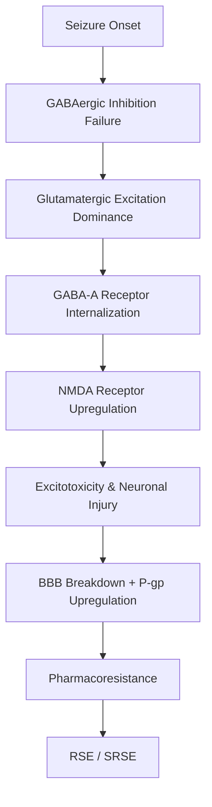
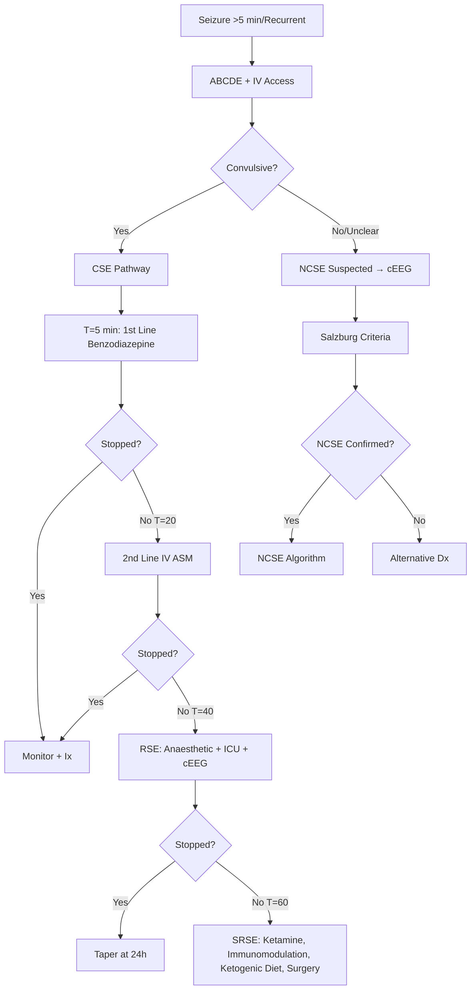

# Status Epilepticus Management

Related: [[Epilepsy & Seizure Disorders Hub]], [[Antiseizure Medications & Status Epilepticus Hub]], [[ILAE 2017 Seizure Classification]], [[First Seizure Management]], [[Non-Convulsive Status Epilepticus]], [[Refractory Status Epilepticus]]

> [!tip] **Definition (ILAE 2015 / 2021)**
> - **Convulsive SE (CSE):** ≥5 min continuous convulsive seizure OR ≥2 seizures without recovery of consciousness between them
> - **Non-Convulsive SE (NCSE):** ≥10 min continuous non-convulsive seizure activity
> - **Refractory SE (RSE):** Failure of 1st + 2nd line ASMs (≥30-60 min)
> - **Super-Refractory SE (SRSE):** SE ≥24h after anaesthetic induction OR recurrence on weaning

> [!tip] **Time is Brain** — IV access + 1st line by **T=5 min**, 2nd line by **T=20 min**, ICU/anaesthetic by **T=40 min**.

## Learning Objectives
- [x] Define SE and classify (ILAE 2015/2021)
- [x] Describe epidemiology, aetiology by age
- [x] Explain pathophysiology (GABA-A internalization, NMDA upregulation)
- [x] Recognise CSE vs NCSE presentations
- [x] Apply Salzburg criteria for NCSE
- [x] Manage time-goal directed algorithm
- [x] Identify NCSE, RSE, SRSE, mimics
- [x] Apply first/second/third line drug doses

---

## 1. Definition / Epidemiology / Classification

### Definition
A neurological emergency of prolonged/recurrent seizure activity without return to baseline.
- **t1 (onset):** Time of seizure start
- **t2 (emergency):** Time of urgent treatment (CSE: 5 min; NCSE: 10 min)
- **t3 (refractory):** Failure of 2nd line (CSE: 40 min; NCSE: 60 min)
- **t4 (super-refractory):** Anaesthetic induction required

### Epidemiology
| Metric | Value |
|--------|-------|
| Incidence | 10-41/100,000/year (higher in low-income) |
| Age | Bimodal: <1 year, >60 years |
| Mortality | CSE: 15-20% adults, 3-5% children; RSE: 30-50%; SRSE: 50-60% |
| Aetiology | Acute symptomatic 50% (stroke, metabolic, drug withdrawal, infection); Remote 25%; Unknown 25% |

### Classification
| Type | Subtypes | Key Features |
|------|----------|--------------|
| **CSE** | Generalized tonic-clonic, focal→bilateral tonic-clonic | Visible motor; highest urgency |
| **NCSE** | Absence SE, focal impaired awareness SE, myoclonic SE | Altered consciousness, subtle myoclonus |
| **RSE** | Failed benzo + 1 IV ASM | Requires cEEG |
| **SRSE** | Persists despite anaesthetic ≥24h | High mortality; trial ketamine/immunomodulation/ketogenic diet |

---

## 2. Aetiology / Pathophysiology

### Aetiology by Age
| Context | Common Causes |
|---------|---------------|
| Neonates/Infants | HIE, metabolic (hypoglycaemia, hypocalcaemia), infections, genetic, malformations |
| Children | FIRES, genetic, remote symptomatic |
| Adults | **Stroke 20-30%**, AED withdrawal/non-adherence 30%, metabolic, alcohol withdrawal, CNS infection, tumour, autoimmune encephalitis |
| Elderly | Stroke, metabolic, drugs, neurodegenerative, tumour |

### Pathophysiology

- **Early (t1-t2):** GABA-A internalization → reduced benzodiazepine sensitivity
- **Late (t2-t3):** NMDA upregulation → excitotoxicity; P-glycoprotein efflux limits AED entry

---

## 3. Clinical Features

### Convulsive SE (CSE)
- Continuous/recurrent generalised tonic-clonic activity
- No recovery of consciousness between seizures
- **Autonomic storm:** HTN, tachycardia, hyperthermia, hypersalivation, incontinence
- **Post-ictal:** coma, flaccid weakness, transient Babinski

### Non-Convulsive SE (NCSE) — *Missed Diagnosis Risk*
| Subtype | Presentation |
|---------|--------------|
| Absence SE | Prolonged stupor, eyelid flutter, subtle myoclonus, automatisms |
| Focal impaired awareness SE | Prolonged confusion, automatisms, focal motor signs, aphasia if dominant |
| Myoclonic SE | Continuous myoclonic jerks ± altered awareness (post-anoxic, PME) |

### Red Flags for NCSE
- Unexplained prolonged confusion/coma post-seizure
- Fluctuating mental status with subtle motor signs
- Post-anoxic myoclonus (Lance-Adams vs post-hypoxic)
- Known epilepsy with "atypical" prolonged event

---

## 4. Diagnostic Approach / Algorithm

### Salzburg Consensus Criteria for NCSE
| Category | Criteria |
|----------|----------|
| **Definite** | (1) GPDs >2.5 Hz + clinical improvement with IV ASM; (2) Focal rhythmic >1 Hz + clinical; (3) Absence status (gen 2.5-4 Hz SW) + clinical |
| **Probable** | Suggestive EEG + encephalopathy + IV ASM response |
| **Possible** | EEG only, no clinical correlation |

---

## 5. Investigations

### Immediate (parallel with treatment)
| Test | Indication | Target |
|------|------------|--------|
| Glucose (capillary/venous) | **ALWAYS** | <4 mmol/L → 50 mL 50% dextrose + Thiamine 100mg IV |
| Na+, K+, Ca2+, Mg2+, PO4- | All | Correct abnormalities |
| U&E, LFT, FBC, CRP, coagulation | All | Drug dosing, infection |
| Toxicology + AED levels | Unknown cause | Subtherapeutic levels → non-adherence |
| ABG + lactate | Prolonged CSE | Acidosis, ventilation |

### Urgent (within 1-2 hours)
| Test | Indication |
|------|------------|
| CT head | **All new-onset CSE**, trauma, focal signs, immunocompromised, anticoagulated |
| MRI brain (DWI/FLAIR/T2*) | CT negative, NCSE, suspected encephalitis/stroke/PRES |
| Lumbar puncture | Fever, immunocompromised, suspected encephalitis/meningitis |
| Continuous EEG (cEEG) | **All NCSE; All RSE/SRSE; post-cardiac arrest; unexplained coma** |

### Aetiology-Specific
| Cause | Tests |
|-------|-------|
| Autoimmune encephalitis | CSF/serum: NMDA-R, LGI1, CASPR2, GABA-B, AMPA, DPPX; tumour screen |
| Metabolic | Ammonia, lactate, pyruvate, amino/organic acids, porphyrins, thyroid, cortisol |
| Genetic (FIRES, PME) | Epilepsy gene panel, WES, mtDNA |
| Vascular | CTA/MRA, carotid Doppler, echo, hypercoagulable screen |

---

## 6. Differential Diagnosis

| Condition | Distinguishing Features | Key Test |
|-----------|------------------------|----------|
| **PNES** | Asynchronous, pelvic thrust, eye closure, side-to-side head, preserved awareness, >10 min, no post-ictal | Video-EEG |
| Syncope | Brief <1 min, prodrome, rapid recovery, brief myoclonic jerks | ECG, tilt table |
| Movement disorders | No LOC, suppressible, volitional | Clinical, normal EEG |
| Delirium | Fluctuating attention, no ictal EEG | EEG, metabolic screen |
| Locked-in syndrome | Quadriplegia + anarthria, preserved consciousness | Vertical eye movements; MRI pons |
| Brainstem death | No brainstem reflexes, +apnoea test | Formal brainstem death testing |

---

## 7. Management

### Emergency Treatment Algorithm

#### T=0-5 min: Stabilization + 1st Line
| Action | Details |
|--------|---------|
| **ABCDE** | O2 15L, IV access, fluids, monitor, GCS, pupils, temperature |
| **Glucose** | Check immediately; if <4 mmol/L: 50 mL 50% dextrose IV + Thiamine 100mg IV (always in malnutrition/alcohol) |
| **Benzodiazepine (1st line)** | **Lorazepam 4mg IV** (preferred) — repeat ×1 at 5 min **Alt:** Diazepam 10mg IV/PR; Midazolam 10mg IM/buccal/intranasal pre-hospital |

#### T=5-20 min: 2nd Line IV ASM
| Drug | Dose | Notes |
|------|------|-------|
| **Levetiracetam** | **20-60 mg/kg IV** (max 3g) over 10 min | **Preferred 2nd line**: fast, no cardiac monitoring, few interactions, safe in pregnancy, renal adjust |
| **Fosphenytoin** | **18-20 mg PE/kg IV** (max 1.5g) at ≤150 mg PE/min | Cardiac monitoring; risk hypotension, arrhythmia |
| **Valproate** | **40 mg/kg IV** (max 3g) over 10 min | Avoid in pregnancy, liver disease, mitochondrial disorders |

#### T=40 min: RSE — Anaesthetic Induction
| Agent | Dose | Notes |
|-------|------|-------|
| **Propofol** | 1-2 mg/kg bolus → 4-10 mg/kg/h | Rapid onset; propofol infusion syndrome (high dose) |
| **Midazolam** | 0.2 mg/kg bolus → 0.05-0.4 mg/kg/h | Tachyphylaxis; less hypotension |
| **Pentobarbital** | 5-15 mg/kg → 0.5-5 mg/kg/h | Last resort; severe hypotension, respiratory depression |

#### T=60 min: SRSE Options
- **Ketamine** (NMDA antagonist): 0.5-4.5 mg/kg/h infusion
- **Immunomodulation:** Methylpred, IVIG, plasma exchange (autoimmune)
- **Ketogenic diet** (paediatric FIRES)
- **Surgical:** Resection, VNS, corpus callosotomy, hypothermia (limited evidence)

### Paediatric / Pregnancy / Elderly
- **Pregnancy:** MgSO4 for eclampsia; **levetiracetam** preferred 2nd line; avoid valproate
- **Paediatric:** Buccal midazolam 0.3 mg/kg; rectal diazepam 0.5 mg/kg; levetiracetam 40-60 mg/kg
- **Elderly:** Lower drug doses, renal/hepatic adjust; reduced benzodiazepine doses
- **Renal impairment:** Levetiracetam dose reduction

---

## 8. Drug Interactions / Contraindications

| Drug | Interaction/Caution | Management |
|------|---------------------|------------|
| Phenytoin | CYP450 inducer; many interactions; protein binding | Check levels; caution warfarin, OCP |
| Valproate | Hepatotoxic, teratogenic, pancreatitis; inhibits lamotrigine metabolism | Avoid in pregnancy, liver disease, <3y |
| Levetiracetam | Few interactions; renal clearance | Renal dose adjust |
| Carbamazepine | SIADH, agranulocytosis, Stevens-Johnson; enzyme inducer | FBC, Na+ monitoring |
| Benzodiazepines | Respiratory depression (with opioids) | Have flumazenil available |

---

## 9. Procedures
- **cEEG monitoring:** Indication: all NCSE, RSE, post-cardiac arrest, unexplained coma. Continuous ≥24h, video-EEG preferred.
- **General anaesthesia/intubation:** Indication: RSE, airway protection, mechanical ventilation.

---

## 10. Complications
| Complication | Frequency | Prevention/Monitoring | Management |
|--------------|-----------|------------------------|------------|
| Hyperthermia | Common | Active cooling | Antipyretics, cooling |
| Aspiration pneumonia | Common | NPO until awake, suction | Antibiotics |
| Rhabdomyolysis | CSE >30 min | CK, U&E, urine myoglobin | IV fluids, ±bicarbonate |
| Cerebral oedema | RSE | CT/MRI | Mannitol, hypertonic saline |
| Cognitive decline | Survivors | Neuropsych assessment | Rehab |
| Hippocampal sclerosis | Prolonged CSE | MRI at 3-6 months | ASM, consider surgery |

---

## 11. Red Flags / Emergencies
| Red Flag | Action | Window |
|----------|--------|--------|
| Ongoing convulsion >5 min | Lorazepam 4mg IV | T=0-5 min |
| Failed 1st line | 2nd line IV ASM | T=20 min |
| Failed 2nd line (RSE) | Anaesthetic + ICU | T=40 min |
| Persistent coma post-seizure | Urgent cEEG for NCSE | Immediate |
| Hyperthermia >40°C | Active cooling, paracetamol | Immediate |
| New focal deficit | Urgent CT/MRI | Immediate |

---

## 12. Prognosis
| Factor | Good | Poor |
|--------|------|------|
| Aetiology | AED withdrawal, metabolic | Anoxic, stroke, autoimmune |
| Age | Child | Elderly |
| Duration | <30 min | >60 min, RSE/SRSE |
| Type | CSE with clear cause | NCSE missed, post-anoxic |
| Background | Previously normal | Pre-existing neurological deficit |

- **CSE mortality:** 15-20% adults
- **RSE mortality:** 30-50%
- **SRSE mortality:** 50-60%
- **Long-term:** Hippocampal sclerosis, cognitive impairment, recurrent epilepsy

---

## 13. Topic Correlation
| Related Topic | Link | Key Overlap |
|---------------|------|-------------|
| First Seizure | [[First Seizure Management]] | Decision to start ASM |
| ILAE Classification | [[ILAE 2017 Seizure Classification]] | Seizure type, NCSE criteria |
| ASM Hub | [[Antiseizure Medications & Status Epilepticus Hub]] | Drug doses, interactions |
| Refractory Epilepsy | [[Drug-Resistant Epilepsy & Surgical Evaluation]] | Surgical evaluation post-SE |

---

## 14. Special Situations
| Situation | Consideration |
|-----------|---------------|
| **Pregnancy** | Levetiracetam safe; avoid valproate, phenytoin (teratogenic); MgSO4 in eclampsia |
| **Lactation** | Levetiracetam, carbamazepine compatible; monitor infant sedation |
| **Paediatric** | Buccal midazolam home; FIRES syndrome; ketogenic diet |
| **Elderly/Frail** | Lower doses, renal adjust; beware benzodiazepine sensitivity |
| **Renal impairment** | Levetiracetam dose reduction |
| **Hepatic impairment** | Avoid valproate; dose adjust phenytoin, carbamazepine |
| **Immunocompromised** | Broader infection workup (Toxoplasma, JC virus, fungal) |
| **Perioperative** | Continue ASMs; parenteral if NPO |
| **Driving** | DVLA: 6 months seizure-free (UK Group 1); longer if structural lesion |
| **Occupational** | Avoid high-risk activities (heights, water, machinery) until seizure-free |

---

## FCPS/MRCP High-Yield Summary
| Category | Key Points |
|----------|------------|
| **Definition** | CSE ≥5 min; NCSE ≥10 min; RSE = failed 1st+2nd line; SRSE = ≥24h on anaesthetic |
| **Epidemiology** | 10-41/100,000/year; bimodal age; mortality 15-60% |
| **Pathophysiology** | GABA-A internalization (early) → NMDA upregulation (late) → pharmacoresistance |
| **Clinical** | CSE: tonic-clonic + autonomic storm; NCSE: confusion, subtle myoclonus |
| **Diagnosis** | Salzburg criteria for NCSE; cEEG essential |
| **Investigations** | Glucose FIRST; CT head; cEEG for NCSE/RSE |
| **Management** | T=5 benzo; T=20 2nd line (levetiracetam preferred); T=40 anaesthetic |
| **Drugs** | Lorazepam 4mg IV; Levetiracetam 60mg/kg; Propofol/Midazolam infusion |
| **Complications** | Hyperthermia, rhabdomyolysis, hippocampal sclerosis |
| **Prognosis** | RSE 30-50% mortality; SRSE 50-60% |

---

## Viva Questions

1. **Q:** Define convulsive status epilepticus per ILAE 2015.
   **A:** ≥5 min continuous convulsive seizure OR ≥2 seizures without recovery of consciousness between them.

2. **Q:** What is the time-goal directed SE management timeline?
   **A:** T=5 min 1st line benzo; T=20 min 2nd line IV ASM; T=40 min anaesthetic + ICU + cEEG.

3. **Q:** What is the preferred 2nd line IV ASM and dose?
   **A:** Levetiracetam 20-60 mg/kg IV (max 3g) over 10 min — preferred due to speed, safety, few interactions, safe in pregnancy.

4. **Q:** Name the Salzburg criteria for definite NCSE.
   **A:** (1) GPDs >2.5 Hz + clinical improvement with IV ASM; (2) Focal rhythmic >1 Hz + clinical; (3) Absence status + clinical.

5. **Q:** Differentiate SRSE from RSE.
   **A:** RSE = failure of 1st + 2nd line; SRSE = continues ≥24h after anaesthetic induction OR recurs on weaning.

---

## Common Confusions / Exam Traps
| Confusion | Clarification |
|-----------|---------------|
| SE = 30 min seizure | NO — operationally CSE is ≥5 min |
| Phenytoin is benign loading | Fosphenytoin 18-20 mg PE/kg needs cardiac monitoring; risk arrhythmia |
| Valproate safe in pregnancy | NO — avoid; teratogenic (neural tube defects, IQ ↓) |
| NCSE always obvious | Often subtle — fluctuating confusion, eyelid flutter; cEEG required |
| Lance-Adams is post-anoxic myoclonus | YES — chronic post-hypoxic myoclonus; ≠ acute post-hypoxic myoclonus (poor prognosis) |

---

## Mnemonics
1. **`STAGE`** for SE management: **S**tabilise (ABCDE) → **T**ime goal → **A**naesthetic prep → **G**ive 2nd line → **E**EG
2. **`5-20-40`** for SE timeline: **5** min benzo → **20** min 2nd line IV ASM → **40** min anaesthetic

---

## One-Page Revision Card
| Topic | Status Epilepticus |
|-------|---------------------|
| **Definition** | CSE ≥5 min; NCSE ≥10 min |
| **Key Clinical** | Continuous seizure or recurrent without recovery |
| **Diagnosis** | Salzburg criteria for NCSE; cEEG |
| **Differentials** | PNES, syncope, movement disorder, locked-in |
| **Investigations** | Glucose, electrolytes, CT, cEEG, AED levels |
| **Management** | T=5 benzo; T=20 2nd line; T=40 anaesthetic |
| **Key Drugs** | Lorazepam 4mg IV; Levetiracetam 60mg/kg IV |
| **Red Flags** | RSE, hyperthermia >40°C, post-ictal coma |
| **Prognosis** | CSE 15-20%; RSE 30-50%; SRSE 50-60% mortality |
| **Mnemonics** | STAGE; 5-20-40 |

---

## MCQs (10)

1. **Question:** What is the ILAE 2015 operational time threshold to TREAT convulsive status epilepticus as an emergency?
   **Options:** A. 1 min B. 5 min C. 10 min D. 30 min
   **Answer: B** (5 min) — operational threshold, not biologic duration.

2. **Question:** Which is the preferred 2nd line IV ASM for convulsive status epilepticus?
   **Options:** A. Phenytoin B. Valproate C. Levetiracetam D. Phenobarbital
   **Answer: C** — fastest, safest, fewest interactions, safe in pregnancy.

3. **Question:** A patient has refractory SE. What defines super-refractory SE?
   **Options:** A. Failure of 1st line B. Failure of 2nd line C. Continues ≥24h after anaesthetic D. >5 min seizure
   **Answer: C** — persistence despite anaesthetic induction or recurrence on weaning.

4. **Question:** First-line benzodiazepine dose in adult SE?
   **Options:** A. Lorazepam 4mg IV B. Lorazepam 10mg IV C. Midazolam 1mg IV D. Diazepam 5mg IV
   **Answer: A** — Lorazepam 4mg IV, may repeat once at 5 min.

5. **Question:** In NCSE, which EEG feature meets Salzburg criteria for definite NCSE?
   **Options:** A. GPDs at 1 Hz B. Focal rhythmic activity at 0.5 Hz C. GPDs at 2.5 Hz with clinical response D. Slow background only
   **Answer: C** — GPDs >2.5 Hz + clinical improvement with IV ASM = definite NCSE.

6. **Question:** Pathophysiology of benzodiazepine resistance in established SE:
   **Options:** A. Increased GABA-A B. GABA-A receptor internalization C. Decreased NMDA D. Increased serotonin
   **Answer: B** — GABA-A internalization → reduced benzodiazepine sensitivity.

7. **Question:** What is the bolus dose of levetiracetam for SE?
   **Options:** A. 10 mg/kg B. 20-60 mg/kg (max 3g) C. 5 mg/kg D. 100 mg/kg
   **Answer: B** — 20-60 mg/kg IV over 10 min, max 3g.

8. **Question:** Which agent is FIRST choice in eclampsia-related SE?
   **Options:** A. Levetiracetam B. Phenytoin C. MgSO4 D. Valproate
   **Answer: C** — MgSO4 is the first-line treatment for eclamptic seizures.

9. **Question:** Fosphenytoin loading dose in SE:
   **Options:** A. 5 mg PE/kg B. 10 mg PE/kg C. 18-20 mg PE/kg IV at ≤150 mg PE/min D. 50 mg PE/kg
   **Answer: C** — 18-20 mg PE/kg; cardiac monitoring required.

10. **Question:** Time to anaesthetic induction in established RSE:
    **Options:** A. T=5 min B. T=20 min C. T=40 min D. T=120 min
    **Answer: C** — T=40 min = RSE definition; anaesthetic induction required.

---

## SBA Questions (10)

1. **Scenario:** 28-year-old known epileptic on valproate, recurrent GTCS for 20 min.
   **Question:** What is the next step?
   **Options:** A. Lorazepam 4mg IV B. Rectal diazepam C. Levetiracetam 60 mg/kg IV D. IV phenytoin 15 mg/kg
   **Answer: A** — Still in 1st line window if just one benzo given; or escalate to 2nd line if already had benzo.

2. **Scenario:** 65-year-old post-stroke, found unconscious, GCS 6, no obvious convulsion.
   **Question:** Most appropriate next investigation?
   **Options:** A. CT head B. Lumbar puncture C. Urgent cEEG D. MRI brain
   **Answer: C** — Unexplained coma → cEEG to identify NCSE.

3. **Scenario:** 18-year-old with GTCS, glucose 1.8 mmol/L.
   **Question:** First intervention?
   **Options:** A. Lorazepam 4mg IV B. 50 mL 50% dextrose + thiamine C. Levetiracetam D. Phenytoin
   **Answer: B** — Hypoglycaemia must be corrected first or concurrently with ASM.

4. **Scenario:** 35-year-old with SE, failed lorazepam ×2, ongoing seizure at 25 min.
   **Question:** Most appropriate 2nd line?
   **Options:** A. Repeat lorazepam B. IV levetiracetam 60 mg/kg C. Oral carbamazepine D. IV anaesthetic immediately
   **Answer: B** — Levetiracetam is the preferred 2nd line; anaesthetic is for RSE (T=40 min).

5. **Scenario:** 8-year-old with prolonged febrile seizure at home.
   **Question:** Most appropriate pre-hospital intervention?
   **Options:** A. Buccal midazolam 0.3 mg/kg B. Rectal diazepam 0.5 mg/kg C. Wait for ambulance D. Aspirin
   **Answer: A** — Buccal midazolam is preferred pre-hospital; rectal diazepam is alternative.

6. **Scenario:** Patient with status epilepticus, ongoing seizure despite 1st + 2nd line, at T=45 min.
   **Question:** Next step?
   **Options:** A. Repeat 2nd line B. Add 3rd 2nd line C. Anaesthetic induction + ICU + cEEG D. Increase dose of 2nd line
   **Answer: C** — RSE at T=40 min requires anaesthetic induction; further boluses ineffective.

7. **Scenario:** Patient with SRSE, continued seizure despite propofol + midazolam infusion for 30 hours.
   **Question:** Most appropriate escalation?
   **Options:** A. Higher dose propofol B. Ketamine infusion + immunomodulation workup C. Discontinue all drugs D. Surgery
   **Answer: B** — SRSE requires ketamine (NMDA antagonist) + workup for autoimmune/inflammatory cause.

8. **Scenario:** Post-cardiac arrest patient, GCS 4, ongoing myoclonic jerks at 24 hours.
   **Question:** Best management?
   **Options:** A. Sedation only B. cEEG + treat as myoclonic SE if ictal C. Withdraw care D. MRI only
   **Answer: B** — Distinguish Lance-Adams (treat) from post-hypoxic myoclonus (poor prognosis).

9. **Scenario:** 22-year-old pregnant (24 weeks), SE at 15 min.
   **Question:** Best 2nd line agent?
   **Options:** A. Valproate B. Phenytoin C. Levetiracetam D. Carbamazepine
   **Answer: C** — Levetiracetam is safest in pregnancy; valproate/phenytoin are teratogenic.

10. **Scenario:** Patient with RSE, mechanically ventilated, anaesthetic infusion for 24 hours, EEG shows burst suppression.
    **Question:** Next step?
    **Options:** A. Stop anaesthetic immediately B. Continue for 24h then taper C. Switch to different anaesthetic D. Add phenobarbital
    **Answer: B** — Continue anaesthetic for 24h seizure-free, then taper; immediate cessation risks recurrence.

---

## Flashcards

- **Q:** ILAE 2015 definition of convulsive SE?
  **A:** ≥5 min continuous convulsive seizure OR ≥2 seizures without recovery between them.

- **Q:** Time goals for SE management?
  **A:** T=5 1st line benzo; T=20 2nd line IV ASM; T=40 anaesthetic + ICU + cEEG.

- **Q:** Lorazepam dose in SE?
  **A:** 4mg IV; may repeat ×1 at 5 min.

- **Q:** Levetiracetam loading dose in SE?
  **A:** 20-60 mg/kg IV (max 3g) over 10 min.

- **Q:** Three Salzburg criteria for definite NCSE?
  **A:** (1) GPDs >2.5 Hz + clinical response to IV ASM; (2) Focal rhythmic >1 Hz + clinical; (3) Absence status + clinical.

- **Q:** Define SRSE?
  **A:** Continues ≥24h after anaesthetic induction OR recurs on weaning.

- **Q:** Why do benzodiazepines fail in established SE?
  **A:** GABA-A receptor internalization → reduced benzodiazepine sensitivity.

---

## Answer Key with Explanations

### MCQs
1. **B** — ILAE operational threshold for CSE is 5 min (not 30 min, the historic definition).
2. **C** — Levetiracetam is preferred 2nd line per ESETT trial (2019).
3. **C** — SRSE = persistence ≥24h after anaesthetic.
4. **A** — Lorazepam 4mg IV is first-line; longer duration than midazolam.
5. **C** — GPDs >2.5 Hz with clinical response is Salzburg definite NCSE.
6. **B** — GABA-A internalization explains benzodiazepine pharmacoresistance.
7. **B** — Levetiracetam 20-60 mg/kg IV, max 3g, over 10 min.
8. **C** — MgSO4 is first-line for eclampsia.
9. **C** — Fosphenytoin 18-20 mg PE/kg; cardiac monitoring.
10. **C** — RSE = T=40 min; anaesthetic induction indicated.

### SBAs
1. **A** — Lorazepam 4mg IV (or escalation to 2nd line if already given).
2. **C** — Unexplained coma → urgent cEEG for NCSE detection.
3. **B** — Hypoglycaemia is a reversible cause; correct first.
4. **B** — Levetiracetam is preferred 2nd line; anaesthetic is for RSE.
5. **A** — Buccal midazolam 0.3 mg/kg is pre-hospital first choice.
6. **C** — RSE = anaesthetic + ICU + cEEG.
7. **B** — SRSE: ketamine + autoimmune workup (NMDA-R, LGI1, etc.).
8. **B** — Distinguish Lance-Adams from post-hypoxic myoclonus via cEEG.
9. **C** — Levetiracetam is safest ASM in pregnancy.
10. **B** — Maintain anaesthetic 24h seizure-free then taper.

---

## Local Navigation
**Heading Hub:** [[../03_Epilepsy_Seizure_Disorders/Epilepsy & Seizure Disorders Hub]]
**Topic-Group Hub:** [[../03_Epilepsy_Seizure_Disorders/Antiseizure Medications & Status Epilepticus Hub]]
**Chapter Hierarchy:** [[Davidson Chapter 25 - Neurology Hierarchy]]
**Chapter MOC:** [[Neurology MOC]]
**Drug Reference:** [[../00_Index/Neurology Drug Reference]]
**Related Topics:** [[ILAE 2017 Seizure Classification]], [[First Seizure Management]]
