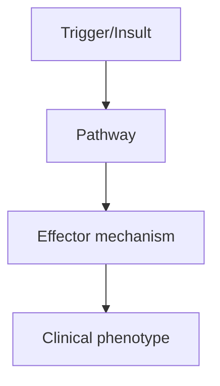
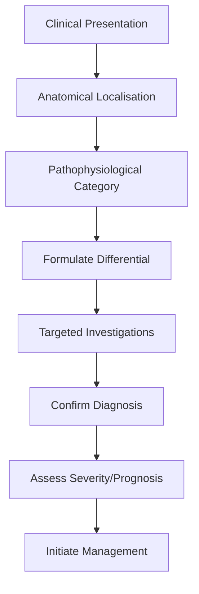
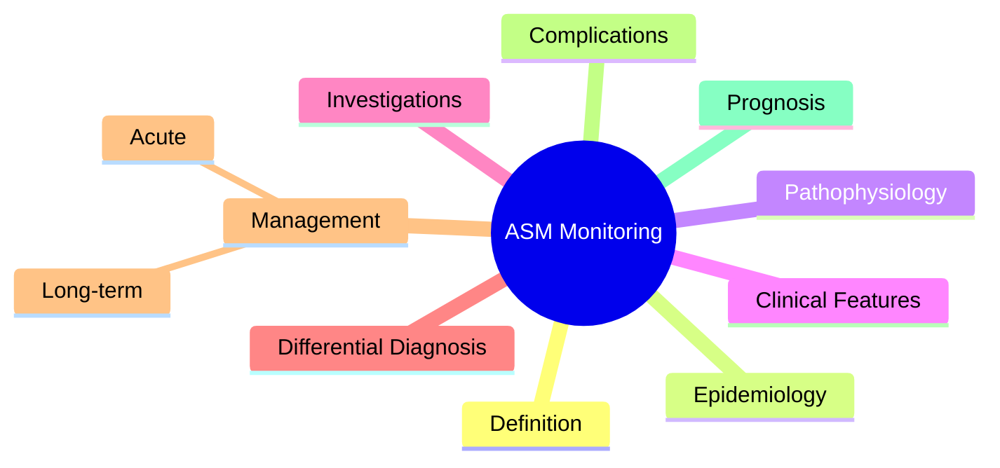

# ASM Monitoring

> [!tip] **High-Yield Definition**
> Routine monitoring of patients on ASMs: drug levels (selected ASMs), FBC, LFTs, renal function, electrolytes, vitamin D, bone density, ECG, side effects, adherence.

---

## 1. Definition / Epidemiology / Classification

### Definition
Routine monitoring of patients on ASMs: drug levels (selected ASMs), FBC, LFTs, renal function, electrolytes, vitamin D, bone density, ECG, side effects, adherence.

### Epidemiology
All ASM-treated patients require monitoring. Monitoring schedule depends on ASM, patient factors (age, comorbidity, pregnancy).

### Classification
| Variant | Key Features | Prognosis |
|---------|-------------|-----------|
| | | |

---

## 2. Aetiology / Pathophysiology

### Aetiology
N/A. Monitoring principles.

### Pathophysiology

---

## 3. Clinical Features

### History
- **Onset/Duration:**
- **Progression:**
- **Key symptoms:**
- **Triggers:**
- **Systemic symptoms:**
- **Drug/Family/Social history:**

### Examination
| Domain | Key Findings | Localisation Value |
|--------|-------------|-------------------|
| | | |

### Specific Clinical Features
Drug levels: PHT (zero-order kinetics, narrow window), VPA (useful for toxicity, less for efficacy), CBZ (autoinduction, level falls initially), ethosuximide, phenobarbital. NOT routinely useful: levetiracetam, lamotrigine, topiramate, lacosamide, brivaracetam, perampanel (linear kinetics, level less predictive of efficacy). Side effect monitoring: FBC (agranulocytosis: CBZ, LTG; aplastic anaemia: FBM), LFTs (VPA, CBZ, PHT, FBM), U&Es (LEV, GBP, PGB), vitamin D and bone density (long-term enzyme inducers: CBZ, PHT, PB; also VPA), ECG (CBZ, PHT, LCM, ESL - PR interval, sodium channel effects), amylase/lipase (VPA - pancreatitis), serum ammonia (VPA - hyperammonaemic encephalopathy).

---

## 4. Diagnostic Approach / Algorithm

---

## 5. Investigations

Drug level (trough, 12-24h post-dose). FBC, LFTs, U&Es at baseline, 3 months, then annually. Vitamin D annually. Bone density (DEXA) every 2-5 years. ECG at baseline and dose change for Na+ blockers. Pregnancy: ASM levels (especially LTG - increased clearance), LFTs, bloods. Renal dose adjustment: levetiracetam, gabapentin, pregabalin. Hepatic: valproate (avoid), consider LTG, LEV, lacosamide.

---

## 6. Differential Diagnosis

| Differential | Distinguishing Features | Key Test |
|--------------|------------------------|----------|
| | | |

---

## 7. Management

Baseline: FBC, LFTs, U&Es, vitamin D, ECG (Na+ blockers), pregnancy test. 3 months: FBC, LFTs. 6 months: review side effects. Annually: FBC, LFTs, U&Es, vitamin D, drug level (selected ASMs), adherence. DEXA every 2-5y (long-term ASMs). Counsel on side effects, drug interactions, teratogenicity, driving.

---

## 8. Drug Interactions / Contraindications / Comorbidity Cautions

| Drug | Interaction / Caution | Management |
|------|----------------------|------------|
| | | |

---

## 9. Procedures (if applicable)

### Procedure:
- **Indications:**
- **Contraindications:**
- **Preparation / Principle:**
- **Complications:**
- **Viva Pearls:**

---

## 10. Complications

| Complication | Frequency | Prevention / Monitoring | Management |
|--------------|-----------|------------------------|------------|
| | | | |

---

## 11. Red Flags / Emergencies

Agranulocytosis (CBZ, LTG, FBM - FBC), hepatotoxicity (VPA, CBZ, PHT, FBM - LFTs), SJS/TEN (LTG, CBZ, PHT, ESL - slow titration, HLA-B*15:02), hyponatraemia (CBZ, OXC, ESL), weight changes, cognitive effects, mood changes, SUDEP, status epilepticus.

---

## 12. Prognosis

Routine monitoring prevents serious adverse effects, optimises adherence, detects drug interactions early. Improves long-term outcomes.

---

## 13. Topic Correlation

| Related Topic | Link | Key Overlap |
|---------------|------|-------------|
| | | |

---

## 14. Special Situations

| Situation | Consideration |
|-----------|---------------|
| **Pregnancy** | |
| **Lactation** | |
| **Paediatric** | |
| **Elderly / Frail** | |
| **Renal impairment** | |
| **Hepatic impairment** | |
| **Immunocompromised** | |
| **Perioperative** | |
| **Driving / DVLA** | |
| **Occupational** | |

---

## FCPS/MRCP High-Yield Summary

| Category | Key Points |
|----------|------------|
| **Definition** | Routine monitoring of patients on ASMs: drug levels (selected ASMs), FBC, LFTs, renal function, electrolytes, vitamin D, bone density, ECG, side effects, adherence. |
| **Epidemiology** | All ASM-treated patients require monitoring. Monitoring schedule depends on ASM, patient factors (age, comorbidity, pregnancy). |
| **Pathophysiology** | |
| **Clinical** | Drug levels: PHT (zero-order kinetics, narrow window), VPA (useful for toxicity, less for efficacy), CBZ (autoinduction, level falls initially), ethosuximide, phenobarbital. NOT routinely useful: leve |
| **Diagnosis** | |
| **Investigations** | Drug level (trough, 12-24h post-dose). FBC, LFTs, U&Es at baseline, 3 months, then annually. Vitamin D annually. Bone density (DEXA) every 2-5 years. ECG at baseline and dose change for Na+ blockers.  |
| **Management** | Baseline: FBC, LFTs, U&Es, vitamin D, ECG (Na+ blockers), pregnancy test. 3 months: FBC, LFTs. 6 months: review side effects. Annually: FBC, LFTs, U&Es, vitamin D, drug level (selected ASMs), adherenc |
| **Complications** | |
| **Prognosis** | Routine monitoring prevents serious adverse effects, optimises adherence, detects drug interactions early. Improves long-term outcomes. |
| **Viva Pearls** | |
| **Drug Doses** | |
| **Scoring Systems** | |
| **Genetics** | |
| **Imaging Signs** | |

---

## Viva Questions (PACES/FCPS Style)

1. **Q:** Define ASM Monitoring and classify its variants.
   **A:** Based on the definition above.

2. **Q:** What are the key clinical features?
   **A:** Drug levels: PHT (zero-order kinetics, narrow window), VPA (useful for toxicity, less for efficacy), CBZ (autoinduction, level falls initially), ethosuximide, phenobarbital. NOT routinely useful: levetiracetam, lamotrigine, topiramate, lacosamide, brivaracetam, perampanel (linear kinetics, level les

3. **Q:** What is the first-line treatment?
   **A:** Based on the management section.

4. **Q:** What are the red flags requiring urgent referral?
   **A:** Agranulocytosis (CBZ, LTG, FBM - FBC), hepatotoxicity (VPA, CBZ, PHT, FBM - LFTs), SJS/TEN (LTG, CBZ, PHT, ESL - slow titration, HLA-B*15:02), hyponatraemia (CBZ, OXC, ESL), weight changes, cognitive effects, mood changes, SUDEP, status epilepticus.

5. **Q:** What is the prognosis?
   **A:** Routine monitoring prevents serious adverse effects, optimises adherence, detects drug interactions early. Improves long-term outcomes.

6. **Q:** How do you differentiate ASM Monitoring from key differentials?
   **A:** Clinical features, investigations, and response to treatment.

7. **Q:** What investigations are most useful?
   **A:** Based on the investigations section.

8. **Q:** Describe the stepwise management approach.
   **A:** Based on the management algorithm.

9. **Q:** What are the emergency presentations?
   **A:** Based on the red flags section.

10. **Q:** How does management change in pregnancy/paediatrics/elderly?
    **A:** Special considerations per population.

---

## Common Confusions / Exam Traps

| Confusion | Clarification |
|-----------|---------------|
| | |

---

## Mnemonics
1. **ASM MONITOR** — **M**ood (depression, suicide), **O**steoporosis, **N**eurological (ataxia, diplopia), **I**diopathic (idiosyncratic rash), **T**eratogenicity, **O**steomalacia, **R**enal/hepatic, **E**ye (VGB), **R**esistance
1. **Phenytoin P450 INDUCER** — Reduces OCP, warfarin, doxy, cyclosporin, antiretrovirals
1. **Valproate P450 INHIBITOR** — Increases lamotrigine, warfarin, tricyclics

---

## Mind Map

---

## Spaced Repetition Trackers

| Review Interval | Date | Score (0-5) | Notes |
|-----------------|------|-------------|-------|
| Day 1 | | | |
| Day 3 | | | |
| Day 7 | | | |
| Day 14 | | | |
| Day 30 | | | |
| Day 90 | | | |

---

## Self-Test Scorecard

| Section | Score /5 | Last Attempt |
|---------|----------|--------------|
| Definition & Epidemiology | | |
| Pathophysiology | | |
| Clinical Features | | |
| Investigations | | |
| Differential Diagnosis | | |
| Management | | |
| Complications & Prognosis | | |
| Viva Questions | | |
| MCQs | | |
| SBAs | | |

---

## MCQs (10)

1. **Question:** Routine serum level monitoring is required for:
   **Options:** A. Phenytoin (narrow therapeutic index) B. Levetiracetam C. Lamotrigine D. Valproate
   **Answer:** A
   **Explanation:** Phenytoin requires routine levels (10-20 mg/L). Levetiracetam, lamotrigine, valproate monitored clinically.

2. **Question:** Phenytoin therapeutic level:
   **Options:** A. 10-20 mg/L (40-80 micromol/L) B. 5-10 mg/L C. 20-30 mg/L D. 1-5 mg/L
   **Answer:** A
   **Explanation:** Phenytoin therapeutic 10-20 mg/L. Toxic >20, with nystagmus, ataxia, confusion >30.

3. **Question:** Phenytoin zero-order kinetics means:
   **Options:** A. Saturation kinetics (small dose changes → large level changes) B. First-order linear kinetics C. Auto-induction D. Protein binding changes
   **Answer:** A
   **Explanation:** Phenytoin has zero-order kinetics at therapeutic doses (saturable metabolism).

4. **Question:** Valproate side effect requiring monitoring:
   **Options:** A. Hepatotoxicity, pancreatitis, thrombocytopenia, weight gain B. Hyponatraemia C. Renal stones D. Hair loss
   **Answer:** A
   **Explanation:** Valproate: LFTs, platelets, ammonia (encephalopathy), weight, PCOS.

5. **Question:** Carbamazepine side effect requiring monitoring:
   **Options:** A. SIADH, agranulocytosis, Stevens-Johnson, P450 induction B. Renal stones C. Hair loss D. Hepatotoxicity
   **Answer:** A
   **Explanation:** Carbamazepine: hyponatraemia (SIADH), blood dyscrasias, SJS (HLA-B*1502 Asians), P450 induction.

6. **Question:** Which ASM requires eye monitoring (visual fields)?
   **Options:** A. Vigabatrin (VGB) B. Phenytoin C. Valproate D. Levetiracetam
   **Answer:** A
   **Explanation:** Vigabatrin: irreversible visual field constriction (30-40%). Baseline and 6-monthly perimetry.

7. **Question:** ASM causing weight loss:
   **Options:** A. Topiramate, zonisamide B. Valproate, pregabalin C. Carbamazepine, gabapentin D. Levetiracetam, lamotrigine
   **Answer:** A
   **Explanation:** Topiramate and zonisamide cause weight loss. Valproate, gabapentin, pregabalin cause weight gain.

8. **Question:** Levetiracetam side effects:
   **Options:** A. Mood changes, depression, irritability, psychosis (boxed warning) B. Hyponatraemia C. Hepatotoxicity D. Weight gain
   **Answer:** A
   **Explanation:** Levetiracetam: psychiatric side effects (depression, suicidal ideation, psychosis).

9. **Question:** Lamotrigine titration rationale:
   **Options:** A. Slow titration reduces Stevens-Johnson syndrome risk B. To reduce cost C. To improve efficacy D. To avoid hyponatraemia
   **Answer:** A
   **Explanation:** Lamotrigine slow titration (25mg/day × 2w, 50mg/day × 2w) reduces SJS/TEN risk.

10. **Question:** Bone health monitoring is recommended for patients on:
   **Options:** A. Long-term enzyme-inducing ASMs (phenytoin, carbamazepine, phenobarb) B. Levetiracetam only C. Lamotrigine only D. Valproate only
   **Answer:** A
   **Explanation:** Enzyme-inducing ASMs → vitamin D metabolism ↑ → osteomalacia. Calcium + vitamin D supplementation.

---

## SBA Questions (10)

1. **Scenario:** Patient on phenytoin has level 35 mg/L. Symptoms: nystagmus, ataxia, confusion. Action?
   **Options:** A. Hold phenytoin, level >20 toxic; switch or adjust dose B. Increase dose C. Add another ASM D. Lumbar puncture E. Reassure
   **Answer:** A
   **Explanation:** Phenytoin level >20 = toxic. Hold dose, recheck level, switch if needed (levetiracetam, lamotrigine).

2. **Scenario:** Pregnant woman on valproate for epilepsy. Action?
   **Options:** A. Switch to safer ASM (lamotrigine/levetiracetam) + high-dose folic acid 5mg B. Continue valproate C. Stop all ASMs D. Switch to phenytoin E. Add carbamazepine
   **Answer:** A
   **Explanation:** Valproate: NTD risk 1-2%, lowest IQ in offspring. Switch to lamotrigine/levetiracetam before conception. Folic acid 5mg.

3. **Scenario:** Asian patient started on carbamazepine. Test before?
   **Options:** A. HLA-B*1502 (SJS/TEN risk) B. HLA-B*5701 C. HLA-DQB1*06:02 D. HLA-DR4 E. HLA-A3
   **Answer:** A
   **Explanation:** HLA-B*1502 in Han Chinese, Thai, Malaysian, Indian: carbamazepine SJS/TEN risk. Test before starting.

---

## Tags

**Tags:** #neurology #epilepsy #ASM #monitoring #side-effects #drug-levels #FCPS #MRCP

---

## Local Navigation
**Heading Hub:** [[../Antiseizure Medications & Status Epilepticus Hub]]
**Chapter Hierarchy:** [[../../Davidson Chapter 25 - Neurology Hierarchy]]
**Chapter MOC:** [[../../Neurology MOC]]
**Drug Reference:** [[../../00_Index/Neurology Drug Reference]]