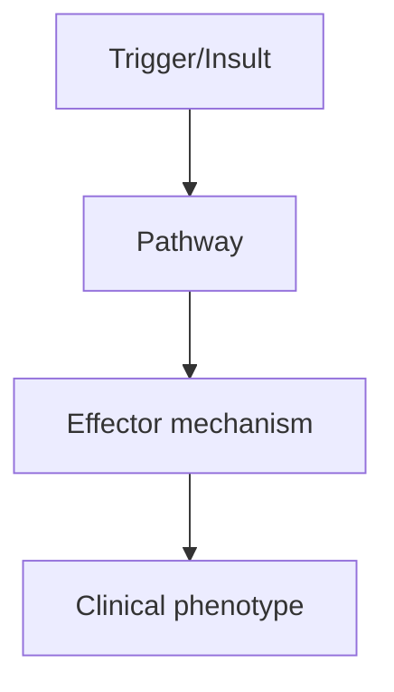
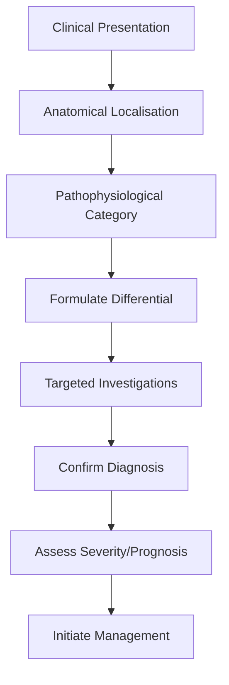
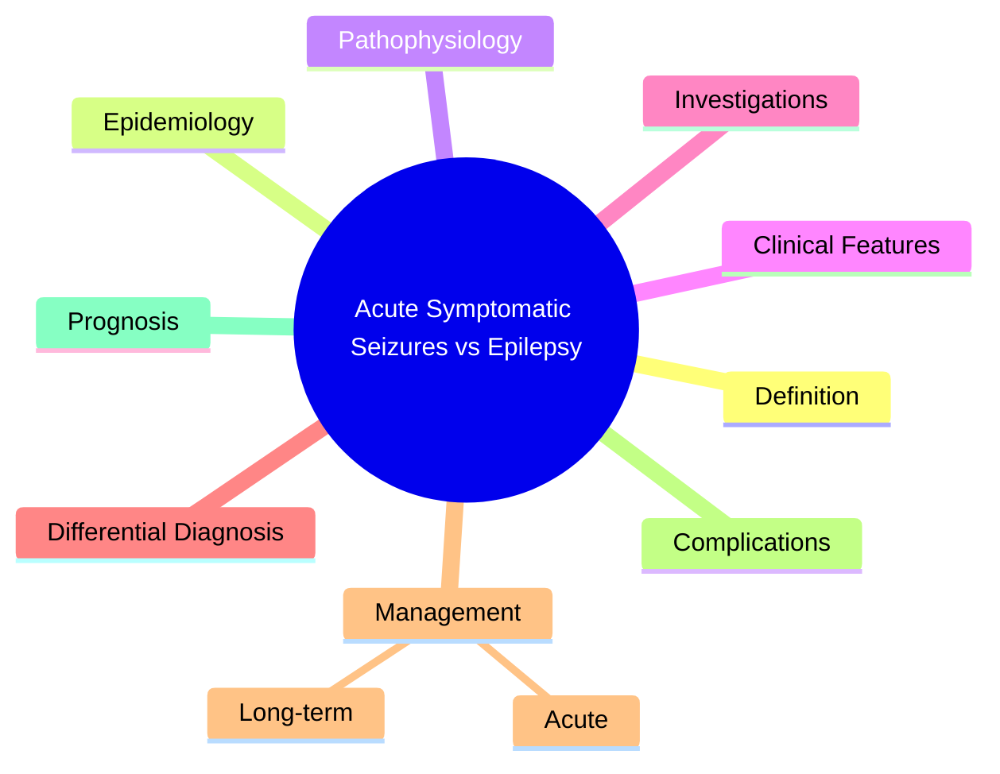

# Acute Symptomatic Seizures vs Epilepsy

> [!tip] **High-Yield Definition**
> Acute symptomatic (provoked) seizures: occur in close temporal relationship with an acute systemic, metabolic, toxic, or CNS insult. Epilepsy: ≥2 unprovoked seizures >24h apart, OR 1 unprovoked seizure with high recurrence risk, OR diagnosis of an epilepsy syndrome.

---

## 1. Definition / Epidemiology / Classification

### Definition
Acute symptomatic (provoked) seizures: occur in close temporal relationship with an acute systemic, metabolic, toxic, or CNS insult. Epilepsy: ≥2 unprovoked seizures >24h apart, OR 1 unprovoked seizure with high recurrence risk, OR diagnosis of an epilepsy syndrome.

### Epidemiology
Acute symptomatic seizures: 3-5% of all seizures. Common causes: metabolic (hypoglycaemia, hyponatraemia, hypocalcaemia, uraemia), drugs (antibiotics, tramadol, baclofen, alcohol/benzodiazepine withdrawal), CNS infection (meningitis, encephalitis), stroke (<7 days), trauma. Epilepsy: 0.5-1% prevalence.

### Classification
| Variant | Key Features | Prognosis |
|---------|-------------|-----------|
| | | |

---

## 2. Aetiology / Pathophysiology

### Aetiology
Acute symptomatic: metabolic (Na+, Ca2+, Mg2+, glucose, uraemia, hepatic), drugs (toxic, withdrawal), CNS infection, stroke (<7 days post), TBI, eclampsia, hypertensive encephalopathy, posterior reversible encephalopathy syndrome (PRES). Unprovoked (epilepsy): genetic, structural, unknown, autoimmune.

### Pathophysiology

---

## 3. Clinical Features

### History
- **Onset/Duration:**
- **Progression:**
- **Key symptoms:**
- **Triggers:**
- **Systemic symptoms:**
- **Drug/Family/Social history:**

### Examination
| Domain | Key Findings | Localisation Value |
|--------|-------------|-------------------|
| | | |

### Specific Clinical Features
Acute symptomatic: seizure occurs during acute illness, with metabolic derangement, drug toxicity, infection, stroke, or trauma. EEG: may show diffuse slowing, epileptiform discharges in context. Epilepsy: ≥2 unprovoked seizures >24h apart, no acute precipitant. Investigation: exclude acute symptomatic cause first (bloods, imaging, LP if needed).

---

## 4. Diagnostic Approach / Algorithm

---

## 5. Investigations

Bloods: glucose, electrolytes (Na+, K+, Ca2+, Mg2+), renal, liver, FBC, toxicology, drug levels (theophylline, lithium, antibiotics, etc.), VBG. CT head (exclude structural, haemorrhage). LP (CNS infection). MRI brain (later, structural, scar). EEG (later, interictal, photosensitivity).

---

## 6. Differential Diagnosis

| Differential | Distinguishing Features | Key Test |
|--------------|------------------------|----------|
| | | |

---

## 7. Management

Acute symptomatic: treat underlying cause (correct electrolytes, antibiotics, anti-epileptic for limited period if needed). Generally do NOT require long-term ASM. Epilepsy: long-term ASM after 2nd unprovoked seizure or if high recurrence risk. Counsel on driving, lifestyle, SUDEP.

---

## 8. Drug Interactions / Contraindications / Comorbidity Cautions

| Drug | Interaction / Caution | Management |
|------|----------------------|------------|
| | | |

---

## 9. Procedures (if applicable)

### Procedure:
- **Indications:**
- **Contraindications:**
- **Preparation / Principle:**
- **Complications:**
- **Viva Pearls:**

---

## 10. Complications

| Complication | Frequency | Prevention / Monitoring | Management |
|--------------|-----------|------------------------|------------|
| | | | |

---

## 11. Red Flags / Emergencies

Eclampsia (pregnancy), CNS infection, drug withdrawal (status epilepticus), PRES (reversible if treated).

---

## 12. Prognosis

Acute symptomatic: usually self-limiting, treat cause. Recurrence depends on cause. Unprovoked/epilepsy: 60-70% controlled with ASM. 30-40% drug-resistant.

---

## 13. Topic Correlation

| Related Topic | Link | Key Overlap |
|---------------|------|-------------|
| | | |

---

## 14. Special Situations

| Situation | Consideration |
|-----------|---------------|
| **Pregnancy** | |
| **Lactation** | |
| **Paediatric** | |
| **Elderly / Frail** | |
| **Renal impairment** | |
| **Hepatic impairment** | |
| **Immunocompromised** | |
| **Perioperative** | |
| **Driving / DVLA** | |
| **Occupational** | |

---

## FCPS/MRCP High-Yield Summary

| Category | Key Points |
|----------|------------|
| **Definition** | Acute symptomatic (provoked) seizures: occur in close temporal relationship with an acute systemic, metabolic, toxic, or CNS insult. Epilepsy: ≥2 unprovoked seizures >24h apart, OR 1 unprovoked seizur |
| **Epidemiology** | Acute symptomatic seizures: 3-5% of all seizures. Common causes: metabolic (hypoglycaemia, hyponatraemia, hypocalcaemia, uraemia), drugs (antibiotics, |
| **Pathophysiology** | |
| **Clinical** | Acute symptomatic: seizure occurs during acute illness, with metabolic derangement, drug toxicity, infection, stroke, or trauma. EEG: may show diffuse slowing, epileptiform discharges in context. Epil |
| **Diagnosis** | |
| **Investigations** | Bloods: glucose, electrolytes (Na+, K+, Ca2+, Mg2+), renal, liver, FBC, toxicology, drug levels (theophylline, lithium, antibiotics, etc.), VBG. CT head (exclude structural, haemorrhage). LP (CNS infe |
| **Management** | Acute symptomatic: treat underlying cause (correct electrolytes, antibiotics, anti-epileptic for limited period if needed). Generally do NOT require long-term ASM. Epilepsy: long-term ASM after 2nd un |
| **Complications** | |
| **Prognosis** | Acute symptomatic: usually self-limiting, treat cause. Recurrence depends on cause. Unprovoked/epilepsy: 60-70% controlled with ASM. 30-40% drug-resistant. |
| **Viva Pearls** | |
| **Drug Doses** | |
| **Scoring Systems** | |
| **Genetics** | |
| **Imaging Signs** | |

---

## Viva Questions (PACES/FCPS Style)

1. **Q:** Define Acute Symptomatic Seizures vs Epilepsy and classify its variants.
   **A:** Based on the definition above.

2. **Q:** What are the key clinical features?
   **A:** Acute symptomatic: seizure occurs during acute illness, with metabolic derangement, drug toxicity, infection, stroke, or trauma. EEG: may show diffuse slowing, epileptiform discharges in context. Epilepsy: ≥2 unprovoked seizures >24h apart, no acute precipitant. Investigation: exclude acute symptoma

3. **Q:** What is the first-line treatment?
   **A:** Based on the management section.

4. **Q:** What are the red flags requiring urgent referral?
   **A:** Eclampsia (pregnancy), CNS infection, drug withdrawal (status epilepticus), PRES (reversible if treated).

5. **Q:** What is the prognosis?
   **A:** Acute symptomatic: usually self-limiting, treat cause. Recurrence depends on cause. Unprovoked/epilepsy: 60-70% controlled with ASM. 30-40% drug-resistant.

6. **Q:** How do you differentiate Acute Symptomatic Seizures vs Epilepsy from key differentials?
   **A:** Clinical features, investigations, and response to treatment.

7. **Q:** What investigations are most useful?
   **A:** Based on the investigations section.

8. **Q:** Describe the stepwise management approach.
   **A:** Based on the management algorithm.

9. **Q:** What are the emergency presentations?
   **A:** Based on the red flags section.

10. **Q:** How does management change in pregnancy/paediatrics/elderly?
    **A:** Special considerations per population.

---

## Common Confusions / Exam Traps

| Confusion | Clarification |
|-----------|---------------|
| | |

---

## Mnemonics
1. **PROVOKED = Acute symptomatic** — **P**r**O**k**O**ked by transient cause (metabolic, drugs, fever, infection)
1. **UNPROVOKED = Epilepsy** — Two or more unprovoked seizures >24h apart, OR one seizure with high recurrence risk
1. **STATUS = emergency** — Continuous ≥5 min OR recurrent without recovery

---

## Mind Map

---

## Spaced Repetition Trackers

| Review Interval | Date | Score (0-5) | Notes |
|-----------------|------|-------------|-------|
| Day 1 | | | |
| Day 3 | | | |
| Day 7 | | | |
| Day 14 | | | |
| Day 30 | | | |
| Day 90 | | | |

---

## Self-Test Scorecard

| Section | Score /5 | Last Attempt |
|---------|----------|--------------|
| Definition & Epidemiology | | |
| Pathophysiology | | |
| Clinical Features | | |
| Investigations | | |
| Differential Diagnosis | | |
| Management | | |
| Complications & Prognosis | | |
| Viva Questions | | |
| MCQs | | |
| SBAs | | |

---

## MCQs (10)

1. **Question:** Definition of epilepsy (ILAE 2014):
   **Options:** A. Two unprovoked seizures >24h apart OR one with high recurrence risk B. Any single seizure C. Two seizures in 24h D. Any seizure + abnormal EEG
   **Answer:** A
   **Explanation:** ILAE 2014: ≥2 unprovoked seizures >24h apart, OR 1 unprovoked + high recurrence risk (lesion, abnormal EEG/MRI).

2. **Question:** Acute symptomatic seizure is provoked by:
   **Options:** A. Transient cause (metabolic, drug, fever, stroke) B. Genetic predisposition C. Unknown cause D. Structural lesion
   **Answer:** A
   **Explanation:** Acute symptomatic = within 7 days of transient cause. Different from epilepsy (unprovoked).

3. **Question:** Commonest cause of acute symptomatic seizure in adults:
   **Options:** A. Stroke, metabolic, drugs, alcohol withdrawal B. Genetic C. Tumour D. Idiopathic
   **Answer:** A
   **Explanation:** Adults: stroke, metabolic (hypoNa, hypoCa, hypoglycaemia), drugs, alcohol withdrawal.

4. **Question:** Commonest cause of acute symptomatic seizure in children:
   **Options:** A. Febrile illness (fever, infection) B. Genetic C. Tumour D. Stroke
   **Answer:** A
   **Explanation:** Children: febrile seizures (3mo-6y), infection, metabolic.

5. **Question:** First seizure evaluation includes:
   **Options:** A. History, exam, MRI, EEG, bloods (glucose, Na, Ca, Mg, LFTs) B. Only MRI C. Only EEG D. Only bloods
   **Answer:** A
   **Explanation:** First seizure: full history, neuro exam, MRI (not CT unless emergency), EEG, bloods (glucose, electrolytes, LFTs, toxicology).

6. **Question:** After first unprovoked seizure, recurrence risk is:
   **Options:** A. ~40-50% over 2 years (higher if lesion/abnormal EEG) B. <10% C. >90% D. 100%
   **Answer:** A
   **Explanation:** Recurrence risk 40-50% over 2 years overall. Higher with structural lesion, abnormal EEG, nocturnal, post-stroke.

7. **Question:** When to start ASM after first seizure:
   **Options:** A. If high recurrence risk (lesion, abnormal EEG/MRI) or patient preference B. Always C. Never D. Only if generalised
   **Answer:** A
   **Explanation:** Start ASM if high recurrence risk, abnormal EEG/MRI, or patient preference. Not always.

8. **Question:** Febrile seizure is:
   **Options:** A. Provoked (fever) in 3mo-6y, no CNS infection B. Epilepsy C. Status epilepticus D. Brain tumour
   **Answer:** A
   **Explanation:** Febrile seizure = provoked by fever, age 3mo-6y, no CNS infection. Not epilepsy.

9. **Question:** Acute symptomatic seizure prognosis:
   **Options:** A. Recurrence risk low (10% if cause treated) - usually don't need long-term ASM B. High - need long-term ASM C. Always progress to epilepsy D. Always fatal
   **Answer:** A
   **Explanation:** Acute symptomatic seizures: recurrence low if underlying cause treated. Usually no long-term ASM.

10. **Question:** ILAE 2017 classification of seizure onset:
   **Options:** A. Focal, generalised, unknown onset B. Generalised only C. Focal only D. Tonic-clonic only
   **Answer:** A
   **Explanation:** ILAE 2017: focal onset, generalised onset, unknown onset. Further subclassified by awareness (focal) or motor/non-motor.

---

## SBA Questions (10)

1. **Scenario:** First generalised tonic-clonic seizure, normal MRI and EEG. Treatment?
   **Options:** A. Counsel on recurrence risk (40-50% over 2y); ASM if patient preference B. Start ASM immediately C. No further action D. Vagal nerve stimulator E. Surgery
   **Answer:** A
   **Explanation:** Normal MRI/EEG: recurrence risk lower. Counsel patient, ASM if preference or if risk factors emerge.

2. **Scenario:** First seizure 3 days after starting ciprofloxacin. Cause?
   **Options:** A. Drug-induced (lowers seizure threshold) B. Genetic epilepsy C. Tumour D. Idiopathic E. Stroke
   **Answer:** A
   **Explanation:** Fluoroquinolones (cipro), beta-lactams (imipenem), mefloquine lower seizure threshold. Acute symptomatic.

3. **Scenario:** First seizure, MRI shows mesial temporal sclerosis. Treatment?
   **Options:** A. Start ASM (high recurrence risk) B. Observe C. No further action D. VNS E. Surgery
   **Answer:** A
   **Explanation:** Structural lesion (MTS) = high recurrence risk. Start ASM (levetiracetam/lamotrigine). Refer for surgical evaluation if drug-resistant.

---

## Tags

**Tags:** #neurology #epilepsy #first-seizure #acute-symptomatic #provoked #ILAE-2014 #FCPS #MRCP

---

## Local Navigation
**Heading Hub:** [[../Seizure Classification & Diagnosis Hub]]
**Chapter Hierarchy:** [[../../Davidson Chapter 25 - Neurology Hierarchy]]
**Chapter MOC:** [[../../Neurology MOC]]
**Drug Reference:** [[../../00_Index/Neurology Drug Reference]]