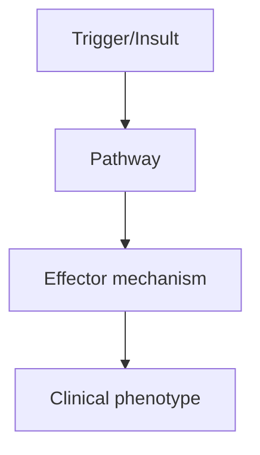
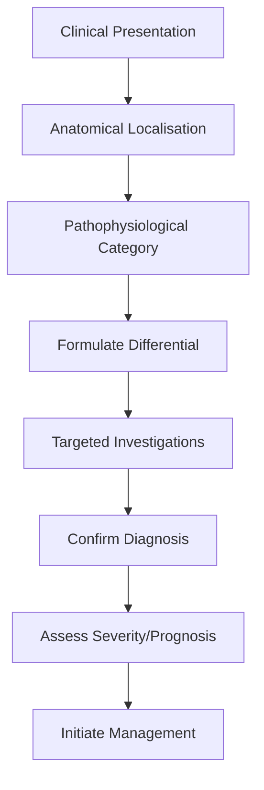
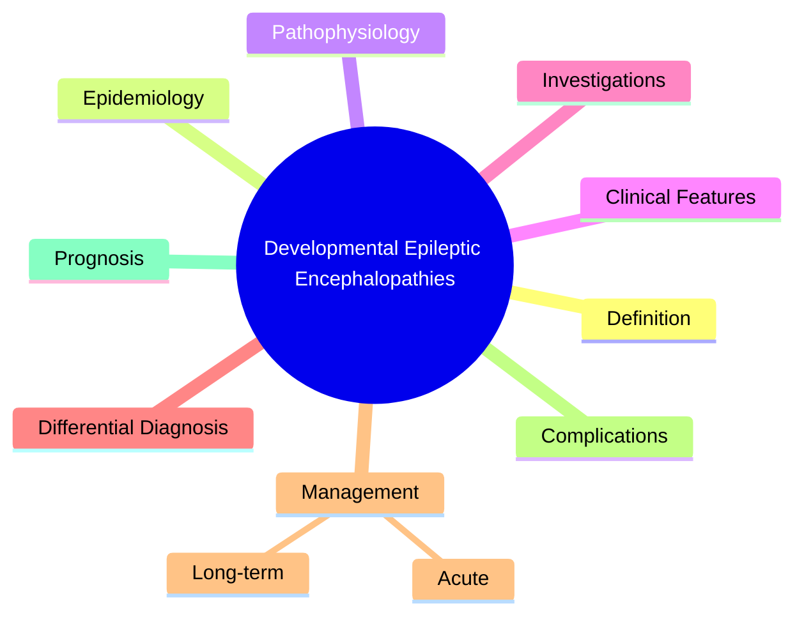

# Developmental Epileptic Encephalopathies

> [!tip] **High-Yield Definition**
> DEEs: severe epilepsy syndromes with onset in infancy/childhood characterised by frequent seizures, developmental regression, and typically poor prognosis. EEG shows continuous or near-continuous epileptiform activity. Include Ohtahara, West, LGS, Dravet, EIEE (early infantile developmental and epileptic encephalopathy).

---

## 1. Definition / Epidemiology / Classification

### Definition
DEEs: severe epilepsy syndromes with onset in infancy/childhood characterised by frequent seizures, developmental regression, and typically poor prognosis. EEG shows continuous or near-continuous epileptiform activity. Include Ohtahara, West, LGS, Dravet, EIEE (early infantile developmental and epileptic encephalopathy).

### Epidemiology
Rare individually but collectively significant cause of paediatric epilepsy. Dravet: 1/15,000-1/40,000. West: 1/3,000-1/5,000 infants. Ohtahara: very rare.

### Classification
| Variant | Key Features | Prognosis |
|---------|-------------|-----------|
| | | |

---

## 2. Aetiology / Pathophysiology

### Aetiology
Genetic: SCN1A (Dravet, 80%), SCN2A, SCN8A, KCNQ2, GABRG2, STXBP1, CDKL5, FOXG1, ARX, SCN1B, SCN9A, GNAO1. Structural: lissencephaly, hemimegalencephaly, FCD. Metabolic: pyridoxine-dependent, GLUT1, Menkes, mitochondrial. Unknown: 30-50%.

### Pathophysiology

---

## 3. Clinical Features

### History
- **Onset/Duration:**
- **Progression:**
- **Key symptoms:**
- **Triggers:**
- **Systemic symptoms:**
- **Drug/Family/Social history:**

### Examination
| Domain | Key Findings | Localisation Value |
|--------|-------------|-------------------|
| | | |

### Specific Clinical Features
Ohtahara: neonatal onset, tonic spasms, burst suppression on EEG, structural/metabolic cause. West: 3-12mo, infantile spasms (salaam attacks), hypsarrhythmia, developmental regression. LGS: 1-7y, multiple seizure types (tonic, atonic, atypical absence, GTC), slow spike-wave, cognitive decline. Dravet: <1y, prolonged febrile seizures, refractory, developmental regression, myoclonic, absence, GTC. EIEE: neonatal onset, multiple seizure types, severe developmental impairment.

---

## 4. Diagnostic Approach / Algorithm

---

## 5. Investigations

EEG: burst suppression (Ohtahara), hypsarrhythmia (West), slow spike-wave <2.5Hz (LGS), generalised polyspike (Dravet). MRI brain (structural). Genetic testing (epilepsy gene panel, WES): SCN1A, SCN2A, KCNQ2, etc. Metabolic screen: lactate, ammonia, amino acids, organic acids, urine MCFA. CSF: glucose, neurotransmitters. Skin/muscle biopsy if mitochondrial suspected.

---

## 6. Differential Diagnosis

| Differential | Distinguishing Features | Key Test |
|--------------|------------------------|----------|
| | | |

---

## 7. Management

Syndrome-specific: ACTH/prednisolone (West, first-line), vigabatrin (West, especially tuberous sclerosis), ketogenic diet (Dravet, LGS, GLUT1), stiripentol + valproate + clobazam (Dravet), fenfluramine (Dravet, LGS), cannabidiol (Dravet, LGS, TSC). ASMs by seizure type. AVOID in Dravet: Na+ channel blockers (CBZ, PHT, LTG). Resective surgery if focal lesion (FCD, hemimegalencephaly). VNS for refractory. Multidisciplinary: physiotherapy, OT, speech, dietician, social work.

---

## 8. Drug Interactions / Contraindications / Comorbidity Cautions

| Drug | Interaction / Caution | Management |
|------|----------------------|------------|
| | | |

---

## 9. Procedures (if applicable)

### Procedure:
- **Indications:**
- **Contraindications:**
- **Preparation / Principle:**
- **Complications:**
- **Viva Pearls:**

---

## 10. Complications

| Complication | Frequency | Prevention / Monitoring | Management |
|--------------|-----------|------------------------|------------|
| | | | |

---

## 11. Red Flags / Emergencies

Developmental regression, refractory status epilepticus (Dravet), SUDEP, aspiration.

---

## 12. Prognosis

Generally poor. Ohtahara: 50% mortality by 1y. West: 30% develop LGS. LGS: refractory, intellectual disability. Dravet: developmental disability, SUDEP 5-20%. EIEE: severe disability, often life-limiting.

---

## 13. Topic Correlation

| Related Topic | Link | Key Overlap |
|---------------|------|-------------|
| | | |

---

## 14. Special Situations

| Situation | Consideration |
|-----------|---------------|
| **Pregnancy** | |
| **Lactation** | |
| **Paediatric** | |
| **Elderly / Frail** | |
| **Renal impairment** | |
| **Hepatic impairment** | |
| **Immunocompromised** | |
| **Perioperative** | |
| **Driving / DVLA** | |
| **Occupational** | |

---

## FCPS/MRCP High-Yield Summary

| Category | Key Points |
|----------|------------|
| **Definition** | DEEs: severe epilepsy syndromes with onset in infancy/childhood characterised by frequent seizures, developmental regression, and typically poor prognosis. EEG shows continuous or near-continuous epil |
| **Epidemiology** | Rare individually but collectively significant cause of paediatric epilepsy. Dravet: 1/15,000-1/40,000. West: 1/3,000-1/5,000 infants. Ohtahara: very  |
| **Pathophysiology** | |
| **Clinical** | Ohtahara: neonatal onset, tonic spasms, burst suppression on EEG, structural/metabolic cause. West: 3-12mo, infantile spasms (salaam attacks), hypsarrhythmia, developmental regression. LGS: 1-7y, mult |
| **Diagnosis** | |
| **Investigations** | EEG: burst suppression (Ohtahara), hypsarrhythmia (West), slow spike-wave <2.5Hz (LGS), generalised polyspike (Dravet). MRI brain (structural). Genetic testing (epilepsy gene panel, WES): SCN1A, SCN2A |
| **Management** | Syndrome-specific: ACTH/prednisolone (West, first-line), vigabatrin (West, especially tuberous sclerosis), ketogenic diet (Dravet, LGS, GLUT1), stiripentol + valproate + clobazam (Dravet), fenfluramin |
| **Complications** | |
| **Prognosis** | Generally poor. Ohtahara: 50% mortality by 1y. West: 30% develop LGS. LGS: refractory, intellectual disability. Dravet: developmental disability, SUDEP 5-20%. EIEE: severe disability, often life-limit |
| **Viva Pearls** | |
| **Drug Doses** | |
| **Scoring Systems** | |
| **Genetics** | |
| **Imaging Signs** | |

---

## Viva Questions (PACES/FCPS Style)

1. **Q:** Define Developmental Epileptic Encephalopathies and classify its variants.
   **A:** Based on the definition above.

2. **Q:** What are the key clinical features?
   **A:** Ohtahara: neonatal onset, tonic spasms, burst suppression on EEG, structural/metabolic cause. West: 3-12mo, infantile spasms (salaam attacks), hypsarrhythmia, developmental regression. LGS: 1-7y, multiple seizure types (tonic, atonic, atypical absence, GTC), slow spike-wave, cognitive decline. Drave

3. **Q:** What is the first-line treatment?
   **A:** Based on the management section.

4. **Q:** What are the red flags requiring urgent referral?
   **A:** Developmental regression, refractory status epilepticus (Dravet), SUDEP, aspiration.

5. **Q:** What is the prognosis?
   **A:** Generally poor. Ohtahara: 50% mortality by 1y. West: 30% develop LGS. LGS: refractory, intellectual disability. Dravet: developmental disability, SUDEP 5-20%. EIEE: severe disability, often life-limiting.

6. **Q:** How do you differentiate Developmental Epileptic Encephalopathies from key differentials?
   **A:** Clinical features, investigations, and response to treatment.

7. **Q:** What investigations are most useful?
   **A:** Based on the investigations section.

8. **Q:** Describe the stepwise management approach.
   **A:** Based on the management algorithm.

9. **Q:** What are the emergency presentations?
   **A:** Based on the red flags section.

10. **Q:** How does management change in pregnancy/paediatrics/elderly?
    **A:** Special considerations per population.

---

## Common Confusions / Exam Traps

| Confusion | Clarification |
|-----------|---------------|
| | |

---

## Mnemonics
1. **Ohtahara = EARLY** — Neonatal (first 3 months), burst suppression, poor prognosis
1. **West = Infantile Spasms** — Triad: spasms, hypsarrhythmia, developmental regression; treat with ACTH/vigabatrin
1. **Lennox-Gastaut = LGS** — Triad: multiple seizure types (tonic, atonic, atypical absence), slow spike-wave, cognitive impairment; resistant

---

## Mind Map

---

## Spaced Repetition Trackers

| Review Interval | Date | Score (0-5) | Notes |
|-----------------|------|-------------|-------|
| Day 1 | | | |
| Day 3 | | | |
| Day 7 | | | |
| Day 14 | | | |
| Day 30 | | | |
| Day 90 | | | |

---

## Self-Test Scorecard

| Section | Score /5 | Last Attempt |
|---------|----------|--------------|
| Definition & Epidemiology | | |
| Pathophysiology | | |
| Clinical Features | | |
| Investigations | | |
| Differential Diagnosis | | |
| Management | | |
| Complications & Prognosis | | |
| Viva Questions | | |
| MCQs | | |
| SBAs | | |

---

## MCQs (10)

1. **Question:** West syndrome triad:
   **Options:** A. Infantile spasms + hypsarrhythmia + developmental regression B. Tonic-clonic + 3Hz spike-wave + loss of consciousness C. Tonic + atonic + atypical absence D. Atypical febrile + myoclonus + ataxia
   **Answer:** A
   **Explanation:** West: spasms (salaam), hypsarrhythmia (chaotic), regression. Onset 3-12mo.

2. **Question:** First-line treatment for infantile spasms (West):
   **Options:** A. ACTH or vigabatrin (especially if tuberous sclerosis) B. Phenytoin C. Carbamazepine D. Lamotrigine
   **Answer:** A
   **Explanation:** First-line: ACTH (tetracosactide) or vigabatrin. Vigabatrin first if TS.

3. **Question:** Lennox-Gastaut syndrome features:
   **Options:** A. Multiple seizure types (tonic, atonic, atypical absence), slow spike-wave, cognitive impairment B. Febrile seizures C. Absence only D. Juvenile myoclonic epilepsy
   **Answer:** A
   **Explanation:** LGS: multiple seizure types (tonic, atonic, atypical absence, GTC), slow spike-wave <2.5Hz, intellectual disability. Drug-resistant.

4. **Question:** Lennox-Gastaut treatment:
   **Options:** A. Broad-spectrum ASMs: valproate, lamotrigine, topiramate, rufinamide, felbamate, cannabidiol B. Carbamazepine (worsens) C. Phenytoin (worsens) D. Ethosuximide (only absence)
   **Answer:** A
   **Explanation:** LGS: valproate, lamotrigine, topiramate, rufinamide, felbamate, cannabidiol (CBD). Avoid sodium-channel blockers (worsen).

5. **Question:** Ohtahara syndrome onset:
   **Options:** A. Neonatal (first 3 months of life) B. Childhood (3-12y) C. Adolescence D. Adult
   **Answer:** A
   **Explanation:** Ohtahara: neonatal (<3mo), burst-suppression on EEG, tonic seizures, poor prognosis.

6. **Question:** Dravet syndrome features:
   **Options:** A. Severe myoclonic epilepsy of infancy, febrile seizures → afebrile, SCN1A mutation, photosensitivity B. Adult onset absence C. Pure focal seizures D. Tumour-related
   **Answer:** A
   **Explanation:** Dravet: onset 5-9mo, febrile → afebrile polymorphic (GTC, myoclonic, focal), SCN1A mutation, photosensitivity. AVOID sodium channel blockers (worsen).

7. **Question:** Dravet syndrome treatment:
   **Options:** A. Valproate, clobazam, topiramate, stiripentol, fenfluramine, cannabidiol B. Carbamazepine (worsens) C. Phenytoin (worsens) D. Lamotrigine (worsens)
   **Answer:** A
   **Explanation:** Dravet: avoid Na+ blockers (CBZ, PHT, LTG worsen). Valproate, clobazam, topiramate, stiripentol, fenfluramine, CBD.

8. **Question:** Epileptic encephalopathy definition:
   **Options:** A. Cognitive/behavioural regression attributable to epileptiform activity B. Only seizures matter C. Only EEG D. Genetic only
   **Answer:** A
   **Explanation:** EE: cognitive/behavioural deterioration from epileptiform activity (not just underlying cause).

9. **Question:** SCN1A mutation in Dravet:
   **Options:** A. Loss-of-function in Nav1.1 (GABAergic interneurons) B. Gain of function C. Calcium channel D. GABA-A receptor
   **Answer:** A
   **Explanation:** SCN1A loss-of-function in Dravet. Na+ blockers worsen (paradoxical exacerbation).

10. **Question:** Tuberous sclerosis + epilepsy treatment:
   **Options:** A. Vigabatrin (first-line for spasms) + everolimus (SEGA, refractory epilepsy) B. Phenytoin C. Carbamazepine D. Valproate only
   **Answer:** A
   **Explanation:** TS: vigabatrin first-line for spasms. Everolimus (mTOR inhibitor) for SEGA, refractory epilepsy.

---

## SBA Questions (10)

1. **Scenario:** 6-month-old with salaam attacks, hypsarrhythmia, regression. Diagnosis?
   **Options:** A. West syndrome (infantile spasms) B. Febrile seizures C. Dravet syndrome D. Lennox-Gastaut E. Benign rolandic epilepsy
   **Answer:** A
   **Explanation:** West: spasms + hypsarrhythmia + regression. Onset 3-12mo. First-line: ACTH or vigabatrin.

2. **Scenario:** Dravet patient on carbamazepine with worsening seizures. Action?
   **Options:** A. Stop carbamazepine (Na+ blockers worsen in SCN1A) B. Increase dose C. Add levetiracetam D. VNS E. Surgery
   **Answer:** A
   **Explanation:** Dravet: Na+ blockers (CBZ, PHT, LTG) WORSEN seizures. Switch to valproate, clobazam, stiripentol, fenfluramine.

3. **Scenario:** Patient with LGS, multiple seizure types, slow spike-wave. Avoid?
   **Options:** A. Sodium channel blockers (carbamazepine, phenytoin, lamotrigine) B. Valproate C. Topiramate D. Rufinamide E. Cannabidiol
   **Answer:** A
   **Explanation:** LGS: avoid Na+ blockers (worsen tonic/atonic). Use broad-spectrum (valproate, topiramate, rufinamide, CBD, fenfluramine).

---

## Tags

**Tags:** #neurology #epilepsy #encephalopathy #West #Lennox-Gastaut #Dravet #SCN1A #FCPS #MRCP

---

## Local Navigation
**Heading Hub:** [[../Epilepsy Syndromes & Special Situations Hub]]
**Chapter Hierarchy:** [[../../Davidson Chapter 25 - Neurology Hierarchy]]
**Chapter MOC:** [[../../Neurology MOC]]
**Drug Reference:** [[../../00_Index/Neurology Drug Reference]]

## PasTest Scenario SBAs (Clinical Vignettes)

> **Auto-generated PasTest/Mediscope-style scenario SBAs** grounded in the authored source. Each scenario tests a real clinical fact (triad, specific sign, contraindication, trial, first-line Rx) extracted from the topic. *Source: Ch 27: Neurology & Stroke — Developmental Epileptic Encephalopathies*

**Q1.** Which of the following features is most specific or characteristic of Developmental Epileptic Encephalopathies?

  - **A.** Lennox-Gastaut = LGS
  - **B.** A feature common to many acute inflammatory conditions
  - **C.** A non-specific sign that does not localise the diagnosis
  - **D.** An investigation finding rather than a clinical feature

  > **Answer: A** — Lennox-Gastaut = LGS
  >
  > *Source:* **Lennox-Gastaut = LGS** — Triad: multiple seizure types (tonic, atonic, atypical absence), slow spike-wave, cognitive impairment; resistant

---

