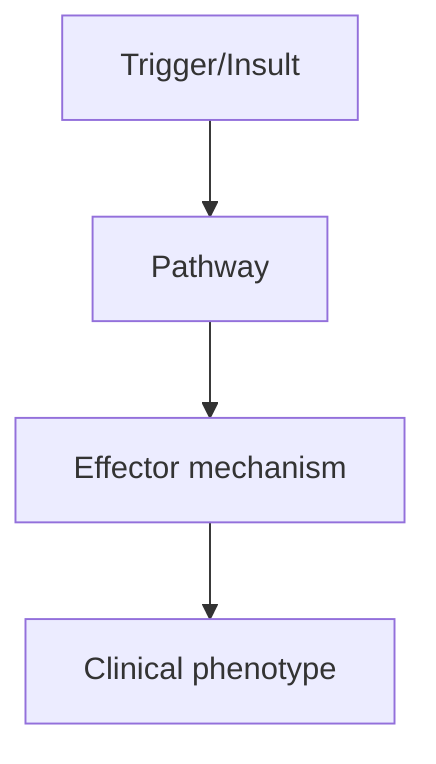
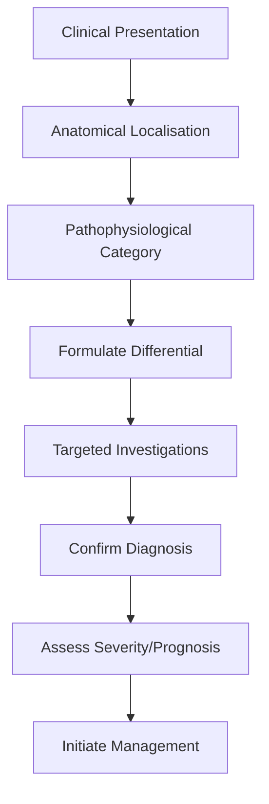
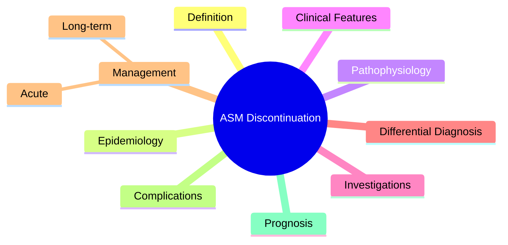

# Discontinuation & Withdrawal Strategies

> [!tip] **High-Yield Definition**
> ASM withdrawal after sustained seizure freedom. Decision balances relapse risk vs long-term ASM side effects. Patient-centred decision after ≥2 years seizure-free.

---

## 1. Definition / Epidemiology / Classification

### Definition
ASM withdrawal after sustained seizure freedom. Decision balances relapse risk vs long-term ASM side effects. Patient-centred decision after ≥2 years seizure-free.

### Epidemiology
50-60% of patients relapse within 2 years of ASM withdrawal. 40-50% remain seizure-free long-term. Risk factors predict relapse.

### Classification
| Variant | Key Features | Prognosis |
|---------|-------------|-----------|
| | | |

---

## 2. Aetiology / Pathophysiology

### Aetiology
N/A. Withdrawal principles.

### Pathophysiology

---

## 3. Clinical Features

### History
- **Onset/Duration:**
- **Progression:**
- **Key symptoms:**
- **Triggers:**
- **Systemic symptoms:**
- **Drug/Family/Social history:**

### Examination
| Domain | Key Findings | Localisation Value |
|--------|-------------|-------------------|
| | | |

### Specific Clinical Features
Indications for withdrawal: ≥2 years seizure-free (some ≥3-5y, especially structural cause, abnormal EEG). Patient preference (lifestyle, side effects, teratogenicity, cost). Relative contraindications: structural brain lesion, abnormal EEG at withdrawal, seizure type myoclonic/atonic, juvenile myoclonic epilepsy (high relapse, often lifelong), poor prognostic features. Risk factors for relapse: symptomatic epilepsy, abnormal EEG, adult-onset, multiple seizure types, prolonged epilepsy before control, focal neurological deficit. Predictors of success: childhood-onset, idiopathic/genetic, normal MRI, normal EEG, short duration of epilepsy, single seizure type.

---

## 4. Diagnostic Approach / Algorithm

---

## 5. Investigations

EEG before withdrawal (if abnormal, higher relapse risk). MRI if not done. Patient education: relapse risk, driving regulations (DVLA: 1 year off ASM without seizure, 6 months if provoked with known trigger), lifestyle, SUDEP awareness, what to do if seizure recurs (restart ASM, contact clinician).

---

## 6. Differential Diagnosis

| Differential | Distinguishing Features | Key Test |
|--------------|------------------------|----------|
| | | |

---

## 7. Management

Decision shared with patient. Discuss risk/benefit. Plan withdrawal: very slow (25% dose reduction every 3-6 months, especially for benzodiazepines, barbiturates - risk of withdrawal seizures). EEG before complete withdrawal. Avoid sudden cessation (status epilepticus risk). If seizures recur: restart ASM (usually effective). Resume previous effective regimen. Pregnancy: continue ASM if high relapse risk. Driving: 1 year off ASM without seizure (Group 1 in UK), 10 years (Group 2).

---

## 8. Drug Interactions / Contraindications / Comorbidity Cautions

| Drug | Interaction / Caution | Management |
|------|----------------------|------------|
| | | |

---

## 9. Procedures (if applicable)

### Procedure:
- **Indications:**
- **Contraindications:**
- **Preparation / Principle:**
- **Complications:**
- **Viva Pearls:**

---

## 10. Complications

| Complication | Frequency | Prevention / Monitoring | Management |
|--------------|-----------|------------------------|------------|
| | | | |

---

## 11. Red Flags / Emergencies

Sudden cessation (status epilepticus, especially benzodiazepines, barbiturates). Driving: must be 1 year seizure-free off ASM. Pregnancy: relapse risk, teratogenicity. SUDEP, status epilepticus if relapse.

---

## 12. Prognosis

50-60% relapse within 2 years. Relapse usually within 6-12 months of dose reduction. 90% relapse in first year if it occurs. 40-50% remain seizure-free long-term. If relapse, restarting ASM usually effective. JME: 80-90% relapse, lifelong treatment usually needed.

---

## 13. Topic Correlation

| Related Topic | Link | Key Overlap |
|---------------|------|-------------|
| | | |

---

## 14. Special Situations

| Situation | Consideration |
|-----------|---------------|
| **Pregnancy** | |
| **Lactation** | |
| **Paediatric** | |
| **Elderly / Frail** | |
| **Renal impairment** | |
| **Hepatic impairment** | |
| **Immunocompromised** | |
| **Perioperative** | |
| **Driving / DVLA** | |
| **Occupational** | |

---

## FCPS/MRCP High-Yield Summary

| Category | Key Points |
|----------|------------|
| **Definition** | ASM withdrawal after sustained seizure freedom. Decision balances relapse risk vs long-term ASM side effects. Patient-centred decision after ≥2 years seizure-free. |
| **Epidemiology** | 50-60% of patients relapse within 2 years of ASM withdrawal. 40-50% remain seizure-free long-term. Risk factors predict relapse. |
| **Pathophysiology** | |
| **Clinical** | Indications for withdrawal: ≥2 years seizure-free (some ≥3-5y, especially structural cause, abnormal EEG). Patient preference (lifestyle, side effects, teratogenicity, cost). Relative contraindication |
| **Diagnosis** | |
| **Investigations** | EEG before withdrawal (if abnormal, higher relapse risk). MRI if not done. Patient education: relapse risk, driving regulations (DVLA: 1 year off ASM without seizure, 6 months if provoked with known t |
| **Management** | Decision shared with patient. Discuss risk/benefit. Plan withdrawal: very slow (25% dose reduction every 3-6 months, especially for benzodiazepines, barbiturates - risk of withdrawal seizures). EEG be |
| **Complications** | |
| **Prognosis** | 50-60% relapse within 2 years. Relapse usually within 6-12 months of dose reduction. 90% relapse in first year if it occurs. 40-50% remain seizure-free long-term. If relapse, restarting ASM usually ef |
| **Viva Pearls** | |
| **Drug Doses** | |
| **Scoring Systems** | |
| **Genetics** | |
| **Imaging Signs** | |

---

## Viva Questions (PACES/FCPS Style)

1. **Q:** Define Discontinuation & Withdrawal Strategies and classify its variants.
   **A:** Based on the definition above.

2. **Q:** What are the key clinical features?
   **A:** Indications for withdrawal: ≥2 years seizure-free (some ≥3-5y, especially structural cause, abnormal EEG). Patient preference (lifestyle, side effects, teratogenicity, cost). Relative contraindications: structural brain lesion, abnormal EEG at withdrawal, seizure type myoclonic/atonic, juvenile myoc

3. **Q:** What is the first-line treatment?
   **A:** Based on the management section.

4. **Q:** What are the red flags requiring urgent referral?
   **A:** Sudden cessation (status epilepticus, especially benzodiazepines, barbiturates). Driving: must be 1 year seizure-free off ASM. Pregnancy: relapse risk, teratogenicity. SUDEP, status epilepticus if relapse.

5. **Q:** What is the prognosis?
   **A:** 50-60% relapse within 2 years. Relapse usually within 6-12 months of dose reduction. 90% relapse in first year if it occurs. 40-50% remain seizure-free long-term. If relapse, restarting ASM usually effective. JME: 80-90% relapse, lifelong treatment usually needed.

6. **Q:** How do you differentiate Discontinuation & Withdrawal Strategies from key differentials?
   **A:** Clinical features, investigations, and response to treatment.

7. **Q:** What investigations are most useful?
   **A:** Based on the investigations section.

8. **Q:** Describe the stepwise management approach.
   **A:** Based on the management algorithm.

9. **Q:** What are the emergency presentations?
   **A:** Based on the red flags section.

10. **Q:** How does management change in pregnancy/paediatrics/elderly?
    **A:** Special considerations per population.

---

## Common Confusions / Exam Traps

| Confusion | Clarification |
|-----------|---------------|
| | |

---

## Mnemonics
1. **CONSIDER WITHDRAWAL** — ≥2 years seizure-free, single seizure type, normal MRI/EEG, patient motivation
1. **AVOID WITHDRAWAL** — Structural lesion, abnormal EEG, juvenile myoclonic, severe epilepsy
1. **SLOW TAPER** — Over 3-6 months minimum, even slower for barbiturates/benzodiazepines (seizure risk)

---

## Mind Map

---

## Spaced Repetition Trackers

| Review Interval | Date | Score (0-5) | Notes |
|-----------------|------|-------------|-------|
| Day 1 | | | |
| Day 3 | | | |
| Day 7 | | | |
| Day 14 | | | |
| Day 30 | | | |
| Day 90 | | | |

---

## Self-Test Scorecard

| Section | Score /5 | Last Attempt |
|---------|----------|--------------|
| Definition & Epidemiology | | |
| Pathophysiology | | |
| Clinical Features | | |
| Investigations | | |
| Differential Diagnosis | | |
| Management | | |
| Complications & Prognosis | | |
| Viva Questions | | |
| MCQs | | |
| SBAs | | |

---

## MCQs (10)

1. **Question:** When can ASM withdrawal be considered?
   **Options:** A. After ≥2 years seizure-free B. After 6 months C. After 1 year D. Immediately after diagnosis
   **Answer:** A
   **Explanation:** ≥2 years seizure-free is the standard. Some syndromes (JME) should not be withdrawn.

2. **Question:** Syndromes where ASM withdrawal is NOT recommended:
   **Options:** A. Juvenile myoclonic epilepsy (JME) B. Childhood absence epilepsy C. Benign rolandic epilepsy D. Single seizure with normal MRI
   **Answer:** A
   **Explanation:** JME: lifelong ASM (high relapse 90%). Avoid withdrawal.

3. **Question:** Rate of ASM taper:
   **Options:** A. Over ≥3-6 months (slower for barbiturates, benzodiazepines) B. 1 week C. 1 month D. 1 year
   **Answer:** A
   **Explanation:** Taper slowly ≥3 months, longer for barbiturates (6-12 months) and benzodiazepines.

4. **Question:** Recurrence risk after ASM withdrawal:
   **Options:** A. ~30-50% over 2 years (higher if abnormal EEG, structural lesion, long epilepsy) B. <10% C. >90% D. 100%
   **Answer:** A
   **Explanation:** Recurrence ~30-50% in first 2 years. Higher if abnormal EEG, structural lesion, longer epilepsy duration.

5. **Question:** Predictors of successful ASM withdrawal:
   **Options:** A. Normal MRI, normal EEG, short epilepsy (<2y), single seizure type B. Abnormal MRI C. Abnormal EEG D. Multiple seizure types
   **Answer:** A
   **Explanation:** Predictors of success: normal MRI, normal EEG, single seizure type, short epilepsy, no structural lesion.

6. **Question:** Driving regulations after ASM withdrawal (DVLA UK):
   **Options:** A. Group 1: 6 months seizure-free off medication; Group 2: longer B. 1 month C. 1 year D. 5 years
   **Answer:** A
   **Explanation:** DVLA Group 1: 6 months seizure-free off ASM. Group 2 (HGV): 10 years off ASM without seizures.

7. **Question:** Which ASM is hardest to withdraw?
   **Options:** A. Phenobarbital, benzodiazepines (long-acting) B. Levetiracetam C. Lamotrigine D. Valproate
   **Answer:** A
   **Explanation:** Phenobarbital, benzodiazepines (long-acting): physical dependence, withdrawal seizures. Slow taper 6-12 months.

8. **Question:** Counselling before ASM withdrawal includes:
   **Options:** A. Risk of recurrence (30-50%), driving restrictions, lifestyle B. 100% guarantee of success C. No lifestyle changes D. Immediate driving
   **Answer:** A
   **Explanation:** Counselling: recurrence risk, driving (DVLA), lifestyle (sleep, alcohol, stress), seizure first aid.

---

## SBA Questions (10)

1. **Scenario:** Patient seizure-free 3 years on lamotrigine, wants to stop. Normal MRI/EEG. Counselling?
   **Options:** A. Recurrence ~30-50% over 2y; benefits vs risks; driving 6mo off ASM B. 100% success C. Will definitely relapse D. No driving restrictions E. Immediate stop
   **Answer:** A
   **Explanation:** Counselling on risk, benefits. Slow taper ≥3 months. Driving restrictions during taper + 6 months after.

2. **Scenario:** Patient with JME wants to stop valproate. Advice?
   **Options:** A. Strongly recommend continuing (JME high relapse 90%) B. Stop now C. Switch then stop D. Half dose E. Surgery
   **Answer:** A
   **Explanation:** JME: lifelong ASM. High relapse if withdrawn. Continue unless side effects intolerable.

3. **Scenario:** Phenobarbital withdrawal:
   **Options:** A. Taper very slowly (6-12 months) due to physical dependence B. Stop in 1 week C. 1 month taper D. 2 weeks E. Same as other ASMs
   **Answer:** A
   **Explanation:** Phenobarbital: long-acting barbiturate, physical dependence. Slow taper 6-12 months.

---

## Tags

**Tags:** #neurology #epilepsy #ASM #withdrawal #DVLA #driving #JME #FCPS #MRCP

---

## Local Navigation
**Heading Hub:** [[../Antiseizure Medications & Status Epilepticus Hub]]
**Chapter Hierarchy:** [[../../Davidson Chapter 25 - Neurology Hierarchy]]
**Chapter MOC:** [[../../Neurology MOC]]
**Drug Reference:** [[../../00_Index/Neurology Drug Reference]]