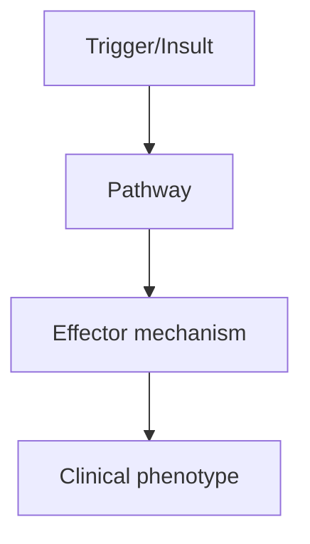
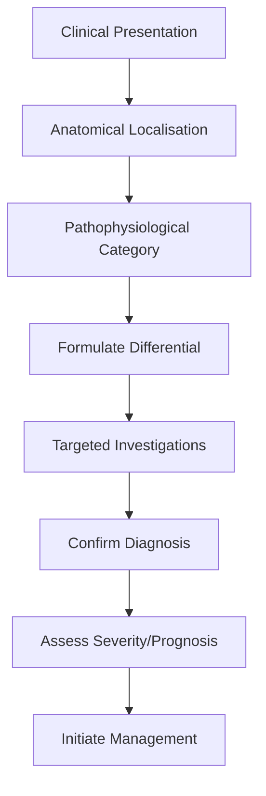
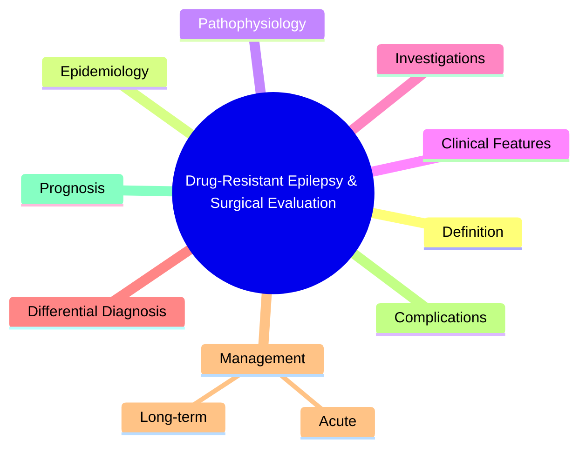

# Drug-Resistant Epilepsy & Surgical Evaluation

> [!tip] **High-Yield Definition**
> Drug-resistant epilepsy: failure of adequate trials of 2 tolerated, appropriately chosen and used ASMs (whether as monotherapies or in combination) to achieve sustained seizure freedom (ILAE). 30-40% of epilepsy patients.

---

## 1. Definition / Epidemiology / Classification

### Definition
Drug-resistant epilepsy: failure of adequate trials of 2 tolerated, appropriately chosen and used ASMs (whether as monotherapies or in combination) to achieve sustained seizure freedom (ILAE). 30-40% of epilepsy patients.

### Epidemiology
30-40% of epilepsy patients. Surgical resection effective in 60-80% of carefully selected candidates. VNS reduces seizure frequency by 50% in 50% of patients.

### Classification
| Variant | Key Features | Prognosis |
|---------|-------------|-----------|
| | | |

---

## 2. Aetiology / Pathophysiology

### Aetiology
Mesial temporal sclerosis (most common surgical cause), cortical dysplasia (FCD type II), low-grade tumours (DNET, ganglioglioma, low-grade glioma), cavernomas, AV malformations, post-traumatic, Rasmussen's encephalitis, hemimegalencephaly.

### Pathophysiology

---

## 3. Clinical Features

### History
- **Onset/Duration:**
- **Progression:**
- **Key symptoms:**
- **Triggers:**
- **Systemic symptoms:**
- **Drug/Family/Social history:**

### Examination
| Domain | Key Findings | Localisation Value |
|--------|-------------|-------------------|
| | | |

### Specific Clinical Features
Continued seizures despite 2+ appropriate ASMs. Impact on quality of life, cognitive function, psychiatric comorbidity, social function, mortality (SUDEP, accidents). Surgical candidates: focal onset, lesion on MRI, concordant EEG findings.

---

## 4. Diagnostic Approach / Algorithm

---

## 5. Investigations

Pre-surgical workup: high-resolution MRI (epilepsy protocol, thin-cut hippocampal), prolonged video-EEG monitoring (capture multiple seizures, characterise focus), FDG-PET (interictal hypometabolism at focus), ictal SPECT (hyperperfusion at focus), MEG (source localisation), intracranial EEG (depth electrodes, subdural grids - if non-invasive is inconclusive), fMRI for language/memory lateralisation, Wada test (amobarbital - older), neuropsychology.

---

## 6. Differential Diagnosis

| Differential | Distinguishing Features | Key Test |
|--------------|------------------------|----------|
| | | |

---

## 7. Management

Surgical: anterior temporal lobectomy (mesial TLE, 60-80% seizure-free), lesionectomy (tumour, cavernoma), hemispherectomy (hemimegalencephaly, Rasmussen's), corpus callosotomy (drop attacks, Lennox). Stimulation: VNS (left vagus, 30% responder rate), DBS-ANT (thalamic anterior nucleus), RNS (responsive neurostimulation, NeuroPace). Dietary: ketogenic diet, modified Atkins, low glycaemic index. ASMs: continue 2 ASMs (synergistic). Avoid enzyme-inducing ASMs in women of childbearing age.

---

## 8. Drug Interactions / Contraindications / Comorbidity Cautions

| Drug | Interaction / Caution | Management |
|------|----------------------|------------|
| | | |

---

## 9. Procedures (if applicable)

### Procedure:
- **Indications:**
- **Contraindications:**
- **Preparation / Principle:**
- **Complications:**
- **Viva Pearls:**

---

## 10. Complications

| Complication | Frequency | Prevention / Monitoring | Management |
|--------------|-----------|------------------------|------------|
| | | | |

---

## 11. Red Flags / Emergencies

Bilateral independent foci (poor surgical candidate), non-focal epilepsy, progressive neurological disease. Pre-surgical evaluation essential to confirm focal onset and resectability.

---

## 12. Prognosis

Surgical resection: 60-80% seizure-free in selected candidates (TLE, FCD II, low-grade tumour). VNS: 50% responder rate (>50% reduction), not seizure-free. SUDEP risk reduced by successful surgery. Quality of life improves with seizure control.

---

## 13. Topic Correlation

| Related Topic | Link | Key Overlap |
|---------------|------|-------------|
| | | |

---

## 14. Special Situations

| Situation | Consideration |
|-----------|---------------|
| **Pregnancy** | |
| **Lactation** | |
| **Paediatric** | |
| **Elderly / Frail** | |
| **Renal impairment** | |
| **Hepatic impairment** | |
| **Immunocompromised** | |
| **Perioperative** | |
| **Driving / DVLA** | |
| **Occupational** | |

---

## FCPS/MRCP High-Yield Summary

| Category | Key Points |
|----------|------------|
| **Definition** | Drug-resistant epilepsy: failure of adequate trials of 2 tolerated, appropriately chosen and used ASMs (whether as monotherapies or in combination) to achieve sustained seizure freedom (ILAE). 30-40%  |
| **Epidemiology** | 30-40% of epilepsy patients. Surgical resection effective in 60-80% of carefully selected candidates. VNS reduces seizure frequency by 50% in 50% of p |
| **Pathophysiology** | |
| **Clinical** | Continued seizures despite 2+ appropriate ASMs. Impact on quality of life, cognitive function, psychiatric comorbidity, social function, mortality (SUDEP, accidents). Surgical candidates: focal onset, |
| **Diagnosis** | |
| **Investigations** | Pre-surgical workup: high-resolution MRI (epilepsy protocol, thin-cut hippocampal), prolonged video-EEG monitoring (capture multiple seizures, characterise focus), FDG-PET (interictal hypometabolism a |
| **Management** | Surgical: anterior temporal lobectomy (mesial TLE, 60-80% seizure-free), lesionectomy (tumour, cavernoma), hemispherectomy (hemimegalencephaly, Rasmussen's), corpus callosotomy (drop attacks, Lennox). |
| **Complications** | |
| **Prognosis** | Surgical resection: 60-80% seizure-free in selected candidates (TLE, FCD II, low-grade tumour). VNS: 50% responder rate (>50% reduction), not seizure-free. SUDEP risk reduced by successful surgery. Qu |
| **Viva Pearls** | |
| **Drug Doses** | |
| **Scoring Systems** | |
| **Genetics** | |
| **Imaging Signs** | |

---

## Viva Questions (PACES/FCPS Style)

1. **Q:** Define Drug-Resistant Epilepsy & Surgical Evaluation and classify its variants.
   **A:** Based on the definition above.

2. **Q:** What are the key clinical features?
   **A:** Continued seizures despite 2+ appropriate ASMs. Impact on quality of life, cognitive function, psychiatric comorbidity, social function, mortality (SUDEP, accidents). Surgical candidates: focal onset, lesion on MRI, concordant EEG findings.

3. **Q:** What is the first-line treatment?
   **A:** Based on the management section.

4. **Q:** What are the red flags requiring urgent referral?
   **A:** Bilateral independent foci (poor surgical candidate), non-focal epilepsy, progressive neurological disease. Pre-surgical evaluation essential to confirm focal onset and resectability.

5. **Q:** What is the prognosis?
   **A:** Surgical resection: 60-80% seizure-free in selected candidates (TLE, FCD II, low-grade tumour). VNS: 50% responder rate (>50% reduction), not seizure-free. SUDEP risk reduced by successful surgery. Quality of life improves with seizure control.

6. **Q:** How do you differentiate Drug-Resistant Epilepsy & Surgical Evaluation from key differentials?
   **A:** Clinical features, investigations, and response to treatment.

7. **Q:** What investigations are most useful?
   **A:** Based on the investigations section.

8. **Q:** Describe the stepwise management approach.
   **A:** Based on the management algorithm.

9. **Q:** What are the emergency presentations?
   **A:** Based on the red flags section.

10. **Q:** How does management change in pregnancy/paediatrics/elderly?
    **A:** Special considerations per population.

---

## Common Confusions / Exam Traps

| Confusion | Clarification |
|-----------|---------------|
| | |

---

## Mnemonics
1. **DRUG-RESISTANT = 2 ASMs failed** — ILAE: failure of 2 tolerated, appropriately chosen, used ASMs (monotherapy or combination) to achieve sustained seizure freedom
1. **PRE-SURGICAL WORKUP** — Video-EEG, high-resolution MRI, PET, SPECT, MEG, fMRI, Wada test, neuropsychology
1. **SURGICAL OPTIONS** — Resection (temporal lobectomy, lesionectomy), disconnection (corpus callosotomy, hemispherotomy), neuromodulation (VNS, DBS, RNS)

---

## Mind Map

---

## Spaced Repetition Trackers

| Review Interval | Date | Score (0-5) | Notes |
|-----------------|------|-------------|-------|
| Day 1 | | | |
| Day 3 | | | |
| Day 7 | | | |
| Day 14 | | | |
| Day 30 | | | |
| Day 90 | | | |

---

## Self-Test Scorecard

| Section | Score /5 | Last Attempt |
|---------|----------|--------------|
| Definition & Epidemiology | | |
| Pathophysiology | | |
| Clinical Features | | |
| Investigations | | |
| Differential Diagnosis | | |
| Management | | |
| Complications & Prognosis | | |
| Viva Questions | | |
| MCQs | | |
| SBAs | | |

---

## MCQs (10)

1. **Question:** Definition of drug-resistant epilepsy (ILAE):
   **Options:** A. Failure of 2 appropriately chosen ASMs B. Failure of 1 ASM C. Failure of 5 ASMs D. Seizure >1/year
   **Answer:** A
   **Explanation:** ILAE: failure of 2 tolerated, appropriately chosen ASMs (monotherapy or combination).

2. **Question:** Most common epilepsy surgery:
   **Options:** A. Anterior temporal lobectomy (for mesial temporal sclerosis) B. Corpus callosotomy C. Hemispherectomy D. Lesionectomy
   **Answer:** A
   **Explanation:** ATL is most common. 60-80% seizure-free in MTS if concordant pre-surgical workup.

3. **Question:** When should epilepsy surgery be considered?
   **Options:** A. After failure of 2 ASMs (drug-resistant) B. After failure of 1 ASM C. At diagnosis D. After 10 years
   **Answer:** A
   **Explanation:** Refer for surgical evaluation after failure of 2 ASMs. Delay worsens cognitive/psychosocial outcomes.

4. **Question:** Pre-surgical evaluation includes:
   **Options:** A. Video-EEG, MRI (epilepsy protocol), PET, SPECT, MEG, neuropsychology B. Only MRI C. Only EEG D. Only CT
   **Answer:** A
   **Explanation:** Comprehensive: video-EEG (seizure onset localisation), high-res MRI (epilepsy protocol), functional imaging, neuropsych.

5. **Question:** Anterior temporal lobectomy success in MTS:
   **Options:** A. 60-80% seizure-free B. 10-20% C. 30-40% D. 100%
   **Answer:** A
   **Explanation:** ATL in well-selected MTS: 60-80% seizure-free (Engel class I).

6. **Question:** Corpus callosotomy is for:
   **Options:** A. Drop attacks (atonic, tonic) - to prevent falls B. Focal seizures C. Absence D. Myoclonic
   **Answer:** A
   **Explanation:** Corpus callosotomy: for drop attacks (atonic/tonic) to prevent injury. Palliative, not curative.

7. **Question:** VNS (Vagal Nerve Stimulator) indications:
   **Options:** A. Drug-resistant epilepsy not amenable to resection B. First-line epilepsy C. Single seizure D. Febrile seizures
   **Answer:** A
   **Explanation:** VNS: drug-resistant epilepsy, not suitable for resection. 50% seizure reduction in 50% of patients.

8. **Question:** Memory decline after ATL is a risk for:
   **Options:** A. Dominant (usually left) temporal lobe B. Non-dominant C. Both equally D. Frontal
   **Answer:** A
   **Explanation:** Dominant (usually left) temporal lobectomy risk: verbal memory decline. Wada test pre-op.

9. **Question:** MRI finding predictive of good surgical outcome:
   **Options:** A. Unilateral mesial temporal sclerosis (MTS) B. Bilateral MTS C. Normal MRI D. Diffuse cortical dysplasia
   **Answer:** A
   **Explanation:** Unilateral MTS with concordant EEG = best surgical candidate. 60-80% seizure-free.

---

## SBA Questions (10)

1. **Scenario:** Drug-resistant TLE with unilateral MTS, concordant EEG. Best treatment?
   **Options:** A. Anterior temporal lobectomy B. Continue current ASM C. Add more ASMs D. VNS E. Ketogenic diet
   **Answer:** A
   **Explanation:** Well-selected unilateral TLE with MTS + concordant EEG → ATL. Best chance of cure.

2. **Scenario:** Patient with atonic drop attacks, not focal, not resectable. Best option?
   **Options:** A. Corpus callosotomy (or VNS) B. ATL C. Lesionectomy D. Hemispherectomy E. No treatment
   **Answer:** A
   **Explanation:** Drop attacks: corpus callosotomy (or VNS if not surgical candidate). Palliative.

3. **Scenario:** Patient with drug-resistant epilepsy, MRI normal, not resectable. Next step?
   **Options:** A. VNS (or DBS, RNS, ketogenic diet) B. No treatment C. Add 5 more ASMs D. Surgery anyway E. Acupuncture
   **Answer:** A
   **Explanation:** Non-resectable: VNS, DBS anterior nucleus thalamus, RNS, ketogenic diet, lifestyle.

---

## Tags

**Tags:** #neurology #epilepsy #drug-resistant #surgery #ATL #MTS #VNS #callosotomy #FCPS #MRCP

---

## Local Navigation
**Heading Hub:** [[../Epilepsy Syndromes & Special Situations Hub]]
**Chapter Hierarchy:** [[../../Davidson Chapter 25 - Neurology Hierarchy]]
**Chapter MOC:** [[../../Neurology MOC]]
**Drug Reference:** [[../../00_Index/Neurology Drug Reference]]