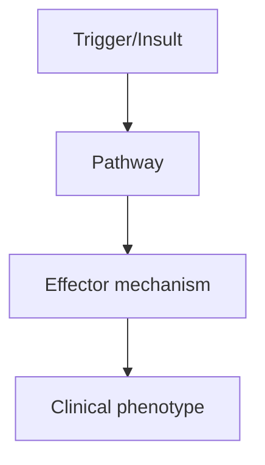
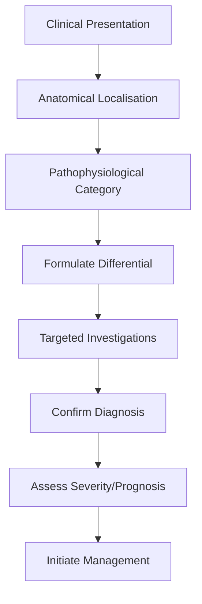
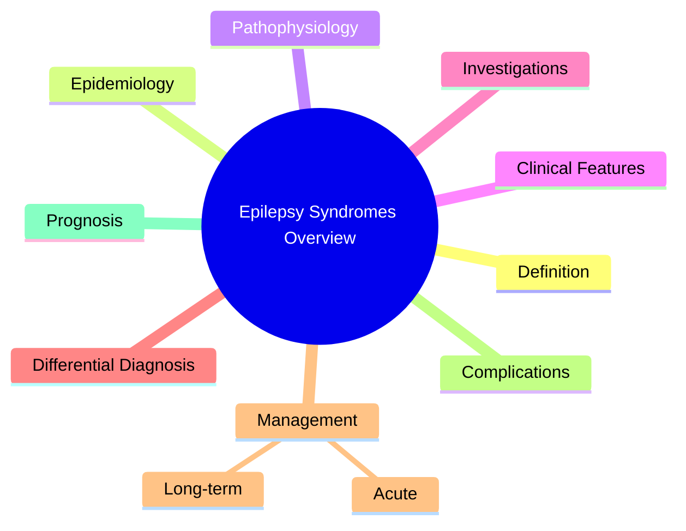

# Epilepsy Syndromes

> [!tip] **High-Yield Definition**
> Epilepsy syndromes: clusters of clinical features (age of onset, seizure types, EEG, prognosis, aetiology) that co-occur. ILAE 2017 classification: by age of onset (neonatal, infancy, childhood, adolescent-adult), aetiology (genetic, structural, metabolic, immune, infectious, unknown), and comorbidities.

---

## 1. Definition / Epidemiology / Classification

### Definition
Epilepsy syndromes: clusters of clinical features (age of onset, seizure types, EEG, prognosis, aetiology) that co-occur. ILAE 2017 classification: by age of onset (neonatal, infancy, childhood, adolescent-adult), aetiology (genetic, structural, metabolic, immune, infectious, unknown), and comorbidities.

### Epidemiology
Many epilepsy syndromes exist. Common: CAE, JAE, JME (IGE), BECTS (most common childhood epilepsy), temporal lobe epilepsy (TLE, most common adult). Rare: Dravet, LGS, Ohtahara, West.

### Classification
| Variant | Key Features | Prognosis |
|---------|-------------|-----------|
| | | |

---

## 2. Aetiology / Pathophysiology

### Aetiology
Genetic: channelopathies (SCN1A, SCN2A, KCNQ2, GABRG2), metabolic (GLUT1, pyridoxine-dependent), malformations (FCD, lissencephaly). Structural: mesial TLE, tumour, vascular. Immune: Rasmussen's, LGI1, anti-NMDA. Infectious: post-encephalitic.

### Pathophysiology

---

## 3. Clinical Features

### History
- **Onset/Duration:**
- **Progression:**
- **Key symptoms:**
- **Triggers:**
- **Systemic symptoms:**
- **Drug/Family/Social history:**

### Examination
| Domain | Key Findings | Localisation Value |
|--------|-------------|-------------------|
| | | |

### Specific Clinical Features
Neonatal: Ohtahara (burst suppression), benign familial neonatal epilepsy (KCNQ2). Infancy: West (infantile spasms, hypsarrhythmia, ACTH/VGB), Dravet (SCN1A, fever-triggered), Myoclonic epilepsy of infancy. Childhood: CAE (3Hz SW), BECTS (rolandic spikes, sleep-related focal seizures), Lennox-Gastaut (slow SW). Adolescent: JME (PSW, myoclonus on awakening), GTC on awakening. Adult: TLE, autosomal dominant lateral temporal epilepsy (LGI1).

---

## 4. Diagnostic Approach / Algorithm

---

## 5. Investigations

EEG (interictal + ictal), MRI brain (epilepsy protocol, look for lesions, hippocampal sclerosis, FCD), genetic testing (SCN1A, KCNQ2, etc.), metabolic screen if indicated.

---

## 6. Differential Diagnosis

| Differential | Distinguishing Features | Key Test |
|--------------|------------------------|----------|
| | | |

---

## 7. Management

Syndrome-specific ASM selection (e.g., ethosuximide for absence, avoid Na+ blockers in JME). Specific therapies: ketogenic diet (Dravet, LGS, GLUT1), ACTH/VGB (West), immunotherapy (immune-mediated). Surgical evaluation for focal lesional syndromes. VNS for refractory generalised. Lifestyle: trigger avoidance, sleep, OCP counselling.

---

## 8. Drug Interactions / Contraindications / Comorbidity Cautions

| Drug | Interaction / Caution | Management |
|------|----------------------|------------|
| | | |

---

## 9. Procedures (if applicable)

### Procedure:
- **Indications:**
- **Contraindications:**
- **Preparation / Principle:**
- **Complications:**
- **Viva Pearls:**

---

## 10. Complications

| Complication | Frequency | Prevention / Monitoring | Management |
|--------------|-----------|------------------------|------------|
| | | | |

---

## 11. Red Flags / Emergencies

Developmental regression (LGS, Dravet), refractory seizures, SUDEP risk, status epilepticus (Dravet).

---

## 12. Prognosis

BECTS: 95% remission by 16y. CAE: 60% remission. JME: lifelong treatment usually needed. TLE: 60% drug-resistant, surgical resection 60-80% seizure-free. LGS, Dravet: refractory, developmental disability.

---

## 13. Topic Correlation

| Related Topic | Link | Key Overlap |
|---------------|------|-------------|
| | | |

---

## 14. Special Situations

| Situation | Consideration |
|-----------|---------------|
| **Pregnancy** | |
| **Lactation** | |
| **Paediatric** | |
| **Elderly / Frail** | |
| **Renal impairment** | |
| **Hepatic impairment** | |
| **Immunocompromised** | |
| **Perioperative** | |
| **Driving / DVLA** | |
| **Occupational** | |

---

## FCPS/MRCP High-Yield Summary

| Category | Key Points |
|----------|------------|
| **Definition** | Epilepsy syndromes: clusters of clinical features (age of onset, seizure types, EEG, prognosis, aetiology) that co-occur. ILAE 2017 classification: by age of onset (neonatal, infancy, childhood, adole |
| **Epidemiology** | Many epilepsy syndromes exist. Common: CAE, JAE, JME (IGE), BECTS (most common childhood epilepsy), temporal lobe epilepsy (TLE, most common adult). R |
| **Pathophysiology** | |
| **Clinical** | Neonatal: Ohtahara (burst suppression), benign familial neonatal epilepsy (KCNQ2). Infancy: West (infantile spasms, hypsarrhythmia, ACTH/VGB), Dravet (SCN1A, fever-triggered), Myoclonic epilepsy of in |
| **Diagnosis** | |
| **Investigations** | EEG (interictal + ictal), MRI brain (epilepsy protocol, look for lesions, hippocampal sclerosis, FCD), genetic testing (SCN1A, KCNQ2, etc.), metabolic screen if indicated. |
| **Management** | Syndrome-specific ASM selection (e.g., ethosuximide for absence, avoid Na+ blockers in JME). Specific therapies: ketogenic diet (Dravet, LGS, GLUT1), ACTH/VGB (West), immunotherapy (immune-mediated).  |
| **Complications** | |
| **Prognosis** | BECTS: 95% remission by 16y. CAE: 60% remission. JME: lifelong treatment usually needed. TLE: 60% drug-resistant, surgical resection 60-80% seizure-free. LGS, Dravet: refractory, developmental disabil |
| **Viva Pearls** | |
| **Drug Doses** | |
| **Scoring Systems** | |
| **Genetics** | |
| **Imaging Signs** | |

---

## Viva Questions (PACES/FCPS Style)

1. **Q:** Define Epilepsy Syndromes and classify its variants.
   **A:** Based on the definition above.

2. **Q:** What are the key clinical features?
   **A:** Neonatal: Ohtahara (burst suppression), benign familial neonatal epilepsy (KCNQ2). Infancy: West (infantile spasms, hypsarrhythmia, ACTH/VGB), Dravet (SCN1A, fever-triggered), Myoclonic epilepsy of infancy. Childhood: CAE (3Hz SW), BECTS (rolandic spikes, sleep-related focal seizures), Lennox-Gastau

3. **Q:** What is the first-line treatment?
   **A:** Based on the management section.

4. **Q:** What are the red flags requiring urgent referral?
   **A:** Developmental regression (LGS, Dravet), refractory seizures, SUDEP risk, status epilepticus (Dravet).

5. **Q:** What is the prognosis?
   **A:** BECTS: 95% remission by 16y. CAE: 60% remission. JME: lifelong treatment usually needed. TLE: 60% drug-resistant, surgical resection 60-80% seizure-free. LGS, Dravet: refractory, developmental disability.

6. **Q:** How do you differentiate Epilepsy Syndromes from key differentials?
   **A:** Clinical features, investigations, and response to treatment.

7. **Q:** What investigations are most useful?
   **A:** Based on the investigations section.

8. **Q:** Describe the stepwise management approach.
   **A:** Based on the management algorithm.

9. **Q:** What are the emergency presentations?
   **A:** Based on the red flags section.

10. **Q:** How does management change in pregnancy/paediatrics/elderly?
    **A:** Special considerations per population.

---

## Common Confusions / Exam Traps

| Confusion | Clarification |
|-----------|---------------|
| | |

---

## Mnemonics
1. **CAE = Childhood Absence Epilepsy** — **C**hi**A**bs**E**nce: 4-10y, brief (<20s) absence, 3Hz spike-wave, 90% remit
1. **JAE = Juvenile Absence Epilepsy** — **J**uvenile: >10y, less frequent absences, often GTC, lifelong
1. **JME = Juvenile Myoclonic Epilepsy** — **J**uvenile **M**yoclonic: morning myoclonus + GTC + absence; lifelong

---

## Mind Map

---

## Spaced Repetition Trackers

| Review Interval | Date | Score (0-5) | Notes |
|-----------------|------|-------------|-------|
| Day 1 | | | |
| Day 3 | | | |
| Day 7 | | | |
| Day 14 | | | |
| Day 30 | | | |
| Day 90 | | | |

---

## Self-Test Scorecard

| Section | Score /5 | Last Attempt |
|---------|----------|--------------|
| Definition & Epidemiology | | |
| Pathophysiology | | |
| Clinical Features | | |
| Investigations | | |
| Differential Diagnosis | | |
| Management | | |
| Complications & Prognosis | | |
| Viva Questions | | |
| MCQs | | |
| SBAs | | |

---

## MCQs (10)

1. **Question:** Childhood absence epilepsy (CAE) features:
   **Options:** A. 4-10y, brief absence (<20s), 3Hz spike-wave, often remits B. Adult onset C. Myoclonus only D. Tonic-clonic only
   **Answer:** A
   **Explanation:** CAE: 4-10y, brief absence (10-20s), 3Hz generalised spike-wave, 60-70% remission by adolescence.

2. **Question:** CAE first-line treatment:
   **Options:** A. Ethosuximide (only absence) or valproate B. Carbamazepine (worsens absence) C. Phenytoin (worsens) D. Lamotrigine
   **Answer:** A
   **Explanation:** CAE: ethosuximide first-line (only absence, less cognitive effects). Valproate if GTC. AVOID Na+ blockers (worsen absence).

3. **Question:** Juvenile myoclonic epilepsy (JME) features:
   **Options:** A. Adolescence, morning myoclonus + GTC, 4-6Hz polyspike, lifelong B. Childhood absence C. Adult focal D. Pure GTC only
   **Answer:** A
   **Explanation:** JME: 12-18y, morning myoclonus (after awakening), GTC, 4-6Hz generalised polyspike-wave.

4. **Question:** JME first-line treatment:
   **Options:** A. Valproate (broad-spectrum) B. Ethosuximide (only absence, no GTC coverage) C. Carbamazepine (worsens) D. Phenytoin
   **Answer:** A
   **Explanation:** JME: valproate first-line. Alternatives: levetiracetam, lamotrigine, topiramate. AVOID Na+ blockers.

5. **Question:** JME treatment duration:
   **Options:** A. Lifelong (high relapse 90% on withdrawal) B. 1 year C. 2 years D. 5 years
   **Answer:** A
   **Explanation:** JME: lifelong ASM. Withdrawal leads to 90% relapse, especially with sleep deprivation.

6. **Question:** Benign epilepsy with centrotemporal spikes (BECTS):
   **Options:** A. Rolandic epilepsy: 3-13y, focal seizures with facial/mandibular involvement, often sleep, remits by 16y B. Adult onset C. Refractory D. Myoclonic
   **Answer:** A
   **Explanation:** BECTS (rolandic): 3-13y, focal motor (face, tongue, hand), often sleep, centrotemporal spikes, remits by 16y.

7. **Question:** BECTS treatment:
   **Options:** A. Often no treatment needed; ASM if frequent (carbamazepine, levetiracetam) B. Lifelong valproate C. Surgery D. VNS
   **Answer:** A
   **Explanation:** BECTS: usually no treatment. ASM if frequent (seizures cause problems). Often remits by 16y.

8. **Question:** Lennox-Gastaut syndrome onset:
   **Options:** A. 1-7 years (peak 3-5y) B. Neonatal C. Adult D. Adolescence
   **Answer:** A
   **Explanation:** LGS: onset 1-7y (peak 3-5y). Multiple seizure types, slow spike-wave, cognitive impairment.

9. **Question:** Progressive myoclonic epilepsies (PME) include:
   **Options:** A. Lafora, Unverricht-Lundborg, MERRF, sialidosis, neuronal ceroid lipofuscinosis B. JME C. CAE D. BECTS
   **Answer:** A
   **Explanation:** PME: Lafora (EPM2A), Unverricht-Lundborg (EPM1), MERRF (mitochondrial), sialidosis, NCL. Severe, progressive.

---

## SBA Questions (10)

1. **Scenario:** 10-year-old with absence seizures, 3Hz spike-wave on EEG. First-line?
   **Options:** A. Ethosuximide B. Carbamazepine C. Phenytoin D. Lamotrigine E. Vigabatrin
   **Answer:** A
   **Explanation:** CAE: ethosuximide first-line (only absence, no GTC). Valproate if GTC. AVOID Na+ blockers.

2. **Scenario:** 16-year-old with morning myoclonus + GTC. EEG: 4-6Hz polyspike. Diagnosis?
   **Options:** A. Juvenile myoclonic epilepsy (JME) B. CAE C. BECTS D. LGS E. West
   **Answer:** A
   **Explanation:** JME: morning myoclonus + GTC, 4-6Hz polyspike. First-line: valproate. Lifelong.

3. **Scenario:** 3-year-old with multiple seizure types, slow spike-wave, intellectual disability. Diagnosis?
   **Options:** A. Lennox-Gastaut syndrome (LGS) B. JME C. BECTS D. CAE E. West
   **Answer:** A
   **Explanation:** LGS: multiple seizure types (tonic, atonic, atypical absence, GTC), slow spike-wave <2.5Hz, cognitive impairment.

---

## Tags

**Tags:** #neurology #epilepsy #syndromes #CAE #JAE #JME #BECTS #LGS #FCPS #MRCP

---

## Local Navigation
**Heading Hub:** [[../Epilepsy Syndromes & Special Situations Hub]]
**Chapter Hierarchy:** [[../../Davidson Chapter 25 - Neurology Hierarchy]]
**Chapter MOC:** [[../../Neurology MOC]]
**Drug Reference:** [[../../00_Index/Neurology Drug Reference]]