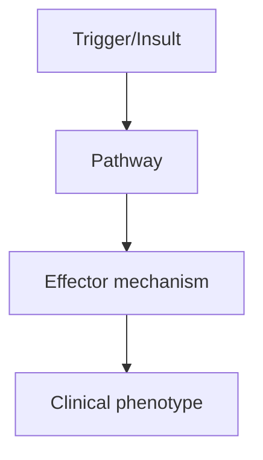
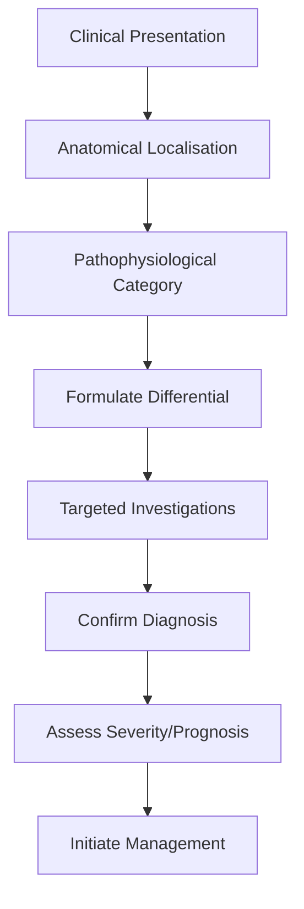
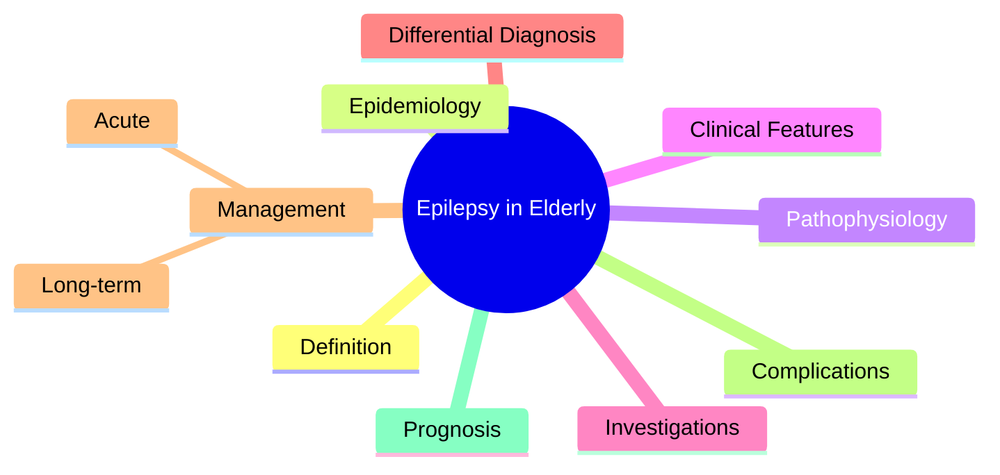

# Epilepsy in Elderly

> [!tip] **High-Yield Definition**
> Epilepsy with onset >60 years, OR existing epilepsy in elderly. Distinct from younger adults: aetiology, pharmacokinetics, comorbidities, polypharmacy, cognitive effects, falls, bone health.

---

## 1. Definition / Epidemiology / Classification

### Definition
Epilepsy with onset >60 years, OR existing epilepsy in elderly. Distinct from younger adults: aetiology, pharmacokinetics, comorbidities, polypharmacy, cognitive effects, falls, bone health.

### Epidemiology
Incidence highest in elderly (>60/100,000/year >60y vs <30/100,000 in 20-40y). Most common aetiologies: stroke (30-40%), neurodegenerative (Alzheimer's, Lewy body), tumour, trauma, vascular dementia. New onset in 25% >60y.

### Classification
| Variant | Key Features | Prognosis |
|---------|-------------|-----------|
| | | |

---

## 2. Aetiology / Pathophysiology

### Aetiology
Cerebrovascular disease (most common): ischaemic stroke, ICH, SAH, vascular dementia, CAA. Neurodegenerative: Alzheimer's, DLB, FTD. Tumour: primary, metastasis. Trauma: SDH (elderly abuse consideration). Metabolic: hyponatraemia, uraemia, hypoglycaemia. Drugs: antibiotics (fluoroquinolones, macrolides), tramadol, baclofen.

### Pathophysiology

---

## 3. Clinical Features

### History
- **Onset/Duration:**
- **Progression:**
- **Key symptoms:**
- **Triggers:**
- **Systemic symptoms:**
- **Drug/Family/Social history:**

### Examination
| Domain | Key Findings | Localisation Value |
|--------|-------------|-------------------|
| | | |

### Specific Clinical Features
Post-stroke seizures (5-10% of strokes, highest in ICH, cortical). Focal seizures more common than generalised. May present as confusion, falls, memory loss (post-ictal). Subtle presentations: episodic confusion, unusual behaviour. Increased risk of status epilepticus (especially NCSE). Higher SUDEP risk in elderly.

---

## 4. Diagnostic Approach / Algorithm

---

## 5. Investigations

MRI brain (stroke, tumour, neurodegenerative, SDH). EEG (may show generalised slowing, focal discharges). Prolonged EEG if NCSE suspected. Bloods: glucose, electrolytes, calcium, magnesium, LFTs, renal, FBC, coagulation. Drug levels. Exclude syncope, TIA, delirium, dementia, non-epileptic attack disorder.

---

## 6. Differential Diagnosis

| Differential | Distinguishing Features | Key Test |
|--------------|------------------------|----------|
| | | |

---

## 7. Management

ASM choice: levetiracetam, lamotrigine preferred (good tolerability, no enzyme induction, few interactions). AVOID: phenytoin (enzyme induction, toxicity, falls), carbamazepine (enzyme induction, hyponatraemia, cardiac), valproate (cognitive, tremor, weight). Start low, titrate slow ('start low, go slow'). Lower doses often effective. Monotherapy preferred. Drug interactions critical (warfarin, statins, many others). Bone health: vitamin D, calcium, DEXA. Falls prevention. Driving: DVLA regulations (1 year seizure-free, longer for provoked if risk factors).

---

## 8. Drug Interactions / Contraindications / Comorbidity Cautions

| Drug | Interaction / Caution | Management |
|------|----------------------|------------|
| | | |

---

## 9. Procedures (if applicable)

### Procedure:
- **Indications:**
- **Contraindications:**
- **Preparation / Principle:**
- **Complications:**
- **Viva Pearls:**

---

## 10. Complications

| Complication | Frequency | Prevention / Monitoring | Management |
|--------------|-----------|------------------------|------------|
| | | | |

---

## 11. Red Flags / Emergencies

New seizures in elderly often symptomatic (stroke, tumour, SDH, metabolic). Status epilepticus risk. Falls, fractures, SUDEP. Cognitive decline. Drug interactions.

---

## 12. Prognosis

Depends on cause. Post-stroke: 50-70% seizure control. Higher mortality than younger adults (comorbidities, status epilepticus). Maintain independence, prevent falls, manage bone health.

---

## 13. Topic Correlation

| Related Topic | Link | Key Overlap |
|---------------|------|-------------|
| | | |

---

## 14. Special Situations

| Situation | Consideration |
|-----------|---------------|
| **Pregnancy** | |
| **Lactation** | |
| **Paediatric** | |
| **Elderly / Frail** | |
| **Renal impairment** | |
| **Hepatic impairment** | |
| **Immunocompromised** | |
| **Perioperative** | |
| **Driving / DVLA** | |
| **Occupational** | |

---

## FCPS/MRCP High-Yield Summary

| Category | Key Points |
|----------|------------|
| **Definition** | Epilepsy with onset >60 years, OR existing epilepsy in elderly. Distinct from younger adults: aetiology, pharmacokinetics, comorbidities, polypharmacy, cognitive effects, falls, bone health. |
| **Epidemiology** | Incidence highest in elderly (>60/100,000/year >60y vs <30/100,000 in 20-40y). Most common aetiologies: stroke (30-40%), neurodegenerative (Alzheimer' |
| **Pathophysiology** | |
| **Clinical** | Post-stroke seizures (5-10% of strokes, highest in ICH, cortical). Focal seizures more common than generalised. May present as confusion, falls, memory loss (post-ictal). Subtle presentations: episodi |
| **Diagnosis** | |
| **Investigations** | MRI brain (stroke, tumour, neurodegenerative, SDH). EEG (may show generalised slowing, focal discharges). Prolonged EEG if NCSE suspected. Bloods: glucose, electrolytes, calcium, magnesium, LFTs, rena |
| **Management** | ASM choice: levetiracetam, lamotrigine preferred (good tolerability, no enzyme induction, few interactions). AVOID: phenytoin (enzyme induction, toxicity, falls), carbamazepine (enzyme induction, hypo |
| **Complications** | |
| **Prognosis** | Depends on cause. Post-stroke: 50-70% seizure control. Higher mortality than younger adults (comorbidities, status epilepticus). Maintain independence, prevent falls, manage bone health. |
| **Viva Pearls** | |
| **Drug Doses** | |
| **Scoring Systems** | |
| **Genetics** | |
| **Imaging Signs** | |

---

## Viva Questions (PACES/FCPS Style)

1. **Q:** Define Epilepsy in Elderly and classify its variants.
   **A:** Based on the definition above.

2. **Q:** What are the key clinical features?
   **A:** Post-stroke seizures (5-10% of strokes, highest in ICH, cortical). Focal seizures more common than generalised. May present as confusion, falls, memory loss (post-ictal). Subtle presentations: episodic confusion, unusual behaviour. Increased risk of status epilepticus (especially NCSE). Higher SUDEP

3. **Q:** What is the first-line treatment?
   **A:** Based on the management section.

4. **Q:** What are the red flags requiring urgent referral?
   **A:** New seizures in elderly often symptomatic (stroke, tumour, SDH, metabolic). Status epilepticus risk. Falls, fractures, SUDEP. Cognitive decline. Drug interactions.

5. **Q:** What is the prognosis?
   **A:** Depends on cause. Post-stroke: 50-70% seizure control. Higher mortality than younger adults (comorbidities, status epilepticus). Maintain independence, prevent falls, manage bone health.

6. **Q:** How do you differentiate Epilepsy in Elderly from key differentials?
   **A:** Clinical features, investigations, and response to treatment.

7. **Q:** What investigations are most useful?
   **A:** Based on the investigations section.

8. **Q:** Describe the stepwise management approach.
   **A:** Based on the management algorithm.

9. **Q:** What are the emergency presentations?
   **A:** Based on the red flags section.

10. **Q:** How does management change in pregnancy/paediatrics/elderly?
    **A:** Special considerations per population.

---

## Common Confusions / Exam Traps

| Confusion | Clarification |
|-----------|---------------|
| | |

---

## Mnemonics
1. **Elderly epilepsy = symptomatic** — Stroke (most common), degenerative, tumour, metabolic
1. **AVOID enzyme inducers** — Phenytoin, carbamazepine (P450 induction → drug interactions with warfarin, statins, OCP, etc.)
1. **PREFER levetiracetam, lamotrigine** — Better tolerated, fewer interactions, slow titration for lamotrigine

---

## Mind Map

---

## Spaced Repetition Trackers

| Review Interval | Date | Score (0-5) | Notes |
|-----------------|------|-------------|-------|
| Day 1 | | | |
| Day 3 | | | |
| Day 7 | | | |
| Day 14 | | | |
| Day 30 | | | |
| Day 90 | | | |

---

## Self-Test Scorecard

| Section | Score /5 | Last Attempt |
|---------|----------|--------------|
| Definition & Epidemiology | | |
| Pathophysiology | | |
| Clinical Features | | |
| Investigations | | |
| Differential Diagnosis | | |
| Management | | |
| Complications & Prognosis | | |
| Viva Questions | | |
| MCQs | | |
| SBAs | | |

---

## MCQs (10)

1. **Question:** Most common cause of new-onset epilepsy in elderly:
   **Options:** A. Stroke (ischaemic or haemorrhagic) B. Genetic C. Idiopathic D. Tumour
   **Answer:** A
   **Explanation:** Elderly: stroke is the most common cause of new-onset epilepsy (30-40%), then degenerative (Alzheimer's), tumour.

2. **Question:** Which ASM is preferred in elderly?
   **Options:** A. Levetiracetam or lamotrigine B. Phenytoin (P450 inducer) C. Carbamazepine (P450 inducer) D. Valproate (hepatotoxic)
   **Answer:** A
   **Explanation:** Elderly: prefer levetiracetam, lamotrigine (good tolerability, fewer interactions).

3. **Question:** Why avoid phenytoin in elderly?
   **Options:** A. P450 induction (warfarin, statins), falls risk, narrow therapeutic index B. Allergy C. Cost D. Taste
   **Answer:** A
   **Explanation:** Phenytoin: P450 induction (multiple drug interactions), narrow therapeutic index, falls, cognitive effects.

4. **Question:** Lamotrigine in elderly requires:
   **Options:** A. Slow titration to avoid Stevens-Johnson syndrome B. Fast titration C. Loading dose D. No monitoring
   **Answer:** A
   **Explanation:** Lamotrigine: slow titration (25mg/day × 2w, then 50mg/day × 2w, then ↑) reduces SJS risk.

5. **Question:** Falls risk in elderly epilepsy patients is increased by:
   **Options:** A. ASM side effects (sedation, ataxia, hyponatraemia from CBZ) + seizures B. Only seizures C. Only ASM D. Only age
   **Answer:** A
   **Explanation:** Falls: ASM side effects (sedation, ataxia, dizziness) + seizures + post-ictal. Major cause of injury/mortality.

6. **Question:** Elderly epilepsy prognosis:
   **Options:** A. Lower remission rate, higher recurrence, more cognitive/psychosocial impact B. Better than young C. Same as young D. Always remits
   **Answer:** A
   **Explanation:** Elderly: lower remission, higher recurrence, more cognitive impact, drug interactions, falls.

7. **Question:** Levetiracetam in elderly side effect:
   **Options:** A. Behavioural changes (irritability, depression) B. Osteoporosis C. Hair loss D. Weight gain
   **Answer:** A
   **Explanation:** Levetiracetam: psychiatric side effects (depression, irritability, psychosis). Watch in elderly with cognitive impairment.

8. **Question:** Carbamazepine in elderly concerns:
   **Options:** A. Hyponatraemia (SIADH), falls, P450 induction B. Hepatotoxicity C. Pancreatitis D. Renal failure
   **Answer:** A
   **Explanation:** Carbamazepine: SIADH (hyponatraemia), falls, P450 induction (multiple drug interactions).

---

## SBA Questions (10)

1. **Scenario:** 75-year-old new-onset seizure, MRI shows old infarct. Best ASM?
   **Options:** A. Levetiracetam (good tolerability, no interactions) B. Phenytoin C. Carbamazepine D. Valproate E. Phenobarbital
   **Answer:** A
   **Explanation:** Elderly + stroke: levetiracetam or lamotrigine. Avoid P450 inducers (multiple drug interactions with warfarin, statins).

2. **Scenario:** 80-year-old on carbamazepine, sodium 124, drowsy. Action?
   **Options:** A. Carbamazepine-induced SIADH; reduce dose or switch B. Increase dose C. Add demeclocycline D. Restrict fluids only E. Ignore
   **Answer:** A
   **Explanation:** Carbamazepine causes SIADH. Sodium monitoring. Reduce dose or switch to non-SIADH ASM.

3. **Scenario:** Elderly patient on phenytoin, multiple falls. Best action?
   **Options:** A. Switch to levetiracetam (less sedation, fewer interactions) B. Increase phenytoin C. Add another ASM D. Restrict activity E. Wheelchair
   **Answer:** A
   **Explanation:** Phenytoin: sedation, ataxia, falls. Switch to levetiracetam or lamotrigine in elderly.

---

## Tags

**Tags:** #neurology #epilepsy #elderly #ASM #polypharmacy #falls #levetiracetam #FCPS #MRCP

---

## Local Navigation
**Heading Hub:** [[../Epilepsy Syndromes & Special Situations Hub]]
**Chapter Hierarchy:** [[../../Davidson Chapter 25 - Neurology Hierarchy]]
**Chapter MOC:** [[../../Neurology MOC]]
**Drug Reference:** [[../../00_Index/Neurology Drug Reference]]