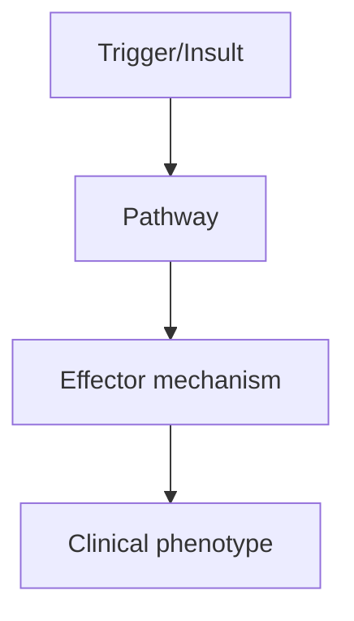
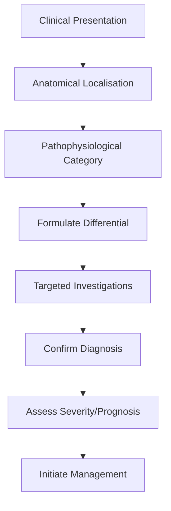
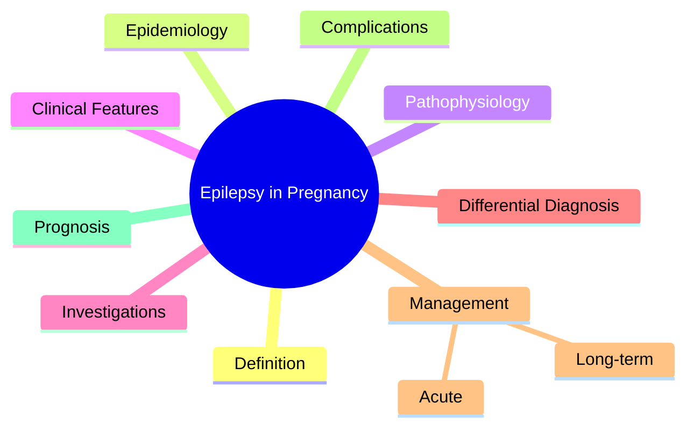

# Epilepsy in Pregnancy

> [!tip] **High-Yield Definition**
> Management of epilepsy in women of childbearing age, during pregnancy, postpartum, and breastfeeding. Special considerations: teratogenicity, ASM pharmacokinetic changes, seizure control, folate, vitamin K, breastfeeding safety.

---

## 1. Definition / Epidemiology / Classification

### Definition
Management of epilepsy in women of childbearing age, during pregnancy, postpartum, and breastfeeding. Special considerations: teratogenicity, ASM pharmacokinetic changes, seizure control, folate, vitamin K, breastfeeding safety.

### Epidemiology
0.5-1% of pregnant women have epilepsy. 30-40% have increased seizures in pregnancy (hormonal, sleep deprivation, pharmacokinetic changes, compliance). 1 in 250 newborns exposed to ASMs has major malformation (vs 1-2% baseline).

### Classification
| Variant | Key Features | Prognosis |
|---------|-------------|-----------|
| | | |

---

## 2. Aetiology / Pathophysiology

### Aetiology
N/A. Management considerations.

### Pathophysiology

---

## 3. Clinical Features

### History
- **Onset/Duration:**
- **Progression:**
- **Key symptoms:**
- **Triggers:**
- **Systemic symptoms:**
- **Drug/Family/Social history:**

### Examination
| Domain | Key Findings | Localisation Value |
|--------|-------------|-------------------|
| | | |

### Specific Clinical Features
Pre-conception counselling: ASM choice, folate 5mg/day (high dose), seizure control (>1 year seizure-free if possible). During pregnancy: ASMs cross placenta, teratogenicity varies (VPA highest, LTG/LEV lower). Pharmacokinetic changes: LTG clearance increases 50% (need to increase dose, monitor levels). Increased seizure risk in 1st and 3rd trimesters. Vitamin K 10-20mg/day in 3rd trimester (enzyme-inducing ASMs increase neonatal bleeding). Labour: continue ASMs, consider vitamin K for baby. Postpartum: return to pre-pregnancy doses (LTG), breastfeeding safe with most ASMs (avoid ethosuximide, high-dose barbiturates, benzodiazepines).

---

## 4. Diagnostic Approach / Algorithm

---

## 5. Investigations

ASM levels (especially LTG) - increase dose if falling levels + symptoms. Ultrasound anomaly scan (20-22 weeks). Detailed anatomy scan. Foetal monitoring. NEAD (Neurodevelopmental Effects of Antiepileptic Drugs) study: valproate worst, carbamazepine moderate, LTG/LEV best cognitive outcomes.

---

## 6. Differential Diagnosis

| Differential | Distinguishing Features | Key Test |
|--------------|------------------------|----------|
| | | |

---

## 7. Management

Pre-conception: switch to safest ASM (LEV, LTG) if possible, optimise control, folate 5mg. AVOID valproate in women of childbearing potential (MHRA 2018, Pregnancy Prevention Programme required unless no alternative). During pregnancy: continue ASM (seizure risk > teratogenic risk for most), increase LTG dose as needed, monitor levels, serial growth scans. Vitamin K1 10-20mg/day in 3rd trimester. Postpartum: return to pre-pregnancy dose, monitor, breastfeeding encouraged (most ASMs safe). Contraception: enzyme-inducing ASMs (CBZ, PHT, PB) reduce OCP efficacy; use higher dose, progestogen-only, or non-hormonal.

---

## 8. Drug Interactions / Contraindications / Comorbidity Cautions

| Drug | Interaction / Caution | Management |
|------|----------------------|------------|
| | | |

---

## 9. Procedures (if applicable)

### Procedure:
- **Indications:**
- **Contraindications:**
- **Preparation / Principle:**
- **Complications:**
- **Viva Pearls:**

---

## 10. Complications

| Complication | Frequency | Prevention / Monitoring | Management |
|--------------|-----------|------------------------|------------|
| | | | |

---

## 11. Red Flags / Emergencies

Valproate (neural tube defects 1-2%, IQ reduction, autism spectrum). Topiramate (cleft lip/palate). Phenytoin (fetal hydantoin syndrome). Carbamazepine (neural tube defects). Sudden ASM withdrawal (status epilepticus, SUDEP).

---

## 12. Prognosis

Most women have successful pregnancies. 90% have good outcomes. Major malformation risk: 1-2% baseline, 2-3% LTG/LEV, 6-7% VPA (dose-dependent). Pre-conception planning critical.

---

## 13. Topic Correlation

| Related Topic | Link | Key Overlap |
|---------------|------|-------------|
| | | |

---

## 14. Special Situations

| Situation | Consideration |
|-----------|---------------|
| **Pregnancy** | |
| **Lactation** | |
| **Paediatric** | |
| **Elderly / Frail** | |
| **Renal impairment** | |
| **Hepatic impairment** | |
| **Immunocompromised** | |
| **Perioperative** | |
| **Driving / DVLA** | |
| **Occupational** | |

---

## FCPS/MRCP High-Yield Summary

| Category | Key Points |
|----------|------------|
| **Definition** | Management of epilepsy in women of childbearing age, during pregnancy, postpartum, and breastfeeding. Special considerations: teratogenicity, ASM pharmacokinetic changes, seizure control, folate, vita |
| **Epidemiology** | 0.5-1% of pregnant women have epilepsy. 30-40% have increased seizures in pregnancy (hormonal, sleep deprivation, pharmacokinetic changes, compliance) |
| **Pathophysiology** | |
| **Clinical** | Pre-conception counselling: ASM choice, folate 5mg/day (high dose), seizure control (>1 year seizure-free if possible). During pregnancy: ASMs cross placenta, teratogenicity varies (VPA highest, LTG/L |
| **Diagnosis** | |
| **Investigations** | ASM levels (especially LTG) - increase dose if falling levels + symptoms. Ultrasound anomaly scan (20-22 weeks). Detailed anatomy scan. Foetal monitoring. NEAD (Neurodevelopmental Effects of Antiepile |
| **Management** | Pre-conception: switch to safest ASM (LEV, LTG) if possible, optimise control, folate 5mg. AVOID valproate in women of childbearing potential (MHRA 2018, Pregnancy Prevention Programme required unless |
| **Complications** | |
| **Prognosis** | Most women have successful pregnancies. 90% have good outcomes. Major malformation risk: 1-2% baseline, 2-3% LTG/LEV, 6-7% VPA (dose-dependent). Pre-conception planning critical. |
| **Viva Pearls** | |
| **Drug Doses** | |
| **Scoring Systems** | |
| **Genetics** | |
| **Imaging Signs** | |

---

## Viva Questions (PACES/FCPS Style)

1. **Q:** Define Epilepsy in Pregnancy and classify its variants.
   **A:** Based on the definition above.

2. **Q:** What are the key clinical features?
   **A:** Pre-conception counselling: ASM choice, folate 5mg/day (high dose), seizure control (>1 year seizure-free if possible). During pregnancy: ASMs cross placenta, teratogenicity varies (VPA highest, LTG/LEV lower). Pharmacokinetic changes: LTG clearance increases 50% (need to increase dose, monitor leve

3. **Q:** What is the first-line treatment?
   **A:** Based on the management section.

4. **Q:** What are the red flags requiring urgent referral?
   **A:** Valproate (neural tube defects 1-2%, IQ reduction, autism spectrum). Topiramate (cleft lip/palate). Phenytoin (fetal hydantoin syndrome). Carbamazepine (neural tube defects). Sudden ASM withdrawal (status epilepticus, SUDEP).

5. **Q:** What is the prognosis?
   **A:** Most women have successful pregnancies. 90% have good outcomes. Major malformation risk: 1-2% baseline, 2-3% LTG/LEV, 6-7% VPA (dose-dependent). Pre-conception planning critical.

6. **Q:** How do you differentiate Epilepsy in Pregnancy from key differentials?
   **A:** Clinical features, investigations, and response to treatment.

7. **Q:** What investigations are most useful?
   **A:** Based on the investigations section.

8. **Q:** Describe the stepwise management approach.
   **A:** Based on the management algorithm.

9. **Q:** What are the emergency presentations?
   **A:** Based on the red flags section.

10. **Q:** How does management change in pregnancy/paediatrics/elderly?
    **A:** Special considerations per population.

---

## Common Confusions / Exam Traps

| Confusion | Clarification |
|-----------|---------------|
| | |

---

## Mnemonics
1. **PRE-CONCEPTION** — Switch from valproate to safer ASM, folic acid 5mg
1. **SAFE ASMs in pregnancy** — Lamotrigine, levetiracetam (most data)
1. **AVOID valproate, polytherapy** — Valproate: NTD 1-2%, lowest IQ; polytherapy: more teratogenicity

---

## Mind Map

---

## Spaced Repetition Trackers

| Review Interval | Date | Score (0-5) | Notes |
|-----------------|------|-------------|-------|
| Day 1 | | | |
| Day 3 | | | |
| Day 7 | | | |
| Day 14 | | | |
| Day 30 | | | |
| Day 90 | | | |

---

## Self-Test Scorecard

| Section | Score /5 | Last Attempt |
|---------|----------|--------------|
| Definition & Epidemiology | | |
| Pathophysiology | | |
| Clinical Features | | |
| Investigations | | |
| Differential Diagnosis | | |
| Management | | |
| Complications & Prognosis | | |
| Viva Questions | | |
| MCQs | | |
| SBAs | | |

---

## MCQs (10)

1. **Question:** ASM with highest teratogenic risk:
   **Options:** A. Valproate (NTD 1-2%, lowest IQ, autism risk) B. Lamotrigine C. Levetiracetam D. Carbamazepine
   **Answer:** A
   **Explanation:** Valproate: NTD 1-2%, facial abnormalities, cognitive impairment, autism spectrum. Highest risk.

2. **Question:** ASM with lowest teratogenic risk:
   **Options:** A. Lamotrigine and levetiracetam (most data, safest) B. Valproate C. Phenytoin D. Phenobarbital
   **Answer:** A
   **Explanation:** Lamotrigine and levetiracetam: lowest teratogenic risk. NTD <1%. Cognitive outcomes better.

3. **Question:** Folic acid dose in pregnant women with epilepsy:
   **Options:** A. 5 mg/day (high dose; standard 400 mcg insufficient) B. 400 mcg/day (standard) C. 1 mg/day D. No folate
   **Answer:** A
   **Explanation:** High-dose folic acid 5mg/day in women on ASMs (standard 400 mcg insufficient due to ASM folate antagonism).

4. **Question:** Best management of epilepsy in pregnancy:
   **Options:** A. Pre-conception switch to lamotrigine/levetiracetam, folic acid 5mg, monitor levels B. Continue current ASM C. Stop ASM D. Switch to valproate
   **Answer:** A
   **Explanation:** Pre-conception: switch to safer ASM (lamotrigine/levetiracetam). Folic acid 5mg. Monitor levels (LAM ↓ in pregnancy).

5. **Question:** Lamotrigine in pregnancy requires:
   **Options:** A. Increased dose (clearance ↑ in pregnancy, levels fall) B. Decreased dose C. Same dose D. Stop ASM
   **Answer:** A
   **Explanation:** Lamotrigine clearance increases 2-3 fold in pregnancy → levels fall → breakthrough seizures. Monitor levels, increase dose.

6. **Question:** Seizure risk in pregnancy if ASM compliant:
   **Options:** A. 5-10% breakthrough (similar to non-pregnant) B. 100% C. 50% D. 0%
   **Answer:** A
   **Explanation:** If compliant: most maintain seizure control. Risk: ASM levels fall (LAM, LEV), sleep deprivation, hyperemesis (missed doses).

7. **Question:** Vitamin K supplementation in pregnancy on enzyme-inducing ASMs:
   **Options:** A. Oral vitamin K1 10-20 mg/day in last month (prevent neonatal haemorrhage) B. No vitamin K C. Vitamin D only D. Calcium only
   **Answer:** A
   **Explanation:** Enzyme-inducing ASMs (PHT, CBZ, PB) → vitamin K deficiency → neonatal haemorrhage. Vitamin K1 10-20 mg/day in last month.

8. **Question:** Breastfeeding on ASMs:
   **Options:** A. Generally safe; monitor infant (sedation with barbiturates, benzodiazepines) B. Always contraindicated C. Always safe D. Only with levetiracetam
   **Answer:** A
   **Explanation:** Breastfeeding generally safe. LAM, LEV low in breast milk. Barbiturates, benzodiazepines: monitor infant for sedation.

---

## SBA Questions (10)

1. **Scenario:** Woman on valproate planning pregnancy. Counselling?
   **Options:** A. Switch to lamotrigine/levetiracetam BEFORE conception; folic acid 5mg B. Continue valproate C. Stop all ASMs D. Switch to carbamazepine E. Half dose
   **Answer:** A
   **Explanation:** Valproate: highest teratogenicity (NTD 1-2%, cognitive impairment, autism). Switch to LAM/LEV before conception.

2. **Scenario:** 26 weeks pregnant, on lamotrigine, breakthrough GTC. Cause?
   **Options:** A. Lamotrigine clearance ↑ in pregnancy; check level, increase dose B. Not taking medication C. New epilepsy type D. Eclampsia E. Stroke
   **Answer:** A
   **Explanation:** Lamotrigine clearance ↑ 2-3 fold in pregnancy → levels fall → breakthrough. Check level, increase dose.

3. **Scenario:** Pregnant woman on phenytoin. Newborn prophylaxis?
   **Options:** A. Vitamin K1 1 mg IM at birth (prevent haemorrhage) B. No prophylaxis C. Vitamin D only D. Calcium only E. Iron only
   **Answer:** A
   **Explanation:** Enzyme-inducing ASMs (PHT, CBZ) → neonatal vitamin K deficiency → haemorrhage. Vitamin K1 1 mg IM at birth.

---

## Tags

**Tags:** #neurology #epilepsy #pregnancy #valproate #teratogenicity #folic-acid #lamotrigine #FCPS #MRCP

---

## Local Navigation
**Heading Hub:** [[../Epilepsy Syndromes & Special Situations Hub]]
**Chapter Hierarchy:** [[../../Davidson Chapter 25 - Neurology Hierarchy]]
**Chapter MOC:** [[../../Neurology MOC]]
**Drug Reference:** [[../../00_Index/Neurology Drug Reference]]