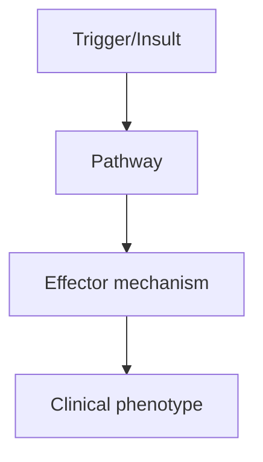
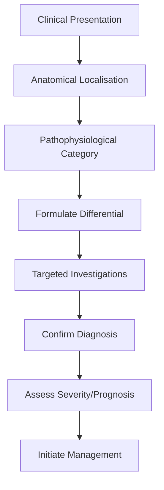

# Acute Disseminated Encephalomyelitis

> [!tip] **High-Yield Definition**
> ADEM: monophasic, immune-mediated demyelinating disorder of CNS, typically post-infectious or post-vaccination. Predominantly children. Encephalopathy + multifocal neurological deficits.

---

## 1. Definition / Epidemiology / Classification

### Definition
ADEM: monophasic, immune-mediated demyelinating disorder of CNS, typically post-infectious or post-vaccination. Predominantly children. Encephalopathy + multifocal neurological deficits.

### Epidemiology
Incidence: 0.3-0.5/100,000/year. Children > adults. Male:female 1.5:1. Preceded by infection (50-75%) or vaccination (5%).

### Classification
| Variant | Key Features | Prognosis |
|---------|-------------|-----------|
| | | |

---

## 2. Aetiology / Pathophysiology

### Aetiology
Post-infectious (50-75%): viral (HSV, EBV, CMV, VZV, influenza, measles, mumps, rubella, hepatitis A/B), bacterial (Mycoplasma, Borrelia, Campylobacter), other. Post-vaccination (5%): rabies, smallpox, influenza, MMR, hepatitis B. Autoimmune: anti-MOG antibodies (MOGAD - some cases of recurrent ADEM, multiphasic ADEM).

### Pathophysiology


---

## 3. Clinical Features

### History
- **Onset/Duration:**
- **Progression:**
- **Key symptoms:**
- **Triggers:**
- **Systemic symptoms:**
- **Drug/Family/Social history:**

### Examination
| Domain | Key Findings | Localisation Value |
|--------|-------------|-------------------|
| | | |

### Specific Clinical Features
Encephalopathy: altered mental status, behavioural change, confusion, seizures (focal or generalised). Multifocal neurological deficits: motor (hemiparesis, paraparesis), sensory, brainstem (cranial nerves, ataxia), cerebellar, visual (optic neuritis, often bilateral), spinal (myelitis). Typically multifocal. Prodrome: fever, headache, malaise, myalgia. Time from trigger: 1-3 weeks.

---

## 4. Diagnostic Approach / Algorithm



---

## 5. Investigations

MRI brain + spine with gadolinium: multifocal, bilateral, large (>1-2cm) lesions, asymmetric, subcortical white matter, deep grey matter (thalamus, basal ganglia, brainstem, cerebellum), ALL lesions enhance (monophasic), no new lesions at 3 months. CSF: pleocytosis (lymphocytic), elevated protein, OCBs (transient, <30%), MOG-IgG (positive in 30-50% - MOGAD). EEG: generalised slowing, epileptiform. Bloods: inflammatory markers, infection screen, anti-MOG, anti-AQP4. Brain biopsy (rare): perivenous demyelination.

---

## 6. Differential Diagnosis

| Differential | Distinguishing Features | Key Test |
|--------------|------------------------|----------|
| | | |

---

## 7. Management

First-line: IV methylprednisolone 1g/day ×3-5 days (or 30mg/kg/day paediatric max 1g). Second-line: IVIG 2g/kg over 2-5 days (especially children, steroid-resistant). Third-line: plasma exchange (5 exchanges over 7-10 days, severe/refractory). Supportive: ICU monitoring, antiepileptics if seizures, DVT prophylaxis, hydration. Recovery: gradual over weeks-months. Rehabilitation: physiotherapy, OT, speech. Long-term: no DMT unless multiphasic (multiphasic ADEM - 10%, MOGAD testing).

---

## 8. Drug Interactions / Contraindications / Comorbidity Cautions

| Drug | Interaction / Caution | Management |
|------|----------------------|------------|
| | | |

---

## 9. Procedures (if applicable)

### Procedure:
- **Indications:**
- **Contraindications:**
- **Preparation / Principle:**
- **Complications:**
- **Viva Pearls:**

---

## 10. Complications

| Complication | Frequency | Prevention / Monitoring | Management |
|--------------|-----------|------------------------|------------|
| | | | |

---

## 11. Red Flags / Emergencies

Raised ICP, herniation, status epilepticus, autonomic dysfunction, respiratory failure. Multiphasic ADEM: MOG testing, consider MOGAD. ADEM-optic neuritis: MOG testing.

---

## 12. Prognosis

Generally good, monophasic, full or near-full recovery. 70% complete recovery. Mortality <5% (modern supportive care). 10% multiphasic ADEM (consider MOGAD). Residual deficits in 20-30% (motor, cognitive, behavioural, epilepsy). ADEM with anti-MOG: more likely multiphasic, MOGAD spectrum.

---

## 13. Topic Correlation

| Related Topic | Link | Key Overlap |
|---------------|------|-------------|
| | | |

---

## 14. Special Situations

| Situation | Consideration |
|-----------|---------------|
| **Pregnancy** | |
| **Lactation** | |
| **Paediatric** | |
| **Elderly / Frail** | |
| **Renal impairment** | |
| **Hepatic impairment** | |
| **Immunocompromised** | |
| **Perioperative** | |
| **Driving / DVLA** | |
| **Occupational** | |

---

## FCPS/MRCP High-Yield Summary

| Category | Key Points |
|----------|------------|
| **Definition** | ADEM: monophasic, immune-mediated demyelinating disorder of CNS, typically post-infectious or post-vaccination. Predominantly children. Encephalopathy + multifocal neurological deficits. |
| **Epidemiology** | Incidence: 0.3-0.5/100,000/year. Children > adults. Male:female 1.5:1. Preceded by infection (50-75%) or vaccination (5%). |
| **Pathophysiology** | |
| **Clinical** | Encephalopathy: altered mental status, behavioural change, confusion, seizures (focal or generalised). Multifocal neurological deficits: motor (hemiparesis, paraparesis), sensory, brainstem (cranial n |
| **Diagnosis** | |
| **Investigations** | MRI brain + spine with gadolinium: multifocal, bilateral, large (>1-2cm) lesions, asymmetric, subcortical white matter, deep grey matter (thalamus, basal ganglia, brainstem, cerebellum), ALL lesions e |
| **Management** | First-line: IV methylprednisolone 1g/day ×3-5 days (or 30mg/kg/day paediatric max 1g). Second-line: IVIG 2g/kg over 2-5 days (especially children, steroid-resistant). Third-line: plasma exchange (5 ex |
| **Complications** | |
| **Prognosis** | Generally good, monophasic, full or near-full recovery. 70% complete recovery. Mortality <5% (modern supportive care). 10% multiphasic ADEM (consider MOGAD). Residual deficits in 20-30% (motor, cognit |
| **Viva Pearls** | |
| **Drug Doses** | |
| **Scoring Systems** | |
| **Genetics** | |
| **Imaging Signs** | |

---

## Viva Questions (PACES/FCPS Style)

1. **Q:** Define Acute Disseminated Encephalomyelitis and classify its variants.
   **A:** Based on the definition above.

2. **Q:** What are the key clinical features?
   **A:** Encephalopathy: altered mental status, behavioural change, confusion, seizures (focal or generalised). Multifocal neurological deficits: motor (hemiparesis, paraparesis), sensory, brainstem (cranial nerves, ataxia), cerebellar, visual (optic neuritis, often bilateral), spinal (myelitis). Typically m

3. **Q:** What is the first-line treatment?
   **A:** Based on the management section.

4. **Q:** What are the red flags requiring urgent referral?
   **A:** Raised ICP, herniation, status epilepticus, autonomic dysfunction, respiratory failure. Multiphasic ADEM: MOG testing, consider MOGAD. ADEM-optic neuritis: MOG testing.

5. **Q:** What is the prognosis?
   **A:** Generally good, monophasic, full or near-full recovery. 70% complete recovery. Mortality <5% (modern supportive care). 10% multiphasic ADEM (consider MOGAD). Residual deficits in 20-30% (motor, cognitive, behavioural, epilepsy). ADEM with anti-MOG: more likely multiphasic, MOGAD spectrum.

6. **Q:** How do you differentiate Acute Disseminated Encephalomyelitis from key differentials?
   **A:** Clinical features, investigations, and response to treatment.

7. **Q:** What investigations are most useful?
   **A:** Based on the investigations section.

8. **Q:** Describe the stepwise management approach.
   **A:** Based on the management algorithm.

9. **Q:** What are the emergency presentations?
   **A:** Based on the red flags section.

10. **Q:** How does management change in pregnancy/paediatrics/elderly?
    **A:** Special considerations per population.

---

## Common Confusions / Exam Traps

| Confusion | Clarification |
|-----------|---------------|
| | |

---

## Mnemonics
1. **ADEM = MONOPHASIC, post-infectious/post-vaccination** — Children > adults, demyelinating, days-weeks after trigger
1. **MRI ADEM = bilateral, asymmetric, large white matter lesions** — Deep grey matter (thalamus, basal ganglia) involvement
1. **TREATMENT** — IV methylprednisolone 1g/day × 3-5d, then oral taper; IVIG/plasma exchange if refractory

---

## Mind Map

```mermaid
mindmap
  root((Acute Disseminated Encephalomyelitis (ADEM)))
    Definition
    Epidemiology
    Pathophysiology
    Clinical Features
    Investigations
    Differential Diagnosis
    Management
      Acute
      Long-term
    Complications
    Prognosis
```

---

## Spaced Repetition Trackers

| Review Interval | Date | Score (0-5) | Notes |
|-----------------|------|-------------|-------|
| Day 1 | | | |
| Day 3 | | | |
| Day 7 | | | |
| Day 14 | | | |
| Day 30 | | | |
| Day 90 | | | |

---

## Self-Test Scorecard

| Section | Score /5 | Last Attempt |
|---------|----------|--------------|
| Definition & Epidemiology | | |
| Pathophysiology | | |
| Clinical Features | | |
| Investigations | | |
| Differential Diagnosis | | |
| Management | | |
| Complications & Prognosis | | |
| Viva Questions | | |
| MCQs | | |
| SBAs | | |

---

## MCQs (10)

1. **Question:** ADEM typical age group:
   **Options:** A. Children (peak 5-8y) B. Adults only C. Elderly D. Neonates
   **Answer:** A
   **Explanation:** ADEM: children (peak 5-8y) more common than adults. Post-infectious/post-vaccination.

2. **Question:** ADEM onset timing:
   **Options:** A. Days to weeks after infection/vaccination B. Years later C. At birth D. In utero
   **Answer:** A
   **Explanation:** ADEM: 1-3 weeks after trigger (viral infection, vaccination, rarely after trauma).

3. **Question:** ADEM MRI features:
   **Options:** A. Bilateral, asymmetric, large white matter lesions + deep grey matter (thalamus) B. Single lesion C. Only spinal cord D. Periventricular only
   **Answer:** A
   **Explanation:** ADEM: bilateral, asymmetric, large (>1-2cm) white matter lesions. Deep grey matter (thalamus, basal ganglia) common.

4. **Question:** ADEM CSF:
   **Options:** A. Lymphocytic pleocytosis, OCB rare (vs MS) B. Polymorphonuclear C. Normal D. High protein only
   **Answer:** A
   **Explanation:** ADEM: lymphocytic pleocytosis, mild ↑protein, OCB rare (transient in 0-30%). MS: OCB in >90%.

5. **Question:** ADEM vs MS - which is monophasic:
   **Options:** A. ADEM (single episode) B. MS (relapsing) C. Both D. Neither
   **Answer:** A
   **Explanation:** ADEM: monophasic. MS: relapsing-remitting typically. New symptoms >3 months after ADEM = multiphasic ADEM or MS.

6. **Question:** ADEM treatment first-line:
   **Options:** A. IV methylprednisolone 1g/day × 3-5d (1-2mg/kg/d in children) B. IVIG only C. Plasma exchange D. No treatment
   **Answer:** A
   **Explanation:** ADEM: IV methylprednisolone 1g/day × 3-5d (or 20-30mg/kg/day in children), then oral taper over 4-6 weeks.

7. **Question:** ADEM prognosis:
   **Options:** A. Mostly good recovery (70% complete, 20% mild deficit, 10% severe) B. Always poor C. Always relapses as MS D. Mortality 50%
   **Answer:** A
   **Explanation:** ADEM: 70% complete recovery, 20% mild deficit, 10% severe. Lower mortality with modern treatment.

8. **Question:** ADEM triggers include:
   **Options:** A. Viral infections (measles, varicella, EBV, COVID), vaccines (rare) B. Diet C. Stress only D. Allergy
   **Answer:** A
   **Explanation:** ADEM triggers: viral (measles, varicella, EBV, influenza, COVID), post-vaccination (rare, debated), M. pneumoniae.

---

## SBA Questions (10)

1. **Scenario:** 8-year-old, 2 weeks after viral URTI, now encephalopathy, focal deficits, ataxia. MRI: bilateral asymmetric white matter + thalamic lesions. Diagnosis?
   **Options:** A. ADEM B. MS C. NMOSD D. MOGAD E. Viral encephalitis
   **Answer:** A
   **Explanation:** ADEM: post-infectious (1-3 weeks), encephalopathy, focal deficits, MRI bilateral asymmetric + deep grey matter.

2. **Scenario:** ADEM not responding to IV methylprednisolone. Next step?
   **Options:** A. IVIG 2g/kg over 2-5 days OR plasma exchange B. More steroids C. Surgery D. No further treatment E. Add methotrexate
   **Answer:** A
   **Explanation:** Refractory ADEM: IVIG 2g/kg over 2-5d OR plasma exchange (5-7 exchanges every other day).

3. **Scenario:** Child with ADEM history, new symptoms 6 months later. Differential?
   **Options:** A. Multiphasic ADEM or new MS/NMOSD/MOGAD - re-investigate B. ADEM recurrence (impossible) C. Stroke D. Tumour E. Meningitis
   **Answer:** A
   **Explanation:** New symptoms >3 months: multiphasic ADEM (rare) OR more likely new demyelinating disease (MS, NMOSD, MOGAD). Re-MRI, anti-MOG/AQP4, OCB.

---

## Tags

**Tags:** #neurology #demyelinating #ADEM #pediatric #post-infectious #methylprednisolone #FCPS #MRCP

---

## Local Navigation
**Heading Hub:** [[../Multiple Sclerosis Hub]]
**Chapter Hierarchy:** [[../../Davidson Chapter 25 - Neurology Hierarchy]]
**Chapter MOC:** [[../../Neurology MOC]]
**Drug Reference:** [[../../00_Index/Neurology Drug Reference]]