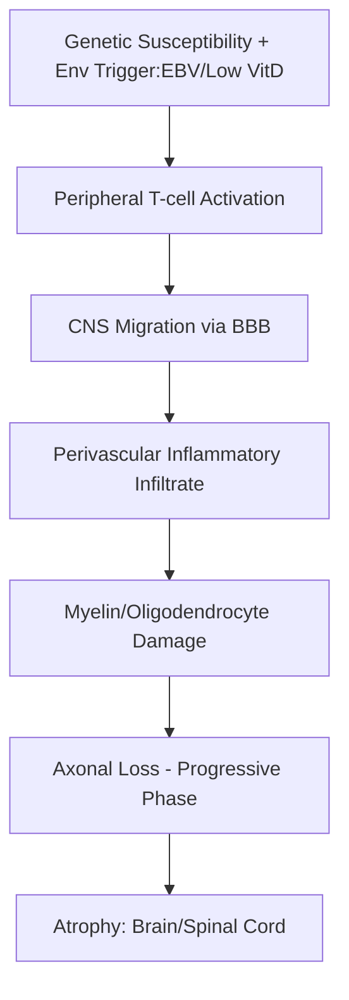
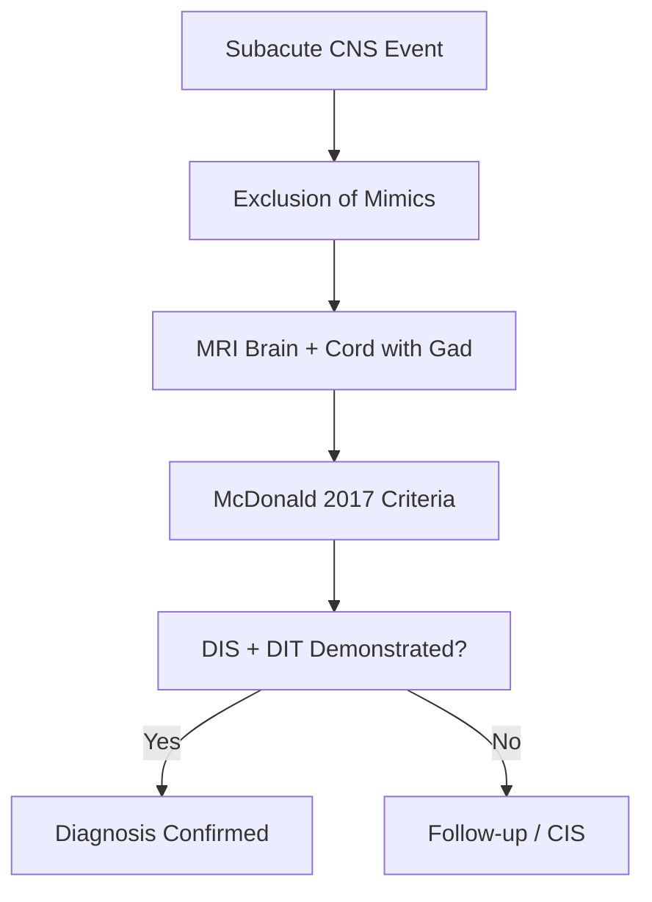
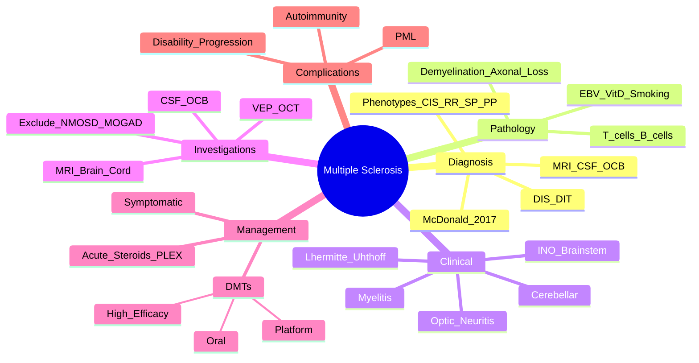

# Multiple Sclerosis

> [!tip] **MS = Young adult (20-40y), F:M=3:1, relapsing CNS demyelination separated in TIME and SPACE**
> **McDonald 2017** allows diagnosis after a **single clinical event** if MRI demonstrates **DIS + DIT**.

## 1. Definition / Epidemiology / Classification

### Definition
Chronic immune-mediated inflammatory demyelinating disease of the CNS characterised by relapses and remissions (initially), with axonal loss driving progressive disability.

### Epidemiology
- **Prevalence:** 50-300/100,000 (↑ with latitude; Sardinia, Scotland high)
- **Incidence:** 3-7/100,000/year
- **Age:** Peak 20-40 years
- **Sex:** F:M = 3:1 (↑ to 4:1 for primary progressive)
- **Risk factors:** Vitamin D deficiency, EBV (post-infectious), smoking, HLA-DRB1*15:01, family history (2-4% if 1st degree)
- **Geography:** North-South gradient; childhood residence determines risk

### Classification — Phenotypes (Lublin 2014)
| Phenotype | Definition |
|-----------|------------|
| **CIS** (Clinically Isolated Syndrome) | First episode of CNS demyelination (e.g., optic neuritis, transverse myelitis) |
| **RRMS** (Relapsing-Remitting) | Relapses with partial/complete recovery; stable between; 85% at onset |
| **SPMS** (Secondary Progressive) | Progressive accumulation of disability after initial RR phase (10-15y) |
| **PPMS** (Primary Progressive) | Progressive from onset without relapses; ~10-15% |
| **PRMS** (Progressive Relapsing) | Rare; progressive with superimposed relapses |

---

## 2. Aetiology / Pathophysiology

### Aetiology
- **Genetic:** HLA-DRB1*15:01 (strongest), IL7R, IL2R; polygenic
- **Environmental:** EBV (100% seropositive in paediatric MS vs 90% controls), low vitamin D, smoking, childhood obesity, shift work

### Pathophysiology

### Molecular/Pathology
- **Lesions:** Periventricular, juxtacortical, infratentorial, spinal cord; well-demarcated plaques
- **Acute:** CD4+ T helper (Th1/Th17), CD8+ T cells, macrophages; demyelination with relative axonal preservation
- **Chronic:** Microglia, oxidative injury, mitochondrial dysfunction, axonal transection → progressive disability
- **Oligoclonal bands (OCB):** Intrathecal IgG synthesis; **>95%** in established MS

---

## 3. Clinical Features

### History
- **Onset:** Subacute (hours to days), evolving over 1-2 weeks
- **Symptoms (typical):** Sensory (tingling, numbness), optic neuritis, weakness, diplopia, ataxia, bladder dysfunction, fatigue, Lhermitte's sign (electric shock down spine on neck flexion)
- **Uhthoff's phenomenon:** Worsening of symptoms with ↑ temperature (exercise, hot bath, fever)
- **Negative phenomena:** Loss of function (weakness, vision loss)
- **Positive phenomena:** Tingling, spasm (tonic spasms 5-30s in NMOSD/MS)

### Examination — Common Syndromes
| Syndrome | Features | Localisation |
|----------|----------|--------------|
| **Optic Neuritis** | Unilateral vision loss (days), pain on eye movement (90%), ↓ colour vision, RAPD, central scotoma | Optic nerve |
| **Transverse Myelitis** | Bilateral motor/sensory level, sphincter dysfunction | Spinal cord |
| **Internuclear Ophthalmoplegia (INO)** | Impaired adduction of ipsilateral eye + contralateral nystagmus (MLF lesion) | MLF (brainstem) |
| **Cerebellar** | Ataxia, intention tremor, scanning dysarthria | Cerebellum |
| **Sensory Level** | Spinothalamic/DCOL deficit | Spinal cord |

### Specific Variants
- **Marburg variant:** Fulminant monophasic, fatal within weeks
- **Schilder's disease:** Bilateral large demyelinating lesions in children
- **Balo's concentric sclerosis:** Concentric rings of demyelination/remyelination

---

## 4. Diagnostic Approach / Algorithm

### McDonald 2017 Diagnostic Criteria
| Criterion | Requirement |
|-----------|-------------|
| **DIS (Dissemination in Space)** | ≥1 T2 lesion in ≥2 of 4 CNS areas: **periventricular, cortical/juxtacortical, infratentorial, spinal cord** |
| **DIT (Dissemination in Time)** | (a) Simultaneous enhancing + non-enhancing lesions on single MRI, OR (b) New T2/gad lesion on follow-up MRI, OR (c) **CSF OCB** (replaces need for DIT) |
| **PPMS** | 1 year disability progression + 2 of: DIS in brain, DIS in cord, **CSF OCB** |

**KEY 2017 UPDATE:** **CSF OCB can substitute for DIT** — allows earlier diagnosis after CIS.

---

## 5. Investigations

### First-Line
| Test | Indication | Expected Finding |
|------|------------|------------------|
| **MRI Brain + Spinal Cord (with gadolinium)** | All suspected MS | T2 hyperintense lesions, Dawson's fingers, juxtacortical, callosal; acute = gadolinium-enhancing |
| **CSF (LP)** | Atypical features, age >50, progressive onset | OCB (>95% in MS); mild lymphocytic pleocytosis; ↑ IgG index |

### MRI Characteristics
| Modality | Finding |
|----------|---------|
| **T2/FLAIR** | Periventricular (Dawson's fingers), juxtacortical, infratentorial, cord (peripheral, <2 vertebral segments, <½ cord cross-section) |
| **T1 + gadolinium** | Active lesions enhance; chronic = "black holes" (axonal loss) |
| **Double inversion recovery** | Cortical lesions |

### Ancillary
- **VEP:** Delayed P100 (demyelination)
- **Serum:** Aquaporin-4-IgG (NMOSD), MOG-IgG (MOGAD) — **MUST exclude before MS DMT** (some DMTs worsen NMOSD)
- **OCT:** RNFL thinning (axonal loss)

### Differential Workup
ANA, ANCA, antiphospholipid, Lyme, HIV, syphilis, sarcoidosis (ACE), B12, copper, anti-MAG (peripheral mimics).

---

## 6. Differential Diagnosis
| Differential | Distinguishing Feature |
|--------------|----------------------|
| **NMOSD** | Severe ON, longitudinally extensive TM (≥3 segments), area postrema syndrome, AQP4-IgG+ |
| **MOGAD** | Bilateral ON, conus involvement, LETM, MOG-IgG+, often post-infectious |
| **ADEM** | Children, post-infectious, multifocal, encephalopathy, monophasic |
| **Acute stroke** | Sudden onset, vascular territory |
| **Small vessel disease** | Older age, vascular risk factors, subcortical |
| **Neurosarcoidosis** | Systemic features, meningeal enhancement |
| **PML** | Immunosuppressed (natalizumab, HIV), subcortical, no enhancement, JC virus PCR+ |
| **Lyme/Neuro-Behçet/SLE** | Systemic features |

---

## 7. Management

### Acute Relapse Management
| Treatment | Dose | Notes |
|-----------|------|-------|
| **Methylprednisolone IV** | **1g/day × 3-5 days** | First-line; speeds recovery; no long-term disability benefit |
| **Oral methylprednisolone** | 1g/day × 3-5d | Alternative (non-inferior in COCORTEX trial) |
| **PLEX (Plasma Exchange)** | 5 exchanges over 10d | Severe relapses not responding to steroids (esp. optic neuritis, brainstem) |
| **IVIG** | Limited evidence | Not routine |

### Disease-Modifying Therapy (DMT) — Tiers

#### Platform Injectables (Lower Efficacy, Safer)
| Drug | Dose | Monitoring |
|------|------|------------|
| **Interferon-β-1a (Avonex/Rebif)** | 30μg IM weekly or 44μg SC 3×/wk | LFTs, FBC, flu-like symptoms |
| **Interferon-β-1b (Betaferon)** | 250μg SC alternate days | LFTs, injection site |
| **Glatiramer acetate (Copaxone)** | 20mg SC daily or 40mg 3×/wk | Injection site, lipoatrophy |

#### Oral Agents (Moderate Efficacy)
| Drug | Dose | Monitoring |
|------|------|------------|
| **Dimethyl fumarate (Tecfidera)** | 240mg BD | LFTs, lymphocyte count (PML risk if <0.5×10⁹/L) |
| **Teriflunomide (Aubagio)** | 14mg daily | LFTs, FBC, BP; teratogenic (washout with cholestyramine) |
| **Fingolimod (Gilenya)** | 0.5mg daily | **1st dose cardiac monitoring (bradycardia/AV block)**, LFTs, FBC, ophthalmology (macular oedema), VZV IgG (vaccinate if neg) |
| **Siponimod (Mayzent)** | Titrated 0.25→2mg | CYP2C9 genotype testing, similar to fingolimod |
| **Cladribine (Mavenclad)** | 1.75mg/kg/year ×2 years (cumulative) | Lymphocyte count, infection risk, malignancy screening |

#### High-Efficacy (First-line or Escalation)
| Drug | Dose | Monitoring |
|------|------|------------|
| **Natalizumab (Tysabri)** | 300mg IV 4-weekly | **JC virus antibody** (PML risk if +), LFTs |
| **Alemtuzumab (Lemtrada)** | 12mg/day IV ×5d then ×3d at 12mo | **Monthly FBC/UCC/LFT/TFT** for 4y; secondary autoimmunity (thyroid, ITP, Goodpasture) |
| **Ocrelizumab (Ocrevus)** | 600mg IV q6mo | **Anti-CD20**; infusion reactions, infection (HBV screening), ↓immunoglobulins |
| **Ofatumumab (Kesimpta)** | 20mg SC monthly | Anti-CD20; self-administered |
| **Rituximab (off-label)** | 1g IV q6mo | Anti-CD20; ↑infections |
| **Mitoxantrone** | 12mg/m² q3mo | Cardiac (echo), leukaemia risk |

> [!tip] **Treatment Strategy Shift:** "**Hit hard, hit early**" — high-efficacy DMTs (ocrelizumab, natalizumab) first-line reduce long-term disability vs escalating from platform.

### Symptomatic Management
| Symptom | Treatment |
|---------|-----------|
| **Spasticity** | Baclofen, tizanidine, gabapentin, benzodiazepines, intrathecal baclofen, botulinum toxin |
| **Bladder** | Oxybutynin (overactive), intermittent self-catheterisation (retention) |
| **Fatigue** | Amantadine, modafinil, exercise, energy conservation |
| **Pain/Neuropathic** | Gabapentin, pregabalin, amitriptyline, duloxetine |
| **Tremor** | Propranolol, primidone, clonazepam; deep brain stimulation (refractory) |
| **Cognition** | Donepezil (limited evidence), neuropsychology, compensatory strategies |

---

## 8. Drug Interactions / Contraindications
- **Fingolimod:** Bradycardia risk with β-blockers, CCBs; avoid live vaccines
- **Natalizumab:** Anti-TNF agents (↑ PML risk); concurrent immunosuppression
- **Cladribine:** Active malignancy, pregnancy, breastfeeding, severe infection
- **Anti-CD20:** HBV reactivation (screen!), PML (rare)
- **Teriflunomide:** Teratogenic — contraception + cholestyramine washout if conception planned

---

## 9. Procedures
### Lumbar Puncture (CSF for OCB)
- **Indication:** Atypical presentation, PPMS, rule out mimics
- **Contraindications:** Mass effect, raised ICP, coagulopathy
- **Complications:** Post-LP headache, infection, bleed

### MRI Surveillance
- Brain ± cord MRI **annually** on stable DMT; **3-6 monthly** if new symptoms or high risk
- New lesions on stable DMT = consider escalation

---

## 10. Complications
| Complication | Prevention/Management |
|--------------|----------------------|
| **PML** (Progressive Multifocal Leukoencephalopathy) | JC virus screening (natalizumab); MRI surveillance; stop drug if suspected; PLEX |
| **Autoimmune complications** (alemtuzumab) | Monthly monitoring 4y post-treatment |
| **Osteoporosis** (steroids, immobility) | Calcium/vit D, bisphosphonates |
| **Depression/Suicide** | Screen, SSRI, psychology |
| **Pressure ulcers** | Repositioning, mattresses |
| **DVT/PE** | Prophylaxis if immobile |

---

## 11. Red Flags
| Red Flag | Action |
|----------|--------|
| **Age <10 or >50** | Reconsider diagnosis; consider MOGAD, NMOSD, vasculitis |
| **Progressive from onset without relapses** | PPMS, NMOSD |
| **No MRI lesions** | Not MS — look for mimics |
| **Systemic features** | Vasculitis, sarcoidosis, infection |
| **CSF neutrophilia** | Infection |
| **Bilateral ON** | MOGAD, NMOSD |

---

## 12. Prognosis
| Factor | Good | Poor |
|--------|------|------|
| **Sex** | F | M |
| **Age onset** | <30 | >40 |
| **Initial course** | RR, sensory | Progressive, motor, cerebellar |
| **MRI** | Few lesions | High lesion load, brain atrophy |
| **Recovery** | Complete from 1st relapse | Incomplete |
| **Time to EDSS 6** | >15 years | <5 years |

- **Median to EDSS 6 (walking aid):** 15-20 years
- **Median to EDSS 10 (death):** 30-40 years
- **Lifespan:** Reduced by ~5-10 years (infection, suicide, cardiovascular)

---

## 13. Topic Correlation
| Topic | Overlap |
|-------|---------|
| **NMOSD** | AQP4-IgG; severe ON/LETM; rituximab |
| **MOGAD** | MOG-IgG; bilateral ON, conus |
| **Optic Neuritis** | Common MS presentation; isolated ON → 50% develop MS |
| **Transverse Myelitis** | MS / NMOSD / MOGAD / idiopathic |

---

## 14. Special Situations
- **Pregnancy:** Relapse rate ↓ (esp. 3rd trimester); ↑ risk 3-6 months postpartum (consider restarting DMT); **Avoid teriflunomide, cladribine** 6-12 months pre-conception; Interferon/glatiramer considered safe
- **Paediatric MS:** Similar to adult but more inflammatory; DMTs (fingolimod approved ≥10y)
- **Elderly:** Less inflammatory, more progressive; de-escalation may be considered
- **Vaccination:** Annual influenza; pneumococcal; avoid live vaccines on fingolimod/ocrelizumab/cladribine
- **Driving (DVLA):** Notify if visual field defect, weakness affecting driving; not required if isolated sensory relapse

---

## FCPS/MRCP High-Yield Summary
| Category | Key Points |
|----------|------------|
| **Definition** | Relapsing CNS demyelination; F:M=3:1; peak 20-40y |
| **Diagnosis** | McDonald 2017: **DIS + DIT** on MRI; **CSF OCB substitutes for DIT** |
| **MRI** | Periventricular (Dawson's), juxtacortical, infratentorial, cord (<2 segments, <½ cord) |
| **Phenotypes** | CIS → RRMS → SPMS; PPMS from onset |
| **Acute Relapse** | IV methylprednisolone 1g ×3-5d; PLEX if refractory |
| **DMTs** | Platform (IFN, GA) → Oral (DMF, teriflunomide, fingolimod, cladribine) → High-efficacy (natalizumab, ocrelizumab, alemtuzumab); "Hit hard, hit early" |
| **PML** | Natalizumab >2y + JC virus + = risk; monitor |
| **Pregnancy** | Relapse ↓ in pregnancy; ↑ postpartum; avoid teratogenic DMTs |
| **Differentials** | NMOSD (AQP4), MOGAD (MOG-IgG), ADEM, vasculitis |

---

## Viva Questions
1. **McDonald 2017 criteria for MS?** DIS (≥2 of 4 areas) + DIT (gad+/- non-enhancing, new lesion on FU, or **CSF OCB**).
2. **4 areas for DIS?** Periventricular, cortical/juxtacortical, infratentorial, spinal cord.
3. **CSF OCB significance?** Intrathecal IgG; >95% in MS; substitutes for DIT.
4. **Lhermitte's sign?** Electric shock down spine on neck flexion (cervical cord lesion).
5. **Uhthoff's phenomenon?** Symptom worsening with ↑ temperature.
6. **INO localisation?** MLF (medial longitudinal fasciculus) — ipsilateral adduction failure + contralateral nystagmus.
7. **Treatment of acute relapse?** Methylprednisolone 1g IV ×3-5d; PLEX if refractory.
8. **PML risk on natalizumab?** ↑ with JC virus +, >2y treatment, prior immunosuppression.
9. **Drugs to AVOID in NMOSD misdiagnosed as MS?** IFN-β, fingolimod (worsen); rituximab preferred.
10. **DMT in pregnancy?** Interferon, glatiramer considered safe; AVOID teriflunomide, cladribine.

---

## Common Confusions
| Confusion | Clarification |
|-----------|---------------|
| **MS vs NMOSD** | MS: OCB, <2 cord segments; NMOSD: AQP4+, LETM, area postrema |
| **MS vs MOGAD** | MOGAD: bilateral ON, conus LETM, post-infectious, MOG-IgG+ |
| **Relapse vs Pseudobulbar** | Relapse = new symptoms >24h after stable period; Pseudoexacerbation = fever/infection/heat → resolves |
| **PML vs MS relapse** | PML: subcortical, no enhancement, JC virus+; MS: periventricular, ring enhancement |
| **Gadolinium enhancement** | Active lesion (BBB breakdown); lasts ~2-4 weeks |
| **"Black holes" on T1** | Chronic destructive lesions (axonal loss) — poor prognostic marker |

---

## Mnemonics
1. **MS DIS = 4 places:** **PeriVentricular, JuxtaCortical, InfraTentorial, Spinal cord** — "PV-JIT-S"
2. **Acute relapse dose:** "**3 days of 1g methylprednisolone**" — easy recall
3. **NMOSD vs MS cord lesion:** NMOSD = **Longitudinally Extensive (≥3 segments)**; MS = **Short (<2 segments)**
4. **PML risk factors (natalizumab):** **J**C+, >**2 years**, prior **immunosuppression**

---

## Mind Map

---

## One-Page Revision Card
| **Topic** | **Multiple Sclerosis** |
|-----------|------------------------|
| **Definition** | Relapsing CNS demyelination; F:M=3:1; peak 20-40y |
| **Diagnosis** | McDonald 2017: DIS (4 areas) + DIT (gad+/new lesion/OCB) |
| **MRI** | PV, juxtacortical, infratentorial, cord (<2 seg, <½) |
| **OCB** | >95%; substitutes for DIT |
| **Phenotypes** | CIS, RRMS, SPMS, PPMS |
| **Acute** | Methylpred 1g IV ×3-5d |
| **DMTs** | IFN/GA → DMF/TERI/FINGO/CLADRI → NTZ/OCR/ALEM |
| **PML** | NTZ + JC+ = risk; monitor |
| **NMOSD exclusion** | AQP4-IgG before IFN/FINGO (worsens) |
| **Pregnancy** | Relapses ↓ pregnancy, ↑ postpartum |

---

## MCQs (10)

1. **Per McDonald 2017, CSF OCB can substitute for which criterion?**
   A. DIS B. **DIT** C. Both DIS and DIT D. None
   *Answer: B*

2. **DIS requires lesions in ≥2 of how many CNS areas?**
   A. 2 B. 3 C. **4** D. 5
   *Answer: C*

3. **Which DMT requires first-dose cardiac monitoring for bradycardia?**
   A. Dimethyl fumarate B. Teriflunomide C. **Fingolimod** D. Ocrelizumab
   *Answer: C*

4. **Lhermitte's sign localises to:**
   A. Brainstem B. **Cervical spinal cord** C. Cerebellum D. Optic nerve
   *Answer: B*

5. **PML is most associated with which DMT?**
   A. Interferon-β B. Glatiramer C. **Natalizumab** D. Methotrexate
   *Answer: C*

6. **Uhthoff's phenomenon is:**
   A. New T2 lesion on MRI B. **Worsening symptoms with ↑ temperature** C. Pain on eye movement D. Electric shock on neck flexion
   *Answer: B*

7. **PPMS diagnosis requires:**
   A. 2 relapses in 2 years B. **1 year disability progression + 2 of (DIS brain/cord + OCB)** C. CSF pleocytosis D. Brain atrophy on MRI
   *Answer: B*

8. **MSO phenotype at onset in ~85%?**
   A. PPMS B. SPMS C. **RRMS** D. PRMS
   *Answer: C*

9. **Which drug WORSENS NMOSD and must be avoided?**
   A. Rituximab B. **Interferon-β** C. Eculizumab D. Mycophenolate
   *Answer: B*

10. **Acute MS relapse treatment (first-line)?**
    A. IVIG B. **Methylprednisolone 1g IV ×3-5d** C. PLEX D. Natalizumab
    *Answer: B*

---

## SBAs (10)

1. **A 28-year-old woman has 1 week of left optic neuritis (pain on eye movement, ↓colour vision). MRI brain shows 2 periventricular lesions, 1 juxtacortical, 1 in cord (gadolinium-enhancing). CSF: OCB+. Diagnosis?**
   A. Clinically Isolated Syndrome B. **Multiple Sclerosis (RRMS)** C. NMOSD D. MOGAD
   *Answer: B* — McDonald 2017: DIS (3 areas) + DIT (gad-enhancing lesion + OCB confirms).

2. **A 45-year-old man on natalizumab 3 years (JC virus antibody positive) develops progressive cognitive decline and left hemiparesis. MRI shows subcortical white matter lesion, no enhancement. Next step?**
   A. Increase natalizumab B. **Stop natalizumab; PLEX; MRI; CSF JC virus PCR** C. Add steroids D. Switch to fingolimod
   *Answer: B* — High PML suspicion; immediate drug cessation and workup.

3. **A 25-year-old woman with RRMS is planning pregnancy. Which DMT requires cholestyramine washout BEFORE conception?**
   A. Interferon-β B. Glatiramer C. **Teriflunomide** D. Dimethyl fumarate
   *Answer: C* — Teriflunomide has long half-life; cholestyramine washout essential (teratogenic).

4. **Patient with MS relapse not responding to IV methylprednisolone after 5 days. Best next step?**
   A. Repeat steroids B. IVIG C. **Plasma exchange (PLEX)** D. Add cyclophosphamide
   *Answer: C* — PLEX for severe steroid-refractory relapses (esp. optic neuritis, brainstem, spinal cord).

5. **A 50-year-old man presents with progressive gait disturbance and urinary incontinence over 2 years, no relapses. MRI: periventricular and spinal cord lesions. CSF: OCB+. Diagnosis?**
   A. RRMS B. SPMS C. **PPMS** D. ADEM
   *Answer: C* — Progressive from onset without relapses + DIS + OCB = PPMS.

6. **Lhermitte's sign in MS is caused by a lesion in the:**
   A. Optic nerve B. **Cervical spinal cord (dorsal columns)** C. Cerebellum D. MLF
   *Answer: B* — Demyelination of cervical dorsal columns causes electric shock on neck flexion.

7. **Which DMT is anti-CD20?**
   A. Natalizumab B. Alemtuzumab C. **Ocrelizumab** D. Cladribine
   *Answer: C* — Ocrelizumab and ofatumumab are anti-CD20 monoclonal antibodies.

8. **Annual MRI is recommended on stable DMT mainly to detect:**
   A. Drug toxicity B. **New/asymptomatic lesions (subclinical activity)** C. Brain atrophy D. PML only
   *Answer: B* — Subclinical activity warrants escalation of DMT.

9. **Patient with MS on interferon develops severe depression and suicidal ideation. The best DMT to switch to is:**
   A. Continue interferon B. **Switch to non-interferon (e.g., dimethyl fumarate, ocrelizumab)** C. Stop DMT D. Add antidepressant only
   *Answer: B* — Depression is known side effect of interferons; switch to alternative.

10. **Post-partum relapse rate in MS:**
    A. Decreased B. **Increased (3-6 months post-partum)** C. Unchanged D. Zero
    *Answer: B* — Relapses decrease during pregnancy but rise postpartum; resume DMT early postpartum if needed.

---

## Flashcards

- **Q:** McDonald 2017 DIS areas (4)?
  **A:** Periventricular, cortical/juxtacortical, infratentorial, spinal cord
- **Q:** OCB substitutes for?
  **A:** DIT (Dissemination in Time)
- **Q:** Acute relapse treatment?
  **A:** IV Methylpred 1g ×3-5d; PLEX if refractory
- **Q:** PML risk drug?
  **A:** Natalizumab (↑with JC+, >2y, prior immunosuppression)
- **Q:** Fingolimod 1st-dose monitoring?
  **A:** Bradycardia/AV block — cardiac monitoring 6h post-dose
- **Q:** Uhthoff's phenomenon?
  **A:** Worsening of MS symptoms with ↑ temperature
- **Q:** Lhermitte's sign?
  **A:** Electric shock down spine on neck flexion (cervical cord)
- **Q:** Anti-CD20 DMTs?
  **A:** Ocrelizumab, Ofatumumab, Rituximab (off-label)
- **Q:** NMOSD vs MS cord lesion?
  **A:** NMOSD = LETM (≥3 segments); MS = short (<2)
- **Q:** Drugs to avoid in NMOSD?
  **A:** IFN-β, fingolimod, natalizumab (worsen)

---

## Answer Key

### MCQs
1. **B** — OCB substitutes for DIT
2. **C** — 4 areas for DIS
3. **C** — Fingolimod: 1st-dose bradycardia
4. **B** — Lhermitte's = cervical cord
5. **C** — PML = Natalizumab
6. **B** — Uhthoff's = heat worsens
7. **B** — PPMS: 1y progression + 2 of 3
8. **C** — RRMS = 85% at onset
9. **B** — IFN-β worsens NMOSD
10. **B** — Methylpred 1g ×3-5d

### SBAs
1. **B** — DIS (3 areas) + DIT (gad + OCB) = MS
2. **B** — Stop NTZ + PLEX + JC virus workup (PML)
3. **C** — Teriflunomide needs cholestyramine washout
4. **C** — PLEX for steroid-refractory relapse
5. **C** — Progressive from onset + DIS + OCB = PPMS
6. **B** — Lhermitte's = cervical dorsal columns
7. **C** — Ocrelizumab = anti-CD20
8. **B** — MRI surveillance for subclinical activity
9. **B** — Switch off IFN if depression
10. **B** — Postpartum relapse rate ↑

---

## Local Navigation
**Heading Hub:** [[04_Demyelinating_Diseases/Demyelinating Hub]]
**Topic-Group Hub:** [[04_Demyelinating_Diseases/Demyelinating MOC]]
**Chapter Hierarchy:** [[Davidson Chapter 25 - Neurology Hierarchy]]
