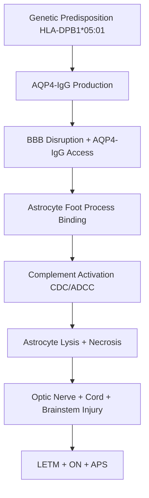
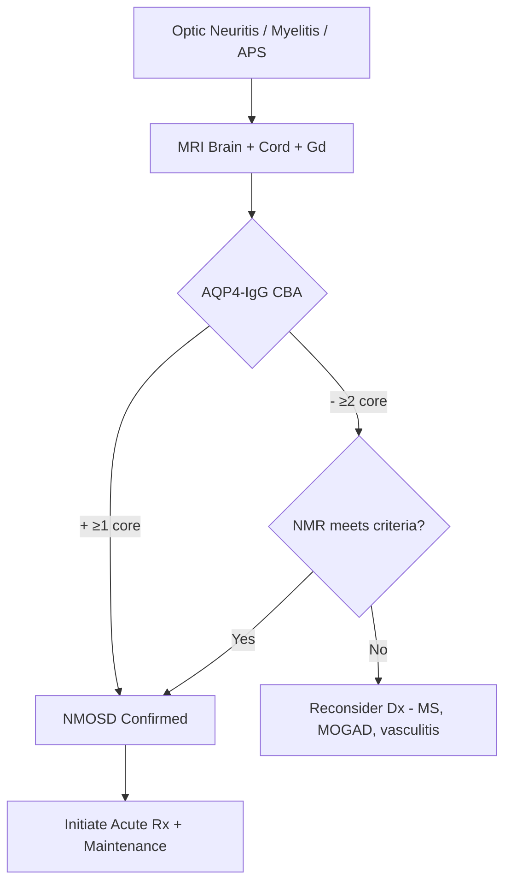

# Neuromyelitis Optica Spectrum Disorder (NMOSD)

Related: [[MOGAD]], [[MS (McDonald, DMTs)]], [[Optic Neuritis]], [[Transverse Myelitis]], [[ADEM]]

> [!tip] **High-Yield**
> NMOSD = AQP4-IgG–mediated astrocytopathy with predilection for **optic nerves + spinal cord + area postrema**. Distinguished from MS by **AQP4-IgG+, longitudinally extensive transverse myelitis (LETM ≥3 cord segments), and severe ON**. Treatment is acute (IV MP + PLEX) + maintenance (rituximab, eculizumab, satralizumab, mycophenolate, azathioprine). **MS DMTs (especially IFN-β, fingolimod, natalizumab) can worsen NMOSD.**

## 1. Definition / Epidemiology / Classification

### Definition
NMOSD is a **CNS inflammatory astrocytopathy** distinct from MS, mediated primarily by **anti-AQP4-IgG (aquaporin-4) autoantibodies** targeting the water channel expressed on astrocyte foot processes. Characterised by severe **optic neuritis, longitudinally extensive transverse myelitis, and area postrema syndrome**.

### Epidemiology
- **Prevalence:** 0.5-10/100,000 (higher in Asian, African, Caribbean populations)
- **Age:** Median 40 yrs (later than MS)
- **Sex ratio:** F:M = **4-9:1** (more female-skewed than MS)
- **AQP4-IgG positive:** ~80% (sensitivity higher with cell-based assay — CBA)
- **Course:** Predominantly relapsing (>90% AQP4+); monophasic rare
- **Risk factors:** Female, Asian/African ancestry, other autoimmunity (SLE, Sjögren's, myasthenia), HLA-DPB1*05:01

### Classification (IPND 2015)
| Group | AQP4-IgG Status | Diagnostic Criteria |
|-------|-----------------|---------------------|
| **AQP4-IgG positive NMOSD** | + | ≥1 core clinical characteristic |
| **AQP4-IgG negative/Unknown NMOSD** | − | ≥2 core clinical characteristics (≥1 of ON, LETM, area postrema) + additional MRI requirements |

### Core Clinical Characteristics
1. **Optic neuritis** (often severe, bilateral/recurrent)
2. **Acute myelitis** (LETM ≥3 segments)
3. **Area postrema syndrome** (intractable hiccups, nausea, vomiting)
4. **Acute brainstem syndrome**
5. **Symptomatic narcolepsy/diencephalic syndrome**
6. **Symptomatic cerebral syndrome** (with NMOSD-typical lesions)

## 2. Aetiology / Pathophysiology

### Pathophysiology

### Molecular Basis
- **Antigen:** **Aquaporin-4 (AQP4)** — water channel on astrocyte foot processes (M1 isoform in CNS)
- **Antibody:** AQP4-IgG (IgG1, complement-fixing); cell-based assay (CBA) > ELISA
- **Complement:** Classical pathway activation → CDC → astrocyte necrosis
- **Genetic:** HLA-DPB1*05:01 (Asian), other risk loci
- **Tissue:** **AQP4-rich sites** — optic nerve, spinal cord, area postrema, periaqueductal grey, hypothalamus
- **MOG-IgG:** Separate disease entity (MOGAD), not NMOSD

## 3. Clinical Features

### Common Presentations
| Site | Syndrome | Frequency |
|------|----------|-----------|
| **Optic neuritis** | Severe, painful, often bilateral, ↓VA to ≤0.1, often recurrent | 30-40% first event |
| **Acute myelitis** | LETM (≥3 segments), severe weakness, sensory level, sphincter dysfunction | 40-50% first event |
| **Area postrema** | Intractable hiccups, nausea, vomiting (>48h, no GI cause) | 10-15% |
| **Brainstem** | Vomiting, dysphagia, diplopia, nystagmus, ataxia | 5-10% |
| **Diencephalic** | Narcolepsy, SIADH, hypothermia, anorexia | <5% |
| **Cerebral** | Encephalopathy, seizures, PRES-like | <5% |

### Distinctive Clinical Features
- **Severe ON:** RAPD, ↓VA, often bilateral or sequential, poor recovery
- **LETM:** Sensory level, paraplegia, urinary retention, Lhermitte's, tonic spasms
- **Area postrema:** Hiccups + vomiting for days, often misdiagnosed as GI
- **Tonic spasms:** Painful paroxysmal spasms (respond to carbamazepine)
- **Pruritus:** Unilateral itching with myelitis (uncommon but characteristic)
- **Neuropathic pain:** Common (especially cord)

### Examination
- **Visual:** ↓VA, RAPD, central scotoma, dyschromatopsia
- **Motor:** Paraplegia/tetraplegia, spastic or flaccid in acute phase
- **Sensory:** Sensory level (thoracic common)
- **Autonomic:** Urinary retention, hyperhidrosis

## 4. Diagnostic Approach

### IPND 2015 Diagnostic Criteria

**AQP4-IgG Positive:**
- ≥1 core clinical characteristic
- No better explanation (MRI may be normal or atypical for MS)
- Tested with **cell-based assay (CBA) — most sensitive**

**AQP4-IgG Negative/Unknown:**
- ≥2 core clinical characteristics (with at least ON, LETM, or area postrema)
- ≥1 must be ON, LETM, or area postrema
- Additional MRI requirements for each syndrome
- Exclude better explanations

### Algorithm

### Severity Assessment
| Scale | Use |
|-------|-----|
| **EDSS** | Standard MS/ON scale |
| **Visual acuity** | ON assessment |
| **MRC scale** | Motor |
| **Functional System Scores (FSS)** | EDSS components |

## 5. Investigations

| Investigation | Indication | Expected Finding |
|---------------|------------|------------------|
| **MRI Brain + Cord with Gd** | All suspected | LETM (≥3 cord segments), long optic nerve enhancement, periependymal lesions (area postrema, thalamus, hypothalamus) |
| **AQP4-IgG (CBA)** | All suspected | **Positive ~80%**; CBA most sensitive; **serum > CSF** |
| **MOG-IgG (CBA)** | Exclude MOGAD | Negative in AQP4+ NMOSD |
| **OCB (CSF)** | Differential | Often negative (helps differentiate from MS); 20-30% positive |
| **ANA, ENA, anti-dsDNA** | Autoimmune screen | SLE/Sjögren's overlap (5-10%) |
| **NMO-IgG (ELISA)** | Older assay | Less sensitive than CBA |

### Key MRI Findings
- **Optic nerve:** Long-segment enhancement (often >½ nerve), bilateral, posterior
- **Spinal cord:** **LETM ≥3 segments** (often cervical/upper thoracic), central T2 hyperintensity, cord swelling, Gd+ in acute phase
- **Brain:** Periependymal 4th ventricle, area postrema, hypothalamus, "cloud-like" enhancement
- **Atypical for MS:** Small, ovoid periventricular lesions are uncommon in NMOSD

## 6. Differential Diagnosis

| Differential | Distinguishing Features | Key Test |
|--------------|------------------------|----------|
| **MS** | Small ovoid lesions, short cord, OCB+ | AQP4-IgG−, MOG−, MRI pattern |
| **MOGAD** | Bilateral ON, conus, ADEM, MOG-IgG+ | MOG-IgG (CBA) |
| **SLE myelitis** | Systemic, ANA+, antiphospholipid | ANA, anti-dsDNA |
| **Sjögren's** | Dry eyes/mouth, anti-SSA/SSB | Schirmer, anti-SSA |
| **Sarcoidosis** | Leptomeningeal enhancement, ACE | CXR, biopsy |
| **Vasculitis** | Stroke-like, systemic | ANCA, biopsy |
| **Behçet's** | Oral/genital ulcers, uveitis | Pathergy test |
| **Acute flaccid myelitis** | Enterovirus D68, polio-like | PCR CSF |
| **Idiopathic LETM** | Negative AQP4, MOG | Exclude |

## 7. Management

### Acute Relapse Treatment
| Agent | Dose | Notes |
|-------|------|-------|
| **Methylprednisolone** (1st line) | 1g IV × 3-5 days (often 5-7 days for severe) | Initiate ASAP |
| **PLEX (5-7 exchanges)** | 10-14 days | **Initiate early** for severe attack or steroid-refractory; better outcomes if started <5 days of onset |
| **IVIG** | — | Not standard; consider if PLEX unavailable |

### Maintenance Therapy (Relapse Prevention)
| Agent | Dose | Notes |
|-------|------|-------|
| **Rituximab** (anti-CD20) | 375mg/m² weekly ×4, then q6-12 months; monitor CD19 | 1st line in many centres; 60-80% efficacy |
| **Eculizumab** (anti-C5) | 900mg weekly ×4 → 1200mg q2w | **PREVENT trial**; AQP4+ only; expensive; meningococcal vaccine |
| **Satralizumab** (anti-IL-6R) | 120mg SC q2w ×3, then q4w | **SAkuraSky/Star** trials; add-on or monotherapy; AQP4+ ≥AQP4− |
| **Mycophenolate mofetil** | 1-2g/day | 1st/2nd line; cheaper; LFTs, FBC |
| **Azathioprine** | 2-3mg/kg/day | Effective; needs steroids bridge; TPMT |
| **Tocilizumab** (anti-IL-6R) | 8mg/kg monthly | Refractory cases |

### Acute Symptomatic / Supportive
| Symptom | Management |
|---------|-----------|
| **Neuropathic pain** | Gabapentin, pregabalin, duloxetine, amitriptyline |
| **Tonic spasms** | Carbamazepine, oxcarbazepine, baclofen |
| **Bladder** | ISC, antimuscarinics, monitor for UTI |
| **Spasticity** | Baclofen, tizanidine, physiotherapy |
| **Optic neuritis** | IV MP; consider IV MP + PLEX upfront for severe |

### **AVOID in NMOSD (may worsen):**
- **Interferon-β** (↑ relapses)
- **Fingolimod** (may worsen)
- **Natalizumab** (no benefit)
- **Alemtuzumab** (limited data, risk)
- **Glatiramer** (ineffective)

### Rehabilitation / MDT
- **Physiotherapy:** Cord rehab, gait, balance
- **Occupational therapy:** ADL, vision support
- **Neuropsychology:** Mood, coping
- **Vision rehabilitation:** Low-vision aids, registration
- **Social work:** Disability, support

## 8. Drug Interactions / Cautions

| Drug | Major Cautions |
|------|----------------|
| **Rituximab** | Infusion reactions; HBsAg screen; PML (rare); hypogammaglobulinaemia; infection |
| **Eculizumab** | **Meningococcal vaccine** (ACWY + B, 2 weeks before); monitor for Neisseria; thrombotic microangiopathy (rare) |
| **Satralizumab** | Infections, LFTs, neutropenia |
| **Mycophenolate** | GI, leukopenia, infections; **teratogenic** |
| **Azathioprine** | TPMT assay pre-Rx, bone marrow suppression, hepatotoxic, teratogenic |
| **Carbamazepine (for spasms)** | CYP inducer, hyponatraemia, Stevens-Johnson (HLA-B*1502 in Asians) |

## 9. Procedures
- **Therapeutic PLEX:** 5-7 exchanges over 10-14 days; central line; watch for hypocalcaemia, coagulopathy, infection
- **MRI protocol:** Brain + complete spinal cord sagittal/axial + Gd (both acute and follow-up)
- **CSF:** OCB, AQP4-IgG (less sensitive than serum), MOG-IgG

## 10. Complications
| Complication | Frequency | Management |
|--------------|-----------|------------|
| **Visual loss** (cumulative) | 30-40% | Acute Rx; vision support |
| **Permanent paralysis** | 30-50% (with LETM) | Rehab, assistive devices |
| **Neuropathic pain** | 80% | Gabapentin, TCAs |
| **Spasticity** | 60-80% | Baclofen, ITB, physio |
| **Bladder dysfunction** | 75% | Urodynamics, ISC |
| **Respiratory failure** | Cervical cord high | HDU/ICU, NIV |
| **DVT/PE** | Immobility | Prophylaxis |
| **Pressure sores** | Common | 2-hourly turning |
| **Depression/suicide** | ↑ risk | Screening, SSRI |
| **Death (untreated)** | 5-10% within 5 yrs | Mortality ↓ with treatment |

## 11. Red Flags / Emergencies
| Red Flag | Action |
|----------|--------|
| **Acute ON with ↓VA** | Urgent IV MP; consider upfront PLEX |
| **High cervical myelitis** | HDU, serial VC, NIV readiness, MRI |
| **Respiratory failure** | ITU, intubation |
| **Intractable hiccups/vomiting** | MRI brainstem; consider APS; IV MP |
| **Suspected PML** (on rituximab) | MRI + CSF JCV PCR; stop, PLEX |
| **Pregnancy relapse** | IV MP + PLEX; consider continuing eculizumab; rituximab and AZA may continue |

## 12. Prognosis
- **Better:** Early treatment, rapid response to PLEX, monophasic course
- **Worse:** AQP4+, high relapse rate in first 2 yrs, severe initial attack, optic + spinal involvement
- **Disability:** Cumulative attack-related; better recovery than MS if treated early
- **Mortality:** 5-10% (untreated), ↓ with modern therapy
- **Conversion:** AQP4+ relapsing; monophasic rare (~10%)
- **Visual outcome:** 30% become legally blind in one or both eyes
- **Long-term:** Walking aid (EDSS 6) in 50% by 5 yrs in severe untreated cases

## 13. Topic Correlation
| Topic | Link | Key Overlap |
|-------|------|------------|
| **MOGAD** | [[MOGAD]] | MOG-IgG, often monophasic, ADEM-like |
| **MS** | [[MS (McDonald, DMTs)]] | Differentiate: OCB, AQP4, cord length |
| **Optic Neuritis** | [[Optic Neuritis]] | Severe ON is hallmark |
| **Transverse Myelitis** | [[Transverse Myelitis]] | LETM in NMOSD |
| **ADEM** | [[ADEM]] | MOG-related ADEM |
| **Autoimmune Encephalitis** | [[Autoimmune Encephalitis]] | Diencephalic NMOSD overlap |

## 14. Special Situations
| Situation | Consideration |
|-----------|---------------|
| **Pregnancy** | Active disease ↑ relapse risk; AZA may continue; rituximab can be used; eculizumab data reassuring; avoid MMF (teratogenic) |
| **Lactation** | Most immunosuppressants excreted in milk; small amounts likely safe; consult MDT |
| **Paediatric** | NMOSD rare before puberty; AQP4+ more common in adults; MOGAD more common in children |
| **Elderly** | ↑ infection risk on rituximab; consider lower dose; review comorbidities |
| **Vaccinations** | Meningococcal (ACWY + B) 2 weeks before eculizumab; pneumococcal, annual flu; live vaccines contraindicated on most Rx |
| **Surgery** | Continue rituximab (if q6m schedule); steroid cover if chronic steroids |
| **Perioperative** | Plan immunosuppression; infection risk; monitor CBC |
| **Driving (DVLA)** | Notify if visual/cognitive/physical impairment; 1 month off post-attack |

## FCPS/MRCP High-Yield Summary
| Category | Key Points |
|----------|------------|
| **Definition** | AQP4-IgG–mediated astrocytopathy; optic nerve + cord + area postrema |
| **Epidemiology** | F:M = 4-9:1; later onset (40s); Asian/African ↑ |
| **Diagnosis** | IPND 2015: AQP4-IgG CBA + ≥1 core clinical |
| **AQP4-IgG** | Serum CBA most sensitive (80% positive) |
| **LETM** | ≥3 vertebral segments on MRI cord |
| **Area Postrema** | Hiccups + nausea/vomiting × days |
| **Acute Rx** | IV MP 1g × 5-7d; PLEX early for severe |
| **Maintenance** | Rituximab, eculizumab, satralizumab, MMF, AZA |
| **AVOID** | Interferon-β, fingolimod, natalizumab, alemtuzumab |
| **Differential** | MS, MOGAD, SLE/Sjögren's, sarcoidosis, vasculitis |
| **Pregnancy** | AZA/rituximab/eculizumab may continue; avoid MMF |

## Viva Questions (PACES/FCPS Style)
1. **Q:** Define NMOSD and the IPND 2015 criteria.
   **A:** AQP4-IgG–mediated astrocytopathy. AQP4+ = ≥1 core clinical (ON, LETM, APS, brainstem, diencephalic, cerebral). AQP4− = ≥2 core (at least 1 of ON, LETM, APS) + MRI requirements.
2. **Q:** What is the best test for AQP4-IgG?
   **A:** **Cell-based assay (CBA)** — most sensitive; serum > CSF; ELISA less sensitive.
3. **Q:** How is an acute NMOSD relapse treated?
   **A:** IV methylprednisolone 1g × 5-7 days; **PLEX (5-7 exchanges) early** for severe/steroid-refractory attack or upfront for severe ON/LETM.
4. **Q:** What is area postrema syndrome?
   **A:** Intractable hiccups, nausea, vomiting for >48h without GI cause — localises to area postrema in dorsal medulla; characteristic of NMOSD.
5. **Q:** What DMTs should be AVOIDED in NMOSD?
   **A:** Interferon-β (↑ relapses), fingolimod (may worsen), natalizumab (no benefit), alemtuzumab (limited data).
6. **Q:** Distinguish NMOSD from MS.
   **A:** NMOSD: AQP4+, LETM, severe ON (often bilateral), area postrema, brain lesions periependymal, OCB usually negative. MS: AQP4−, OCB+, small ovoid lesions, short cord.
7. **Q:** How does maintenance therapy differ in NMOSD from MS?
   **A:** NMOSD: rituximab (1st line), eculizumab, satralizumab, MMF, AZA. MS: DMTs (IFN, GA, DMF, TFL, fingo, clad, nata, ocre, alem). MS DMTs (esp. IFN) can worsen NMOSD.

## Common Confusions / Exam Traps
| Confusion | Clarification |
|-----------|---------------|
| **NMOSD vs MS** | NMOSD: AQP4+, LETM, severe ON, APS, periependymal lesions. MS: AQP4−, OCB+, small ovoid lesions |
| **MOGAD vs NMOSD** | MOGAD: MOG-IgG+, often bilateral ON, conus, ADEM; not AQP4; usually monophasic; AQP4 negative in MOGAD |
| **OCB in NMOSD** | 20-30% positive; absence does not exclude |
| **AQP4 assay** | CBA > ELISA; serum > CSF; retest if initially negative but high clinical suspicion |
| **PLEX timing** | Earlier = better outcomes; consider upfront for severe attacks |
| **DMT choice** | Many MS DMTs (IFN, fingo, nata) ineffective or worsen NMOSD — use rituximab/eculizumab/satralizumab |
| **SLE overlap** | 5-10% NMOSD have SLE/Sjögren's; consider in atypical cases |

## Mnemonics
1. **"NMOSD = 6 Core"** — **O**ptic neuritis, **M**yelitis (LETM), **A**rea postrema, **B**rainstem, **D**iencephalic, **C**erebral — **OMABDC**
2. **"AQP4 = Astrocyte Water Channel"** — Affected in **O**ptic + **C**ord + **APS** — Astrocytopathy
3. **"AVOID MS DMTs"** — **A**zathioprine/rituximab/MMF/eculizumab/satralizumab preferred

## MCQs (10)
1. **Q:** Which antibody is most sensitive and specific for NMOSD?
   **A:** AQP4-IgG by cell-based assay (CBA).
2. **Q:** What defines LETM?
   **A:** Spinal cord lesion extending ≥3 vertebral segments on MRI.
3. **Q:** Area postrema syndrome in NMOSD presents with:
   **A:** Intractable hiccups, nausea, vomiting.
4. **Q:** Standard first-line maintenance therapy for NMOSD?
   **A:** Rituximab (anti-CD20).
5. **Q:** Which MS DMT should be AVOIDED in NMOSD?
   **A:** Interferon-β (may worsen).
6. **Q:** F:M ratio in NMOSD is approximately:
   **A:** 4-9:1.
7. **Q:** Severe optic neuritis in NMOSD is characterised by:
   **A:** Painful, often bilateral, visual acuity ≤0.1, poor recovery.
8. **Q:** Acute treatment for severe NMOSD relapse unresponsive to steroids?
   **A:** Plasma exchange (5-7 exchanges).
9. **Q:** Eculizumab is contraindicated without:
   **A:** Meningococcal vaccination (ACWY + B) at least 2 weeks prior.
10. **Q:** AQP4-IgG is most abundant in which CNS regions?
    **A:** Astrocyte foot processes around vessels — optic nerve, spinal cord, area postrema.

## SBA Questions (10)
1. **Scenario:** 35-year-old woman with intractable hiccups and vomiting for 5 days, then bilateral lower limb weakness. MRI cord shows LETM T2-T8. Next investigation?
   **A:** **AQP4-IgG cell-based assay** (serum) — clinical picture + LETM = NMOSD until proven otherwise.
2. **Scenario:** AQP4-IgG positive NMOSD, acute ON with VA 6/60, on IV MP day 2. Next step?
   **A:** **Add plasma exchange** (severe attack; consider upfront PLEX).
3. **Scenario:** Patient on interferon-β develops LETM. AQP4-IgG+. Action?
   **A:** **Stop interferon-β (worsens NMOSD); switch to rituximab or eculizumab.**
4. **Scenario:** Woman with NMOSD planning pregnancy. Best maintenance?
   **A:** **Azathioprine (or rituximab); avoid MMF (teratogenic).**
5. **Scenario:** Patient with NMOSD on eculizumab. What vaccines are mandatory?
   **A:** **Meningococcal ACWY + B (2 weeks before first dose); pneumococcal; annual influenza.**
6. **Scenario:** 25-year-old man with bilateral simultaneous ON, brain MRI normal, CSF OCB negative. Next test?
   **A:** **MOG-IgG CBA** (bilateral ON, normal brain MRI = MOGAD characteristic).
7. **Scenario:** NMOSD patient on rituximab, CD19 count 0. New MRI with subcortical non-enhancing T2 lesion. Action?
   **A:** **MRI + CSF JCV PCR to exclude PML** (PML possible on rituximab; rare but reported).
8. **Scenario:** Tonic spasms in NMOSD — best treatment?
   **A:** **Carbamazepine or oxcarbazepine** (sodium channel blockers).
9. **Scenario:** 40-year-old woman, NMOSD, presents with SIADH and hypothermia. Lesion location?
   **A:** **Diencephalon (hypothalamus)** — symptomatic diencephalic syndrome.
10. **Scenario:** MOG-IgG positive patient. AQP4-IgG should be:
    **A:** **Negative** (mutually exclusive in practice).

## Flashcards
- **Q:** NMOSD antibody?
  **A:** AQP4-IgG (cell-based assay)
- **Q:** LETM definition?
  **A:** ≥3 cord segments
- **Q:** Area postrema syndrome?
  **A:** Hiccups + nausea/vomiting >48h
- **Q:** 1st-line acute Rx?
  **A:** IV MP 1g × 5-7d
- **Q:** When to add PLEX?
  **A:** Severe / steroid-refractory / severe ON
- **Q:** 1st-line maintenance?
  **A:** Rituximab (or eculizumab, satralizumab)
- **Q:** DMTs to avoid?
  **A:** IFN-β, fingolimod, natalizumab
- **Q:** Eculizumab vaccine requirement?
  **A:** Meningococcal ACWY + B 2 weeks before
- **Q:** F:M ratio?
  **A:** 4-9:1
- **Q:** NMOSD vs MOGAD?
  **A:** NMOSD = AQP4+; MOGAD = MOG-IgG+

## Answer Key
### MCQs
1. **A** — AQP4-IgG CBA
2. **A** — ≥3 vertebral segments
3. **A** — Intractable hiccups, nausea, vomiting
4. **A** — Rituximab
5. **A** — Interferon-β
6. **A** — 4-9:1
7. **A** — Painful, bilateral, ↓VA, poor recovery
8. **A** — Plasma exchange
9. **A** — Meningococcal ACWY + B
10. **A** — Astrocyte foot processes (optic nerve, cord, area postrema)

### SBAs
1. **A** — AQP4-IgG CBA
2. **A** — Add plasma exchange
3. **A** — Stop IFN-β, switch to rituximab
4. **A** — Azathioprine or rituximab
5. **A** — Meningococcal ACWY + B
6. **A** — MOG-IgG CBA
7. **A** — Exclude PML
8. **A** — Carbamazepine or oxcarbazepine
9. **A** — Diencephalon (hypothalamus)
10. **A** — Negative

## Local Navigation
**Topic-Group Hub:** [[Demyelinating Diseases Hub]] / [[Related Demyelinating Disorders Hub]]  
**Chapter Hierarchy:** [[Davidson Chapter 25 - Neurology Hierarchy]]  
**Chapter MOC:** [[Neurology MOC]]  
**Drug Reference:** [[00_Index/Neurology Drug Reference]]

## PasTest Scenario SBAs (Clinical Vignettes)

> **Auto-generated PasTest/Mediscope-style scenario SBAs** grounded in the authored source. Each scenario tests a real clinical fact (triad, specific sign, contraindication, trial, first-line Rx) extracted from the topic. *Source: Ch 27: Neurology & Stroke — Neuromyelitis Optica Spectrum Disorder*

**Q1.** Which of the following features is most specific or characteristic of Neuromyelitis Optica Spectrum Disorder?

  - **A.** Pruritus:
  - **B.** A feature common to many acute inflammatory conditions
  - **C.** A non-specific sign that does not localise the diagnosis
  - **D.** An investigation finding rather than a clinical feature

  > **Answer: A** — Pruritus:
  >
  > *Source:* often misdiagnosed as GI
- **Tonic spasms:** Painful paroxysmal spasms (respond to carbamazepine)
- **Pruritus:** Unilateral itching with myelitis (uncommon but characteristic)
- **Neuropathic pain:**

**Q2.** What is the most appropriate first-line therapy for Neuromyelitis Optica Spectrum Disorder?

  - **A.** Occupational therapy:
  - **B.** An advanced/surgical therapy reserved for refractory disease
  - **C.** Symptomatic treatment only, no disease-modifying therapy
  - **D.** Empiric broad-spectrum therapy without specific indication

  > **Answer: A** — Occupational therapy:
  >
  > *Source:* **Occupational therapy:** ADL, vision support

