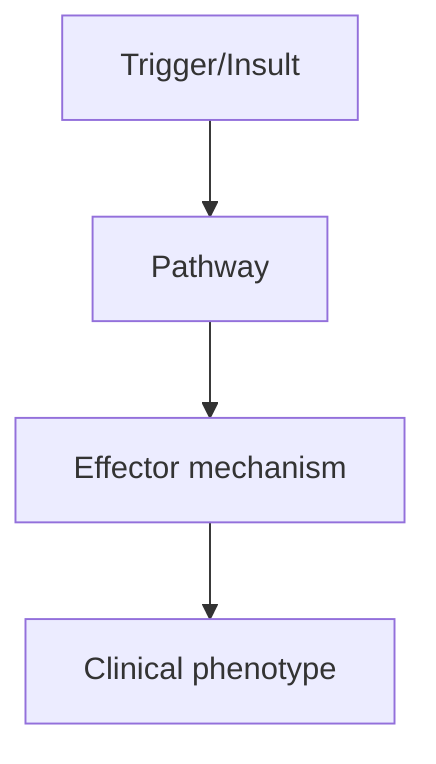
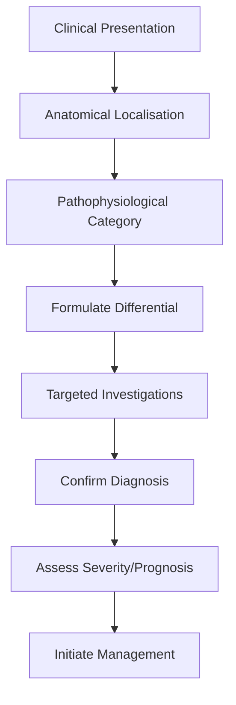

# Primary Progressive MS

> [!tip] **High-Yield Definition**
> Primary progressive MS (PPMS): progressive disability accumulation from onset, without relapses. ~10-15% of MS. Distinct from RRMS: older onset, equal sex ratio, more spinal cord involvement, fewer brain lesions, more rapid disability accumulation.

---

## 1. Definition / Epidemiology / Classification

### Definition
Primary progressive MS (PPMS): progressive disability accumulation from onset, without relapses. ~10-15% of MS. Distinct from RRMS: older onset, equal sex ratio, more spinal cord involvement, fewer brain lesions, more rapid disability accumulation.

### Epidemiology
10-15% of all MS. Male:female 1:1 (unlike RRMS 3:1). Median onset age 40-50y (5-10y later than RRMS). Spinal cord involvement common.

### Classification
| Variant | Key Features | Prognosis |
|---------|-------------|-----------|
| | | |

---

## 2. Aetiology / Pathophysiology

### Aetiology
Primarily neurodegenerative with less inflammation. Compartmentalised inflammation, meningeal ectopic lymphoid follicles, cortical demyelination, axonal loss, spinal cord atrophy. Risk factors: older age, male sex, progressive onset.

### Pathophysiology


---

## 3. Clinical Features

### History
- **Onset/Duration:**
- **Progression:**
- **Key symptoms:**
- **Triggers:**
- **Systemic symptoms:**
- **Drug/Family/Social history:**

### Examination
| Domain | Key Findings | Localisation Value |
|--------|-------------|-------------------|
| | | |

### Specific Clinical Features
Progressive disability from onset without relapses. Most common: progressive spastic paraparesis (spinal cord). Other: cerebellar ataxia, cognitive decline, brainstem syndromes, visual loss (rare). EDSS progresses steadily. Less inflammatory activity than RRMS (fewer relapses, fewer enhancing lesions).

---

## 4. Diagnostic Approach / Algorithm



---

## 5. Investigations

MRI: spinal cord atrophy, fewer brain lesions, fewer gadolinium-enhancing lesions. McDonald 2017 criteria for PPMS: 1 year disability progression (independent of relapses) + 2 of: (1) ≥1 T2 lesion in brain (periventricular, cortical/juxtacortical, infratentorial), (2) ≥2 T2 lesions in spinal cord, (3) positive CSF (OCBs or elevated IgG index). CSF: OCBs positive in 80-90%. Serum NfL elevated. Evoked potentials: abnormal in 80%.

---

## 6. Differential Diagnosis

| Differential | Distinguishing Features | Key Test |
|--------------|------------------------|----------|
| | | |

---

## 7. Management

DMT: ocrelizumab (anti-CD20) is the only DMT approved for PPMS (reduces 3-month CDP by 24%, 6-month CDP by 25%). Rituximab (off-label). Symptomatic: spasticity (baclofen, tizanidine, gabapentin), fatigue (amantadine), bladder (mirabegron, oxybutynin), pain (gabapentin, duloxetine). Multidisciplinary: physiotherapy, OT, neuropsychology. Neuroprotection: biotin (controversial), lipoic acid.

---

## 8. Drug Interactions / Contraindications / Comorbidity Cautions

| Drug | Interaction / Caution | Management |
|------|----------------------|------------|
| | | |

---

## 9. Procedures (if applicable)

### Procedure:
- **Indications:**
- **Contraindications:**
- **Preparation / Principle:**
- **Complications:**
- **Viva Pearls:**

---

## 10. Complications

| Complication | Frequency | Prevention / Monitoring | Management |
|--------------|-----------|------------------------|------------|
| | | | |

---

## 11. Red Flags / Emergencies

Rapid progression, falls, cognitive decline, dysphagia, respiratory compromise (rare in MS).

---

## 12. Prognosis

Worse than RRMS in terms of disability accumulation. Median time to EDSS 6: 8-15 years. Median time from onset to walking aid: 8-10 years. Less inflammatory activity, fewer relapses, but more rapid disability once progression begins.

---

## 13. Topic Correlation

| Related Topic | Link | Key Overlap |
|---------------|------|-------------|
| | | |

---

## 14. Special Situations

| Situation | Consideration |
|-----------|---------------|
| **Pregnancy** | |
| **Lactation** | |
| **Paediatric** | |
| **Elderly / Frail** | |
| **Renal impairment** | |
| **Hepatic impairment** | |
| **Immunocompromised** | |
| **Perioperative** | |
| **Driving / DVLA** | |
| **Occupational** | |

---

## FCPS/MRCP High-Yield Summary

| Category | Key Points |
|----------|------------|
| **Definition** | Primary progressive MS (PPMS): progressive disability accumulation from onset, without relapses. ~10-15% of MS. Distinct from RRMS: older onset, equal sex ratio, more spinal cord involvement, fewer br |
| **Epidemiology** | 10-15% of all MS. Male:female 1:1 (unlike RRMS 3:1). Median onset age 40-50y (5-10y later than RRMS). Spinal cord involvement common. |
| **Pathophysiology** | |
| **Clinical** | Progressive disability from onset without relapses. Most common: progressive spastic paraparesis (spinal cord). Other: cerebellar ataxia, cognitive decline, brainstem syndromes, visual loss (rare). ED |
| **Diagnosis** | |
| **Investigations** | MRI: spinal cord atrophy, fewer brain lesions, fewer gadolinium-enhancing lesions. McDonald 2017 criteria for PPMS: 1 year disability progression (independent of relapses) + 2 of: (1) ≥1 T2 lesion in  |
| **Management** | DMT: ocrelizumab (anti-CD20) is the only DMT approved for PPMS (reduces 3-month CDP by 24%, 6-month CDP by 25%). Rituximab (off-label). Symptomatic: spasticity (baclofen, tizanidine, gabapentin), fati |
| **Complications** | |
| **Prognosis** | Worse than RRMS in terms of disability accumulation. Median time to EDSS 6: 8-15 years. Median time from onset to walking aid: 8-10 years. Less inflammatory activity, fewer relapses, but more rapid di |
| **Viva Pearls** | |
| **Drug Doses** | |
| **Scoring Systems** | |
| **Genetics** | |
| **Imaging Signs** | |

---

## Viva Questions (PACES/FCPS Style)

1. **Q:** Define Primary Progressive MS and classify its variants.
   **A:** Based on the definition above.

2. **Q:** What are the key clinical features?
   **A:** Progressive disability from onset without relapses. Most common: progressive spastic paraparesis (spinal cord). Other: cerebellar ataxia, cognitive decline, brainstem syndromes, visual loss (rare). EDSS progresses steadily. Less inflammatory activity than RRMS (fewer relapses, fewer enhancing lesion

3. **Q:** What is the first-line treatment?
   **A:** Based on the management section.

4. **Q:** What are the red flags requiring urgent referral?
   **A:** Rapid progression, falls, cognitive decline, dysphagia, respiratory compromise (rare in MS).

5. **Q:** What is the prognosis?
   **A:** Worse than RRMS in terms of disability accumulation. Median time to EDSS 6: 8-15 years. Median time from onset to walking aid: 8-10 years. Less inflammatory activity, fewer relapses, but more rapid disability once progression begins.

6. **Q:** How do you differentiate Primary Progressive MS from key differentials?
   **A:** Clinical features, investigations, and response to treatment.

7. **Q:** What investigations are most useful?
   **A:** Based on the investigations section.

8. **Q:** Describe the stepwise management approach.
   **A:** Based on the management algorithm.

9. **Q:** What are the emergency presentations?
   **A:** Based on the red flags section.

10. **Q:** How does management change in pregnancy/paediatrics/elderly?
    **A:** Special considerations per population.

---

## Common Confusions / Exam Traps

| Confusion | Clarification |
|-----------|---------------|
| | |

---

## Mnemonics
1. **PPMS = progression from onset** — No relapses, gradual worsening (≥1 year)
1. **Older onset, fewer lesions, more spinal cord** — 40-50y onset, motor > sensory, myelopathy common
1. **TREATMENT** — Ocrelizumab is the only approved DMT for PPMS (slower disability progression)

---

## Mind Map

```mermaid
mindmap
  root((Primary Progressive MS (PPMS)))
    Definition
    Epidemiology
    Pathophysiology
    Clinical Features
    Investigations
    Differential Diagnosis
    Management
      Acute
      Long-term
    Complications
    Prognosis
```

---

## Spaced Repetition Trackers

| Review Interval | Date | Score (0-5) | Notes |
|-----------------|------|-------------|-------|
| Day 1 | | | |
| Day 3 | | | |
| Day 7 | | | |
| Day 14 | | | |
| Day 30 | | | |
| Day 90 | | | |

---

## Self-Test Scorecard

| Section | Score /5 | Last Attempt |
|---------|----------|--------------|
| Definition & Epidemiology | | |
| Pathophysiology | | |
| Clinical Features | | |
| Investigations | | |
| Differential Diagnosis | | |
| Management | | |
| Complications & Prognosis | | |
| Viva Questions | | |
| MCQs | | |
| SBAs | | |

---

## MCQs (10)

1. **Question:** PPMS definition:
   **Options:** A. Progressive from onset (no relapses), ≥1 year progression B. Relapsing-remitting C. Secondary progressive D. Progressive-relapsing
   **Answer:** A
   **Explanation:** PPMS: progressive from onset, no relapses, ≥1 year progression (McDonald 2017).

2. **Question:** PPMS typical features:
   **Options:** A. Older onset (40-50y), motor predominant, myelopathy, fewer brain lesions, more spinal cord B. Young onset, optic neuritis, many brain lesions C. Childhood, ADEM-like D. Frequent relapses
   **Answer:** A
   **Explanation:** PPMS: older onset (40-50y), motor predominant, myelopathy, fewer brain lesions, more spinal cord. Male = female.

3. **Question:** PPMS McDonald 2017 criteria:
   **Options:** A. 1 year disability progression + ≥2 of: periventricular/cortical/infratentorial, spinal cord lesion, OCB positive B. Two relapses required C. Genetic required D. Biopsy required
   **Answer:** A
   **Explanation:** PPMS: 1y progression + 2 of 3 (periventricular/cortical/infratentorial, spinal cord, OCB).

4. **Question:** Only DMT approved for PPMS:
   **Options:** A. Ocrelizumab (anti-CD20) B. Interferon-β C. Glatiramer D. Natalizumab
   **Answer:** A
   **Explanation:** Ocrelizumab: only DMT with PPMS approval. Slows disability progression in PPMS.

5. **Question:** PPMS prognosis vs RRMS:
   **Options:** A. Worse (older onset, faster disability, less recovery) B. Better C. Same D. Always benign
   **Answer:** A
   **Explanation:** PPMS: worse prognosis than RRMS. Older onset, motor, less inflammatory activity, less recovery.

6. **Question:** PPMS MRI features:
   **Options:** A. Fewer brain lesions, more spinal cord lesions (often >1 segment), less enhancement B. Many brain lesions C. Tumour D. Cyst
   **Answer:** A
   **Explanation:** PPMS: fewer brain lesions than RRMS, more spinal cord (often cervical, sometimes LETM), less enhancement, more atrophy.

7. **Question:** Differential of PPMS:
   **Options:** A. Hereditary spastic paraplegia, structural cord lesion, B12 deficiency, sarcoid, vasculitis B. Stroke only C. Tumour only D. Infection only
   **Answer:** A
   **Explanation:** PPMS differential: HSP (family history, no MRI lesions), cord compression (MRI), B12 deficiency (MCV, macrocytosis), sarcoid, vasculitis (MOG, AQP4), neurosyphilis.

---

## SBA Questions (10)

1. **Scenario:** 50-year-old, progressive myelopathy 2 years, MRI: 1 periventricular + 1 cord lesion, OCB positive. Diagnosis?
   **Options:** A. PPMS (McDonald 2017: progression + 2/3) B. RRMS C. SPMS D. NMOSD E. HSP
   **Answer:** A
   **Explanation:** PPMS: 1y progression + 2/3 (periventricular, spinal cord, OCB). Treatment: ocrelizumab.

2. **Scenario:** PPMS on ocrelizumab, slower progression confirmed. Continue?
   **Options:** A. Yes - ocrelizumab is the only DMT for PPMS B. Stop - not proven C. Switch to interferon D. Add methotrexate E. Surgery
   **Answer:** A
   **Explanation:** Ocrelizumab: only DMT with PPMS approval. Slows disability progression. Continue indefinitely.

3. **Scenario:** Progressive myelopathy, family history (father walked with stick), MRI spine: thoracic cord atrophy only. Diagnosis?
   **Options:** A. Hereditary spastic paraplegia (HSP) B. PPMS C. Compressive D. B12 deficiency E. Sarcoid
   **Answer:** A
   **Explanation:** HSP: family history, slowly progressive spastic paraparesis, MRI often normal or cord atrophy, no lesions. Genetic testing.

---

## Tags

**Tags:** #neurology #demyelinating #MS #PPMS #progressive #ocrelizumab #FCPS #MRCP

---

## Local Navigation
**Heading Hub:** [[../Multiple Sclerosis Hub]]
**Chapter Hierarchy:** [[../../Davidson Chapter 25 - Neurology Hierarchy]]
**Chapter MOC:** [[../../Neurology MOC]]
**Drug Reference:** [[../../00_Index/Neurology Drug Reference]]