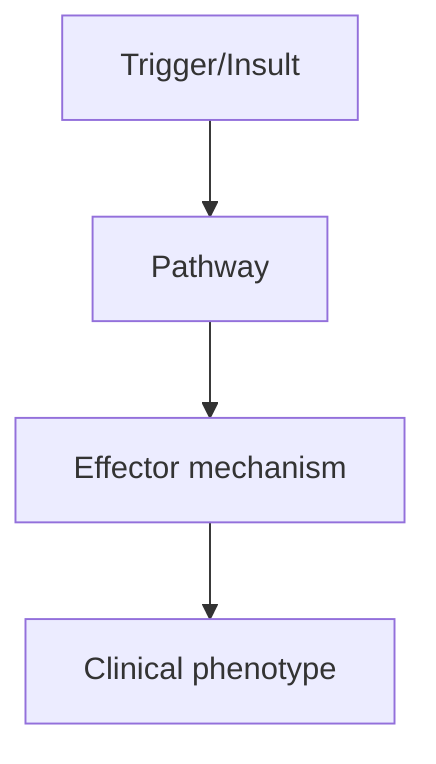
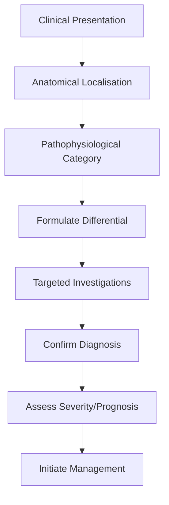

# Radiologically Isolated Syndrome

> [!tip] **High-Yield Definition**
> RIS: asymptomatic individuals with MRI brain incidental findings meeting McDonald criteria for MS DIS, without neurological symptoms. 'Pre-clinical MS'.

---

## 1. Definition / Epidemiology / Classification

### Definition
RIS: asymptomatic individuals with MRI brain incidental findings meeting McDonald criteria for MS DIS, without neurological symptoms. 'Pre-clinical MS'.

### Epidemiology
Prevalence: 0.05-0.3% of general population. 30-50% convert to clinically definite MS within 5 years. Higher risk: young age, spinal cord lesions, gadolinium enhancement, CSF OCBs, brain atrophy.

### Classification
| Variant | Key Features | Prognosis |
|---------|-------------|-----------|
| | | |

---

## 2. Aetiology / Pathophysiology

### Aetiology
Same as MS: autoimmune demyelination, EBV, genetic, vitamin D, smoking. Asymptomatic demyelination with eventual clinical manifestation.

### Pathophysiology


---

## 3. Clinical Features

### History
- **Onset/Duration:**
- **Progression:**
- **Key symptoms:**
- **Triggers:**
- **Systemic symptoms:**
- **Drug/Family/Social history:**

### Examination
| Domain | Key Findings | Localisation Value |
|--------|-------------|-------------------|
| | | |

### Specific Clinical Features
ASXMPTOMATIC. Incidental MRI findings (headache, trauma, screening) showing T2 hyperintensities meeting MS criteria. No prior neurological symptoms. No current symptoms. May have subtle cognitive impairment on detailed testing.

---

## 4. Diagnostic Approach / Algorithm



---

## 5. Investigations

MRI brain + spine with gadolinium (key): meets McDonald DIS criteria (≥1 T2 lesion in ≥2 of 4 typical locations: periventricular, cortical/juxtacortical, infratentorial, spinal cord). CSF: OCBs (positive in 60-80%, predict conversion). Serum NfL (elevated in converters). Evoked potentials (VEP delayed in 30%). Neuropsychology (subtle deficits in 20-30%).

---

## 6. Differential Diagnosis

| Differential | Distinguishing Features | Key Test |
|--------------|------------------------|----------|
| | | |

---

## 7. Management

Controversial. Options: (1) Monitor - MRI q6-12mo, no treatment. (2) Treat high-risk (spinal cord lesions, Gd+, OCBs, brain atrophy, young) - DMT (IFN-β, GA, dimethyl fumarate, teriflunomide - off-label in some countries). AAN guidelines: insufficient evidence to support or refute DMT. Recent trials suggest DMT reduces conversion. Lifestyle: vitamin D, smoking cessation, exercise, healthy diet. Patient education: symptoms, monitoring.

---

## 8. Drug Interactions / Contraindications / Comorbidity Cautions

| Drug | Interaction / Caution | Management |
|------|----------------------|------------|
| | | |

---

## 9. Procedures (if applicable)

### Procedure:
- **Indications:**
- **Contraindications:**
- **Preparation / Principle:**
- **Complications:**
- **Viva Pearls:**

---

## 10. Complications

| Complication | Frequency | Prevention / Monitoring | Management |
|--------------|-----------|------------------------|------------|
| | | | |

---

## 11. Red Flags / Emergencies

Conversion to clinically definite MS, new symptoms, MRI progression, cognitive decline.

---

## 12. Prognosis

30-50% convert to MS within 5 years. Higher risk: OCBs+, spinal cord lesions, Gd+ lesions, brain atrophy, young age. Median time to first clinical event: 5 years. Similar to CIS in conversion rate but asymptomatic presentation.

---

## 13. Topic Correlation

| Related Topic | Link | Key Overlap |
|---------------|------|-------------|
| | | |

---

## 14. Special Situations

| Situation | Consideration |
|-----------|---------------|
| **Pregnancy** | |
| **Lactation** | |
| **Paediatric** | |
| **Elderly / Frail** | |
| **Renal impairment** | |
| **Hepatic impairment** | |
| **Immunocompromised** | |
| **Perioperative** | |
| **Driving / DVLA** | |
| **Occupational** | |

---

## FCPS/MRCP High-Yield Summary

| Category | Key Points |
|----------|------------|
| **Definition** | RIS: asymptomatic individuals with MRI brain incidental findings meeting McDonald criteria for MS DIS, without neurological symptoms. 'Pre-clinical MS'. |
| **Epidemiology** | Prevalence: 0.05-0.3% of general population. 30-50% convert to clinically definite MS within 5 years. Higher risk: young age, spinal cord lesions, gad |
| **Pathophysiology** | |
| **Clinical** | ASXMPTOMATIC. Incidental MRI findings (headache, trauma, screening) showing T2 hyperintensities meeting MS criteria. No prior neurological symptoms. No current symptoms. May have subtle cognitive impa |
| **Diagnosis** | |
| **Investigations** | MRI brain + spine with gadolinium (key): meets McDonald DIS criteria (≥1 T2 lesion in ≥2 of 4 typical locations: periventricular, cortical/juxtacortical, infratentorial, spinal cord). CSF: OCBs (posit |
| **Management** | Controversial. Options: (1) Monitor - MRI q6-12mo, no treatment. (2) Treat high-risk (spinal cord lesions, Gd+, OCBs, brain atrophy, young) - DMT (IFN-β, GA, dimethyl fumarate, teriflunomide - off-lab |
| **Complications** | |
| **Prognosis** | 30-50% convert to MS within 5 years. Higher risk: OCBs+, spinal cord lesions, Gd+ lesions, brain atrophy, young age. Median time to first clinical event: 5 years. Similar to CIS in conversion rate but |
| **Viva Pearls** | |
| **Drug Doses** | |
| **Scoring Systems** | |
| **Genetics** | |
| **Imaging Signs** | |

---

## Viva Questions (PACES/FCPS Style)

1. **Q:** Define Radiologically Isolated Syndrome and classify its variants.
   **A:** Based on the definition above.

2. **Q:** What are the key clinical features?
   **A:** ASXMPTOMATIC. Incidental MRI findings (headache, trauma, screening) showing T2 hyperintensities meeting MS criteria. No prior neurological symptoms. No current symptoms. May have subtle cognitive impairment on detailed testing.

3. **Q:** What is the first-line treatment?
   **A:** Based on the management section.

4. **Q:** What are the red flags requiring urgent referral?
   **A:** Conversion to clinically definite MS, new symptoms, MRI progression, cognitive decline.

5. **Q:** What is the prognosis?
   **A:** 30-50% convert to MS within 5 years. Higher risk: OCBs+, spinal cord lesions, Gd+ lesions, brain atrophy, young age. Median time to first clinical event: 5 years. Similar to CIS in conversion rate but asymptomatic presentation.

6. **Q:** How do you differentiate Radiologically Isolated Syndrome from key differentials?
   **A:** Clinical features, investigations, and response to treatment.

7. **Q:** What investigations are most useful?
   **A:** Based on the investigations section.

8. **Q:** Describe the stepwise management approach.
   **A:** Based on the management algorithm.

9. **Q:** What are the emergency presentations?
   **A:** Based on the red flags section.

10. **Q:** How does management change in pregnancy/paediatrics/elderly?
    **A:** Special considerations per population.

---

## Common Confusions / Exam Traps

| Confusion | Clarification |
|-----------|---------------|
| | |

---

## Mnemonics
1. **RIS = MRI lesions fulfilling MS criteria BUT no clinical symptoms** — Incidental finding on MRI
1. **Risk of conversion to MS** — 30-50% over 5 years; highest if gadolinium-enhancing, spinal cord, infratentorial, CSF OCB
1. **Management** — Watchful waiting; DMT if high risk (per ARISE trial - dimethyl fumarate reduces conversion)

---

## Mind Map

```mermaid
mindmap
  root((Radiologically Isolated Syndrome (RIS)))
    Definition
    Epidemiology
    Pathophysiology
    Clinical Features
    Investigations
    Differential Diagnosis
    Management
      Acute
      Long-term
    Complications
    Prognosis
```

---

## Spaced Repetition Trackers

| Review Interval | Date | Score (0-5) | Notes |
|-----------------|------|-------------|-------|
| Day 1 | | | |
| Day 3 | | | |
| Day 7 | | | |
| Day 14 | | | |
| Day 30 | | | |
| Day 90 | | | |

---

## Self-Test Scorecard

| Section | Score /5 | Last Attempt |
|---------|----------|--------------|
| Definition & Epidemiology | | |
| Pathophysiology | | |
| Clinical Features | | |
| Investigations | | |
| Differential Diagnosis | | |
| Management | | |
| Complications & Prognosis | | |
| Viva Questions | | |
| MCQs | | |
| SBAs | | |

---

## MCQs (10)

1. **Question:** RIS definition:
   **Options:** A. MRI lesions fulfilling McDonald DIS but no clinical symptoms, no better explanation B. First demyelinating event C. MS confirmed D. Stroke
   **Answer:** A
   **Explanation:** RIS: MRI incidentally shows MS-like lesions (fulfilling DIS), no clinical symptoms, no better explanation.

2. **Question:** RIS risk factors for conversion to MS:
   **Options:** A. Spinal cord lesions, gadolinium enhancement, infratentorial lesions, CSF OCB positive B. Single periventricular lesion C. No spinal cord D. Female sex only
   **Answer:** A
   **Explanation:** RIS conversion risk: spinal cord, infratentorial, enhancing lesions, OCB positive, young age, male sex.

3. **Question:** RIS prevalence:
   **Options:** A. ~0.1% general population (incidental MRI) B. Common (10%) C. Rare (<1 in 1M) D. Unknown
   **Answer:** A
   **Explanation:** RIS: ~0.1% general population. Many discovered incidentally. Female predominance (like MS).

4. **Question:** RIS management:
   **Options:** A. Watchful waiting vs DMT if high risk (per ARISE - dimethyl fumarate reduces conversion) B. Always DMT C. Always observation D. Surgery
   **Answer:** A
   **Explanation:** RIS: ARISE trial showed dimethyl fumarate reduced conversion to MS. Watchful waiting if low risk; DMT if high risk.

5. **Question:** When to consider DMT in RIS:
   **Options:** A. High-risk features: enhancing lesions, spinal cord, infratentorial, OCB positive, young B. Never C. Always D. Only if lesions >10
   **Answer:** A
   **Explanation:** High-risk RIS (enhancing, spinal cord, infratentorial, OCB+): consider DMT. ARISE trial supports early treatment.

6. **Question:** Differential of RIS:
   **Options:** A. Small vessel disease, migraine, ADEM, vascular, sarcoid B. Only MS C. Only stroke D. Only tumour
   **Answer:** A
   **Explanation:** RIS differential: small vessel disease (age, HTN), migraine, ADEM (children), vascular, sarcoid. Re-image to confirm persistent lesions.

7. **Question:** RIS MRI criteria (Okuda 2009):
   **Options:** A. ≥1 T2 lesion in ≥1 of: periventricular, cortical/juxtacortical, infratentorial, spinal cord B. 5 lesions anywhere C. Single lesion D. Bilateral lesions only
   **Answer:** A
   **Explanation:** Okuda 2009: ≥1 T2 lesion in ≥1 of 4 areas, no symptoms, no better explanation, not attributable to another disease.

---

## SBA Questions (10)

1. **Scenario:** 35-year-old, head MRI for headache shows 3 periventricular + 1 spinal cord T2 lesions. No symptoms. Diagnosis?
   **Options:** A. Radiologically isolated syndrome (RIS) B. MS C. Stroke D. Migraine E. Tumour
   **Answer:** A
   **Explanation:** RIS: MRI lesions fulfilling DIS, no symptoms. Confirm persistence (3 months), OCB, manage per risk.

2. **Scenario:** RIS with spinal cord lesion, enhancing lesion, OCB positive. Management?
   **Options:** A. Consider DMT (high-risk conversion); counsel on options B. Observation only C. Surgery D. Steroids only E. Plasma exchange
   **Answer:** A
   **Explanation:** High-risk RIS: spinal cord, enhancing, OCB+. ARISE trial supports DMT (dimethyl fumarate). Counsel patient on risks/benefits.

3. **Scenario:** RIS patient, 3-month follow-up MRI: lesions resolved. Diagnosis?
   **Options:** A. NOT RIS (lesions not persistent; likely small vessel disease, migraine, or other) B. RIS confirmed C. MS D. Tumour E. Stroke
   **Answer:** A
   **Explanation:** RIS requires persistent lesions on follow-up. If lesions resolve, not RIS. Re-diagnose (vascular, migraine, ADEM, etc).

---

## Tags

**Tags:** #neurology #demyelinating #MS #RIS #incidental #DMT #FCPS #MRCP

---

## Local Navigation
**Heading Hub:** [[../Multiple Sclerosis Hub]]
**Chapter Hierarchy:** [[../../Davidson Chapter 25 - Neurology Hierarchy]]
**Chapter MOC:** [[../../Neurology MOC]]
**Drug Reference:** [[../../00_Index/Neurology Drug Reference]]