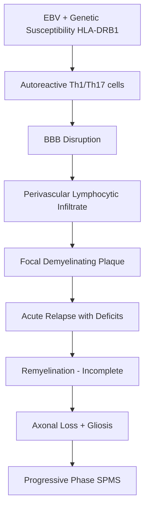
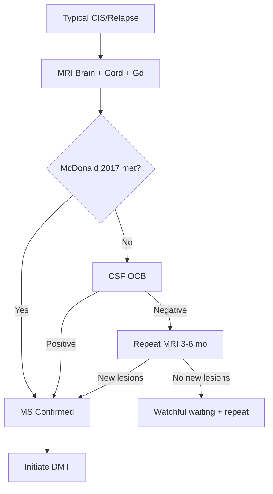

# Relapsing-Remitting MS (RRMS)

Related: [[Multiple Sclerosis (McDonald, DMTs)]], [[McDonald Criteria 2017]], [[SPMS]], [[PPMS]], [[CIS]], [[Optic Neuritis]]

> [!tip] **High-Yield**
> RRMS = most common MS phenotype (~85%); characterised by **discrete relapses with partial/complete recovery and stable disease between relapses**. Diagnosis requires **McDonald 2017 (DIS + DIT)**. Treatment = **acute relapse + long-term DMT (early high-efficacy preferred)**.

## 1. Definition / Epidemiology / Classification

### Definition
RRMS is the most common MS phenotype (~85% of cases) characterised by:
- **Acute relapses** (inflammatory demyelinating episodes with new/worsening neurological symptoms lasting ≥24h, in absence of infection/fever)
- **Remissions** with partial or complete recovery
- **Stable neurological status** between relapses
- **No progression independent of relapse activity (PIRA)** in early stages

### Epidemiology
- **Prevalence:** 50-300/100,000 (latitude-dependent)
- **Age at onset:** 20-40 years (mean ~30)
- **Sex ratio:** F:M = **2.5-3:1**
- **ARR (untreated):** 0.5-1.0
- **Conversion to SPMS:** ~50% at 15 years; ~80% at 25-30 years
- **Risk factors:** Female, Northern latitude, low vitamin D, EBV, HLA-DRB1*15:01, smoking

### Diagnostic Subcategories
| Subtype | Definition |
|---------|------------|
| **Active RRMS** | ≥1 relapse or new MRI activity in past year |
| **Not Active RRMS** | No relapse and no MRI activity in past year |
| **Worsening RRMS** | Active + EDSS progression (between relapses) |

## 2. Aetiology / Pathophysiology

### Pathophysiology

### Molecular Basis
- **HLA-DRB1*15:01:** strongest genetic risk
- **Cytokines:** IFN-γ, IL-17, IL-23, GM-CSF
- **Autoantibodies:** Anti-MOG (5-10%, distinct), AQP4-negative (excludes NMOSD)
- **Biomarkers:** CSF OCB (95%), NfL (correlates with disease activity), MRZ reaction

## 3. Clinical Features

### Common Relapse Sites
| Site | Syndrome | Frequency |
|------|----------|-----------|
| **Spinal cord** | Partial transverse myelitis, sensory level, Lhermitte's | 40-45% |
| **Optic nerve** | Painful vision loss, RAPD, dyschromatopsia | 25% |
| **Brainstem** | INO, diplopia, facial numbness, vertigo | 10-15% |
| **Cerebellum** | Ataxia, dysarthria, intention tremor | 5-10% |
| **Cerebral** | Hemiparesis, hemisensory loss | 5% |

### History
- **Relapse criteria:** New/worsening symptoms ≥24h after ≥30 days of stability, with no fever/infection
- **Pseudo-relapse:** Worsening of old symptoms with fever/heat (Uhthoff) or infection — not a true relapse
- **Pre-relapse prodrome:** Fatigue, cognitive slowing (subtle)
- **Recovery pattern:** Incomplete in 50%; better if sensory vs motor/cerebellar

### Examination
- **UMN signs:** Spasticity, hyperreflexia, Babinski, ankle clonus
- **Cerebellar:** Nystagmus, dysmetria, intention tremor
- **Sensory:** Reduced vibration/proprioception; sensory level
- **Visual:** RAPD, red desaturation, pale optic disc (chronic)
- **Cognition:** Processing speed, executive dysfunction
- **Fatigue:** Often most disabling; temperature-sensitive

### Specific Phenomena
- **Uhthoff's:** Worsening with ↑temperature
- **Lhermitte's:** Electric shock on neck flexion
- **Paroxysmal symptoms:** Tonic spasms, dysarthria/ataxia (brief, stereotypic) — respond to carbamazepine

## 4. Diagnostic Approach

### McDonald 2017 Criteria for RRMS
- **Step 1:** Typical CIS (subacute, monophasic, no infection)
- **Step 2:** Demonstrate **DIS** + **DIT** OR use CSF OCB
- **DIS:** ≥1 T2 lesion in ≥2 of 4 locations (periventricular, cortical/juxtacortical, infratentorial, spinal cord)
- **DIT:** Simultaneous Gd+/Gd− lesions OR new T2 on follow-up MRI OR CSF OCB (re-introduced 2017)
- **No better explanation** mandatory (exclude NMOSD, MOGAD, vasculitis, etc.)

### Diagnostic Algorithm

## 5. Investigations

| Investigation | Indication | Expected Finding |
|---------------|------------|------------------|
| **MRI Brain (T2/FLAIR, T1+Gd)** | All suspected | Ovoid periventricular/juxtacortical/infratentorial lesions |
| **MRI Cord (sagittal T2, axial T2, +Gd)** | All suspected; myelopathy | Short-segment (<3 segments) T2 lesions; partial cord |
| **CSF (OCB, IgG index)** | Atypical, PPMS workup | OCB unmatched in CSF (95%) |
| **VEP** | Subclinical optic nerve involvement | P100 latency delay |
| **Serum AQP4-IgG, MOG-IgG** | Exclude NMOSD/MOGAD | Negative in classic MS |
| **Bloods** | Exclude mimics | ANA, ANCA, B12, folate, ACE, anti-Hu |

### MRI Protocol
- **Brain:** T2, FLAIR, T1 pre/post-Gd, DWI, DIR (cortical lesions), 3D-FLAIR
- **Cord:** Sagittal T2, axial T2, post-Gd T1; screen cervical and thoracic
- **Active lesion:** Gd+ enhancement lasts 4-6 weeks

## 6. Differential Diagnosis

| Differential | Distinguishing Features | Key Test |
|--------------|------------------------|----------|
| **NMOSD** | LETM (≥3 cord segments), area postrema, severe ON, AQP4+ | AQP4-IgG |
| **MOGAD** | Bilateral ON, conus myelitis, ADEM | MOG-IgG (CBA) |
| **ADEM** | Post-infectious, paediatric, multifocal | MOG-IgG, MRI |
| **Vasculitis (PACNS, SLE)** | Systemic, infarcts | ANA, ANCA, biopsy |
| **CADASIL** | Family, lacunes, white matter | NOTCH3 |
| **Sarcoidosis** | Cranial neuropathies, meningeal enhancement | ACE, CXR, biopsy |
| **B12 deficiency** | Dorsal columns, megaloblastic | B12, MMA |
| **Migraine with aura** | Positive visual/sensory, headache | Clinical |

## 7. Management

### Acute Relapse Treatment
| Agent | Dose | Notes |
|-------|------|-------|
| **Methylprednisolone** (1st line) | 1g IV × 3-5 days | Hastens recovery; no long-term disability benefit |
| **PLEX (5 exchanges)** | 10-14 days | Severe/steroid-refractory relapse (motor, brainstem) |
| **IVIG** | 0.4g/kg/day × 5 days | Limited evidence; if PLEX unavailable |
| **ACTH gel** | 80-120 U IM daily × 5-7d | Alternative (US); not UK 1st line |

### Disease-Modifying Therapies (DMTs)

| Class | Drug | Route | ARR Reduction | Key Monitoring |
|-------|------|-------|---------------|----------------|
| **Platform** | Interferon-β-1a | SC/IM | 30% | LFTs, FBC, flu-like |
| **Platform** | Glatiramer acetate | SC | 30% | Injection site |
| **Platform** | Dimethyl fumarate | PO | 50% | Lymphocytes, LFTs |
| **Platform** | Teriflunomide | PO | 30% | LFTs, teratogenic |
| **HE** | Fingolimod | PO | 50% | 1st-dose bradycardia, VZV, BP, macula |
| **HE** | Cladribine | PO | 55% | Lymphocytes, infections |
| **HE** | Natalizumab | IV q4w | 65% | JCV (PML), LFTs |
| **HE** | Ocrelizumab | IV q6m | 55% | HBsAg, IRR, infections |
| **HE** | Alemtuzumab | IV (5d, 3d) | 70% | Autoimmune (thyroid, ITP) |
| **HE** | Ofatumumab | SC | 50% | Infections |
| **HE** | Siponimod | PO | Active SPMS | CYP2C9, bradycardia |

### Treatment Strategy
- **Escalation:** Start platform → switch to HE on breakthrough
- **Early HE:** Increasingly preferred (DELIVER-MS, TREAT-MS)
- **Choice factors:** Disease activity, JCV status, family planning, comorbidities, pregnancy plans, risk tolerance
- **JCV+ considerations:** Avoid natalizumab >2 yrs; consider HE alternatives (ocrelizumab, cladribine, alemtuzumab)
- **Switch criteria:** ≥1 relapse + ≥2 new T2/Gd+ lesions on stable DMT for ≥6 months = breakthrough

### Symptomatic Management
| Symptom | First-line |
|---------|-----------|
| **Fatigue** | Amantadine, modafinil, exercise |
| **Spasticity** | Baclofen, tizanidine, gabapentin, physiotherapy |
| **Bladder (urge)** | Oxybutynin, mirabegron, intermittent catheter |
| **Bladder (retention)** | Intermittent self-catheterisation |
| **Neuropathic pain** | Gabapentin, pregabalin, duloxetine, amitriptyline |
| **Cerebellar tremor** | Propranolol, clonazepam, primidone, thalamic DBS (refractory) |
| **Gait** | Dalfampridine (K⁺ channel blocker) |
| **Cognition** | Cognitive rehab, treat depression/sleep |

### Rehabilitation / MDT
- **Physiotherapy:** Gait, balance, spasticity, exercise
- **Occupational therapy:** ADL, fatigue management, equipment
- **Speech & language:** Dysarthria, dysphagia (bulbar involvement)
- **Neuropsychology:** Cognitive assessment, rehab, mood
- **Social work:** Disability benefits, work, support

## 8. Drug Interactions / Cautions

| Drug | Major Cautions |
|------|----------------|
| **Fingolimod** | 1st-dose bradycardia (6h monitoring), VZV serology, BP, macular oedema (ophthalmology at 3 mo) |
| **Natalizumab** | PML risk (1:1000 JCV−, 1:100 JCV+ >2 yrs); hypersensitivity reactions |
| **Alemtuzumab** | Autoimmune (thyroid 30%, ITP 1%, Goodpasture), IRRs, infection, malignancy |
| **Ocrelizumab** | HBsAg screen, IRRs, hypogammaglobulinaemia, PML (rare) |
| **Cladribine** | Lymphopenia, infections, teratogenic (6 mo contraception) |
| **Dimethyl fumarate** | Lymphopenia, PML (rare), GI side effects, flushing |
| **Teriflunomide** | Hepatotoxic, teratogenic, slow elimination (washout) |

## 9. Procedures
- **Lumbar Puncture:** Atypical presentation, exclude infection; OCB, cell count, protein, cytology
- **MRI with Gd:** Standard annual MRI monitoring on DMT

## 10. Complications
| Complication | Frequency | Management |
|--------------|-----------|------------|
| **Optic neuritis** | 25% of all MS | IV methylprednisolone |
| **Spasticity** | 60-80% | Baclofen, ITB, physiotherapy |
| **Neurogenic bladder** | 75% | Urodynamics, antimuscarinics, ISC |
| **Pressure sores** | Advanced | 2-hourly turning |
| **DVT/PE** | Immobility | Prophylaxis |
| **UTI** | Common with retention/catheters | Prompt antibiotics |
| **Cognitive decline** | 40-65% | Cognitive rehabilitation |
| **Depression** | 50% lifetime | SSRIs, CBT |
| **Suicide** | ↑ risk | Regular PHQ-9 screening |

## 11. Red Flags / Emergencies
| Red Flag | Action |
|----------|--------|
| **Acute transverse myelitis** | Urgent MRI + Gd, AQP4/MOG, IV MP |
| **Brainstem relapse (respiratory)** | HDU, serial VC, swallow assessment |
| **Suspected PML on Natalizumab** | Stop + MRI + CSF JCV PCR + PLEX |
| **Optic neuritis** | Urgent MRI; methylprednisolone |
| **Aseptic meningitis** | Exclude infection; consider DMT |
| **Pregnancy relapse** | Pulsed steroids; natalizumab continue if severe |

## 12. Prognosis
- **Good:** Female, young onset, sensory onset, low EDSS at 5 yrs, complete relapse recovery, long interval to 2nd relapse
- **Poor:** Male, motor/cerebellar onset, frequent relapses in first 2 yrs, brain atrophy early, high NfL
- **Conversion to SPMS:** 50% at 15 yrs; 80% at 30 yrs
- **Median EDSS 6 (walking aid):** 20-30 yrs
- **Life expectancy:** Reduced by 5-10 yrs (infection, cardiovascular, suicide)
- **Disability drivers:** Relapse severity + recovery + neurodegeneration (PIRA)

## 13. Topic Correlation
| Topic | Link | Key Overlap |
|-------|------|------------|
| **McDonald 2017** | [[McDonald Criteria 2017]] | DIS/DIT details |
| **MS (overview)** | [[Multiple Sclerosis (McDonald, DMTs)]] | Full DMT strategy |
| **SPMS** | [[Secondary Progressive MS]] | Conversion, siponimod |
| **PPMS** | [[Primary Progressive MS]] | Different phenotype |
| **Optic Neuritis** | [[Optic Neuritis]] | ONTT trial |
| **NMOSD** | [[Neuromyelitis Optica Spectrum Disorder]] | LETM, AQP4 |

## 14. Special Situations
| Situation | Consideration |
|-----------|---------------|
| **Pregnancy** | DMT pre-conception; Interferon/GA safest; avoid fingolimod, cladribine, teriflunomide; postpartum relapse risk ↑; breastfeeding ↓ risk |
| **Lactation** | Interferon-β acceptable; pulse steroids safe; avoid monoclonal antibodies |
| **Paediatric MS** | ADEM-like onset; interferon, dimethyl fumarate, fingolimod (>10 yrs) |
| **Elderly** | ↑ comorbidities, infections, fall risk; HE DMTs may still help; review benefit/harm |
| **Vaccinations** | VZV serology before fingolimod/cladribine; live vaccines contraindicated; annual flu + pneumococcal; HPV (girls) |
| **Driving (DVLA)** | Notify if visual/cognitive/physical impairment; 1 month off driving post-relapse with significant deficit |
| **Surgery** | Continue DMT or pause; consider infection risk; steroid cover |
| **Travel** | Travel insurance; YEL-AND with yellow fever vaccine (live); vaccinations per schedule |

## FCPS/MRCP High-Yield Summary
| Category | Key Points |
|----------|------------|
| **Definition** | RRMS = relapses + remissions + stable between; ~85% of MS |
| **Diagnosis** | McDonald 2017 (DIS + DIT) + typical CIS + no better explanation |
| **CSF OCB** | Positive 95% RRMS; substitutes for DIT |
| **AQP4/MOG** | Negative in classic MS (exclude mimics) |
| **Relapse Rx** | IV MP 1g × 3-5 days; PLEX if severe/refractory |
| **DMT Strategy** | Early HE vs escalation; switch on breakthrough |
| **High-Risk Drugs** | Fingolimod (1st dose), Natalizumab (PML), Alemtuzumab (autoimmune) |
| **Pregnancy** | Interferon/GA safe; avoid fingolimod, cladribine, teriflunomide |
| **Conversion** | 50% → SPMS at 15 yrs |

## Viva Questions (PACES/FCPS Style)
1. **Q:** Define RRMS.
   **A:** MS with discrete acute relapses (≥24h new/worsening symptoms) with partial/complete recovery, stable between relapses, no progression.
2. **Q:** How do you diagnose MS per McDonald 2017?
   **A:** DIS (≥1 T2 lesion in ≥2 of 4 typical sites) + DIT (simultaneous Gd+/Gd− OR new T2 on follow-up OR CSF OCB) + typical CIS + no better explanation.
3. **Q:** What is Uhthoff's phenomenon?
   **A:** Temporary worsening of MS symptoms with ↑ temperature (hot bath, exercise, fever); due to impaired conduction in demyelinated fibres.
4. **Q:** How is an acute relapse treated?
   **A:** IV methylprednisolone 1g × 3-5 days; PLEX for severe/steroid-refractory; oral steroids not superior (ONTT).
5. **Q:** What defines breakthrough on DMT?
   **A:** ≥1 relapse + ≥2 new T2/Gd+ lesions on stable DMT ≥6 months — consider escalation/switch.
6. **Q:** Why is fingolimod's 1st dose monitored?
   **A:** Risk of bradycardia and AV block (sphingosine-1P receptor agonism on atrial myocytes); 6h cardiac monitoring with hourly BP/HR.
7. **Q:** When is natalizumab contraindicated or to be stopped?
   **A:** JCV+ index >1.5 for >2 yrs (high PML risk); any suspected PML; new neurological symptoms — stop, MRI, CSF JCV PCR, PLEX.

## Common Confusions / Exam Traps
| Confusion | Clarification |
|-----------|---------------|
| **Pseudo-relapse vs true relapse** | Pseudo = fever/infection/heat-related worsening; treat underlying cause, not steroids |
| **OCB in MS vs NMOSD** | Both can have OCB; AQP4-IgG is the key discriminator for NMOSD |
| **ONTT trial** | Oral prednisone 1mg/kg ↑ ON recurrence vs IV MP; IV MP standard for acute ON |
| **Gd+ duration** | Lasts 4-6 weeks; do not over-interpret chronic inactive lesions |
| **MRZ reaction** | Polyspecific antiviral antibody response in CSF — ↑ specific for MS |
| **Pregnancy DMTs** | Glatiramer/IFN safest; washout teriflunomide; avoid fingolimod, cladribine, S1P modulators |

## Mnemonics
1. **"CIS-RRMS-SPMS"** — Phenotype progression: CIS → RRMS → SPMS
2. **"4 DIS = PCIS"** — **P**eriventricular, **C**ortical/juxtacortical, **I**nfratentorial, **S**pinal
3. **"MRI-3"** — Active lesion: **M**ultiple locations, **R**ing Gd+, **I**ntramedullary cord

## MCQs (10)
1. **Q:** RRMS accounts for what proportion of MS?
   **A:** ~85% of MS cases.
2. **Q:** What is the minimum duration to define a relapse?
   **A:** ≥24 hours of new/worsening symptoms (in absence of infection/fever).
3. **Q:** What is the most sensitive CSF finding in RRMS?
   **A:** Unmatched oligoclonal bands (95% RRMS).
4. **Q:** Standard IV methylprednisolone dose for an acute MS relapse?
   **A:** 1g IV daily for 3-5 days.
5. **Q:** Which DMT is associated with 1st-dose bradycardia?
   **A:** Fingolimod.
6. **Q:** PML risk in JCV+ patients on natalizumab >2 years is approximately:
   **A:** 1 in 100.
7. **Q:** What is the natural history conversion to SPMS at 15 years?
   **A:** ~50%.
8. **Q:** Uhthoff's phenomenon refers to:
   **A:** Worsening of MS symptoms with raised temperature.
9. **Q:** What is the standard treatment for severe steroid-refractory relapse?
   **A:** Plasma exchange (5 exchanges over 10-14 days).
10. **Q:** Lhermitte's sign is described as:
    **A:** Electric shock radiating down the spine on neck flexion (cervical cord).

## SBA Questions (10)
1. **Scenario:** 28-year-old woman with subacute painful right vision loss. MRI: 1 periventricular, 1 juxtacortical T2 lesion; one Gd+. CSF OCB positive. Diagnosis?
   **A:** **RRMS** (McDonald 2017 met: DIS + DIT + OCB + typical CIS).
2. **Scenario:** Patient on interferon-β for 18 months. New MRI shows 3 new T2 lesions; recent relapse. Action?
   **A:** **Escalate to high-efficacy DMT** (breakthrough on platform DMT).
3. **Scenario:** Patient on natalizumab 3 years, JCV+ (index 1.8), new right hemiparesis. MRI: subcortical T2 lesion, no Gd enhancement. Action?
   **A:** **Stop natalizumab; urgent MRI + CSF JCV PCR; consider PLEX** (suspected PML).
4. **Scenario:** 25-year-old woman planning pregnancy on fingolimod. Counselling?
   **A:** **Stop fingolimod ≥2 months pre-conception; switch to interferon-β or glatiramer acetate.**
5. **Scenario:** 30-year-old man with bilateral optic neuritis, normal brain MRI, CSF OCB negative. Next investigation?
   **A:** **MOG-IgG cell-based assay** (MOGAD likely; brain MRI often normal).
6. **Scenario:** Patient with MS, severe brainstem relapse, no response to IV methylprednisolone ×5 days. Next step?
   **A:** **Plasma exchange** (5 exchanges over 10-14 days).
7. **Scenario:** Female patient on fingolimod; VZV IgG negative at baseline. Risk?
   **A:** **Severe VZV reactivation; VZV vaccine before initiating fingolimod; aciclovir prophylaxis if seronegative.**
8. **Scenario:** Relapse criteria for MS — all EXCEPT?
   **A:** Worsening with fever/infection (pseudo-relapse).
9. **Scenario:** 35-year-old woman with active RRMS planning pregnancy. Best DMT?
   **A:** **Interferon-β or glatiramer acetate** (safest in pregnancy).
10. **Scenario:** 40-year-old, RRMS for 8 years, now gradual progression without relapses. Likely transition?
    **A:** **SPMS** — siponimod may be considered if active.

## Flashcards
- **Q:** RRMS definition?
  **A:** Relapses + remissions, no progression between
- **Q:** 4 DIS locations?
  **A:** Periventricular, cortical/juxtacortical, infratentorial, spinal cord
- **Q:** Standard relapse Rx?
  **A:** IV methylprednisolone 1g × 3-5d
- **Q:** PLEX indication?
  **A:** Severe/steroid-refractory relapse
- **Q:** 1st-dose monitoring drug?
  **A:** Fingolimod
- **Q:** PML risk JCV+ natalizumab >2 yrs?
  **A:** 1:100
- **Q:** Pregnancy-safe DMTs?
  **A:** Interferon-β and Glatiramer
- **Q:** OCB use in diagnosis?
  **A:** Substitutes for DIT; positive 95% RRMS
- **Q:** Lhermitte's sign?
  **A:** Electric shock on neck flexion
- **Q:** Conversion to SPMS at 15 yrs?
  **A:** ~50%

## Answer Key
### MCQs
1. **A** — ~85% of MS
2. **A** — ≥24 hours (in absence of infection/fever)
3. **A** — Unmatched OCB
4. **A** — 1g IV × 3-5 days
5. **A** — Fingolimod
6. **A** — 1:100
7. **A** — ~50%
8. **A** — Worsening with ↑ temperature
9. **A** — Plasma exchange
10. **A** — Electric shock on neck flexion

### SBAs
1. **A** — RRMS (DIS + DIT + OCB + CIS)
2. **A** — Escalate to HE DMT
3. **A** — Stop natalizumab, JCV PCR, PLEX
4. **A** — Stop fingolimod ≥2 mo preconception
5. **A** — MOG-IgG (MOGAD)
6. **A** — Plasma exchange
7. **A** — VZV reactivation
8. **A** — Worsening with fever/infection (pseudo-relapse)
9. **A** — Interferon-β or glatiramer
10. **A** — SPMS; siponimod if active

## Local Navigation
**Topic-Group Hub:** [[Demyelinating Diseases Hub]] / [[Multiple Sclerosis Hub]]  
**Chapter Hierarchy:** [[Davidson Chapter 25 - Neurology Hierarchy]]  
**Chapter MOC:** [[Neurology MOC]]  
**Drug Reference:** [[00_Index/Neurology Drug Reference]]  
