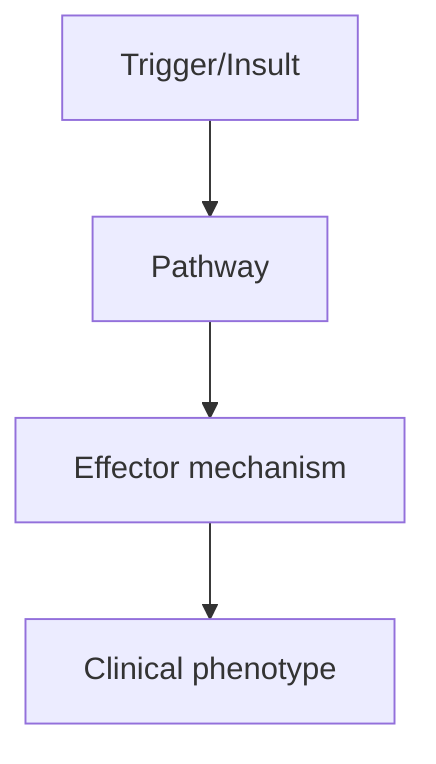
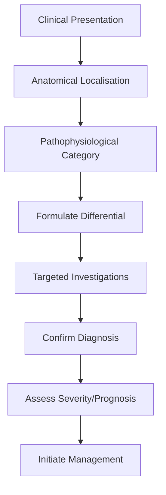

# Secondary Progressive MS

> [!tip] **High-Yield Definition**
> Secondary progressive MS (SPMS): initial RRMS followed by progressive disability accumulation independent of relapses. Conversion from RRMS to SPMS: ~50% by 15 years, ~80% by 30 years. Confirmed disability progression (CDP) over 6-12 months.

---

## 1. Definition / Epidemiology / Classification

### Definition
Secondary progressive MS (SPMS): initial RRMS followed by progressive disability accumulation independent of relapses. Conversion from RRMS to SPMS: ~50% by 15 years, ~80% by 30 years. Confirmed disability progression (CDP) over 6-12 months.

### Epidemiology
SPMS accounts for 15-30% of all MS at any time. Median time RRMS to SPMS: 15-20 years. Earlier onset, higher relapse rate, brainstem/spinal involvement, incomplete recovery predict faster conversion.

### Classification
| Variant | Key Features | Prognosis |
|---------|-------------|-----------|
| | | |

---

## 2. Aetiology / Pathophysiology

### Aetiology
Mechanisms shift from inflammatory (RRMS) to neurodegenerative (SPMS). Compartmentalised CNS inflammation, microglial activation, mitochondrial dysfunction, axonal loss, cortical demyelination. Risk factors: age, disease duration, male sex, motor/cerebellar involvement, early brain atrophy.

### Pathophysiology


---

## 3. Clinical Features

### History
- **Onset/Duration:**
- **Progression:**
- **Key symptoms:**
- **Triggers:**
- **Systemic symptoms:**
- **Drug/Family/Social history:**

### Examination
| Domain | Key Findings | Localisation Value |
|--------|-------------|-------------------|
| | | |

### Specific Clinical Features
Progressive disability accumulation over ≥6-12 months independent of relapses. May have superimposed relapses ('relapsing SPMS'). Common phenotypes: progressive motor (spastic paraparesis), progressive cerebellar (ataxia), progressive cognitive. EDSS milestones: EDSS 4 (walking 500m unaided), 6 (walking 100m with aid), 6.5 (unilateral assistance), 7 (wheelchair-bound).

---

## 4. Diagnostic Approach / Algorithm



---

## 5. Investigations

MRI: progressive brain atrophy, T2 lesion burden, fewer new gadolinium-enhancing lesions, slowly expanding lesions (SELs), spinal cord atrophy. Serum NfL (neurofilament light chain) - elevated, prognostic. CSF: OCBs positive (persistent). No relapses needed for diagnosis.

---

## 6. Differential Diagnosis

| Differential | Distinguishing Features | Key Test |
|--------------|------------------------|----------|
| | | |

---

## 7. Management

DMTs: siponimod (only DMT approved for active SPMS in some countries, reduces 3-month CDP by 21%), may consider platform DMTs (IFN-β, glatiramer) for ongoing relapses. Symptomatic: spasticity (baclofen, tizanidine, gabapentin, intrathecal baclofen, BoNT), fatigue (amantadine, modafinil), pain (gabapentin, pregabalin, duloxetine, TCAs), bladder (oxybutynin, mirabegron, intermittent self-catheterisation), mobility (physiotherapy, FES, walking aids). Multidisciplinary: neurorehabilitation, OT, neuropsychology. Neuroprotection: high-dose biotin (MD1003, controversial), lipoic acid, clemastine (remyelination, experimental).

---

## 8. Drug Interactions / Contraindications / Comorbidity Cautions

| Drug | Interaction / Caution | Management |
|------|----------------------|------------|
| | | |

---

## 9. Procedures (if applicable)

### Procedure:
- **Indications:**
- **Contraindications:**
- **Preparation / Principle:**
- **Complications:**
- **Viva Pearls:**

---

## 10. Complications

| Complication | Frequency | Prevention / Monitoring | Management |
|--------------|-----------|------------------------|------------|
| | | | |

---

## 11. Red Flags / Emergencies

Rapid progression, cognitive decline, falls, infections, pressure sores, DVT/PE, aspiration.

---

## 12. Prognosis

Median time from onset to EDSS 6 (walking aid): 20-30 years. SPMS worse prognosis than RRMS. Median survival: 35-45 years from onset. Cause of death: MS-related (pneumonia, sepsis, aspiration, suicide) in 50-70%.

---

## 13. Topic Correlation

| Related Topic | Link | Key Overlap |
|---------------|------|-------------|
| | | |

---

## 14. Special Situations

| Situation | Consideration |
|-----------|---------------|
| **Pregnancy** | |
| **Lactation** | |
| **Paediatric** | |
| **Elderly / Frail** | |
| **Renal impairment** | |
| **Hepatic impairment** | |
| **Immunocompromised** | |
| **Perioperative** | |
| **Driving / DVLA** | |
| **Occupational** | |

---

## FCPS/MRCP High-Yield Summary

| Category | Key Points |
|----------|------------|
| **Definition** | Secondary progressive MS (SPMS): initial RRMS followed by progressive disability accumulation independent of relapses. Conversion from RRMS to SPMS: ~50% by 15 years, ~80% by 30 years. Confirmed disab |
| **Epidemiology** | SPMS accounts for 15-30% of all MS at any time. Median time RRMS to SPMS: 15-20 years. Earlier onset, higher relapse rate, brainstem/spinal involvemen |
| **Pathophysiology** | |
| **Clinical** | Progressive disability accumulation over ≥6-12 months independent of relapses. May have superimposed relapses ('relapsing SPMS'). Common phenotypes: progressive motor (spastic paraparesis), progressiv |
| **Diagnosis** | |
| **Investigations** | MRI: progressive brain atrophy, T2 lesion burden, fewer new gadolinium-enhancing lesions, slowly expanding lesions (SELs), spinal cord atrophy. Serum NfL (neurofilament light chain) - elevated, progno |
| **Management** | DMTs: siponimod (only DMT approved for active SPMS in some countries, reduces 3-month CDP by 21%), may consider platform DMTs (IFN-β, glatiramer) for ongoing relapses. Symptomatic: spasticity (baclofe |
| **Complications** | |
| **Prognosis** | Median time from onset to EDSS 6 (walking aid): 20-30 years. SPMS worse prognosis than RRMS. Median survival: 35-45 years from onset. Cause of death: MS-related (pneumonia, sepsis, aspiration, suicide |
| **Viva Pearls** | |
| **Drug Doses** | |
| **Scoring Systems** | |
| **Genetics** | |
| **Imaging Signs** | |

---

## Viva Questions (PACES/FCPS Style)

1. **Q:** Define Secondary Progressive MS and classify its variants.
   **A:** Based on the definition above.

2. **Q:** What are the key clinical features?
   **A:** Progressive disability accumulation over ≥6-12 months independent of relapses. May have superimposed relapses ('relapsing SPMS'). Common phenotypes: progressive motor (spastic paraparesis), progressive cerebellar (ataxia), progressive cognitive. EDSS milestones: EDSS 4 (walking 500m unaided), 6 (wal

3. **Q:** What is the first-line treatment?
   **A:** Based on the management section.

4. **Q:** What are the red flags requiring urgent referral?
   **A:** Rapid progression, cognitive decline, falls, infections, pressure sores, DVT/PE, aspiration.

5. **Q:** What is the prognosis?
   **A:** Median time from onset to EDSS 6 (walking aid): 20-30 years. SPMS worse prognosis than RRMS. Median survival: 35-45 years from onset. Cause of death: MS-related (pneumonia, sepsis, aspiration, suicide) in 50-70%.

6. **Q:** How do you differentiate Secondary Progressive MS from key differentials?
   **A:** Clinical features, investigations, and response to treatment.

7. **Q:** What investigations are most useful?
   **A:** Based on the investigations section.

8. **Q:** Describe the stepwise management approach.
   **A:** Based on the management algorithm.

9. **Q:** What are the emergency presentations?
   **A:** Based on the red flags section.

10. **Q:** How does management change in pregnancy/paediatrics/elderly?
    **A:** Special considerations per population.

---

## Common Confusions / Exam Traps

| Confusion | Clarification |
|-----------|---------------|
| | |

---

## Mnemonics
1. **SPMS = RRMS → progression** — Initially relapsing, then progressive (with or without relapses)
1. **Onset typically 15-20y after RRMS** — 50% of RRMS convert to SPMS within 15-20y
1. **TREATMENT** — Siponimod (Mayzent), cladribine, ocrelizumab (active SPMS); less benefit in inactive

---

## Mind Map

```mermaid
mindmap
  root((Secondary Progressive MS (SPMS)))
    Definition
    Epidemiology
    Pathophysiology
    Clinical Features
    Investigations
    Differential Diagnosis
    Management
      Acute
      Long-term
    Complications
    Prognosis
```

---

## Spaced Repetition Trackers

| Review Interval | Date | Score (0-5) | Notes |
|-----------------|------|-------------|-------|
| Day 1 | | | |
| Day 3 | | | |
| Day 7 | | | |
| Day 14 | | | |
| Day 30 | | | |
| Day 90 | | | |

---

## Self-Test Scorecard

| Section | Score /5 | Last Attempt |
|---------|----------|--------------|
| Definition & Epidemiology | | |
| Pathophysiology | | |
| Clinical Features | | |
| Investigations | | |
| Differential Diagnosis | | |
| Management | | |
| Complications & Prognosis | | |
| Viva Questions | | |
| MCQs | | |
| SBAs | | |

---

## MCQs (10)

1. **Question:** SPMS definition:
   **Options:** A. Initial RRMS followed by progressive worsening (with/without relapses), ≥6 months B. Progressive from onset C. Relapsing-remitting only D. Benign
   **Answer:** A
   **Explanation:** SPMS: initial RRMS, then progressive worsening (with or without occasional relapses), confirmed ≥6 months.

2. **Question:** Time from RRMS to SPMS:
   **Options:** A. 15-20 years (50% convert by then) B. 5 years (90%) C. 30 years (10%) D. Immediately
   **Answer:** A
   **Explanation:** RRMS to SPMS: median 15-20y. 50% of RRMS convert within 20y. Older age, motor onset, more relapses earlier = faster conversion.

3. **Question:** Active SPMS is defined as:
   **Options:** A. Clinical relapse or MRI activity (new/enlarging T2 or enhancing) in past 2 years B. No activity C. Always active D. Genetic
   **Answer:** A
   **Explanation:** Active SPMS: clinical relapse OR MRI activity (new/enlarging T2, enhancing) in past 2 years. Inactive: no activity.

4. **Question:** DMTs approved for active SPMS:
   **Options:** A. Siponimod, cladribine, ocrelizumab (interferon, glatiramer less effective) B. All DMTs equal C. Only interferon D. Only natalizumab
   **Answer:** A
   **Explanation:** Active SPMS: siponimod (Mayzent, S1P modulator), cladribine, ocrelizumab. Inactive: limited options.

5. **Question:** Siponimod mechanism:
   **Options:** A. S1P receptor modulator (S1P1 + S1P5) B. Anti-CD20 C. Anti-α4-integrin D. DNA synthesis
   **Answer:** A
   **Explanation:** Siponimod: S1P1 + S1P5 modulator. Selective, may have better safety profile than fingolimod.

6. **Question:** SPMS pathophysiology:
   **Options:** A. Aging, mitochondrial dysfunction, cortical demyelination, B-cell involvement, oxidative injury B. Only relapses C. Only inflammation D. Only genetic
   **Answer:** A
   **Explanation:** SPMS: shift from relapsing (inflammatory) to progressive (neurodegenerative). Mitochondrial dysfunction, cortical demyelination, B-cell mediated, oxidative injury, iron accumulation.

7. **Question:** Why DMTs less effective in SPMS:
   **Options:** A. Shift from inflammation to neurodegeneration; less inflammatory activity to suppress B. All DMTs work the same C. Progression is faster D. DMTs are toxic
   **Answer:** A
   **Explanation:** SPMS: less inflammatory activity (relapses, enhancing lesions). DMTs suppress inflammation. Neurodegeneration not directly addressed. Some benefit in early active SPMS.

8. **Question:** Progression independent of relapse activity (PIRA) in SPMS:
   **Options:** A. Silent progression on MRI even without relapses - hallmark of progressive MS B. Only in relapses C. Only in RRMS D. Genetic
   **Answer:** A
   **Explanation:** PIRA: silent progression on MRI (atrophy, new T2) without relapses. Hallmark of progressive MS. SMART concept.

---

## SBA Questions (10)

1. **Scenario:** 45-year-old, RRMS for 15 years, now progressive myelopathy, no relapses, no enhancing lesions. Diagnosis?
   **Options:** A. SPMS (inactive) B. PPMS C. RRMS D. Acute relapse E. None
   **Answer:** A
   **Explanation:** SPMS inactive: progressive worsening, no clinical relapse or MRI activity. Limited DMT options. Symptomatic management.

2. **Scenario:** SPMS patient with relapse and enhancing lesion. Treatment?
   **Options:** A. Siponimod or ocrelizumab (active SPMS) B. No DMT C. More steroids D. Surgery E. Plasma exchange
   **Answer:** A
   **Explanation:** Active SPMS: siponimod (Mayzent), ocrelizumab, cladribine. Slows disability progression.

3. **Scenario:** SPMS treatment symptomatic for spasticity:
   **Options:** A. Baclofen, tizanidine, gabapentin, intrathecal baclofen pump B. More DMT C. Steroids D. Surgery E. Plasma exchange
   **Answer:** A
   **Explanation:** SPMS spasticity: baclofen, tizanidine, gabapentin. Intrathecal baclofen for severe. Sativex (THC/CBD). Physiotherapy.

---

## Tags

**Tags:** #neurology #demyelinating #MS #SPMS #progressive #siponimod #ocrelizumab #FCPS #MRCP

---

## Local Navigation
**Heading Hub:** [[../Multiple Sclerosis Hub]]
**Chapter Hierarchy:** [[../../Davidson Chapter 25 - Neurology Hierarchy]]
**Chapter MOC:** [[../../Neurology MOC]]
**Drug Reference:** [[../../00_Index/Neurology Drug Reference]]