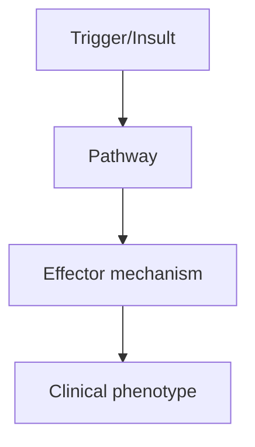
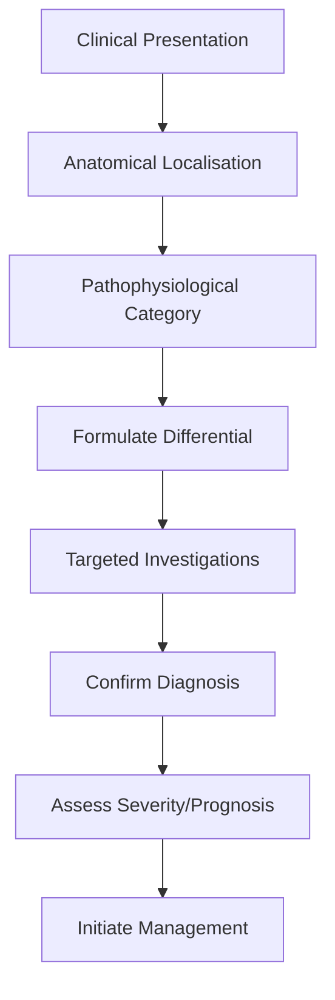

# Acute Transverse Myelitis

> [!tip] **High-Yield Definition**
> Acute transverse myelitis (ATM): inflammation of spinal cord, acute onset, motor + sensory + autonomic dysfunction, with sensory level. Acute myelopathy excluding compressive, vascular, metabolic causes.

---

## 1. Definition / Epidemiology / Classification

### Definition
Acute transverse myelitis (ATM): inflammation of spinal cord, acute onset, motor + sensory + autonomic dysfunction, with sensory level. Acute myelopathy excluding compressive, vascular, metabolic causes.

### Epidemiology
Incidence: 1-8/100,000/year. Bimodal: 10-20y, 30-40y. Causes: MS (15-30%), NMOSD (AQP4), MOGAD, idiopathic (15-30%), infection (viral, bacterial, TB, Mycoplasma), post-infectious, post-vaccination, paraneoplastic, sarcoid, vasculitis (SLE, Behçet's, APS).

### Classification
| Variant | Key Features | Prognosis |
|---------|-------------|-----------|
| | | |

---

## 2. Aetiology / Pathophysiology

### Aetiology
MS: partial, short-segment (<3 vertebral bodies), asymmetric, often posterior. NMOSD (AQP4): LETM (≥3 VB), central, severe, optic neuritis history. MOGAD: LETM, conus, often post-infectious. Infectious: direct (HTLV-1, HIV, syphilis, Lyme, Mycoplasma, TB) or post-infectious autoimmune. Sarcoid: longitudinally extensive, meningeal enhancement, systemic features. Paraneoplastic: anti-CRMP5, anti-amphiphysin, anti-GAD. Idiopathic: 15-30%.

### Pathophysiology


---

## 3. Clinical Features

### History
- **Onset/Duration:**
- **Progression:**
- **Key symptoms:**
- **Triggers:**
- **Systemic symptoms:**
- **Drug/Family/Social history:**

### Examination
| Domain | Key Findings | Localisation Value |
|--------|-------------|-------------------|
| | | |

### Specific Clinical Features
Acute (hours-days) or subacute (days-weeks). Motor: weakness (paraparesis, quadriparesis), UMN signs, spasticity. Sensory: paraesthesia, sensory level (often thoracic), pain (radicular, deep, Lhermitte's). Autonomic: bladder (retention, urgency), bowel (constipation, incontinence), sexual dysfunction. Severity: ASIA A-E (A=complete, E=normal). Spinal shock: flaccid, areflexic, autonomic dysfunction (hypotension, bradycardia).

---

## 4. Diagnostic Approach / Algorithm



---

## 5. Investigations

EMERGENCY MRI spine with gadolinium: exclude compressive lesion, identify lesion (T2 hyperintensity, swelling, enhancement, length - short vs LETM). MRI brain: look for MS lesions, ADEM, NMO. CSF: pleocytosis (lymphocytic/neutrophilic), protein, OCBs (MS), anti-AQP4, anti-MOG (serum preferred). Bloods: ANA, ANCA, ACE, infection screen, paraneoplastic, B12, copper. ASIA scoring for severity.

---

## 6. Differential Diagnosis

| Differential | Distinguishing Features | Key Test |
|--------------|------------------------|----------|
| | | |

---

## 7. Management

EMERGENCY: high-dose IV methylprednisolone 1g/day ×3-5 days. If poor response: plasma exchange (5 exchanges over 7-10 days). IVIG 2g/kg (especially MOGAD, post-infectious). Supportive: bladder (intermittent self-catheterisation), bowel, DVT prophylaxis, pressure area care, physiotherapy. Spasticity: baclofen, tizanidine. Pain: gabapentin, pregabalin, amitriptyline. Long-term: DMT for MS, NMOSD, MOGAD (relapsing). Treat underlying cause (sarcoid, infection, paraneoplastic). Rehabilitation: critical, intensive physiotherapy.

---

## 8. Drug Interactions / Contraindications / Comorbidity Cautions

| Drug | Interaction / Caution | Management |
|------|----------------------|------------|
| | | |

---

## 9. Procedures (if applicable)

### Procedure:
- **Indications:**
- **Contraindications:**
- **Preparation / Principle:**
- **Complications:**
- **Viva Pearls:**

---

## 10. Complications

| Complication | Frequency | Prevention / Monitoring | Management |
|--------------|-----------|------------------------|------------|
| | | | |

---

## 11. Red Flags / Emergencies

Respiratory failure (high cervical, C3-5), autonomic dysreflexia, urinary retention (overdistension), pressure sores, DVT/PE, spasticity, chronic pain.

---

## 12. Prognosis

Variable. MS: usually good recovery. NMOSD (AQP4): poor recovery, high relapse risk. MOGAD: moderate recovery, 50% relapse. Idiopathic: 30-50% complete recovery, 20-30% partial, 10-20% no recovery. Worse prognosis: severe initial deficit, rapid progression, LETM, AQP4+, older age, no response to steroids.

---

## 13. Topic Correlation

| Related Topic | Link | Key Overlap |
|---------------|------|-------------|
| | | |

---

## 14. Special Situations

| Situation | Consideration |
|-----------|---------------|
| **Pregnancy** | |
| **Lactation** | |
| **Paediatric** | |
| **Elderly / Frail** | |
| **Renal impairment** | |
| **Hepatic impairment** | |
| **Immunocompromised** | |
| **Perioperative** | |
| **Driving / DVLA** | |
| **Occupational** | |

---

## FCPS/MRCP High-Yield Summary

| Category | Key Points |
|----------|------------|
| **Definition** | Acute transverse myelitis (ATM): inflammation of spinal cord, acute onset, motor + sensory + autonomic dysfunction, with sensory level. Acute myelopathy excluding compressive, vascular, metabolic caus |
| **Epidemiology** | Incidence: 1-8/100,000/year. Bimodal: 10-20y, 30-40y. Causes: MS (15-30%), NMOSD (AQP4), MOGAD, idiopathic (15-30%), infection (viral, bacterial, TB,  |
| **Pathophysiology** | |
| **Clinical** | Acute (hours-days) or subacute (days-weeks). Motor: weakness (paraparesis, quadriparesis), UMN signs, spasticity. Sensory: paraesthesia, sensory level (often thoracic), pain (radicular, deep, Lhermitt |
| **Diagnosis** | |
| **Investigations** | EMERGENCY MRI spine with gadolinium: exclude compressive lesion, identify lesion (T2 hyperintensity, swelling, enhancement, length - short vs LETM). MRI brain: look for MS lesions, ADEM, NMO. CSF: ple |
| **Management** | EMERGENCY: high-dose IV methylprednisolone 1g/day ×3-5 days. If poor response: plasma exchange (5 exchanges over 7-10 days). IVIG 2g/kg (especially MOGAD, post-infectious). Supportive: bladder (interm |
| **Complications** | |
| **Prognosis** | Variable. MS: usually good recovery. NMOSD (AQP4): poor recovery, high relapse risk. MOGAD: moderate recovery, 50% relapse. Idiopathic: 30-50% complete recovery, 20-30% partial, 10-20% no recovery. Wo |
| **Viva Pearls** | |
| **Drug Doses** | |
| **Scoring Systems** | |
| **Genetics** | |
| **Imaging Signs** | |

---

## Viva Questions (PACES/FCPS Style)

1. **Q:** Define Acute Transverse Myelitis and classify its variants.
   **A:** Based on the definition above.

2. **Q:** What are the key clinical features?
   **A:** Acute (hours-days) or subacute (days-weeks). Motor: weakness (paraparesis, quadriparesis), UMN signs, spasticity. Sensory: paraesthesia, sensory level (often thoracic), pain (radicular, deep, Lhermitte's). Autonomic: bladder (retention, urgency), bowel (constipation, incontinence), sexual dysfunctio

3. **Q:** What is the first-line treatment?
   **A:** Based on the management section.

4. **Q:** What are the red flags requiring urgent referral?
   **A:** Respiratory failure (high cervical, C3-5), autonomic dysreflexia, urinary retention (overdistension), pressure sores, DVT/PE, spasticity, chronic pain.

5. **Q:** What is the prognosis?
   **A:** Variable. MS: usually good recovery. NMOSD (AQP4): poor recovery, high relapse risk. MOGAD: moderate recovery, 50% relapse. Idiopathic: 30-50% complete recovery, 20-30% partial, 10-20% no recovery. Worse prognosis: severe initial deficit, rapid progression, LETM, AQP4+, older age, no response to ste

6. **Q:** How do you differentiate Acute Transverse Myelitis from key differentials?
   **A:** Clinical features, investigations, and response to treatment.

7. **Q:** What investigations are most useful?
   **A:** Based on the investigations section.

8. **Q:** Describe the stepwise management approach.
   **A:** Based on the management algorithm.

9. **Q:** What are the emergency presentations?
   **A:** Based on the red flags section.

10. **Q:** How does management change in pregnancy/paediatrics/elderly?
    **A:** Special considerations per population.

---

## Common Confusions / Exam Traps

| Confusion | Clarification |
|-----------|---------------|
| | |

---

## Mnemonics
1. **ATM diagnostic criteria** — Bilateral (not necessarily symmetric) sensorimotor + autonomic dysfunction attributable to spinal cord, bilateral level, no compression, inflammation (CSF pleocytosis or enhancement)
1. **Longitudinally extensive lesion (LETM) = >3 vertebral segments** — Suggests NMOSD, MOGAD, sarcoid, ADEM, tumour
1. **Anti-MOG vs AQP4** — MOGAD: optic neuritis + LETM, ADEM-like; AQP4: NMOSD, longitudinally extensive, severe

---

## Mind Map

```mermaid
mindmap
  root((Acute Transverse Myelitis (ATM)))
    Definition
    Epidemiology
    Pathophysiology
    Clinical Features
    Investigations
    Differential Diagnosis
    Management
      Acute
      Long-term
    Complications
    Prognosis
```

---

## Spaced Repetition Trackers

| Review Interval | Date | Score (0-5) | Notes |
|-----------------|------|-------------|-------|
| Day 1 | | | |
| Day 3 | | | |
| Day 7 | | | |
| Day 14 | | | |
| Day 30 | | | |
| Day 90 | | | |

---

## Self-Test Scorecard

| Section | Score /5 | Last Attempt |
|---------|----------|--------------|
| Definition & Epidemiology | | |
| Pathophysiology | | |
| Clinical Features | | |
| Investigations | | |
| Differential Diagnosis | | |
| Management | | |
| Complications & Prognosis | | |
| Viva Questions | | |
| MCQs | | |
| SBAs | | |

---

## MCQs (10)

1. **Question:** Acute transverse myelitis features:
   **Options:** A. Bilateral (can be asymmetric) sensorimotor + autonomic dysfunction B. Always symmetric C. Only sensory D. Only motor
   **Answer:** A
   **Explanation:** ATM: bilateral (may be asymmetric) sensorimotor + autonomic (bladder/bowel).

2. **Question:** ATM causes include:
   **Options:** A. Idiopathic, MS, NMOSD, MOGAD, ADEM, infectious, sarcoid, paraneoplastic B. Genetic only C. Vascular only D. Trauma only
   **Answer:** A
   **Explanation:** ATM causes: idiopathic/post-infectious (most), MS (relapse), NMOSD (AQP4), MOGAD, ADEM, infectious (TB, viral, Lyme), sarcoid, paraneoplastic.

3. **Question:** MRI in ATM shows:
   **Options:** A. T2 hyperintense, cord swelling, enhancement (longitudinally extensive or short) B. Normal cord C. Disc herniation D. Tumour
   **Answer:** A
   **Explanation:** ATM: T2 hyperintense cord lesion, may be cord swelling, post-contrast enhancement. LETM >3 segments in NMOSD/MOGAD.

4. **Question:** CSF in ATM:
   **Options:** A. Lymphocytic pleocytosis, mildly elevated protein, OCB variable B. Normal C. Polymorphonuclear D. High protein only
   **Answer:** A
   **Explanation:** CSF: pleocytosis (lymphocytic), ↑protein. OCB if MS.

5. **Question:** ATM first-line treatment:
   **Options:** A. IV methylprednisolone 1g/day × 3-5d B. IVIG only C. Plasma exchange D. Surgery
   **Answer:** A
   **Explanation:** ATM: IV methylprednisolone 1g/day × 3-5d. PLEX if poor response. Supportive care (bladder, DVT, pressure sores).

6. **Question:** Longitudinally extensive TM (LETM) suggests:
   **Options:** A. NMOSD, MOGAD, sarcoid, ADEM (not typical MS) B. MS (short lesions) C. Trauma D. Ischaemia
   **Answer:** A
   **Explanation:** LETM >3 vertebral segments: NMOSD, MOGAD, sarcoid, ADEM. MS: short segment (usually <2 segments).

7. **Question:** ATM bladder management:
   **Options:** A. Indwelling catheter initially, then intermittent self-catheterisation B. Permanent catheter C. No management D. Wait
   **Answer:** A
   **Explanation:** ATM: urinary retention common. Indwelling catheter initially, then intermittent self-catheterisation. Urodynamics later.

---

## SBA Questions (10)

1. **Scenario:** 35-year-old, rapid bilateral leg weakness, sensory level T8, urinary retention. MRI: LETM T4-T10. Anti-AQP4 positive. Diagnosis?
   **Options:** A. NMOSD (AQP4-IgG) B. MS C. MOGAD D. Idiopathic ATM E. Compressive myelopathy
   **Answer:** A
   **Explanation:** LETM + AQP4-IgG = NMOSD. Treatment: steroids + PLEX + maintenance (rituximab, eculizumab, tocilizumab).

2. **Scenario:** Acute TM, no response to IV methylprednisolone 5 days. Next step?
   **Options:** A. Plasma exchange (5-7 exchanges) B. More steroids C. Surgery D. No further treatment E. Add baclofen
   **Answer:** A
   **Explanation:** Refractory ATM: PLEX (plasma exchange) 5-7 exchanges every other day. Add IVIG in some cases.

3. **Scenario:** Anti-MOG positive LETM + optic neuritis. Diagnosis?
   **Options:** A. MOG antibody-associated disease (MOGAD) B. MS C. NMOSD D. ADEM E. Idiopathic
   **Answer:** A
   **Explanation:** MOGAD: anti-MOG positive, often LETM + optic neuritis. Treatment: steroids, PLEX, maintenance (rituximab, mycophenolate).

---

## Tags

**Tags:** #neurology #demyelinating #transverse-myelitis #ATM #LETM #AQP4 #MOG #FCPS #MRCP

---

## Local Navigation
**Heading Hub:** [[../Related Demyelinating Disorders Hub]]
**Chapter Hierarchy:** [[../../Davidson Chapter 25 - Neurology Hierarchy]]
**Chapter MOC:** [[../../Neurology MOC]]
**Drug Reference:** [[../../00_Index/Neurology Drug Reference]]