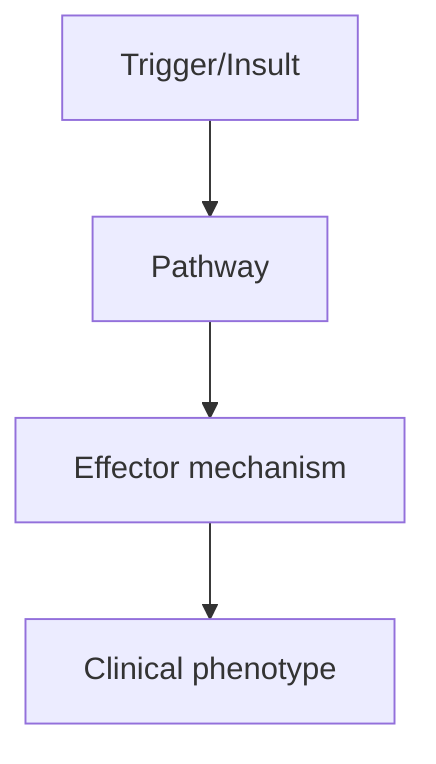
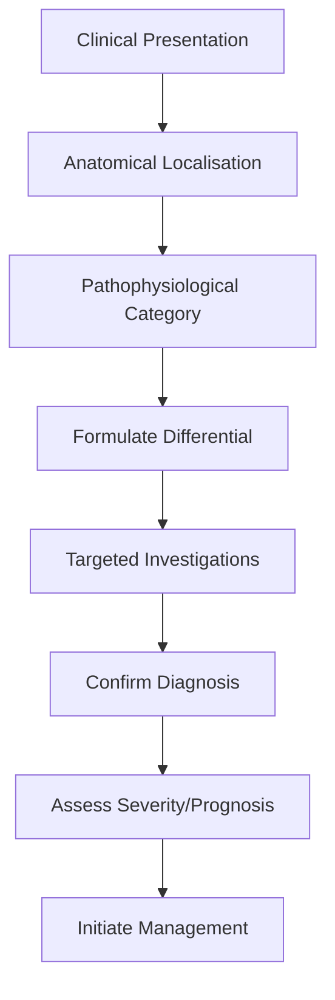

# Clinically Isolated Syndrome

> [!tip] **High-Yield Definition**
> CIS: first demyelinating event of the CNS, lasting >24h, with no prior history, not explained by other disease. Can be optic neuritis, transverse myelitis, brainstem, cerebellar, hemispheric. If MRI meets McDonald criteria, diagnosed as MS.

---

## 1. Definition / Epidemiology / Classification

### Definition
CIS: first demyelinating event of the CNS, lasting >24h, with no prior history, not explained by other disease. Can be optic neuritis, transverse myelitis, brainstem, cerebellar, hemispheric. If MRI meets McDonald criteria, diagnosed as MS.

### Epidemiology
Incidence: 3-5/100,000/year. Conversion to MS: 30-50% within 2 years, 70% within 10 years, 80% within 15 years (higher if MRI lesions at baseline).

### Classification
| Variant | Key Features | Prognosis |
|---------|-------------|-----------|
| | | |

---

## 2. Aetiology / Pathophysiology

### Aetiology
Same as MS: autoimmune demyelination, EBV association, genetic (HLA-DRB1*15:01), vitamin D, smoking. RIS (radiologically isolated syndrome) is asymptomatic MRI-detected demyelination.

### Pathophysiology


---

## 3. Clinical Features

### History
- **Onset/Duration:**
- **Progression:**
- **Key symptoms:**
- **Triggers:**
- **Systemic symptoms:**
- **Drug/Family/Social history:**

### Examination
| Domain | Key Findings | Localisation Value |
|--------|-------------|-------------------|
| | | |

### Specific Clinical Features
Optic neuritis: unilateral, painful, RAPD, central scotoma, partial resolution. Transverse myelitis: bilateral, sensory level, bladder/bowel. Brainstem: diplopia, vertigo, facial numbness, INO. Cerebellar: ataxia, dysarthria, nystagmus. Hemispheric: hemiparesis, hemisensory, cognitive. Must exclude: ADEM, NMOSD, MOGAD, vascular, compressive, infectious, sarcoid, lymphoma, Behçet's, metabolic (B12).

---

## 4. Diagnostic Approach / Algorithm



---

## 5. Investigations

MRI brain + spine with gadolinium (key): dissemination in space (DIS) - ≥1 T2 lesion in ≥2 of 4 CNS locations (periventricular, cortical/juxtacortical, infratentorial, spinal cord). Dissemination in time (DIT) - simultaneous enhancing + non-enhancing lesions, new T2/Gd+ lesion on follow-up, OCBs (per 2017 McDonald). CSF: OCBs (predict conversion), IgG index. Evoked potentials (VEP - delayed P100 in MS). Bloods: exclude alternative (ANA, ANCA, AQP4, MOG, ACE).

---

## 6. Differential Diagnosis

| Differential | Distinguishing Features | Key Test |
|--------------|------------------------|----------|
| | | |

---

## 7. Management

If MRI meets McDonald: diagnose MS, start DMT. If not: high-risk CIS (≥1 T2 lesion, OCBs) - consider DMT (IFN-β, glatiramer - CIS trials show delay to clinically definite MS). Acute treatment: high-dose IV methylprednisolone 1g/day ×3-5 days (faster recovery, not long-term benefit). Symptomatic: fatigue, pain, spasticity, bladder. Lifestyle: vitamin D, smoking cessation, exercise.

---

## 8. Drug Interactions / Contraindications / Comorbidity Cautions

| Drug | Interaction / Caution | Management |
|------|----------------------|------------|
| | | |

---

## 9. Procedures (if applicable)

### Procedure:
- **Indications:**
- **Contraindications:**
- **Preparation / Principle:**
- **Complications:**
- **Viva Pearls:**

---

## 10. Complications

| Complication | Frequency | Prevention / Monitoring | Management |
|--------------|-----------|------------------------|------------|
| | | | |

---

## 11. Red Flags / Emergencies

Bilateral optic neuritis, severe myelitis, persistent neurology, atypical features, NMOSD/MOGAD features (longitudinally extensive spinal cord, bilateral ON).

---

## 12. Prognosis

Conversion to MS: 30-50% at 2y, 70% at 10y, 80% at 15y. Predictors of conversion: MRI lesions at baseline (most important), CSF OCBs, brainstem/spinal onset, age, sex. Early DMT delays conversion and disability.

---

## 13. Topic Correlation

| Related Topic | Link | Key Overlap |
|---------------|------|-------------|
| | | |

---

## 14. Special Situations

| Situation | Consideration |
|-----------|---------------|
| **Pregnancy** | |
| **Lactation** | |
| **Paediatric** | |
| **Elderly / Frail** | |
| **Renal impairment** | |
| **Hepatic impairment** | |
| **Immunocompromised** | |
| **Perioperative** | |
| **Driving / DVLA** | |
| **Occupational** | |

---

## FCPS/MRCP High-Yield Summary

| Category | Key Points |
|----------|------------|
| **Definition** | CIS: first demyelinating event of the CNS, lasting >24h, with no prior history, not explained by other disease. Can be optic neuritis, transverse myelitis, brainstem, cerebellar, hemispheric. If MRI m |
| **Epidemiology** | Incidence: 3-5/100,000/year. Conversion to MS: 30-50% within 2 years, 70% within 10 years, 80% within 15 years (higher if MRI lesions at baseline). |
| **Pathophysiology** | |
| **Clinical** | Optic neuritis: unilateral, painful, RAPD, central scotoma, partial resolution. Transverse myelitis: bilateral, sensory level, bladder/bowel. Brainstem: diplopia, vertigo, facial numbness, INO. Cerebe |
| **Diagnosis** | |
| **Investigations** | MRI brain + spine with gadolinium (key): dissemination in space (DIS) - ≥1 T2 lesion in ≥2 of 4 CNS locations (periventricular, cortical/juxtacortical, infratentorial, spinal cord). Dissemination in t |
| **Management** | If MRI meets McDonald: diagnose MS, start DMT. If not: high-risk CIS (≥1 T2 lesion, OCBs) - consider DMT (IFN-β, glatiramer - CIS trials show delay to clinically definite MS). Acute treatment: high-do |
| **Complications** | |
| **Prognosis** | Conversion to MS: 30-50% at 2y, 70% at 10y, 80% at 15y. Predictors of conversion: MRI lesions at baseline (most important), CSF OCBs, brainstem/spinal onset, age, sex. Early DMT delays conversion and  |
| **Viva Pearls** | |
| **Drug Doses** | |
| **Scoring Systems** | |
| **Genetics** | |
| **Imaging Signs** | |

---

## Viva Questions (PACES/FCPS Style)

1. **Q:** Define Clinically Isolated Syndrome and classify its variants.
   **A:** Based on the definition above.

2. **Q:** What are the key clinical features?
   **A:** Optic neuritis: unilateral, painful, RAPD, central scotoma, partial resolution. Transverse myelitis: bilateral, sensory level, bladder/bowel. Brainstem: diplopia, vertigo, facial numbness, INO. Cerebellar: ataxia, dysarthria, nystagmus. Hemispheric: hemiparesis, hemisensory, cognitive. Must exclude:

3. **Q:** What is the first-line treatment?
   **A:** Based on the management section.

4. **Q:** What are the red flags requiring urgent referral?
   **A:** Bilateral optic neuritis, severe myelitis, persistent neurology, atypical features, NMOSD/MOGAD features (longitudinally extensive spinal cord, bilateral ON).

5. **Q:** What is the prognosis?
   **A:** Conversion to MS: 30-50% at 2y, 70% at 10y, 80% at 15y. Predictors of conversion: MRI lesions at baseline (most important), CSF OCBs, brainstem/spinal onset, age, sex. Early DMT delays conversion and disability.

6. **Q:** How do you differentiate Clinically Isolated Syndrome from key differentials?
   **A:** Clinical features, investigations, and response to treatment.

7. **Q:** What investigations are most useful?
   **A:** Based on the investigations section.

8. **Q:** Describe the stepwise management approach.
   **A:** Based on the management algorithm.

9. **Q:** What are the emergency presentations?
   **A:** Based on the red flags section.

10. **Q:** How does management change in pregnancy/paediatrics/elderly?
    **A:** Special considerations per population.

---

## Common Confusions / Exam Traps

| Confusion | Clarification |
|-----------|---------------|
| | |

---

## Mnemonics
1. **CIS = first demyelinating event** — Single episode, can be optic neuritis, brainstem, spinal cord, cerebral
1. **RISK of MS** — Depends on MRI lesions at baseline (Barkhof criteria)
1. **EARLY DMT** — Reduces conversion to MS by 50% (CHAMPS, BENEFIT, PRECISE trials)

---

## Mind Map

```mermaid
mindmap
  root((Clinically Isolated Syndrome (CIS)))
    Definition
    Epidemiology
    Pathophysiology
    Clinical Features
    Investigations
    Differential Diagnosis
    Management
      Acute
      Long-term
    Complications
    Prognosis
```

---

## Spaced Repetition Trackers

| Review Interval | Date | Score (0-5) | Notes |
|-----------------|------|-------------|-------|
| Day 1 | | | |
| Day 3 | | | |
| Day 7 | | | |
| Day 14 | | | |
| Day 30 | | | |
| Day 90 | | | |

---

## Self-Test Scorecard

| Section | Score /5 | Last Attempt |
|---------|----------|--------------|
| Definition & Epidemiology | | |
| Pathophysiology | | |
| Clinical Features | | |
| Investigations | | |
| Differential Diagnosis | | |
| Management | | |
| Complications & Prognosis | | |
| Viva Questions | | |
| MCQs | | |
| SBAs | | |

---

## MCQs (10)

1. **Question:** CIS definition:
   **Options:** A. First demyelinating event (single episode, ≥24h, no fever/infection) B. First relapse of MS C. Any neurological symptom D. Stroke
   **Answer:** A
   **Explanation:** CIS: first demyelinating event, lasting ≥24h, no fever/infection. Can be optic neuritis, brainstem, spinal cord, cerebral.

2. **Question:** CIS presentations include:
   **Options:** A. Optic neuritis, brainstem, spinal cord, cerebral B. Only optic neuritis C. Only spinal cord D. Only cerebral
   **Answer:** A
   **Explanation:** CIS: optic neuritis (most common), brainstem syndrome, transverse myelitis, cerebral (hemiparesis, hemisensory).

3. **Question:** Risk of conversion to MS after CIS:
   **Options:** A. ~30-50% over 5 years if MRI normal, 80%+ if MRI shows lesions B. 100% C. 0% D. 10%
   **Answer:** A
   **Explanation:** CIS to MS: depends on MRI. Normal MRI: 30-50% over 5y. MRI with lesions: 80%+ over 5-10y. Barkhof criteria predict.

4. **Question:** McDonald 2017 MS criteria require:
   **Options:** A. DIS + DIT (clinical or MRI) B. Two clinical attacks only C. CSF only D. Genetic testing
   **Answer:** A
   **Explanation:** McDonald 2017: DIS (dissemination in space) + DIT (dissemination in time). Clinical or MRI evidence.

5. **Question:** Barkhof criteria include:
   **Options:** A. ≥1 juxtacortical/cortical, ≥1 periventricular, ≥1 infratentorial, ≥1 spinal cord lesion B. Only 1 lesion anywhere C. Only spinal cord D. Bilateral optic neuritis
   **Answer:** A
   **Explanation:** Barkhof criteria: ≥1 juxtacortical/cortical, ≥1 periventricular, ≥1 infratentorial, ≥1 spinal cord. ≥3 of 4 = high risk.

6. **Question:** Early DMT after CIS reduces:
   **Options:** A. Conversion to MS by ~50% (CHAMPS, BENEFIT, PRECISE) B. Mortality C. Stroke risk D. Cognitive decline only
   **Answer:** A
   **Explanation:** Early DMT (interferon-β, glatiramer) after CIS reduces conversion to MS by ~50% over 2-3 years.

7. **Question:** CIS MRI brain in optic neuritis presentation:
   **Options:** A. Often shows silent lesions (periventricular, juxtacortical) B. Always normal C. Always abnormal D. Tumour
   **Answer:** A
   **Explanation:** CIS-ON: MRI often shows silent MS lesions (periventricular, juxtacortical, infratentorial). Barkhof criteria.

8. **Question:** Long-term prognosis of CIS depends on:
   **Options:** A. MRI lesions at baseline, type of CIS, OCB, age B. MRI only C. Age only D. Sex only
   **Answer:** A
   **Explanation:** Prognosis: MRI lesions (most important), OCB positive, brainstem/cord CIS, age, ethnicity.

---

## SBA Questions (10)

1. **Scenario:** 28-year-old, optic neuritis, MRI shows 2 periventricular + 1 juxtacortical lesion. Diagnosis?
   **Options:** A. CIS with high risk of MS (or MS by McDonald 2017 if DIT also met) B. MS confirmed C. Stroke D. Migraine E. Compressive
   **Answer:** A
   **Explanation:** CIS with MRI lesions = high risk of MS. McDonald 2017 may allow MS diagnosis if DIS + DIT met. Offer DMT.

2. **Scenario:** CIS patient, normal MRI brain and spine. Risk of MS?
   **Options:** A. Lower (~30-50% over 5y) - watchful waiting reasonable B. 100% C. 0% D. 10% per year E. 50% per year
   **Answer:** A
   **Explanation:** CIS + normal MRI = lower risk (~30% over 5y). May observe or start DMT depending on patient preference and OCB.

3. **Scenario:** CIS with positive OCB. Should DMT be started?
   **Options:** A. Yes (high risk of MS conversion) B. No C. Wait for second attack D. Surgery E. Plasma exchange
   **Answer:** A
   **Explanation:** CIS + OCB positive = high risk of MS. Early DMT recommended.

---

## Tags

**Tags:** #neurology #demyelinating #CIS #optic-neuritis #MS-risk #Barkhof #DMT #FCPS #MRCP

---

## Local Navigation
**Heading Hub:** [[../Multiple Sclerosis Hub]]
**Chapter Hierarchy:** [[../../Davidson Chapter 25 - Neurology Hierarchy]]
**Chapter MOC:** [[../../Neurology MOC]]
**Drug Reference:** [[../../00_Index/Neurology Drug Reference]]