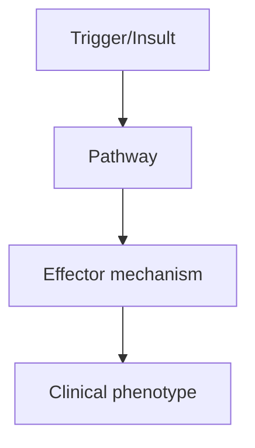
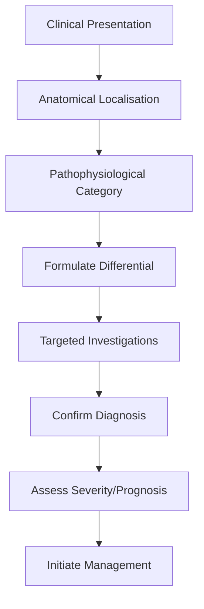

# Disease-Modifying Therapies

> [!tip] **High-Yield Definition**
> DMTs reduce relapse rate, MRI activity, and disability progression in MS. Platform (moderate efficacy), high-efficacy (more effective, more risks). Escalation vs induction approach.

---

## 1. Definition / Epidemiology / Classification

### Definition
DMTs reduce relapse rate, MRI activity, and disability progression in MS. Platform (moderate efficacy), high-efficacy (more effective, more risks). Escalation vs induction approach.

### Epidemiology
20+ DMTs available. Platform DMTs reduce ARR by 30-50%. High-efficacy DMTs reduce ARR by 50-70%, may halt disease activity. Earlier high-efficacy use increasingly favoured (DELIVER-MS, TREAT-MS).

### Classification
| Variant | Key Features | Prognosis |
|---------|-------------|-----------|
| | | |

---

## 2. Aetiology / Pathophysiology

### Aetiology
N/A. Pharmacology.

### Pathophysiology


---

## 3. Clinical Features

### History
- **Onset/Duration:**
- **Progression:**
- **Key symptoms:**
- **Triggers:**
- **Systemic symptoms:**
- **Drug/Family/Social history:**

### Examination
| Domain | Key Findings | Localisation Value |
|--------|-------------|-------------------|
| | | |

### Specific Clinical Features
Platform (moderate efficacy): IFN-β-1a/1b (SC/IM), glatiramer acetate (SC), teriflunomide (PO daily), dimethyl fumarate (PO BD). High-efficacy: fingolimod (PO daily, S1P), siponimod (PO daily, S1P), ozanimod (PO daily, S1P), ponesimod (PO daily, S1P), natalizumab (IV 4-weekly, anti-α4-integrin, JCV risk - PML), ocrelizumab (IV 6-monthly, anti-CD20), ofatumumab (SC monthly, anti-CD20), cladribine (PO short courses, anti-CD20/lymphocyte), alemtuzumab (IV annual, anti-CD52), mitoxantrone (rarely used, cardiac toxicity). Mechanism categories: immunomodulation (IFN-β, GA), S1P modulators (fingolimod, siponimod, ozanimod, ponesimod), antimetabolites (teriflunomide, dimethyl fumarate), cell trafficking blockers (natalizumab, S1P modulators), B-cell depletion (ocrelizumab, ofatumumab), broad lymphocyte depletion (cladribine, alemtuzumab, mitoxantrone).

---

## 4. Diagnostic Approach / Algorithm



---

## 5. Investigations

Baseline: FBC, LFTs, U&Es, VZV IgG, hepatitis B/C, HIV, TB, pregnancy test, JCV Ab (natalizumab), ECG (S1P modulators, cladribine), MRI brain/spine (recent). Monitoring: FBC, LFTs (all), lymphocytes (S1P: lymphocyte count; target >0.2x10^9/L), JCV Ab index (natalizumab q3-6mo), MRI annually, skin (natalizumab - PML), thyroid (alemtuzumab q3mo ×4y), liver (cladribine).

---

## 6. Differential Diagnosis

| Differential | Distinguishing Features | Key Test |
|--------------|------------------------|----------|
| | | |

---

## 7. Management

Choice: depends on disease activity, patient factors, pregnancy, JCV status, comorbidities. Escalation: start with platform, escalate if breakthrough. Induction: start with high-efficacy (ocrelizumab, cladribine, alemtuzumab, natalizumab). Side effects: PML (natalizumab, S1P - rare but serious), hepatitis, lymphopenia, infections, malignancy, teratogenicity, cardiac (S1P first dose), autoimmune disease (alemtuzumab). Treatment failure: clinical relapse, MRI activity (new T2/Gd+ lesions), disability progression. Switching: within class (e.g., IFN-β to GA) or to higher efficacy (platform to high-efficacy). Stopping: consider after 5 years stable on DMT and age >60, or unacceptable risk.

---

## 8. Drug Interactions / Contraindications / Comorbidity Cautions

| Drug | Interaction / Caution | Management |
|------|----------------------|------------|
| | | |

---

## 9. Procedures (if applicable)

### Procedure:
- **Indications:**
- **Contraindications:**
- **Preparation / Principle:**
- **Complications:**
- **Viva Pearls:**

---

## 10. Complications

| Complication | Frequency | Prevention / Monitoring | Management |
|--------------|-----------|------------------------|------------|
| | | | |

---

## 11. Red Flags / Emergencies

PML (progressive multifocal leukoencephalopathy - JC virus reactivation on natalizumab, S1P, rituximab), severe lymphopenia, opportunistic infections, malignancy, severe liver injury, severe cardiac (S1P), autoimmune disease (alemtuzumab), rebound disease (S1P discontinuation).

---

## 12. Prognosis

DMTs reduce relapse rate by 30-70% and disability progression. High-efficacy DMTs: NEDA-3 (no evidence of disease activity - no relapses, no MRI activity, no progression) in 30-50% at 2 years. Early high-efficacy use may improve long-term outcomes. Discontinuation may be considered after 5+ years stable disease in older patients.

---

## 13. Topic Correlation

| Related Topic | Link | Key Overlap |
|---------------|------|-------------|
| | | |

---

## 14. Special Situations

| Situation | Consideration |
|-----------|---------------|
| **Pregnancy** | |
| **Lactation** | |
| **Paediatric** | |
| **Elderly / Frail** | |
| **Renal impairment** | |
| **Hepatic impairment** | |
| **Immunocompromised** | |
| **Perioperative** | |
| **Driving / DVLA** | |
| **Occupational** | |

---

## FCPS/MRCP High-Yield Summary

| Category | Key Points |
|----------|------------|
| **Definition** | DMTs reduce relapse rate, MRI activity, and disability progression in MS. Platform (moderate efficacy), high-efficacy (more effective, more risks). Escalation vs induction approach. |
| **Epidemiology** | 20+ DMTs available. Platform DMTs reduce ARR by 30-50%. High-efficacy DMTs reduce ARR by 50-70%, may halt disease activity. Earlier high-efficacy use  |
| **Pathophysiology** | |
| **Clinical** | Platform (moderate efficacy): IFN-β-1a/1b (SC/IM), glatiramer acetate (SC), teriflunomide (PO daily), dimethyl fumarate (PO BD). High-efficacy: fingolimod (PO daily, S1P), siponimod (PO daily, S1P), o |
| **Diagnosis** | |
| **Investigations** | Baseline: FBC, LFTs, U&Es, VZV IgG, hepatitis B/C, HIV, TB, pregnancy test, JCV Ab (natalizumab), ECG (S1P modulators, cladribine), MRI brain/spine (recent). Monitoring: FBC, LFTs (all), lymphocytes ( |
| **Management** | Choice: depends on disease activity, patient factors, pregnancy, JCV status, comorbidities. Escalation: start with platform, escalate if breakthrough. Induction: start with high-efficacy (ocrelizumab, |
| **Complications** | |
| **Prognosis** | DMTs reduce relapse rate by 30-70% and disability progression. High-efficacy DMTs: NEDA-3 (no evidence of disease activity - no relapses, no MRI activity, no progression) in 30-50% at 2 years. Early h |
| **Viva Pearls** | |
| **Drug Doses** | |
| **Scoring Systems** | |
| **Genetics** | |
| **Imaging Signs** | |

---

## Viva Questions (PACES/FCPS Style)

1. **Q:** Define Disease-Modifying Therapies and classify its variants.
   **A:** Based on the definition above.

2. **Q:** What are the key clinical features?
   **A:** Platform (moderate efficacy): IFN-β-1a/1b (SC/IM), glatiramer acetate (SC), teriflunomide (PO daily), dimethyl fumarate (PO BD). High-efficacy: fingolimod (PO daily, S1P), siponimod (PO daily, S1P), ozanimod (PO daily, S1P), ponesimod (PO daily, S1P), natalizumab (IV 4-weekly, anti-α4-integrin, JCV 

3. **Q:** What is the first-line treatment?
   **A:** Based on the management section.

4. **Q:** What are the red flags requiring urgent referral?
   **A:** PML (progressive multifocal leukoencephalopathy - JC virus reactivation on natalizumab, S1P, rituximab), severe lymphopenia, opportunistic infections, malignancy, severe liver injury, severe cardiac (S1P), autoimmune disease (alemtuzumab), rebound disease (S1P discontinuation).

5. **Q:** What is the prognosis?
   **A:** DMTs reduce relapse rate by 30-70% and disability progression. High-efficacy DMTs: NEDA-3 (no evidence of disease activity - no relapses, no MRI activity, no progression) in 30-50% at 2 years. Early high-efficacy use may improve long-term outcomes. Discontinuation may be considered after 5+ years st

6. **Q:** How do you differentiate Disease-Modifying Therapies from key differentials?
   **A:** Clinical features, investigations, and response to treatment.

7. **Q:** What investigations are most useful?
   **A:** Based on the investigations section.

8. **Q:** Describe the stepwise management approach.
   **A:** Based on the management algorithm.

9. **Q:** What are the emergency presentations?
   **A:** Based on the red flags section.

10. **Q:** How does management change in pregnancy/paediatrics/elderly?
    **A:** Special considerations per population.

---

## Common Confusions / Exam Traps

| Confusion | Clarification |
|-----------|---------------|
| | |

---

## Mnemonics
1. **PLATFORM DMTs** — Interferon-β (Avonex, Rebif, Betaferon), Glatiramer acetate (Copaxone) — moderate efficacy
1. **HIGH-EFFICACY DMTs** — Natalizumab, Ocrelizumab, Alemtuzumab, Cladribine, Ofatumumab, Fingolimod — high efficacy but more risk
1. **ESCALATION vs INDUCTION** — Escalation: start platform, escalate if relapse. Induction: start high-efficacy early

---

## Mind Map

```mermaid
mindmap
  root((MS Disease-Modifying Therapies (DMTs)))
    Definition
    Epidemiology
    Pathophysiology
    Clinical Features
    Investigations
    Differential Diagnosis
    Management
      Acute
      Long-term
    Complications
    Prognosis
```

---

## Spaced Repetition Trackers

| Review Interval | Date | Score (0-5) | Notes |
|-----------------|------|-------------|-------|
| Day 1 | | | |
| Day 3 | | | |
| Day 7 | | | |
| Day 14 | | | |
| Day 30 | | | |
| Day 90 | | | |

---

## Self-Test Scorecard

| Section | Score /5 | Last Attempt |
|---------|----------|--------------|
| Definition & Epidemiology | | |
| Pathophysiology | | |
| Clinical Features | | |
| Investigations | | |
| Differential Diagnosis | | |
| Management | | |
| Complications & Prognosis | | |
| Viva Questions | | |
| MCQs | | |
| SBAs | | |

---

## MCQs (10)

1. **Question:** Platform DMTs for MS include:
   **Options:** A. Interferon-β, glatiramer acetate B. Natalizumab, ocrelizumab C. Alemtuzumab, cladribine D. Steroids only
   **Answer:** A
   **Explanation:** Platform: interferon-β (Avonex, Rebif, Betaferon), glatiramer (Copaxone). Moderate efficacy (~30% relapse reduction).

2. **Question:** High-efficacy DMTs include:
   **Options:** A. Ocrelizumab, natalizumab, alemtuzumab, cladribine, ofatumumab B. Interferon only C. Glatiramer only D. Steroids
   **Answer:** A
   **Explanation:** High-efficacy: anti-CD20 (ocrelizumab, ofatumumab), natalizumab, alemtuzumab, cladribine, S1P modulators (fingolimod).

3. **Question:** Natalizumab mechanism:
   **Options:** A. α4-integrin antagonist (blocks lymphocyte trafficking into CNS) B. CD20 antagonist C. DNA synthesis D. Broad immunosuppression
   **Answer:** A
   **Explanation:** Natalizumab: anti-α4-integrin, blocks lymphocyte trafficking across BBB. Effective in MS.

4. **Question:** Natalizumab PML risk:
   **Options:** A. PML risk with JC virus positive (1:100 to 1:10,000+ depending on titre, prior immunosuppression) B. Zero C. Equal to all DMTs D. Only in seronegative
   **Answer:** A
   **Explanation:** Natalizumab: PML (progressive multifocal leukoencephalopathy) risk. JC virus antibody positive increases risk. Monitor JCV serology.

5. **Question:** Ocrelizumab mechanism:
   **Options:** A. Anti-CD20 (B-cell depletion) B. Anti-CD52 C. Anti-α4-integrin D. S1P modulator
   **Answer:** A
   **Explanation:** Ocrelizumab: anti-CD20 monoclonal antibody. B-cell depletion. Highly effective in RMS and PPMS.

6. **Question:** Alemtuzumab mechanism:
   **Options:** A. Anti-CD52 (T and B cell depletion, immune reconstitution) B. Anti-CD20 C. Anti-α4-integrin D. DNA synthesis
   **Answer:** A
   **Explanation:** Alemtuzumab: anti-CD52, depletes T and B cells. Long-lasting immune reconstitution. Risk: secondary autoimmunity (thyroid, ITP, Goodpasture).

7. **Question:** Cladribine mechanism:
   **Options:** A. Selective lymphocyte depletion (oral, pulse dosing) B. Anti-CD20 C. Anti-α4-integrin D. Anti-CD52
   **Answer:** A
   **Explanation:** Cladribine: oral, selective lymphocyte depletion. Pulse dosing (2 annual courses). Highly effective.

8. **Question:** Fingolimod mechanism:
   **Options:** A. S1P receptor modulator (lymphocyte sequestration in lymph nodes) B. Anti-CD20 C. Anti-α4-integrin D. DNA synthesis
   **Answer:** A
   **Explanation:** Fingolimod: S1P receptor modulator, traps lymphocytes in lymph nodes. Risk: bradycardia first dose, PML, macular oedema.

9. **Question:** Mitoxantrone is used in:
   **Options:** A. Severe refractory MS (cardiotoxicity limits use) B. Mild MS C. CIS D. All MS
   **Answer:** A
   **Explanation:** Mitoxantrone: cytotoxic, severe cardiotoxicity (cardiomyopathy), leukaemia risk. Reserved for severe refractory MS.

10. **Question:** Ocrelizumab is approved for:
   **Options:** A. RMS and PPMS (and NMOSD off-label) B. PPMS only C. RMS only D. Mild MS
   **Answer:** A
   **Explanation:** Ocrelizumab: RMS, PPMS (only DMT with PPMS approval), active secondary progressive MS.

---

## SBA Questions (10)

1. **Scenario:** JCV antibody positive on natalizumab, high titre, 4 years. Risk?
   **Options:** A. PML (progressive multifocal leukoencephalopathy) - switch DMT B. Zero C. Same as seronegative D. Allergy E. Mortality 100%
   **Answer:** A
   **Explanation:** JCV+ high titre + >2 years natalizumab: PML risk 1:100 or higher. Switch DMT (ocrelizumab, ofatumumab, cladribine).

2. **Scenario:** Highly active MS, JCV negative. Best first-line?
   **Options:** A. Ocrelizumab or natalizumab (high-efficacy) B. Interferon (low efficacy) C. Glatiramer (low efficacy) D. No treatment E. Steroids only
   **Answer:** A
   **Explanation:** Highly active MS, JCV-: natalizumab (very effective) or ocrelizumab. JCV+ switch to anti-CD20.

3. **Scenario:** Patient on alemtuzumab, now 3 years later, develops hyperthyroidism. Cause?
   **Options:** A. Secondary autoimmune disease (alemtuzumab complication) B. New disease C. Drug reaction D. Tumour E. Infection
   **Answer:** A
   **Explanation:** Alemtuzumab: secondary autoimmunity in 30-50% (thyroid, ITP, Goodpasture). Lifelong monitoring.

---

## Tags

**Tags:** #neurology #demyelinating #MS #DMT #natalizumab #ocrelizumab #alemtuzumab #cladribine #FCPS #MRCP

---

## Local Navigation
**Heading Hub:** [[../Related Demyelinating Disorders Hub]]
**Chapter Hierarchy:** [[../../Davidson Chapter 25 - Neurology Hierarchy]]
**Chapter MOC:** [[../../Neurology MOC]]
**Drug Reference:** [[../../00_Index/Neurology Drug Reference]]