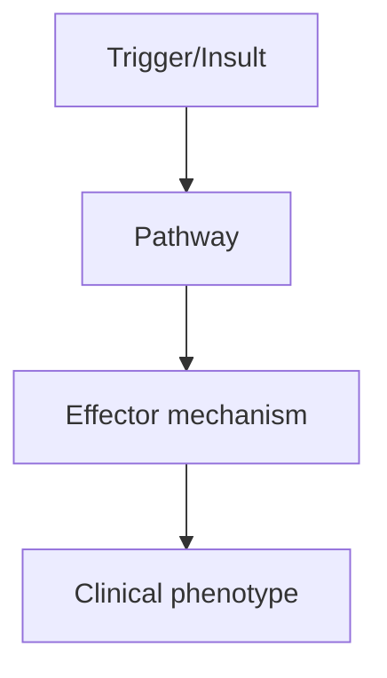
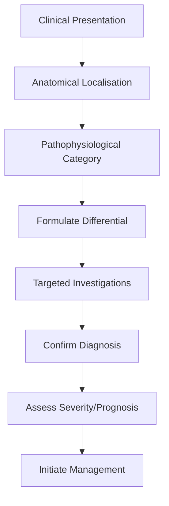

# MOG Antibody-Associated Disease

> [!tip] **High-Yield Definition**
> MOGAD: inflammatory demyelinating disease associated with IgG antibodies to myelin oligodendrocyte glycoprotein (MOG). Distinct from MS and NMOSD. Spectrum: ADEM, optic neuritis, transverse myelitis, brainstem encephalitis.

---

## 1. Definition / Epidemiology / Classification

### Definition
MOGAD: inflammatory demyelinating disease associated with IgG antibodies to myelin oligodendrocyte glycoprotein (MOG). Distinct from MS and NMOSD. Spectrum: ADEM, optic neuritis, transverse myelitis, brainstem encephalitis.

### Epidemiology
Incidence: 0.16/100,000 adults, 0.31/100,000 children. Children > adults. Male predominance in children, female in adults. 30-50% of childhood ADEM cases are MOGAD. Optic neuritis most common presentation.

### Classification
| Variant | Key Features | Prognosis |
|---------|-------------|-----------|
| | | |

---

## 2. Aetiology / Pathophysiology

### Aetiology
MOG-IgG antibodies target myelin oligodendrocyte glycoprotein (CNS-specific). Pathogenic mechanism: complement activation, demyelination, oligodendrocyte injury. Triggered by infection, post-vaccination. Genetic associations: HLA-DRB1*13:01 (protective), HLA-DRB1*04:05, HLA-DRB1*07:01 (risk).

### Pathophysiology


---

## 3. Clinical Features

### History
- **Onset/Duration:**
- **Progression:**
- **Key symptoms:**
- **Triggers:**
- **Systemic symptoms:**
- **Drug/Family/Social history:**

### Examination
| Domain | Key Findings | Localisation Value |
|--------|-------------|-------------------|
| | | |

### Specific Clinical Features
Optic neuritis (most common, often bilateral, severe, disc swelling, perineural enhancement, good recovery). ADEM (children). Transverse myelitis (often LETM, conus involvement, may have bladder/bowel, good recovery). Brainstem encephalitis. Area postrema syndrome (hiccups, nausea, vomiting). Combinations. Monophasic vs relapsing (50% relapse, especially if persistently MOG-IgG positive).

---

## 4. Diagnostic Approach / Algorithm



---

## 5. Investigations

Anti-MOG cell-based assay (CBA) - serum IgG (not CSF). Persistent positivity predicts relapse. MRI brain: fluffy, poorly demarcated lesions, often subcortical, deep grey matter, brainstem, middle cerebellar peduncle (different from MS). MRI spine: LETM, conus enhancement, 'H' sign (axial). MRI optic nerve: long, bilateral, anterior (chiasmal involvement in 5%), perineural enhancement. CSF: pleocytosis (often >50), OCBs (less common, 10-20%, usually negative). AQP4-IgG negative.

---

## 6. Differential Diagnosis

| Differential | Distinguishing Features | Key Test |
|--------------|------------------------|----------|
| | | |

---

## 7. Management

Acute: IV methylprednisolone 1g/day ×5 days, oral taper over 6-8 weeks (lower relapse than no taper). If poor response: IVIG 2g/kg over 2-5 days, PLEX (5 exchanges). Maintenance if relapsing (2+ attacks, persistent MOG-IgG >6mo, high risk): azathioprine, MMF, rituximab. Newer: anti-IL-6 (tocilizumab, satralizumab). Avoid: interferon-beta (may worsen), fingolimod (may worsen). Symptomatic: optic neuritis, myelitis, brainstem.

---

## 8. Drug Interactions / Contraindications / Comorbidity Cautions

| Drug | Interaction / Caution | Management |
|------|----------------------|------------|
| | | |

---

## 9. Procedures (if applicable)

### Procedure:
- **Indications:**
- **Contraindications:**
- **Preparation / Principle:**
- **Complications:**
- **Viva Pearls:**

---

## 10. Complications

| Complication | Frequency | Prevention / Monitoring | Management |
|--------------|-----------|------------------------|------------|
| | | | |

---

## 11. Red Flags / Emergencies

Bilateral optic neuritis, severe vision loss, LETM, conus involvement, brainstem, area postrema syndrome, ADEM in children, MOG-IgG positivity.

---

## 12. Prognosis

Generally good recovery from attacks (better than AQP4-NMOSD). 50% monophasic, 50% relapsing. Optic neuritis common, often good recovery. Persistent MOG-IgG >6 months: higher relapse risk. Visual and motor outcomes better than NMOSD. Cognitive fatigue common.

---

## 13. Topic Correlation

| Related Topic | Link | Key Overlap |
|---------------|------|-------------|
| | | |

---

## 14. Special Situations

| Situation | Consideration |
|-----------|---------------|
| **Pregnancy** | |
| **Lactation** | |
| **Paediatric** | |
| **Elderly / Frail** | |
| **Renal impairment** | |
| **Hepatic impairment** | |
| **Immunocompromised** | |
| **Perioperative** | |
| **Driving / DVLA** | |
| **Occupational** | |

---

## FCPS/MRCP High-Yield Summary

| Category | Key Points |
|----------|------------|
| **Definition** | MOGAD: inflammatory demyelinating disease associated with IgG antibodies to myelin oligodendrocyte glycoprotein (MOG). Distinct from MS and NMOSD. Spectrum: ADEM, optic neuritis, transverse myelitis,  |
| **Epidemiology** | Incidence: 0.16/100,000 adults, 0.31/100,000 children. Children > adults. Male predominance in children, female in adults. 30-50% of childhood ADEM ca |
| **Pathophysiology** | |
| **Clinical** | Optic neuritis (most common, often bilateral, severe, disc swelling, perineural enhancement, good recovery). ADEM (children). Transverse myelitis (often LETM, conus involvement, may have bladder/bowel |
| **Diagnosis** | |
| **Investigations** | Anti-MOG cell-based assay (CBA) - serum IgG (not CSF). Persistent positivity predicts relapse. MRI brain: fluffy, poorly demarcated lesions, often subcortical, deep grey matter, brainstem, middle cere |
| **Management** | Acute: IV methylprednisolone 1g/day ×5 days, oral taper over 6-8 weeks (lower relapse than no taper). If poor response: IVIG 2g/kg over 2-5 days, PLEX (5 exchanges). Maintenance if relapsing (2+ attac |
| **Complications** | |
| **Prognosis** | Generally good recovery from attacks (better than AQP4-NMOSD). 50% monophasic, 50% relapsing. Optic neuritis common, often good recovery. Persistent MOG-IgG >6 months: higher relapse risk. Visual and  |
| **Viva Pearls** | |
| **Drug Doses** | |
| **Scoring Systems** | |
| **Genetics** | |
| **Imaging Signs** | |

---

## Viva Questions (PACES/FCPS Style)

1. **Q:** Define MOG Antibody-Associated Disease and classify its variants.
   **A:** Based on the definition above.

2. **Q:** What are the key clinical features?
   **A:** Optic neuritis (most common, often bilateral, severe, disc swelling, perineural enhancement, good recovery). ADEM (children). Transverse myelitis (often LETM, conus involvement, may have bladder/bowel, good recovery). Brainstem encephalitis. Area postrema syndrome (hiccups, nausea, vomiting). Combin

3. **Q:** What is the first-line treatment?
   **A:** Based on the management section.

4. **Q:** What are the red flags requiring urgent referral?
   **A:** Bilateral optic neuritis, severe vision loss, LETM, conus involvement, brainstem, area postrema syndrome, ADEM in children, MOG-IgG positivity.

5. **Q:** What is the prognosis?
   **A:** Generally good recovery from attacks (better than AQP4-NMOSD). 50% monophasic, 50% relapsing. Optic neuritis common, often good recovery. Persistent MOG-IgG >6 months: higher relapse risk. Visual and motor outcomes better than NMOSD. Cognitive fatigue common.

6. **Q:** How do you differentiate MOG Antibody-Associated Disease from key differentials?
   **A:** Clinical features, investigations, and response to treatment.

7. **Q:** What investigations are most useful?
   **A:** Based on the investigations section.

8. **Q:** Describe the stepwise management approach.
   **A:** Based on the management algorithm.

9. **Q:** What are the emergency presentations?
   **A:** Based on the red flags section.

10. **Q:** How does management change in pregnancy/paediatrics/elderly?
    **A:** Special considerations per population.

---

## Common Confusions / Exam Traps

| Confusion | Clarification |
|-----------|---------------|
| | |

---

## Mnemonics
1. **MOGAD = MOG-IgG positive** — Distinct from MS and AQP4-NMOSD
1. **Optic neuritis + LETM + ADEM-like** — Classic triad; bilateral ON common
1. **TREATMENT** — Acute: IVMP + PLEX; maintenance: rituximab, mycophenolate, IVIG

---

## Mind Map

```mermaid
mindmap
  root((MOG Antibody-Associated Disease (MOGAD)))
    Definition
    Epidemiology
    Pathophysiology
    Clinical Features
    Investigations
    Differential Diagnosis
    Management
      Acute
      Long-term
    Complications
    Prognosis
```

---

## Spaced Repetition Trackers

| Review Interval | Date | Score (0-5) | Notes |
|-----------------|------|-------------|-------|
| Day 1 | | | |
| Day 3 | | | |
| Day 7 | | | |
| Day 14 | | | |
| Day 30 | | | |
| Day 90 | | | |

---

## Self-Test Scorecard

| Section | Score /5 | Last Attempt |
|---------|----------|--------------|
| Definition & Epidemiology | | |
| Pathophysiology | | |
| Clinical Features | | |
| Investigations | | |
| Differential Diagnosis | | |
| Management | | |
| Complications & Prognosis | | |
| Viva Questions | | |
| MCQs | | |
| SBAs | | |

---

## MCQs (10)

1. **Question:** MOGAD typical presentation:
   **Options:** A. Optic neuritis (often bilateral) + LETM + ADEM-like B. Adult progressive C. Only spinal cord D. Only brain
   **Answer:** A
   **Explanation:** MOGAD: optic neuritis (often bilateral, severe, optic disc swelling), LETM, ADEM-like encephalopathy, brainstem.

2. **Question:** MOGAD optic neuritis vs MS:
   **Options:** A. Bilateral, severe, optic disc swelling, good recovery B. Unilateral, no swelling, poor recovery C. Always unilateral D. No optic nerve involvement
   **Answer:** A
   **Explanation:** MOGAD ON: bilateral, severe, optic disc swelling (papillitis), perineural enhancement, good recovery with steroids.

3. **Question:** MOGAD MRI features:
   **Options:** A. Longitudinally extensive (LETM), bilateral ON, brainstem, ADEM-like B. Short lesions C. No enhancement D. Only spinal
   **Answer:** A
   **Explanation:** MOGAD: LETM, bilateral ON, brainstem (pons, area postrema), ADEM-like fluffy lesions.

4. **Question:** MOGAD CSF OCB:
   **Options:** A. Usually negative (10-20% positive, transient) B. Always positive C. Always negative D. Polymorphonuclear
   **Answer:** A
   **Explanation:** MOGAD: OCB usually negative (10-20%, transient). Distinguishes from MS (OCB >90%).

5. **Question:** MOG-IgG testing:
   **Options:** A. Cell-based assay (CBA) - most specific B. ELISA only C. Western blot only D. RIPA
   **Answer:** A
   **Explanation:** MOG-IgG: cell-based assay (CBA) is most specific. False positives with ELISA. Test in serum (CSF less sensitive).

6. **Question:** MOGAD treatment acute:
   **Options:** A. IV methylprednisolone + plasma exchange if severe B. No treatment C. Surgery D. Antibiotics
   **Answer:** A
   **Explanation:** MOGAD acute: IV methylprednisolone 1g/day × 5d. PLEX if severe (poor recovery). MOGAD often steroid-responsive.

7. **Question:** MOGAD treatment maintenance:
   **Options:** A. Rituximab, mycophenolate, IVIG, azathioprine B. Interferon-β C. Glatiramer D. No maintenance
   **Answer:** A
   **Explanation:** MOGAD maintenance: rituximab (anti-CD20), mycophenolate mofetil, IVIG, azathioprine. Often can stop after 2-3 years if stable.

8. **Question:** MOGAD prognosis:
   **Options:** A. Variable; optic neuritis often good, NMOSD-like worse B. Always poor C. Always good D. Progressive
   **Answer:** A
   **Explanation:** MOGAD prognosis variable. Optic neuritis often good recovery with steroids. LETM may have residual disability. Relapsing in 30-50%.

9. **Question:** MOGAD vs AQP4-NMOSD differentiation:
   **Options:** A. MOG-IgG positive = MOGAD; AQP4-IgG = NMOSD B. Same C. Both positive D. Neither tested
   **Answer:** A
   **Explanation:** MOGAD: anti-MOG. NMOSD: anti-AQP4. Distinct diseases with different treatment and prognosis.

---

## SBA Questions (10)

1. **Scenario:** 30-year-old, bilateral optic neuritis, MRI shows bilateral optic nerve enhancement. LETM. Anti-MOG positive. Diagnosis?
   **Options:** A. MOGAD B. MS C. NMOSD (AQP4) D. ADEM E. Idiopathic
   **Answer:** A
   **Explanation:** MOGAD: bilateral ON, LETM, anti-MOG positive. Treatment: steroids + PLEX, then maintenance (rituximab).

2. **Scenario:** MOGAD patient, acute bilateral optic neuritis, vision 20/200. Best treatment?
   **Options:** A. IV methylprednisolone 1g × 5d + PLEX if no rapid recovery B. Oral steroids C. No treatment D. Antibiotics E. Surgery
   **Answer:** A
   **Explanation:** MOGAD ON: IVMP 1g/day × 5d, then oral taper. PLEX if poor response. Often dramatic response.

3. **Scenario:** MOGAD in remission, 2 years stable on rituximab. Can we stop?
   **Options:** A. Can consider stopping after 2-3 years stable (unlike NMOSD lifelong) B. Never stop C. Continue lifelong D. Switch to interferon E. Add steroids
   **Answer:** A
   **Explanation:** MOGAD: can often stop maintenance after 2-3 years stable (unlike NMOSD which needs lifelong).

---

## Tags

**Tags:** #neurology #demyelinating #MOGAD #MOG-IgG #optic-neuritis #LETM #FCPS #MRCP

---

## Local Navigation
**Heading Hub:** [[../Related Demyelinating Disorders Hub]]
**Chapter Hierarchy:** [[../../Davidson Chapter 25 - Neurology Hierarchy]]
**Chapter MOC:** [[../../Neurology MOC]]
**Drug Reference:** [[../../00_Index/Neurology Drug Reference]]