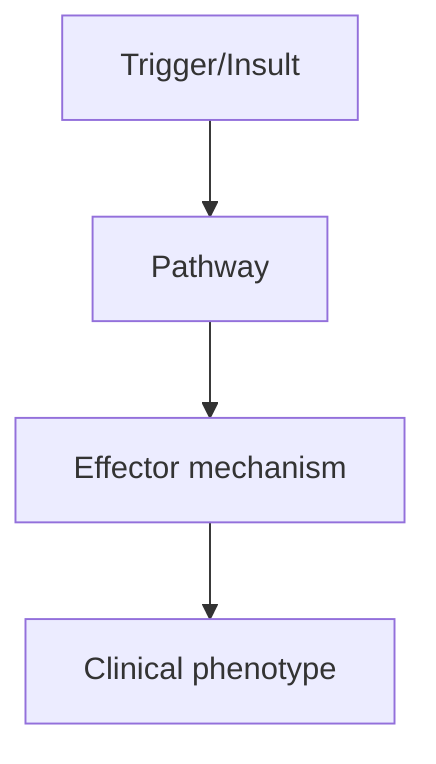
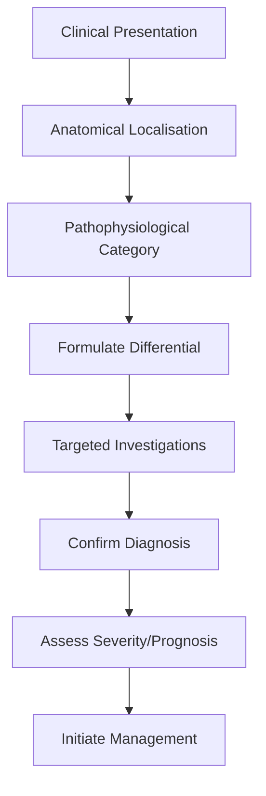
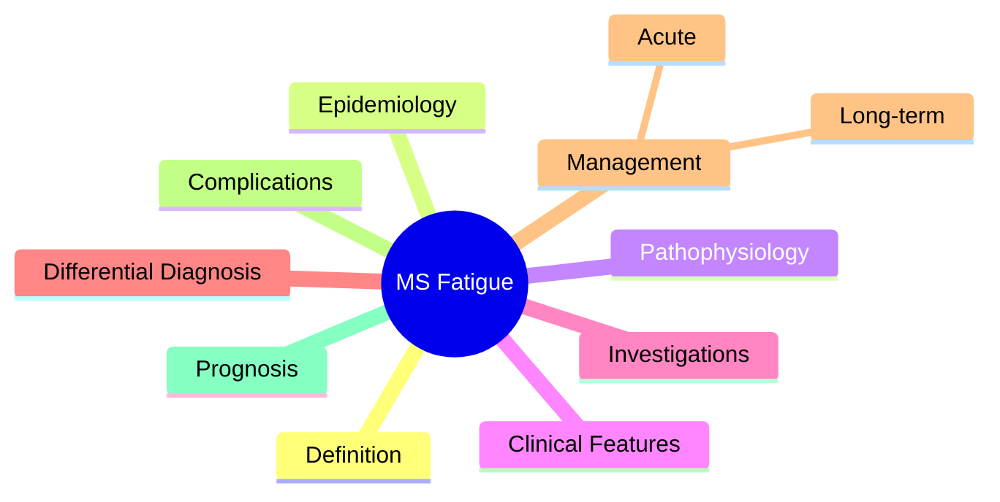

# MS Fatigue

> [!tip] **High-Yield Definition**
> MS-related fatigue: persistent, overwhelming sense of tiredness, disproportionate to activity, not relieved by rest. Affects 75-90% of MS patients. Often the most disabling symptom. Central (CNS) and peripheral components.

---

## 1. Definition / Epidemiology / Classification

### Definition
MS-related fatigue: persistent, overwhelming sense of tiredness, disproportionate to activity, not relieved by rest. Affects 75-90% of MS patients. Often the most disabling symptom. Central (CNS) and peripheral components.

### Epidemiology
75-90% of MS patients experience fatigue. 50-60% rate it as their most disabling symptom. Often present from early disease. Worse in warm weather (Uhthoff's phenomenon), with infections, stress, after activity.

### Classification
| Variant | Key Features | Prognosis |
|---------|-------------|-----------|
| | | |

---

## 2. Aetiology / Pathophysiology

### Aetiology
Multifactorial: CNS demyelination (primary), inflammation, axonal loss, HPA axis dysregulation, neurotransmitter changes (serotonin, dopamine), sleep disturbance, depression, medications, deconditioning. Secondary: sleep apnoea, bladder dysfunction (nocturia), depression, anxiety, pain, medications (especially spasticity, bladder, pain meds), anaemia (rare), thyroid disease.

### Pathophysiology

---

## 3. Clinical Features

### History
- **Onset/Duration:**
- **Progression:**
- **Key symptoms:**
- **Triggers:**
- **Systemic symptoms:**
- **Drug/Family/Social history:**

### Examination
| Domain | Key Findings | Localisation Value |
|--------|-------------|-------------------|
| | | |

### Specific Clinical Features
Primary MS fatigue: persistent, overwhelming, not relieved by rest, interferes with function, worse in afternoon, heat-sensitive (Uhthoff's). Lassitude. Secondary fatigue: due to sleep disturbance (nocturia, pain, spasm), depression, medications, deconditioning. Disability: cognitive (fatigue worsens cognitive), physical, social, occupational.

---

## 4. Diagnostic Approach / Algorithm

---

## 5. Investigations

Clinical diagnosis. Exclude secondary causes: FBC (anaemia), TSH, B12, iron studies, vitamin D. Sleep study if obstructive sleep apnoea suspected. Depression screen (PHQ-9, HADS). Fatigue Severity Scale (FSS), Modified Fatigue Impact Scale (MFIS).

---

## 6. Differential Diagnosis

| Differential | Distinguishing Features | Key Test |
|--------------|------------------------|----------|
| | | |

---

## 7. Management

Non-pharmacological: exercise (aerobic, resistance, balance - improves fatigue), energy conservation, pacing, cooling (vest, air conditioning, swimming - Uhthoff's), good sleep hygiene, cognitive behavioural therapy, mindfulness. Pharmacological: amantadine 100mg BD (modest benefit, mechanism unclear), modafinil 100-200mg morning (off-label, mixed evidence), amantadine + modafinil combination. Amantadine: caution in elderly, renal impairment. Treat secondary: depression (SSRI/SNRI), sleep (mirtazapine, melatonin), spasticity (reduce offending drugs), bladder (desmopressin for nocturnal). Avoid: energising activities in heat, sedating medications.

---

## 8. Drug Interactions / Contraindications / Comorbidity Cautions

| Drug | Interaction / Caution | Management |
|------|----------------------|------------|
| | | |

---

## 9. Procedures (if applicable)

### Procedure:
- **Indications:**
- **Contraindications:**
- **Preparation / Principle:**
- **Complications:**
- **Viva Pearls:**

---

## 10. Complications

| Complication | Frequency | Prevention / Monitoring | Management |
|--------------|-----------|------------------------|------------|
| | | | |

---

## 11. Red Flags / Emergencies

New severe fatigue (exclude relapse, infection, anaemia, thyroid, depression, sleep apnoea, medication side effect).

---

## 12. Prognosis

Chronic, often persistent. Improvement with exercise, energy conservation, cooling. Pharmacological response variable. Treat secondary causes. Quality of life significantly affected.

---

## 13. Topic Correlation

| Related Topic | Link | Key Overlap |
|---------------|------|-------------|
| | | |

---

## 14. Special Situations

| Situation | Consideration |
|-----------|---------------|
| **Pregnancy** | |
| **Lactation** | |
| **Paediatric** | |
| **Elderly / Frail** | |
| **Renal impairment** | |
| **Hepatic impairment** | |
| **Immunocompromised** | |
| **Perioperative** | |
| **Driving / DVLA** | |
| **Occupational** | |

---

## FCPS/MRCP High-Yield Summary

| Category | Key Points |
|----------|------------|
| **Definition** | MS-related fatigue: persistent, overwhelming sense of tiredness, disproportionate to activity, not relieved by rest. Affects 75-90% of MS patients. Often the most disabling symptom. Central (CNS) and  |
| **Epidemiology** | 75-90% of MS patients experience fatigue. 50-60% rate it as their most disabling symptom. Often present from early disease. Worse in warm weather (Uht |
| **Pathophysiology** | |
| **Clinical** | Primary MS fatigue: persistent, overwhelming, not relieved by rest, interferes with function, worse in afternoon, heat-sensitive (Uhthoff's). Lassitude. Secondary fatigue: due to sleep disturbance (no |
| **Diagnosis** | |
| **Investigations** | Clinical diagnosis. Exclude secondary causes: FBC (anaemia), TSH, B12, iron studies, vitamin D. Sleep study if obstructive sleep apnoea suspected. Depression screen (PHQ-9, HADS). Fatigue Severity Sca |
| **Management** | Non-pharmacological: exercise (aerobic, resistance, balance - improves fatigue), energy conservation, pacing, cooling (vest, air conditioning, swimming - Uhthoff's), good sleep hygiene, cognitive beha |
| **Complications** | |
| **Prognosis** | Chronic, often persistent. Improvement with exercise, energy conservation, cooling. Pharmacological response variable. Treat secondary causes. Quality of life significantly affected. |
| **Viva Pearls** | |
| **Drug Doses** | |
| **Scoring Systems** | |
| **Genetics** | |
| **Imaging Signs** | |

---

## Viva Questions (PACES/FCPS Style)

1. **Q:** Define MS Fatigue and classify its variants.
   **A:** Based on the definition above.

2. **Q:** What are the key clinical features?
   **A:** Primary MS fatigue: persistent, overwhelming, not relieved by rest, interferes with function, worse in afternoon, heat-sensitive (Uhthoff's). Lassitude. Secondary fatigue: due to sleep disturbance (nocturia, pain, spasm), depression, medications, deconditioning. Disability: cognitive (fatigue worsen

3. **Q:** What is the first-line treatment?
   **A:** Based on the management section.

4. **Q:** What are the red flags requiring urgent referral?
   **A:** New severe fatigue (exclude relapse, infection, anaemia, thyroid, depression, sleep apnoea, medication side effect).

5. **Q:** What is the prognosis?
   **A:** Chronic, often persistent. Improvement with exercise, energy conservation, cooling. Pharmacological response variable. Treat secondary causes. Quality of life significantly affected.

6. **Q:** How do you differentiate MS Fatigue from key differentials?
   **A:** Clinical features, investigations, and response to treatment.

7. **Q:** What investigations are most useful?
   **A:** Based on the investigations section.

8. **Q:** Describe the stepwise management approach.
   **A:** Based on the management algorithm.

9. **Q:** What are the emergency presentations?
   **A:** Based on the red flags section.

10. **Q:** How does management change in pregnancy/paediatrics/elderly?
    **A:** Special considerations per population.

---

## Common Confusions / Exam Traps

| Confusion | Clarification |
|-----------|---------------|
| | |

---

## Mnemonics
1. **MS Fatigue = LASSITUDE** — Worse with heat, exercise, infection; better with rest; doesn't fully reverse with sleep
1. **Management** — Treat modifiable (sleep, mood, spasm, drugs), amantadine, modafinil, exercise, energy conservation, cooling
1. **Differentiate from** — Depression, sleep disturbance (PLMD, OSA), drug side effects (espasmolytics), bladder dysfunction (nocturia)

---

## Mind Map

---

## Spaced Repetition Trackers

| Review Interval | Date | Score (0-5) | Notes |
|-----------------|------|-------------|-------|
| Day 1 | | | |
| Day 3 | | | |
| Day 7 | | | |
| Day 14 | | | |
| Day 30 | | | |
| Day 90 | | | |

---

## Self-Test Scorecard

| Section | Score /5 | Last Attempt |
|---------|----------|--------------|
| Definition & Epidemiology | | |
| Pathophysiology | | |
| Clinical Features | | |
| Investigations | | |
| Differential Diagnosis | | |
| Management | | |
| Complications & Prognosis | | |
| Viva Questions | | |
| MCQs | | |
| SBAs | | |

---

## MCQs (10)

1. **Question:** MS fatigue features:
   **Options:** A. Worse with heat/heat sensitivity (Uhthoff's phenomenon), worse with exercise, not relieved by sleep B. Relieved by sleep C. Worse at night D. Worse in cold
   **Answer:** A
   **Explanation:** MS fatigue: heat sensitivity (Uhthoff's), worse with exercise, not relieved by sleep, interferes with daily activities.

2. **Question:** Uhthoff's phenomenon is:
   **Options:** A. Worsening of MS symptoms with ↑ body temperature (heat, fever, exercise) B. New symptoms C. Seizure D. Migraine
   **Answer:** A
   **Explanation:** Uhthoff's: transient worsening of MS symptoms with heat (fever, hot bath, exercise, hot weather). Demyelinated nerves sensitive to temperature.

3. **Question:** First-line treatment for MS fatigue:
   **Options:** A. Amantadine 100mg BD (or modafinil) B. Steroids C. IVIG D. Interferon-β
   **Answer:** A
   **Explanation:** MS fatigue: amantadine 100mg BD (modest benefit), modafinil 100-200mg (off-label), 3,4-diaminopyridine, exercise programme.

4. **Question:** Differential of MS fatigue includes:
   **Options:** A. Depression, sleep disturbance, drug side effects, bladder dysfunction, relapse B. Only relapse C. Only depression D. Only sleep
   **Answer:** A
   **Explanation:** Differential: depression, sleep disturbance (PLMD, OSA, nocturia), drug side effects (baclofen, tizanidine), thyroid, anaemia, relapse.

5. **Question:** Non-pharmacological management of MS fatigue includes:
   **Options:** A. Energy conservation, cooling, exercise, CBT B. Bed rest C. More drugs D. Surgery
   **Answer:** A
   **Explanation:** Non-pharm: energy conservation, cooling (vests, AC), graded exercise, CBT, sleep hygiene, treat underlying depression.

6. **Question:** Heat sensitivity in MS is due to:
   **Options:** A. Demyelinated nerves temperature-sensitive (Uhthoff's) B. Inflammation C. Tumour D. Stroke
   **Answer:** A
   **Explanation:** Demyelinated axons: temperature-sensitive. ↑ temp → ↑ conduction block → transient symptoms.

7. **Question:** Amantadine mechanism for MS fatigue:
   **Options:** A. Dopamine agonist + NMDA antagonist B. GABA agonist C. Stimulant only D. Steroid
   **Answer:** A
   **Explanation:** Amantadine: dopamine agonist (↑ release, ↓ reuptake) + NMDA antagonist. Modest benefit for fatigue.

---

## SBA Questions (10)

1. **Scenario:** MS patient with profound fatigue, gets worse with hot bath. Best treatment?
   **Options:** A. Cooling strategies + amantadine + treat depression/sleep B. More steroids C. Surgery D. Bed rest E. Nothing
   **Answer:** A
   **Explanation:** Heat sensitivity = Uhthoff's. Cooling (AC, cold shower, cooling vest), amantadine 100mg BD. Treat modifiable (depression, sleep, nocturia).

2. **Scenario:** MS patient on interferon-β, worsening fatigue. Differential?
   **Options:** A. Depression, sleep disturbance, bladder (nocturia), drug side effects, relapse B. Only relapse C. Only depression D. Only interferon side effect E. Always MS progression
   **Answer:** A
   **Explanation:** MS fatigue differential: depression, sleep (PLMD, OSA), drug side effects, nocturia, relapse, anaemia, thyroid.

3. **Scenario:** MS patient with heat sensitivity, planning holiday. Advice?
   **Options:** A. Cooling strategies, AC, avoid hot bath, stay hydrated B. No advice C. Avoid heat at all costs (stay indoors) D. Increase exercise E. Surgery
   **Answer:** A
   **Explanation:** Heat worsens Uhthoff's. Cooling (AC, vests, cold drinks), avoid hot bath/sauna, stay cool, exercise in cool environment.

---

## Tags

**Tags:** #neurology #demyelinating #MS #fatigue #Uhthoff #amantadine #heat-sensitivity #FCPS #MRCP

---

## Local Navigation
**Heading Hub:** [[../Multiple Sclerosis Hub]]
**Chapter Hierarchy:** [[../../Davidson Chapter 25 - Neurology Hierarchy]]
**Chapter MOC:** [[../../Neurology MOC]]
**Drug Reference:** [[../../00_Index/Neurology Drug Reference]]