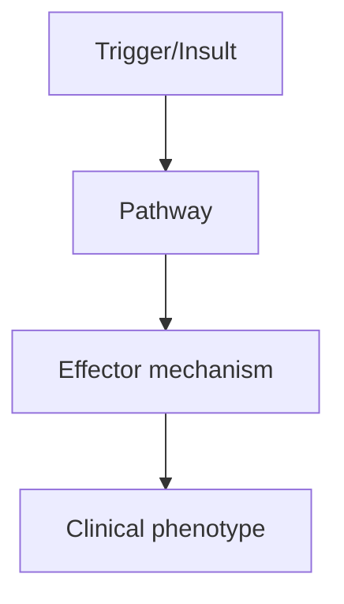
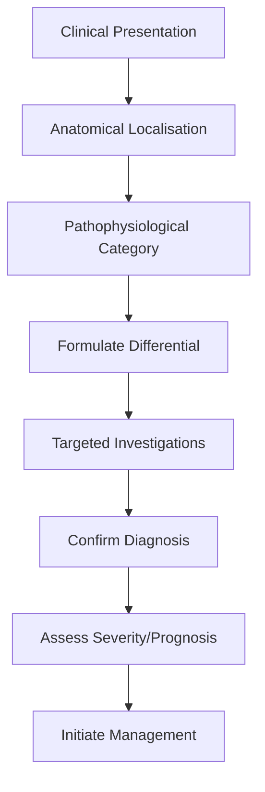

# MS Variants

> [!tip] **High-Yield Definition**
> MS variants: rare demyelinating syndromes with atypical features. Tumefactive MS (mass-like), Marburg MS (fulminant monophasic), Schilder disease (paediatric bilateral), Balo concentric sclerosis (concentric rings), ADEM (post-infectious).

---

## 1. Definition / Epidemiology / Classification

### Definition
MS variants: rare demyelinating syndromes with atypical features. Tumefactive MS (mass-like), Marburg MS (fulminant monophasic), Schilder disease (paediatric bilateral), Balo concentric sclerosis (concentric rings), ADEM (post-infectious).

### Epidemiology
Rare individually. Tumefactive MS: 1-2/1000 MS cases. Marburg: very rare. ADEM: 0.3-0.5/100,000/year (children > adults). Balo: very rare.

### Classification
| Variant | Key Features | Prognosis |
|---------|-------------|-----------|
| | | |

---

## 2. Aetiology / Pathophysiology

### Aetiology
Tumefactive: atypical demyelination, mass effect. Marburg: fulminant, severe. ADEM: post-infectious/post-vaccination, autoimmune. Balo: concentric demyelination. Schilder: paediatric, bilateral.

### Pathophysiology


---

## 3. Clinical Features

### History
- **Onset/Duration:**
- **Progression:**
- **Key symptoms:**
- **Triggers:**
- **Systemic symptoms:**
- **Drug/Family/Social history:**

### Examination
| Domain | Key Findings | Localisation Value |
|--------|-------------|-------------------|
| | | |

### Specific Clinical Features
Tumefactive: large (>2cm) mass-like lesion, mass effect, oedema, often monofocal. Marburg: severe, monophasic, fulminant, rapid disability, often fatal. ADEM: post-infectious, encephalopathy + multifocal deficits, children, monophasic. Balo: alternating demyelinating bands, progressive. Schilder: paediatric, bilateral, large.

---

## 4. Diagnostic Approach / Algorithm



---

## 5. Investigations

MRI: Tumefactive - large lesion, mass effect, incomplete ring enhancement, central T2 hypointensity, T1 hypointense, restricted diffusion (central). Marburg: large confluent lesions, mass effect. ADEM: multifocal, bilateral, large lesions, brainstem, cerebellum, thalamus. Balo: concentric rings (T2 layers). CSF: OCBs (less common in variants), pleocytosis (ADEM, Marburg). Brain biopsy: needed in some to exclude tumour (Tumefactive, Balo).

---

## 6. Differential Diagnosis

| Differential | Distinguishing Features | Key Test |
|--------------|------------------------|----------|
| | | |

---

## 7. Management

Tumefactive: high-dose IV methylprednisolone 1g/day ×3-5d, PLEX if poor response, biopsy if atypical. Marburg: aggressive immunotherapy (IV methylprednisolone, PLEX, rituximab, cyclophosphamide). ADEM: IV methylprednisolone 1g/day ×3-5d, IVIG 2g/kg over 2-5d if poor response, PLEX. Balo: IV methylprednisolone, PLEX, rituximab. Long-term DMT for MS-like variants. Supportive: ICU, ventilation, ICP management.

---

## 8. Drug Interactions / Contraindications / Comorbidity Cautions

| Drug | Interaction / Caution | Management |
|------|----------------------|------------|
| | | |

---

## 9. Procedures (if applicable)

### Procedure:
- **Indications:**
- **Contraindications:**
- **Preparation / Principle:**
- **Complications:**
- **Viva Pearls:**

---

## 10. Complications

| Complication | Frequency | Prevention / Monitoring | Management |
|--------------|-----------|------------------------|------------|
| | | | |

---

## 11. Red Flags / Emergencies

Rapid progression, status epilepticus, raised ICP, herniation, respiratory failure, autonomic dysfunction.

---

## 12. Prognosis

Tumefactive: usually good with treatment, may evolve to MS. Marburg: poor, often fatal within months. ADEM: usually monophasic, full recovery, may have residual deficits. Balo: variable, some progressive.

---

## 13. Topic Correlation

| Related Topic | Link | Key Overlap |
|---------------|------|-------------|
| | | |

---

## 14. Special Situations

| Situation | Consideration |
|-----------|---------------|
| **Pregnancy** | |
| **Lactation** | |
| **Paediatric** | |
| **Elderly / Frail** | |
| **Renal impairment** | |
| **Hepatic impairment** | |
| **Immunocompromised** | |
| **Perioperative** | |
| **Driving / DVLA** | |
| **Occupational** | |

---

## FCPS/MRCP High-Yield Summary

| Category | Key Points |
|----------|------------|
| **Definition** | MS variants: rare demyelinating syndromes with atypical features. Tumefactive MS (mass-like), Marburg MS (fulminant monophasic), Schilder disease (paediatric bilateral), Balo concentric sclerosis (con |
| **Epidemiology** | Rare individually. Tumefactive MS: 1-2/1000 MS cases. Marburg: very rare. ADEM: 0.3-0.5/100,000/year (children > adults). Balo: very rare. |
| **Pathophysiology** | |
| **Clinical** | Tumefactive: large (>2cm) mass-like lesion, mass effect, oedema, often monofocal. Marburg: severe, monophasic, fulminant, rapid disability, often fatal. ADEM: post-infectious, encephalopathy + multifo |
| **Diagnosis** | |
| **Investigations** | MRI: Tumefactive - large lesion, mass effect, incomplete ring enhancement, central T2 hypointensity, T1 hypointense, restricted diffusion (central). Marburg: large confluent lesions, mass effect. ADEM |
| **Management** | Tumefactive: high-dose IV methylprednisolone 1g/day ×3-5d, PLEX if poor response, biopsy if atypical. Marburg: aggressive immunotherapy (IV methylprednisolone, PLEX, rituximab, cyclophosphamide). ADEM |
| **Complications** | |
| **Prognosis** | Tumefactive: usually good with treatment, may evolve to MS. Marburg: poor, often fatal within months. ADEM: usually monophasic, full recovery, may have residual deficits. Balo: variable, some progress |
| **Viva Pearls** | |
| **Drug Doses** | |
| **Scoring Systems** | |
| **Genetics** | |
| **Imaging Signs** | |

---

## Viva Questions (PACES/FCPS Style)

1. **Q:** Define MS Variants and classify its variants.
   **A:** Based on the definition above.

2. **Q:** What are the key clinical features?
   **A:** Tumefactive: large (>2cm) mass-like lesion, mass effect, oedema, often monofocal. Marburg: severe, monophasic, fulminant, rapid disability, often fatal. ADEM: post-infectious, encephalopathy + multifocal deficits, children, monophasic. Balo: alternating demyelinating bands, progressive. Schilder: pa

3. **Q:** What is the first-line treatment?
   **A:** Based on the management section.

4. **Q:** What are the red flags requiring urgent referral?
   **A:** Rapid progression, status epilepticus, raised ICP, herniation, respiratory failure, autonomic dysfunction.

5. **Q:** What is the prognosis?
   **A:** Tumefactive: usually good with treatment, may evolve to MS. Marburg: poor, often fatal within months. ADEM: usually monophasic, full recovery, may have residual deficits. Balo: variable, some progressive.

6. **Q:** How do you differentiate MS Variants from key differentials?
   **A:** Clinical features, investigations, and response to treatment.

7. **Q:** What investigations are most useful?
   **A:** Based on the investigations section.

8. **Q:** Describe the stepwise management approach.
   **A:** Based on the management algorithm.

9. **Q:** What are the emergency presentations?
   **A:** Based on the red flags section.

10. **Q:** How does management change in pregnancy/paediatrics/elderly?
    **A:** Special considerations per population.

---

## Common Confusions / Exam Traps

| Confusion | Clarification |
|-----------|---------------|
| | |

---

## Mnemonics
1. **TUMEFACTIVE MS** — Single large (>2cm) demyelinating lesion mimicking tumour; open ring enhancement, central vein sign
1. **MARBURG MS** — Fulminant, monophasic, often fatal within weeks-months; aggressive immunosuppression
1. **BALO concentric sclerosis** — Concentric rings of demyelination; Balo disease

---

## Mind Map

```mermaid
mindmap
  root((MS Variants (Tumefactive, Marburg, Schilder, Balo)))
    Definition
    Epidemiology
    Pathophysiology
    Clinical Features
    Investigations
    Differential Diagnosis
    Management
      Acute
      Long-term
    Complications
    Prognosis
```

---

## Spaced Repetition Trackers

| Review Interval | Date | Score (0-5) | Notes |
|-----------------|------|-------------|-------|
| Day 1 | | | |
| Day 3 | | | |
| Day 7 | | | |
| Day 14 | | | |
| Day 30 | | | |
| Day 90 | | | |

---

## Self-Test Scorecard

| Section | Score /5 | Last Attempt |
|---------|----------|--------------|
| Definition & Epidemiology | | |
| Pathophysiology | | |
| Clinical Features | | |
| Investigations | | |
| Differential Diagnosis | | |
| Management | | |
| Complications & Prognosis | | |
| Viva Questions | | |
| MCQs | | |
| SBAs | | |

---

## MCQs (10)

1. **Question:** Tumefactive MS MRI features:
   **Options:** A. Single large (>2cm) lesion, open/incomplete ring enhancement, central vein sign B. Multiple small lesions C. Ring enhancement closed D. No enhancement
   **Answer:** A
   **Explanation:** Tumefactive MS: large (>2cm) lesion, incomplete (open) ring enhancement, central vein sign on SWI, often 'tumour-like'.

2. **Question:** Marburg MS is:
   **Options:** A. Fulminant, monophasic, often fatal within weeks-months B. Benign C. Recurrent D. Childhood only
   **Answer:** A
   **Explanation:** Marburg: fulminant, monophasic, large demyelinating lesions, brainstem, often fatal without aggressive treatment.

3. **Question:** Schilder disease (myelinoclastic diffuse sclerosis):
   **Options:** A. Bilateral large symmetric white matter lesions in children, often misdiagnosed as tumour/leukodystrophy B. Adult progressive C. Recurrent D. Unilateral
   **Answer:** A
   **Explanation:** Schilder: bilateral large symmetric white matter lesions in children. Often misdiagnosed as tumour or leukodystrophy.

4. **Question:** Balo concentric sclerosis features:
   **Options:** A. Concentric rings/layers of demyelination and preserved myelin on MRI B. Uniform demyelination C. No rings D. Single lesion
   **Answer:** A
   **Explanation:** Balo: alternating concentric rings of demyelinated and preserved myelin. Pathognomonic MRI appearance.

5. **Question:** MS variants requiring differentiation from tumour:
   **Options:** A. Tumefactive MS (open ring, central vein, lesion shrinks with steroids) B. All MS variants C. Relapsing-remitting only D. Progressive only
   **Answer:** A
   **Explanation:** Tumefactive MS mimicks tumour. Open ring enhancement, central vein sign, response to steroids help. Biopsy if uncertain.

6. **Question:** Tumefactive MS treatment:
   **Options:** A. IV methylprednisolone + consider PLEX; often responds dramatically B. Surgery always C. Radiotherapy D. Chemotherapy
   **Answer:** A
   **Explanation:** Tumefactive MS: IVMP 1g × 5d. Often dramatic response. PLEX if severe. Consider biopsy if atypical (no other MS lesions).

7. **Question:** Marburg MS treatment:
   **Options:** A. Aggressive: IVMP, PLEX, cyclophosphamide, mitoxantrone B. Wait and see C. Surgery D. Rehabilitation only
   **Answer:** A
   **Explanation:** Marburg: aggressive immunosuppression. IVMP, PLEX, cyclophosphamide, mitoxantrone. Often fatal despite treatment.

8. **Question:** Concentric sclerosis (Balo) is diagnosed by:
   **Options:** A. MRI concentric rings (pathognomonic); biopsy in atypical cases B. Blood test C. Genetic D. CSF only
   **Answer:** A
   **Explanation:** Balo: MRI pathognomonic (concentric rings). Brain biopsy in atypical cases.

---

## SBA Questions (10)

1. **Scenario:** 25-year-old, MRI shows single 3cm right frontal lesion, open ring enhancement. Other periventricular lesions. CSF: OCB. Diagnosis?
   **Options:** A. Tumefactive MS B. Glioblastoma C. Brain abscess D. Metastasis E. Lymphoma
   **Answer:** A
   **Explanation:** Tumefactive MS: large lesion, open ring enhancement, other MS lesions, OCB positive. Biopsy if atypical.

2. **Scenario:** Marburg MS not responding to IVMP. Next step?
   **Options:** A. Plasma exchange 5-7 exchanges, then cyclophosphamide B. No further treatment C. More steroids D. Surgery E. Rehab only
   **Answer:** A
   **Explanation:** Marburg: PLEX + cyclophosphamide/mitoxantrone. Aggressive immunosuppression. Prognosis poor but may stabilise.

3. **Scenario:** MRI shows concentric rings of demyelination. Diagnosis?
   **Options:** A. Balo concentric sclerosis B. Tumefactive MS C. Marburg D. Schilder E. ADEM
   **Answer:** A
   **Explanation:** Balo: concentric rings pathognomonic. Distinct rare MS variant.

---

## Tags

**Tags:** #neurology #demyelinating #MS-variants #tumefactive #Marburg #Balo #Schilder #FCPS #MRCP

---

## Local Navigation
**Heading Hub:** [[../Multiple Sclerosis Hub]]
**Chapter Hierarchy:** [[../../Davidson Chapter 25 - Neurology Hierarchy]]
**Chapter MOC:** [[../../Neurology MOC]]
**Drug Reference:** [[../../00_Index/Neurology Drug Reference]]