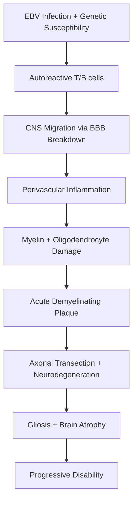

# Multiple Sclerosis (McDonald 2017, DMTs)

Related: [[McDonald Criteria 2017]], [[RRMS]], [[SPMS]], [[PPMS]], [[CIS]], [[Optic Neuritis]], [[Transverse Myelitis]]

> [!tip] **High-Yield Framework**
> MS diagnosis = **Dissemination in Time (DIT) + Dissemination in Space (DIS) + typical CIS + no better explanation** (McDonald 2017). Treatment = **DMT escalation vs induction**, with high-efficacy early therapy increasingly preferred.

## 1. Definition / Epidemiology / Classification

### Definition
Chronic inflammatory, demyelinating, neurodegenerative CNS disease characterised by **multifocal lesions in time and space** (brain, optic nerves, spinal cord), driven by **autoimmune T-cell/B-cell mediated myelin destruction** with secondary axonal loss.

### Epidemiology
- **Prevalence:** 50-300/100,000 (↑ with latitude; lowest at equator)
- **Incidence:** 2-10/100,000/year
- **Age:** Peak onset 20-40 years (mean ~30)
- **Sex ratio:** F:M = **2.5-3:1**
- **Risk factors:** Female sex, Northern latitude, Vitamin D deficiency, EBV infection (post-EBV risk 32x), HLA-DRB1*15:01, smoking, childhood obesity, family history (siblings 2-4%, monozygotic twins ~30%)

### Classification (Phenotypes — Lublin 2014)
| Phenotype | Defining Feature | Annualised Relapse Rate (ARR) |
|-----------|-----------------|------------------------------|
| **CIS** (Clinically Isolated Syndrome) | First demyelinating event; <24h, no fever/infection | 1/2 → MS within 2 yrs |
| **RRMS** (Relapsing-Remitting) | Relapses + remissions; no progression between | 0.5-1.0 untreated |
| **SPMS** (Secondary Progressive) | Gradual progression after initial RRMS phase | Conversion ~50% by 15 yrs |
| **PPMS** (Primary Progressive) | Progression from onset, no relapses (10-15% of MS) | Older onset (~40 yrs) |

## 2. Aetiology / Pathophysiology

### Pathophysiology

### Molecular Basis
- **Genes:** HLA-DRB1*15:01, HLA-A*02:01 (protective), IL2RA, IL7R, CLEC16A
- **Autoantibodies:** Anti-MOG (subset, distinct disease); AQP4-negative in classic MS
- **Biomarkers:** CSF OCB (95% RRMS, 80% PPMS), NfL (neurofilament light — neuroaxonal injury), MRZ reaction (measles/rubella/varicella)

## 3. Clinical Features

### Common Presentations (CIS)
| Site | Syndrome |
|------|----------|
| **Optic nerve (25%)** | Subacute painful unilateral vision loss, RAPD, dyschromatopsia |
| **Spinal cord (45%)** | Partial transverse myelitis, Lhermitte's, asymmetric sensory level |
| **Brainstem (10%)** | INO (highly localising), facial numbness, vertigo |
| **Cerebellum (5-10%)** | Ataxia, dysarthria, tremor |
| **Cerebral (5%)** | Hemiparesis, hemisensory loss |

### Examination Findings
- **UMN signs:** ↑tone, ↑reflexes, Babinski, clonus
- **Cerebellar:** Nystagmus, intention tremor, dysarthria, ataxic gait
- **Sensory:** Reduced vibration/proprioception (dorsal columns), pins/needles
- **Visual:** RAPD, red desaturation, central scotoma
- **Cognitive:** Impaired processing speed, executive dysfunction (50% over time)
- **Fatigue** (80% — most disabling MS symptom)
- **Uhthoff's phenomenon:** Worsening with ↑temperature (hot bath, exercise, fever)
- **Lhermitte's sign:** Electric shock radiating down spine on neck flexion

## 4. Diagnostic Approach

### McDonald 2017 Criteria (Summary)
- **CIS (RRMS pathway):** DIS + DIT (clinical or MRI); can be met on **single MRI** in many cases
- **PPMS:** 1 yr progression independent of relapse + DIS in brain or cord + positive CSF
- **DIT:** Simultaneous Gd+ and Gd− lesions on single MRI; OR new T2/Gd+ on follow-up MRI; OR CSF OCB (re-introduced in 2017)
- **DIS:** ≥1 T2 lesion in ≥2 of 4 typical locations (periventricular, cortical/juxtacortical, infratentorial, spinal cord)
- **Symptomatic lesions** now count for DIS/DIT (key 2017 change)
- **No better explanation** is mandatory

### Severity Assessment
| Scale | Components | Range |
|-------|-----------|-------|
| **EDSS** (Expanded Disability Status Scale) | Pyramidal, cerebellar, brainstem, sensory, bowel/bladder, visual, cerebral, ambulation | 0-10 (0=normal, 10=death) |
| **MSFC** (Multiple Sclerosis Functional Composite) | Timed 25-ft walk, 9-hole peg, PASAT-3 | Z-scores |
| **ARR** | Relapses/year | — |
| **MRI activity** | New T2 or Gd+ lesions | — |

## 5. Investigations

| Investigation | Indication | Expected Finding |
|---------------|------------|------------------|
| **MRI Brain + Cord (with Gd)** | All suspected MS | Ovoid periventricular, juxtacortical, infratentorial, cord T2 lesions; Gd+ active |
| **CSF (oligoclonal bands)** | Atypical presentation, PPMS, exclude mimics | OCB unmatched in CSF (95% RRMS, 80% PPMS) |
| **VEP** | Suspected optic nerve involvement (often subclinical) | P100 latency delay >115 ms |
| **Serum AQP4-IgG, MOG-IgG** | Exclude NMOSD, MOGAD | Negative in classic MS |
| **Bloods** | Exclude mimics | ANA, ANCA, B12, folate, ACE, anti-Hu/Yo/Ri (paraneoplastic) |

### Key MRI Sequences
- T2/FLAIR, T1 pre/post-Gd, DWI (exclude stroke), DIR (cortical lesions)
- **Spinal cord:** Sagittal T2/STIR, axial T2, post-Gd (look for LETM ≥3 segments → NMOSD)

## 6. Differential Diagnosis

| Differential | Distinguishing Features | Key Test |
|--------------|------------------------|----------|
| **NMOSD** | LETM ≥3 segments, area postrema, severe ON, AQP4-IgG+ | AQP4-IgG, MOG-IgG |
| **MOGAD** | Bilateral ON, conus myelitis, ADEM-like | MOG-IgG (cell-based assay) |
| **Vasculitis (PACNS, SLE)** | Systemic features, infarcts on MRI | ANA, ANCA, brain biopsy |
| **CADASIL** | Family history, lacunes, white matter | NOTCH3 |
| **Sarcoidosis** | Cranial neuropathies, leptomeningeal enhancement | ACE, CXR, biopsy |
| **B12 deficiency** | Dorsal column, megaloblastic | B12, MMA |
| **Functional disorder** | Inconsistency, Hoover's, distractibility | Clinical, normal MRI |

## 7. Management

### Relapse Treatment
| Agent | Dose | Notes |
|-------|------|-------|
| **Methylprednisolone** (1st line) | 1g IV × 3-5 days | Hastens recovery; no long-term benefit on disability |
| **PLEX (Plasma exchange)** | 5 exchanges over 10 days | Severe/steroid-refractory relapse |
| **IVIG** | 0.4g/kg/day × 5 days | Limited evidence; consider if PLEX unavailable |

### Disease-Modifying Therapies (DMTs)

| Class | Examples | Efficacy | Monitoring |
|-------|----------|----------|------------|
| **Platform (Moderate)** | Interferon-β-1a/1b SC/IM, Glatiramer acetate SC, Dimethyl fumarate, Teriflunomide | ↓ARR ~30-50% | LFTs, FBC (lymphocytes), MRI |
| **High-efficacy (HE)** | Fingolimod, Cladribine, Natalizumab, Ocrelizumab, Alemtuzumab, Ofatumumab | ↓ARR ~50-70%, ↓disability | JCV (natalizumab), lymphocyte counts, LFTs, BP (fingo) |
| **Induction** | Alemtuzumab, Cladribine, Mitoxantrone | Sustained remission | Risk of autoimmunity (alemtuzumab), cardiotoxicity (mitoxantrone) |

### Treatment Strategy
- **Traditional:** Escalation (platform → HE on breakthrough)
- **Modern trend:** **Early high-efficacy therapy** (reduces long-term disability; supported by DELIVER-MS, TREAT-MS)
- **SPMS with active disease** (relapses, new MRI lesions): Fingolimod, Siponimod, Cladribine
- **PPMS:** **Ocrelizumab** (only DMT with proven efficacy in PPMS)
- **Symptomatic:** Fatigue (amantadine, modafinil), spasticity (baclofen, tizanidine, gabapentin), bladder (oxybutynin, mirabegron), neuropathic pain (gabapentin, duloxetine), gait (dalfampridine)

### Special Populations
- **Pregnancy:** Interferon-β and glatiramer safe in pregnancy; avoid fingolimod, cladribine, teriflunomide; natalizumab q8 weekly may continue; **pulsed steroids** if relapse; relapse risk ↑ postpartum
- **Vaccinations:** Check varicella zoster serostatus before fingolimod/cladribine; live vaccines contraindicated on most DMTs; non-live vaccines (COVID, flu) safe; annual flu vaccine recommended

## 8. Drug Interactions / Cautions

| Drug | Major Cautions |
|------|----------------|
| **Fingolimod** | 1st-dose bradycardia/AV block (6h monitoring); VZV serostatus; BP; macular oedema (ophthalmology review) |
| **Natalizumab** | PML risk ↑ with JCV+ (1:10,000 if neg, 1:100 if JCV+ >2 yrs); switch if ↑ index |
| **Alemtuzumab** | Autoimmune disease (thyroid 30%, ITP 1%, Goodpasture's); infusion reactions; infections |
| **Ocrelizumab** | Infusion reactions; hepatitis B reactivation (screen); progressive multifocal leukoencephalopathy (rare) |
| **Cladribine** | Lymphopenia, infections; pregnancy (6 mo contraception after) |
| **Dimethyl fumarate** | GI side effects; flushing; lymphopenia; PML (rare) |

## 9. Procedures
### Lumbar Puncture
- **Indication:** Atypical presentation, PPMS workup, exclude infection/inflammation
- **Contraindications:** Raised ICP, mass lesion, coagulopathy
- **Send:** OCB, IgG index, cell count, protein, glucose, cytology, infection screen

## 10. Complications
| Complication | Frequency | Management |
|--------------|-----------|------------|
| **Optic neuritis** | 25-50% of MS | IV methylprednisolone (oral not superior per ONTT) |
| **Spasticity** | 60-80% | Baclofen, tizanidine, physiotherapy, intrathecal baclofen |
| **Neurogenic bladder** | 75% | Urodynamics; antimuscarinics, intermittent self-catheterisation |
| **Cognitive dysfunction** | 40-65% | Neuropsychology, cognitive rehabilitation |
| **Depression** | 50% lifetime | SSRIs, CBT |
| **Pressure sores** | Common in advanced | 2-hourly turning, pressure-relieving mattress |
| **DVT/PE** | Immobility | Prophylaxis |
| **Pregnancy complications** | — | MDT, neurologist + obstetrician |

## 11. Red Flags / Emergencies
| Red Flag | Action |
|----------|--------|
| **Acute transverse myelitis (TM)** | Urgent MRI + Gd, AQP4/MOG, IV methylprednisolone |
| **Brainstem relapse (respiratory)** | HDU/ITU, serial VC, swallow assessment |
| **Massive demyelinating lesion** | Methylprednisolone + consider PLEX, repeat MRI |
| **Suspected PML** (on natalizumab) | Stop natalizumab, MRI + CSF JCV PCR, PLEX |
| **Aseptic meningitis post-DMT** | Consider DMT-related |

## 12. Prognosis
- **Good:** Female, young onset, sensory onset, RRMS, low EDSS at 5 yrs, long intervals between relapses
- **Poor:** Male, older onset (>40), motor/cerebellar onset, PPMS, frequent relapses in first 2 yrs, brain atrophy early, high NfL
- **Median time to EDSS 6 (walking aid):** 20-30 years
- **Life expectancy:** Reduced by 5-10 years (infection, suicide, cardiovascular)

## 13. Topic Correlation
| Topic | Link | Key Overlap |
|-------|------|------------|
| **McDonald 2017 Criteria** | [[McDonald Criteria 2017]] | Full DIS/DIT details |
| **RRMS** | [[Relapsing-Remitting MS]] | Natural history, relapse management |
| **NMOSD** | [[Neuromyelitis Optica Spectrum Disorder]] | AQP4, LETM, optic neuritis |
| **MOGAD** | [[MOG Antibody-Associated Disease]] | MOG-IgG, ADEM |
| **Optic Neuritis** | [[Optic Neuritis]] | Red desaturation, RAPD |
| **Transverse Myelitis** | [[Transverse Myelitis]] | LETM, AQP4 |

## 14. Special Situations
| Situation | Consideration |
|-----------|---------------|
| **Pregnancy** | DMT counselling pre-conception; Interferon/GA safe; Natalizumab may continue; relapse risk postpartum; epidural safe |
| **Lactation** | Interferon-β acceptable; avoid monoclonal antibodies; pulse steroids if relapse; breastfeeding ↓ postpartum relapse |
| **Paediatric MS** | 3-5% of MS, ADEM-like onset; DMTs similar to adults (interferon, dimethyl fumarate, fingolimod >10 yrs) |
| **Elderly** | Comorbidities, infections, fall risk; high-efficacy DMTs may still help; SPMS more common |
| **Vaccinations** | Non-live vaccines safe; check VZV before fingolimod; annual flu + pneumococcal |
| **Driving (DVLA)** | Must notify if visual/cognitive/physical impairment; not driving for 1 month post-relapse with significant deficit |

## FCPS/MRCP High-Yield Summary
| Category | Key Points |
|----------|------------|
| **Diagnosis** | DIS + DIT + typical CIS + no better explanation (McDonald 2017) |
| **MRI** | ≥1 T2 lesion in ≥2 of 4 locations; cord lesions count; symptomatic lesions count |
| **CSF** | OCB unmatched 95% RRMS; can substitute for DIT |
| **Phenotypes** | CIS → RRMS → SPMS (most); PPMS 10-15% |
| **DMT Strategy** | Early high-efficacy vs escalation; PPMS → ocrelizumab; active SPMS → siponimod/cladribine |
| **Drug Names** | Interferon-β, Glatiramer, Dimethyl fumarate, Teriflunomide (platform); Fingolimod, Cladribine, Natalizumab, Ocrelizumab, Alemtuzumab (HE) |
| **PML Risk** | Natalizumab (JCV+), Fingolimod, Dimethyl fumarate, Ocrelizumab (rare) |
| **Pregnancy** | Interferon/GA safe; avoid fingolimod, teriflunomide, cladribine |

## Viva Questions (PACES/FCPS Style)
1. **Q:** Define MS and the McDonald 2017 criteria.
   **A:** Chronic demyelinating CNS disease. Diagnosis = DIS + DIT + typical CIS + no better explanation. DIS = ≥1 T2 lesion in ≥2 of 4 typical sites. DIT = simultaneous Gd+/Gd−, or new T2 on follow-up MRI, or CSF OCB.
2. **Q:** What are the 4 DIS locations?
   **A:** Periventricular, cortical/juxtacortical, infratentorial, spinal cord.
3. **Q:** How is relapse treated?
   **A:** IV methylprednisolone 1g × 3-5 days; PLEX for severe/steroid-refractory; oral steroids not superior.
4. **Q:** Distinguish escalation from induction strategy.
   **A:** Escalation = start platform, switch to HE on breakthrough. Induction = start HE (alemtuzumab, cladribine) to achieve sustained remission.
5. **Q:** What is the only DMT proven in PPMS?
   **A:** Ocrelizumab (anti-CD20).

## Common Confusions / Exam Traps
| Confusion | Clarification |
|-----------|---------------|
| **MS vs NMOSD** | NMOSD: AQP4-IgG, LETM, area postrema, brain MRI often normal; worse prognosis |
| **ONTT trial** | Oral steroids (1mg/kg) ↑ recurrence; IV methylprednisolone standard |
| **Gd+ in MS** | Gd+ lasts ~4-6 weeks; do not assume "active" lesion is recent |
| **Pregnancy DMTs** | Avoid most DMTs; interferon-β and glatiramer acetate safest |
| **PML on Natalizumab** | Stop + PLEX + monitor; risk >1:100 if JCV+ >2 yrs |

## Mnemonics
1. **"4 DIS Locations"** — **P**eriventricular, **C**ortical/juxtacortical, **I**nfratentorial, **S**pinal — **PCIS**
2. **"DMT Ranks"** — **P**latform (IFN, GA, DMF, TFL) → **H**igh-**E**fficacy (Fingo, Clad, Nata, Ocre, Alem) — **PHE**
3. **"AQP4 Negative"** — MS is classically AQP4-negative; AQP4+ = NMOSD

## MCQs (10)
1. **Q:** McDonald 2017 — what counts as Dissemination in Time (DIT)?
   **A:** Simultaneous Gd+ and Gd− lesions on a single MRI.
2. **Q:** Which is the only DMT with proven efficacy in PPMS?
   **A:** **Ocrelizumab**.
3. **Q:** The 4 typical DIS locations are:
   **A:** Periventricular, cortical/juxtacortical, infratentorial, spinal cord.
4. **Q:** What is the standard IV methylprednisolone dose for an acute MS relapse?
   **A:** 1g IV daily for 3-5 days.
5. **Q:** Which DMT is associated with 1st-dose bradycardia/AV block?
   **A:** Fingolimod (requires 6h cardiac monitoring).
6. **Q:** HLA-DRB1*15:01 is associated with which disease?
   **A:** Multiple sclerosis.
7. **Q:** Uhthoff's phenomenon refers to:
   **A:** Worsening of MS symptoms with ↑ temperature.
8. **Q:** The risk of PML with natalizumab in JCV+ patients treated >2 years is approximately:
   **A:** 1:100.
9. **Q:** Lhermitte's sign is described as:
   **A:** Electric shock radiating down the spine on neck flexion (cervical cord demyelination).
10. **Q:** The median EDSS-6 (walking aid required) milestone in untreated MS is reached at:
    **A:** 20-30 years.

## SBA Questions (10)
1. **Scenario:** 28-year-old woman with optic neuritis. MRI brain shows 1 periventricular and 1 juxtacortical T2 lesion, one Gd-enhancing. CSF shows unmatched OCB. Diagnosis?
   **A:** **RRMS** — DIS (2 of 4 locations) + DIT (simultaneous Gd+/Gd−) + OCB substitute + typical CIS.
2. **Scenario:** 35-year-old man on natalizumab 3 years, JCV antibody index 2.5, new right hemiparesis. MRI shows subcortical non-enhancing T2 lesion. Next step?
   **A:** **Stop natalizumab, send CSF for JCV PCR, consider PLEX** (suspected PML).
3. **Scenario:** 40-year-old woman with PPMS. Which DMT has proven efficacy?
   **A:** **Ocrelizumab** (anti-CD20 B-cell depletion).
4. **Scenario:** 32-year-old woman planning pregnancy on fingolimod. Counselling?
   **A:** **Stop fingolimod ≥2 months before conception**; switch to interferon-β or glatiramer acetate.
5. **Scenario:** EDSS components include all EXCEPT:
   **A:** Cognitive function (FSMC includes cognition but EDSS ambulation is core).
6. **Scenario:** 25-year-old man with bilateral optic neuritis, MRI brain normal, CSF OCB negative. Next test?
   **A:** **MOG-IgG cell-based assay** (MOGAD more likely than MS).
7. **Scenario:** Which is the highest PML risk DMT?
   **A:** **Natalizumab** (JCV+, >2 yrs).
8. **Scenario:** 45-year-old man on interferon-β 1 yr. New brain MRI shows 3 new T2 lesions, no relapse. Next management?
   **A:** **Switch to high-efficacy DMT** (escalation strategy failure / breakthrough disease).
9. **Scenario:** Dimethyl fumarate is contraindicated with:
   **A:** Severe lymphopenia (<0.5 × 10⁹/L); also check LFTs and pregnancy.
10. **Scenario:** Siponimod is licensed for:
    **A:** **Active SPMS** (with relapses or MRI activity).

## Flashcards
- **Q:** McDonald 2017 core principle?
  **A:** DIS + DIT + typical CIS + no better explanation
- **Q:** 4 DIS locations?
  **A:** Periventricular, cortical/juxtacortical, infratentorial, spinal cord
- **Q:** CSF OCB use?
  **A:** Can substitute for DIT; positive in 95% RRMS
- **Q:** DMT for PPMS?
  **A:** Ocrelizumab
- **Q:** 1st-dose monitoring drug?
  **A:** Fingolimod (6h bradycardia/AVB)
- **Q:** PML risk with Natalizumab?
  **A:** 1:100 if JCV+ >2 yrs; stop + PLEX if suspected
- **Q:** Acute relapse Rx?
  **A:** IV methylprednisolone 1g × 3-5 days; PLEX if severe
- **Q:** DMTs safe in pregnancy?
  **A:** Interferon-β and Glatiramer acetate
- **Q:** EDSS 6 means?
  **A:** Walking aid required (unilateral)
- **Q:** Lhermitte's sign?
  **A:** Electric shock down spine on neck flexion

## Answer Key
### MCQs
1. **A** — Simultaneous Gd+ and Gd− lesions on single MRI
2. **A** — Ocrelizumab
3. **A** — Periventricular, cortical/juxtacortical, infratentorial, spinal cord
4. **A** — 1g IV daily for 3-5 days
5. **A** — Fingolimod
6. **A** — Multiple sclerosis
7. **A** — Worsening of MS symptoms with ↑ temperature
8. **A** — 1:100
9. **A** — Electric shock down spine on neck flexion
10. **A** — 20-30 years

### SBAs
1. **A** — RRMS (DIS + DIT + OCB + typical CIS)
2. **A** — Stop natalizumab, JCV PCR, PLEX
3. **A** — Ocrelizumab
4. **A** — Stop fingolimod ≥2 months preconception
5. **A** — Cognitive function not in EDSS (it's in MSFC)
6. **A** — MOG-IgG (MOGAD)
7. **A** — Natalizumab
8. **A** — Switch to HE DMT (breakthrough on platform)
9. **A** — Severe lymphopenia
10. **A** — Active SPMS

## Local Navigation
**Topic-Group Hub:** [[Demyelinating Diseases Hub]] / [[Multiple Sclerosis Hub]]  
**Chapter Hierarchy:** [[Davidson Chapter 25 - Neurology Hierarchy]]  
**Chapter MOC:** [[Neurology MOC]]  
**Drug Reference:** [[00_Index/Neurology Drug Reference]]  
