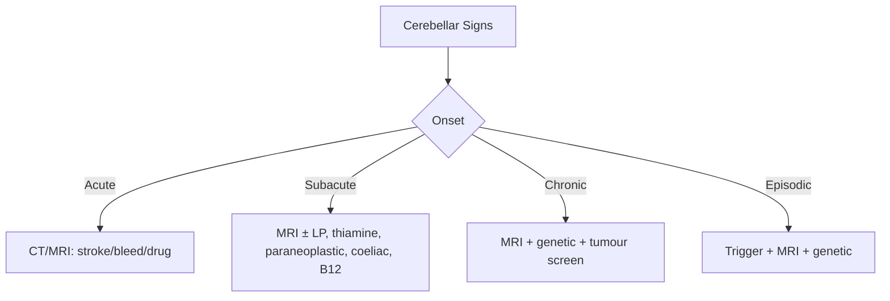

# Cerebellar Ataxia

Related: [[Movement Disorders Hub]], [[Ataxia & Gait Disorders Hub]], [[Friedreichs Ataxia]], [[Wilsons Disease]], [[Sensory Ataxia]], [[Paraneoplastic Neurological Disorders]]

> [!tip] Cerebellum = **COORDINATION, NOT STRENGTH.** Cerebellar ataxia = normal proprioception, no Romberg, but dysmetria, intention tremor, dysarthria, nystagmus.

## Learning Objectives
- [ ] Define cerebellar ataxia; classify acute/subacute/chronic-hereditary
- [ ] Localise: vermis (truncal), hemisphere (limb), flocculonodular (nystagmus)
- [ ] Identify red flags (stroke, Wernicke, paraneoplastic, posterior fossa mass)
- [ ] Order MRI brain, bloods, thiamine, paraneoplastic panel, genetics
- [ ] Treat specific causes (thiamine, IVIg, steroids, neurosurgery, rehab)

---

## 1. Definition / Epidemiology / Classification

**Definition:** Loss of coordination due to cerebellar or spinocerebellar pathway dysfunction. Characterised by dysmetria, intention tremor, dysarthria, gait ataxia, nystagmus.

**Epidemiology:** Prevalence hereditary ataxias ~1/10,000; sporadic more common. Bimodal (paediatric hereditary, adult acquired/degenerative).

**Classification:**
| Type | Onset | Examples |
|------|-------|----------|
| Acute (sec-hr) | Vascular, drugs, trauma, hyperthermia | Cerebellar stroke, phenytoin toxicity |
| Subacute (d-wk) | Wernicke, paraneoplastic, demyelinating, drugs, coeliac, hypothyroid | Mostly reversible |
| Chronic-prog | Hereditary (SCA, FA, AT, AOA), MSA-C, ILOCA, tumour, CJD | Mostly incurable |
| Episodic | EA1/EA2, MS, mitochondrial, basilar migraine | Treatable |

---

## 2. Aetiology / Pathophysiology

**Vascular:** PICA/AICA/SCA stroke, haemorrhage, venous thrombosis.
**Inflammatory:** MS, NMO, ADEM, sarcoid, gluten ataxia.
**Infectious:** Post-viral (varicella), CJD, Whipple, Listeria, HIV.
**Toxic/drugs:** Alcohol, phenytoin, carbamazepine, lithium, 5-FU, cytarabine, metronidazole, isoniazid, heavy metals (mercury, lead).
**Nutritional:** Thiamine (Wernicke), B12, vitamin E, copper.
**Neoplastic:** Primary (astrocytoma, medulloblastoma, hemangioblastoma), metastasis, paraneoplastic.
**Autoimmune:** Anti-GAD, anti-mGluR1, gluten, paraneoplastic (anti-Yo, Hu, Ri, Ma2, CV2, Tr).
**Hereditary:** AD (SCA1-48), AR (FA, AT, AOA1/2, AVED, Wilson), mitochondrial (MELAS, MERRF), X-linked (FXTAS).
**Degenerative:** MSA-C, ILOCA.

**Pathophysiology:** Purkinje cell loss → disrupted cortical output → loss of smooth coordination. Vermis = truncal/gait; hemisphere = ipsilateral limb; flocculonodular = VOR/nystagmus. Cerebellar stroke → oedema → brainstem compression / obstructive hydrocephalus (neurosurgical emergency).

**Molecular:** FA = GAA repeat in **FXN** (frataxin, mitochondrial iron-sulphur cluster); SCA = polyglutamine CAG repeats (SCA1, 2, 3, 6, 7, 17); AT = ATM; EA1 = KCNA1; EA2 = CACNA1A; FXTAS = FMR1 premutation.

---

## 3. Clinical Features

**History:** Onset (acute/subacute/chronic), progression, triggers (alcohol, exertion, stress in EA2), drugs, family history, systemic features (carcinoma, telangiectasia, malabsorption).

**Examination — Cerebellar Signs:**
| Sign | Localisation |
|------|--------------|
| Scanning/staccato speech | Hemisphere |
| Gaze-evoked nystagmus, square-wave jerks, VOR deficits | Flocculonodular |
| Dysmetria, intention tremor, dysdiadochokinesia, past-pointing, hypotonia, pendular reflexes | Hemisphere (ipsilateral) |
| Truncal ataxia, titubation, unable to sit | Vermis |
| Wide-based ataxic gait, veers to side of lesion | Midline + hemisphere |

**Cerebellar vs Sensory Ataxia:**
| Feature | Cerebellar | Sensory |
|---------|-----------|---------|
| Joint position | Normal | Lost |
| Romberg | Negative | Positive |
| Dysmetria | Present | Absent |
| Worsens | Standing | Eyes closed |

**Specific syndromes:**
- **Cerebellar stroke:** Sudden vertigo, headache, vomiting, ipsilateral ataxia, ± lateral medullary (PICA), ipsilateral facial (AICA).
- **Wernicke:** Triad = ophthalmoplegia/nystagmus, confusion, ataxia. Caine: 2 of 5 (dietary def, oculomotor, cerebellar, confusion, memory).
- **PCD:** Subacute pancerebellar over weeks. Anti-Yo (breast/ovary), anti-Hu (SCLC), anti-Ri (breast/SCLC), anti-Ma2 (testis), anti-Tr (Hodgkin).
- **MSA-C:** Parkinsonism + cerebellar + autonomic failure.
- **FA:** Onset <25, gait ataxia, kyphoscoliosis, pes cavus, HCM, diabetes, optic atrophy, absent LL reflexes.
- **AT:** Cerebellar ataxia + telangiectasia + immunodeficiency + raised AFP + malignancy.

---

## 4. Diagnostic Approach

**Severity: SARA** (Scale for Assessment and Rating of Ataxia) 0-40 (gait, stance, sitting, speech, finger-chase, nose-finger, alternating, heel-shin). >17 = severe.

---

## 5. Investigations

| Test | Indication |
|------|-----------|
| **MRI Brain** (T1, T2, FLAIR, DWI, SWI) | All new ataxia |
| **FBC, ESR, U&E, LFT, Ca, Mg, glucose** | All |
| **TFT, B12, folate, vitamin E** | All subacute/chronic |
| **Thiamine** | All alcohol/malnourished |
| **Coeliac (tTG, EMA)** | Gait + GI |
| **A1C, lipids** | FA |
| **MRI Spine** | FA, paraneoplastic, demyelinating |
| **MRA** | Stroke |
| **CSF** (OCB, NfL, paraneoplastic Abs, RT-QuIC) | MS, PCD, CJD |
| **Paraneoplastic panel** (Yo, Hu, Ri, Ma2, CV2, Tr, GAD, mGluR1) | Subacute ataxia |
| **ANA, ANCA, ENA, APLA, anti-GAD, anti-TPO** | Autoimmune |
| **Lactate, pyruvate, amino acids, VLCFA, ammonia** | Mitochondrial, metabolic |
| **Ceruloplasmin, 24-hr urinary Cu, K-F ring** | Wilson |
| **HIV, VDRL, Lyme, Whipple PCR** | Infectious |
| **Genetic:** FA (FXN), SCA panel, FXTAS, AOA1/2, AT, AVED, mitochondrial | Family history, age-appropriate |

**Imaging signs:**
- **Hot-cross bun** = MSA-C (also SCA2, ILOCA, CJD) — cruciform T2 hyperintensity in pons
- **MCP sign** = MSA-C, SCA2 — middle cerebellar peduncle T2 hyperintensity
- **Cerebellar atrophy** = chronic alcohol, SCA, ILOCA
- **Posterior fossa mass** = tumour, abscess, haematoma

---

## 6. Differential Diagnosis

| Differential | Distinguishing | Key Test |
|--------------|----------------|----------|
| Sensory ataxia | Lost JPS, Romberg + | JPS exam, MRI cord |
| Vestibular | Vertigo, abnormal VOR | HINTS, video-oculography |
| Frontal gait | Magnetic, shuffling | MRI, frontal signs |
| Parkinson gait | Shuffling, narrow base | Bradykinesia, rigidity |
| NPH | Triad gait/dementia/incontinence | MRI (ventriculomegaly) |
| CJD | Rapid dementia, myoclonus | MRI cortical ribbon, RT-QuIC |
| Functional | Inconsistent, Hoover + | Bedside exam |

---

## 7. Management

**Emergency — Malignant cerebellar oedema:** Posterior fossa mass effect + brainstem compression / obstructive hydrocephalus → **neurosurgical decompression** (suboccipital craniectomy) within 48-72 h. Mannitol/HTS, intubation if GCS ≤8, ICU.

**Specific treatments:**
| Cause | Treatment |
|-------|-----------|
| Wernicke | **Thiamine 500 mg IV TDS × 2-3 d**, then 250 mg × 5 d, then oral — **BEFORE glucose** |
| Demyelinating (MS/NMO) | IV methylprednisolone 1 g × 3-5 d; PLEX if severe |
| Paraneoplastic | Treat tumour; IVIg, methylpred, PLEX, rituximab |
| Gluten ataxia | Strict gluten-free diet |
| Vit E def (AVED) | Vitamin E 800-2000 IU/d |
| B12 def | Hydroxocobalamin 1 mg IM × 5 then monthly |
| Hypothyroid | Levothyroxine |
| Drug-induced | Stop drug (phenytoin, lithium, 5-FU, metronidazole) |
| Wilson | Penicillamine, trientine, zinc |
| Mitochondrial | CoQ10, riboflavin, L-carnitine; avoid valproate |
| EA1 | Carbamazepine |
| EA2 | Acetazolamide, 4-aminopyridine |

**Symptomatic:** Tremor — propranolol, primidone. Nystagmus/vertigo — gabapentin, baclofen, 4-AP. Spasticity — baclofen, tizanidine. Dysarthria — speech therapy. Gait — physio, walking aids.

**Rehab:** Physiotherapy (Frenkel, vestibular), OT, SALT, neuropsychology, social, support groups (Ataxia UK).

**Surgical:** Posterior fossa decompression (tumour, stroke, Chiari), VP shunt (hydrocephalus), tumour resection, DBS (experimental).

---

## 8. Drug Cautions
- **Metronidazole:** cerebellar toxicity; avoid >4 weeks
- **Phenytoin:** cerebellar atrophy; avoid in FA, AT, porphyria
- **Lithium:** cerebellar toxicity; monitor levels
- **5-FU, Ara-C, capecitabine:** cerebellar syndrome (dose-related)
- **Valproate:** avoid in mitochondrial, urea cycle, pregnancy
- **Alcohol:** worsens cerebellar degeneration

---

## 9. Procedures
- **LP:** After MRI/CT to exclude mass effect
- **Genetic counselling:** Multidisciplinary (neuro, genetic counsellor, psychologist); no preventive treatment

---

## 10. Complications
| Complication | Management |
|--------------|-----------|
| Falls/fractures | Physio, walking aids, hip protectors |
| Aspiration | Swallowing assessment, SALT, NGT/PEG |
| Obstructive hydrocephalus | EVD, VP shunt, decompression |
| Brainstem compression | Urgent neurosurgery |
| Cardiomyopathy (FA) | Echo, cardiology |
| Diabetes (FA) | Monitoring, insulin |
| Depression (30-50%) | SSRI, CBT |

---

## 11. Red Flags
- **Sudden severe headache + vomiting + ataxia** → Cerebellar haemorrhage/stroke — urgent CT, neurosurgery
- **↓GCS / brainstem signs in cerebellar lesion** → Malignant oedema — urgent decompression
- **Subacute pancerebellar in smoker** → Paraneoplastic — CT CAP, antibody panel
- **Wernicke triad** → Thiamine IV IMMEDIATELY (do not wait for MRI)
- **Childhood + telangiectasia + infections** → Ataxia-telangiectasia
- **FA + cardiomyopathy/diabetes** → Cardiology, endocrinology

---

## 12. Prognosis
- **Acute stroke:** Variable; malignant oedema 80% mortality if untreated
- **Wernicke:** Days-weeks if treated early; chronic Korsakoff if delayed
- **Paraneoplastic:** Poor unless tumour eradicated
- **FA:** Wheelchair-bound by 10-15 yr; death 4th-5th decade (cardiomyopathy)
- **SCA:** Progressive; survival 10-30 yr
- **MSA-C:** Median 6-9 yr
- **ILOCA:** Slow; normal life expectancy
- **EA:** Normal life expectancy with prophylaxis

---

## 13. Topic Correlation
- [[Movement Disorders Hub]] — differential hyperkinetic vs ataxic
- [[Friedreichs Ataxia]] — FRDA, cardiomyopathy
- [[Wilsons Disease]] — wing-beating tremor + ataxia
- [[Sensory Ataxia]] — JPS, Romberg
- [[Paraneoplastic Neurological Disorders]] — PCD, anti-Yo/Hu/Ri
- [[Multiple System Atrophy]] — MSA-C, hot-cross bun

---

## 14. Special Situations
- **Pregnancy:** Avoid valproate; continue physio, vitamin supplementation; pre-implantation genetic diagnosis for hereditary
- **Lactation:** Most symptomatic drugs cross milk; thiamine safe
- **Paediatric:** FA, AT, AOA, mitochondrial, posterior fossa tumours; avoid phenytoin
- **Elderly:** ILOCA, MSA-C, drug-induced, paraneoplastic, CJD; falls prevention critical
- **Renal/hepatic:** Dose adjust baclofen, gabapentin, tizanidine
- **Immunocompromised:** PML, fungal, HIV, Whipple
- **Driving (DVLA):** Notify; usually restricted if gait unsafe

---

## FCPS/MRCP High-Yield Summary
| Category | Key Points |
|----------|------------|
| **Definition** | Loss of coordination due to cerebellar dysfunction |
| **Aetiology** | Stroke, Wernicke, paraneoplastic, hereditary (SCA, FA, AT), MSA-C, drugs, demyelination |
| **Localisation** | Vermis=truncal, hemisphere=ipsilateral limb, flocculonodular=nystagmus |
| **Clinical** | Dysmetria, intention tremor, dysdiadochokinesia, nystagmus, scanning speech, ataxic gait |
| **Cerebellar vs sensory** | Cerebellar: normal JPS, no Romberg; Sensory: lost JPS, Romberg + |
| **Investigations** | MRI brain (±spine), bloods (B12, E, TFT, coeliac), thiamine, paraneoplastic, genetic, LP |
| **Imaging signs** | Hot-cross bun (MSA), MCP sign (MSA, SCA2), cerebellar atrophy, posterior fossa mass |
| **Management** | Treat cause; thiamine IV for Wernicke; neurosurgery for malignant oedema; rehab |
| **Doses** | Thiamine 500 mg IV TDS; Methylpred 1 g IV; Acetazolamide 250-500 mg BD |
| **Scoring** | SARA 0-40; ICARS |
| **Viva Pearls** | "Wernicke triad"; "Hot-cross bun = MSA"; "Thiamine BEFORE glucose"; "MCP sign in SCA2/MSA"; "FA = GAA + cardiomyopathy" |

---

## Viva Questions
1. **Cerebellar vs sensory ataxia?** → Cerebellar: normal JPS, no Romberg, dysmetria, dysdiadochokinesia. Sensory: lost JPS, Romberg +.
2. **Wernicke triad + management?** → Ophthalmoplegia, confusion, ataxia. **Thiamine 500 mg IV TDS BEFORE glucose.**
3. **Localise cerebellar lesion?** → Vermis=truncal/gait; hemisphere=ipsilateral limb; flocculonodular=nystagmus/VOR.
4. **Subacute cerebellar ataxia differential?** → Wernicke, paraneoplastic (Yo/Hu/Ri), demyelinating, drugs (phenytoin, 5-FU, metronidazole), coeliac, hypothyroid.
5. **Red flags?** → Posterior fossa mass, ↓GCS, smoker subacute, Wernicke triad, FA features.
6. **Hot-cross bun?** → MSA-C (also SCA2, ILOCA, CJD). Cruciform pontine T2 hyperintensity.
7. **FA features and gene?** → GAA repeat FXN, onset <25, kyphoscoliosis, pes cavus, HCM, diabetes, optic atrophy, areflexia.
8. **PCD antibodies?** → Anti-Yo (breast/ovary), anti-Hu (SCLC), anti-Ri (breast/SCLC), anti-Ma2 (testis), anti-Tr (Hodgkin).
9. **Malignant cerebellar oedema management?** → Neurosurgical decompression; mannitol, EVD, ICU.
10. **Drugs causing ataxia?** → Phenytoin, carbamazepine, lithium, 5-FU, cytarabine, metronidazole, isoniazid, alcohol.

---

## Common Confusions
| Confusion | Clarification |
|-----------|---------------|
| Romberg + in cerebellar? | No — positive only in sensory or vestibular, not pure cerebellar |
| Hot-cross bun only MSA? | Most common in MSA-C, also SCA2, ILOCA, CJD |
| FA: AD or AR? | AR (GAA repeat both alleles) |
| Thiamine timing | IV thiamine BEFORE glucose in Wernicke; glucose alone precipitates Wernicke |
| SARA for severity, not diagnosis | SARA = clinical rating, not diagnostic tool |
| Acute ataxia in child | Post-infectious, posterior fossa tumour, drug, intoxication |

---

## Mnemonics
1. **WAND** — **W**ernicke: oculomotor + **A**taxia + confusio**N** + **D**ietary
2. **FA F**r**a**taxin** — FXN gene, mitochondrial iron-sulphur cluster defect
3. **VOMIT** — **V**ascular, **O**ccupational (toxins), **M**etabolic, **I**nflammatory, **T**umour/hereditary

---

## Summary
Cerebellar ataxia is a clinical syndrome of incoordination. First step: **anatomical localisation** (vermis = truncal; hemisphere = limb; flocculonodular = nystagmus) and **time course**. **MRI brain is cornerstone** in all patients. Emergencies: cerebellar stroke with malignant oedema (neurosurgical decompression), Wernicke (IV thiamine before glucose), paraneoplastic (smokers, anti-Yo/Hu/Ri). Hereditary ataxias (FA, SCA, AT) require genetic testing and counselling. Management is largely supportive with disease-modifying therapy for specific causes.

---

## MCQs (10)

1. **Which sign distinguishes cerebellar from sensory ataxia?**
   A. Positive Romberg B. Loss of JPS C. Dysdiadochokinesia D. Pseudoathetosis
   **Answer: C** — Dysdiadochokinesia is cerebellar.

2. **50-year-old alcoholic with confusion, nystagmus, ataxia. Immediate management?**
   A. CT head B. IV glucose 50% C. IV thiamine 500 mg D. IV methylprednisolone
   **Answer: C** — Thiamine IV BEFORE glucose.

3. **"Hot-cross bun" sign on MRI is most characteristic of:**
   A. FA B. MSA-C C. SCA1 D. AT
   **Answer: B** — MSA-C (also SCA2, ILOCA, CJD).

4. **Anti-Yo antibodies in subacute cerebellar ataxia suggest:**
   A. SCLC B. Breast/ovarian C. Hodgkin D. Testis
   **Answer: B** — Anti-Yo = breast/ovary.

5. **14-year-old with progressive gait ataxia, kyphoscoliosis, pes cavus, areflexia, HCM. Diagnosis?**
   A. AT B. FA C. Wilson D. SCA3
   **Answer: B** — FRDA: AR, GAA in FXN, onset <25, kyphoscoliosis, pes cavus, HCM, areflexia.

6. **Cerebellar hemisphere lesions cause:**
   A. Truncal ataxia B. Ipsilateral limb ataxia C. Vertigo D. Bilateral leg ataxia
   **Answer: B** — Hemisphere = ipsilateral appendicular ataxia.

7. **Which drug most likely causes cerebellar ataxia?**
   A. Atenolol B. Phenytoin C. Paracetamol D. Amoxicillin
   **Answer: B** — Phenytoin (also lithium, 5-FU, cytarabine, metronidazole).

8. **Malignant cerebellar oedema with brainstem compression requires:**
   A. Mannitol only B. Urgent neurosurgical decompression C. IV heparin D. PLEX
   **Answer: B** — Posterior fossa decompression.

9. **Acetazolamide prophylaxis is first-line for:**
   A. SCA3 B. FA C. EA2 D. MSA-C
   **Answer: C** — EA2 (CACNA1A) responds to acetazolamide.

10. **Friedreich ataxia gene defect:**
    A. SCA1 polyglutamine B. FXN GAA trinucleotide C. ATM kinase D. APTX
    **Answer: B** — GAA repeat in FXN intron 1.

---

## SBAs (10)

1. **35-year-old woman with subacute pancerebellar syndrome + anti-Yo. CT CAP normal. Next step?**
   A. Reassure B. Mammography + pelvic MRI ± PET-CT C. IVIg empirical D. Stop work-up
   **Answer: B** — Anti-Yo strongly associated with breast/ovary. Repeat imaging with mammography, pelvic MRI, or PET-CT.

2. **60-year-old with progressive gait ataxia, urinary incontinence, erectile dysfunction, parkinsonism. Diagnosis?**
   A. PD B. MSA-C C. Vascular parkinsonism D. PSP
   **Answer: B** — MSA-C: cerebellar + autonomic + parkinsonism. Hot-cross bun.

3. **Child with ataxia, oculocutaneous telangiectasia, infections, raised AFP. Diagnosis?**
   A. FA B. AT C. AOA2 D. Cockayne
   **Answer: B** — AT: AR, ATM, telangiectasia, immunodeficiency, malignancy, ↑AFP. Avoid ionising radiation.

4. **MRI showing isolated cerebellar atrophy in adults. Most common cause?**
   A. Alcohol B. SCA1 C. MSA-C D. ILOCA
   **Answer: A** — Chronic alcohol is the most common cause of isolated cerebellar atrophy (anterior vermis).

5. **Immediate priority in suspected Wernicke?**
   A. MRI B. LP C. IV thiamine before glucose D. EEG
   **Answer: C** — Thiamine 500 mg IV immediately on suspicion.

6. **45-year-old on 5-FU with subacute gait ataxia. Mechanism?**
   A. Paraneoplastic B. Drug-induced cerebellar toxicity C. Stroke D. Wernicke
   **Answer: B** — 5-FU/capecitabine/cytarabine cause cerebellar toxicity; dose-related. Stop drug.

7. **25-year-old with episodic ataxia, vertigo, nystagmus on exertion; CACNA1A mutation. Best prophylaxis?**
   A. Propranolol B. Acetazolamide C. Phenytoin D. Gabapentin
   **Answer: B** — EA2 (CACNA1A) = acetazolamide ± 4-aminopyridine.

8. **10-year-old with sudden gait ataxia, headache, vomiting after varicella. MRI normal. Diagnosis?**
   A. Stroke B. Acute post-infectious cerebellar ataxia C. Medulloblastoma D. FA
   **Answer: B** — Post-infectious cerebellar ataxia in children, especially varicella. Self-limiting.

9. **Hot-cross bun in MSA-C represents:**
   A. Pontine haemorrhage B. Loss of transverse pontocerebellar fibres C. Tumour D. Central pontine myelinolysis
   **Answer: B** — Cruciform T2 hyperintensity from loss of transverse pontocerebellar fibres sparing corticospinal.

10. **28-year-old with new cerebellar ataxia, hypothyroidism, anti-TPO. Diagnosis?**
    A. Hashimoto encephalopathy B. Hashimoto cerebellar ataxia C. Whipple D. Coeliac
    **Answer: B** — Hashimoto cerebellar ataxia: anti-TPO, often steroid-responsive.

---

## Flashcards

- **Q:** Wernicke triad?
  **A:** Ophthalmoplegia + confusion + ataxia (Caine: 2 of 5)
- **Q:** Hot-cross bun?
  **A:** MSA-C (also SCA2, ILOCA, CJD) — cruciform T2 hyperintensity in pons
- **Q:** FA gene?
  **A:** GAA repeat in FXN (frataxin) — AR, mitochondrial
- **Q:** Anti-Yo tumour?
  **A:** Breast, ovarian
- **Q:** Anti-Hu tumour?
  **A:** SCLC
- **Q:** Anti-Tr tumour?
  **A:** Hodgkin
- **Q:** Anti-Ri tumour?
  **A:** Breast, SCLC (opsoclonus-myoclonus)
- **Q:** EA1 vs EA2?
  **A:** EA1 = KCNA1 = carbamazepine; EA2 = CACNA1A = acetazolamide
- **Q:** Vermis signs?
  **A:** Truncal ataxia, gait instability, titubation
- **Q:** SARA range?
  **A:** 0-40; >17 = severe

---

## Answer Key

### MCQs
1. **C** — Dysdiadochokinesia 2. **C** — Thiamine IV 3. **B** — MSA-C 4. **B** — Breast/ovary 5. **B** — FA 6. **B** — Ipsilateral limb 7. **B** — Phenytoin 8. **B** — Neurosurgical decompression 9. **C** — EA2 10. **B** — FXN GAA

### SBAs
1. **B** — Mammography + MRI/PET 2. **B** — MSA-C 3. **B** — AT 4. **A** — Alcohol 5. **C** — Thiamine before glucose 6. **B** — Drug toxicity 7. **B** — Acetazolamide 8. **B** — Post-infectious 9. **B** — Loss of transverse pontocerebellar fibres 10. **B** — Hashimoto cerebellar ataxia

---

## Local Navigation
**Topic-Group Hub:** [[05_Movement_Disorders/Ataxia & Gait Disorders Hub]]
**Chapter MOC:** [[Neurology MOC]]
**Related:** [[Friedreichs Ataxia]], [[Wilsons Disease]], [[Sensory Ataxia]], [[Multiple System Atrophy]]
