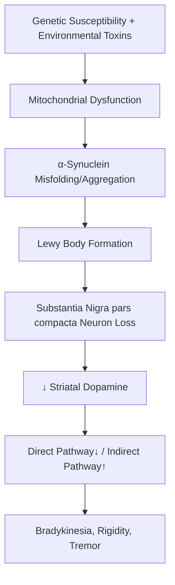
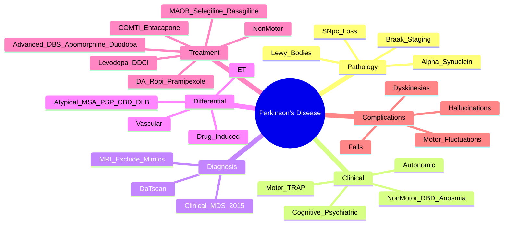

# Parkinson's Disease

> [!tip] **PD = TRAP: Tremor (resting), Rigidity (cogwheel), Akinesia/bradykinesia, Postural instability** (later)
> **Asymmetric onset**, **levodopa-responsive**, with **non-motor symptoms** (anosmia, RBD, constipation, depression) preceding motor by years.

## 1. Definition / Epidemiology / Classification

### Definition
Idiopathic Parkinson's disease = sporadic, progressive synucleinopathy with **nigrostriatal dopaminergic neuron loss + α-synuclein (Lewy body) inclusions**.

### Epidemiology
- **Prevalence:** 1-2% >65y; 3-5% >85y
- **Incidence:** 10-20/100,000/year
- **Age:** Median onset 60y (young-onset <50y)
- **Sex:** M:F = 3:2
- **Risk ↑:** Age, rural living, well water (pesticides), MPTP exposure, head trauma, melanoma
- **Risk ↓:** Smoking, caffeine, physical activity, NSAIDs (?)

### Classification
| Type | Features |
|------|----------|
| **Idiopathic PD** | Asymmetric, levodopa-responsive, no atypical features |
| **Young-onset PD** | <50y; genetic mutations (PARKIN, LRRK2); dystonia prominent; slow progression |
| **Drug-induced parkinsonism** | Antipsychotics, metoclopramide; usually bilateral/symmetric |
| **Atypical parkinsonism (Parkinson-plus)** | MSA, PSP, CBD, DLB — see Differential |

---

## 2. Aetiology / Pathophysiology

### Aetiology
- **Genetic (5-10%):** LRRK2 (autosomal dominant, common in Ashkenazi/North African), PARK2 (Parkin, young-onset AR), PINK1, SNCA, GBA (↑risk, ↑dementia)
- **Environmental:** MPTP (Designer drug contaminant — selective SNpc toxicity), pesticides (rotenone, paraquat), manganese
- **Protective:** Caffeine, smoking, urate, physical activity

### Pathophysiology

### Pathology — **Braak Staging**
1. **Stages 1-2:** Dorsal motor nucleus of vagus, olfactory bulb → **anosmia, autonomic dysfunction, RBD** (pre-motor)
2. **Stages 3-4:** Substantia nigra, limbic system → **motor symptoms, depression**
3. **Stages 5-6:** Cortex → **dementia, hallucinations**

> [!tip] **Lewy bodies** = eosinophilic cytoplasmic inclusions of **α-synuclein + ubiquitin** in surviving neurons.

---

## 3. Clinical Features

### Motor Features — **TRAP**
| Feature | Description |
|---------|-------------|
| **Tremor** | **Resting** (4-6Hz), "pill-rolling", ↑with stress, ↓with voluntary movement; starts unilateral (asymmetric) |
| **Rigidity** | "Lead-pipe" + **cogwheel** (tremor superimposed on rigidity); ↑with contralateral movement (Froment's sign) |
| **Akinesia/Bradykinesia** | Slowness, ↓blink, ↓facial expression (masked facies/hypomimia), ↓arm swing, micrographia, festination |
| **Postural instability** | Late (>10y); falls, freezing of gait, retropulsion (pull test) |

### Non-Motor Features (often **precede motor by years**)
| Domain | Features |
|--------|----------|
| **Sleep** | **REM sleep behaviour disorder (RBD)** — dream enactment, violent; insomnia; RLS; EDS |
| **Autonomic** | Constipation, orthostatic hypotension, urinary urgency, sexual dysfunction, hyperhidrosis |
| **Sensory** | Anosmia (90%), pain, restless legs |
| **Neuropsychiatric** | Depression (40%), anxiety, apathy, **visual hallucinations** (drug-induced or disease), psychosis |
| **Cognitive** | MCI → PD dementia (esp. older, late disease); executive dysfunction |

### Examination Findings
- **Glabellar tap sign (Myerson):** Inability to suppress blink (positive in PD)
- **Stooped posture, "simian stance"**
- **Festination:** Shuffling, accelerating gait
- **Freezing of gait:** "Feet glued to floor"; common in advanced PD, esp. turns/doorways
- **Kayser-Fleischer rings:** Wilson's disease (NOT PD)

---

## 4. Diagnostic Approach / Algorithm

### MDS 2015 Clinical Diagnostic Criteria
**Two phases:** (1) Diagnose parkinsonism; (2) Apply PD criteria.

**Parkinsonism:** Bradykinesia + ≥1 of (resting tremor, rigidity)

**PD Diagnosis — Supportive/Exclusion/Red Flag Criteria**
| Supportive (≥2 needed) | Exclusion | Red Flags |
|------------------------|-----------|-----------|
| Asymmetric onset | Cerebellar signs | Falls within 3y |
| Levodopa response (>30% UPDRS-III) | Supranuclear gaze palsy | Wheelchair within 5y |
| Levodopa-induced dyskinesia | Cortical signs (aphasia, alien limb) | Dysautonomia early (orthostatic, urinary) |
| Resting tremor | Non-response to levodopa | Stridor, inspiratory sighs |
|  | Normal DaTscan | Bulbar dysfunction early |

---

## 5. Investigations

### Diagnosis is **Clinical** — Investigations to:
1. Exclude mimics
2. Confirm dopaminergic deficit (when uncertain)

### First-Line
| Test | Indication | Finding |
|------|------------|---------|
| **MRI Brain** | Exclude vascular, NPH, tumour, MSA (hot cross bun, putaminal atrophy in MSA-C) | Usually normal in PD |
| **DaTscan (FP-CIT SPECT)** | Diagnostic uncertainty (tremor, young-onset, vs ET) | **↓ presynaptic dopamine transporter binding in striatum** (asymmetric; PD pattern) |

### When to Consider
| Test | Indication |
|------|------------|
| **Copper, caeruloplasmin, 24h urinary copper** | Young-onset (<40y) — Wilson's disease |
| **EEG** | DLB (slow wave), Creutzfeldt-Jakob |
| **Sleep study (PSG)** | RBD confirmation (if dream enactment) |
| **MIBG myocardial scan** | PD/DLB (↓ uptake) vs MSA (normal) |
| **Genetic testing** | Young-onset, family history (PARKIN, LRRK2, GBA) |

> [!tip] **DaTscan CANNOT distinguish PD from MSA/PSP** — all show reduced uptake. Used to distinguish from ET (normal) or non-degenerative tremor.

---

## 6. Differential Diagnosis
| Condition | Distinguishing Features |
|-----------|------------------------|
| **Essential Tremor** | **Action/postural** tremor (NOT resting), bilateral, ±family history, alcohol responsive, normal DaTscan |
| **Drug-induced parkinsonism** | Antipsychotics, metoclopramide, prochlorperazine; symmetric, no tremor, no progression after drug stop (months to reverse) |
| **Multiple System Atrophy (MSA-P)** | Early autonomic failure (orthostatic, urinary), cerebellar signs (MSA-C), poor levodopa response, **hot cross bun sign** on MRI |
| **Progressive Supranuclear Palsy (PSP)** | **Vertical gaze palsy** (downward), early falls (within 1y), axial rigidity, cognitive decline, **hummingbird sign** on MRI |
| **Corticobasal Degeneration (CBD)** | Asymmetric, apraxia, alien limb, cortical sensory loss, dystonia, myoclonus |
| **Dementia with Lewy Bodies (DLB)** | Dementia before/within 1y of motor symptoms, **visual hallucinations** early, fluctuating cognition |
| **Vascular Parkinsonism** | Lower-body predominant, gait (shuffling "magnetic"), vascular lesions on MRI |
| **Wilson's Disease** | <40y, KF rings, hepatic, dystonia, psychiatric, ↓caeruloplasmin |

---

## 7. Management

### Symptomatic — Levodopa vs Dopamine Agonists
> [!tip] **Strategy:** In young-onset (<60y), consider **dopamine agonists first** (less dyskinesia); in elderly (≥65y) or cognitive impairment, **levodopa first** (best efficacy, simpler).

### Levodopa
| Drug | Dose | Notes |
|------|------|-------|
| **Co-beneldopa (Madopar)** | 62.5-125mg TDS, titrate | **Levodopa + benserazide (DDCI)** |
| **Co-careldopa (Sinemet)** | 62.5-125mg TDS | **Levodopa + carbidopa** |
| **Modified release (MR)** | At bedtime for nocturnal symptoms | Slower onset |

- **Mechanism:** Dopamine precursor; co-administered with DDCI to prevent peripheral conversion → ↓nausea, ↑CNS delivery
- **Side effects:** Nausea, vomiting, orthostatic hypotension, **dyskinesias** (30% within 5y), **wearing-off**, **on-off fluctuations**, hallucinations (elderly)

### Dopamine Agonists
| Drug | Dose | Notes |
|------|------|-------|
| **Ropinirole** | 0.25mg TDS → ↑3-9mg TDS | Non-ergot; oral; **impulse control disorders (ICD)** |
| **Pramipexole** | 0.125mg TDS → 0.75-3.3mg/day | Same class; ↓risk of sedation; **sleep attacks** |
| **Rotigotine patch** | 2-8mg/24h patch | Once-daily; good for adherence/sleep |
| **Apomorphine** | SC bolus/infusion | Advanced PD; rapid rescue; **highly emetic — domperidone cover** |

### MAO-B Inhibitors
| Drug | Dose | Notes |
|------|------|-------|
| **Selegiline** | 5-10mg daily | Older; amphetamine metabolite (insomnia) |
| **Rasagiline** | 1mg daily | Newer; better tolerated; MAO-B selective |
| **Safinamide** | 50-100mg daily | Newest; dual action (MAO-B + Na channel) |

- Use: early monotherapy or adjunct; mild symptomatic effect; possibly **disease-modifying** (?MAOB trial)

### COMT Inhibitors
| Drug | Dose | Notes |
|------|------|-------|
| **Entacapone** | 200mg with each levodopa dose | ↓ "off" time; orange discoloration of urine; diarrhoea |
| **Tolcapone** | 100mg TDS | More potent; **hepatotoxicity** — LFT monitoring |
| **Opicapone** | 50mg daily | Once-daily; ↓off time; safer than tolcapone |

### Anticholinergics
- **Trihexyphenidyl (benzhexol):** 1-2mg TDS; **AVOID in elderly** (cognitive decline); useful for **tremor** in young
- **Side effects:** Confusion, urinary retention, dry mouth, glaucoma exacerbation

### Amantadine
- **Dose:** 100mg BD/TDS; NMDA antagonist + ↑dopamine release
- **Use:** **Reduce levodopa-induced dyskinesias**, mild PD symptoms; renal adjust

### Advanced Therapies (Motor Fluctuations / Dyskinesias)
| Therapy | Indication | Mechanism |
|---------|------------|-----------|
| **Deep Brain Stimulation (DBS)** | Motor fluctuations, dyskinesias, young age, no dementia | **STN or GPi** stimulation; best for tremor; levodopa-responsive |
| **Apomorphine SC infusion** | Refractory "off" periods | Continuous dopaminergic stimulation |
| **Levodopa-Carbidopa Intestinal Gel (Duodopa/Duodopa)** | Severe motor fluctuations | Continuous jejunal infusion |
| **Levodopa-Carbidopa-Entacapone (Stalevo)** | Wearing-off | Combined |

### Non-Motor Symptom Management
| Symptom | Treatment |
|---------|-----------|
| **Hallucinations** | ↓dopaminergic drugs; **Quetiapine 12.5-50mg** (preferred) or **Clozapine 12.5-50mg** (more effective, requires WBC monitoring) |
| **Depression** | **SSRIs (sertraline, citalopram)**; avoid MAOIs with selegiline; avoid TCAs (anticholinergic) |
| **Constipation** | Macrogol, lactulose; ↑fibre, fluids |
| **Orthostatic hypotension** | Stop antihypertensives; midodrine, fludrocortisone; ↑salt/fluid |
| **RBD** | Melatonin 3-12mg OR Clonazepam 0.5-1mg |
| **PD Dementia** | **Rivastigmine** (only licensed); memantine |

---

## 8. Drug Interactions
| Drug | Interaction |
|------|-------------|
| **Antipsychotics** | **AVOID typical (haloperidol)** and most atypicals (risperidone, olanzapine) — block D2, worsen PD |
| **Metoclopramide** | Causes/worsens parkinsonism (D2 antagonist) — use **domperidone** instead |
| **MAO-B inhibitors + SSRIs** | **Serotonin syndrome** risk (esp. selegiline + fluoxetine); avoid combination |
| **Anaesthesia** | Avoid halothane, suxamethonium interaction with anticholinergics |

---

## 9. Procedures
### DaTscan (FP-CIT SPECT)
- **Indication:** Diagnostic uncertainty
- **Pre-treatment:** Thyroid blockade (potassium iodide/iodate), stop drugs affecting dopaminergic system
- **Finding:** ↓striatal uptake (caudate + putamen in PD, asymmetric)

### Lumbar Puncture
- **Indication:** Rule out NPH, infection, autoimmune (rarely needed in PD)

---

## 10. Complications
| Complication | Frequency | Management |
|--------------|-----------|------------|
| **Motor fluctuations** ("wearing-off", "on-off") | 30% at 5y, 60% at 10y | Add COMTi, MAO-Bi, DA; switch to MR levodopa; advanced therapies |
| **Dyskinesias** | 30% at 5y | ↓levodopa, add amantadine; DBS |
| **Falls** | 60% in advanced | PT, OT, walking aids; ↓antihypertensives |
| **Hallucinations** | 30-50% | ↓dopaminergics; quetiapine/clozapine |
| **Impulse control disorders (ICD)** | 10-15% with DA | ↓/stop DA; counsel; consider DBS |
| **Aspiration pneumonia** | Late | Swallowing assessment; PEG |
| **Autonomic dysfunction** | Common | Midodrine, fludrocortisone |

---

## 11. Red Flags (Suggesting Atypical Parkinsonism)
| Red Flag | Consider |
|----------|----------|
| **Symmetric onset** | MSA, PSP |
| **Early falls (within 3y)** | PSP |
| **Vertical gaze palsy** | PSP |
| **Early dysautonomia** | MSA |
| **Cerebellar signs** | MSA-C |
| **Dementia early (before/within 1y of motor)** | DLB |
| **Apraxia, alien limb** | CBD |
| **No levodopa response** | Atypical, vascular |
| **Stridor** | MSA |

---

## 12. Prognosis
| Factor | Good | Poor |
|--------|------|------|
| **Age onset** | <60y | >70y |
| **Phenotype** | Tremor-dominant | PIGD (postural instability/gait difficulty) |
| **Levodopa response** | Robust | Poor/absent |
| **Cognitive** | Preserved early | Early dementia |
| **Comorbidities** | Few | Multiple |

- **Time to falls:** ~10y after diagnosis
- **Median survival:** 12-15 years from diagnosis
- **Cause of death:** Pneumonia (aspiration), falls, cardiovascular, dementia complications

---

## 13. Topic Correlation
| Topic | Overlap |
|-------|---------|
| **Atypical Parkinsonism** | MSA, PSP, CBD, DLB |
| **Essential Tremor** | Differentiate by tremor type, DaTscan |
| **Drug-induced Parkinsonism** | Antipsychotics, metoclopramide |
| **Dementia with Lewy Bodies** | Same α-synuclein pathology, dementia early |
| **REM Sleep Behaviour Disorder** | Strong marker of synucleinopathy (PD/DLB/MSA); often precedes motor by decades |

---

## 14. Special Situations
- **Pregnancy:** Rare (mostly elderly); ropinirole, levodopa considered safest; avoid amantadine (teratogenic)
- **Young-onset (<50y):** Genetic testing (PARKIN, LRRK2); consider DA first (levodopa-sparing); DBS may be option
- **Elderly:** Levodopa preferred; avoid anticholinergics, amantadine; dementia care
- **Perioperative:** Continue levodopa; NG tube for severe dysphagia; NG/PEG; **avoid metoclopramide** (worsens PD), use domperidone/ondansetron
- **Driving (DVLA):** Notify DVLA; medical assessment; depends on disability, hallucinations, freezing

---

## FCPS/MRCP High-Yield Summary
| Category | Key Points |
|----------|------------|
| **Diagnosis** | Clinical; Bradykinesia + ≥1 (rigidity, resting tremor); Asymmetric, levodopa-responsive |
| **Non-motor** | Anosmia, RBD, depression, constipation — precede motor by years |
| **Pathology** | α-synuclein (Lewy bodies); Braak staging |
| **MDS criteria** | Supportive + no exclusion + no red flags |
| **DaTscan** | ↓striatal uptake in PD vs normal in ET |
| **Treatment** | **Levodopa + DDCI** gold standard; DA first in young; MAO-Bi/COMTi adjunct |
| **Advanced** | DBS, apomorphine, Duodopa for motor complications |
| **Avoid** | Typical antipsychotics, metoclopramide (use domperidone) |
| **Hallucinations** | Quetiapine or Clozapine; ↓dopaminergics |
| **Red flags** | Early falls (PSP), dysautonomia (MSA), gaze palsy, dementia (DLB) |

---

## Viva Questions
1. **TRAP mnemonic?** Tremor (resting), Rigidity, Akinesia/bradykinesia, Postural instability.
2. **First-line treatment of PD?** Levodopa + DDCI (Sinemet/Madopar).
3. **Why DDCI with levodopa?** Carbidopa/benserazide inhibit peripheral DOPA decarboxylase → ↑CNS delivery, ↓peripheral side effects (nausea).
4. **Side effects of levodopa?** Nausea, vomiting, orthostatic hypotension, dyskinesias, fluctuations, hallucinations.
5. **Drugs causing parkinsonism?** Antipsychotics (esp. haloperidol), metoclopramide, prochlorperazine, valproate.
6. **MDS 2015 PD diagnosis?** Asymmetric onset, levodopa response, dyskinesias, resting tremor — without red flags/exclusion.
7. **DBS target?** STN (subthalamic nucleus) or GPi (globus pallidus internus).
8. **Antipsychotic in PD with hallucinations?** **Quetiapine** (1st-line; safer) or **Clozapine** (most effective but WBC monitoring).
9. **PD vs Essential tremor?** PD: resting, asymmetric, bradykinesia; ET: action/postural, bilateral, alcohol response, normal DaTscan.
10. **RBD significance in PD?** RBD precedes motor PD/DLB/MSA by decades; marker of synucleinopathy.

---

## Common Confusions
| Confusion | Clarification |
|-----------|---------------|
| **PD vs ET** | PD = resting, asymmetric, bradykinesia; ET = action/postural, bilateral, alcohol response |
| **Drug-induced vs PD** | Drug-induced = symmetric, no progression after withdrawal (months), no RBD/anosmia |
| **PD vs DLB** | DLB = dementia before/within 1y of motor; visual hallucinations early; fluctuating cognition |
| **Dyskinesia vs tremor** | Dyskinesia = choreoathetoid movements (levodopa); Tremor = oscillatory |
| **DBS in dementia** | Contraindicated (poor response, complications) |
| **DBS for tremor** | Best tremor response; less for axial symptoms |
| **Levodopa challenge** | >30% improvement in UPDRS-III is supportive of PD |

---

## Mnemonics
1. **TRAP** — Tremor, Rigidity, Akinesia, Postural instability
2. **PD non-motor:** **Smell, Sleep, Stomach, Spirits, Sweat** — Anosmia, RBD, Constipation, Depression, Autonomic
3. **Avoid in PD:** **No Metoclopramide** — "use **Domperidone**" (latter doesn't cross BBB)
4. **Antipsychotic in PD:** **Quetiapine (Queen)** 1st-line; Clozapine needs monitoring

---

## Mind Map

---

## One-Page Revision Card
| **Topic** | **Parkinson's Disease** |
|-----------|-------------------------|
| **Definition** | Idiopathic, asymmetric, levodopa-responsive parkinsonism with α-synuclein pathology |
| **Diagnosis** | Bradykinesia + ≥1 of rigidity/resting tremor (clinical); DaTscan if uncertain |
| **Non-motor** | RBD, anosmia, depression, constipation — precede motor by years |
| **Treatment** | **Levodopa + DDCI** (gold standard); DA first in young; MAO-Bi/COMTi adjunct |
| **Avoid** | Typical antipsychotics, metoclopramide |
| **Hallucinations** | Quetiapine or Clozapine |
| **Advanced** | DBS, apomorphine SC, Duodopa |
| **Atypical** | MSA (early dysautonomia), PSP (vertical gaze, falls), DLB (early dementia) |

---

## MCQs (10)

1. **Levodopa is combined with benserazide to:**
   A. Increase dopamine release B. **Inhibit peripheral DOPA decarboxylase** C. Block COMT D. Inhibit MAO-B
   *Answer: B*

2. **Which is a side effect of levodopa?**
   A. Hyperthyroidism B. Hypertension C. **Dyskinesias** D. Cataracts
   *Answer: C*

3. **First-line antipsychotic for PD-associated hallucinations is:**
   A. Haloperidol B. Risperidone C. **Quetiapine** D. Olanzapine
   *Answer: C*

4. **RBD is associated with which pathology?**
   A. Tau B. **α-synuclein** C. TDP-43 D. β-amyloid
   *Answer: B*

5. **DaTscan shows reduced uptake in PD. It is normal in:**
   A. MSA B. PSP C. **Essential Tremor** D. DLB
   *Answer: C*

6. **Anticholinergics (e.g., trihexyphenidyl) should be AVOIDED in:**
   A. Young-onset PD B. Tremor-dominant PD C. **Elderly with cognitive impairment** D. Severe dyskinesias
   *Answer: C*

7. **DBS is CONTRAINDICATED in:**
   A. Young-onset PD B. Motor fluctuations C. **Dementia** D. Dyskinesias
   *Answer: C*

8. **The "pill-rolling" tremor in PD is best described as:**
   A. Postural B. Action C. **Resting** D. Intention
   *Answer: C*

9. **Which antipsychotic requires regular WBC monitoring?**
   A. Quetiapine B. Olanzapine C. **Clozapine** D. Risperidone
   *Answer: C*

10. **Vertical gaze palsy (especially downward) is characteristic of:**
    A. MSA B. **PSP** C. CBD D. DLB
    *Answer: B*

---

## SBAs (10)

1. **A 65-year-old man with PD on Sinemet 25/100 TDS develops involuntary writhing movements 1 hour after each dose. Best management?**
   A. Increase levodopa B. **Add amantadine 100mg BD** C. Add anticholinergic D. Stop levodopa
   *Answer: B* — Peak-dose dyskinesia; amantadine reduces dyskinesias.

2. **A 70-year-old man with PD for 6 years on levodopa develops visual hallucinations and paranoia. Best initial management?**
   A. Increase levodopa B. Add haloperidol C. **Reduce levodopa, add quetiapine** D. Add amitriptyline
   *Answer: C* — Drug-induced hallucination: reduce dopaminergics, add atypical antipsychotic safe in PD (quetiapine/clozapine).

3. **A 55-year-old with PD on ropinirole has compulsively gambled and spent his savings. Best action?**
   A. Increase ropinirole B. Add quetiapine C. **Reduce/discontinue ropinirole** D. Add valproate
   *Answer: C* — Impulse control disorders are DA-agonist side effects; reduce/stop DA, switch.

4. **A 50-year-old man with PD develops severe dyskinesias despite optimal medical therapy. Best advanced therapy?**
   A. Increase levodopa B. Add anticholinergics C. **Deep brain stimulation (STN)** D. Switch to apomorphine patch
   *Answer: C* — DBS for motor complications, levodopa-responsive, no dementia.

5. **A 60-year-old with PD has early falls (within 2y) and difficulty looking down. Diagnosis?**
   A. MSA B. **PSP** C. CBD D. DLB
   *Answer: B* — Vertical gaze palsy + early falls = PSP (Richardson's syndrome).

6. **A patient with PD has orthostatic hypotension. First step?**
   A. Start midodrine B. **Review antihypertensives; ↑fluid/salt** C. Start fludrocortisone D. Stop levodopa
   *Answer: B* — Conservative measures first; levodopa itself may cause OH.

7. **Which drug causes drug-induced parkinsonism and should be AVOIDED in PD patients?**
   A. Domperidone B. Ondansetron C. **Metoclopramide** D. Lactulose
   *Answer: C* — Metoclopramide is a D2 antagonist that crosses BBB and worsens PD; domperidone does not cross BBB.

8. **REM sleep behaviour disorder (RBD) in PD is treated with:**
   A. Levodopa B. Amantadine C. **Melatonin or clonazepam** D. Modafinil
   *Answer: C* — RBD is treated with melatonin (1st-line) or low-dose clonazepam.

9. **A 45-year-old woman with PD for 3 years is planning pregnancy. Which DMT is preferred?**
   A. Rasagiline B. **Levodopa** C. Amantadine D. Entacapone
   *Answer: B* — Levodopa considered safe in pregnancy; amantadine teratogenic.

10. **In MSA, which sign is characteristically seen on MRI?**
    A. Hot cross bun sign B. Hummingbird sign C. Cortical ribboning D. Caudate atrophy
    *Answer: A* — Hot cross bun = MSA-C; hummingbird = PSP; caudate = HD; cortical ribbon = CJD.

---

## Flashcards

- **Q:** TRAP mnemonic?
  **A:** Tremor (resting), Rigidity (cogwheel), Akinesia, Postural instability
- **Q:** First-line PD treatment?
  **A:** Levodopa + DDCI (Sinemet/Madopar)
- **Q:** Why DDCI?
  **A:** Blocks peripheral DOPA decarboxylase → ↑CNS delivery, ↓nausea
- **Q:** Avoid antipsychotics in PD?
  **A:** Typical (haloperidol) + most atypicals (risperidone, olanzapine); use quetiapine/clozapine
- **Q:** Drug-induced parkinsonism agents?
  **A:** Antipsychotics, metoclopramide, prochlorperazine
- **Q:** DBS target?
  **A:** STN or GPi; for motor fluctuations/dyskinesias, no dementia
- **Q:** RBD significance?
  **A:** Strong marker of synucleinopathy (PD/DLB/MSA); precedes motor by years
- **Q:** PD vs ET tremor?
  **A:** PD = resting, asymmetric; ET = action/postural, bilateral, alcohol response
- **Q:** MSA features?
  **A:** Early dysautonomia, cerebellar signs, hot cross bun on MRI
- **Q:** PSP features?
  **A:** Vertical gaze palsy, early falls, axial rigidity

---

## Answer Key

### MCQs
1. **B** — DDCI inhibits peripheral decarboxylase
2. **C** — Dyskinesias are common levodopa SE
3. **C** — Quetiapine = safe antipsychotic in PD
4. **B** — α-synuclein = synucleinopathy (PD/DLB/MSA)
5. **C** — ET has normal DaTscan
6. **C** — Anticholinergics worsen cognition in elderly
7. **C** — Dementia is contraindication to DBS
8. **C** — Pill-rolling = resting tremor
9. **C** — Clozapine → agranulocytosis monitoring
10. **B** — PSP = vertical gaze palsy + falls

### SBAs
1. **B** — Amantadine for peak-dose dyskinesia
2. **C** — Reduce dopaminergics + quetiapine
3. **C** — ICD = reduce/stop DA agonist
4. **C** — DBS for motor fluctuations
5. **B** — PSP = vertical gaze + early falls
6. **B** — Conservative measures first for OH
7. **C** — Metoclopramide crosses BBB (worsens PD)
8. **C** — Melatonin/clonazepam for RBD
9. **B** — Levodopa safe in pregnancy
10. **A** — Hot cross bun = MSA-C

---

## Local Navigation
**Heading Hub:** [[05_Movement_Disorders/Movement Disorders Hub]]
**Topic-Group Hub:** [[05_Movement_Disorders/Movement Disorders MOC]]
**Chapter Hierarchy:** [[Davidson Chapter 25 - Neurology Hierarchy]]
