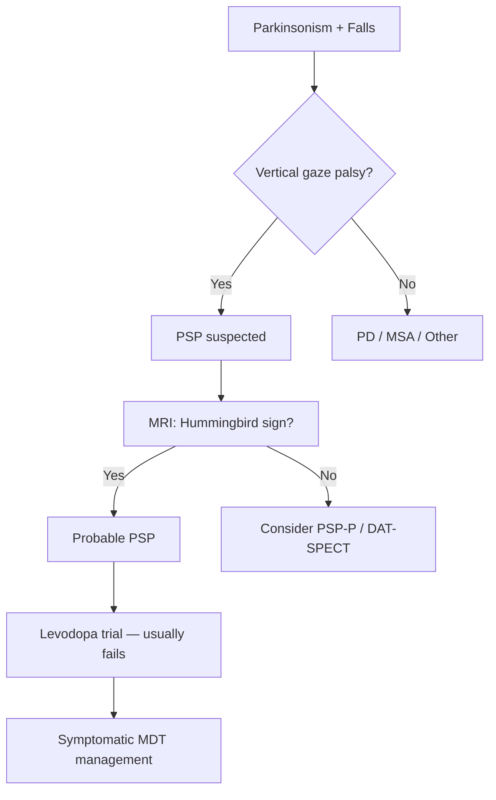

# Progressive Supranuclear Palsy (PSP)

Related: [[Movement Disorders Hub]], [[Parkinsonism Hub]], [[Parkinsons Disease]], [[Multiple System Atrophy]], [[Corticobasal Degeneration]], [[Dementia with Lewy Bodies]]

> [!tip] **PSP = early falls + vertical gaze palsy + axial rigidity + pseudobulbar palsy.** The "Hummingbird sign" on MRI and levodopa-unresponsiveness help distinguish PSP from PD.

## Learning Objectives
- [ ] Define PSP, classify variants (Richardson, PSP-P, PSP-CBS, PSP-F, PSP-SL)
- [ ] Recognise the clinical phenotype: early postural instability, vertical gaze palsy, axial rigidity
- [ ] Differentiate PSP from PD, MSA, CBD, DLB
- [ ] Order MRI brain (hummingbird, morning glory), DAT-SPECT
- [ ] Manage symptomatically: balance, falls, dysphagia, cognition, mood; refer to MDT

---

## 1. Definition / Epidemiology / Classification

**Definition:** PSP is a sporadic, progressive, adult-onset neurodegenerative tauopathy (4R-tau) presenting with postural instability, supranuclear vertical gaze palsy, axial rigidity, bradykinesia, pseudobulbar palsy, and frontal cognitive dysfunction.

**Epidemiology:**
- Prevalence: 5-7/100,000 (increases with age; 18/100,000 in >85)
- Onset: 6th-7th decade (mean 65); rare <45
- Male:Female ~1.6:1
- Median survival: 6-9 years from symptom onset
- Risk factors: age, no robust genetic/environmental factors

**Classification (MDS-PSP 2017):**
| Variant | Key Features |
|---------|--------------|
| **PSP-Richardson (PSP-RS)** | Classic: early falls, vertical gaze palsy, axial rigidity, pseudobulbar |
| **PSP-P (parkinsonism)** | Asymmetric onset, tremor, levodopa-responsive initially, mimics PD |
| **PSP-CBS** | Corticobasal syndrome features (alien limb, apraxia, cortical sensory loss) |
| **PSP-F (frontal/cognitive)** | Behavioural variant FTD, executive dysfunction, personality change |
| **PSP-SL (speech/language)** | Progressive apraxia of speech, non-fluent agrammatic aphasia |
| **PSP-PAGF** | Pure akinesia with gait freezing |
| **PSP-C** | Predominant cerebellar ataxia |

---

## 2. Aetiology / Pathophysiology

**Aetiology:** Mostly sporadic. Risk genes: **MAPT (H1/H1 haplotype)**, **STX6**, **EIF2AK3**, **MOBP**, **H1c** subhaplotype. **GBA** mutations (also PD/DLB). **TBK1**, **TARDBP** rare.

**Pathology:** 4R-tau neuronal and glial inclusions (neurofibrillary tangles, tufted astrocytes, coiled bodies, threads). Predominant sites: **subthalamic nucleus, globus pallidus, substantia nigra, midbrain tectum, periaqueductal grey, dentate nucleus, frontal cortex**.

**Pathophysiology:** → disruption of basal ganglia circuitry, vertical gaze centres (rostral interstitial MLF), brainstem locomotor centres → axial rigidity, gaze palsy, falls.

**Mechanism:** Loss of nigrostriatal dopamine + widespread 4R-tau → multisystem neurodegeneration.

---

## 3. Clinical Features

**History:**
- **Early falls (often backwards, within 1 year)** — most specific feature
- **Vertical gaze palsy** — first downgaze, then upgaze
- **Axial rigidity > limb rigidity**
- **Bradykinesia**, often symmetric
- **Dysarthria** (spastic, hypokinetic, monotonous)
- **Dysphagia** (early, can be severe)
- **Pseudobulbar palsy** — emotional lability, brisk jaw jerk, spastic dysarthria
- **Frontal cognitive impairment** — frontal executive dysfunction, slow cognition, apathy, disinhibition
- **Sleep disturbance** — REM sleep behaviour disorder less common than MSA/DLB
- **Levodopa-unresponsive** (transient response in 20-30%)

**Examination:**
| Domain | Finding |
|--------|---------|
| **Gaze** | **Supranuclear vertical gaze palsy** (esp. downgaze) — doll's head manoeuvre preserves (supranuclear), but Bell's phenomenon lost in PSP. Square-wave jerks, slow saccades, apraxia of lid opening, blepharospasm |
| **Motor** | **Axial rigidity > appendicular**; bradykinesia symmetric; no rest tremor (usually); neck dystonia (retrocollis) |
| **Posture/Gait** | **Early postural instability**, wide-based, stiff, en bloc turning, frequent **backward falls**, "slipping clutch" gait, festination absent |
| **Cranial nerves** | **Pseudobulbar palsy** — spastic dysarthria, brisk jaw jerk, emotional lability, dysphagia |
| **Reflexes** | Brisk, frontal release (palmomental, glabellar, snout) |
| **Cognition** | Frontal executive dysfunction, slow processing, apathy, abulia |

**Differentiating features from PD:**
- **Symmetric onset, axial rigidity, early falls, vertical gaze palsy, levodopa unresponsiveness, pseudobulbar palsy.**

---

## 4. Diagnostic Approach

**MDS-PSP Diagnostic Criteria (2017) — Core clinical features:**
- **O1:** Vertical gaze palsy (down > up)
- **O2:** Slow vertical saccades
- **O3:** Repeated unprovoked falls within 3 years
- **O4:** Postural instability with pull test within 3 years
- **A1:** Levodopa-resistant parkinsonism
- **A2:** Frontal cognitive/behavioural presentation
- **A3:** CBS variant
- **A4:** Speech/language variant
- **A5:** Pure akinesia with gait freezing
- **C1:** DAT-SPECT abnormal
- **I:** Whipple ant. com miss. off: Red flags
- **D1:** Abnormal DAT-SPECT; **D2:** Midbrain atrophy (hummingbird/Mickey Mouse)

**Definite PSP:** Postmortem tau pathology.
**Probable PSP:** (O1 or O2) + (O3 or O4) = Richardson syndrome.
**Possible PSP:** (O1 or O2) + (A1 or A2) ± supportive features.

---

## 5. Investigations

| Test | Indication | Finding |
|------|-----------|---------|
| **MRI Brain** | All | **Hummingbird/Penguin sign** (midbrain tegmentum atrophy), **Mickey Mouse sign** (midbrain atrophy with preserved pons), **Morning glory sign** (concavity of lateral midbrain tegmentum) |
| **DAT-SPECT (FP-CIT, DaTSCAN)** | Distinguish PD (↓ uptake) from ET/functional | Reduced striatal uptake (cannot distinguish PSP from PD/MSA) |
| **MIBG myocardial scintigraphy** | Distinguish PD (↓) from PSP (normal) | Normal in PSP (preserved cardiac sympathetic) |
| **FDG-PET** | Atypical | Frontal hypometabolism, midbrain |
| **CSF** | Exclude other | 14-3-3 (CJD), NfL (non-specific ↑) |
| **Tau PET** | Research | Tau ligand uptake |
| **Trial of levodopa** | All | Usually no/minimal response (A1 criterion) |

**Imaging signs (Hamming et al. 2014):**
- **MR Parkinsonism Index (MRPI):** (P/M ratio) × (MCP width / SCP width) — >13.55 distinguishes PSP from PD
- **Hummingbird sign:** Sagittal midbrain atrophy
- **Morning glory sign:** Axial — lateral midbrain concavity
- **Hot-cross bun:** MSA-C (not PSP)

---

## 6. Differential Diagnosis

| Differential | Distinguishing | Key Test |
|--------------|----------------|----------|
| **Parkinson disease** | Asymmetric, rest tremor, levodopa-responsive, late falls | DAT-SPECT, MIBG, levodopa trial |
| **MSA-P** | Autonomic failure, cerebellar signs, RBD | MRI (putaminal rim, hot-cross bun), autonomic testing |
| **Corticobasal degeneration** | Asymmetric, alien limb, apraxia, cortical sensory loss, myoclonus | MRI (asymmetric atrophy), FDG-PET |
| **DLB** | Visual hallucinations, cognitive fluctuations, RBD | DAT-SPECT, MIBG |
| **Vascular parkinsonism** | Lower body, stepwise, vascular risk factors | MRI (white matter lesions) |
| **Drug-induced** | Antipsychotics, antiemetics | Drug history |
| **NPH** | Triad gait/dementia/incontinence | MRI (ventriculomegaly, DESH) |
| **CBD/PSP-CBS overlap** | CBS features | MRI, PET |
| **Progressive supranuclear palsy mimics** | Whipple, syphilis, CJD, Niemann-Pick C | Specific tests |

---

## 7. Management

**No disease-modifying therapy.** Symptomatic, supportive, MDT.

**Levodopa trial:** Up to 1000 mg/day for 3 months — usually no/minimal response. 20-30% may have transient benefit.

**Symptomatic:**
| Symptom | First-line | Second-line |
|---------|-----------|-------------|
| Parkinsonism/rigidity | Levodopa (often fail) | Amantadine (limited evidence) |
| Gait instability/falls | Physio, walking aids, home adapt, hip protectors | No pharmacological proven benefit |
| Dystonia (blepharospasm, retrocollis) | Botulinum toxin (especially blepharospasm) | Benzodiazepines |
| Pseudobulbar affect | **Dextromethorphan/quinidine 20/10 mg BD** (DM/Q) | SSRI |
| Depression | SSRI (sertraline, citalopram) | SNRI, mirtazapine |
| Cognitive/behavioural | Rivastigmine (modest), donepezil (less evidence) | Atypical antipsychotic if severe (quetiapine low dose; clozapine) |
| Dysphagia | SALT assessment, diet modification, chin-tuck | NGT/PEG (advanced) |
| Sialorrhoea | Hyoscine patch, glycopyrronium, atropine drops sublingual | Botulinum (submandibular) |
| Sleep/insomnia | Melatonin, sleep hygiene | Mirtazapine, clonazepam |
| RBD | Clonazepam, melatonin | Pramipexole |
| Bladder | Anticholinergics (oxybutynin, trospium) | Mirabegron |
| Constipation | Laxatives, fibre, fluids | Prokinetics |

**Non-pharmacological:**
- **Physiotherapy** — balance, falls prevention, gait training
- **OT** — home assessment, ADL, equipment
- **SALT** — speech, swallowing, communication aids
- **Neuropsychology** — cognitive, behavioural, capacity
- **Social** — disability, care package, power of attorney
- **Palliative care** — advance care planning, end-of-life, feeding decisions
- **Support groups** — PSP Association

**Surgical:** None. DBS ineffective in PSP.

**Investigational:** Anti-tau therapies (tilavonemab, gosuranemab, BIIB080), davunetide, nicotinamide, coenzyme Q10 — none proven.

---

## 8. Drug Cautions
- **Antipsychotics:** Worsen parkinsonism; avoid typical; quetiapine/clozapine preferred (clozapine requires FBC monitoring)
- **Anticholinergics:** Confusion, hallucinations, urinary retention — avoid in elderly
- **Benzodiazepines:** Falls risk, confusion — use low dose
- **Metoclopramide, prochlorperazine, haloperidol:** Worsen parkinsonism
- **Levodopa:** Trial up to 1000 mg/d for 3 months; if no benefit, do not escalate
- **SSRIs:** SIADH, hyponatraemia (especially in elderly)
- **Dextromethorphan/quinidine:** QT prolongation, serotonin syndrome with MAOIs

---

## 9. Procedures
- **DaTSCAN (FP-CIT SPECT):** Differentiates PD (↓) from ET/functional (normal); cannot distinguish PSP from PD
- **MIBG:** Normal in PSP, reduced in PD (cardiac sympathetic denervation)
- **MRI 3T volumetric:** Better detection of midbrain atrophy; MR Parkinsonism Index
- **PEG/RIG tube:** Advanced dysphagia (after MDT/family discussion)
- **Botulinum toxin:** Blepharospasm, cervical dystonia, sialorrhoea

---

## 10. Complications
| Complication | Frequency | Management |
|--------------|-----------|-----------|
| **Falls/fractures** | Very common (90% within 3 yr) | Physio, walking aids, hip protectors, home assessment |
| **Aspiration pneumonia** | Common (cause of death) | SALT, NGT/PEG |
| **SCD/sudden death** | Increased | Cardiac monitoring, autonomic support |
| **DVT/PE** | Immobile | LMWH prophylaxis if immobile |
| **Pressure sores** | Bed-bound | 2-hourly turns, air mattress |
| **UTI** | Common | Hygiene, fluids, catheters |
| **Cognitive decline** | Universal | Rivastigmine, support |
| **Behavioural changes** | Common | Atypical antipsychotic (low dose) |
| **Fractures** (hip, wrist) | Common (falls) | DEXA, vitamin D, bisphosphonates |

---

## 11. Red Flags
- **Onset <45 years** — atypical; consider other tauopathy, Wilson, Huntington
- **Prominent autonomic failure** — think MSA, not PSP
- **Visual hallucinations + cognitive fluctuations** — DLB
- **Asymmetric alien limb / cortical sensory loss** — CBD
- **Lower-body parkinsonism + vascular risk** — vascular parkinsonism
- **Vertical gaze palsy is the cardinal sign** — its absence should make diagnosis doubtful
- **Rapid progression (<3 yr to falls)** — atypical PSP mimic (CJD, Whipple)

---

## 12. Prognosis
- **Median survival 6-9 years** from symptom onset (PSP-RS)
- **Causes of death:** Aspiration pneumonia (50%), falls, sepsis, PE, SCD
- **Worse prognosis:** Richardson variant, early falls, early dysphagia, early cognitive decline
- **Better prognosis:** PSP-P (levodopa-responsive) — slower progression (10-15 yr)

---

## 13. Topic Correlation
- [[Movement Disorders Hub]] — Parkinson-plus syndromes
- [[Parkinsonism Hub]] — Differential of parkinsonism
- [[Parkinsons Disease]] — Tremor-dominant, asymmetric, levodopa-responsive
- [[Multiple System Atrophy]] — MSA-P (autonomic + parkinsonism)
- [[Corticobasal Degeneration]] — CBD/PSP-CBS overlap
- [[Dementia with Lewy Bodies]] — Visual hallucinations, fluctuations
- [[Vascular Parkinsonism]] — Lower body, vascular lesions on MRI

---

## 14. Special Situations
- **Pregnancy:** Rare; symptomatic management; no teratogenic concerns (no disease-modifying drugs)
- **Lactation:** Levodopa minimal secretion; SSRI use cautiously
- **Elderly:** Most common; falls risk high; avoid anticholinergics, antipsychotics
- **Renal/hepatic:** Dose adjust anticholinergics, amantadine (renal)
- **Immunocompromised:** No specific change
- **Perioperative:** Anaesthesia risk due to pseudobulbar, dysphagia, autonomic; continue levodopa perioperatively
- **Driving (DVLA):** Must notify; revoke if unsafe; typically cease driving within 2-3 yr
- **Occupational:** Workplace assessment, disability

---

## FCPS/MRCP High-Yield Summary
| Category | Key Points |
|----------|------------|
| **Definition** | Sporadic 4R-tauopathy, adult-onset, vertical gaze palsy + axial rigidity + early falls |
| **Aetiology** | Mostly sporadic; MAPT H1/H1, STX6, EIF2AK3, GBA |
| **Pathology** | 4R-tau inclusions, tufted astrocytes, globus pallidus, STN, SN, midbrain |
| **Variants** | Richardson (classic), PSP-P, PSP-CBS, PSP-F, PSP-SL, PSP-PAGF |
| **Clinical** | **Early backward falls, vertical gaze palsy (down>up), axial rigidity, pseudobulbar, frontal cognitive** |
| **Diagnosis** | MDS-PSP 2017 criteria; MRI (hummingbird, MRPI), DAT-SPECT, levodopa trial |
| **Investigations** | MRI (midbrain atrophy, hummingbird), DaTSCAN, MIBG, levodopa trial |
| **Management** | No disease-modifying; symptomatic: levodopa trial, amantadine, BT, SALT, falls prevention |
| **Doses** | Levodopa up to 1000 mg/d; Dextromethorphan/quinidine 20/10 mg BD; Amantadine 100 mg BD |
| **Imaging signs** | Hummingbird, Morning glory, Mickey Mouse, MRPI >13.55 |
| **Viva Pearls** | "Hummingbird = PSP"; "Early backward falls = PSP"; "Downgaze first"; "Levodopa usually fails" |

---

## Viva Questions
1. **PSP core clinical features?** → Early falls, vertical gaze palsy, axial rigidity, bradykinesia, pseudobulbar, frontal cognitive.
2. **Differentiate PSP from PD?** → PSP: symmetric, axial, early falls, vertical gaze palsy, levodopa-unresponsive. PD: asymmetric, rest tremor, levodopa-responsive, late falls.
3. **Hummingbird sign?** → Midbrain tegmentum atrophy on sagittal T1/FLAIR; distinguishes PSP from PD.
4. **PSP variants?** → Richardson (classic), PSP-P (parkinsonism), PSP-CBS, PSP-F (frontal), PSP-SL (speech), PSP-PAGF (freezing).
5. **Why levodopa in PSP?** → Trial up to 1000 mg/d for 3 months to exclude PD; rarely helpful in PSP.
6. **Median survival PSP?** → 6-9 years (shorter than PD).
7. **Most common cause of death in PSP?** → Aspiration pneumonia.
8. **MRPI?** → MR Parkinsonism Index = (pons/midbrain) × (MCP/SCP) width; >13.55 = PSP.
9. **MIBG in PSP vs PD?** → Normal in PSP (preserved cardiac sympathetic); reduced in PD.
10. **Frontal release signs in PSP?** → Palmomental, snout, glabellar, jaw jerk (pseudobulbar).

---

## Common Confusions
| Confusion | Clarification |
|-----------|---------------|
| PSP = PD | PSP: vertical gaze palsy, early falls, axial, levodopa-unresponsive. PD: asymmetric, tremor, levodopa-responsive |
| PSP responds to levodopa | Mostly NO; trial up to 1000 mg/d for 3 months |
| Hot-cross bun = PSP | Hot-cross bun = MSA-C; PSP = hummingbird, morning glory |
| PSP has RBD | Less common than MSA/DLB |
| PSP with rest tremor | PSP-P variant can mimic PD; rest tremor uncommon in classic PSP |
| Vertical gaze palsy in PSP affects upgaze | Downgaze affected FIRST and earliest |

---

## Mnemonics
1. **PRISM** — **P**ostural instability, **R**igidity (axial), **I**diopathic, **S**upranuclear gaze palsy, **M**idbrain atrophy
2. **MIDBRAIN ATROPHY** — Mickey Mouse, Inverted Hummingbird, Decreased AP diameter, "BRAIN Atrophy in Tegmentum, Round" — Y (year) — sagittal midbrain
3. **PSP PATHOLOGY** — **P**allidum, **S**ubthalamic, **P**eriaqueductal, **T**ectum, **H**ippocampus, **L**ocus coeruleus, **Y**-shape
4. **TAU** — **T**angles (tufted astrocytes), **A**lzheimer 4R/3R (PSP = 4R), **U**biquitin
5. **RICHARDSON** — **R**igidity (axial), **I**diopathic, **C**ognitive decline, **H**ummingbird, **A**taxia, **R**etrocollis, **D**ysphagia, **S**upranuclear gaze palsy, **O**nset 6th decade, **N**o tremor

---

## Summary
PSP is a sporadic 4R-tauopathy with median survival 6-9 years, presenting with **early backward falls, vertical gaze palsy, axial rigidity, pseudobulbar palsy, and frontal cognitive decline**. PSP-Richardson is the classic form; PSP-P mimics PD. **MRI shows midbrain atrophy (hummingbird, morning glory signs), MRPI >13.55.** DAT-SPECT is reduced (cannot distinguish from PD); MIBG is normal. **No disease-modifying therapy**; levodopa trial usually fails. Management is symptomatic and supportive: physiotherapy, SALT, falls prevention, botulinum toxin for dystonia/blepharospasm, dextromethorphan/quinidine for pseudobulbar affect, and palliative care. Aspiration pneumonia is the most common cause of death.

---

## MCQs (10)

1. **Which is the earliest and most characteristic eye movement abnormality in PSP?**
   A. Upgaze palsy B. Downgaze palsy C. Lateral gaze palsy D. Internuclear ophthalmoplegia
   **Answer: B** — Downgaze palsy is the earliest and most characteristic.

2. **The "Hummingbird sign" on MRI is associated with:**
   A. PD B. MSA-C C. PSP D. DLB
   **Answer: C** — Midbrain tegmentum atrophy = PSP.

3. **Median survival from symptom onset in PSP-Richardson:**
   A. 2-3 yr B. 6-9 yr C. 10-15 yr D. >20 yr
   **Answer: B** — 6-9 years.

4. **First-line pharmacological trial in PSP:**
   A. Levodopa B. Bromocriptine C. Amantadine D. Trihexyphenidyl
   **Answer: A** — Levodopa trial up to 1000 mg/d × 3 months; usually fails.

5. **Most common cause of death in PSP:**
   A. PE B. MI C. Aspiration pneumonia D. Stroke
   **Answer: C** — Aspiration pneumonia.

6. **"Morning glory sign" refers to:**
   A. Lateral midbrain concavity on axial MRI B. Hummingbird on sagittal C. Hot-cross bun D. Cerebellar atrophy
   **Answer: A** — Axial MRI: concavity of lateral midbrain tegmentum.

7. **Which variant of PSP mimics PD?**
   A. PSP-CBS B. PSP-F C. PSP-P D. PSP-SL
   **Answer: C** — PSP-P (parkinsonism), asymmetric onset, tremor, transient levodopa response.

8. **MR Parkinsonism Index (MRPI) >13.55 distinguishes:**
   A. PSP from PD B. MSA from PD C. CBD from PSP D. DLB from AD
   **Answer: A** — MRPI >13.55 = PSP.

9. **Dextromethorphan/quinidine is used in PSP for:**
   A. Falls B. Pseudobulbar affect C. Dystonia D. Cognitive decline
   **Answer: B** — Pseudobulbar affect.

10. **MIBG myocardial scintigraphy in PSP vs PD:**
    A. Reduced in both B. Normal in PSP, reduced in PD C. Reduced in PSP, normal in PD D. Normal in both
    **Answer: B** — Preserved cardiac sympathetic in PSP, denervation in PD.

---

## SBAs (10)

1. **68-year-old with backward falls 6 months after onset of gait disturbance, axial rigidity, vertical gaze palsy. MRI shows midbrain atrophy. Best diagnosis?**
   A. PD B. MSA-P C. PSP-Richardson D. Vascular parkinsonism
   **Answer: C** — Classic Richardson: early falls (<1 yr), vertical gaze palsy, axial rigidity, midbrain atrophy (hummingbird).

2. **MDS-2017 criteria for probable PSP-Richardson require:**
   A. O1/O2 + A1 B. O1/O2 + O3/O4 C. A2 only D. O1 + DAT-SPECT
   **Answer: B** — Probable PSP-RS: (O1 downgaze palsy or O2 slow vertical saccades) + (O3 falls or O4 postural instability within 3 yr).

3. **72-year-old with parkinsonism, early falls, severe dysphagia, frontal cognitive decline, levodopa-unresponsive. Life expectancy?**
   A. 2-3 yr B. 6-9 yr C. 12-15 yr D. >20 yr
   **Answer: B** — Classic PSP: median survival 6-9 years; aspiration pneumonia = commonest cause of death.

4. **A patient with PSP has emotional lability, spastic dysarthria, brisk jaw jerk. Best treatment?**
   A. SSRI B. Dextromethorphan/quinidine C. Levodopa D. Botulinum toxin
   **Answer: B** — Dextromethorphan/quinidine (DM/Q) is licensed for pseudobulbar affect.

5. **65-year-old with PSP develops blepharospasm and apraxia of lid opening. Best treatment?**
   A. Levodopa B. Botulinum toxin C. Amantadine D. Anticholinergics
   **Answer: B** — Botulinum toxin for blepharospasm and apraxia of lid opening.

6. **Which is REDUCED in PSP on DAT-SPECT but normal on MIBG scintigraphy?**
   A. Both normal B. DAT-SPECT reduced, MIBG normal C. Both reduced D. DAT-SPECT normal, MIBG reduced
   **Answer: B** — DAT-SPECT reduced (nigrostriatal denervation), MIBG normal (preserved cardiac sympathetic).

7. **Hot-cross bun sign in MSA-C is due to:**
   A. Midbrain atrophy B. Loss of transverse pontocerebellar fibres C. Pontine haemorrhage D. Tumour
   **Answer: B** — Cruciform T2 hyperintensity; PSP does NOT show hot-cross bun.

8. **PSP-CBS variant overlaps with which disease?**
   A. PD B. MSA C. CBD D. DLB
   **Answer: C** — Corticobasal syndrome (PSP-CBS) shares features with corticobasal degeneration.

9. **65-year-old with PSP. Which intervention reduces falls risk?**
   A. Levodopa B. Physiotherapy + walking aids + home assessment C. Anticholinergics D. Haloperidol
   **Answer: B** — No drug reduces falls; physiotherapy, walking aids, home assessment, hip protectors.

10. **PSP responds to levodopa?**
    A. Often B. Rarely/transient C. Always D. Never in any case
    **Answer: B** — 20-30% may have transient response; majority are levodopa-unresponsive.

---

## Flashcards

- **Q:** PSP core triad?
  **A:** Vertical gaze palsy + axial rigidity + early falls
- **Q:** Earliest gaze abnormality in PSP?
  **A:** Downgaze palsy
- **Q:** Hummingbird sign?
  **A:** Midbrain tegmentum atrophy (sagittal MRI) — PSP
- **Q:** MRPI cutoff for PSP?
  **A:** >13.55 (PSP from PD)
- **Q:** Median survival PSP?
  **A:** 6-9 years
- **Q:** Most common cause of death in PSP?
  **A:** Aspiration pneumonia
- **Q:** Pathology?
  **A:** 4R-tau inclusions (tufted astrocytes)
- **Q:** Risk gene?
  **A:** MAPT H1/H1 haplotype
- **Q:** Variant mimicking PD?
  **A:** PSP-P
- **Q:** Dextromethorphan/quinidine indication?
  **A:** Pseudobulbar affect

---

## Answer Key

### MCQs
1. **B** — Downgaze 2. **C** — PSP 3. **B** — 6-9 yr 4. **A** — Levodopa trial 5. **C** — Aspiration 6. **A** — Morning glory (axial) 7. **C** — PSP-P 8. **A** — PSP from PD 9. **B** — Pseudobulbar 10. **B** — DAT-SPECT ↓, MIBG normal

### SBAs
1. **C** — PSP-Richardson 2. **B** — O1/O2 + O3/O4 3. **B** — 6-9 yr 4. **B** — DM/Q 5. **B** — Botulinum 6. **B** — DAT-SPECT ↓, MIBG normal 7. **B** — Transverse pontocerebellar fibres 8. **C** — CBD 9. **B** — Physio + aids 10. **B** — Rarely/transient

---

## Local Navigation
**Topic-Group Hub:** [[05_Movement_Disorders/Parkinsonism Hub]]
**Chapter MOC:** [[Neurology MOC]]
**Related:** [[Parkinsons Disease]], [[Multiple System Atrophy]], [[Corticobasal Degeneration]], [[Dementia with Lewy Bodies]], [[Vascular Parkinsonism]]

## PasTest Scenario SBAs (Clinical Vignettes)

> **Auto-generated PasTest/Mediscope-style scenario SBAs** grounded in the authored source. Each scenario tests a real clinical fact (triad, specific sign, contraindication, trial, first-line Rx) extracted from the topic. *Source: Ch 27: Neurology & Stroke — Progressive Supranuclear Palsy*

**Q1.** Which of the following features is most specific or characteristic of Progressive Supranuclear Palsy?

  - **A.** Early falls
  - **B.** A feature common to many acute inflammatory conditions
  - **C.** A non-specific sign that does not localise the diagnosis
  - **D.** An investigation finding rather than a clinical feature

  > **Answer: A** — Early falls
  >
  > *Source:* *History:**
- **Early falls (often backwards, within 1 year)** — most specific feature
- **Vertical gaze palsy** — first downgaze, then upgaze
- **Axial rigidity > limb rigidity**
- **Bradykinesia**, 

**Q2.** What is the most appropriate first-line therapy for Progressive Supranuclear Palsy?

  - **A.** Levodopa trial:
  - **B.** An advanced/surgical therapy reserved for refractory disease
  - **C.** Symptomatic treatment only, no disease-modifying therapy
  - **D.** Empiric broad-spectrum therapy without specific indication

  > **Answer: A** — Levodopa trial:
  >
  > *Source:* **Levodopa trial:** Up to 1000 mg/day for 3 months — usually no/minimal response. 20-30% may have transient benefit.

