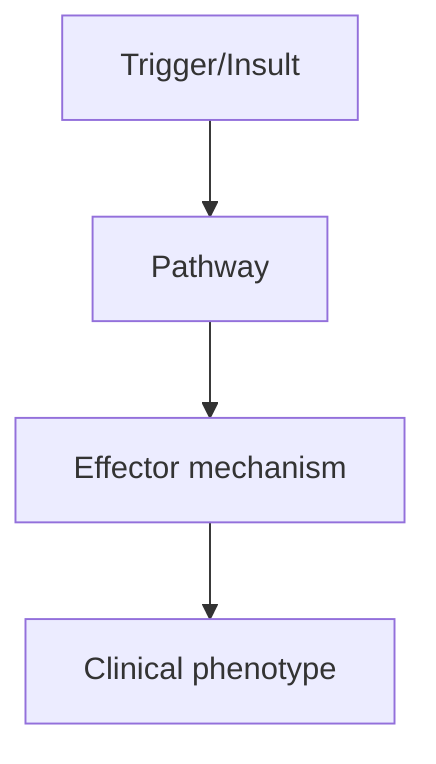
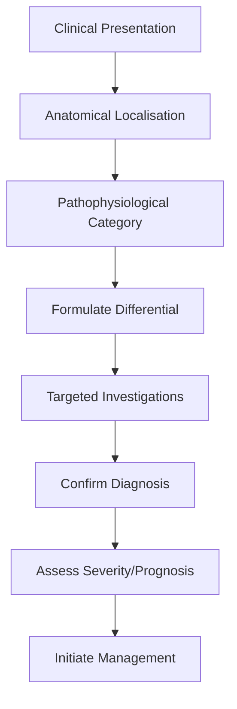
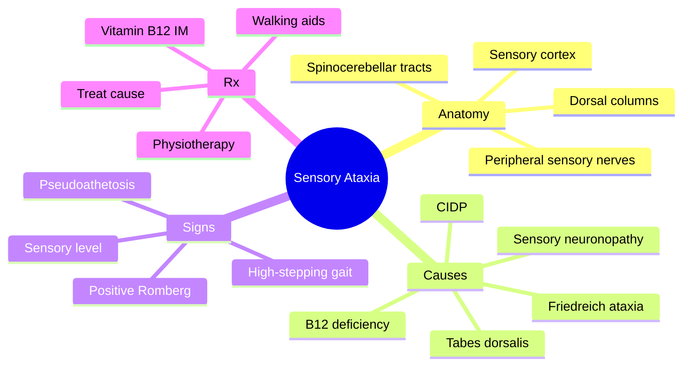

# Sensory Ataxia

> [!tip] **High-Yield Definition**
> Sensory ataxia: ataxia due to loss of proprioception (dorsal columns, peripheral sensory nerves, sensory roots). Distinguished from cerebellar ataxia by: worse with eyes closed (Romberg sign), no dysmetria, no nystagmus, normal coordination with eyes open.

---

## 1. Definition / Epidemiology / Classification

### Definition
Sensory ataxia: ataxia due to loss of proprioception (dorsal columns, peripheral sensory nerves, sensory roots). Distinguished from cerebellar ataxia by: worse with eyes closed (Romberg sign), no dysmetria, no nystagmus, normal coordination with eyes open.

### Epidemiology
Common in: B12 deficiency, copper deficiency, tabes dorsalis (tertiary syphilis), CIDP, sensory neuropathy, paraneoplastic sensory neuronopathy, Friedreich's ataxia, MS (dorsal column lesions).

### Classification
| Variant | Key Features | Prognosis |
|---------|-------------|-----------|
| | | |

---

## 2. Aetiology / Pathophysiology

### Aetiology
Dorsal column disease: B12 deficiency (most common), copper deficiency, nitrous oxide abuse, tabes dorsalis (syphilis), MS, Friedreich's ataxia, paraneoplastic sensory neuronopathy (anti-Hu), compressive, HTLV-1. Peripheral sensory: diabetic neuropathy, CIDP, GBS, B6 toxicity, paraneoplastic, Sjogren's, paraneoplastic. Mixed: vitamin deficiencies, toxic (chemotherapy).

### Pathophysiology

---

## 3. Clinical Features

### History
- **Onset/Duration:**
- **Progression:**
- **Key symptoms:**
- **Triggers:**
- **Systemic symptoms:**
- **Drug/Family/Social history:**

### Examination
| Domain | Key Findings | Localisation Value |
|--------|-------------|-------------------|
| | | |

### Specific Clinical Features
Unsteady gait, worse in dark, on uneven ground, eyes closed (Romberg positive). High-stepping gait. Falls. No nystagmus, no dysarthria, no intention tremor. Sensory loss: vibration, joint position sense (dorsal columns). Pseudoathetosis (involuntary writhing of fingers/feet when eyes closed). Sensory ataxia + sensory level = spinal cord (B12, MS, copper). Sensory ataxia + arreflexia + small fibre involvement = peripheral neuropathy (Sjogren's, paraneoplastic). Sensory ataxia + optic atrophy + spasticity = B12.

---

## 4. Diagnostic Approach / Algorithm

---

## 5. Investigations

MRI spine (cord lesion, MS, B12 changes - inverted 'V' sign, copper changes). MRI brain (cerebellar atrophy, demyelination). B12, folate, MMA, homocysteine. Copper, caeruloplasmin. Treponemal serology (syphilis). HTLV-1 antibodies. Paraneoplastic antibodies (anti-Hu, anti-CRMP5). Anti-AQP4, anti-MOG. Nerve conduction studies (sensory neuropathy). CSF: OCBs (MS), VDRL (syphilis), HTLV-1.

---

## 6. Differential Diagnosis

| Differential | Distinguishing Features | Key Test |
|--------------|------------------------|----------|
| | | |

---

## 7. Management

Treat underlying cause: B12 replacement (IM hydroxocobalamin 1mg alternate days × 2 weeks, then 1mg q3months), copper replacement, antibiotics for syphilis, plasma exchange for paraneoplastic, DMT for MS, NMOSD. Rehabilitation: physiotherapy, gait training, balance exercises, walking aids (cane, walker), home safety, fall prevention. Visual compensation strategies. Avoid: B6 megadoses (sensory neuropathy).

---

## 8. Drug Interactions / Contraindications / Comorbidity Cautions

| Drug | Interaction / Caution | Management |
|------|----------------------|------------|
| | | |

---

## 9. Procedures (if applicable)

### Procedure:
- **Indications:**
- **Contraindications:**
- **Preparation / Principle:**
- **Complications:**
- **Viva Pearls:**

---

## 10. Complications

| Complication | Frequency | Prevention / Monitoring | Management |
|--------------|-----------|------------------------|------------|
| | | | |

---

## 11. Red Flags / Emergencies

B12 deficiency (irreversible neurological damage if delayed), copper deficiency (often misdiagnosed as B12), paraneoplastic (underlying malignancy), MS, NMO, MOG (demyelinating, treatable).

---

## 12. Prognosis

Depends on cause. B12: improve with treatment (may be incomplete if prolonged). Copper: improve. Paraneoplastic: poor. MS/NMOSD: depends on DMT. Tabes dorsalis: antibiotic stops progression, but may not reverse deficits.

---

## 13. Topic Correlation

| Related Topic | Link | Key Overlap |
|---------------|------|-------------|
| | | |

---

## 14. Special Situations

| Situation | Consideration |
|-----------|---------------|
| **Pregnancy** | |
| **Lactation** | |
| **Paediatric** | |
| **Elderly / Frail** | |
| **Renal impairment** | |
| **Hepatic impairment** | |
| **Immunocompromised** | |
| **Perioperative** | |
| **Driving / DVLA** | |
| **Occupational** | |

---

## FCPS/MRCP High-Yield Summary

| Category | Key Points |
|----------|------------|
| **Definition** | Sensory ataxia: ataxia due to loss of proprioception (dorsal columns, peripheral sensory nerves, sensory roots). Distinguished from cerebellar ataxia by: worse with eyes closed (Romberg sign), no dysm |
| **Epidemiology** | Common in: B12 deficiency, copper deficiency, tabes dorsalis (tertiary syphilis), CIDP, sensory neuropathy, paraneoplastic sensory neuronopathy, Fried |
| **Pathophysiology** | |
| **Clinical** | Unsteady gait, worse in dark, on uneven ground, eyes closed (Romberg positive). High-stepping gait. Falls. No nystagmus, no dysarthria, no intention tremor. Sensory loss: vibration, joint position sen |
| **Diagnosis** | |
| **Investigations** | MRI spine (cord lesion, MS, B12 changes - inverted 'V' sign, copper changes). MRI brain (cerebellar atrophy, demyelination). B12, folate, MMA, homocysteine. Copper, caeruloplasmin. Treponemal serology |
| **Management** | Treat underlying cause: B12 replacement (IM hydroxocobalamin 1mg alternate days × 2 weeks, then 1mg q3months), copper replacement, antibiotics for syphilis, plasma exchange for paraneoplastic, DMT for |
| **Complications** | |
| **Prognosis** | Depends on cause. B12: improve with treatment (may be incomplete if prolonged). Copper: improve. Paraneoplastic: poor. MS/NMOSD: depends on DMT. Tabes dorsalis: antibiotic stops progression, but may n |
| **Viva Pearls** | |
| **Drug Doses** | |
| **Scoring Systems** | |
| **Genetics** | |
| **Imaging Signs** | |

---

## Viva Questions (PACES/FCPS Style)

1. **Q:** Define Sensory Ataxia and classify its variants.
   **A:** Based on the definition above.

2. **Q:** What are the key clinical features?
   **A:** Unsteady gait, worse in dark, on uneven ground, eyes closed (Romberg positive). High-stepping gait. Falls. No nystagmus, no dysarthria, no intention tremor. Sensory loss: vibration, joint position sense (dorsal columns). Pseudoathetosis (involuntary writhing of fingers/feet when eyes closed). Sensor

3. **Q:** What is the first-line treatment?
   **A:** Based on the management section.

4. **Q:** What are the red flags requiring urgent referral?
   **A:** B12 deficiency (irreversible neurological damage if delayed), copper deficiency (often misdiagnosed as B12), paraneoplastic (underlying malignancy), MS, NMO, MOG (demyelinating, treatable).

5. **Q:** What is the prognosis?
   **A:** Depends on cause. B12: improve with treatment (may be incomplete if prolonged). Copper: improve. Paraneoplastic: poor. MS/NMOSD: depends on DMT. Tabes dorsalis: antibiotic stops progression, but may not reverse deficits.

6. **Q:** How do you differentiate Sensory Ataxia from key differentials?
   **A:** Clinical features, investigations, and response to treatment.

7. **Q:** What investigations are most useful?
   **A:** Based on the investigations section.

8. **Q:** Describe the stepwise management approach.
   **A:** Based on the management algorithm.

9. **Q:** What are the emergency presentations?
   **A:** Based on the red flags section.

10. **Q:** How does management change in pregnancy/paediatrics/elderly?
    **A:** Special considerations per population.

---

## Common Confusions / Exam Traps

| Confusion | Clarification |
|-----------|---------------|
| | |

---

## Mnemonics

- **DORSAL** — **D**orsal **O**r **R**ubrospinal **S**pinal **A**trophy (dorsal column) + **L**oss of proprioception/vibration (**DORSAL**) - use: lesion site
- **LAMB** — **L**oss of proprioception → **A**taxic gait (high-stepping, positive Romberg) → **M**edial lemniscus / **B**12 / tabes dorsalis (**LAMB**) - use: features
- **VIBES** — **V**ibration lost + **I**ncoordination with eyes closed + **B**12 / **E**GFR (uraemia) / **S**pinal cord (**VIBES**) - use: causes

---

## Mind Map

---

## Spaced Repetition Trackers

| Day | Topic to Revise |
|-----|-----------------|
| Day 1 | Definition + lesion localisation (dorsal column, peripheral sensory, cortical) |
| Day 3 | Causes: B12 deficiency, tabes dorsalis, Friedreich, CIDP, paraneoplastic |
| Day 7 | Clinical features: positive Romberg, pseudo-athetosis, high-stepping gait, sensory level |
| Day 14 | Investigations: MRI spine, B12, MMA, homocysteine, VDRL, anti-ganglioside antibodies |
| Day 30 | Differential: cerebellar ataxia, vestibular ataxia, psychogenic |
| Day 90 | Management: B12 replacement, treat cause, neurorehabilitation, FCPS/MRCP viva questions |

---

## Self-Test Scorecard

| Section | Score |
|---------|-------|
| 1. Definition & Anatomy | ___/5 |
| 2. Epidemiology | ___/5 |
| 3. Causes | ___/5 |
| 4. Clinical Features | ___/5 |
| 5. Signs & Examination | ___/5 |
| 6. Investigations | ___/5 |
| 7. Differential Diagnosis | ___/5 |
| 8. Treatment (cause-specific) | ___/5 |
| 9. Rehabilitation & Multidisciplinary Care | ___/5 |
| 10. Prognosis & Viva Pearls | ___/5 |

**Total: ___/50**

---

## MCQs (10)

1. **Question:** Sensory ataxia is BEST defined as:
   **Options:** A. Incoordination from cerebellar lesion B. Incoordination due to loss of proprioceptive sensory input C. Vestibular dysfunction D. Cortical stroke
   **Answer:** B
   **Explanation:** Sensory ataxia is loss of coordination due to impaired proprioceptive (joint position sense) input, classically from dorsal column or peripheral sensory nerve disease. It is dramatically worse with eyes closed.

2. **Question:** A POSITIVE Romberg sign indicates:
   **Options:** A. Cerebellar ataxia B. Sensory ataxia (dorsal column or peripheral sensory loss) C. Vestibular dysfunction D. Parkinsonism
   **Answer:** B
   **Explanation:** Romberg sign is positive when the patient sways or falls with eyes closed but is steady with eyes open. It indicates proprioceptive (sensory) ataxia. Cerebellar ataxia is present with eyes open AND closed.

3. **Question:** Pseudoathetosis is:
   **Options:** A. Involuntary writhing of the fingers with eyes closed due to loss of proprioception B. Slow writhing movements of Huntington's disease C. Asterixis D. Tremor of PD
   **Answer:** A
   **Explanation:** Pseudoathetosis refers to slow, writhing, involuntary movements of the fingers (and sometimes toes) when the arms are outstretched with eyes closed, due to loss of proprioceptive feedback. It is a sign of severe dorsal column or peripheral sensory dysfunction.

4. **Question:** The MOST common cause of sensory ataxia worldwide is:
   **Options:** A. Friedreich ataxia B. Vitamin B12 deficiency C. Tabes dorsalis D. Multiple sclerosis
   **Answer:** B
   **Explanation:** Vitamin B12 (cobalamin) deficiency is a common and treatable cause of dorsal column and sometimes corticospinal tract dysfunction (subacute combined degeneration of the cord), leading to sensory ataxia.

5. **Question:** Tabes dorsalis is a manifestation of:
   **Options:** A. Late (tertiary) neurosyphilis B. Acute poliomyelitis C. B12 deficiency D. CIDP
   **Answer:** A
   **Explanation:** Tabes dorsalis is a form of tertiary neurosyphilis affecting the dorsal columns and dorsal roots, causing progressive sensory ataxia, lancinating pains, Argyll Robertson pupils, and absent reflexes.

6. **Question:** Friedreich ataxia typically presents with all EXCEPT:
   **Options:** A. Cerebellar ataxia B. Dorsal column loss C. Hypertrophic cardiomyopathy D. Autosomal dominant inheritance
   **Answer:** D
   **Explanation:** Friedreich ataxia is autosomal RECESSIVE (FXN gene, GAA repeat expansion). It causes mixed cerebellar and sensory ataxia, with cardiomyopathy, scoliosis, and diabetes. The MCQ answer is autosomal dominant.

7. **Question:** On examination, a patient with sensory ataxia shows:
   **Options:** A. Stamping / high-stepping gait worse in the dark B. Wide-based drunken gait not altered by eyes C. Spastic scissoring gait D. Festinating gait
   **Answer:** A
   **Explanation:** Sensory ataxia produces a stamping or high-stepping gait that is dramatically worse in the dark or with eyes closed (Romberg positive). Cerebellar gait is wide-based but not affected by vision.

8. **Question:** MRI spine in subacute combined degeneration of the cord typically shows:
   **Options:** A. T2 hyperintensity in the posterior columns (inverted V / V sign) of the cervical/upper thoracic cord B. Anterior cord lesion C. Central cord lesion D. No abnormality
   **Answer:** A
   **Explanation:** Subacute combined degeneration (B12 deficiency) classically shows T2 hyperintensity in the dorsal columns of the cervical/upper thoracic cord, sometimes described as the 'inverted V sign'.

9. **Question:** Investigations in suspected B12 deficiency include all EXCEPT:
   **Options:** A. Serum B12 B. Plasma methylmalonic acid (MMA) and homocysteine C. Intrinsic factor and parietal cell antibodies D. Anti-GQ1b antibodies
   **Answer:** D
   **Explanation:** Anti-GQ1b antibodies are for Miller Fisher syndrome (a variant of Guillain-Barré). B12, MMA, homocysteine, and intrinsic factor antibodies are appropriate investigations for B12 deficiency.

10. **Question:** The treatment of subacute combined degeneration is:
   **Options:** A. Oral B12 supplementation B. Intramuscular hydroxycobalamin 1 mg on alternate days for 2 weeks, then lifelong C. IV methylprednisolone D. Plasma exchange
   **Answer:** B
   **Explanation:** B12 deficiency with neurological involvement is treated with INTRAMUSCULAR hydroxocobalamin 1 mg on alternate days for 2 weeks, then 1 mg every 2-3 months for life. Oral B12 may suffice for purely haematological disease.

---

## SBA Questions (10)

1. **Scenario:** A 60-year-old man presents with 6 months of progressive unsteadiness, worse in the dark. He has tingling in both feet, absent vibration sense below the knees, positive Romberg sign, and pseudoathetosis of the fingers. MCV is 110 fL.
   **Question:** The MOST likely diagnosis is:
   **Options:** A. Multiple sclerosis B. Subacute combined degeneration of the cord (B12 deficiency) C. Friedreich ataxia D. Tabes dorsalis
   **Answer:** B
   **Explanation:** Macrocytic anaemia, dorsal column signs (positive Romberg, pseudoathetosis) and peripheral neuropathy point to B12 deficiency causing subacute combined degeneration.

2. **Scenario:** A patient with B12 deficiency and dorsal column signs is being treated with IM hydroxocobalamin.
   **Question:** What is the appropriate dosing schedule?
   **Options:** A. 1 mg IM daily for 6 months B. 1 mg IM on alternate days for 2 weeks, then 1 mg every 2-3 months for life C. 5 mg IV once D. Oral B12 only
   **Answer:** B
   **Explanation:** Neurological B12 deficiency requires parenteral hydroxocobalamin: 1 mg IM on alternate days for 2 weeks, then 1 mg every 2-3 months for life. Oral B12 is for pure haematological disease or maintenance.

3. **Scenario:** A 50-year-old with progressive sensory ataxia has absent reflexes, lancinating pains in the legs, and pupils that accommodate but do not react to light. VDRL is positive in serum and CSF.
   **Question:** What is the MOST likely diagnosis?
   **Options:** A. Multiple sclerosis B. Tabes dorsalis C. CIDP D. Friedreich ataxia
   **Answer:** B
   **Explanation:** Lancinating pains, areflexia, sensory ataxia and Argyll Robertson pupils (accommodate but don't react to light) with positive syphilis serology is the classic tetrad of tabes dorsalis (tertiary neurosyphilis).

4. **Scenario:** A 30-year-old with Friedreich ataxia has progressive ataxia, areflexia, and scoliosis. ECG shows LVH.
   **Question:** Which of the following is the MOST appropriate cardiac investigation/treatment?
   **Options:** A. Beta-blocker lifelong B. ECG/echo surveillance and ACE inhibitor or standard heart failure therapy if cardiomyopathy develops C. Cardiac transplant only D. No cardiac follow-up required
   **Answer:** B
   **Explanation:** Hypertrophic (or dilated) cardiomyopathy is common in Friedreich ataxia. Regular cardiac surveillance (ECG, echo) is essential and standard heart failure therapy should be initiated if dysfunction develops.

5. **Scenario:** A patient with sensory ataxia from CIDP is being evaluated.
   **Question:** Which investigation is MOST supportive of the diagnosis?
   **Options:** A. Anti-ganglioside antibodies and nerve conduction studies showing demyelinating polyneuropathy B. MRI brain C. EEG D. DAT-SPECT
   **Answer:** A
   **Explanation:** CIDP is supported by demyelinating features on nerve conduction studies (reduced conduction velocity, conduction block, temporal dispersion) and CSF showing albuminocytological dissociation. Anti-ganglioside antibodies may be present.

6. **Scenario:** A patient with small-cell lung cancer develops progressive sensory ataxia with prominent proprioceptive loss.
   **Question:** Which autoantibody is MOST likely to be positive?
   **Options:** A. Anti-Hu (ANNA-1) B. Anti-NMDA C. Anti-LGI1 D. Anti-GQ1b
   **Answer:** A
   **Explanation:** Paraneoplastic sensory neuronopathy (dorsal root ganglionitis) is most commonly associated with anti-Hu (ANNA-1) antibodies in small-cell lung cancer. It produces severe, often asymmetric, sensory ataxia.

7. **Scenario:** A 40-year-old has a 5-year history of slowly progressive ataxia, with pes cavus, kyphoscoliosis, and a family history of a similar disorder in a sibling.
   **Question:** What is the inheritance pattern MOST likely?
   **Options:** A. Autosomal dominant B. Autosomal recessive (Friedreich ataxia) C. X-linked D. Mitochondrial
   **Answer:** B
   **Explanation:** Friedreich ataxia is autosomal recessive (FXN gene, GAA expansion), so affected siblings of unaffected parents are typical. Autosomal dominant inheritance is seen in spinocerebellar ataxias (SCAs).

8. **Scenario:** A patient with sensory ataxia has a positive Romberg sign. Examination of the upper limbs shows slow writhing of the fingers when eyes are closed.
   **Question:** This sign is called:
   **Options:** A. Pseudoathetosis B. Asterixis C. Chorea D. Dystonia
   **Answer:** A
   **Explanation:** Pseudoathetosis is the slow, writhing, involuntary movement of the outstretched fingers with eyes closed, due to loss of proprioceptive feedback from dorsal columns or large-fibre peripheral sensory nerves.

9. **Scenario:** A patient with sensory ataxia is reviewed. Examination shows absent vibration, joint position sense, and reflexes in the legs, with bilateral upgoing plantars.
   **Question:** The combination suggests:
   **Options:** A. Subacute combined degeneration (B12 deficiency) - dorsal column + corticospinal tract B. Parkinson's disease C. MSA D. PSP
   **Answer:** A
   **Explanation:** B12 deficiency causes subacute combined degeneration: dorsal column (loss of vibration/proprioception, sensory ataxia) and corticospinal tract (spasticity, upgoing plantars, hyperreflexia).

10. **Scenario:** A 55-year-old with B12 deficiency is treated. Six months later he remains ataxic and has a positive Romberg sign.
   **Question:** What is the BEST next step?
   **Options:** A. Increase B12 dose B. MRI spine to look for dorsal column signal change; consider prolonged rehabilitation C. Add steroids D. Stop B12
   **Answer:** B
   **Explanation:** Residual neurological deficit is common despite B12 replacement. MRI spine confirms dorsal column signal change, and prolonged neurorehabilitation, physiotherapy, and walking aids are needed.

---

## Tags

#neurology #movement-disorders #ataxia #sensory-ataxia #dorsal-column #B12-deficiency #tabes-dorsalis #FCPS #MRCP

## Local Navigation
**Heading Hub:** [[../Hub]]  
**Chapter Hierarchy:** [[Davidson Chapter 25 - Neurology Hierarchy]]  
**Chapter MOC:** [[Neurology MOC]]  
**Drug Reference:** [[../00_Index/Neurology Drug Reference]]  
