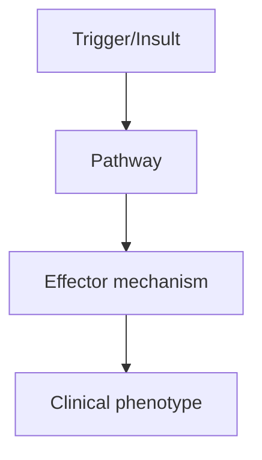
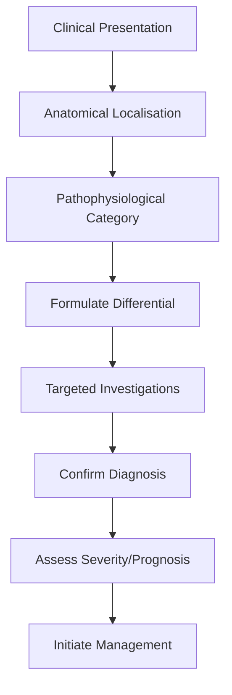
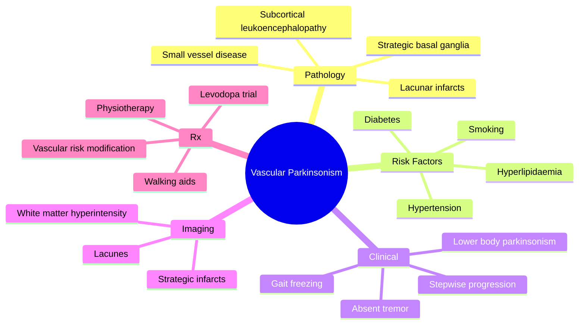

# Vascular Parkinsonism

> [!tip] **High-Yield Definition**
> Vascular parkinsonism (VP): parkinsonism caused by cerebrovascular disease. Subtypes: (1) Binswanger disease (subcortical arteriosclerotic encephalopathy, widespread white matter), (2) strategic infarct (basal ganglia, thalamus), (3) multi-infarct. Distinct from PD.

---

## 1. Definition / Epidemiology / Classification

### Definition
Vascular parkinsonism (VP): parkinsonism caused by cerebrovascular disease. Subtypes: (1) Binswanger disease (subcortical arteriosclerotic encephalopathy, widespread white matter), (2) strategic infarct (basal ganglia, thalamus), (3) multi-infarct. Distinct from PD.

### Epidemiology
3-5% of parkinsonism. Older age (>60y). Vascular risk factors common (HTN, DM, smoking, hyperlipidaemia, atrial fibrillation). Male predominance.

### Classification
| Variant | Key Features | Prognosis |
|---------|-------------|-----------|
| | | |

---

## 2. Aetiology / Pathophysiology

### Aetiology
Small vessel disease: lacunar infarcts, white matter hyperintensities (leukoaraiosis), strategic infarcts (caudate, putamen, globus pallidus, thalamus, SN). Risk factors: HTN, DM, hyperlipidaemia, smoking, atrial fibrillation, vasculitis, CADASIL. Pathology: multiple small infarcts, microbleeds, white matter rarefaction, lacunes. Differentiated from PD: vascular lesions in basal ganglia/white matter, no Lewy bodies (usually).

### Pathophysiology

---

## 3. Clinical Features

### History
- **Onset/Duration:**
- **Progression:**
- **Key symptoms:**
- **Triggers:**
- **Systemic symptoms:**
- **Drug/Family/Social history:**

### Examination
| Domain | Key Findings | Localisation Value |
|--------|-------------|-------------------|
| | | |

### Specific Clinical Features
Lower body parkinsonism: gait disorder (magnetic, shuffling, freezing), postural instability, falls. Less upper limb: bradykinesia, rigidity, tremor (less prominent, postural). Often: pseudobulbar palsy, spasticity, hyperreflexia, extensor plantars (UMN signs). Cognitive decline: subcortical dementia (frontal, executive, attention, processing speed). Pseudobulbar affect. Urinary incontinence, urgency. Stepwise progression (vs gradual in PD).

---

## 4. Diagnostic Approach / Algorithm

---

## 5. Investigations

MRI brain: strategic infarcts (basal ganglia, thalamus), extensive white matter hyperintensities (Fazekas grade 2-3), lacunes, microbleeds (SWI/GRE). Vascular risk factors: BP, lipids, HbA1c, ECG (AF), carotid Doppler, echocardiogram. DaT-SPECT: NORMAL or mildly reduced (vs severely reduced in PD). Trial of levodopa: usually poor response (vs good in PD).

---

## 6. Differential Diagnosis

| Differential | Distinguishing Features | Key Test |
|--------------|------------------------|----------|
| | | |

---

## 7. Management

Vascular risk factor modification: BP control, statins, antiplatelets, glycaemic control, smoking cessation, exercise. Levodopa: trial (often poor, some benefit in mixed PD+VP). Treat gait, falls (physiotherapy, walking aids, fall prevention). Treat spasticity, pseudobulbar affect (dextromethorphan/quinidine). Bladder (anticholinergics, mirabegron). Cognition (no specific treatment, vascular risk reduction). Multidisciplinary: physiotherapy, OT, neuropsychology, social work.

---

## 8. Drug Interactions / Contraindications / Comorbidity Cautions

| Drug | Interaction / Caution | Management |
|------|----------------------|------------|
| | | |

---

## 9. Procedures (if applicable)

### Procedure:
- **Indications:**
- **Contraindications:**
- **Preparation / Principle:**
- **Complications:**
- **Viva Pearls:**

---

## 10. Complications

| Complication | Frequency | Prevention / Monitoring | Management |
|--------------|-----------|------------------------|------------|
| | | | |

---

## 11. Red Flags / Emergencies

Falls, fractures, stroke (recurrent), cognitive decline, urinary incontinence, aspiration, depression, vascular events (MI, stroke, PVD).

---

## 12. Prognosis

Worse than PD. Faster progression in some. 5-year mortality higher than PD. Cause of death: vascular (stroke, MI), pneumonia, falls. No disease-modifying therapy. Vascular risk factor control is key.

---

## 13. Topic Correlation

| Related Topic | Link | Key Overlap |
|---------------|------|-------------|
| | | |

---

## 14. Special Situations

| Situation | Consideration |
|-----------|---------------|
| **Pregnancy** | |
| **Lactation** | |
| **Paediatric** | |
| **Elderly / Frail** | |
| **Renal impairment** | |
| **Hepatic impairment** | |
| **Immunocompromised** | |
| **Perioperative** | |
| **Driving / DVLA** | |
| **Occupational** | |

---

## FCPS/MRCP High-Yield Summary

| Category | Key Points |
|----------|------------|
| **Definition** | Vascular parkinsonism (VP): parkinsonism caused by cerebrovascular disease. Subtypes: (1) Binswanger disease (subcortical arteriosclerotic encephalopathy, widespread white matter), (2) strategic infar |
| **Epidemiology** | 3-5% of parkinsonism. Older age (>60y). Vascular risk factors common (HTN, DM, smoking, hyperlipidaemia, atrial fibrillation). Male predominance. |
| **Pathophysiology** | |
| **Clinical** | Lower body parkinsonism: gait disorder (magnetic, shuffling, freezing), postural instability, falls. Less upper limb: bradykinesia, rigidity, tremor (less prominent, postural). Often: pseudobulbar pal |
| **Diagnosis** | |
| **Investigations** | MRI brain: strategic infarcts (basal ganglia, thalamus), extensive white matter hyperintensities (Fazekas grade 2-3), lacunes, microbleeds (SWI/GRE). Vascular risk factors: BP, lipids, HbA1c, ECG (AF) |
| **Management** | Vascular risk factor modification: BP control, statins, antiplatelets, glycaemic control, smoking cessation, exercise. Levodopa: trial (often poor, some benefit in mixed PD+VP). Treat gait, falls (phy |
| **Complications** | |
| **Prognosis** | Worse than PD. Faster progression in some. 5-year mortality higher than PD. Cause of death: vascular (stroke, MI), pneumonia, falls. No disease-modifying therapy. Vascular risk factor control is key. |
| **Viva Pearls** | |
| **Drug Doses** | |
| **Scoring Systems** | |
| **Genetics** | |
| **Imaging Signs** | |

---

## Viva Questions (PACES/FCPS Style)

1. **Q:** Define Vascular Parkinsonism and classify its variants.
   **A:** Based on the definition above.

2. **Q:** What are the key clinical features?
   **A:** Lower body parkinsonism: gait disorder (magnetic, shuffling, freezing), postural instability, falls. Less upper limb: bradykinesia, rigidity, tremor (less prominent, postural). Often: pseudobulbar palsy, spasticity, hyperreflexia, extensor plantars (UMN signs). Cognitive decline: subcortical dementi

3. **Q:** What is the first-line treatment?
   **A:** Based on the management section.

4. **Q:** What are the red flags requiring urgent referral?
   **A:** Falls, fractures, stroke (recurrent), cognitive decline, urinary incontinence, aspiration, depression, vascular events (MI, stroke, PVD).

5. **Q:** What is the prognosis?
   **A:** Worse than PD. Faster progression in some. 5-year mortality higher than PD. Cause of death: vascular (stroke, MI), pneumonia, falls. No disease-modifying therapy. Vascular risk factor control is key.

6. **Q:** How do you differentiate Vascular Parkinsonism from key differentials?
   **A:** Clinical features, investigations, and response to treatment.

7. **Q:** What investigations are most useful?
   **A:** Based on the investigations section.

8. **Q:** Describe the stepwise management approach.
   **A:** Based on the management algorithm.

9. **Q:** What are the emergency presentations?
   **A:** Based on the red flags section.

10. **Q:** How does management change in pregnancy/paediatrics/elderly?
    **A:** Special considerations per population.

---

## Common Confusions / Exam Traps

| Confusion | Clarification |
|-----------|---------------|
| | |

---

## Mnemonics

- **LOWER** — **L**ower body parkinsonism (gait predominant) + **O**nset stepwise + **W**hite matter changes on MRI + **E**lderly with vascular risk factors + **R**esting tremor absent (**LOWER**) - use: clinical features
- **VP** — **V**ascular disease + **P**arkinsonism (lower body, gait freezing) + **P**oor levodopa response (**VP**) - use: definition
- **BINS** — **B**inswanger (subcortical) + **I**nfarcts (lacunar/strategic) + **N**ormal DAT-SPECT + **S**tepwise (BINS) - use: types & workup

---

## Mind Map

---

## Spaced Repetition Trackers

| Day | Topic to Revise |
|-----|-----------------|
| Day 1 | Definition + lower body parkinsonism + stepwise progression |
| Day 3 | Risk factors: hypertension, diabetes, smoking, atrial fibrillation |
| Day 7 | Imaging: white matter hyperintensity, lacunes, strategic infarcts |
| Day 14 | Differential: PD, PSP, NPH, idiopathic gait disorder |
| Day 30 | Management: vascular risk modification, levodopa trial, rehabilitation |
| Day 90 | Prognosis, DAT-SPECT (normal), FCPS/MRCP viva questions |

---

## Self-Test Scorecard

| Section | Score |
|---------|-------|
| 1. Definition & Pathophysiology | ___/5 |
| 2. Epidemiology | ___/5 |
| 3. Risk Factors | ___/5 |
| 4. Clinical Features | ___/5 |
| 5. Imaging (MRI, DAT-SPECT) | ___/5 |
| 6. Diagnostic Criteria (Zijlmans) | ___/5 |
| 7. Differential Diagnosis | ___/5 |
| 8. Management | ___/5 |
| 9. Secondary Prevention | ___/5 |
| 10. Prognosis & Viva Pearls | ___/5 |

**Total: ___/50**

---

## MCQs (10)

1. **Question:** Vascular parkinsonism is BEST described as:
   **Options:** A. Symmetric resting tremor with bradykinesia B. Lower-body parkinsonism with gait freezing and absent tremor C. Dementia with hallucinations D. Cerebellar ataxia with dysarthria
   **Answer:** B
   **Explanation:** Vascular parkinsonism (VP) presents with lower-body predominant parkinsonism (shuffling gait, freezing, start hesitation) with relatively preserved upper-limb function and ABSENT resting tremor. Progression is often stepwise.

2. **Question:** Which of the following is a typical feature distinguishing vascular parkinsonism from idiopathic PD?
   **Options:** A. Resting tremor B. Good levodopa response C. Lower body predominance and absence of resting tremor D. Asymmetric onset
   **Answer:** C
   **Explanation:** VP is lower-body predominant (gait freezing, start hesitation, postural instability) with ABSENT tremor and usually SYMMETRIC. PD is typically asymmetric, with resting tremor and excellent levodopa response.

3. **Question:** DAT-SPECT (DaTscan) in vascular parkinsonism typically shows:
   **Options:** A. Markedly reduced striatal uptake B. Normal or near-normal striatal uptake C. Unilateral putaminal uptake only D. Pituitary uptake
   **Answer:** B
   **Explanation:** DAT-SPECT is NORMAL or near-normal in vascular parkinsonism, because the presynaptic dopaminergic neurones in the substantia nigra are intact. This is an important distinguishing feature from PD, MSA and PSP.

4. **Question:** The MOST important risk factor for vascular parkinsonism is:
   **Options:** A. Smoking B. Hypertension C. Alcohol D. Obesity alone
   **Answer:** B
   **Explanation:** Hypertension is the most important modifiable risk factor for small vessel disease and vascular parkinsonism. Other risks include diabetes, hyperlipidaemia, atrial fibrillation, and smoking.

5. **Question:** Binswanger disease (subcortical arteriosclerotic encephalopathy) refers to:
   **Options:** A. Demyelination of the spinal cord B. Bilateral diffuse white-matter changes due to small-vessel disease C. Cerebellar degeneration D. Hippocampal sclerosis
   **Answer:** B
   **Explanation:** Binswanger disease is a form of subcortical vascular dementia with bilateral, diffuse white-matter hyperintensities on MRI due to chronic small-vessel ischaemia. It is associated with gait disorder and vascular parkinsonism.

6. **Question:** Levodopa response in vascular parkinsonism is usually:
   **Options:** A. Excellent B. Poor or absent C. Cures the disease D. Causes severe dyskinesias
   **Answer:** B
   **Explanation:** VP typically shows poor or no response to levodopa because the nigrostriatal pathway is intact; the damage is downstream in the striatum and white matter. A trial of levodopa is still warranted.

7. **Question:** Strategic infarct causing acute hemiparkinsonism usually involves the:
   **Options:** A. Substantia nigra B. Contralateral basal ganglia (especially lentiform nucleus and caudate) C. Cerebellum D. Spinal cord
   **Answer:** B
   **Explanation:** Acute hemiparkinsonism from a single infarct is rare but well-recognised, with lesions usually in the contralateral basal ganglia (lentiform nucleus, caudate, or thalamus).

8. **Question:** Which MRI finding is most supportive of vascular parkinsonism?
   **Options:** A. Hummingbird sign B. Hot cross bun sign C. Multiple lacunes and confluent periventricular white-matter hyperintensities D. Cortical ribboning on DWI
   **Answer:** C
   **Explanation:** MRI in VP shows multiple lacunes in the basal ganglia and thalami, and confluent periventricular and deep white-matter hyperintensities (Fazekas 2-3), consistent with small-vessel disease.

9. **Question:** Gait freezing in vascular parkinsonism is BEST described as:
   **Options:** A. Absence of tremor with start hesitation and shuffling B. Absent C. Only on uneven ground D. Tremor-induced
   **Answer:** A
   **Explanation:** Gait freezing in VP is characterised by start hesitation, shuffling, and difficulty initiating and turning, often with relatively preserved upper-limb function. It is often LESS responsive to levodopa than in PD.

10. **Question:** The most appropriate management of vascular parkinsonism includes:
   **Options:** A. High-dose levodopa and dopamine agonists B. Vascular risk factor modification + levodopa trial + physiotherapy C. Anticholinergics only D. Surgery
   **Answer:** B
   **Explanation:** Management of VP centres on: aggressive vascular risk factor modification (BP, glycaemic, lipid, antiplatelet), levodopa trial (often modest benefit), and physiotherapy with falls prevention. Dopamine agonists are less effective.

---

## SBA Questions (10)

1. **Scenario:** A 72-year-old hypertensive, diabetic man presents with 2 years of progressive shuffling gait, start hesitation and freezing. Upper-limb function is preserved, no tremor, and gait is markedly worse in the dark. Levodopa trial produced no benefit.
   **Question:** The MOST likely diagnosis is:
   **Options:** A. Idiopathic Parkinson's disease B. Vascular parkinsonism C. Progressive supranuclear palsy D. Normal pressure hydrocephalus
   **Answer:** B
   **Explanation:** Lower-body predominant parkinsonism with freezing, preserved upper limbs, absent tremor, and no levodopa response in a patient with vascular risk factors is classic for vascular parkinsonism.

2. **Scenario:** DAT-SPECT (DaTscan) in a 70-year-old with lower-body parkinsonism, vascular risk factors, and poor levodopa response is reported as normal.
   **Question:** This finding is MOST consistent with:
   **Options:** A. Idiopathic PD B. Vascular parkinsonism (or another non-degenerative cause) C. MSA D. PSP
   **Answer:** B
   **Explanation:** A normal DAT-SPECT indicates intact presynaptic dopaminergic neurones, arguing against PD, MSA, or PSP. It supports a 'downstream' lesion such as vascular parkinsonism.

3. **Scenario:** A 75-year-old with vascular parkinsonism has uncontrolled hypertension (BP 180/100), hyperlipidaemia and atrial fibrillation.
   **Question:** What is the MOST important intervention to slow disease progression?
   **Options:** A. Increase levodopa B. Aggressive vascular risk factor modification (BP control, statin, anticoagulation for AF) C. DBS D. Stop all medications
   **Answer:** B
   **Explanation:** Vascular risk factor modification is the cornerstone of VP management: BP control, statin, antiplatelet (or anticoagulation for AF), glycaemic control, and lifestyle measures. This is the only strategy shown to slow progression.

4. **Scenario:** MRI brain in a 70-year-old with lower-body parkinsonism shows multiple lacunes in the basal ganglia and confluent periventricular white-matter hyperintensities (Fazekas 3).
   **Question:** What is the MOST likely diagnosis?
   **Options:** A. Vascular parkinsonism B. Idiopathic PD C. PSP D. DLB
   **Answer:** A
   **Explanation:** Multiple lacunes and confluent white-matter hyperintensities in a patient with lower-body parkinsonism are characteristic of vascular parkinsonism due to small-vessel disease.

5. **Scenario:** A patient with vascular parkinsonism has recurrent falls and start hesitation. Examination shows shuffling gait with freezing on turning.
   **Question:** What is the BEST non-pharmacological intervention?
   **Options:** A. Bed rest B. Physiotherapy with gait training, cueing, and falls prevention C. Hip replacement D. No intervention
   **Answer:** B
   **Explanation:** Physiotherapy with external cueing, balance training, and falls prevention is the most effective non-pharmacological strategy for gait freezing in VP.

6. **Scenario:** A 68-year-old with vascular parkinsonism is reviewed. Examination shows pyramidal signs in the legs and pseudobulbar features.
   **Question:** What does the combination of upper motor neuron signs and parkinsonism suggest?
   **Options:** A. MSA B. Combined upper motor neuron and extrapyramidal involvement due to extensive small-vessel disease C. ALS D. PD
   **Answer:** B
   **Explanation:** Vascular parkinsonism often shows upper motor neuron signs (spasticity, brisk reflexes, extensor plantars) and pseudobulbar features (emotional lability, dysarthria) due to widespread white-matter and basal ganglia damage.

7. **Scenario:** A 60-year-old presents with acute-onset right hemiparesis and rigidity of the right arm and leg after a stroke. MRI shows a left lentiform nucleus infarct.
   **Question:** What is the MOST likely diagnosis?
   **Options:** A. Idiopathic PD B. Post-stroke (strategic infarct) parkinsonism C. MSA D. PSP
   **Answer:** B
   **Explanation:** Acute parkinsonism following a strategic infarct in the contralateral basal ganglia is recognised as 'post-stroke parkinsonism', a form of vascular parkinsonism.

8. **Scenario:** A 74-year-old with vascular parkinsonism is started on levodopa-carbidopa 100/25 mg TDS. After 3 months there is no objective improvement.
   **Question:** What is the BEST next step?
   **Options:** A. Increase levodopa dose to 1000 mg/day B. Stop levodopa after documenting non-response, continue physiotherapy and vascular risk modification C. Add tolcapone D. DBS
   **Answer:** B
   **Explanation:** An adequate levodopa trial (1000 mg/day for 3 months) without response supports vascular parkinsonism. Levodopa is withdrawn (no benefit, only side effects) and management focuses on physiotherapy and vascular risk control.

9. **Scenario:** A 75-year-old with vascular parkinsonism is reviewed. Cognitive testing shows impaired executive function and slowed processing.
   **Question:** The MOST likely cause of cognitive impairment in this setting is:
   **Options:** A. DLB B. Subcortical ischaemic vascular dementia C. AD D. FTD
   **Answer:** B
   **Explanation:** Subcortical ischaemic vascular dementia (including Binswanger disease) is common in patients with vascular parkinsonism. It presents with executive dysfunction, slowed processing, gait disorder, and mood changes.

10. **Scenario:** A 70-year-old with vascular parkinsonism has urinary incontinence, gait disturbance, and cognitive impairment.
   **Question:** What is the MOST important alternative diagnosis to consider?
   **Options:** A. Normal pressure hydrocephalus (NPH) B. PSP C. MSA D. DLB
   **Answer:** A
   **Explanation:** NPH presents with the triad of gait disturbance (magnetic gait), urinary incontinence, and cognitive impairment (wet, wobbly, wacky). It can mimic vascular parkinsonism but is potentially treatable with VP shunting.

---

## Tags

#neurology #movement-disorders #parkinsonism #vascular-parkinsonism #small-vessel-disease #white-matter #Binswanger #FCPS #MRCP

## Local Navigation
**Heading Hub:** [[../Hub]]  
**Chapter Hierarchy:** [[Davidson Chapter 25 - Neurology Hierarchy]]  
**Chapter MOC:** [[Neurology MOC]]  
**Drug Reference:** [[../00_Index/Neurology Drug Reference]]  
