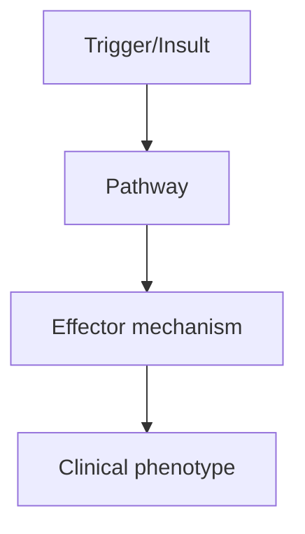
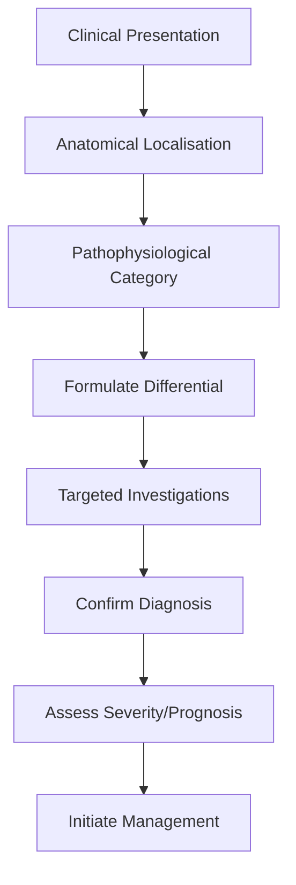
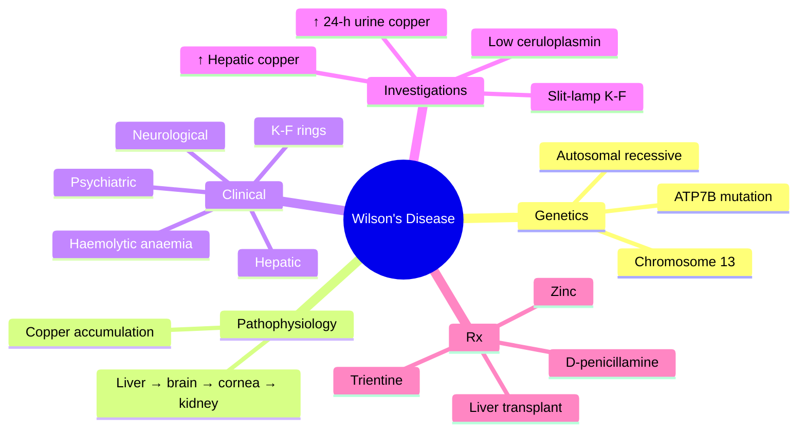

# Wilsons Disease

> [!tip] **High-Yield Definition**
> Wilson's disease (hepatolenticular degeneration): autosomal recessive disorder of copper metabolism due to ATP7B gene mutation. Copper accumulates in liver, brain (basal ganglia, especially putamen), cornea (Kayser-Fleischer rings), kidneys. Treatable if recognised.

---

## 1. Definition / Epidemiology / Classification

### Definition
Wilson's disease (hepatolenticular degeneration): autosomal recessive disorder of copper metabolism due to ATP7B gene mutation. Copper accumulates in liver, brain (basal ganglia, especially putamen), cornea (Kayser-Fleischer rings), kidneys. Treatable if recognised.

### Epidemiology
Prevalence: 1-3/30,000. Age: 5-35y (peak 5-20y). 3% of population are carriers. Founder effects in isolated populations.

### Classification
| Variant | Key Features | Prognosis |
|---------|-------------|-----------|
| | | |

---

## 2. Aetiology / Pathophysiology

### Aetiology
ATP7B gene (chromosome 13) - copper-transporting ATPase. Impaired biliary copper excretion, reduced ceruloplasmin incorporation. Copper accumulation in liver, then brain, cornea, kidneys, joints. Genetic heterogeneity: 700+ mutations. Autosomal recessive.

### Pathophysiology

---

## 3. Clinical Features

### History
- **Onset/Duration:**
- **Progression:**
- **Key symptoms:**
- **Triggers:**
- **Systemic symptoms:**
- **Drug/Family/Social history:**

### Examination
| Domain | Key Findings | Localisation Value |
|--------|-------------|-------------------|
| | | |

### Specific Clinical Features
Hepatic (40%, may precede neurology by years): chronic hepatitis, cirrhosis, fulminant hepatic failure, haemolysis. Neurological (40%): tremor (wing-beating, postural, action), dystonia (focal, segmental, generalised), parkinsonism, dysarthria, dysphagia, dystonic smile (risus sardonicus), ataxia, chorea. Psychiatric (10-25%): personality change, depression, psychosis, academic decline. Kayser-Fleischer rings (95% in neurological, 50% in hepatic): copper deposition in Descemet's membrane, slit-lamp examination. Renal: Fanconi syndrome. Haematological: haemolytic anaemia. Joints: arthropathy. Cardiac: arrhythmias, cardiomyopathy.

---

## 4. Diagnostic Approach / Algorithm

---

## 5. Investigations

Screening: serum ceruloplasmin (low <0.2g/L, but 10% normal), 24h urinary copper (high >100μg/24h, often >1000 in symptomatic), serum copper (low total, high free). Liver biopsy (gold standard): copper quantification >250μg/g dry weight. Slit-lamp: Kayser-Fleischer rings. MRI brain: face of giant panda (T2 midbrain), basal ganglia hyperintensity (putamen, globus pallidus, caudate), 'bright claustrum' sign, thalamic, brainstem. Genetic testing: ATP7B sequencing. Leipzig score (≥4: definite, 3: probable, ≤2: unlikely).

---

## 6. Differential Diagnosis

| Differential | Distinguishing Features | Key Test |
|--------------|------------------------|----------|
| | | |

---

## 7. Management

Lifelong treatment. First-line: chelators (penicillamine 1-2g/day, trientine 1.2-1.8g/day - bind copper, increase urinary excretion). Zinc 50mg TDS (blocks intestinal copper absorption, induces metallothionein). First presentation: chelator + zinc. Maintenance: zinc or low-dose chelator. Diet: avoid copper-rich foods (shellfish, liver, nuts, chocolate, mushrooms). Liver transplantation: fulminant hepatic failure, decompensated cirrhosis. Monitoring: 24h urinary copper, LFTs, FBC, neurological exam. Symptomatic: dystonia (trihexyphenidyl, BoNT), tremor (propranolol, primidone), parkinsonism (levodopa). Screen family: serum ceruloplasmin, 24h urinary copper, genetic testing.

---

## 8. Drug Interactions / Contraindications / Comorbidity Cautions

| Drug | Interaction / Caution | Management |
|------|----------------------|------------|
| | | |

---

## 9. Procedures (if applicable)

### Procedure:
- **Indications:**
- **Contraindications:**
- **Preparation / Principle:**
- **Complications:**
- **Viva Pearls:**

---

## 10. Complications

| Complication | Frequency | Prevention / Monitoring | Management |
|--------------|-----------|------------------------|------------|
| | | | |

---

## 11. Red Flags / Emergencies

Acute hepatic failure (Coombs-negative haemolytic anaemia, low ALP, high bilirubin, high AST/ALT), worsening neurology on treatment, drug side effects (penicillamine: nephrotoxicity, myelosuppression, pyridoxine deficiency; trientine: less toxic; zinc: GI upset).

---

## 12. Prognosis

Treatable. Early treatment: good neurological outcome (most improve). Delayed treatment: residual deficits. Lifelong treatment required. Liver transplant: curative for liver. Monitoring lifelong for adherence, side effects, liver.

---

## 13. Topic Correlation

| Related Topic | Link | Key Overlap |
|---------------|------|-------------|
| | | |

---

## 14. Special Situations

| Situation | Consideration |
|-----------|---------------|
| **Pregnancy** | |
| **Lactation** | |
| **Paediatric** | |
| **Elderly / Frail** | |
| **Renal impairment** | |
| **Hepatic impairment** | |
| **Immunocompromised** | |
| **Perioperative** | |
| **Driving / DVLA** | |
| **Occupational** | |

---

## FCPS/MRCP High-Yield Summary

| Category | Key Points |
|----------|------------|
| **Definition** | Wilson's disease (hepatolenticular degeneration): autosomal recessive disorder of copper metabolism due to ATP7B gene mutation. Copper accumulates in liver, brain (basal ganglia, especially putamen),  |
| **Epidemiology** | Prevalence: 1-3/30,000. Age: 5-35y (peak 5-20y). 3% of population are carriers. Founder effects in isolated populations. |
| **Pathophysiology** | |
| **Clinical** | Hepatic (40%, may precede neurology by years): chronic hepatitis, cirrhosis, fulminant hepatic failure, haemolysis. Neurological (40%): tremor (wing-beating, postural, action), dystonia (focal, segmen |
| **Diagnosis** | |
| **Investigations** | Screening: serum ceruloplasmin (low <0.2g/L, but 10% normal), 24h urinary copper (high >100μg/24h, often >1000 in symptomatic), serum copper (low total, high free). Liver biopsy (gold standard): coppe |
| **Management** | Lifelong treatment. First-line: chelators (penicillamine 1-2g/day, trientine 1.2-1.8g/day - bind copper, increase urinary excretion). Zinc 50mg TDS (blocks intestinal copper absorption, induces metall |
| **Complications** | |
| **Prognosis** | Treatable. Early treatment: good neurological outcome (most improve). Delayed treatment: residual deficits. Lifelong treatment required. Liver transplant: curative for liver. Monitoring lifelong for a |
| **Viva Pearls** | |
| **Drug Doses** | |
| **Scoring Systems** | |
| **Genetics** | |
| **Imaging Signs** | |

---

## Viva Questions (PACES/FCPS Style)

1. **Q:** Define Wilsons Disease and classify its variants.
   **A:** Based on the definition above.

2. **Q:** What are the key clinical features?
   **A:** Hepatic (40%, may precede neurology by years): chronic hepatitis, cirrhosis, fulminant hepatic failure, haemolysis. Neurological (40%): tremor (wing-beating, postural, action), dystonia (focal, segmental, generalised), parkinsonism, dysarthria, dysphagia, dystonic smile (risus sardonicus), ataxia, c

3. **Q:** What is the first-line treatment?
   **A:** Based on the management section.

4. **Q:** What are the red flags requiring urgent referral?
   **A:** Acute hepatic failure (Coombs-negative haemolytic anaemia, low ALP, high bilirubin, high AST/ALT), worsening neurology on treatment, drug side effects (penicillamine: nephrotoxicity, myelosuppression, pyridoxine deficiency; trientine: less toxic; zinc: GI upset).

5. **Q:** What is the prognosis?
   **A:** Treatable. Early treatment: good neurological outcome (most improve). Delayed treatment: residual deficits. Lifelong treatment required. Liver transplant: curative for liver. Monitoring lifelong for adherence, side effects, liver.

6. **Q:** How do you differentiate Wilsons Disease from key differentials?
   **A:** Clinical features, investigations, and response to treatment.

7. **Q:** What investigations are most useful?
   **A:** Based on the investigations section.

8. **Q:** Describe the stepwise management approach.
   **A:** Based on the management algorithm.

9. **Q:** What are the emergency presentations?
   **A:** Based on the red flags section.

10. **Q:** How does management change in pregnancy/paediatrics/elderly?
    **A:** Special considerations per population.

---

## Common Confusions / Exam Traps

| Confusion | Clarification |
|-----------|---------------|
| | |

---

## Mnemonics

- **WILSON** — **W**ilson = **I**nherited (**A**TP7B) **L**iver + **N**eurological (movement) + **O**phthalmic (K-F rings) + **N**ephrogenic + **S**ideroblastic / **O**ther (**WILSON**) - use: clinical
- **Cu-Cu-LD** — **C**opper **C**hronic overload → **L**iver (cirrhosis), **D**opamine deficiency (movement disorder) (**Cu-Cu-LD**) - use: pathophysiology
- **ABCDE** — **A**TP7B mutation + **B**aseline ceruloplasmin low + **C**opper (serum free ↑, 24-h urine ↑) + **D**-penicillamine/trientine + **E**ye K-F rings (**ABCDE**) - use: diagnosis and Rx

---

## Mind Map

---

## Spaced Repetition Trackers

| Day | Topic to Revise |
|-----|-----------------|
| Day 1 | Definition + ATP7B mutation + copper metabolism |
| Day 3 | Clinical features: hepatic, neurological, psychiatric, ophthalmic, renal |
| Day 7 | Investigations: ceruloplasmin, 24-h urine copper, hepatic copper, slit-lamp K-F |
| Day 14 | Differential: parkinsonism, dystonia, chorea, hepatitis of unknown cause |
| Day 30 | Management: penicillamine, trientine, zinc, monitoring, side effects |
| Day 90 | Leipzig score, MR face of giant panda, FCPS/MRCP viva questions |

---

## Self-Test Scorecard

| Section | Score |
|---------|-------|
| 1. Definition & Genetics | ___/5 |
| 2. Epidemiology | ___/5 |
| 3. Pathophysiology (copper metabolism) | ___/5 |
| 4. Hepatic Presentation | ___/5 |
| 5. Neurological & Psychiatric Presentation | ___/5 |
| 6. Ophthalmic & Other Features | ___/5 |
| 7. Investigations | ___/5 |
| 8. Leipzig Score & Diagnostic Criteria | ___/5 |
| 9. Management (Drugs & Liver Transplant) | ___/5 |
| 10. Prognosis & Viva Pearls | ___/5 |

**Total: ___/50**

---

## MCQs (10)

1. **Question:** Wilson's disease is caused by a mutation in:
   **Options:** A. ATP7B gene on chromosome 13 B. HFE gene C. FXN gene D. SOD1 gene
   **Answer:** A
   **Explanation:** Wilson's disease is an autosomal recessive disorder caused by mutations in the ATP7B gene on chromosome 13, which encodes a copper-transporting ATPase. HFE = hereditary haemochromatosis; FXN = Friedreich; SOD1 = familial ALS.

2. **Question:** Kayser-Fleischer rings are due to:
   **Options:** A. Lipid deposition in the cornea B. Copper deposition in Descemet's membrane of the cornea C. Iron deposition D. Calcification
   **Answer:** B
   **Explanation:** K-F rings are golden-brown copper deposits in Descemet's membrane at the periphery of the cornea, best seen on slit-lamp examination. They are present in >95% of patients with neurological Wilson's disease.

3. **Question:** Serum ceruloplasmin in Wilson's disease is typically:
   **Options:** A. Markedly elevated B. Low (often <0.2 g/L) C. Normal D. Markedly elevated in acute phase
   **Answer:** B
   **Explanation:** Serum ceruloplasmin is typically LOW in Wilson's disease (often <0.2 g/L) because copper is not properly incorporated. Note: it is an acute-phase reactant and may be normal in active inflammation or pregnancy.

4. **Question:** The first-line drug for symptomatic neurological Wilson's disease is:
   **Options:** A. D-penicillamine or trientine B. Haloperidol C. Levodopa D. Bromocriptine
   **Answer:** A
   **Explanation:** D-penicillamine (a copper chelator) and trientine are first-line for symptomatic Wilson's disease. Zinc is often used for maintenance or in asymptomatic patients. D-penicillamine can cause initial neurological worsening.

5. **Question:** The diagnosis is MOST consistent with:
   **Options:** A. Parkinson's disease B. Wilson's disease C. MSA D. PSP
   **Answer:** B
   **Explanation:** Young onset (<40) movement disorder, low ceruloplasmin, K-F rings and the characteristic 'face of the giant panda' sign in the midbrain are diagnostic of Wilson's disease.

6. **Question:** Wilson's disease is BEST screened in a young patient with new-onset movement disorder by:
   **Options:** A. Serum ferritin B. Serum ceruloplasmin + 24-h urinary copper + slit-lamp examination C. DAT-SPECT D. CSF examination
   **Answer:** B
   **Explanation:** All young patients (<40 years) with new-onset movement disorder or unexplained liver disease should be screened with serum ceruloplasmin, 24-h urinary copper, and slit-lamp examination for K-F rings.

7. **Question:** D-penicillamine can cause which of the following side effects?
   **Options:** A. Hyperthyroidism B. Renal failure, bone marrow suppression, pyridoxine deficiency, early neurological worsening C. Severe hypertension D. Renal tubular acidosis
   **Answer:** B
   **Explanation:** D-penicillamine has multiple side effects: proteinuria/nephrotic syndrome, bone marrow suppression, pyridoxine (B6) deficiency, rash, and initial worsening of neurological symptoms. B6 supplementation is usually given.

8. **Question:** The Leipzig score is used to:
   **Options:** A. Diagnose multiple sclerosis B. Establish the diagnosis of Wilson's disease C. Stage Parkinson's disease D. Diagnose Friedreich ataxia
   **Answer:** B
   **Explanation:** The Leipzig score (≥4 = diagnosis of Wilson's disease) uses clinical features, K-F rings, ceruloplasmin, 24-h urine copper, hepatic copper quantification, and mutation analysis to establish the diagnosis.

9. **Question:** Zinc therapy in Wilson's disease acts by:
   **Options:** A. Chelating copper from the body B. Inducing metallothionein in enterocytes, blocking copper absorption C. Increasing urinary copper excretion D. Removing copper from the brain
   **Answer:** B
   **Explanation:** Zinc induces metallothionein in enterocytes, which binds copper in the intestine and prevents its absorption. It is used for maintenance therapy and in presymptomatic patients.

10. **Question:** Which of the following is the definitive treatment for decompensated cirrhosis or fulminant hepatic failure in Wilson's disease?
   **Options:** A. High-dose zinc B. Liver transplantation C. D-penicillamine D. Trientine
   **Answer:** B
   **Explanation:** Liver transplantation is curative for the metabolic defect in Wilson's disease and is indicated in fulminant hepatic failure or decompensated cirrhosis unresponsive to medical therapy.

---

## SBA Questions (10)

1. **Scenario:** A 22-year-old man presents with a 1-year history of progressive dysarthria, dystonia, parkinsonism and behavioural change. Slit-lamp examination reveals bilateral golden-brown rings at the corneal limbus.
   **Question:** The MOST likely diagnosis is:
   **Options:** A. Huntington's disease B. Wilson's disease C. Parkinson's disease D. Sydenham chorea
   **Answer:** B
   **Explanation:** Young onset (<40) movement disorder with Kayser-Fleischer rings is highly suggestive of Wilson's disease. Confirmatory tests: low ceruloplasmin, raised 24-h urinary copper, and (if needed) elevated hepatic copper on biopsy.

2. **Scenario:** A 19-year-old presents with acute liver failure, Coombs-negative haemolytic anaemia, and a low ceruloplasmin.
   **Question:** What is the BEST next step in management?
   **Options:** A. IV methylprednisolone B. Refer for liver transplantation + chelation therapy C. Plasma exchange D. Wait and watch
   **Answer:** B
   **Explanation:** Wilson's disease presenting with fulminant hepatic failure and haemolysis is a medical emergency. Chelation therapy (D-penicillamine/trientine) and referral for liver transplantation are required urgently.

3. **Scenario:** A 25-year-old with newly diagnosed Wilson's disease is started on D-penicillamine. Within 4 weeks his neurological symptoms have worsened.
   **Question:** What is the BEST next step?
   **Options:** A. Increase penicillamine B. Reduce penicillamine, add zinc, and consider switching to trientine C. Stop all therapy D. Add haloperidol
   **Answer:** B
   **Explanation:** Up to 30% of patients have initial neurological worsening on D-penicillamine. Options include reducing the dose, switching to trientine, and adding zinc. Symptoms usually improve over months.

4. **Scenario:** A 30-year-old with Wilson's disease is started on trientine. She asks about side effects.
   **Question:** Which side effect is MOST associated with trientine?
   **Options:** A. Nephrotic syndrome B. Sideroblastic anaemia C. Hepatotoxicity D. Lupus-like syndrome
   **Answer:** A
   **Explanation:** Trientine is generally better tolerated than D-penicillamine but can cause iron deficiency, sideroblastic anaemia, and renal tubular dysfunction. Pyridoxine (B6) supplementation is sometimes required.

5. **Scenario:** A 24-year-old asymptomatic sibling of a Wilson's disease patient is screened. Ceruloplasmin is low; 24-h urinary copper is mildly elevated; K-F rings are absent; genetic test confirms compound heterozygous ATP7B mutations.
   **Question:** What is the BEST management?
   **Options:** A. Observation only B. Start zinc therapy for life C. Start D-penicillamine D. Liver transplant
   **Answer:** B
   **Explanation:** Asymptomatic or presymptomatic Wilson's disease is treated with zinc monotherapy for life, which prevents copper absorption and is well tolerated. Genetic confirmation allows definitive treatment.

6. **Scenario:** A 28-year-old with Wilson's disease on long-term D-penicillamine develops proteinuria and oedema. 24-h urinary protein is 6 g.
   **Question:** What is the MOST likely cause?
   **Options:** A. Membranous nephropathy (D-penicillamine-induced) B. Acute tubular necrosis C. Diabetic nephropathy D. IgA nephropathy
   **Answer:** A
   **Explanation:** D-penicillamine can cause immune-mediated membranous nephropathy with nephrotic-range proteinuria. The drug should be stopped or switched to trientine.

7. **Scenario:** A 23-year-old with suspected Wilson's disease has low ceruloplasmin and raised 24-h urinary copper. Slit-lamp examination shows K-F rings. Liver biopsy shows hepatic copper 300 µg/g dry weight (normal <50).
   **Question:** What is the diagnosis?
   **Options:** A. Definite Wilson's disease B. Definite Wilson's disease based on Leipzig score ≥4 C. Indeterminate D. Primary biliary cholangitis
   **Answer:** B
   **Explanation:** K-F rings + low ceruloplasmin + raised 24-h urinary copper + hepatic copper >250 µg/g dry weight = Leipzig score ≥4, definite Wilson's disease.

8. **Scenario:** A 20-year-old with Wilson's disease presents with worsening tremor, rigidity, and dysarthria. Pyridoxine (B6) is not prescribed.
   **Question:** Which drug is MOST likely to be causing a deficiency?
   **Options:** A. D-penicillamine B. Trientine C. Zinc D. Haloperidol
   **Answer:** A
   **Explanation:** D-penicillamine is a pyridoxine antagonist and can cause B6 deficiency. Pyridoxine (25-50 mg/day) is routinely co-prescribed with D-penicillamine. Trientine can also cause B6 deficiency but less commonly.

9. **Scenario:** A 30-year-old with Wilson's disease on long-term therapy has a repeat MRI brain showing the 'face of the giant panda' sign in the midbrain on T2.
   **Question:** This sign is:
   **Options:** A. Pathognomonic for Wilson's disease B. Suggestive but not specific C. Specific for PSP D. Specific for MSA
   **Answer:** A
   **Explanation:** The 'face of the giant panda' sign (high signal in the tegmentum with preservation of the lateral portion of the reticular formation and red nuclei) is highly characteristic of Wilson's disease but is not present in all cases.

10. **Scenario:** A 26-year-old with Wilson's disease is on trientine and zinc. She becomes pregnant.
   **Question:** What is the BEST management during pregnancy?
   **Options:** A. Stop all therapy B. Continue chelation therapy (trientine) at lowest effective dose, monitor closely C. Switch to high-dose D-penicillamine D. Liver transplant
   **Answer:** B
   **Explanation:** Chelation therapy should be continued in pregnancy to prevent maternal deterioration. Trientine is often preferred; D-penicillamine is teratogenic but continuation is generally safer than stopping. Zinc can be continued.

---

## Tags

#neurology #movement-disorders #wilsons-disease #copper #ATP7B #Kayser-Fleischer #chelation #FCPS #MRCP

## Local Navigation
**Heading Hub:** [[../Hub]]  
**Chapter Hierarchy:** [[Davidson Chapter 25 - Neurology Hierarchy]]  
**Chapter MOC:** [[Neurology MOC]]  
**Drug Reference:** [[../00_Index/Neurology Drug Reference]]  
