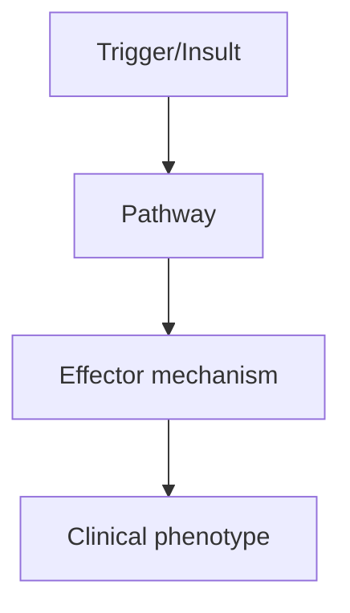
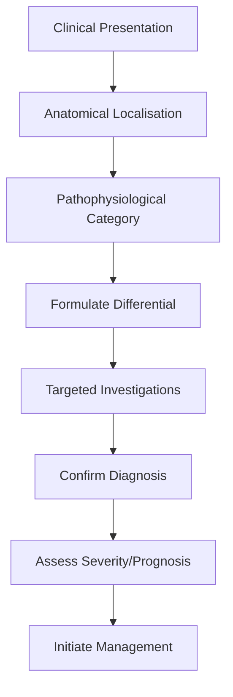
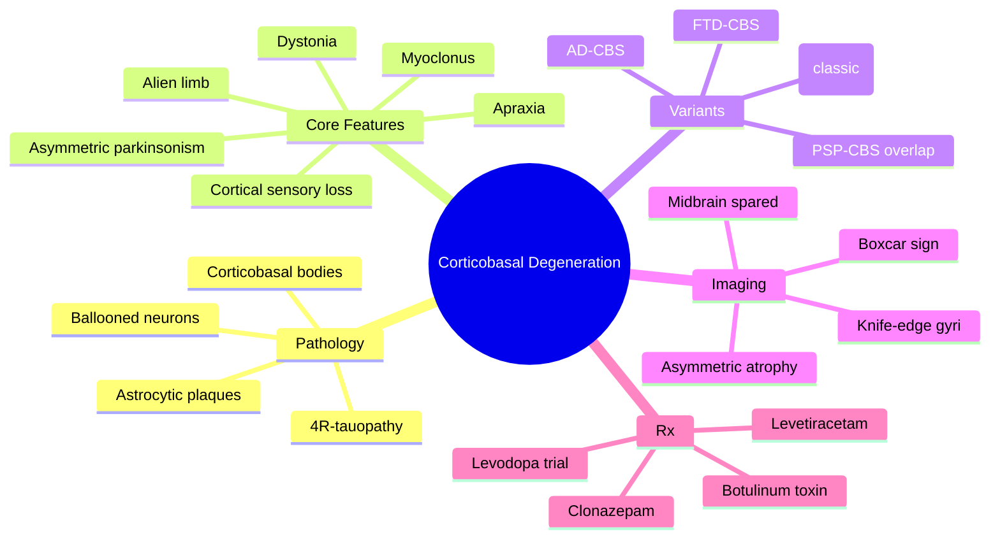

# Corticobasal Degeneration

> [!tip] **High-Yield Definition**
> Corticobasal degeneration (CBD): rare, progressive neurodegenerative tauopathy. Asymmetric parkinsonism, apraxia, cortical sensory loss, alien limb, myoclonus, dystonia. Poor levodopa response.

---

## 1. Definition / Epidemiology / Classification

### Definition
Corticobasal degeneration (CBD): rare, progressive neurodegenerative tauopathy. Asymmetric parkinsonism, apraxia, cortical sensory loss, alien limb, myoclonus, dystonia. Poor levodopa response.

### Epidemiology
Prevalence: 5-7/100,000. Age: 50-70y. Mean onset 63y. Rare <40y. PSP, CBD, FTD spectrum.

### Classification
| Variant | Key Features | Prognosis |
|---------|-------------|-----------|
| | | |

---

## 2. Aetiology / Pathophysiology

### Aetiology
Tauopathy (4R tau predominant) - neuronal and glial inclusions (astrocytic plaques, threads, neuronal inclusions). Cortical and striatal degeneration (asymmetric, frontoparietal, basal ganglia). Genetic: MAPT (tau) mutations (rare), LRRK2, GRN.

### Pathophysiology

---

## 3. Clinical Features

### History
- **Onset/Duration:**
- **Progression:**
- **Key symptoms:**
- **Triggers:**
- **Systemic symptoms:**
- **Drug/Family/Social history:**

### Examination
| Domain | Key Findings | Localisation Value |
|--------|-------------|-------------------|
| | | |

### Specific Clinical Features
Asymmetric parkinsonism: rigidity, bradykinesia, dystonia (often focal, arm), myoclonus (stimulus-sensitive, distal). Cortical signs: apraxia (ideomotor, ideational, limb-kinetic, alien limb), cortical sensory loss (astereognosis, agraphaesthesia, 2-point discrimination), alien limb phenomenon (involuntary movements, personification of limb). Cognitive: aphasia (progressive, non-fluent, apraxia of speech), executive dysfunction, behavioural change. Eye movements: saccadic apraxia, supranuclear gaze palsy (mimics PSP). Myoclonus, dystonia, tremor (irregular, postural, action).

---

## 4. Diagnostic Approach / Algorithm

---

## 5. Investigations

MRI brain: asymmetric atrophy (frontoparietal, especially posterior frontal, parietal, contralateral to symptoms), 'knife edge' or 'boxcar' gyral atrophy, midbrain preserved (unlike PSP). FDG-PET: asymmetric cortical hypometabolism (frontoparietal, basal ganglia). DaT-SPECT: asymmetric reduced uptake. CSF: tau elevated, beta-amyloid normal (AD-negative). MDS-PSP criteria: probable CBD (clinicoradiologic).

---

## 6. Differential Diagnosis

| Differential | Distinguishing Features | Key Test |
|--------------|------------------------|----------|
| | | |

---

## 7. Management

Levodopa: trial (often poor response, 30% mild benefit). Botulinum toxin: focal dystonia, limb dystonia. Clonazepam, levetiracetam, valproate, topiramate: myoclonus (variable benefit). Speech and language therapy: apraxia of speech, dysarthria, dysphagia. Occupational therapy: apraxia, alien limb. Physiotherapy: falls, dystonia, contractures. Multidisciplinary: palliative, social, OT, neuropsychology. Experimental: tau-targeting therapies, anti-tau antibodies.

---

## 8. Drug Interactions / Contraindications / Comorbidity Cautions

| Drug | Interaction / Caution | Management |
|------|----------------------|------------|
| | | |

---

## 9. Procedures (if applicable)

### Procedure:
- **Indications:**
- **Contraindications:**
- **Preparation / Principle:**
- **Complications:**
- **Viva Pearls:**

---

## 10. Complications

| Complication | Frequency | Prevention / Monitoring | Management |
|--------------|-----------|------------------------|------------|
| | | | |

---

## 11. Red Flags / Emergencies

Falls, aspiration, contractures, fractures, dementia, alien limb injuries, behavioural change.

---

## 12. Prognosis

Poor. Median survival 5-8 years from onset. Progressive disability, falls, dysphagia, aspiration, dementia. Death: pneumonia, aspiration, sepsis, falls. No disease-modifying therapy.

---

## 13. Topic Correlation

| Related Topic | Link | Key Overlap |
|---------------|------|-------------|
| | | |

---

## 14. Special Situations

| Situation | Consideration |
|-----------|---------------|
| **Pregnancy** | |
| **Lactation** | |
| **Paediatric** | |
| **Elderly / Frail** | |
| **Renal impairment** | |
| **Hepatic impairment** | |
| **Immunocompromised** | |
| **Perioperative** | |
| **Driving / DVLA** | |
| **Occupational** | |

---

## FCPS/MRCP High-Yield Summary

| Category | Key Points |
|----------|------------|
| **Definition** | Corticobasal degeneration (CBD): rare, progressive neurodegenerative tauopathy. Asymmetric parkinsonism, apraxia, cortical sensory loss, alien limb, myoclonus, dystonia. Poor levodopa response. |
| **Epidemiology** | Prevalence: 5-7/100,000. Age: 50-70y. Mean onset 63y. Rare <40y. PSP, CBD, FTD spectrum. |
| **Pathophysiology** | |
| **Clinical** | Asymmetric parkinsonism: rigidity, bradykinesia, dystonia (often focal, arm), myoclonus (stimulus-sensitive, distal). Cortical signs: apraxia (ideomotor, ideational, limb-kinetic, alien limb), cortica |
| **Diagnosis** | |
| **Investigations** | MRI brain: asymmetric atrophy (frontoparietal, especially posterior frontal, parietal, contralateral to symptoms), 'knife edge' or 'boxcar' gyral atrophy, midbrain preserved (unlike PSP). FDG-PET: asy |
| **Management** | Levodopa: trial (often poor response, 30% mild benefit). Botulinum toxin: focal dystonia, limb dystonia. Clonazepam, levetiracetam, valproate, topiramate: myoclonus (variable benefit). Speech and lang |
| **Complications** | |
| **Prognosis** | Poor. Median survival 5-8 years from onset. Progressive disability, falls, dysphagia, aspiration, dementia. Death: pneumonia, aspiration, sepsis, falls. No disease-modifying therapy. |
| **Viva Pearls** | |
| **Drug Doses** | |
| **Scoring Systems** | |
| **Genetics** | |
| **Imaging Signs** | |

---

## Viva Questions (PACES/FCPS Style)

1. **Q:** Define Corticobasal Degeneration and classify its variants.
   **A:** Based on the definition above.

2. **Q:** What are the key clinical features?
   **A:** Asymmetric parkinsonism: rigidity, bradykinesia, dystonia (often focal, arm), myoclonus (stimulus-sensitive, distal). Cortical signs: apraxia (ideomotor, ideational, limb-kinetic, alien limb), cortical sensory loss (astereognosis, agraphaesthesia, 2-point discrimination), alien limb phenomenon (invo

3. **Q:** What is the first-line treatment?
   **A:** Based on the management section.

4. **Q:** What are the red flags requiring urgent referral?
   **A:** Falls, aspiration, contractures, fractures, dementia, alien limb injuries, behavioural change.

5. **Q:** What is the prognosis?
   **A:** Poor. Median survival 5-8 years from onset. Progressive disability, falls, dysphagia, aspiration, dementia. Death: pneumonia, aspiration, sepsis, falls. No disease-modifying therapy.

6. **Q:** How do you differentiate Corticobasal Degeneration from key differentials?
   **A:** Clinical features, investigations, and response to treatment.

7. **Q:** What investigations are most useful?
   **A:** Based on the investigations section.

8. **Q:** Describe the stepwise management approach.
   **A:** Based on the management algorithm.

9. **Q:** What are the emergency presentations?
   **A:** Based on the red flags section.

10. **Q:** How does management change in pregnancy/paediatrics/elderly?
    **A:** Special considerations per population.

---

## Common Confusions / Exam Traps

| Confusion | Clarification |
|-----------|---------------|
| | |

---

## Mnemonics

- **CORTICAL** — **C**ortical signs + **O**ne-sided rigidity + **R**eflex myoclonus + **T**auopathy + **I**deomotor apraxia + **C**ortical sensory loss + **A**lien limb + **L**evodopa-resistant (**CORTICAL**) - use: clinical Dx
- **ALien LIMB** — **A**symmetric, **L**evodopa-poor, **I**deomotor apraxia, **EN**larged parietal sulcus, **LIMB** myoclonus (**ALien LIMB**) - use: clinical
- **TAU-CBD** — **T**auopathy **A**symmetric **U**nilateral (parkinsonism + apraxia) — **C**ortical sensory loss + **B**oxcar atrophy + **D**ystonia (**TAU-CBD**) - use: pathology+imaging

---

## Mind Map

---

## Spaced Repetition Trackers

| Day | Topic to Revise |
|-----|-----------------|
| Day 1 | Definition + tau pathology + 4 core features |
| Day 3 | Cortical signs: apraxia, alien limb, cortical sensory loss |
| Day 7 | Imaging: asymmetric atrophy, knife-edge/boxcar sign, DAT-SPECT |
| Day 14 | Differential: PSP, PD, AD, FTD-tau; poor levodopa response |
| Day 30 | Management: levodopa trial, botulinum toxin, myoclonus Rx, supportive |
| Day 90 | Prognosis, multidisciplinary care, FCPS/MRCP viva questions |

---

## Self-Test Scorecard

| Section | Score |
|---------|-------|
| 1. Definition & Pathology | ___/5 |
| 2. Epidemiology | ___/5 |
| 3. Clinical Features | ___/5 |
| 4. Variants & Overlap Syndromes | ___/5 |
| 5. Imaging & Investigations | ___/5 |
| 6. Diagnostic Criteria | ___/5 |
| 7. Differential Diagnosis | ___/5 |
| 8. Management | ___/5 |
| 9. Complications & Prognosis | ___/5 |
| 10. Viva Pearls & High-Yield | ___/5 |

**Total: ___/50**

---

## MCQs (10)

1. **Question:** Which of the following is the MOST characteristic clinical feature of corticobasal degeneration?
   **Options:** A. Resting tremor B. Asymmetric apraxia with alien limb phenomenon C. Symmetric bradykinesia responsive to levodopa D. Supranuclear gaze palsy
   **Answer:** B
   **Explanation:** Asymmetric apraxia (ideomotor, ideational, limb-kinetic) and alien limb phenomenon are the hallmark cortical features that distinguish CBD from idiopathic PD and PSP. PD responds to levodopa; PSP features vertical supranuclear gaze palsy.

2. **Question:** The pathological hallmark of corticobasal degeneration is:
   **Options:** A. Lewy bodies with α-synuclein B. 4R-tau accumulation with astrocytic plaques and ballooned neurons C. Prion protein deposition D. TDP-43 inclusions
   **Answer:** B
   **Explanation:** CBD is a 4-repeat (4R) tauopathy with widespread tau-positive neuronal and glial inclusions, including astrocytic plaques, and ballooned (achromatic) neurons. α-synuclein = PD/DLB; TDP-43 = FTLD-TDP; prion = CJD.

3. **Question:** A patient with CBD typically shows which MRI finding?
   **Options:** A. Midbrain atrophy with hummingbird sign B. Asymmetric posterior frontal and parietal cortical atrophy C. Hot-cross-bun sign in pons D. Cerebellar atrophy
   **Answer:** B
   **Explanation:** MRI in CBD shows asymmetric atrophy of the posterior frontal, parietal and superior temporal cortex contralateral to the more affected side, sometimes with a 'knife-edge' or 'boxcar' gyral pattern. Midbrain is preserved (vs PSP).

4. **Question:** Response to levodopa in corticobasal degeneration is usually:
   **Options:** A. Excellent and sustained B. Poor or absent despite adequate trial C. Excellent but causes dyskinesias D. Only effective for tremor
   **Answer:** B
   **Explanation:** CBD characteristically shows poor or no response to levodopa, which is one of the features differentiating it from idiopathic PD. A levodopa trial is still warranted but expectations should be modest.

5. **Question:** Alien limb phenomenon in CBD most commonly affects the:
   **Options:** A. Leg B. Arm/hand (especially the more apraxic limb) C. Face and tongue D. Trunk
   **Answer:** B
   **Explanation:** The alien limb phenomenon in CBD is most often seen in the arm/hand of the more affected side, with the limb performing semi-purposeful or antagonistic movements the patient cannot control.

6. **Question:** Cortical sensory loss in CBD includes all EXCEPT:
   **Options:** A. Astereognosis B. Agraphaesthesia C. Reduced two-point discrimination D. Loss of vibration sense from peripheral neuropathy
   **Answer:** D
   **Explanation:** Cortical sensory loss is a HIGHER-order sensory deficit: astereognosis, agraphaesthesia, poor two-point discrimination, and sensory extinction. Loss of vibration sense is a primary sensory (dorsal column) deficit, NOT cortical.

7. **Question:** Myoclonus in corticobasal degeneration is best described as:
   **Options:** A. Generalised, sleep-sensitive, with giant SEPs B. Stimulus-sensitive, distal, focal, reflex C. Action-induced and always generalised D. Absent
   **Answer:** B
   **Explanation:** Myoclonus in CBD is typically stimulus-sensitive (reflex), focal, distal, affecting the more affected upper limb, and may be exaggerated by action. Giant SEPs may be seen on neurophysiology.

8. **Question:** Differential diagnosis of corticobasal syndrome includes all EXCEPT:
   **Options:** A. Progressive supranuclear palsy (PSP) B. Idiopathic Parkinson's disease C. Frontotemporal dementia D. Multiple system atrophy (MSA)
   **Answer:** D
   **Explanation:** The classic differentials of corticobasal SYNDROME are PSP, PD, FTLD, AD (atypical/posterior cortical), and stroke. MSA usually presents with autonomic failure and cerebellar/pyramidal signs, not the cortical features of CBS.

9. **Question:** Apraxia in CBD is BEST described as:
   **Options:** A. Inability to perform learned movements despite intact motor, sensory and comprehension B. Loss of voluntary movement due to weakness C. Incoordination from cerebellar lesion D. Loss of automatic reflex activity
   **Answer:** A
   **Explanation:** Apraxia is the inability to execute a learned, purposeful movement despite intact motor strength, sensation, coordination, and comprehension. In CBD, ideomotor, ideational and limb-kinetic apraxias are characteristic.

10. **Question:** Which of the following imaging signs is seen in PSP but NOT in CBD?
   **Options:** A. Hummingbird / penguin sign (midbrain atrophy) B. Knife-edge gyral atrophy C. Asymmetric frontoparietal atrophy D. Cortical hyperintensity on DWI
   **Answer:** A
   **Explanation:** Midbrain atrophy with the hummingbird (Mickey Mouse / penguin) sign is a hallmark of PSP, not CBD. CBD typically spares the midbrain and shows asymmetric cortical atrophy.

---

## SBA Questions (10)

1. **Scenario:** A 64-year-old woman presents with 18 months of progressive clumsiness, rigidity and loss of use of her right hand. Examination shows marked asymmetric bradykinesia, stimulus-sensitive myoclonus, and a right arm that 'drifts' and performs semi-purposeful movements against her will.
   **Question:** The MOST likely diagnosis is:
   **Options:** A. Idiopathic Parkinson's disease B. Multiple system atrophy (MSA-P) C. Corticobasal degeneration D. Essential tremor
   **Answer:** C
   **Explanation:** The combination of asymmetric parkinsonism, stimulus-sensitive myoclonus, and alien limb phenomenon is classic for corticobasal degeneration (CBS).

2. **Scenario:** A 60-year-old man has a 2-year history of asymmetric parkinsonism with apraxia and alien limb. His levodopa dose has been titrated to 1000 mg/day with no clinical improvement.
   **Question:** What is the next BEST step?
   **Options:** A. Increase levodopa further to 1500 mg/day B. Add bromocriptine C. Add botulinum toxin for focal dystonia and consider levetiracetam for myoclonus D. Commence haloperidol
   **Answer:** C
   **Explanation:** Levodopa non-response confirms clinical suspicion. Management is supportive: botulinum toxin for focal dystonia, levetiracetam/clonazepam for myoclonus, and physiotherapy/occupational therapy. Haloperidol would worsen parkinsonism.

3. **Scenario:** MRI brain of a 62-year-old with asymmetric parkinsonism shows asymmetric posterior frontal and parietal atrophy with 'knife-edge' gyri and PRESERVED midbrain.
   **Question:** The diagnosis is MOST consistent with:
   **Options:** A. Progressive supranuclear palsy B. Multiple system atrophy C. Corticobasal degeneration D. Dementia with Lewy bodies
   **Answer:** C
   **Explanation:** Asymmetric cortical atrophy with preserved midbrain is classic for CBD. PSP would show hummingbird sign; MSA shows pontocerebellar atrophy or hot-cross-bun sign; DLB has minimal cortical atrophy.

4. **Scenario:** A 58-year-old presents with alien limb in the right arm. Examination reveals inability to perform learned hand gestures despite intact strength.
   **Question:** What is the BEST description of the deficit?
   **Options:** A. Limb-kinetic apraxia B. Cerebellar ataxia C. Sensory ataxia D. Pyramidal weakness
   **Answer:** A
   **Explanation:** Limb-kinetic apraxia is loss of fine finger dexterity, characteristic of CBD. It is distinguished from ideomotor apraxia by the inability to use the hand for fine learned movements even when the gesture is imitated.

5. **Scenario:** A patient with CBD is reviewed in clinic. Family asks about prognosis.
   **Question:** What is the MOST appropriate answer regarding median survival?
   **Options:** A. More than 15 years B. 5–8 years from symptom onset C. 1–2 years D. Normal life expectancy
   **Answer:** B
   **Explanation:** Median survival in CBD is 5–8 years from onset. Death is usually due to aspiration pneumonia, falls with fractures, sepsis, or inanition.

6. **Scenario:** A 55-year-old man with asymmetric parkinsonism and apraxia develops stimulus-sensitive myoclonus. EEG shows no cortical correlate.
   **Question:** Which drug is MOST appropriate?
   **Options:** A. Levetiracetam B. Haloperidol C. Sodium valproate (consider) D. L-DOPA in higher dose
   **Answer:** A
   **Explanation:** Levetiracetam is first-line for cortical reflex myoclonus in CBD. It is usually well tolerated. Valproate and clonazepam are alternatives. Haloperidol is contraindicated.

7. **Scenario:** Pathology of CBD brain shows widespread tau-positive inclusions in neurons and glia, with ballooned (achromatic) neurons and astrocytic plaques.
   **Question:** What is the underlying protein abnormality?
   **Options:** A. α-synuclein B. 4-repeat tau isoform (4R-tau) C. TDP-43 D. Amyloid β
   **Answer:** B
   **Explanation:** CBD is a 4R-tauopathy. Both 4R-tau isoforms accumulate in neurons, glia and astrocytes producing astrocytic plaques, the pathological signature of CBD. PSP is also 4R-tau; PD/DLB are synucleinopathies; AD has 3R+4R tau.

8. **Scenario:** A patient with CBD presents with painful fixed flexion of the right wrist and fingers.
   **Question:** The BEST treatment is:
   **Options:** A. Oral baclofen B. Botulinum toxin injection C. Intrathecal baclofen D. Deep brain stimulation
   **Answer:** B
   **Explanation:** Focal dystonia in CBD is best managed with botulinum toxin injection. Oral anticholinergics or baclofen may help but systemic side effects limit use. DBS is not effective in CBD.

9. **Scenario:** A 70-year-old with CBD is admitted with recurrent aspiration pneumonia.
   **Question:** Which investigation is MOST appropriate to guide management?
   **Options:** A. Repeat MRI brain B. Videofluoroscopic swallowing study (VFSS) C. Lumbar puncture D. EEG
   **Answer:** B
   **Explanation:** VFSS assesses swallowing safety, identifies aspiration risk, and guides diet modification and feeding decisions. Aspiration pneumonia is the most common terminal event in CBD.

10. **Scenario:** Examination of a CBD patient shows inability to identify an object placed in the hand with eyes closed, despite intact primary sensation.
   **Question:** This finding is termed:
   **Options:** A. Astereognosis B. Anosognosia C. Asomatognosia D. Aphasia
   **Answer:** A
   **Explanation:** Astereognosis is the inability to identify an object by touch alone, with eyes closed, in the presence of intact primary sensation. It is a CORITICAL sensory sign, classic for CBD.

---

## Tags

#neurology #movement-disorders #parkinsonism #corticobasal-degeneration #tauopathy #alien-limb #apraxia #FCPS #MRCP

## Local Navigation
**Heading Hub:** [[../Hub]]  
**Chapter Hierarchy:** [[Davidson Chapter 25 - Neurology Hierarchy]]  
**Chapter MOC:** [[Neurology MOC]]  
**Drug Reference:** [[../00_Index/Neurology Drug Reference]]  
