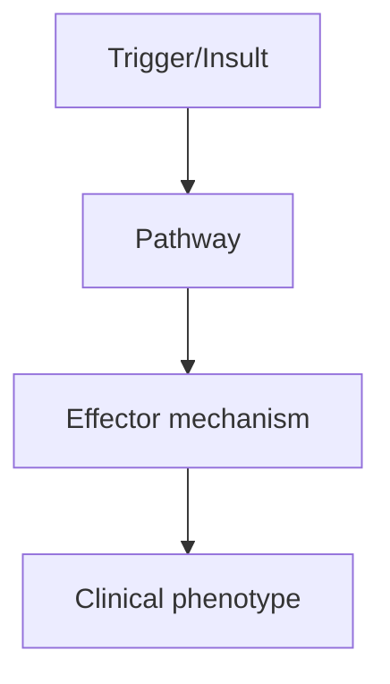
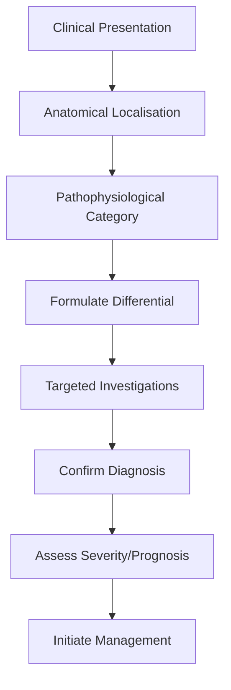
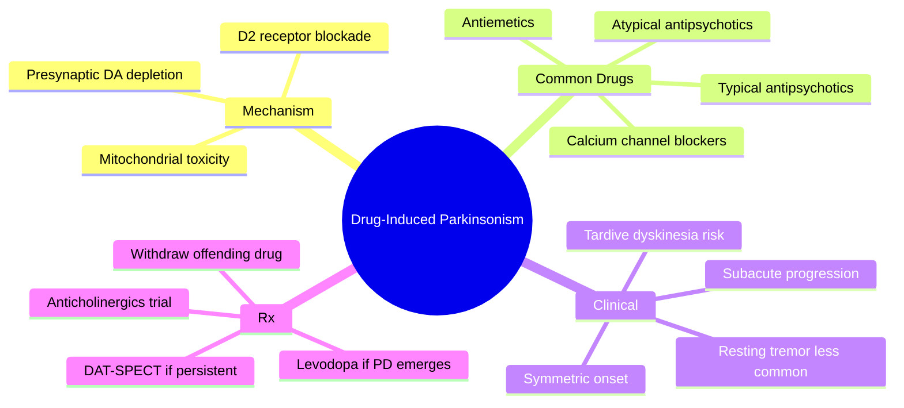

# Drug-Induced Parkinsonism

> [!tip] **High-Yield Definition**
> Drug-induced parkinsonism (DIP): parkinsonism caused by medications, most commonly dopamine receptor blockers (antipsychotics, antiemetics). Second most common cause of parkinsonism after idiopathic PD.

---

## 1. Definition / Epidemiology / Classification

### Definition
Drug-induced parkinsonism (DIP): parkinsonism caused by medications, most commonly dopamine receptor blockers (antipsychotics, antiemetics). Second most common cause of parkinsonism after idiopathic PD.

### Epidemiology
Prevalence: 1.7/100,000. 20-40% of patients on typical antipsychotics. 15-30% on atypical antipsychotics (lower). Antiemetics (metoclopramide, prochlorperazine), calcium channel blockers (cinnarizine, flunarizine), lithium, valproate, amiodarone (rare).

### Classification
| Variant | Key Features | Prognosis |
|---------|-------------|-----------|
| | | |

---

## 2. Aetiology / Pathophysiology

### Aetiology
Dopamine D2 receptor blockade in striatum. Typical antipsychotics (haloperidol, chlorpromazine, fluphenazine): high risk. Atypical (risperidone, olanzapine, quetiapine, clozapine - lowest risk). Antiemetics: metoclopramide, prochlorperazine, domperidone (peripheral only - low risk). Calcium channel blockers: cinnarizine, flunarizine. Mood stabilisers: lithium, valproate. Other: methyldopa, reserpine, tetrabenazine, alpha-methyldopa, amiodarone.

### Pathophysiology

---

## 3. Clinical Features

### History
- **Onset/Duration:**
- **Progression:**
- **Key symptoms:**
- **Triggers:**
- **Systemic symptoms:**
- **Drug/Family/Social history:**

### Examination
| Domain | Key Findings | Localisation Value |
|--------|-------------|-------------------|
| | | |

### Specific Clinical Features
Symmetric parkinsonism (vs asymmetric in PD), often with rapid onset (weeks-months after drug). Tremor (postural, symmetric), rigidity, bradykinesia, gait disturbance. Often with: akathisia (restlessness, common), tardive dyskinesia (after withdrawal, orofacial dyskinesia, dystonia), acute dystonic reaction (hours-days, sustained muscle contraction, oculogyric crisis, torticollis). Risk factors: older age, female, pre-existing PD, cognitive impairment, dose, potency.

---

## 4. Diagnostic Approach / Algorithm

---

## 5. Investigations

Clinical diagnosis. Drug history critical. DaT-SPECT: NORMAL (vs reduced in PD, PSP, MSA - distinguishes DIP from neurodegenerative parkinsonism). MRI brain: usually normal (excludes structural). Trial of withdrawal: improvement over weeks-months confirms DIP. Timing: DIP usually within weeks-months of starting drug (vs PD progressing over years).

---

## 6. Differential Diagnosis

| Differential | Distinguishing Features | Key Test |
|--------------|------------------------|----------|
| | | |

---

## 7. Management

Withdrawal of offending drug (if possible). Switch to lower-potency or alternative (e.g., quetiapine, clozapine for psychosis; domperidone for nausea). Improvement: gradual, weeks-months (can take 6-12 months). Symptoms may persist in 10-30% (especially elderly, underlying PD). Levodopa: trial (modest benefit in some). Anticholinergics: limited (central side effects). Amantadine: some benefit. Acute dystonic reaction: procyclidine 5-10mg IV/IM, benzatropine. Tardive dyskinesia: VMAT2 inhibitors (valbenazine, deutetrabenazine), tetrabenazine (worsens parkinsonism), amantadine, switch to clozapine. Prevention: avoid dopamine blockers if possible, use lowest dose, monitor.

---

## 8. Drug Interactions / Contraindications / Comorbidity Cautions

| Drug | Interaction / Caution | Management |
|------|----------------------|------------|
| | | |

---

## 9. Procedures (if applicable)

### Procedure:
- **Indications:**
- **Contraindications:**
- **Preparation / Principle:**
- **Complications:**
- **Viva Pearls:**

---

## 10. Complications

| Complication | Frequency | Prevention / Monitoring | Management |
|--------------|-----------|------------------------|------------|
| | | | |

---

## 11. Red Flags / Emergencies

Neuroleptic malignant syndrome (NMS - hyperthermia, rigidity, autonomic dysfunction, altered mental status, high CK - emergency, stop drug, supportive, dantrolene, bromocriptine, ECT). Acute dystonic reaction: oculogyric crisis, laryngospasm (airway emergency). Tardive dyskinesia: persistent, often irreversible. Withdrawal emergent syndrome: rebound psychosis, dyskinesia, autonomic.

---

## 12. Prognosis

Usually resolves with drug withdrawal. 10-30% persistent (especially elderly, long exposure, underlying PD). Tardive dyskinesia: often persistent. NMS: 10-20% mortality (modern supportive care).

---

## 13. Topic Correlation

| Related Topic | Link | Key Overlap |
|---------------|------|-------------|
| | | |

---

## 14. Special Situations

| Situation | Consideration |
|-----------|---------------|
| **Pregnancy** | |
| **Lactation** | |
| **Paediatric** | |
| **Elderly / Frail** | |
| **Renal impairment** | |
| **Hepatic impairment** | |
| **Immunocompromised** | |
| **Perioperative** | |
| **Driving / DVLA** | |
| **Occupational** | |

---

## FCPS/MRCP High-Yield Summary

| Category | Key Points |
|----------|------------|
| **Definition** | Drug-induced parkinsonism (DIP): parkinsonism caused by medications, most commonly dopamine receptor blockers (antipsychotics, antiemetics). Second most common cause of parkinsonism after idiopathic P |
| **Epidemiology** | Prevalence: 1.7/100,000. 20-40% of patients on typical antipsychotics. 15-30% on atypical antipsychotics (lower). Antiemetics (metoclopramide, prochlo |
| **Pathophysiology** | |
| **Clinical** | Symmetric parkinsonism (vs asymmetric in PD), often with rapid onset (weeks-months after drug). Tremor (postural, symmetric), rigidity, bradykinesia, gait disturbance. Often with: akathisia (restlessn |
| **Diagnosis** | |
| **Investigations** | Clinical diagnosis. Drug history critical. DaT-SPECT: NORMAL (vs reduced in PD, PSP, MSA - distinguishes DIP from neurodegenerative parkinsonism). MRI brain: usually normal (excludes structural). Tria |
| **Management** | Withdrawal of offending drug (if possible). Switch to lower-potency or alternative (e.g., quetiapine, clozapine for psychosis; domperidone for nausea). Improvement: gradual, weeks-months (can take 6-1 |
| **Complications** | |
| **Prognosis** | Usually resolves with drug withdrawal. 10-30% persistent (especially elderly, long exposure, underlying PD). Tardive dyskinesia: often persistent. NMS: 10-20% mortality (modern supportive care). |
| **Viva Pearls** | |
| **Drug Doses** | |
| **Scoring Systems** | |
| **Genetics** | |
| **Imaging Signs** | |

---

## Viva Questions (PACES/FCPS Style)

1. **Q:** Define Drug-Induced Parkinsonism and classify its variants.
   **A:** Based on the definition above.

2. **Q:** What are the key clinical features?
   **A:** Symmetric parkinsonism (vs asymmetric in PD), often with rapid onset (weeks-months after drug). Tremor (postural, symmetric), rigidity, bradykinesia, gait disturbance. Often with: akathisia (restlessness, common), tardive dyskinesia (after withdrawal, orofacial dyskinesia, dystonia), acute dystonic 

3. **Q:** What is the first-line treatment?
   **A:** Based on the management section.

4. **Q:** What are the red flags requiring urgent referral?
   **A:** Neuroleptic malignant syndrome (NMS - hyperthermia, rigidity, autonomic dysfunction, altered mental status, high CK - emergency, stop drug, supportive, dantrolene, bromocriptine, ECT). Acute dystonic reaction: oculogyric crisis, laryngospasm (airway emergency). Tardive dyskinesia: persistent, often 

5. **Q:** What is the prognosis?
   **A:** Usually resolves with drug withdrawal. 10-30% persistent (especially elderly, long exposure, underlying PD). Tardive dyskinesia: often persistent. NMS: 10-20% mortality (modern supportive care).

6. **Q:** How do you differentiate Drug-Induced Parkinsonism from key differentials?
   **A:** Clinical features, investigations, and response to treatment.

7. **Q:** What investigations are most useful?
   **A:** Based on the investigations section.

8. **Q:** Describe the stepwise management approach.
   **A:** Based on the management algorithm.

9. **Q:** What are the emergency presentations?
   **A:** Based on the red flags section.

10. **Q:** How does management change in pregnancy/paediatrics/elderly?
    **A:** Special considerations per population.

---

## Common Confusions / Exam Traps

| Confusion | Clarification |
|-----------|---------------|
| | |

---

## Mnemonics

- **DIPS** — **D**opamine **I**nhibition by **P**harmaceuticals (antipsychotics, antiemetics) → **S**ymmetrical, **S**ubacute (**DIPS**) - use: clinical features
- **MAcRO** — **M**etoclopramide + **A**ntipsychotics (typical>atypical) + **c**alcium (channel blockers) + **R**eserpine + tet**O**uride (**MAcRO**) - use: causative drugs
- **STOP IT** — **S**top offending drug → **T**rial anticholinergic (trihexyphenidyl) → **O**bserve for months → **P**arkinson's if persists >6 months → **I**nvestigate (DAT-SPECT) → **T**ransition to PD Rx (**STOP IT**) - use: management

---

## Mind Map

---

## Spaced Repetition Trackers

| Day | Topic to Revise |
|-----|-----------------|
| Day 1 | Definition + D2 blockade mechanism + common drug classes |
| Day 3 | Causative drugs: typical > atypical antipsychotics, metoclopramide, prochlorperazine, cinnarizine |
| Day 7 | Clinical features: subacute, symmetric, often less tremor, akathisia, dyskinesia |
| Day 14 | Tardive dyskinesia vs parkinsonism; withdrawal emergent syndrome |
| Day 30 | Management: stop drug, anticholinergics, DAT-SPECT if >6 months |
| Day 90 | Manganese, lithium, valproate, prognostic outcomes, FCPS/MRCP viva questions |

---

## Self-Test Scorecard

| Section | Score |
|---------|-------|
| 1. Definition & Pathophysiology | ___/5 |
| 2. Epidemiology | ___/5 |
| 3. Causative Drugs | ___/5 |
| 4. Clinical Features | ___/5 |
| 5. Tardive Syndromes | ___/5 |
| 6. Differential Diagnosis | ___/5 |
| 7. Investigations | ___/5 |
| 8. Management | ___/5 |
| 9. Special Populations (Elderly, Manganese) | ___/5 |
| 10. Prognosis & Viva Pearls | ___/5 |

**Total: ___/50**

---

## MCQs (10)

1. **Question:** Drug-induced parkinsonism is MOST commonly caused by:
   **Options:** A. Selective serotonin reuptake inhibitors B. Dopamine D2 receptor blocking drugs (antipsychotics and antiemetics) C. Beta-blockers D. Statins
   **Answer:** B
   **Explanation:** DIP is caused by dopamine D2 receptor blockade in the nigrostriatal pathway. The most common culprits are typical antipsychotics (haloperidol, chlorpromazine), atypical antipsychotics (risperidone, olanzapine), and antiemetics (metoclopramide, prochlorperazine).

2. **Question:** Which of the following antiemetics is most likely to cause parkinsonism?
   **Options:** A. Ondansetron B. Metoclopramide C. Domperidone D. Granisetron
   **Answer:** B
   **Explanation:** Metoclopramide is a D2 receptor antagonist and a well-recognised cause of parkinsonism and tardive dyskinesia. Domperidone does NOT cross the BBB and is therefore less likely to cause parkinsonism. Ondansetron and granisetron are 5-HT3 antagonists and do not block D2.

3. **Question:** Compared to idiopathic Parkinson's disease, drug-induced parkinsonism is typically:
   **Options:** A. Asymmetric, with prominent tremor and good levodopa response B. Symmetric, with less tremor and poor levodopa response C. Always unilateral D. Marked by cogwheel rigidity only
   **Answer:** B
   **Explanation:** DIP is usually bilateral/symmetric, with bradykinesia and rigidity more prominent than tremor. There is generally no or poor levodopa response.

4. **Question:** Tardive dyskinesia in DIP:
   **Options:** A. Responds well to levodopa B. Is a late complication, often orofacial choreoathetoid movements C. Occurs only acutely D. Resolves immediately on drug withdrawal
   **Answer:** B
   **Explanation:** Tardive dyskinesia is a late complication of D2-blocking drugs, presenting as orofacial (lip smacking, tongue protrusion) or choreoathetoid movements. It may persist for months or years after drug withdrawal.

5. **Question:** If drug-induced parkinsonism persists for more than 6 months after withdrawal of the offending drug, the next step is:
   **Options:** A. Add levodopa B. DAT-SPECT to look for underlying Parkinson's disease C. Restart the offending drug at low dose D. Add tetrabenazine
   **Answer:** B
   **Explanation:** Persistence beyond 6 months after withdrawal suggests underlying idiopathic PD unmasked by the drug. DAT-SPECT is the investigation of choice to confirm presynaptic dopaminergic denervation.

6. **Question:** Which of the following drugs may UNMASK underlying Parkinson's disease?
   **Options:** A. Paracetamol B. Sodium valproate (occasionally) C. Metoclopramide D. Loratadine
   **Answer:** C
   **Explanation:** Metoclopramide and other D2 blockers can unmask pre-symptomatic PD by blocking already-compromised dopaminergic transmission. The same is true for some antipsychotics. Valproate and paracetamol are not implicated.

7. **Question:** Anticholinergic drugs (e.g. trihexyphenidyl) in DIP:
   **Options:** A. Are first-line for all DIP B. Can be tried for symptomatic relief, especially with akathisia or dystonia; AVOID in elderly C. Are contraindicated in DIP D. Replace levodopa
   **Answer:** B
   **Explanation:** Anticholinergics can be tried for symptomatic relief of DIP, but they are AVOIDED in the elderly due to cognitive side effects, urinary retention, and falls. They do not modify disease course.

8. **Question:** Which non-D2 drug is associated with parkinsonism?
   **Options:** A. Metoclopramide B. Cinnarizine C. Risperidone D. Haloperidol
   **Answer:** B
   **Explanation:** Cinnarizine (a calcium-channel blocker and antihistamine used for vertigo and migraine) is a recognised cause of parkinsonism, especially in older patients. It may act via mitochondrial complex I inhibition.

9. **Question:** Manganese toxicity causes parkinsonism primarily affecting the:
   **Options:** A. Substantia nigra B. Globus pallidus C. Caudate nucleus D. Cerebellum
   **Answer:** B
   **Explanation:** Manganese accumulates in the globus pallidus (basal ganglia), producing a parkinsonian syndrome with dystonia, 'cock-walk' gait, and T1 hyperintensity on MRI in the basal ganglia. Welding and mining are occupational risks.

10. **Question:** Reserpine and tetrabenazine cause parkinsonism by:
   **Options:** A. D2 receptor blockade B. VMAT2 inhibition and presynaptic dopamine depletion C. Dopamine agonists D. Direct nigral cell death
   **Answer:** B
   **Explanation:** Reserpine and tetrabenazine inhibit vesicular monoamine transporter 2 (VMAT2), depleting presynaptic dopamine and other monoamines. This produces drug-induced parkinsonism and is also used therapeutically in Huntington's.

---

## SBA Questions (10)

1. **Scenario:** A 65-year-old woman on haloperidol for agitation in dementia develops a shuffling gait, bilateral bradykinesia and a coarse resting tremor.
   **Question:** What is the MOST appropriate first step?
   **Options:** A. Add levodopa B. Withdraw haloperidol and consider quetiapine low-dose if antipsychotic needed C. Add trihexyphenidyl only D. Deep brain stimulation
   **Answer:** B
   **Explanation:** Haloperidol (a typical antipsychotic) is the most likely cause. Withdrawal of the offending drug is the priority. If antipsychotic therapy is essential, switch to a less D2-blocking agent like quetiapine or pimavanserin.

2. **Scenario:** A patient on metoclopramide for 4 months develops parkinsonism. The drug is stopped, but 8 months later parkinsonism persists.
   **Question:** What is the BEST next investigation?
   **Options:** A. Repeat MRI brain B. DAT-SPECT (DaTscan) C. CSF analysis D. EEG
   **Answer:** B
   **Explanation:** Persistence of parkinsonism >6 months after drug withdrawal suggests an underlying synucleinopathy (most commonly PD). DAT-SPECT will show reduced striatal uptake if PD is the cause.

3. **Scenario:** A 70-year-old on chronic metoclopramide develops lip smacking, tongue protrusion and choreoathetoid movements of the trunk.
   **Question:** What is the MOST likely diagnosis?
   **Options:** A. Acute dystonia B. Tardive dyskinesia C. Parkinsonian tremor D. Huntington's disease
   **Answer:** B
   **Explanation:** The combination of chronic D2 blockade and orofacial choreoathetoid movements is classic for tardive dyskinesia. The offending drug must be stopped, and tetrabenazine/valbenazine may be considered.

4. **Scenario:** A 35-year-old welder presents with parkinsonism, dystonia, and a cock-walk gait. MRI shows T1 hyperintensity in the globus pallidus.
   **Question:** What is the MOST likely cause?
   **Options:** A. Manganese toxicity B. Wilson's disease C. DOPA-responsive dystonia D. PSP
   **Answer:** A
   **Explanation:** Manganese toxicity (occupational exposure in welders and miners) causes a parkinsonian-dystonic syndrome with characteristic T1 hyperintensity in the globus pallidus. Chelation with EDTA may be tried.

5. **Scenario:** An elderly patient on metoclopramide is admitted with acute severe dystonia of the neck and jaw.
   **Question:** What is the BEST immediate treatment?
   **Options:** A. Oral levodopa B. IV procyclidine or benzatropine C. Haloperidol IM D. ECT
   **Answer:** B
   **Explanation:** Acute dystonia from D2 blockade is treated with IV/intramuscular anticholinergics (procyclidine, benzatropine) or benzodiazepines. The offending drug must be stopped.

6. **Scenario:** A 60-year-old on cinnarizine for vertigo develops parkinsonism. The drug is withdrawn, but symptoms persist after 1 year.
   **Question:** What is the NEXT step?
   **Options:** A. Restart cinnarizine B. DAT-SPECT and consider levodopa trial C. Add tetrabenazine D. Lithium
   **Answer:** B
   **Explanation:** Cinnarizine can cause both transient DIP and unmask underlying PD. Persistence beyond 6 months warrants DAT-SPECT and, if abnormal, a levodopa trial.

7. **Scenario:** A 25-year-old on lithium for bipolar disorder develops coarse tremor, rigidity and bradykinesia.
   **Question:** What is the BEST management?
   **Options:** A. Add levodopa B. Check lithium level and reduce dose C. Add haloperidol D. Stop lithium abruptly
   **Answer:** B
   **Explanation:** Lithium toxicity can cause parkinsonism. Serum lithium should be checked, and the dose reduced or stopped if toxic. Symptoms usually resolve over weeks.

8. **Scenario:** A patient with schizophrenia on long-term haloperidol develops orofacial dyskinesia.
   **Question:** Which is the MOST appropriate management?
   **Options:** A. Increase haloperidol B. Switch to clozapine or quetiapine; consider valbenazine C. Add levodopa D. ECT first line
   **Answer:** B
   **Explanation:** Switch to an antipsychotic with low D2 affinity (clozapine, quetiapine) and consider valbenazine or tetrabenazine for the dyskinesia. Increasing the offending drug worsens TD.

9. **Scenario:** A 78-year-old on risperidone develops parkinsonism. He has dementia and behavioural problems.
   **Question:** Which is the BEST strategy?
   **Options:** A. Continue risperidone B. Reduce dose, switch to quetiapine or pimavanserin C. Add levodopa high-dose D. Add haloperidol
   **Answer:** B
   **Explanation:** In elderly with dementia-related psychosis, the lowest effective dose of the least D2-blocking agent should be used. Quetiapine or pimavanserin are preferred. Always re-evaluate the need for antipsychotic.

10. **Scenario:** A 50-year-old on flunarizine for migraine prophylaxis develops parkinsonism and depression.
   **Question:** What is the BEST first step?
   **Options:** A. Add levodopa B. Stop flunarizine and substitute another migraine prophylaxis C. Add tetrabenazine D. ECT
   **Answer:** B
   **Explanation:** Flunarizine (a cinnarizine derivative and calcium-channel blocker) causes DIP and depression. Withdrawal is the first step; symptoms usually improve over weeks.

---

## Tags

#neurology #movement-disorders #parkinsonism #drug-induced #antipsychotics #metoclopramide #tardive-dyskinesia #FCPS #MRCP

## Local Navigation
**Heading Hub:** [[../Hub]]  
**Chapter Hierarchy:** [[Davidson Chapter 25 - Neurology Hierarchy]]  
**Chapter MOC:** [[Neurology MOC]]  
**Drug Reference:** [[../00_Index/Neurology Drug Reference]]  
