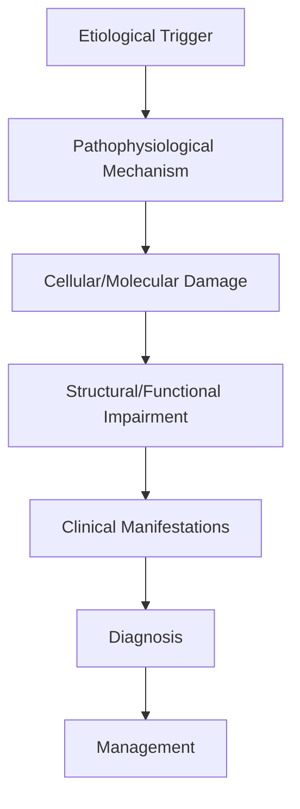
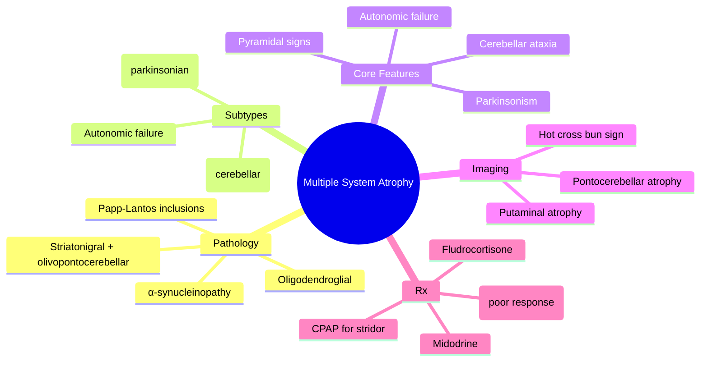

# Multiple System Atrophy

> [!tip] **High-Yield Definition**
> Comprehensive clinical note for Multiple System Atrophy covering definition, epidemiology, aetiology, pathophysiology, clinical features, investigations, differential diagnosis, management, drug interactions, procedures, complications, red flags, prognosis, topic correlation, and special situations for FCPS/MRCP examination preparation based on Davidson 24th Edition Chapter 25: Neurology.

---

## 1. Definition / Epidemiology / Classification

### Definition
Multiple System Atrophy is a neurological disorder within the 05 movement disorders category. It is characterised by specific clinical, pathological, radiological, and laboratory features that allow differentiation from related conditions.

### Epidemiology
- **Incidence/Prevalence:** Variable depending on the specific condition.
- **Age:** Adult onset is most common, but paediatric and elderly presentations occur.
- **Sex:** Variable depending on the condition.
- **Geography:** Worldwide distribution, with higher prevalence in certain regions.
- **Risk Factors:** Genetic predisposition, environmental factors, comorbidities, family history.

### Classification
| Subtype | Key Features | Prognosis |
|---------|-------------|-----------|
| Mild/early | Subtle symptoms, preserved function | Best |
| Moderate | Clear symptoms, functional impairment | Variable |
| Severe | Significant disability, complications | Worst |

---

## 2. Aetiology / Pathophysiology

### Aetiology
- **Primary (idiopathic):** Most cases have no identifiable cause.
- **Genetic:** May be inherited (AD, AR, X-linked, mitochondrial, sporadic).
- **Autoimmune:** Autoantibodies, immune-mediated inflammation.
- **Infectious:** Viral, bacterial, fungal, parasitic.
- **Metabolic:** Electrolyte, endocrine, hepatic, renal, nutritional.
- **Toxic:** Drugs, alcohol, heavy metals, environmental toxins.
- **Vascular:** Ischaemia, haemorrhage, vasculitis.
- **Neoplastic:** Primary, secondary, paraneoplastic.
- **Traumatic:** Acute, chronic, repetitive.
- **Degenerative:** Neurodegeneration, protein misfolding.

### Pathophysiology


---

## 3. Clinical Features

### History
- **Onset/Duration:** Acute, subacute, or chronic.
- **Progression:** Static, progressive, relapsing-remitting, stepwise.
- **Key symptoms:** Specific to the condition.
- **Triggers:** Stress, infection, trauma, drugs, hormonal, environmental.
- **Systemic symptoms:** Constitutional features.
- **Drug/Family/Social history:** Relevant exposures, comorbidities.

### Examination
| Domain | Key Findings | Localisation Value |
|--------|-------------|-------------------|
| Higher function | Cognitive, behavioural | Cortical, subcortical, limbic |
| Cranial nerves | Pupils, eye movements, facial, bulbar | Brainstem, cranial nerve, NMJ |
| Motor | Weakness, tone, reflexes | UMN, LMN, NMJ, muscle |
| Sensory | All modalities, pattern | Peripheral, spinal, brainstem |
| Coordination | Ataxia, nystagmus, dysmetria | Cerebellar, sensory, vestibular |
| Gait | Spastic, ataxic, parkinsonian | Multiple |
| Autonomic | Orthostatic, sweating, GI, bladder | Autonomic, peripheral, central |

### Specific Clinical Features
The clinical features are determined by the underlying aetiology, location of pathology, and rate of progression. Patients typically present with a constellation of symptoms and signs that allow clinical localisation and subsequent targeted investigation.

---

## 4. Diagnostic Approach / Algorithm

```mermaid
flowchart TD
    A[Clinical Presentation] --> B[Anatomical Localisation]
    B --> C[Pathophysiological Category]
    C --> D[Formulate Differential]
    D --> E[Targeted Investigations]
    E --> F[Confirm Diagnosis]
    F --> G[Assess Severity/Prognosis]
    G --> H[Initiate Management]
    H --> I[Monitor Response]
    I --> J{Response?}
    J --> YES1 [Good - Continue]
    J --> NO1 [Poor - Escalate]
    YES1 --> K[Monitor]
    NO1 --> H
```

---

## 5. Investigations

### First-Line Investigations
- **Blood tests:** FBC, U&Es, LFTs, glucose, calcium, magnesium, ESR, CRP, autoimmune, infection.
- **Imaging:** CT/MRI brain/spine (essential for most neurological conditions).
- **Neurophysiology:** EEG, nerve conduction, EMG, evoked potentials.
- **CSF:** Cell count, protein, glucose, OCBs, PCR, culture.

### Second-Line Investigations
- **Genetic testing:** Gene panels, WES, WGS.
- **Antibody testing:** Antineuronal, autoimmune, paraneoplastic.
- **Biopsy:** Nerve, muscle, brain, skin.
- **Advanced imaging:** PET-CT, MR spectroscopy, fMRI.

### Specialised Investigations
- **Biomarkers:** Neurofilament light chain, tau, beta-amyloid, 14-3-3, RT-QuIC.
- **Autonomic testing:** Head-up tilt, sudomotor, QSART.
- **Neuropsychology:** Cognitive testing, behavioural assessment.
- **Genetic counselling:** Family screening, predictive testing.

---

## 6. Differential Diagnosis

| Differential | Distinguishing Features | Key Test |
|--------------|------------------------|----------|
| Vascular | Sudden onset, focal, vascular risk factors | MRI/CT, vessel imaging |
| Inflammatory | Subacute, multifocal, systemic | MRI, CSF, antibodies |
| Infectious | Fever, systemic, exposure | Bloods, CSF, imaging |
| Neoplastic | Progressive, mass effect | MRI, biopsy |
| Degenerative | Progressive, symmetric, hereditary | MRI, genetic |
| Toxic/Metabolic | Drug history, systemic, reversible | Bloods, toxicology |
| Autoimmune | Multifocal, antibodies, immunotherapy response | Antibodies, MRI, CSF |
| Functional | Inconsistent, distractible | Clinical, video, biomarkers |

---

## 7. Management

### Acute Management
- **Stabilisation:** ABCDE approach, emergency resuscitation.
- **Specific treatment:** Disease-specific interventions.
- **Symptomatic relief:** Pain, seizures, spasticity, autonomic dysfunction.
- **Prevention of complications:** DVT, pressure sores, infection.

### Disease-Modifying Treatment
- **Pharmacological:** First-line, second-line, escalation, maintenance.
- **Procedural:** Surgery, biopsy, drainage, ablation, stimulation.
- **Immunotherapy:** Steroids, IVIG, plasma exchange, immunosuppressants, biologics.
- **Rehabilitation:** Physiotherapy, OT, speech therapy.

### Long-Term Management
- **Monitoring:** Clinical, imaging, biomarkers, side effects.
- **Prevention:** Vaccinations, prophylaxis, lifestyle modification.
- **Supportive care:** Multidisciplinary team, social work, psychological support.
- **Palliative care:** Advanced care planning, end-of-life care, hospice.

---

## 8. Drug Interactions / Contraindications / Comorbidity Cautions

| Drug Class | Interaction / Caution | Management |
|------------|----------------------|------------|
| Antiseizure medications | Enzyme induction, teratogenicity | Monitor, supplement, switch |
| Immunosuppressants | Infection, malignancy, teratogenicity | Monitor, prophylaxis |
| Anticoagulants | Bleeding risk, drug interactions | Monitor INR, avoid combinations |
| Antihypertensives | Hypotension, falls | Monitor BP, adjust dose |
| Antibiotics | Nephrotoxicity, ototoxicity | Monitor renal |
| Antivirals | Nephrotoxicity, neuropsychiatric | Monitor renal, dose adjust |
| Steroids | DM, HTN, osteoporosis, infection | Monitor, prophylaxis, taper |
| Biologics | Infusion reactions, infection | Monitor, prophylaxis |

---

## 9. Procedures

### Common Procedures
- **Lumbar puncture:** Diagnostic, therapeutic (IIH, NPH). Contraindications: raised ICP, mass lesion, coagulopathy.
- **Nerve conduction studies/EMG:** Diagnostic, prognosis. Minor discomfort.
- **EEG:** Diagnostic, monitoring. No significant complications.
- **MRI brain/spine:** Diagnostic, monitoring. Contraindications: pacemaker, metallic implants.
- **CT head:** Emergency, rapid. Radiation exposure, contrast reactions.
- **Biopsy:** Stereotactic, open. Indications: diagnosis, molecular profiling.

---

## 10. Complications

| Complication | Frequency | Prevention | Management |
|--------------|-----------|------------|------------|
| Infection | Common | Hygiene, prophylaxis, vaccination | Antibiotics, antifungals |
| Thrombosis | Common | Prophylaxis, mobility | Anticoagulation |
| Pressure sores | Common | Positioning, nutrition | Wound care, surgery |
| Spasticity | Common | Positioning, stretching | Baclofen, BoNT |
| Contractures | Common | Passive movements, splints | Physiotherapy, surgery |
| Aspiration | Common | Swallow assessment | NGT, PEG, thickeners |
| Falls | Common | Environment, mobility | Walking aids |
| Fractures | Common | Bone health, prevention | Vitamin D, bisphosphonate |
| Depression | Common | Screening, support | Antidepressants, CBT |
| Cognitive decline | Variable | Monitoring, training | Rehabilitation |
| Autonomic dysfunction | Variable | Monitoring, hydration | Midodrine, fludrocortisone |
| Respiratory failure | Variable | Monitoring, supportive | Ventilation, NIV |
| Death | Variable | Monitoring, palliative | End-of-life care |

---

## 11. Red Flags / Emergencies

### Emergency Presentations
- **Rapid neurological deterioration:** New focal deficit, decreased consciousness, seizures.
- **Status epilepticus:** Continuous seizures >5 min.
- **Raised ICP:** Headache, vomiting, papilloedema, altered consciousness.
- **Respiratory failure:** Hypoxia, hypercapnia, ventilatory failure.
- **Cardiac arrest:** Arrhythmia, MI, pulmonary embolism.
- **Infection:** Sepsis, meningitis, abscess, encephalitis.
- **Drug toxicity:** Overdose, side effects, interactions.
- **Haemorrhage:** Intracranial, systemic, coagulopathy.

---

## 12. Prognosis

### Natural History
- **Acute:** May resolve with treatment, may progress, may be fatal.
- **Subacute:** Variable, depends on cause and treatment.
- **Chronic:** Often progressive, may be stable, may have relapses.
- **Recovery:** Variable, may be complete, partial, or none.

### Prognostic Factors
- **Favourable:** Young age, early treatment, mild disease, reversible cause, good premorbid function, family support.
- **Unfavourable:** Older age, delayed treatment, severe disease, irreversible cause, poor premorbid function, comorbidities.

---

## 13. Topic Correlation

| Related Topic | Link | Key Overlap |
|---------------|------|-------------|
| Davidson 24th Ed Chapter 25 | [[Davidson Chapter 25 - Neurology Hierarchy]] | Comprehensive neurology |
| Neurology MOC | [[Neurology MOC]] | All neurology topics |
| Drug Reference | [[../00_Index/Neurology Drug Reference]] | Medications |
| Local Hub | [[../05_Movement_Disorders/Hub]] | Section-specific |
| Clinical Examination | [[../01_Fundamentals_Examination/Neurological History Taking]] | Clinical approach |
| Investigation | [[../01_Fundamentals_Examination/Neuroimaging (CT-MRI) Principles]] | Imaging |

---

## 14. Special Situations

| Situation | Consideration |
|-----------|---------------|
| **Pregnancy** | Pre-conception counselling, teratogenicity, drug safety, monitoring, delivery planning, breastfeeding. |
| **Lactation** | Drug safety, breastfeeding, monitoring, support. |
| **Paediatric** | Developmental considerations, drug dosing, school, family, vaccination, growth, puberty. |
| **Elderly / Frail** | Comorbidities, polypharmacy, falls, bone health, cognition, social, end-of-life. |
| **Renal impairment** | Drug dose adjustment, monitoring, dialysis, transplant. |
| **Hepatic impairment** | Drug dose adjustment, monitoring, transplant. |
| **Immunocompromised** | Infection prophylaxis, vaccination, drug interactions, malignancy screening. |
| **Perioperative** | Drug management, anaesthesia planning, VTE prophylaxis, infection prevention, monitoring. |
| **Driving / DVLA** | Fitness to drive, restrictions, notification, reassessment. |
| **Occupational** | Fitness for work, adaptations, rehabilitation, disability, return to work. |

---

## FCPS/MRCP High-Yield Summary

| Category | Key Points |
|----------|------------|
| **Definition** | Comprehensive definition with key diagnostic criteria |
| **Epidemiology** | Incidence, prevalence, age, sex, geography, risk factors |
| **Aetiology** | Primary causes, secondary causes, genetic, environmental |
| **Pathophysiology** | Mechanism of disease, cellular/molecular basis |
| **Clinical Features** | History, examination, key findings, variants |
| **Diagnosis** | Diagnostic criteria, classification, severity |
| **Investigations** | First-line, second-line, specialised, biomarkers |
| **Differential Diagnosis** | Key differentials, distinguishing features, tests |
| **Management** | Acute, disease-modifying, symptomatic, supportive |
| **Complications** | Common, serious, prevention, management |
| **Prognosis** | Natural history, prognostic factors, outcomes |
| **Viva Pearls** | Key examination points |
| **Drug Doses** | First-line, second-line, emergency |
| **Scoring Systems** | Specific scores used in management |
| **Genetics** | Inheritance, genes, mutations, family screening |
| **Imaging Signs** | Characteristic findings, differential |

---

## Viva Questions (PACES/FCPS Style)

1. **Q:** Define and classify its variants.
   **A:** Comprehensive definition with classification of subtypes based on aetiology, severity, and clinical features.

2. **Q:** What are the key clinical features?
   **A:** Specific symptoms and signs including onset, progression, key features, and associated findings.

3. **Q:** What is the first-line treatment?
   **A:** First-line pharmacological and non-pharmacological management based on current evidence.

4. **Q:** What are the red flags requiring urgent referral?
   **A:** Specific emergency presentations and complications requiring immediate intervention.

5. **Q:** What is the prognosis?
   **A:** Natural history, prognostic factors, and long-term outcomes.

6. **Q:** How do you differentiate from key differentials?
   **A:** Clinical features, investigations, and response to treatment that distinguish from alternative diagnoses.

7. **Q:** What investigations are most useful?
   **A:** First-line and second-line investigations including imaging, neurophysiology, CSF, and biomarkers.

8. **Q:** Describe the stepwise management approach.
   **A:** Stepwise escalation from first-line to second-line to third-line therapy with monitoring.

9. **Q:** What are the emergency presentations?
   **A:** Specific emergency scenarios and immediate management priorities.

10. **Q:** How does management change in pregnancy/paediatrics/elderly?
    **A:** Special considerations for each population including drug safety, monitoring, and support.

---

## Common Confusions / Exam Traps

| Confusion | Clarification |
|-----------|---------------|
| Similar presentation but different cause | Differentiate by history, examination, investigations |
| Treatment response vs natural history | Assess with objective measures, biomarkers |
| Drug interactions | Check each drug, monitor, adjust doses |
| Disease progression vs treatment failure | Monitor response, escalate appropriately |
| Functional vs organic | Inconsistent, distractible, disability greater than impairment |
| Acute vs chronic | Time course, progression, reversibility |
| Primary vs secondary | Underlying cause, contributing factors |
| Side effects vs symptoms | Temporal relationship, dose relationship |

---

## Mnemonics

- **MSA** — **M**ultiple **S**ystems (parkinsonian, cerebellar, autonomic) + **A**lpha-synuclein + **G**lial cytoplasmic (Papp-Lantos) inclusions (**MSA**) - use: pathology
- **Shy-Drager** — **S**ympathetic **H**ypotension + **y**-axis (autonomic) + **D**ysautonomia + **R**esidual (autonomic) + **A**trophy + **G**lial inclusions (**Shy-Drager**) - use: autonomic form
- **OPC** — **O**rthostatic **P**osture drop + **C**erebellar (MSA-C) / **C**ombined (**OPC**) - use: clinical

---

## Mind Map



---

## Spaced Repetition Trackers

| Day | Topic to Revise |
|-----|-----------------|
| Day 1 | Definition + 3 domains: autonomic, parkinsonian, cerebellar |
| Day 3 | MSA-P vs MSA-C; Shy-Drager syndrome (autonomic predominant) |
| Day 7 | Pathology: α-synuclein, glial cytoplasmic inclusions (Papp-Lantos bodies) |
| Day 14 | Imaging: hot-cross-bun sign, putaminal atrophy, MCP sign |
| Day 30 | Management: levodopa trial, autonomic support, stridor/CPAP |
| Day 90 | Prognosis, diagnostic criteria (Gilman 2008/2022), FCPS/MRCP viva questions |

---

## Self-Test Scorecard

| Section | Score |
|---------|-------|
| 1. Definition & Pathology | ___/5 |
| 2. Epidemiology | ___/5 |
| 3. Subtypes (MSA-P, MSA-C, Shy-Drager) | ___/5 |
| 4. Autonomic Features | ___/5 |
| 5. Motor Features | ___/5 |
| 6. Imaging & Biomarkers | ___/5 |
| 7. Diagnostic Criteria (Gilman) | ___/5 |
| 8. Differential Diagnosis | ___/5 |
| 9. Management | ___/5 |
| 10. Prognosis & Viva Pearls | ___/5 |

**Total: ___/50**

---

## MCQs (10)

1. **Question:** Multiple system atrophy is a:
   **Options:** A. Tauopathy B. α-synucleinopathy C. TDP-43 proteinopathy D. Amyloidopathy
   **Answer:** B
   **Explanation:** MSA is an α-synucleinopathy, like PD and DLB. The pathological hallmark is glial cytoplasmic inclusions (Papp-Lantos bodies) containing α-synuclein in oligodendrocytes.

2. **Question:** The pathological hallmark of MSA is:
   **Options:** A. Lewy bodies in cortex B. Glial cytoplasmic inclusions (Papp-Lantos bodies) C. Pick bodies D. Hirano bodies
   **Answer:** B
   **Explanation:** Glial cytoplasmic inclusions (GCIs), first described by Papp and Lantos, are the pathological hallmark of MSA. They contain α-synuclein within oligodendrocytes.

3. **Question:** MSA is divided into predominantly parkinsonian (MSA-P) and predominantly cerebellar (MSA-C) subtypes. A third clinical variant is:
   **Options:** A. MSA-A (autonomic) B. Shy-Drager syndrome (autonomic failure predominant) C. MSA-T (tardive) D. MSA-F (frontal)
   **Answer:** B
   **Explanation:** Shy-Drager syndrome refers to MSA with predominant autonomic failure (orthostatic hypotension, urinary dysfunction, erectile dysfunction). It is now classified within MSA-P or MSA-C depending on motor features.

4. **Question:** The hot-cross-bun sign on MRI is characteristic of:
   **Options:** A. PSP B. MSA-C (cerebellar variant) C. PD D. CBD
   **Answer:** B
   **Explanation:** The hot-cross-bun sign is a cruciform hyperintensity in the pons on T2-weighted MRI, characteristic of MSA-C. It reflects degeneration of pontocerebellar fibres and is also seen in some forms of SCA.

5. **Question:** Which of the following best differentiates MSA-P from idiopathic PD?
   **Options:** A. Asymmetric resting tremor B. Poor levodopa response, autonomic failure, pyramidal signs and cerebellar signs C. Excellent levodopa response D. Normal DAT-SPECT
   **Answer:** B
   **Explanation:** MSA-P is distinguished from PD by: poor levodopa response, early autonomic failure, pyramidal signs, cerebellar signs and rapid progression. DAT-SPECT is reduced in BOTH.

6. **Question:** Stridor in MSA is most commonly due to:
   **Options:** A. Laryngeal dystonia (vocal cord palsy) and vocal cord abductor paralysis B. Tracheal tumour C. Vocal cord polyps D. Laryngitis
   **Answer:** A
   **Explanation:** Nocturnal stridor in MSA is due to vocal cord abductor paralysis and dystonia. It is an important cause of sudden death; CPAP and occasionally tracheostomy are required.

7. **Question:** First-line treatment of orthostatic hypotension in MSA is:
   **Options:** A. IV fluids only B. Fludrocortisone and midodrine, plus non-pharmacological measures C. Levodopa D. β-blockers
   **Answer:** B
   **Explanation:** Orthostatic hypotension in MSA is managed with non-pharmacological measures (salt, water, compression stockings, head-up bed) plus midodrine (α-agonist) and fludrocortisone (mineralocorticoid).

8. **Question:** Which of the following is true about levodopa response in MSA?
   **Options:** A. Excellent in all cases B. Poor or absent in most patients; trial still warranted C. Improves stridor D. Causes severe dyskinesias
   **Answer:** B
   **Explanation:** Most MSA patients have a poor or no response to levodopa. A trial is still warranted because a minority (10-30%) have some benefit. Dyskinesias can occur in responders and may involve face/orofacial muscles.

9. **Question:** The most common cause of death in MSA is:
   **Options:** A. Cardiac arrhythmia B. Sudden death (often nocturnal) or bronchopneumonia C. Stroke D. Cancer
   **Answer:** B
   **Explanation:** Sudden death (often nocturnal, related to stridor/sleep apnoea) and bronchopneumonia (from aspiration) are the most common causes of death in MSA.

10. **Question:** Sleep study in MSA may show all EXCEPT:
   **Options:** A. Stridor B. Central sleep apnoea C. REM sleep behaviour disorder D. Periodic sharp wave complexes
   **Answer:** D
   **Explanation:** Sleep study in MSA may show stridor, central and obstructive apnoea, and RBD. Periodic sharp wave complexes suggest CJD, not MSA.


---

## SBA Questions (10)

1. **Scenario:** A 55-year-old man presents with 2 years of progressive parkinsonism unresponsive to levodopa, erectile dysfunction, urinary urgency and incontinence, and dizziness on standing.
   **Question:** The MOST likely diagnosis is:
   **Options:** A. Idiopathic Parkinson's disease B. Multiple system atrophy (MSA-P) C. Progressive supranuclear palsy D. DLB
   **Answer:** B
   **Explanation:** Levodopa-resistant parkinsonism with early and prominent autonomic failure (orthostatic hypotension, urinary symptoms, erectile dysfunction) is the classic presentation of MSA-P.

2. **Scenario:** A 50-year-old woman with suspected MSA-C has ataxia, scanning speech, and gaze-evoked nystagmus. Tilt-table test shows a 35/20 mmHg drop in BP.
   **Question:** The MOST appropriate drug for orthostatic hypotension is:
   **Options:** A. Propranolol B. Midodrine and fludrocortisone C. Levodopa D. Haloperidol
   **Answer:** B
   **Explanation:** Midodrine (α-agonist) and fludrocortisone (mineralocorticoid) are first-line pharmacological treatments for orthostatic hypotension in MSA, combined with non-pharmacological measures (salt, water, compression stockings).

3. **Scenario:** T2 MRI brain of a 60-year-old with ataxia and autonomic failure shows a cruciform hyperintensity in the pons.
   **Question:** The MOST likely diagnosis is:
   **Options:** A. MSA-C B. PSP C. PD D. CBD
   **Answer:** A
   **Explanation:** The 'hot-cross-bun' sign in the pons is characteristic of MSA-C, reflecting degeneration of transverse pontocerebellar fibres with sparing of the corticospinal tracts.

4. **Scenario:** A 58-year-old with MSA is admitted with worsening nocturnal stridor. Sleep study shows vocal cord abductor paralysis.
   **Question:** What is the BEST management?
   **Options:** A. Intubation and mechanical ventilation only B. CPAP, with tracheostomy if severe/ineffective C. Levodopa D. Haloperidol
   **Answer:** B
   **Explanation:** Nocturnal CPAP is the first-line treatment for stridor in MSA. Tracheostomy is considered for severe cases or CPAP failure. Stridor is a marker of increased risk of sudden death.

5. **Scenario:** A 62-year-old with MSA-P has severe dysphagia and recurrent aspiration pneumonia. BMI 18 kg/m².
   **Question:** What is the BEST intervention?
   **Options:** A. Increase oral intake B. Consider PEG tube feeding after discussion with patient/family C. Start IV fluids only D. Stop all medications
   **Answer:** B
   **Explanation:** Percutaneous endoscopic gastrostomy (PEG) feeding is considered for severe dysphagia with recurrent aspiration in MSA, after discussion of benefits, burdens, and patient/family wishes.

6. **Scenario:** A 60-year-old with MSA-P has a 6-week trial of levodopa-carbidopa up to 1000 mg/day with no response.
   **Question:** What is the NEXT step?
   **Options:** A. Increase levodopa B. Stop levodopa and focus on supportive care C. Add bromocriptine D. Deep brain stimulation
   **Answer:** B
   **Explanation:** After an adequate levodopa trial (typically 1000 mg/day for at least 2-3 months), non-response confirms the diagnosis of MSA. Levodopa is withdrawn and management becomes supportive. DBS is ineffective in MSA.

7. **Scenario:** Pathology of an MSA brain shows widespread α-synuclein-positive cytoplasmic inclusions in oligodendrocytes.
   **Question:** What is the name of these inclusions?
   **Options:** A. Lewy bodies B. Papp-Lantos bodies (glial cytoplasmic inclusions) C. Pick bodies D. Negri bodies
   **Answer:** B
   **Explanation:** Glial cytoplasmic inclusions (GCIs), first described by Papp and Lantos, are the pathological signature of MSA. They are α-synuclein-positive and located in oligodendrocytes.

8. **Scenario:** A 64-year-old with MSA has a 1-year history of cerebellar ataxia. MRI shows marked pontocerebellar atrophy.
   **Question:** Which subtype is this?
   **Options:** A. MSA-P B. MSA-C C. Shy-Drager D. PSP
   **Answer:** B
   **Explanation:** Predominant cerebellar ataxia with pontocerebellar atrophy on MRI is the cerebellar variant, MSA-C. MSA-P is dominated by parkinsonism.

9. **Scenario:** An MSA patient has nocturia, urgency, and post-void residual of 200 mL.
   **Question:** What is the BEST initial management?
   **Options:** A. Anticholinergics (oxybutynin) B. Intermittent self-catheterisation +/− desmopressin C. Indwelling catheter only D. Dialysis
   **Answer:** B
   **Explanation:** MSA causes a combination of detrusor overactivity (urgency) and underactivity (incomplete emptying). Intermittent self-catheterisation is often required. Anticholinergics may worsen retention.

10. **Scenario:** A 55-year-old is suspected of MSA. Examination shows cerebellar ataxia, parkinsonism, and a postural BP drop of 30/15 mmHg.
   **Question:** What is the MOST likely diagnosis?
   **Options:** A. MSA-C with autonomic failure (combined MSA) B. PSP C. DLB D. CBD
   **Answer:** A
   **Explanation:** Combined parkinsonian, cerebellar, and autonomic features are characteristic of MSA. The 1-year rule and consensus criteria help formalise the diagnosis.


---

## Tags

#neurology #movement-disorders #parkinsonism #MSA #autonomic-failure #alpha-synuclein #cerebellar #FCPS #MRCP

## Local Navigation
**Heading Hub:** [[../Hub]]  
**Chapter Hierarchy:** [[Davidson Chapter 25 - Neurology Hierarchy]]  
**Chapter MOC:** [[Neurology MOC]]  
**Drug Reference:** [[../00_Index/Neurology Drug Reference]]  
