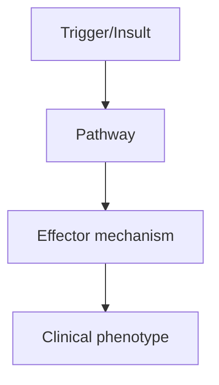
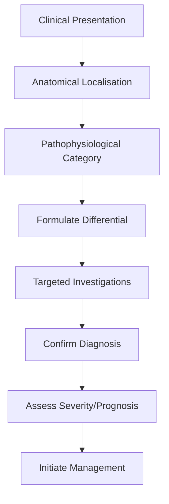
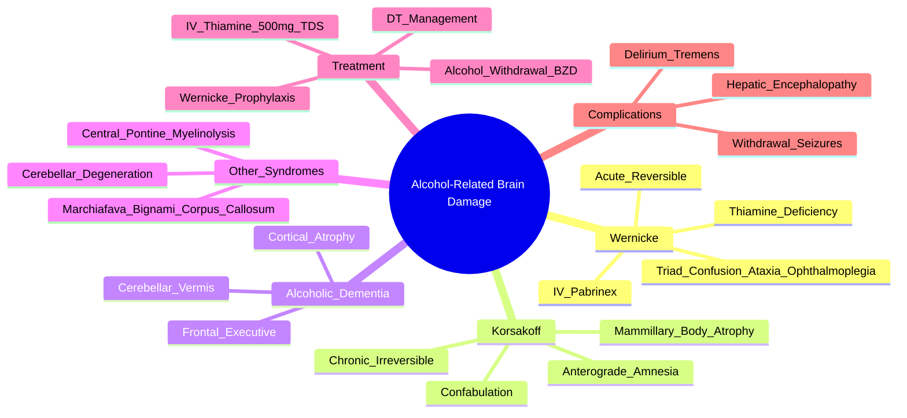

# Alcohol-Related Brain Damage

> [!tip] **High-Yield Definition**
> Alcohol-related brain damage: spectrum of cognitive impairment from alcohol. Wernicke encephalopathy (acute, reversible): confusion, ataxia, ophthalmoplegia. Korsakoff syndrome (chronic, often irreversible): anterograde amnesia, confabulation. Wernicke-Korsakoff syndrome: continuum. Alcohol-related dementia: chronic, frontal/executive predominance.

---

## 1. Definition / Epidemiology / Classification

### Definition
Alcohol-related brain damage: spectrum of cognitive impairment from alcohol. Wernicke encephalopathy (acute, reversible): confusion, ataxia, ophthalmoplegia. Korsakoff syndrome (chronic, often irreversible): anterograde amnesia, confabulation. Wernicke-Korsakoff syndrome: continuum. Alcohol-related dementia: chronic, frontal/executive predominance.

### Epidemiology
Wernicke: 0.04-0.13% prevalence. Often underdiagnosed (only 20% diagnosed antemortem). Korsakoff: 0.05% prevalence. Alcohol-related dementia: 10-24% of dementia in alcohol use disorder. Male predominance.

### Classification
| Variant | Key Features | Prognosis |
|---------|-------------|-----------|
| | | |

---

## 2. Aetiology / Pathophysiology

### Aetiology
Thiamine (vitamin B1) deficiency, often precipitated by carbohydrate load (glucose infusion without thiamine), malnutrition, vomiting, diarrhoea, malabsorption. Direct alcohol neurotoxicity. Wernicke: mammillary body, periaqueductal grey, thalamus, cerebellum damage. Korsakoff: anterior thalamic nucleus, mammillary body atrophy. Alcohol-related dementia: cortical atrophy (esp frontal), white matter loss, cerebellar vermis.

### Pathophysiology

---

## 3. Clinical Features

### History
- **Onset/Duration:**
- **Progression:**
- **Key symptoms:**
- **Triggers:**
- **Systemic symptoms:**
- **Drug/Family/Social history:**

### Examination
| Domain | Key Findings | Localisation Value |
|--------|-------------|-------------------|
| | | |

### Specific Clinical Features
Wernicke: classic triad (10%): confusion (encephalopathy), ataxia (gait, truncal), ophthalmoplegia (CN III, VI, nystagmus, gaze palsy). Often incomplete. Korsakoff: anterograde amnesia (inability to form new memories), retrograde amnesia (variable), confabulation (filling memory gaps with fabricated stories - not always present), apathetic, lack of insight, executive dysfunction. Alcohol-related dementia: frontal/executive (disinhibition, apathy, planning, judgement), memory (variable, retrieval > encoding), cerebellar (gait, truncal ataxia, gait ataxia).

---

## 4. Diagnostic Approach / Algorithm

---

## 5. Investigations

Wernicke: clinical diagnosis, treat empirically. MRI brain: mammillary body atrophy, periaqueductal grey hyperintensity (T2/FLAIR), thalamus, cerebellar vermis atrophy. Thiamine level (low, not widely available). Liver function, glucose, electrolytes, CBC, GGT, MCV (raised in alcohol). Korsakoff: neuropsychology (anterograde amnesia with relatively preserved attention, working memory, executive - but with executive dysfunction). EEG: generalised slowing. CSF: exclude Wernicke (TB, infection).

---

## 6. Differential Diagnosis

| Differential | Distinguishing Features | Key Test |
|--------------|------------------------|----------|
| | | |

---

## 7. Management

EMERGENCY (Wernicke suspected): IV thiamine 200-300mg TDS × 3-5 days (before glucose), then 100mg TDS oral. Always give thiamine BEFORE glucose. Oral thiamine poorly absorbed in alcoholism (use IV initially). Oral thiamine 100mg BD-TDS maintenance × 3-12 months. Supportive: rehydration, electrolytes (Mg, K, PO4), nutrition, alcohol withdrawal management (chlordiazepoxide, diazepam per CIWA-Ar). Korsakoff: thiamine (limited benefit), rehabilitation, structured environment, reality orientation, neuroleptics for agitation (low dose, avoid benzodiazepines - worsen cognition). Alcohol-related dementia: abstinence (key), nutrition, thiamine, cognitive training, OT, social. Prevention: thiamine in alcohol use disorder, food fortification, limit access to alcohol.

---

## 8. Drug Interactions / Contraindications / Comorbidity Cautions

| Drug | Interaction / Caution | Management |
|------|----------------------|------------|
| | | |

---

## 9. Procedures (if applicable)

### Procedure:
- **Indications:**
- **Contraindications:**
- **Preparation / Principle:**
- **Complications:**
- **Viva Pearls:**

---

## 10. Complications

| Complication | Frequency | Prevention / Monitoring | Management |
|--------------|-----------|------------------------|------------|
| | | | |

---

## 11. Red Flags / Emergencies

Wernicke: progression to Korsakoff, irreversible memory loss. Alcohol withdrawal: seizures, delirium tremens (24-72h after last drink), Wernicke (precipitated by glucose). Hepatic encephalopathy. Falls, aspiration, infections. SIADH, hyponatraemia.

---

## 12. Prognosis

Wernicke: 80% early treatment prevents Korsakoff, 20% progress to Korsakoff despite treatment. Korsakoff: 20% recovery with treatment, 60% partial, 20% no recovery. Mortality 10-20% (liver, infection, accidents). Abstinence improves prognosis. Continued alcohol worsens.

---

## 13. Topic Correlation

| Related Topic | Link | Key Overlap |
|---------------|------|-------------|
| | | |

---

## 14. Special Situations

| Situation | Consideration |
|-----------|---------------|
| **Pregnancy** | |
| **Lactation** | |
| **Paediatric** | |
| **Elderly / Frail** | |
| **Renal impairment** | |
| **Hepatic impairment** | |
| **Immunocompromised** | |
| **Perioperative** | |
| **Driving / DVLA** | |
| **Occupational** | |

---

## FCPS/MRCP High-Yield Summary

| Category | Key Points |
|----------|------------|
| **Definition** | Alcohol-related brain damage: spectrum of cognitive impairment from alcohol. Wernicke encephalopathy (acute, reversible): confusion, ataxia, ophthalmoplegia. Korsakoff syndrome (chronic, often irrever |
| **Epidemiology** | Wernicke: 0.04-0.13% prevalence. Often underdiagnosed (only 20% diagnosed antemortem). Korsakoff: 0.05% prevalence. Alcohol-related dementia: 10-24% o |
| **Pathophysiology** | |
| **Clinical** | Wernicke: classic triad (10%): confusion (encephalopathy), ataxia (gait, truncal), ophthalmoplegia (CN III, VI, nystagmus, gaze palsy). Often incomplete. Korsakoff: anterograde amnesia (inability to f |
| **Diagnosis** | |
| **Investigations** | Wernicke: clinical diagnosis, treat empirically. MRI brain: mammillary body atrophy, periaqueductal grey hyperintensity (T2/FLAIR), thalamus, cerebellar vermis atrophy. Thiamine level (low, not widely |
| **Management** | EMERGENCY (Wernicke suspected): IV thiamine 200-300mg TDS × 3-5 days (before glucose), then 100mg TDS oral. Always give thiamine BEFORE glucose. Oral thiamine poorly absorbed in alcoholism (use IV ini |
| **Complications** | |
| **Prognosis** | Wernicke: 80% early treatment prevents Korsakoff, 20% progress to Korsakoff despite treatment. Korsakoff: 20% recovery with treatment, 60% partial, 20% no recovery. Mortality 10-20% (liver, infection, |
| **Viva Pearls** | |
| **Drug Doses** | |
| **Scoring Systems** | |
| **Genetics** | |
| **Imaging Signs** | |

---

## Viva Questions (PACES/FCPS Style)

1. **Q:** Define Alcohol-Related Brain Damage and classify its variants.
   **A:** Based on the definition above.

2. **Q:** What are the key clinical features?
   **A:** Wernicke: classic triad (10%): confusion (encephalopathy), ataxia (gait, truncal), ophthalmoplegia (CN III, VI, nystagmus, gaze palsy). Often incomplete. Korsakoff: anterograde amnesia (inability to form new memories), retrograde amnesia (variable), confabulation (filling memory gaps with fabricated

3. **Q:** What is the first-line treatment?
   **A:** Based on the management section.

4. **Q:** What are the red flags requiring urgent referral?
   **A:** Wernicke: progression to Korsakoff, irreversible memory loss. Alcohol withdrawal: seizures, delirium tremens (24-72h after last drink), Wernicke (precipitated by glucose). Hepatic encephalopathy. Falls, aspiration, infections. SIADH, hyponatraemia.

5. **Q:** What is the prognosis?
   **A:** Wernicke: 80% early treatment prevents Korsakoff, 20% progress to Korsakoff despite treatment. Korsakoff: 20% recovery with treatment, 60% partial, 20% no recovery. Mortality 10-20% (liver, infection, accidents). Abstinence improves prognosis. Continued alcohol worsens.

6. **Q:** How do you differentiate Alcohol-Related Brain Damage from key differentials?
   **A:** Clinical features, investigations, and response to treatment.

7. **Q:** What investigations are most useful?
   **A:** Based on the investigations section.

8. **Q:** Describe the stepwise management approach.
   **A:** Based on the management algorithm.

9. **Q:** What are the emergency presentations?
   **A:** Based on the red flags section.

10. **Q:** How does management change in pregnancy/paediatrics/elderly?
    **A:** Special considerations per population.

---

## Common Confusions / Exam Traps

| Confusion | Clarification |
|-----------|---------------|
| | |

---

## Mnemonics
1. **Wernicke's triad:** "**CAN** I move my eyes?" — **C**onfusion, **A**taxia, **N**ystagmus/ophthalmoplegia
2. **Wernicke prevention:** "**Thiamine BEFORE glucose**" — always give Pabrinex before any glucose infusion in suspected alcohol misuse
3. **Alcohol-related syndromes:** "**WACK**" — **W**ernicke (acute), **A**taxia/cerebellar degeneration, **C**orsakoff (chronic, confabulation), **K**orsakoff = mammillary bodies

---

## Mind Map

---

## Spaced Repetition Trackers
| Day | Recall Score (/10) | Key Facts Reviewed | Weak Areas |
|-----|--------------------|--------------------|------------|
| Day 1 | __ | Wernicke triad; thiamine before glucose | |
| Day 3 | __ | Korsakoff: amnesia + confabulation; mammillary bodies | |
| Day 7 | __ | IV Pabrinex dosing; Wernicke prevention protocol | |
| Day 14 | __ | Marchiafava-Bignami; central pontine myelinolysis | |
| Day 30 | __ | Alcohol withdrawal timeline (6-24h, 24-72h, 48-96h) | |
| Day 90 | __ | Full clinical syndromes, imaging, prognosis | |

---

## Self-Test Scorecard
| Section | Topic | Score (/5) |
|---------|-------|-----------|
| 1 | Wernicke's encephalopathy (triad, treatment) | __/5 |
| 2 | Korsakoff syndrome (memory, confabulation) | __/5 |
| 3 | Alcohol-related dementia | __/5 |
| 4 | Thiamine deficiency mechanism | __/5 |
| 5 | Pabrinex dosing and prevention | __/5 |
| 6 | Alcohol withdrawal and DTs | __/5 |
| 7 | Imaging findings (MRI) | __/5 |
| 8 | Differential diagnosis | __/5 |
| 9 | Other alcohol syndromes (Marchiafava-Bignami) | __/5 |
| 10 | Prognosis and prevention | __/5 |
| **Total** | | **__/50** |

---

## One-Page Revision Card
| **Topic** | **Alcohol-Related Brain Damage** |
|-----------|----------------------------------|
| **Wernicke triad** | Confusion + Ataxia + Ophthalmoplegia (only 10% have all 3) |
| **Mechanism** | Thiamine (B1) deficiency — thiamine BEFORE glucose |
| **Acute treatment** | IV Pabrinex (thiamine) 500mg TDS × 3-5 days, then oral |
| **Korsakoff** | Anterograde amnesia + confabulation; mammillary body atrophy; often irreversible |
| **Alcohol withdrawal** | 6-24h tremor/anxiety; 12-48h seizures; 48-96h DTs (delirium tremens) |
| **DT treatment** | IV chlordiazepoxide + Pabrinex; ITU if severe |
| **Imaging** | MRI: mammillary body atrophy, periaqueductal grey T2 hyperintensity |
| **Other syndromes** | Marchiafava-Bignami (corpus callosum); central pontine myelinolysis (rapid Na correction) |
| **Prognosis** | Wernicke 80% respond to early treatment; Korsakoff 20% recover, 60% partial |
| **Red flags** | Hypoglycaemia, DTs, Wernicke precipitated by glucose, hepatic encephalopathy |

---

## MCQs (10)

1. **Wernicke's encephalopathy classic triad includes all EXCEPT:**
   A. Confusion (encephalopathy)
   B. Ataxia
   C. **Peripheral neuropathy**
   D. Ophthalmoplegia/nystagmus
   *Answer: C*

2. **In suspected alcohol misuse, thiamine must be given:**
   A. After glucose
   B. Orally only
   C. **Before any glucose infusion**
   D. Only if Wernicke's confirmed
   *Answer: C*

3. **Korsakoff syndrome is characterised by:**
   A. Retrograde amnesia only
   B. **Anterograde amnesia with confabulation**
   C. Visual hallucinations
   D. Akinetic mutism
   *Answer: B*

4. **The classic neuropathological finding in Wernicke-Korsakoff is:**
   A. Cerebellar vermis atrophy
   B. **Mammillary body atrophy and haemorrhage**
   C. Substantia nigra depigmentation
   D. Caudate atrophy
   *Answer: B*

5. **Marchiafava-Bignami disease affects the:**
   A. Mammillary bodies
   B. Cerebellar vermis
   C. **Corpus callosum**
   D. Pons (central)
   *Answer: C*

6. **IV Pabrinex (thiamine) dose in suspected Wernicke's:**
   A. 100mg OD
   B. 250mg BD
   C. **500mg TDS × 3-5 days**
   D. 1g stat only
   *Answer: C*

7. **Delirium tremens typically occurs:**
   A. 6-12 hours after last drink
   B. **48-96 hours after last drink**
   C. 1-2 weeks after last drink
   D. During intoxication
   *Answer: B*

8. **Alcohol withdrawal seizures typically occur:**
   A. 6-12h
   B. **12-48 hours after last drink**
   C. 3-5 days
   D. 1 week
   *Answer: B*

9. **Central pontine myelinolysis is precipitated by:**
   A. Thiamine deficiency
   B. **Rapid correction of hyponatraemia**
   C. Alcohol intoxication
   D. Wernicke's
   *Answer: B*

10. **First-line for alcohol withdrawal symptom relief in DTs is:**
    A. Haloperidol
    B. **Benzodiazepine (chlordiazepoxide or diazepam)**
    C. Phenytoin
    D. Antipsychotic
    *Answer: B*

---

## SBA Questions (10)

1. **A 50-year-old chronic alcoholic presents confused with nystagmus and wide-based gait. Most appropriate immediate management?**
   A. IV glucose first
   B. **IV Pabrinex (thiamine) before glucose**
   C. CT head
   D. Lumbar puncture
   *Answer: B* — Thiamine BEFORE glucose to avoid precipitating Wernicke's.

2. **A 55-year-old with alcohol use disorder fills in memory gaps with fabricated but believed stories. Diagnosis?**
   A. Wernicke's encephalopathy
   B. **Korsakoff syndrome (confabulation)**
   C. Alcoholic dementia
   D. Delirium
   *Answer: B* — Confabulation = classic Korsakoff feature.

3. **Best neuroimaging to confirm suspected Wernicke-Korsakoff?**
   A. CT head
   B. **MRI brain with FLAIR**
   C. PET amyloid
   D. Skull X-ray
   *Answer: B* — MRI shows mammillary body atrophy and periaqueductal grey changes.

4. **Chronic alcoholic with gait ataxia but no confusion or eye signs. Most likely cause?**
   A. Wernicke's
   B. Korsakoff
   C. **Alcoholic cerebellar degeneration (vermis)**
   D. Hepatic encephalopathy
   *Answer: C* — Cerebellar vermis degeneration → truncal/gait ataxia.

5. **A chronic alcoholic is given IV glucose in A&E. Within hours becomes confused and ataxic. Mechanism?**
   A. Hypoglycaemia
   B. **Glucose precipitated Wernicke by depleting thiamine**
   C. Alcohol intoxication
   D. Hepatic encephalopathy
   *Answer: B* — Glucose metabolism consumes thiamine, precipitating Wernicke in deficient patients.

6. **DTs is characterised by all EXCEPT:**
   A. Confusion, agitation, tremor
   B. Autonomic hyperactivity
   C. Visual hallucinations
   D. **Bradycardia and hypotension**
   *Answer: D* — DTs causes tachycardia and HYPERtension (autonomic hyperactivity).

7. **Best long-term prognosis is in which of these?**
   A. Korsakoff with confabulation
   B. **Wernicke's treated early with Pabrinex**
   C. Marchiafava-Bignami
   D. Central pontine myelinolysis
   *Answer: B* — Early Wernicke treatment prevents progression to Korsakoff.

8. **Alcoholic patient found hyponatraemic (Na 105). Correct management?**
   A. Rapid Na correction to 130 immediately
   B. **Slow Na correction ≤10 mmol/L per 24h**
   C. 3% hypertonic saline bolus
   D. Fluid restriction only
   *Answer: B* — Rapid correction → osmotic demyelination (central pontine myelinolysis).

9. **A chronic alcoholic has dysarthria, dysphagia, and frontal release signs. MRI shows corpus callosum demyelination. Diagnosis?**
   A. Wernicke's
   B. **Marchiafava-Bignami disease**
   C. Multiple sclerosis
   D. PML
   *Answer: B* — Corpus callosum demyelination in alcoholic = Marchiafava-Bignami.

10. **A patient with Korsakoff syndrome has which MRI finding?**
    A. Hippocampal atrophy
    B. **Mammillary body atrophy**
    C. Caudate atrophy
    D. Substantia nigra changes
    *Answer: B* — Mammillary body atrophy is the Korsakoff hallmark.

---

## Flashcards
- **Q:** Wernicke's triad?
  **A:** Confusion + Ataxia + Ophthalmoplegia (only ~10% have all three; suspect in any alcoholic with confusion)
- **Q:** Why give thiamine before glucose?
  **A:** Glucose metabolism consumes thiamine; giving glucose first can precipitate or worsen Wernicke's
- **Q:** IV Pabrinex dose for Wernicke's?
  **A:** 500mg thiamine IV TDS × 3-5 days, then oral thiamine 100mg TDS
- **Q:** Korsakoff features?
  **A:** Anterograde amnesia, retrograde amnesia (variable), confabulation, apathy, lack of insight
- **Q:** Korsakoff neuropathology?
  **A:** Mammillary body atrophy, anterior thalamic nucleus damage
- **Q:** Marchiafava-Bignami site?
  **A:** Corpus callosum demyelination (often in malnourished wine drinkers)
- **Q:** Cerebellar degeneration site?
  **A:** Anterior vermis of cerebellum
- **Q:** Central pontine myelinolysis cause?
  **A:** Rapid correction of hyponatraemia (Na correction >10 mmol/L/24h)
- **Q:** Alcohol withdrawal timeline?
  **A:** 6-24h tremor/anxiety; 12-48h seizures; 48-96h delirium tremens (DTs)
- **Q:** DTs treatment?
  **A:** IV benzodiazepine (chlordiazepoxide/diazepam), IV Pabrinex, supportive care, ITU
- **Q:** Wernicke's MRI findings?
  **A:** Mammillary body atrophy, periaqueductal grey and medial thalamic T2/FLAIR hyperintensity
- **Q:** Alcohol-related dementia features?
  **A:** Frontal/executive predominance, retrieval memory deficit, cerebellar signs

---

## Answer Key with Explanations

### MCQs
1. **C** — Peripheral neuropathy is not part of Wernicke triad (though common in alcohol misuse)
2. **C** — Thiamine BEFORE glucose — always
3. **B** — Anterograde amnesia + confabulation = Korsakoff
4. **B** — Mammillary bodies are pathognomonic
5. **C** — Corpus callosum demyelination
6. **C** — 500mg IV TDS × 3-5 days
7. **B** — DTs = 48-96h after last drink
8. **B** — Withdrawal seizures = 12-48h
9. **B** — Rapid Na correction → central pontine myelinolysis
10. **B** — Benzodiazepine is first-line for DTs

### SBAs
1. **B** — Suspected Wernicke: Pabrinex BEFORE glucose
2. **B** — Confabulation in alcoholic = Korsakoff
3. **B** — MRI best for Wernicke-Korsakoff
4. **C** — Isolated gait ataxia = cerebellar vermis degeneration
5. **B** — Glucose precipitates Wernicke in deficient
6. **D** — DTs = autonomic hyperactivity (tachycardia, HTN)
7. **B** — Wernicke responds best if treated early
8. **B** — Slow Na correction to avoid osmotic demyelination
9. **B** — Corpus callosum in alcoholic = Marchiafava-Bignami
10. **B** — Mammillary body atrophy in Korsakoff

---

## Tags
#neurology #dementia #alcohol #Wernicke #Korsakoff #thiamine #FCPS #MRCP #PACES

## Local Navigation
**Heading Hub:** [[../Hub]]  
**Chapter Hierarchy:** [[Davidson Chapter 25 - Neurology Hierarchy]]  
**Chapter MOC:** [[Neurology MOC]]  
**Drug Reference:** [[../00_Index/Neurology Drug Reference]]  
