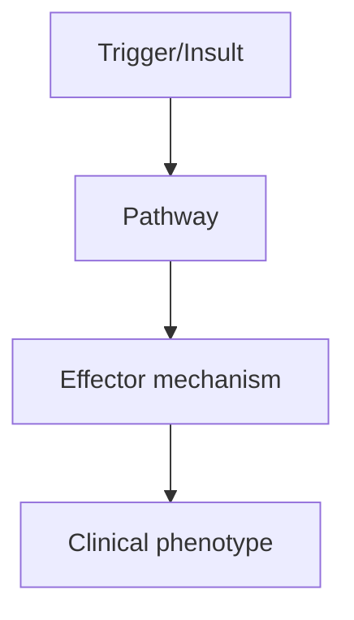
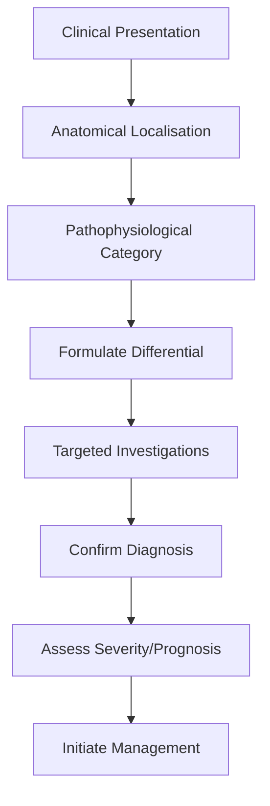
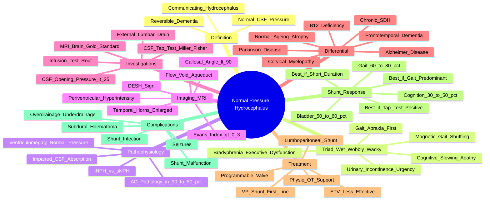

# Normal Pressure Hydrocephalus

> [!tip] **High-Yield Definition**
> Normal pressure hydrocephalus (NPH): communicating hydrocephalus with normal CSF pressure, classic triad: gait apraxia ('magnetic gait'), urinary incontinence, dementia ('wet, wobbly, wacky'). Reversible cause of dementia with treatment.

---

## 1. Definition / Epidemiology / Classification

### Definition
Normal pressure hydrocephalus (NPH): communicating hydrocephalus with normal CSF pressure, classic triad: gait apraxia ('magnetic gait'), urinary incontinence, dementia ('wet, wobbly, wacky'). Reversible cause of dementia with treatment.

### Epidemiology
Prevalence: 0.5-2.9% of population >65y. 5-10% of all dementia. Idiopathic (iNPH, 50%) vs secondary (sNPH, post-SAH, trauma, meningitis, surgery). Age >60y.

### Classification
| Variant | Key Features | Prognosis |
|---------|-------------|-----------|
| | | |

---

## 2. Aetiology / Pathophysiology

### Aetiology
Idiopathic: unknown, possibly impaired CSF absorption. Secondary: post-SAH, TBI, meningitis, neurosurgery, radiation. Ventriculomegaly with normal CSF pressure, normal sulci (vs atrophy in neurodegenerative). Disturbed CSF dynamics, venous compliance. Brain biopsy shows AD pathology in 30-50% (overlap).

### Pathophysiology

---

## 3. Clinical Features

### History
- **Onset/Duration:**
- **Progression:**
- **Key symptoms:**
- **Triggers:**
- **Systemic symptoms:**
- **Drug/Family/Social history:**

### Examination
| Domain | Key Findings | Localisation Value |
|--------|-------------|-------------------|
| | | |

### Specific Clinical Features
Triad: (1) Gait apraxia ('magnetic', shuffling, broad-based, festination, frontal gait, feet 'stuck to floor') - often first symptom, (2) Urinary incontinence (urgency, frequency, then overflow), (3) Dementia (subcortical, frontal, attention, executive, psychomotor slowing, apathy). Other: bradyphrenia, gait freezing, start hesitation, magnetic gait. NOT responsive to levodopa (no parkinsonism).

---

## 4. Diagnostic Approach / Algorithm

---

## 5. Investigations

MRI brain: ventriculomegaly (Evans index >0.3 - frontal horn width/maximum skull diameter), normal or only mild cortical atrophy (callosal angle <90°), enlarged temporal horns, periventricular hyperintensity, flow void at aqueduct (CSF flow), disproportionately enlarged subarachnoid space hydrocephalus (DESH) sign. CSF tap test (Miller Fisher test): remove 30-50ml LP, gait improvement pre/post (predicts shunt response). Large-volume LP (LP drainage 30-50ml) + repeat gait/cognitive testing 30-60min post. CSF opening pressure normal (<25cm H2O). Infusion testing: resistance to outflow (Rout) elevated.

---

## 6. Differential Diagnosis

| Differential | Distinguishing Features | Key Test |
|--------------|------------------------|----------|
| | | |

---

## 7. Management

Ventriculoperitoneal (VP) shunt: first-line, programmable valve (Codman, Strata, Polaris). Improvement: 60-80% gait, 50-60% urinary, 30-50% cognitive (cognitive least responsive). Endoscopic third ventriculostomy (ETV): less effective. Lumboperitoneal shunt: alternative. Selection: positive tap test, DESH sign, gait-predominant, short disease duration (<2y). Complications: subdural haematoma, infection, shunt malfunction, overdrainage, underdrainage. Multimodal: physiotherapy, OT, continence support. Treat coincident AD if present.

---

## 8. Drug Interactions / Contraindications / Comorbidity Cautions

| Drug | Interaction / Caution | Management |
|------|----------------------|------------|
| | | |

---

## 9. Procedures (if applicable)

### Procedure:
- **Indications:**
- **Contraindications:**
- **Preparation / Principle:**
- **Complications:**
- **Viva Pearls:**

---

## 10. Complications

| Complication | Frequency | Prevention / Monitoring | Management |
|--------------|-----------|------------------------|------------|
| | | | |

---

## 11. Red Flags / Emergencies

Shunt complications: subdural haematoma (overdrainage), infection (fever, headache, meningism), shunt malfunction (recurrent symptoms, raised ICP), shunt obstruction, abdominal complications. Falls, fractures. Decompensated hydrocephalus (acute, emergency).

---

## 12. Prognosis

Variable. Gait best (60-80% improve), bladder (50-60%), cognition (30-50%). Worse if: cognitive predominant, longer disease, severe atrophy, absent tap test response. Gait may return after shunt, but rarely fully. Shunt revision often needed. 5-year survival 50-70%.

---

## 13. Topic Correlation

| Related Topic | Link | Key Overlap |
|---------------|------|-------------|
| | | |

---

## 14. Special Situations

| Situation | Consideration |
|-----------|---------------|
| **Pregnancy** | |
| **Lactation** | |
| **Paediatric** | |
| **Elderly / Frail** | |
| **Renal impairment** | |
| **Hepatic impairment** | |
| **Immunocompromised** | |
| **Perioperative** | |
| **Driving / DVLA** | |
| **Occupational** | |

---

## FCPS/MRCP High-Yield Summary

| Category | Key Points |
|----------|------------|
| **Definition** | Normal pressure hydrocephalus (NPH): communicating hydrocephalus with normal CSF pressure, classic triad: gait apraxia ('magnetic gait'), urinary incontinence, dementia ('wet, wobbly, wacky'). Reversi |
| **Epidemiology** | Prevalence: 0.5-2.9% of population >65y. 5-10% of all dementia. Idiopathic (iNPH, 50%) vs secondary (sNPH, post-SAH, trauma, meningitis, surgery). Age |
| **Pathophysiology** | |
| **Clinical** | Triad: (1) Gait apraxia ('magnetic', shuffling, broad-based, festination, frontal gait, feet 'stuck to floor') - often first symptom, (2) Urinary incontinence (urgency, frequency, then overflow), (3)  |
| **Diagnosis** | |
| **Investigations** | MRI brain: ventriculomegaly (Evans index >0.3 - frontal horn width/maximum skull diameter), normal or only mild cortical atrophy (callosal angle <90°), enlarged temporal horns, periventricular hyperin |
| **Management** | Ventriculoperitoneal (VP) shunt: first-line, programmable valve (Codman, Strata, Polaris). Improvement: 60-80% gait, 50-60% urinary, 30-50% cognitive (cognitive least responsive). Endoscopic third ven |
| **Complications** | |
| **Prognosis** | Variable. Gait best (60-80% improve), bladder (50-60%), cognition (30-50%). Worse if: cognitive predominant, longer disease, severe atrophy, absent tap test response. Gait may return after shunt, but  |
| **Viva Pearls** | |
| **Drug Doses** | |
| **Scoring Systems** | |
| **Genetics** | |
| **Imaging Signs** | |

---

## Viva Questions (PACES/FCPS Style)

1. **Q:** Define Normal Pressure Hydrocephalus and classify its variants.
   **A:** Based on the definition above.

2. **Q:** What are the key clinical features?
   **A:** Triad: (1) Gait apraxia ('magnetic', shuffling, broad-based, festination, frontal gait, feet 'stuck to floor') - often first symptom, (2) Urinary incontinence (urgency, frequency, then overflow), (3) Dementia (subcortical, frontal, attention, executive, psychomotor slowing, apathy). Other: bradyphre

3. **Q:** What is the first-line treatment?
   **A:** Based on the management section.

4. **Q:** What are the red flags requiring urgent referral?
   **A:** Shunt complications: subdural haematoma (overdrainage), infection (fever, headache, meningism), shunt malfunction (recurrent symptoms, raised ICP), shunt obstruction, abdominal complications. Falls, fractures. Decompensated hydrocephalus (acute, emergency).

5. **Q:** What is the prognosis?
   **A:** Variable. Gait best (60-80% improve), bladder (50-60%), cognition (30-50%). Worse if: cognitive predominant, longer disease, severe atrophy, absent tap test response. Gait may return after shunt, but rarely fully. Shunt revision often needed. 5-year survival 50-70%.

6. **Q:** How do you differentiate Normal Pressure Hydrocephalus from key differentials?
   **A:** Clinical features, investigations, and response to treatment.

7. **Q:** What investigations are most useful?
   **A:** Based on the investigations section.

8. **Q:** Describe the stepwise management approach.
   **A:** Based on the management algorithm.

9. **Q:** What are the emergency presentations?
   **A:** Based on the red flags section.

10. **Q:** How does management change in pregnancy/paediatrics/elderly?
    **A:** Special considerations per population.

---

## Common Confusions / Exam Traps

| Confusion | Clarification |
|-----------|---------------|
| | |

---

## Mnemonics

1. **NPH Triad 'Wet, Wobbly, Wacky':** **W**et (urinary incontinence) → **W**obbly (gait apraxia) → **W**acky (dementia). Order of onset: gait FIRST (often years before), then bladder, then cognition.
2. **NPH Imaging 'DESH':** **D**isproportionately **E**nlarged **S**ubarachnoid-space **H**ydrocephalus — tight high-convexity sulci + enlarged ventricles (the hallmark triad).
3. **NPH Tap Test '30-50 Gait':** Remove **30–50 mL** of CSF via LP; reassess **gait** (timed up-and-go, steps, speed) before and **30–60 min** after — improvement predicts shunt response.
4. **NPH Shunt Response 'G>U>C':** **G**ait improves most (60–80%), **U**rinary incontinence next (50–60%), **C**ognition least (30–50%). Remember the GUC hierarchy.
5. **NPH Evans Index '0.3 Rule':** Evans index = max frontal horn width / max inner skull diameter; **>0.3** = ventriculomegaly. Callosal angle <90° on coronal also supportive.

---

## Mind Map

---

## Spaced Repetition Trackers
| Day | Recall Score (/10) | Key Facts Reviewed | Weak Areas |
|-----|--------------------|--------------------|------------|
| Day 1 | __ | Triad 'wet, wobbly, wacky'; gait first; communicating hydrocephalus; reversibility | |
| Day 3 | __ | DESH sign; Evans index >0.3; callosal angle <90°; MRI features | |
| Day 7 | __ | Tap test (Miller Fisher 30–50 mL); CSF opening pressure normal; infusion test Rout | |
| Day 14 | __ | VP shunt 1st line; G>U>C response pattern; shunt complications | |
| Day 30 | __ | iNPH vs sNPH; AD pathology overlap (30–50%); DESH specificity; ETV role | |
| Day 90 | __ | Full syndrome; prognosis 5-yr 50–70%; differential from PD/AD/FTD; gait improvement durability | |

---

## Self-Test Scorecard
| Section | Topic | Score (/5) |
|---------|-------|-----------:|
| 1 | Definition (NPH, communicating, normal pressure) | __/5 |
| 2 | Epidemiology (0.5–2.9% >65y; 5–10% of dementia) | __/5 |
| 3 | Classic triad (Wet, Wobbly, Wacky) and gait features | __/5 |
| 4 | MRI: Evans index, DESH, callosal angle, temporal horns | __/5 |
| 5 | CSF tap test (Miller Fisher) and external lumbar drain | __/5 |
| 6 | Differential diagnosis (PD, AD, FTD, ageing, B12, SDH) | __/5 |
| 7 | VP shunt: programmable valve, ETV alternative | __/5 |
| 8 | Shunt complications (SDH, infection, over/under-drainage) | __/5 |
| 9 | Prognosis: G>U>C; 5-yr survival; tap test positive predictors | __/5 |
| 10 | AD pathology overlap and iNPH vs sNPH | __/5 |
| **Total** | | **__/50** |

---

## One-Page Revision Card
| **Topic** | **Normal Pressure Hydrocephalus** |
|-----------|-----------------------------------|
| **Definition** | Communicating hydrocephalus with normal CSF pressure and the classic triad: gait apraxia, urinary incontinence, dementia (Hakim triad). Reversible with treatment. |
| **Epidemiology** | 0.5–2.9% of >65y; 5–10% of all dementia; idiopathic (iNPH) ~50%, secondary (post-SAH, TBI, meningitis, surgery) ~50%. |
| **Clinical features** | **G**ait apraxia first ('magnetic', shuffling, broad-based, festination); **U**rinary urgency → incontinence; **C**ognitive slowing, executive dysfunction, apathy. No parkinsonism (no levodopa response). |
| **Imaging** | MRI: ventriculomegaly (Evans index >0.3), callosal angle <90°, enlarged temporal horns, **DESH sign**, flow void at aqueduct, periventricular hyperintensity. |
| **Diagnosis** | Clinical triad + MRI features + positive **CSF tap test** (Miller Fisher; remove 30–50 mL, gait reassessment 30–60 min post-LP) OR positive external lumbar drain. |
| **Treatment** | **VP shunt (programmable valve)** first-line; lumboperitoneal shunt alternative; ETV less effective. Adjunctive physio, OT, continence support. |
| **Shunt response** | **Gait 60–80% > Bladder 50–60% > Cognition 30–50%.** Better outcome if: positive tap test, DESH sign, gait-predominant, short disease (<2 y). |
| **Complications** | Subdural haematoma (overdrainage), infection (fever, meningism), shunt malfunction/obstruction, underdrainage, abdominal complications, seizures. |
| **Prognosis** | Variable; gait best response, may return after shunt but rarely fully. 5-year survival 50–70%. Worse if cognitive predominant, long disease, severe atrophy, no tap test response. |
| **Caution** | AD pathology found in 30–50% on biopsy — explains partial cognitive response; reassure patient that gait is the most reliable indicator of shunt benefit. |
| **Viva pearls** | Always do **tap test BEFORE committing to shunt**; magnetic gait + urinary urgency in elderly = NPH until proven otherwise; **DESH is highly specific** for iNPH. |

---

## MCQs (10)

1. **Which clinical feature typically appears FIRST in idiopathic Normal Pressure Hydrocephalus?**
   A. Urinary incontinence
   B. **Gait apraxia (magnetic gait)**
   C. Memory impairment
   D. Visual hallucinations
   *Answer: B*
   *Explanation: Gait disturbance precedes bladder and cognitive symptoms, often by months to years. The classic triad unfolds as gait → bladder → cognition ('Wobbly → Wet → Wacky').*

2. **Which MRI finding is most specific for idiopathic NPH?**
   A. Hippocampal atrophy
   B. Cortical ribboning on DWI
   C. **Disproportionately Enlarged Subarachnoid-space Hydrocephalus (DESH)**
   D. Cerebellar atrophy
   *Answer: C*
   *Explanation: DESH combines tight high-convexity/medial sulci with enlarged ventricles on coronal imaging — highly specific for iNPH. Hippocampal atrophy suggests AD; cortical ribboning suggests CJD.*

3. **What does the CSF tap test (Miller Fisher test) involve?**
   A. Removal of 5 mL CSF with cognitive testing post
   B. **Removal of 30–50 mL CSF with gait reassessment 30–60 min later**
   C. Lumbar drain for 7 days
   D. CSF pressure monitoring for 24 h
   *Answer: B*
   *Explanation: Large-volume LP removes 30–50 mL; objective gait testing (e.g. timed up-and-go, 10-m walk) is repeated 30–60 min post. Improvement predicts shunt response.*

4. **In NPH, which symptom shows the BEST response to VP shunting?**
   A. Cognitive impairment
   B. Urinary incontinence
   C. **Gait apraxia**
   D. Depression
   *Answer: C*
   *Explanation: Gait improves in 60–80%, urinary incontinence in 50–60%, cognition in only 30–50%. Remember the G > U > C hierarchy.*

5. **A patient with NPH undergoes VP shunt insertion. Three months later presents with headache and right-sided weakness. Most likely diagnosis?**
   A. Stroke
   B. **Subdural haematoma from overdrainage**
   C. Meningitis
   D. Normal pressure hydrocephalus recurrence
   *Answer: B*
   *Explanation: Overdrainage is a recognised complication causing subdural collections/haematoma due to traction on bridging veins. Programmable valves reduce this risk; new neurological signs post-shunt warrant urgent CT.*

6. **What is the Evans index cut-off for ventriculomegaly?**
   A. >0.2
   B. **>0.3**
   C. >0.4
   D. >0.5
   *Answer: B*
   *Explanation: Evans index = maximum frontal horn width / maximum inner skull diameter on axial imaging. >0.3 indicates ventriculomegaly out of proportion to atrophy.*

7. **Which CSF finding is expected in NPH?**
   A. Very high opening pressure (>40 cm H₂O)
   B. **Normal opening pressure (<25 cm H₂O)**
   C. Xanthochromia
   D. Elevated protein >2 g/L
   *Answer: B*
   *Explanation: Despite ventriculomegaly, CSF opening pressure is normal (<25 cm H₂O). This distinguishes NPH from acute obstructive hydrocephalus. Infusion testing shows elevated resistance to outflow (Rout).*

8. **Which intervention is FIRST-LINE for confirmed NPH?**
   A. Levodopa
   B. **Ventriculoperitoneal (VP) shunt with programmable valve**
   C. High-dose corticosteroids
   D. Memantine
   *Answer: B*
   *Explanation: VP shunt is the established first-line treatment. Endoscopic third ventriculostomy (ETV) is less effective in communicating hydrocephalus. Levodopa does not help (no true parkinsonism).*

9. **Which condition is a common cause of SECONDARY NPH?**
   A. Alzheimer's disease
   B. **Subarachnoid haemorrhage**
   C. Multiple sclerosis
   D. Migraine
   *Answer: B*
   *Explanation: Secondary NPH follows SAH, traumatic brain injury, meningitis, intracranial surgery, or radiation — all impair CSF absorption at arachnoid granulations.*

10. **A 70-year-old has gait apraxia, urinary incontinence, and forgetfulness. MRI shows ventriculomegaly with tight high-convexity sulci. What is the most likely diagnosis?**
    A. Alzheimer's disease
    B. Parkinson's disease dementia
    C. **Normal Pressure Hydrocephalus**
    D. Frontotemporal dementia
    *Answer: C*
    *Explanation: The triad + ventriculomegaly with tight sulci (DESH) on MRI is classic for NPH. PD dementia has true parkinsonism with levodopa response; AD has hippocampal atrophy with prominent amnesia first.*

---

## SBA Questions (10)

1. **Scenario:** A 72-year-old man presents with progressive gait disturbance (broad-based, shuffling, 'feet stuck to floor'), urinary incontinence for 6 months, and slowed thinking. MRI shows enlarged ventricles with Evans index 0.36 and tight high-convexity sulci.
   **Question:** What is the most appropriate next step before considering shunt surgery?
   A. Empirical levodopa trial
   B. **CSF tap test (Miller Fisher test) — remove 30–50 mL and reassess gait**
   C. Brain biopsy
   D. IV methylprednisolone
   *Answer: B*
   *Explanation: The CSF tap test is the standard predictive test for shunt response. A positive response (objective gait improvement) supports proceeding to VP shunt.*

2. **Scenario:** A patient with NPH undergoes VP shunt. Two years later, gait improvement has been sustained but now presents with new onset memory impairment and progressive hippocampal atrophy on follow-up MRI.
   **Question:** What is the most likely coexisting pathology?
   A. Recurrent NPH
   B. **Co-existent Alzheimer's disease pathology**
   C. Chronic subdural haematoma
   D. Vascular dementia
   *Answer: B*
   *Explanation: Up to 30–50% of NPH patients show AD pathology on brain biopsy; coincident AD explains the cognitive plateau or decline despite successful shunt. Hippocampal atrophy is the clue.*

3. **Scenario:** A 68-year-old woman with NPH has a positive tap test and undergoes VP shunt insertion. On day 3 post-op she develops fever, headache, and neck stiffness.
   **Question:** What is the most important next investigation?
   A. CT brain
   B. **Lumbar puncture for CSF analysis and shunt tap**
   C. EEG
   D. MRI brain
   *Answer: B*
   *Explanation: Suspected shunt infection (typically Staphylococcus epidermidis) requires CSF analysis and shunt tap for culture. Treatment involves IV antibiotics and often shunt removal/externalisation.*

4. **Scenario:** An NPH patient with VP shunt develops postural headache, dizziness, and a thin subdural hygroma on imaging 2 weeks post-op.
   **Question:** Most appropriate shunt adjustment?
   A. Immediate shunt removal
   B. **Increase valve opening pressure (raise setting) to reduce overdrainage**
   C. Insertion of a second shunt
   D. Switch to lumboperitoneal shunt
   *Answer: B*
   *Explanation: Overdrainage is treated by raising the valve opening pressure (programmable valve adjustment). This reduces CSF diversion, allowing brain re-expansion and resolution of the subdural collection.*

5. **Scenario:** A patient with NPH and positive tap test also has significant cortical atrophy on MRI and disease duration of 5 years, predominantly cognitive.
   **Question:** Most likely shunt outcome?
   A. Full recovery
   B. **Poor — cognitive-predominant NPH with long duration and severe atrophy responds poorly to shunting**
   C. Rapid gait recovery but worsening cognition
   D. Shunt infection
   *Answer: B*
   *Explanation: Favourable predictors: positive tap test, gait-predominant symptoms, short disease duration (<2 y), DESH sign. Cognitive predominance, long duration, and severe atrophy predict poor shunt response.*

6. **Scenario:** Patient with NPH has ventriculomegaly and gait disturbance but a NEGATIVE tap test.
   **Question:** Most appropriate next step?
   A. Proceed to VP shunt anyway
   B. **Consider extended lumbar drainage (external lumbar drain 2–5 days) for further evaluation**
   C. Reassure and discharge
   D. Repeat MRI in 1 year
   *Answer: B*
   *Explanation: A negative tap test is not fully exclusionary. Extended lumbar drainage over 2–5 days with serial gait/cognitive testing is more sensitive and helps select surgical candidates.*

7. **Scenario:** A patient with NPH and gait apraxia is commenced on levodopa by another clinician with no benefit.
   **Question:** Why did levodopa fail?
   A. Wrong dose
   B. Drug interaction
   C. **NPH gait apraxia is NOT parkinsonian — it is a frontal gait disorder**
   D. Patient non-compliance
   *Answer: C*
   *Explanation: NPH gait apraxia ('magnetic gait') is frontal in origin, not due to nigrostriatal dopamine deficiency. True parkinsonian features (tremor, rigidity, bradykinesia) are absent in pure NPH.*

8. **Scenario:** Patient with NPH and gait disturbance is found to have a callosal angle of 110° on coronal MRI.
   **Question:** Interpretation?
   A. Highly supportive of NPH
   B. **Against NPH — callosal angle is typically <90° in NPH**
   C. Suggestive of Alzheimer's disease
   D. Suggestive of Parkinson's disease
   *Answer: B*
   *Explanation: A narrow callosal angle (<90° on coronal imaging perpendicular to AC–PC at posterior commissure) reflects upward bowing of the corpus callosum due to ventricular distension — supportive of NPH.*

9. **Scenario:** A 75-year-old with NPH undergoes programmable VP shunt. Family asks about long-term expectations.
   **Question:** Most accurate statement?
   A. Cure is expected
   B. **Gait improves in 60–80% but rarely fully returns; bladder 50–60%, cognition 30–50%**
   C. Shunt must be revised in 90% within 5 years
   D. No complications expected
   *Answer: B*
   *Explanation: Realistic counselling: gait is most responsive but rarely completely normal; cognition least responsive. Complication rates are significant (subdural, infection, malfunction). Revision is often needed.*

10. **Scenario:** Patient with new-onset gait apraxia and MRI showing ventriculomegaly with sulcal widening (no DESH).
    **Question:** Most likely diagnosis?
    A. NPH
    B. **Normal age-related ventriculomegaly OR Alzheimer's disease**
    C. CJD
    D. Huntington's disease
    *Answer: B*
    *Explanation: Ex vacuo ventricular enlargement from age-related or AD atrophy is accompanied by cortical sulcal widening. NPH has the OPPOSITE pattern — ventriculomegaly with tight sulci (DESH).*

---

## Flashcards

- **Q: Define NPH (Hakim triad).**
  A: Communicating hydrocephalus with NORMAL CSF opening pressure causing the triad: gait apraxia (wobbly), urinary incontinence (wet), dementia (wacky). Reversible.

- **Q: What is the order of symptom onset in NPH?**
  A: Gait → bladder → cognition (often years between gait onset and dementia).

- **Q: What is the DESH sign?**
  A: Disproportionately Enlarged Subarachnoid-space Hydrocephalus — tight high-convexity/medial sulci + enlarged lateral ventricles. Highly specific for iNPH.

- **Q: What is the CSF tap test (Miller Fisher)?**
  A: Remove 30–50 mL CSF via LP; reassess gait 30–60 min later. Improvement predicts shunt response.

- **Q: What is the Evans index threshold for ventriculomegaly?**
  A: >0.3 (frontal horn width / max skull diameter on axial imaging).

- **Q: What is first-line treatment for NPH?**
  A: VP shunt with programmable valve.

- **Q: Rank shunt response (best to worst).**
  A: Gait (60–80%) > Urinary incontinence (50–60%) > Cognition (30–50%).

- **Q: Most feared early shunt complication?**
  A: Subdural haematoma from overdrainage.

- **Q: What proportion of NPH patients have AD pathology on biopsy?**
  A: 30–50%.

- **Q: Favourable shunt prognostic factors.**
  A: Positive tap test, DESH sign, gait-predominant, short disease (<2 y), no/minimal cortical atrophy.

---

## Answer Key with Explanations

### MCQs
1. **B** — Gait first: triad order is gait → bladder → cognition.
2. **C** — DESH = tight sulci + enlarged ventricles; highly specific for iNPH.
3. **B** — Tap test: 30–50 mL removed, gait reassessed 30–60 min post.
4. **C** — Gait improves best (G > U > C hierarchy).
5. **B** — Overdrainage → subdural haematoma; check valve setting.
6. **B** — Evans index >0.3 = ventriculomegaly.
7. **B** — Normal opening pressure (<25 cm H₂O) despite ventriculomegaly.
8. **B** — VP shunt with programmable valve is first-line.
9. **B** — Secondary NPH post-SAH, TBI, meningitis, surgery.
10. **C** — Triad + DESH = NPH; not PD, AD, or FTD.

### SBAs
1. **B** — Tap test before committing to shunt.
2. **B** — Co-existent AD pathology (30–50% overlap).
3. **B** — CSF + shunt tap for shunt infection.
4. **B** — Increase valve pressure to reduce overdrainage.
5. **B** — Cognitive-predominant NPH responds poorly.
6. **B** — Extended lumbar drainage for further evaluation.
7. **C** — NPH gait is frontal, not parkinsonian — no levodopa response.
8. **B** — Callosal angle >90° argues against NPH.
9. **B** — Realistic prognosis: G > U > C.
10. **B** — Ventriculomegaly WITH sulcal widening suggests atrophy/ageing, not NPH.

## Tags
#neurology #dementia #NPH #hydrocephalus #gait #incontinence #FCPS #MRCP #PACES #triad

## Local Navigation
**Heading Hub:** [[../Hub]]  
**Chapter Hierarchy:** [[Davidson Chapter 25 - Neurology Hierarchy]]  
**Chapter MOC:** [[Neurology MOC]]  
**Drug Reference:** [[../00_Index/Neurology Drug Reference]]

## PasTest Scenario SBAs (Clinical Vignettes)

> **Auto-generated PasTest/Mediscope-style scenario SBAs** grounded in the authored source. Each scenario tests a real clinical fact (triad, specific sign, contraindication, trial, first-line Rx) extracted from the topic. *Source: Ch 27: Neurology & Stroke — Normal Pressure Hydrocephalus*

**Q1.** Which of the following is characterised by the clinical triad: Wet, Wobbly, Wacky?

  - **A.** Normal Pressure Hydrocephalus
  - **B.** Stroke
  - **C.** TIA
  - **D.** Migraine

  > **Answer: A** — Normal Pressure Hydrocephalus
  >
  > *Source:* ing, normal pressure) | __/5 |
| 2 | Epidemiology (0.5–2.9% >65y; 5–10% of dementia) | __/5 |
| 3 | Classic triad (Wet, Wobbly, Wacky) and gait features | __/5 |
| 4 | MRI: Evans index, DESH, callosal

**Q2.** Which of the following features is most specific or characteristic of Normal Pressure Hydrocephalus?

  - **A.** NPH Imaging 'DESH':
  - **B.** A feature common to many acute inflammatory conditions
  - **C.** A non-specific sign that does not localise the diagnosis
  - **D.** An investigation finding rather than a clinical feature

  > **Answer: A** — NPH Imaging 'DESH':
  >
  > *Source:* **NPH Imaging 'DESH':** **D**isproportionately **E**nlarged **S**ubarachnoid-space **H**ydrocephalus — tight high-convexity sulci + enlarged ventricles (the hallmark triad)

